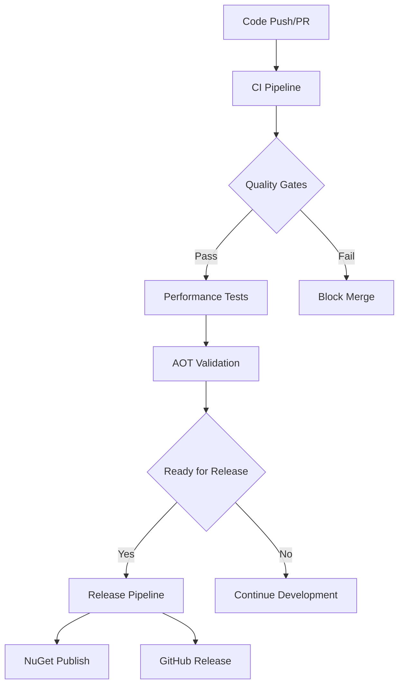

# GitHub Actions CI/CD Pipelines

This directory contains the comprehensive CI/CD pipeline configuration for Excalibur, implementing enterprise-grade DevOps practices for a .NET 9.0 cloud-native messaging framework.

## 🚀 Pipeline Overview

### Core Pipelines

| Workflow | Purpose | Triggers | Duration |
|----------|---------|----------|----------|
| **ci.yml** | Main CI pipeline with multi-platform builds, comprehensive testing, and quality gates | Push to main/develop, PRs | ~15-25 min |
| **release.yml** | Production release pipeline with NuGet publishing and GitHub releases | Version tags, manual dispatch | ~20-30 min |
| **performance-tests.yml** | Performance benchmarking with regression detection and baseline management | PRs, pushes, weekly schedule | ~30-45 min |
| **aot-validation.yml** | Ahead-of-Time compilation validation for native deployment scenarios | Code changes, manual dispatch | ~10-15 min |

## 📋 Detailed Pipeline Specifications

### 1. Continuous Integration (`ci.yml`)

**Enterprise-grade CI pipeline supporting:**

#### Build Validation
- **Multi-platform builds**: Ubuntu, Windows, macOS
- **Target Framework**: .NET 9.0
- **Build Configurations**: Release (optimized)
- **Package Validation**: NuGet package creation verification
- **Dependency Management**: Centralized package management with caching

#### Comprehensive Testing
- **Unit Tests**: 459+ tests across 29 test projects
- **Integration Tests**: Cloud provider integration validation
- **Functional Tests**: End-to-end scenario verification
- **Test Categories**: Filtered execution (Unit, Integration, Functional)
- **Parallel Execution**: Optimized test execution across platforms
- **Test Results**: TRX format with detailed reporting

#### Quality Gates
- **Code Coverage**: 60%+ threshold with detailed reporting
- **Security Analysis**: SARIF format security scanning
- **Static Analysis**: .NET analyzers and code quality tools
- **Coverage Reports**: HTML, Cobertura, and badge generation
- **Quality Metrics**: Assembly filters exclude test and benchmark projects

#### Performance Integration
- **Optional Performance Tests**: Triggered via input parameter or push events
- **Hot Path Validation**: Critical performance path benchmarks
- **Regression Detection**: Performance threshold monitoring

### 2. Release Pipeline (`release.yml`)

**Production-ready release automation:**

#### Pre-Release Validation
- **Version Validation**: Semantic versioning compliance (X.Y.Z format)
- **Release Readiness**: Critical test suite execution
- **Code Quality Checks**: Development placeholder scanning
- **Package Integrity**: Full solution package creation validation

#### Build & Package Management
- **Multi-Platform Packaging**: Windows and Linux package generation
- **Symbol Packages**: Debug symbols (.snupkg) generation
- **Package Validation**: Integrity checks and metadata verification
- **Version Stamping**: Consistent versioning across all artifacts

#### Security & Quality Gates
- **Security Scanning**: Package vulnerability assessment
- **SBOM Generation**: Software Bill of Materials for compliance
- **Package Analysis**: Content validation and documentation checks
- **Supply Chain Security**: Comprehensive artifact validation

#### Release Management
- **GitHub Releases**: Automated release creation with detailed notes
- **Asset Management**: Package archives and documentation
- **NuGet Publishing**: Automated publication to NuGet.org
- **Publication Verification**: Package availability confirmation

#### Post-Release Automation
- **Stakeholder Notification**: Automated release communication
- **Documentation Updates**: Release-specific documentation tasks
- **Baseline Updates**: Performance and quality baseline management

### 3. Performance Benchmarks (`performance-tests.yml`)

**Comprehensive performance validation:**

#### Hot Path Benchmarks
- **Critical Performance Paths**: Core messaging and dispatch operations
- **Multi-Platform Execution**: Linux and Windows performance baselines
- **Regression Detection**: Automated performance threshold monitoring
- **Detailed Profiling**: ETW profiler integration for Windows
- **Memory Analysis**: Allocation pattern validation

#### Memory Allocation Benchmarks
- **Allocation Tracking**: Comprehensive memory usage analysis
- **Pool Validation**: Object pooling efficiency measurement
- **Garbage Collection**: GC pressure and efficiency metrics
- **Memory Randomization**: Consistent measurement conditions

#### Throughput Benchmarks
- **Cloud Native Patterns**: Circuit breaker, retry, and backpressure performance
- **Serialization Performance**: JSON, MessagePack, and Protobuf benchmarking
- **Channel Performance**: High-throughput message processing validation
- **Scalability Testing**: Load and concurrency performance measurement

#### Performance Analysis
- **Automated Analysis**: Python-based statistical analysis
- **Trend Detection**: Historical performance comparison
- **Baseline Management**: Performance regression baseline updates
- **Reporting**: Comprehensive performance reports with visualizations

#### Baseline Management
- **Automated Baselines**: Performance baseline updates on main branch
- **Version Control**: Git-based baseline version management
- **Threshold Monitoring**: Automated alert generation for regressions

### 4. AOT Validation (`aot-validation.yml`)

**Native compilation readiness:**

#### Multi-Platform AOT Validation
- **Native Compilation**: Full AOT compilation across platforms
- **Trimming Analysis**: IL trimming warnings and compatibility
- **Binary Size Analysis**: Executable size optimization tracking
- **Runtime Compatibility**: Native runtime behavior validation

## 🔧 Configuration Standards

### Environment Variables
```yaml
env:
  DOTNET_SKIP_FIRST_TIME_EXPERIENCE: 1
  DOTNET_NOLOGO: true
  DOTNET_CLI_TELEMETRY_OPTOUT: 1
  COVERAGE_THRESHOLD: 60

# Setup .NET with all target frameworks
- name: Setup .NET
  uses: actions/setup-dotnet@v4
  with:
    dotnet-version: |
      8.0.x
      9.0.x
      10.0.x
```

### Caching Strategy
- **NuGet Packages**: Comprehensive package caching with Directory.Packages.props hash
- **Build Artifacts**: Optimized caching for faster pipeline execution
- **Cache Keys**: OS-specific and content-based cache invalidation

### Artifact Management
- **Retention Policies**: 30-90 days based on artifact importance
- **Naming Conventions**: Consistent artifact naming across pipelines
- **Compression**: Optimized artifact compression for storage efficiency

## 🚦 Quality Gates & Thresholds

### Code Coverage
- **Minimum Threshold**: 60% line coverage
- **Exclusions**: Test projects, benchmarks, examples
- **Reporting**: HTML reports with drill-down capability

### Performance Thresholds
- **Hot Path Performance**: < 1ms for critical operations
- **Memory Allocations**: Optimized pooling patterns
- **Throughput**: Baseline-relative performance validation

### Security Standards
- **Vulnerability Scanning**: Automated security analysis
- **Dependency Scanning**: Package vulnerability assessment
- **SARIF Reporting**: Industry-standard security reporting

## 🔄 Pipeline Dependencies



## 📊 Monitoring & Observability

### Pipeline Metrics
- **Build Success Rate**: Historical build success tracking
- **Test Coverage Trends**: Coverage evolution over time
- **Performance Baselines**: Performance regression tracking
- **Release Frequency**: Deployment velocity metrics

### Alerting
- **Build Failures**: Immediate notification for broken builds
- **Performance Regressions**: Automated alerts for performance degradation
- **Security Issues**: Critical security vulnerability notifications
- **Release Status**: Release pipeline success/failure notifications

## 🛠️ Maintenance & Updates

### Regular Maintenance Tasks
1. **Dependency Updates**: Monthly package version updates
2. **Baseline Refresh**: Quarterly performance baseline updates
3. **Security Patches**: Immediate security update application
4. **Tool Updates**: Regular CI/CD tool version management

### Configuration Management
- **Version Control**: All configuration changes tracked in Git
- **Review Process**: Mandatory review for pipeline changes
- **Testing**: Pipeline changes validated in feature branches
- **Documentation**: Comprehensive change documentation

## 📚 Best Practices Implemented

### DevOps Excellence
- **Infrastructure as Code**: All pipeline configuration version-controlled
- **Immutable Builds**: Consistent, reproducible build environments
- **Automated Testing**: Comprehensive test automation at all levels
- **Continuous Monitoring**: Real-time pipeline and application monitoring

### Performance Engineering
- **Shift-Left Performance**: Performance testing in CI/CD pipeline
- **Baseline Management**: Automated performance baseline maintenance
- **Regression Detection**: Immediate performance regression alerts
- **Optimization Tracking**: Quantified performance improvement tracking

### Security Integration
- **DevSecOps**: Security scanning integrated into CI/CD
- **Supply Chain Security**: Comprehensive dependency validation
- **Compliance**: Automated compliance checking and reporting
- **Vulnerability Management**: Automated vulnerability detection and remediation

## 🚀 Getting Started

### For Developers
1. **Local Development**: Ensure .NET 9.0 SDK is installed
2. **Testing**: Run `dotnet test` to execute the full test suite
3. **Performance**: Use `dotnet run --project benchmarks/Excalibur.Dispatch.Benchmarks/Excalibur.Dispatch.Benchmarks.csproj` for local benchmarking
4. **AOT Testing**: Build with `dotnet publish -c Release --self-contained -r <runtime>`

### For DevOps Engineers
1. **Secret Management**: Configure `NUGET_API_KEY` for NuGet publishing
2. **Permissions**: Ensure appropriate GitHub Actions permissions
3. **Monitoring**: Set up pipeline monitoring and alerting
4. **Maintenance**: Schedule regular pipeline maintenance windows

---

*This CI/CD pipeline configuration represents enterprise-grade DevOps practices optimized for .NET 9.0 cloud-native applications, ensuring reliability, performance, and security at scale.*
