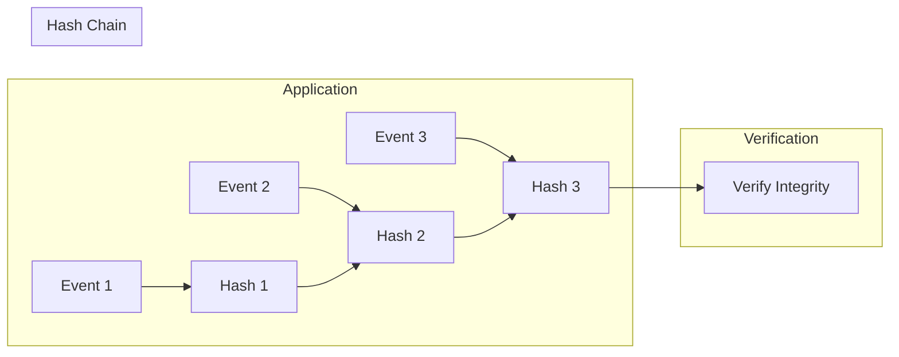

# Audit Logging

Dispatch provides tamper-evident audit logging with cryptographic hash chaining for compliance requirements including SOX, HIPAA, and GDPR accountability.

## Before You Start

- **.NET 8.0+** (or .NET 9/10 for latest features)
- Install the required packages:
  ```bash
  dotnet add package Excalibur.Dispatch.Security
  ```
- Familiarity with [security overview](../security/index.md) and [audit logging providers](../observability/audit-logging-providers.md)

## Overview



Each audit event includes a hash of the previous event, creating an immutable chain that detects tampering.

## Quick Start

### Configuration

```csharp
// Development/testing — in-memory store (no persistence)
services.AddAuditLogging();

// Production — SQL Server with inline options configuration
// Package: Excalibur.Dispatch.AuditLogging.SqlServer
services.AddSqlServerAuditStore(options =>
{
    options.ConnectionString = builder.Configuration.GetConnectionString("Compliance");
    options.SchemaName = "compliance";
    options.RetentionPeriod = TimeSpan.FromDays(7 * 365); // 7 years for SOC2
    options.EnableHashChain = true;
});

// Custom store — implement IAuditStore and register the type
services.AddAuditLogging<MyCustomAuditStore>();
```

### Log an Event

```csharp
public class OrderService
{
    private readonly IAuditStore _auditStore;

    public async Task<Order> CreateOrderAsync(
        CreateOrderCommand command,
        CancellationToken ct)
    {
        var order = new Order(command);
        await _repository.SaveAsync(order, ct);

        // Log the audit event
        await _auditStore.StoreAsync(new AuditEvent
        {
            EventId = Guid.NewGuid().ToString(),
            EventType = AuditEventType.DataModification,
            Action = "Order.Create",
            ActorId = _currentUser.Id,
            Outcome = AuditOutcome.Success,
            Timestamp = DateTimeOffset.UtcNow,
            ResourceId = order.Id.ToString(),
            ResourceType = "Order",
            TenantId = _currentTenant.Id
        }, ct);

        return order;
    }
}
```

## Audit Events

### Event Structure

```csharp
public sealed record AuditEvent
{
    // Required fields
    public required string EventId { get; init; }
    public required AuditEventType EventType { get; init; }
    public required string Action { get; init; }
    public required AuditOutcome Outcome { get; init; }
    public required DateTimeOffset Timestamp { get; init; }
    public required string ActorId { get; init; }

    // Optional actor details
    public string? ActorType { get; init; }
    public string? IpAddress { get; init; }
    public string? UserAgent { get; init; }
    public string? SessionId { get; init; }

    // Optional resource details
    public string? ResourceId { get; init; }
    public string? ResourceType { get; init; }
    public DataClassification? ResourceClassification { get; init; }

    // Context
    public string? TenantId { get; init; }
    public string? CorrelationId { get; init; }
    public string? Reason { get; init; }

    // Metadata (must not contain sensitive data values)
    public IReadOnlyDictionary<string, string>? Metadata { get; init; }

    // Hash chain (set by the audit store)
    public string? PreviousEventHash { get; init; }
    public string? EventHash { get; init; }
}
```

### Event Types

```csharp
public enum AuditEventType
{
    System = 0,
    Authentication = 1,
    Authorization = 2,
    DataAccess = 3,
    DataModification = 4,
    ConfigurationChange = 5,
    Security = 6,
    Compliance = 7,
    Administrative = 8,
    Integration = 9
}
```

### Outcomes

```csharp
public enum AuditOutcome
{
    Success = 0,
    Failure = 1,
    Denied = 2,
    Error = 3,
    Pending = 4
}
```

## Querying Audit Logs

### Basic Query

```csharp
var query = new AuditQuery
{
    StartDate = DateTimeOffset.UtcNow.AddDays(-7),
    EndDate = DateTimeOffset.UtcNow,
    MaxResults = 100
};

var events = await _auditStore.QueryAsync(query, ct);
```

### Filter by User

```csharp
var query = new AuditQuery
{
    ActorId = "user-12345",
    StartDate = DateTimeOffset.UtcNow.AddDays(-30),
    EndDate = DateTimeOffset.UtcNow
};

var userActivity = await _auditStore.QueryAsync(query, ct);
```

### Filter by Resource

```csharp
var query = new AuditQuery
{
    ResourceId = "order-abc123",
    ResourceType = "Order"
};

var resourceHistory = await _auditStore.QueryAsync(query, ct);
```

### Filter by Event Type

```csharp
var query = new AuditQuery
{
    EventTypes = [AuditEventType.DataModification, AuditEventType.Administrative],
    Outcomes = [AuditOutcome.Success]
};

var modifications = await _auditStore.QueryAsync(query, ct);
```

### Pagination

```csharp
var query = new AuditQuery
{
    StartDate = startDate,
    EndDate = endDate,
    MaxResults = 50,
    Skip = 100,  // Skip first 100 results
    OrderByDescending = true  // Newest first
};
```

### Count Results

```csharp
var count = await _auditStore.CountAsync(query, ct);
```

## Query Performance

Audit queries are optimized for indexed fields:

| Field | Indexed | Recommended Use |
|-------|---------|-----------------|
| StartDate/EndDate | Yes | Always include time range |
| ActorId | Yes | User activity reports |
| TenantId | Yes | Multi-tenant isolation |
| ResourceId | Yes | Resource history |
| CorrelationId | Yes | Request tracing |
| EventType | Yes | Filter by category |
| ResourceClassification | Yes | Sensitive data access |

### Performance Target

Queries should complete in under 5 seconds for 1M records when using indexed fields:

```csharp
var query = new AuditQuery
{
    StartDate = DateTimeOffset.UtcNow.AddDays(-1),
    EndDate = DateTimeOffset.UtcNow,
    ActorId = "user-12345",
    MaxResults = 1000
};

// Uses index on (ActorId, Timestamp DESC)
var events = await _auditStore.QueryAsync(query, ct);
```

## Integrity Verification

### Verify Hash Chain

```csharp
var result = await _auditStore.VerifyChainIntegrityAsync(
    startDate: DateTimeOffset.UtcNow.AddMonths(-1),
    endDate: DateTimeOffset.UtcNow,
    ct);

if (result.IsValid)
{
    _logger.LogInformation(
        "Audit chain verified: {TotalEventsValidated} events, no tampering detected",
        result.TotalEventsValidated);
}
else
{
    _logger.LogCritical(
        "AUDIT TAMPERING DETECTED: {CorruptedEvents} corrupted events found. {Message}",
        result.CorruptedEvents,
        result.Message);
}
```

### Integrity Result

```csharp
public sealed record AuditIntegrityResult
{
    public required string ValidationId { get; init; }
    public required bool IsValid { get; init; }
    public required long TotalEventsValidated { get; init; }
    public required long CorruptedEvents { get; init; }
    public required DateTimeOffset ValidatedAt { get; init; }
    public required long ExecutionTimeMs { get; init; }
    public string? Message { get; init; }
    public IReadOnlyList<string> CorruptedEventIds { get; init; }
    public IReadOnlyDictionary<string, string>? Details { get; init; }
    public IReadOnlyList<string>? Errors { get; init; }
}
```

## Multi-Tenant Isolation

Each tenant has an isolated hash chain:

```csharp
// Store with tenant isolation
await _auditStore.StoreAsync(new AuditEvent
{
    TenantId = "tenant-abc",
    // ...other properties
}, ct);

// Query within tenant
var query = new AuditQuery
{
    TenantId = "tenant-abc"
};

// Verify chain integrity (covers all tenants in the date range)
var result = await _auditStore.VerifyChainIntegrityAsync(
    startDate, endDate, ct);
```

## Database Schema

### SQL Server

```sql
CREATE SCHEMA [audit];

CREATE TABLE [audit].[AuditEvents] (
    -- Identity and ordering
    [SequenceNumber] BIGINT IDENTITY(1,1) NOT NULL,
    [EventId] NVARCHAR(64) NOT NULL,

    -- Event classification
    [EventType] INT NOT NULL,
    [Action] NVARCHAR(100) NOT NULL,
    [Outcome] INT NOT NULL,
    [Timestamp] DATETIMEOFFSET(7) NOT NULL,

    -- Actor information
    [ActorId] NVARCHAR(256) NOT NULL,
    [ActorType] NVARCHAR(50) NULL,

    -- Resource information
    [ResourceId] NVARCHAR(256) NULL,
    [ResourceType] NVARCHAR(100) NULL,
    [ResourceClassification] INT NULL,

    -- Context and correlation
    [TenantId] NVARCHAR(64) NULL,
    [CorrelationId] NVARCHAR(64) NULL,
    [SessionId] NVARCHAR(64) NULL,

    -- Source information
    [IpAddress] NVARCHAR(45) NULL,
    [UserAgent] NVARCHAR(500) NULL,

    -- Additional context
    [Reason] NVARCHAR(1000) NULL,
    [Metadata] NVARCHAR(MAX) NULL, -- JSON

    -- Hash chain integrity
    [PreviousEventHash] NVARCHAR(64) NULL, -- SHA-256 hex
    [EventHash] NVARCHAR(64) NOT NULL, -- SHA-256 hex

    CONSTRAINT [PK_AuditEvents] PRIMARY KEY CLUSTERED ([SequenceNumber] ASC),
    CONSTRAINT [UQ_AuditEvents_EventId] UNIQUE NONCLUSTERED ([EventId])
);

-- Performance indices
CREATE INDEX [IX_AuditEvents_Timestamp]
ON [audit].[AuditEvents] ([Timestamp] DESC)
INCLUDE ([EventId], [EventType], [ActorId], [Outcome]);

CREATE INDEX [IX_AuditEvents_ActorId_Timestamp]
ON [audit].[AuditEvents] ([ActorId], [Timestamp] DESC)
INCLUDE ([EventType], [Action], [ResourceId]);

CREATE INDEX [IX_AuditEvents_TenantId_Timestamp]
ON [audit].[AuditEvents] ([TenantId], [Timestamp] DESC)
WHERE [TenantId] IS NOT NULL;

CREATE INDEX [IX_AuditEvents_ResourceId_Timestamp]
ON [audit].[AuditEvents] ([ResourceId], [Timestamp] DESC)
WHERE [ResourceId] IS NOT NULL;

CREATE INDEX [IX_AuditEvents_CorrelationId]
ON [audit].[AuditEvents] ([CorrelationId])
WHERE [CorrelationId] IS NOT NULL;
```

## Integration Patterns

### Middleware Integration

```csharp
public class AuditMiddleware : IDispatchMiddleware
{
    private readonly IAuditStore _auditStore;

    public async ValueTask<IMessageResult> InvokeAsync(
        IDispatchMessage message,
        IMessageContext context,
        DispatchRequestDelegate next,
        CancellationToken ct)
    {
        var result = await next(message, context, ct);

        await _auditStore.StoreAsync(new AuditEvent
        {
            EventId = Guid.NewGuid().ToString(),
            EventType = DetermineEventType(message),
            Action = message.GetType().Name,
            ActorId = context.UserId,
            Outcome = result.IsSuccess
                ? AuditOutcome.Success
                : AuditOutcome.Failure,
            Timestamp = DateTimeOffset.UtcNow,
            ResourceId = ExtractResourceId(message),
            ResourceType = ExtractResourceType(message),
            CorrelationId = context.CorrelationId
        }, ct);

        return result;
    }
}
```

### Decorator Pattern

```csharp
public class AuditingOrderService : IOrderService
{
    private readonly IOrderService _inner;
    private readonly IAuditStore _auditStore;

    public async Task<Order> CreateOrderAsync(
        CreateOrderCommand command,
        CancellationToken ct)
    {
        var order = await _inner.CreateOrderAsync(command, ct);

        await _auditStore.StoreAsync(new AuditEvent
        {
            EventId = Guid.NewGuid().ToString(),
            EventType = AuditEventType.DataModification,
            Action = "Order.Create",
            ActorId = _currentUser.Id,
            Outcome = AuditOutcome.Success,
            Timestamp = DateTimeOffset.UtcNow,
            ResourceId = order.Id.ToString(),
            ResourceType = "Order"
        }, ct);

        return order;
    }
}
```

## Testing

### In-Memory Store

```csharp
[Fact]
public async Task Should_Query_Events_By_Date_Range()
{
    // Arrange
    var store = new InMemoryAuditStore();
    var now = DateTimeOffset.UtcNow;

    await store.StoreAsync(new AuditEvent
    {
        EventId = "evt-1",
        EventType = AuditEventType.DataAccess,
        Action = "Test.Old",
        ActorId = "user-1",
        Outcome = AuditOutcome.Success,
        Timestamp = now.AddDays(-2)
    }, CancellationToken.None);

    await store.StoreAsync(new AuditEvent
    {
        EventId = "evt-2",
        EventType = AuditEventType.DataAccess,
        Action = "Test.New",
        ActorId = "user-1",
        Outcome = AuditOutcome.Success,
        Timestamp = now
    }, CancellationToken.None);

    // Act
    var query = new AuditQuery
    {
        StartDate = now.AddDays(-1),
        EndDate = now.AddDays(1)
    };
    var results = await store.QueryAsync(query, CancellationToken.None);

    // Assert
    results.ShouldHaveSingleItem();
    results[0].Action.ShouldBe("Test.New");
}

[Fact]
public async Task Should_Detect_Tampering()
{
    // Arrange
    var store = new InMemoryAuditStore();
    // ... store events ...

    // Tamper with an event
    // ...

    // Act
    var result = await store.VerifyChainIntegrityAsync(
        startDate, endDate, CancellationToken.None);

    // Assert
    result.IsValid.ShouldBeFalse();
}
```

## Best Practices

| Practice | Recommendation |
|----------|----------------|
| Time range | Always include StartDate/EndDate in queries |
| Retention | Match regulatory requirements (7 years for SOX) |
| Integrity checks | Run daily verification of hash chain |
| Sensitive data | Mask PII/PHI before logging |
| Performance | Use indexed fields for queries |
| Multi-tenant | Always include TenantId for isolation |

## Compliance Mapping

| Standard | Requirement | Feature |
|----------|-------------|---------|
| SOX | Audit trail for financial systems | Full event logging with hash chain |
| HIPAA | Access logs for PHI | ActorId, ResourceId, Classification |
| GDPR | Processing records | Timestamp, Action, Outcome |
| PCI-DSS | Cardholder data access logs | ResourceType filtering |

## Next Steps

- [Data Masking](data-masking.md) - PII/PHI protection
- [GDPR Erasure](gdpr-erasure.md) - Right to be forgotten

## See Also

- [Security Overview](../security/index.md) - Security architecture and threat model
- [Compliance Overview](index.md) - Compliance framework capabilities
- [GDPR Erasure](gdpr-erasure.md) - Right to be forgotten with cryptographic deletion
- [Audit Logging Providers](../observability/audit-logging-providers.md) - Provider configuration for audit sinks
