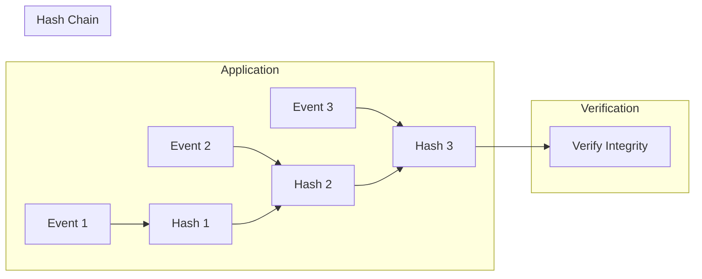
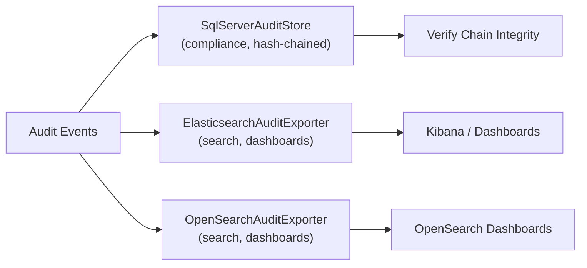

# Audit Logging

:::warning Not legal advice

This page describes technical features that can **support** your compliance work. It is not legal
advice, and it does not establish that any system is compliant with any law, regulation or standard.
You remain responsible for your own compliance assessment, independent testing and validation, and
review by qualified legal and compliance professionals. See the [Compliance Disclaimer](../legal/compliance-disclaimer.md).
:::

Dispatch provides tamper-evident audit logging with cryptographic hash chaining for compliance requirements including SOX, HIPAA, and GDPR accountability.

## Before You Start

- **.NET 10.0**
- Install the required packages:
  ```bash
  dotnet add package Excalibur.AuditLogging
  # plus a store, for anything beyond development:
  dotnet add package Excalibur.AuditLogging.SqlServer   # or Excalibur.AuditLogging.Postgres
  ```
- Familiarity with [security overview](../security/index.md) and [audit logging providers](../observability/audit-logging-providers.md)

## Overview


```mermaid
flowchart LR
    subgraph Application
        E1[Event 1] --> H1[Hash 1]
        E2[Event 2] --> H2[Hash 2]
        E3[Event 3] --> H3[Hash 3]
    end

    subgraph Chain["Hash Chain"]
        H1 --> H2
        H2 --> H3
    end

    subgraph Verification
        V[Verify Integrity]
        H3 --> V
    end
```

Each audit event includes a hash of the previous event, creating an immutable chain that detects tampering.

## Quick Start

### Configuration

```csharp
// Registers AuditMiddleware and the request-context services it needs
// (IActivityContext, ICorrelationId, IETag, IClientAddress).
// It does NOT register an audit store, an annotation store, or IAuditContext —
// call AddAuditLogging(), AddAuditAnnotations() and AddAuditContext() for those.
services.AddExcalibur(excalibur => excalibur.AddAudit());

// Development/testing — in-memory store (no persistence), manual composition
services.AddAuditLogging();

// Production — SQL Server with inline options configuration
// Package: Excalibur.AuditLogging.SqlServer
services.AddSqlServerAuditStore(options =>
{
    options.ConnectionString = builder.Configuration.GetConnectionString("Compliance");
    options.SchemaName = "audit";   // matches the schema 001_CreateAuditSchema.sql creates
    options.EnableHashChain = true;
});

// Scheduled deletion is a SEPARATE registration. Registering the store alone
// stores audit events forever — see Retention below.
services.AddAuditRetention(options =>
{
    options.RetentionPeriod = TimeSpan.FromDays(7 * 365); // 7 years for SOC2
    options.CleanupInterval = TimeSpan.FromDays(1);
});

// Custom store — implement IAuditStore and register the type
services.AddAuditLogging<MyCustomAuditStore>();

// Annotations — enrich stored events with tags, bookmarks, notes
services.AddSqlServerAuditAnnotationStore(options =>
{
    options.ConnectionString = configuration.GetConnectionString("Compliance");
});

// Assertions — scoped audit context for handlers
services.AddAuditContext();
```

### Log an Event

```csharp
public class OrderService
{
    private readonly IAuditStore _auditStore;

    public async Task<Order> CreateOrderAsync(
        CreateOrderCommand command,
        CancellationToken ct)
    {
        var order = new Order(command);
        await _repository.SaveAsync(order, ct);

        // Log the audit event
        await _auditStore.StoreAsync(new AuditEvent
        {
            EventId = Guid.NewGuid().ToString(),
            EventType = AuditEventType.DataModification,
            Action = "Order.Create",
            ActorId = _currentUser.Id,
            Outcome = AuditOutcome.Success,
            Timestamp = DateTimeOffset.UtcNow,
            ResourceId = order.Id.ToString(),
            ResourceType = "Order",
            TenantId = _currentTenant.Id
        }, ct);

        return order;
    }
}
```

## Audit Events

### Event Structure

```csharp
public sealed record AuditEvent
{
    // Required fields
    public required string EventId { get; init; }
    public required AuditEventType EventType { get; init; }
    public required string Action { get; init; }
    public required AuditOutcome Outcome { get; init; }
    public required DateTimeOffset Timestamp { get; init; }
    public required string ActorId { get; init; }

    // Optional actor details
    public string? ActorType { get; init; }
    public string? IpAddress { get; init; }
    public string? UserAgent { get; init; }
    public string? SessionId { get; init; }

    // Optional resource details
    public string? ResourceId { get; init; }
    public string? ResourceType { get; init; }
    public DataClassification? ResourceClassification { get; init; }

    // Context
    public string? TenantId { get; init; }
    public string? ApplicationName { get; init; }
    public string? CorrelationId { get; init; }
    public string? Reason { get; init; }

    // Metadata (must not contain sensitive data values)
    public IReadOnlyDictionary<string, string>? Metadata { get; init; }

    // Hash chain (set by the audit store)
    public string? PreviousEventHash { get; init; }
    public string? EventHash { get; init; }
}
```

### Event Types

```csharp
public enum AuditEventType
{
    System = 0,
    Authentication = 1,
    Authorization = 2,
    DataAccess = 3,
    DataModification = 4,
    ConfigurationChange = 5,
    Security = 6,
    Compliance = 7,
    Administrative = 8,
    Integration = 9
}
```

### Outcomes

```csharp
public enum AuditOutcome
{
    Success = 0,
    Failure = 1,
    Denied = 2,
    Error = 3,
    Pending = 4
}
```

## Querying Audit Logs

### Basic Query

```csharp
var query = new AuditQuery
{
    StartDate = DateTimeOffset.UtcNow.AddDays(-7),
    EndDate = DateTimeOffset.UtcNow,
    MaxResults = 100
};

var events = await _auditStore.QueryAsync(query, ct);
```

### Filter by User

```csharp
var query = new AuditQuery
{
    ActorId = "user-12345",
    StartDate = DateTimeOffset.UtcNow.AddDays(-30),
    EndDate = DateTimeOffset.UtcNow
};

var userActivity = await _auditStore.QueryAsync(query, ct);
```

:::warning This query is refused if you encrypt `ActorId`
`UseAuditLogEncryption()` encrypts `ActorId` by default, and an encrypted `ActorId` cannot be filtered
on — the call throws `NotSupportedException` rather than returning an empty list. The same applies to
`IpAddress`. See [Encryption costs you the ability to query by that
field](#encryption-costs-you-the-ability-to-query-by-that-field).
:::

### Filter by Application

In shared audit backends, filter events by the producing application:

```csharp
var query = new AuditQuery
{
    ApplicationName = "OrderService",
    StartDate = DateTimeOffset.UtcNow.AddDays(-7),
    EndDate = DateTimeOffset.UtcNow
};

var appEvents = await _auditStore.QueryAsync(query, ct);
```

:::tip

`ApplicationName` is whatever you set on the `AuditEvent`. **It is not populated for you** — an event stored
without one is stored with `NULL`. Set it explicitly if you share an audit backend between applications, so
that chain scoping and filtering can tell them apart.
:::

### Filter by Resource

```csharp
var query = new AuditQuery
{
    ResourceId = "order-abc123",
    ResourceType = "Order"
};

var resourceHistory = await _auditStore.QueryAsync(query, ct);
```

### Filter by Event Type

```csharp
var query = new AuditQuery
{
    EventTypes = [AuditEventType.DataModification, AuditEventType.Administrative],
    Outcomes = [AuditOutcome.Success]
};

var modifications = await _auditStore.QueryAsync(query, ct);
```

### Pagination

```csharp
var query = new AuditQuery
{
    StartDate = startDate,
    EndDate = endDate,
    MaxResults = 50,
    Skip = 100,  // Skip first 100 results
    OrderByDescending = true  // Newest first
};
```

### Count Results

```csharp
var count = await _auditStore.CountAsync(query, ct);
```

## Query Performance

Audit queries are optimized for indexed fields:

| Field | Indexed | Recommended Use |
|-------|---------|-----------------|
| StartDate/EndDate | Yes | Always include time range |
| ActorId | Yes | User activity reports — **unavailable if you encrypt it**, see below |
| TenantId | Yes | Backs the ambient tenant predicate applied to every search |
| ApplicationName | Yes | Multi-app shared backends |
| ResourceId | Yes | Resource history |
| CorrelationId | Yes | Request tracing |
| EventType | Yes | Filter by category |
| ResourceClassification | Yes | Sensitive data access |

### Query Shape

The indexes are shaped for time-bounded, actor-scoped reads. **No query-latency figure is published here** —
none is measured in this framework's own suite, and the number that matters is the one your data volume and
your hardware produce:

```csharp
var query = new AuditQuery
{
    StartDate = DateTimeOffset.UtcNow.AddDays(-1),
    EndDate = DateTimeOffset.UtcNow,
    ActorId = "user-12345",
    MaxResults = 1000
};

// Uses index on (ActorId, Timestamp DESC)
var events = await _auditStore.QueryAsync(query, ct);
```

## Encryption costs you the ability to query by that field

`UseAuditLogEncryption()` decorates your audit store so chosen fields are encrypted before they reach it.
**Encrypting a field costs you the ability to filter on it, and the framework tells you so rather than
answering nothing.**

```csharp
services.AddAuditLogging()
    .UseAuditLogEncryption(options =>
    {
        options.EncryptActorId  = true;   // default
        options.EncryptIpAddress = true;  // default
        options.EncryptReason    = false; // default
        options.EncryptUserAgent = false; // default
    });
```

### Why a filter cannot work

The cipher is **randomized** authenticated encryption. Two records holding the same actor id hold
*different* ciphertext, so a server-side `=` against the plaintext you supplied matches neither of them.
There is no index that fixes this and no query rewrite that recovers it — the property that makes the
value unreadable to someone holding your database is the same property that makes it unmatchable.

### What happens instead of an empty result

`QueryAsync` and `CountAsync` throw `NotSupportedException`, naming the field and the option that governs
it, **before** the query reaches the store:

```
The audit store cannot filter by 'ActorId' because that field is encrypted at rest.
Encryption here is randomized, so two records holding the same value hold different
ciphertext and no comparison against the plaintext you supplied can match either of them.
Answering this query would return an empty result set that reads as 'no such events'
while the events are present. Set AuditEncryptionOptions.EncryptActorId to false to store
'ActorId' in the clear and keep it searchable, or filter on a field that is not encrypted.
```

The alternative was an empty list — and an empty list from an audit trail reads as *"this actor did
nothing"* while the records sit present and unmatchable. A zero from `CountAsync` is worse still: it
carries no hint that anything was withheld. **Silence is the one answer an audit trail must never give.**
You may be told no; you may not be told a falsehood.

### Which fields cost you what

| Option | Default | Matching query filter | What you lose while it is on |
| --- | --- | --- | --- |
| `EncryptActorId` | `true` | `AuditQuery.ActorId` | **Actor-scoped query** — *"what did this user do?"* |
| `EncryptIpAddress` | `true` | `AuditQuery.IpAddress` | **Address-scoped query** — *"what came from this address?"* |
| `EncryptReason` | `false` | none | Nothing. There is no filter over it to lose. |
| `EncryptUserAgent` | `false` | none | Nothing. There is no filter over it to lose. |

**Read the first two rows carefully before you enable encryption.** On the shipped defaults, turning
encryption on removes actor-scoped and address-scoped audit query outright — it does not degrade them.
If *"what did this actor do"* is a question your trail has to answer — and for most access-review,
incident-response, and regulator-facing workflows it is — set `EncryptActorId = false`. That field is
then stored in the clear and readable by anyone with database access. Both halves of that trade are
real; pick per field, with the question you will actually be asked in mind.

Encrypted values are still **decrypted on read**, so events you retrieve by any other filter come back
with readable `ActorId` and `IpAddress`. It is only the *server-side comparison* that is impossible.

:::tip This mirrors what your database engine already offers
It is the same distinction an engine draws between a deterministically-encrypted column — searchable,
and equal values are visibly equal to anyone holding the ciphertext — and a randomized one, which is not
searchable and whose queries fail. Nothing here is unusual; it is just made explicit rather than silent.
:::

## Integrity Verification

### Verify Hash Chain

```csharp
var result = await _auditStore.VerifyChainIntegrityAsync(
    startDate: DateTimeOffset.UtcNow.AddMonths(-1),
    endDate: DateTimeOffset.UtcNow,
    ct);

switch (result.Outcome)
{
    case AuditIntegrityOutcome.Verified:
        _logger.LogInformation(
            "Audit chain verified: {EventsVerified} events, no tampering detected",
            result.EventsVerified);
        break;

    case AuditIntegrityOutcome.ViolationsDetected:
        _logger.LogCritical(
            "AUDIT TAMPERING DETECTED: {CompromisedChainCount} compromised chain(s), first at event {FirstViolationEventId}. {ViolationDescription}",
            result.CompromisedChainCount,
            result.FirstViolationEventId,
            result.ViolationDescription);
        break;

    case AuditIntegrityOutcome.NoEventsInScope:
        // Nothing was examined, so nothing is attested. This is not a pass: an empty window
        // may simply mean no activity, or it may mean audit events are not reaching the store.
        _logger.LogWarning(
            "Audit chain verification examined no events in the requested window; this period "
            + "provides no evidence of integrity.");
        break;
}
```

### Integrity Result

```csharp
public enum AuditIntegrityOutcome
{
    // The default is the non-claiming value, so a defaulted result can never read as Verified.
    NoEventsInScope = 0,
    Verified = 1,
    ViolationsDetected = 2,
}

public sealed record AuditIntegrityResult
{
    public AuditIntegrityOutcome Outcome { get; }
    public long EventsVerified { get; }
    public DateTimeOffset StartDate { get; }
    public DateTimeOffset EndDate { get; }
    public DateTimeOffset VerifiedAt { get; }

    // Populated only when Outcome is ViolationsDetected.
    public string? FirstViolationEventId { get; }
    public string? ViolationDescription { get; }

    // The store's chaining units that failed, one per unit however many records within it are
    // affected. Read it with IsHashChained, which says what the unit is: with chaining on a unit is
    // a chain; with chaining off the store chains nothing and each record is its own unit.
    public int CompromisedChainCount { get; }

    // False means only each record's own content integrity was tested. Deletion, insertion and
    // reordering are undetectable while chaining is off, so a zero count is not evidence against them.
    public bool IsHashChained { get; }
}
```

## Duplicate event IDs

Storing an event whose `EventId` already exists raises `InvalidOperationException`, consistently
across the in-memory, SQL Server, and PostgreSQL stores:

```csharp
try
{
    await auditStore.StoreAsync(auditEvent, cancellationToken);
}
catch (InvalidOperationException)
{
    // The event id was already stored. A retrying publisher is the usual way to hit
    // this: the retry re-stores an event the first attempt already committed.
}
```

The SQL providers translate their driver's unique-constraint violation
(`Microsoft.Data.SqlClient.SqlException` / `Npgsql.PostgresException`) into this exception rather
than letting it escape, so catching `InvalidOperationException` is sufficient — you do not need to
also reference either database driver's exception types.

## Retention

### What deletes, and when

Registering an audit store does **not** schedule any deletion. Nothing is ever removed until you
also call `AddAuditRetention(...)`, which is what registers the background service that performs
the sweep:

```csharp
services.AddSqlServerAuditStore(options => { /* … */ });   // stores events. Deletes nothing.

services.AddAuditRetention(options =>                      // this is what deletes.
{
    options.RetentionPeriod = TimeSpan.FromDays(7 * 365);
    options.CleanupInterval = TimeSpan.FromDays(1);
});
```

Once retention is registered, automatic enforcement is **on by default** and you do not have to
call anything: the background service wakes on `CleanupInterval` and deletes every event older
than `RetentionPeriod`. Setting `EnableRetentionEnforcement = false` genuinely prevents that
scheduled deletion — the service returns without deleting and logs that enforcement is disabled.
It does not merely stop reporting.

The manual purge remains available regardless of that flag, so a host that disables the schedule
can still purge on its own trigger — a maintenance window, an operator action, or a job it
controls.

### Which options the sweep actually reads

`AddAuditRetention` binds `AuditRetentionOptions`, and that is the type the enforcing service
reads. `SqlServerAuditOptions.Retention` is a different type with overlapping property names, and
only some of its properties reach the sweep. Set the retention window on `AuditRetentionOptions`:

| Property you set | Effect |
|------------------|--------|
| `AuditRetentionOptions.RetentionPeriod` | The cutoff the scheduled sweep deletes behind. |
| `AuditRetentionOptions.CleanupInterval` | How often the sweep runs. |
| `AuditRetentionOptions.EnableRetentionEnforcement` | Honoured; `true` by default. |
| `SqlServerAuditOptions.Retention.EnableRetentionEnforcement` | Projected onto the option above, so setting either works. |
| `SqlServerAuditOptions.Retention.RetentionPeriod` | Projected onto the option above, so setting either works. |
| `SqlServerAuditOptions.Retention.CleanupInterval` | Projected onto the option above, so setting either works. |
| `SqlServerAuditOptions.Retention.CleanupBatchSize` | The SQL Server store's own delete batch size. |

Each projection carries a value only when it differs from the SQL Server block's own default, so
registering the store never replaces a window you already set on `AuditRetentionOptions`. If you set the
same property to a non-default value in **both** places, the registration you call **last** wins — so set
each value in exactly one place.

### A store that cannot delete fails loudly

The sweep resolves `IAuditPurgeCapability` from the registered store. A store that does not provide
it causes enforcement to throw rather than log a completed pass, because a retention control that
reports success while deleting nothing is a worse outcome than one that stops. SQL Server and PostgreSQL both provide this
capability, so scheduled retention works against either. A store that does not provide it — including the
in-memory store — is what causes enforcement to throw. `AddAuditRetention`
additionally installs a startup gate that fails closed on a volatile (in-memory) audit store,
unless the host opts in with `AuditLoggingOptions.AllowVolatileAuditStore = true`.

### Manual purge

```csharp
// Manual retention cleanup — available whether or not the schedule is enabled
var store = serviceProvider.GetRequiredService<IAuditStore>();

if (store.GetService(typeof(IAuditPurgeCapability)) is IAuditPurgeCapability purge)
{
    var cutoffDate = DateTimeOffset.UtcNow.AddYears(-7);
    var deleted = await purge.PurgeExpiredAsync(cutoffDate, cancellationToken);
    Console.WriteLine($"Deleted {deleted} audit events");
}
```

## Multi-Tenant Isolation

:::warning Reads are tenant-scoped and fail closed; chain verification is estate-wide by signature

Read this before relying on audit isolation in a multi-tenant deployment or citing it as a control. The
scoping guarantee is **per read method**, not blanket — and the two methods it does not cover are the ones
most easily mistaken for covered.

**`QueryAsync` and `CountAsync` are scoped from ambient context, and they fail closed.** The tenant
predicate is taken from the registered tenant context, never from the query object, so a caller cannot
widen a read by omitting a tenant nor redirect it by naming another one. If multi-tenancy is registered
but resolves no tenant, the read raises `TenantRequiredException` rather than widening. With no
multi-tenancy registered at all, reads bind the reserved untenanted partition. `GetLastEventAsync` is
scoped the same way.

The predicate is `NULL`-safe: a row whose `TenantId` column is `NULL` and the reserved untenanted sentinel
name the same partition, so an untenanted caller reads its own rows rather than nothing.

**`GetByIdAsync` is tenant-scoped too.** An event stored under another tenant is reported as **not found**, on
the SQL Server, PostgreSQL and in-memory stores alike. An identifier alone does not address an event — it is
addressed by identifier *within* the ambient tenant, so holding an audit event id obtained from a log line, an
export, or a correlation trail does not grant access to it. You do not need to re-check the returned event's
`TenantId` yourself.

**`VerifyChainIntegrityAsync(startDate, endDate, ct)` takes no tenant argument** and verifies across every
tenant in the range. Its result attests the integrity of the whole chain, not of a single tenant's slice, so
do not present it to a tenant as evidence about their own data, and treat it as an operator-level operation
regardless of who can currently call it.

**The scope is a property of the store, and it is stated per store** in the package's `ARCHITECTURE.md`:
estate-wide, enumerated per partition, on the SQL Server and PostgreSQL stores; confined to the ambient
tenant on the in-memory store. So the breadth is deliberate on the two production stores, and the default
in-memory store behaves differently from both — do not infer one from the other.

To restrict who may call it, register `AddRbacAuditStore()`, which requires `ComplianceOfficer` or above and
writes a meta-audit record of every verification.

**What conformance enforces.** The shipped audit-store conformance kit exercises tenant scoping on
`QueryAsync` — that an unscoped query does not return another tenant's events, and that a scoped caller
still receives its **own** — plus `GetLastEventAsync` and `GetByIdAsync` (another tenant's event reported as
not found, a caller's own event still returned). A caller cannot name a tenant on a query at all: `AuditQuery`
has no tenant member, so there is no such arm and no such call.

Chain verification **is** covered, by five arms — including one over an intact trail interleaving two
tenants. Every arm above runs against real SQL Server and PostgreSQL containers.
:::

Each tenant has an isolated hash chain:

```csharp
// Store with tenant isolation
await _auditStore.StoreAsync(new AuditEvent
{
    TenantId = "tenant-abc",
    // ...other properties
}, ct);

// Search is scoped from ambient context — no TenantId on the query is needed,
// and supplying another tenant's will not reach it.
var query = new AuditQuery();

// Verify chain integrity (covers all tenants in the date range)
var result = await _auditStore.VerifyChainIntegrityAsync(
    startDate, endDate, ct);
```

## Database Schema

### SQL Server

The shipped provisioning script is the single source for this schema:
`Excalibur.AuditLogging.SqlServer/Scripts/001_CreateAuditSchema.sql`. **Run it rather than copying DDL
out of this page** — an earlier revision of this page carried a copy that had drifted, and the warning
below exists because consumers provisioned from it.

What the script creates, so you know what to expect:

- An `[audit]` schema, an `[AuditEvents]` table and an `[AuditAnnotations]` table.
- `TenantId` `NOT NULL` with an explicit untenanted sentinel default and a binary collation, so
  "global" and "the caller forgot" stay distinguishable.
- `PreviousEventHash` and `EventHash` as `NVARCHAR(512)` — see the warning below for why the width
  matters.
- Indexes on `(ActorId, Timestamp DESC)`, `(TenantId, Timestamp DESC)`, `(ApplicationName, …)`,
  `(ResourceId, …)`, `(CorrelationId)`, `(EventType, …)`, `(ResourceClassification, …)`, the
  sequence/hash pair used by chain verification, and a cleanup index on `Timestamp`.
- A foreign key from `[AuditAnnotations].[EventId]` to `[AuditEvents].[EventId]` with
  `ON DELETE CASCADE`. **That constraint is what makes annotation tenancy sound** — annotations carry
  no `TenantId` of their own and derive it by joining the event — so it is a correctness constraint,
  not housekeeping. Do not provision the annotation table without it.

:::warning `PreviousEventHash` and `EventHash` are not SHA-256 hex digests

They hold a versioned, keyed tag of the form `v1:{keyId}:{base64-encoded HMAC-SHA256}` — at minimum
49 characters (`v1:` + a one-character key id + `:` + the 44-character base64 MAC), and unbounded on
the high end because `{keyId}` comes from your key provider. `NVARCHAR(512)` is the width the shipped
provisioning script (`Excalibur.AuditLogging.SqlServer/Scripts/001_CreateAuditSchema.sql`) uses.

**The key id must not contain a colon.** The tag is colon-delimited, so a key id carrying one is
rejected at write time with an `InvalidOperationException`. That rules out a raw AWS KMS key ARN or a
Key Vault key URI as the id — return a colon-free identifier (a key alias, a GUID, a version label)
from your `IAuditSigningKeyProvider` and map it to the real key yourself.

**If you provisioned this table by copying an earlier version of this page**, the columns may still
be `NVARCHAR(64)`, in which case every tag longer than 64 characters is truncated or rejected on
write depending on your `ANSI_WARNINGS` setting. Widen them before writing any more events:

```sql
ALTER TABLE [audit].[AuditEvents] ALTER COLUMN [PreviousEventHash] NVARCHAR(512) NULL;
ALTER TABLE [audit].[AuditEvents] ALTER COLUMN [EventHash] NVARCHAR(512) NOT NULL;
```

Widening the column does **not** repair events already written while it was too narrow. A truncated
tag cannot be recomputed after the fact — the signing key is used only at write time, and neither the
truncated value nor anything else on the row can reconstruct what the full tag would have been. Rows
written before the widening remain unverifiable; treat any chain verification spanning them as
covering an unrepaired gap, not a clean trail.

:::

## Integration Patterns

### Middleware Integration

```csharp
public class AuditMiddleware : IDispatchMiddleware
{
    // Stage has no default on the interface — a middleware that omits it does not compile.
    public DispatchMiddlewareStage? Stage => DispatchMiddlewareStage.PostProcessing;

    private readonly IAuditStore _auditStore;

    public async ValueTask<IMessageResult> InvokeAsync(
        IDispatchMessage message,
        IMessageContext context,
        DispatchRequestDelegate next,
        CancellationToken ct)
    {
        var result = await next(message, context, ct);

        await _auditStore.StoreAsync(new AuditEvent
        {
            EventId = Guid.NewGuid().ToString(),
            EventType = DetermineEventType(message),
            Action = message.GetType().Name,
            ActorId = context.GetUserId() ?? "system",
            Outcome = result.Succeeded
                ? AuditOutcome.Success
                : AuditOutcome.Failure,
            Timestamp = DateTimeOffset.UtcNow,
            ResourceId = ExtractResourceId(message),
            ResourceType = ExtractResourceType(message),
            CorrelationId = context.CorrelationId
        }, ct);

        return result;
    }
}
```

### Decorator Pattern

```csharp
public class AuditingOrderService : IOrderService
{
    private readonly IOrderService _inner;
    private readonly IAuditStore _auditStore;

    public async Task<Order> CreateOrderAsync(
        CreateOrderCommand command,
        CancellationToken ct)
    {
        var order = await _inner.CreateOrderAsync(command, ct);

        await _auditStore.StoreAsync(new AuditEvent
        {
            EventId = Guid.NewGuid().ToString(),
            EventType = AuditEventType.DataModification,
            Action = "Order.Create",
            ActorId = _currentUser.Id,
            Outcome = AuditOutcome.Success,
            Timestamp = DateTimeOffset.UtcNow,
            ResourceId = order.Id.ToString(),
            ResourceType = "Order"
        }, ct);

        return order;
    }
}
```

## Testing

### In-Memory Store

```csharp
[Fact]
public async Task Should_Query_Events_By_Date_Range()
{
    // Arrange
    var store = new ServiceCollection().AddLogging().AddAuditLogging()
        .BuildServiceProvider().GetRequiredService<IAuditStore>();
    var now = DateTimeOffset.UtcNow;

    await store.StoreAsync(new AuditEvent
    {
        EventId = "evt-1",
        EventType = AuditEventType.DataAccess,
        Action = "Test.Old",
        ActorId = "user-1",
        Outcome = AuditOutcome.Success,
        Timestamp = now.AddDays(-2)
    }, CancellationToken.None);

    await store.StoreAsync(new AuditEvent
    {
        EventId = "evt-2",
        EventType = AuditEventType.DataAccess,
        Action = "Test.New",
        ActorId = "user-1",
        Outcome = AuditOutcome.Success,
        Timestamp = now
    }, CancellationToken.None);

    // Act
    var query = new AuditQuery
    {
        StartDate = now.AddDays(-1),
        EndDate = now.AddDays(1)
    };
    var results = await store.QueryAsync(query, CancellationToken.None);

    // Assert
    results.ShouldHaveSingleItem();
    results[0].Action.ShouldBe("Test.New");
}

[Fact]
public async Task Should_Detect_Tampering()
{
    // Arrange
    var store = new ServiceCollection().AddLogging().AddAuditLogging()
        .BuildServiceProvider().GetRequiredService<IAuditStore>();
    // ... store events ...

    // Tamper with an event
    // ...

    // Act
    var result = await store.VerifyChainIntegrityAsync(
        startDate, endDate, CancellationToken.None);

    // Assert
    result.Outcome.ShouldBe(AuditIntegrityOutcome.ViolationsDetected);
}
```

## Best Practices

| Practice | Recommendation |
|----------|----------------|
| Time range | Always include StartDate/EndDate in queries |
| Retention | Call `AddAuditRetention(...)`; registering a store alone deletes nothing |
| Integrity checks | Run daily verification of hash chain |
| Sensitive data | Mask PII/PHI before logging |
| Performance | Use indexed fields for queries |
| Multi-tenant | Reads are scoped from ambient context and fail closed; treat chain verification as operator-level |

## Compliance Mapping

| Standard | Requirement | Feature |
|----------|-------------|---------|
| SOX | Audit trail for financial systems | Full event logging with hash chain |
| HIPAA | Access logs for PHI | ActorId, ResourceId, Classification |
| GDPR | Processing records | Timestamp, Action, Outcome |
| PCI-DSS | Cardholder data access logs | ResourceType filtering |

## Provider Compliance Boundary

:::warning Not All Backends Are Compliance-Grade

Elasticsearch and OpenSearch are **audit sinks** -- write-only, search-optimized projections. They do **not** implement `IAuditStore` and cannot provide tamper-evident hash chain verification.
:::

Only backends that can guarantee monotonic sequencing, document immutability, and transactional atomicity qualify as `IAuditStore` implementations:

**What the framework provides is detection, not prevention.** Both SQL stores chain each record to its
predecessor with a keyed HMAC over a database-generated sequence, so a modified, inserted or removed record
is *detectable* by `VerifyChainIntegrityAsync`. Preventing writes in the first place is a database
permission decision you make — the shipped provisioning scripts create the tables and indexes and grant
nothing; neither issues a `DENY` or `REVOKE`.

| Backend | Role | Hash Chain | Tamper-Evident | Compliance-Grade |
|---------|------|-----------|----------------|------------------|
| **SQL Server** | `IAuditStore` | Yes | Yes (keyed HMAC chain over an `IDENTITY` sequence) | Yes |
| **PostgreSQL** | `IAuditStore` | Yes | Yes (keyed HMAC chain over a `BIGSERIAL` sequence) | Yes |
| **Elasticsearch** | Audit Sink | No | No (mutable documents) | No |
| **OpenSearch** | Audit Sink | No | No (mutable documents) | No |

### Why Elasticsearch/OpenSearch Cannot Be Compliance Stores

1. **No monotonic sequencing** -- wall-clock timestamps, not database IDENTITY columns
2. **Documents are mutable** -- anyone with cluster access can PUT/DELETE
3. **Eventually consistent reads** -- NRT refresh delay means stale hash chain reads
4. **No transactional atomicity** -- HTTP calls, not database transactions
5. **ILM/ISM can delete indexes** -- silently destroying audit records

### Recommended Architecture


```mermaid
flowchart LR
    AE[Audit Events] --> SQL["SqlServerAuditStore<br/>(compliance, hash-chained)"]
    AE --> ES["ElasticsearchAuditExporter<br/>(search, dashboards)"]
    AE --> OS["OpenSearchAuditExporter<br/>(search, dashboards)"]

    SQL --> V[Verify Chain Integrity]
    ES --> K[Kibana / Dashboards]
    OS --> OSD[OpenSearch Dashboards]
```

Consumers who need both compliance **and** search should register SQL as their `IAuditStore` and ES/OS as an `IAuditLogExporter`. The exporter receives copies for fast full-text search, dashboards, and alerting. SQL is the source of truth for chain verification and regulatory compliance.

## Audit Event Annotations

Annotations let auditors enrich stored events with tags, bookmarks, and notes without modifying the original event or its hash chain. Each annotation is a separate record linked by event ID.

### Packages

| Package | Purpose |
|---------|---------|
| `Excalibur.AuditLogging` | In-memory store + RBAC decorator |
| `Excalibur.AuditLogging.SqlServer` | SQL Server persistence |

### Configuration

```csharp
// In-memory (development/testing)
services.AddAuditAnnotations();

// SQL Server (production)
// Package: Excalibur.AuditLogging.SqlServer
services.AddSqlServerAuditAnnotationStore(options =>
{
    options.ConnectionString = builder.Configuration.GetConnectionString("Compliance");
    options.SchemaName = "audit";        // default
    options.TableName = "AuditAnnotations"; // default
    options.CommandTimeoutSeconds = 30;  // default
});

// RBAC is not opt-in. AddAuditAnnotations() always binds IAuditAnnotationStore to the
// access-checking decorator, so "I forgot to add it" is not a reachable state.
// What you must supply is the role provider: the decorator resolves the caller's role
// through IAuditRoleProvider, and the framework ships NO implementation of it, because
// a role is a property of your caller's identity. A host without one fails at startup.
services.AddScoped<IAuditRoleProvider, ClaimsBasedRoleProvider>();
services.AddAuditAnnotations();
```

:::warning Registering the RBAC store without a role provider is not a partial configuration — it is a broken one

The framework ships **no** `IAuditRoleProvider` implementation, and it cannot: a role is a property of *your*
caller's identity, so there is no default that is both safe and useful. `Administrator` would see everything —
which is the defect the control exists to prevent — and `None` would deny every read.

You write the provider. A worked `ClaimsBasedRoleProvider` mapping claims to `AuditLogRole` is in
[audit logging security](../security/audit-logging.md).

Readability is scoped by **authorship**, not rank: an annotation is readable when it is `Shared` or when the
caller wrote it, and no role bypasses that.

:::

### Tagging Events

Tags are shared labels applied to audit events. Duplicate tags are idempotent.

```csharp
public class ComplianceReviewService
{
    private readonly IAuditAnnotationStore _annotations;

    public async Task ReviewEventAsync(
        string eventId,
        CancellationToken ct)
    {
        // Tag an event for compliance review
        await _annotations.TagAsync(
            eventId,
            ["reviewed", "sox-relevant"],
            ct);
    }
}
```

### Bookmarking Events

Bookmarks are personal markers with an optional label. Each actor has at most one bookmark per event (replace semantics).

```csharp
// Bookmark an event
await _annotations.BookmarkAsync(eventId, "Follow up Monday", ct);

// Remove a bookmark
await _annotations.RemoveBookmarkAsync(eventId, ct);
```

### Adding Notes

Notes are free-text annotations with actor identity and timestamp.

```csharp
var annotationId = await _annotations.AnnotateAsync(
    eventId,
    "Verified with finance team -- legitimate transaction",
    ct);
```

### Querying by Annotation

Find events matching annotation criteria using `AuditAnnotationQuery`:

```csharp
// Find all tagged events
var taggedEvents = await _annotations.QueryByAnnotationAsync(
    new AuditAnnotationQuery
    {
        Tags = ["sox-relevant"],
        MaxResults = 50
    },
    ct);

// Find bookmarked events by a specific actor
var myBookmarks = await _annotations.QueryByAnnotationAsync(
    new AuditAnnotationQuery
    {
        IsBookmarked = true,
        ActorId = "auditor-jane",
        Since = DateTimeOffset.UtcNow.AddDays(-7)
    },
    ct);

// Find events with notes, paginated
var annotated = await _annotations.QueryByAnnotationAsync(
    new AuditAnnotationQuery
    {
        HasNotes = true,
        Skip = 100,
        MaxResults = 50
    },
    ct);
```

### Retrieving Annotations

Get all annotations for a single event, grouped by type:

```csharp
AuditAnnotations result = await _annotations.GetAnnotationsAsync(eventId, ct);

// result.Tags      — IReadOnlyList<string>
// result.Bookmarks — IReadOnlyList<AuditAnnotation>
// result.Notes     — IReadOnlyList<AuditAnnotation>
```

### RBAC Enforcement

Annotation access is always controlled by `AuditLogRole` — the access-checking decorator is registered by
`AddAuditAnnotations()` and cannot be omitted:

| Role | Tag | Bookmark | Annotate | View Others' Annotations |
|------|-----|----------|----------|--------------------------|
| Developer | No | No | No | No |
| SecurityAnalyst | Yes | Yes | Yes | Shared only |
| ComplianceOfficer | Yes | Yes | Yes | Shared only |
| Administrator | Yes | Yes | Yes | Shared only |

**Readability is decided by authorship, not by rank.** An annotation is readable when it is marked `Shared`,
or when the caller is the actor who wrote it. **No role bypasses that** — rank grants the ability to
*administer* annotations, not to read another actor's private ones, so `ComplianceOfficer` and `Administrator`
do not see other actors' `Personal` annotations. Role still governs whether you may tag, bookmark or annotate
at all, which is what the first three columns describe.

:::warning Annotation reads are bounded by AUTHORSHIP, and separately by tenant — the tenant half only on the SQL Server store

**The table above governs the WRITE capabilities and the shared-vs-private read axis; it does not express a
tenant boundary at all.** The tenant boundary is a separate mechanism, described below.

**On the SQL Server annotation store the tenant boundary does hold**, and the table below is why it needs no
`TenantId` column: the tenant is **derived by joining the annotated audit event**, so an annotation inherits
the tenancy of the event it describes. That join is applied on every read and every write, using a
`NULL`-safe predicate so untenanted rows resolve to the reserved untenanted partition rather than vanishing.

**The in-memory annotation store is tenant-partitioned too.** It keys annotations by tenant and event,
resolving the tenant from the ambient context, and its cross-event query compares the tenant term before
evaluating anything else; authorship scoping applies on top of that. It remains a development store because
it is volatile — not because of tenancy. Annotations are auditor commentary — which events your compliance
staff flagged, and why — so treat them as more sensitive than the audited events themselves wherever you
store them.

:::

Annotation creation automatically emits a meta-audit event (`AuditEventType.Administrative`) for traceability.

### Annotations Database Schema

The annotation table is created by the same shipped script as the events table
(`Excalibur.AuditLogging.SqlServer/Scripts/001_CreateAuditSchema.sql`). Run it rather than copying DDL.

The one thing to know before provisioning by any other route: the table carries **no `TenantId` column**,
and derives its tenancy by joining the annotated event. That join is only sound because the script declares

```sql
CONSTRAINT [FK_AuditAnnotations_AuditEvents] FOREIGN KEY ([EventId])
    REFERENCES [audit].[AuditEvents] ([EventId]) ON DELETE CASCADE
```

An annotation table without that foreign key can hold rows whose event no longer exists, and those rows sit
outside every tenant boundary this page describes.

:::tip

Annotations never modify the original `AuditEvent` or its hash chain. They are stored in a separate table and linked by `EventId`.
:::

## Conditional Audit Assertions

`IAuditContext` provides a scoped, handler-injected service for emitting domain-aware audit events. It inherits pipeline context (correlation ID, actor, tenant) automatically -- handlers only supply the condition and message.

### Configuration

```csharp
// Register audit context with defaults
services.AddAuditContext();

// Or configure options
services.AddAuditContext(options =>
{
    options.DefaultEventType = AuditEventType.Compliance;
    options.IncludeMessageTypeName = true;   // default
    options.MaxAssertionsPerScope = 25;      // default
});
```

:::note

`AddAuditContext()` registers `AuditContextMiddleware` which populates scope context before handler execution. It requires an `IAuditStore` registration. An `IAuditActorProvider` is **optional** — without one, or if one throws, the actor is recorded as `"system"`.
:::

### Assertions

`AssertAsync` records an audit event only when the condition is `true`. When `false`, it returns `null` with zero I/O overhead.

```csharp
public sealed class ProcessOrderHandler : IDispatchHandler<ProcessOrder>
{
    private readonly IAuditContext _audit;

    public async Task<IMessageResult> HandleAsync(
        ProcessOrder message,
        IMessageContext context,
        CancellationToken ct)
    {
        // Only records if the threshold is actually exceeded
        await _audit.AssertAsync(
            message.Amount > 10_000m,
            $"High-value order: {message.Amount:C}",
            AuditEventType.Compliance,
            ct);

        // Process the order...
    }
}
```

### Observations

`ObserveAsync` unconditionally records an audit event. Use for events that do not depend on a boolean condition.

```csharp
await _audit.ObserveAsync(
    "Order exported to external system",
    AuditEventType.Integration,
    AuditOutcome.Success,
    ct);
```

### Resource Association and Metadata

Use fluent methods to attach resource identity and metadata before assertions:

```csharp
await _audit
    .ForResource(order.Id.ToString(), "Order")
    .WithMetadata("region", order.Region)
    .WithMetadata("currency", order.Currency)
    .AssertAsync(
        order.RequiresEscalation,
        "Order requires manager approval",
        AuditEventType.Authorization,
        ct);
```

### How It Works

1. Pipeline begins processing a message
2. `AuditContextMiddleware` populates the scope: CorrelationId, ActorId (from `IAuditActorProvider`), TenantId, Timestamp (from `TimeProvider`)
3. Handler receives pre-configured `IAuditContext` via constructor injection
4. Assertions and observations inherit all scope data automatically
5. Events are stored via `IAuditLogger` with hash-chain integrity

### Safety Guards

- **False assertions are free**: `AssertAsync(false, ...)` returns `null` immediately with no allocation and no I/O
- **Max assertions per scope**: Excess assertions beyond `MaxAssertionsPerScope` (default: 25) are logged as warnings and dropped -- never thrown
- **Actor fallback**: If `IAuditActorProvider` is not registered or throws, the actor defaults to `"system"`
- **No aggregate dependency**: Works in any handler -- command, query, or integration event

## Next Steps

- [Data Masking](data-masking.md) - PII/PHI protection
- [GDPR Erasure](gdpr-erasure.md) - Right to be forgotten

## See Also

- [Security Overview](../security/index.md) - Security architecture and threat model
- [Compliance Overview](index.md) - Compliance framework capabilities
- [GDPR Erasure](gdpr-erasure.md) - Right to be forgotten with cryptographic deletion
- [Audit Logging Providers](../observability/audit-logging-providers.md) - Provider configuration for audit sinks
