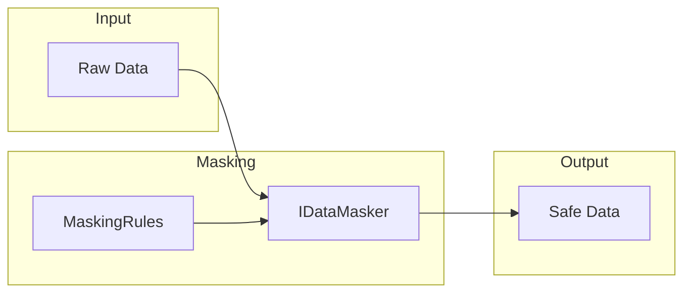

# Data Masking

Data masking protects sensitive information (PII/PHI) by replacing identifiable patterns with masked values in logs, error messages, and API responses.

## Before You Start

- **.NET 8.0+** (or .NET 9/10 for latest features)
- Install the required packages:
  ```bash
  dotnet add package Excalibur.Dispatch.Security
  ```
- Familiarity with [encryption providers](../security/encryption-providers.md) and [GDPR erasure](./gdpr-erasure.md)

## Overview



## Quick Start

### Configuration

```csharp
services.AddDataMasking();

// Or with specific compliance mode
services.AddHipaaDataMasking();   // PHI patterns
services.AddPciDssDataMasking();  // Credit card only
services.AddStrictDataMasking();  // All patterns
```

### Basic Usage

```csharp
public class LoggingService
{
    private readonly IDataMasker _masker;

    public LoggingService(IDataMasker masker)
    {
        _masker = masker;
    }

    public void LogMessage(string message)
    {
        // Mask all sensitive patterns before logging
        var safeMessage = _masker.MaskAll(message);
        _logger.LogInformation(safeMessage);
    }
}
```

## Masking Patterns

### Standard Patterns

| Pattern | Example | Masked | Rule Property |
|---------|---------|--------|---------------|
| Email | john@example.com | j\*\*\*@e\*\*\*.com | MaskEmail |
| Phone | 555-123-4567 | \*\*\*-\*\*\*-4567 | MaskPhone |
| SSN | 123-45-6789 | \*\*\*-\*\*-6789 | MaskSsn |
| Credit Card | 4111-1111-1111-1111 | \*\*\*\*-\*\*\*\*-\*\*\*\*-1111 | MaskCardNumber |
| IP Address | 192.168.1.100 | \*\*\*.\*\*\*.\*\*\*.100 | MaskIpAddress |
| Date of Birth | 12/25/1990 | \*\*/\*\*/\*\*\*\* | MaskDateOfBirth |

### Pattern Details

Credit card masking preserves the last 4 digits for verification while hiding the PAN:

```csharp
var input = "Card: 4111-1111-1111-1111";
var masked = _masker.Mask(input, MaskingRules.PciDss);
// Result: "Card: ****-****-****-1111"
```

SSN masking preserves the last 4 digits per IRS guidelines:

```csharp
var input = "SSN: 123-45-6789";
var masked = _masker.Mask(input, MaskingRules.Default);
// Result: "SSN: ***-**-6789"
```

## Masking Rules

### Default Rules

```csharp
var rules = MaskingRules.Default;
// Enables: Email, Phone, SSN, Credit Card
// Disables: IP Address, Date of Birth
```

### Compliance-Specific Rules

```csharp
// PCI-DSS: Credit card numbers only
var pciRules = MaskingRules.PciDss;

// HIPAA: All PHI patterns
var hipaaRules = MaskingRules.Hipaa;
// Enables: Email, Phone, SSN, IP Address, Date of Birth

// Strict: All patterns enabled
var strictRules = MaskingRules.Strict;
```

### Custom Rules

```csharp
var customRules = new MaskingRules
{
    MaskEmail = true,
    MaskPhone = true,
    MaskSsn = true,
    MaskCardNumber = false,  // Disable card masking
    MaskIpAddress = true,
    MaskDateOfBirth = true,
    MaskCharacter = '#'      // Use # instead of *
};

services.AddDataMasking(customRules);
```

## Object Masking

### Automatic Property Masking

Mark properties with attributes for automatic masking:

```csharp
public class CustomerDto
{
    public string Name { get; set; }

    [PersonalData(MaskInLogs = true)]
    public string Email { get; set; }

    [PersonalData(MaskInLogs = true)]
    public string PhoneNumber { get; set; }

    [Sensitive(MaskInLogs = true)]
    public string SocialSecurityNumber { get; set; }
}
```

### Mask Objects

```csharp
var customer = new CustomerDto
{
    Name = "John Doe",
    Email = "john@example.com",
    PhoneNumber = "555-123-4567",
    SocialSecurityNumber = "123-45-6789"
};

var masked = _masker.MaskObject(customer);
// Email: j***@e***.com
// PhoneNumber: ***-***-4567
// SocialSecurityNumber: ***-**-6789
```

## Integration Patterns

### Logging Middleware

```csharp
public class MaskingLoggingMiddleware : IDispatchMiddleware
{
    private readonly IDataMasker _masker;

    public async ValueTask<IMessageResult> InvokeAsync(
        IDispatchMessage message,
        IMessageContext context,
        DispatchRequestDelegate next,
        CancellationToken ct)
    {
        // Mask message before logging
        var safeMessage = _masker.MaskObject(message);
        _logger.LogInformation("Processing: {@Message}", safeMessage);

        return await next(message, context, ct);
    }
}
```

### Exception Handling

```csharp
public class SafeExceptionHandler
{
    private readonly IDataMasker _masker;

    public string GetSafeErrorMessage(Exception ex)
    {
        // Mask any PII in exception messages
        return _masker.MaskAll(ex.Message);
    }
}
```

### API Responses

```csharp
public class MaskingActionFilter : IAsyncActionFilter
{
    private readonly IDataMasker _masker;

    public async Task OnActionExecutionAsync(
        ActionExecutingContext context,
        ActionExecutionDelegate next)
    {
        var result = await next();

        if (result.Result is ObjectResult objectResult)
        {
            objectResult.Value = _masker.MaskObject(objectResult.Value);
        }
    }
}
```

## Performance

The masker uses compiled regex patterns with timeout guards for optimal performance:

| Metric | Value |
|--------|-------|
| Overhead | < 2% per operation |
| Regex timeout | 100ms (ReDoS protection) |
| Pattern caching | Static compiled patterns |
| Thread safety | Fully thread-safe |

```csharp
// Patterns are compiled once at startup
// Safe for concurrent access from multiple threads
var masker = new RegexDataMasker(MaskingRules.Default);
```

## Security Considerations

### ReDoS Protection

All regex patterns include timeout guards to prevent Regular Expression Denial of Service:

```csharp
// Internal implementation uses:
new Regex(pattern, RegexOptions.Compiled, TimeSpan.FromMilliseconds(100));
```

### Partial Visibility

Some patterns preserve partial data for verification:

| Pattern | Preserved | Purpose |
|---------|-----------|---------|
| Credit Card | Last 4 digits | Receipt verification |
| SSN | Last 4 digits | IRS compliance |
| Phone | Last 4 digits | Caller verification |
| IP | Last octet | Network troubleshooting |

### Attribute-Based Discovery

Use attributes to mark sensitive properties at the source:

```csharp
// PersonalData - GDPR Article 4(1) personal data
[PersonalData(Category = PersonalDataCategory.Identity)]
public string Email { get; set; }

// Sensitive - General sensitive data
[Sensitive(Classification = DataClassification.Confidential)]
public string ApiKey { get; set; }
```

## Testing

### Verify Masking

```csharp
[Fact]
public void Should_Mask_CreditCard_Preserving_Last4()
{
    var masker = new RegexDataMasker(MaskingRules.PciDss);
    var input = "Card: 4111-1111-1111-1111";

    var result = masker.Mask(input, MaskingRules.PciDss);

    result.ShouldBe("Card: ****-****-****-1111");
}

[Fact]
public void Should_Mask_Multiple_Patterns()
{
    var masker = new RegexDataMasker(MaskingRules.Strict);
    var input = "Email: john@example.com, Phone: 555-123-4567";

    var result = masker.MaskAll(input);

    result.ShouldContain("j***@e***.com");
    result.ShouldContain("***-***-4567");
}
```

## Best Practices

| Practice | Recommendation |
|----------|----------------|
| Default masking | Enable in all environments |
| Compliance mode | Match your regulatory requirements |
| Log review | Audit logs periodically for unmasked data |
| Attribute usage | Mark all PII/PHI at definition time |
| Custom patterns | Add organization-specific patterns as needed |

## Next Steps

- [GDPR Erasure](gdpr-erasure.md) - Cryptographic data deletion
- [Audit Logging](audit-logging.md) - Compliance audit trails

## See Also

- [GDPR Erasure](gdpr-erasure.md) - Cryptographic data deletion for right to be forgotten
- [Compliance Overview](index.md) - Compliance framework capabilities
- [Encryption Architecture](../security/encryption-architecture.md) - Encryption at rest and in transit
