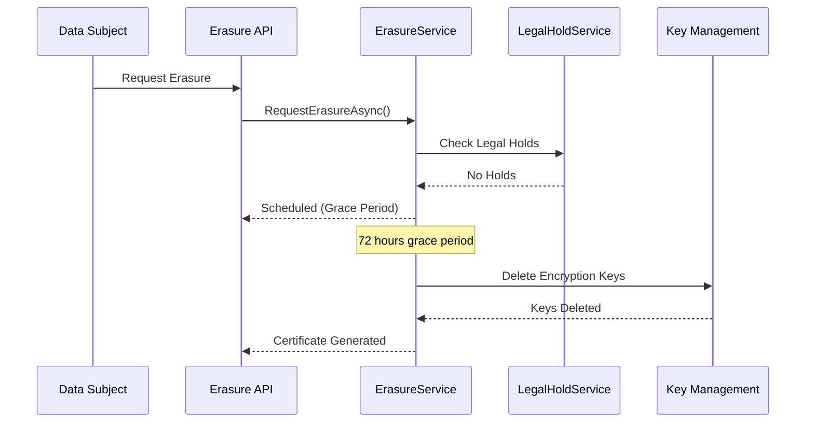

# GDPR Erasure

GDPR Article 17 ("Right to be Forgotten") requires organizations to delete personal data upon request. Dispatch implements this through cryptographic erasure (crypto-shredding), which renders data irrecoverable by deleting encryption keys.

## Before You Start

- **.NET 8.0+** (or .NET 9/10 for latest features)
- Install the required packages:
  ```bash
  dotnet add package Excalibur.Dispatch.Security
  ```
- Familiarity with [encryption architecture](../security/encryption-architecture.md) and [data masking](./data-masking.md)

## Overview



## Quick Start

### Configuration

```csharp
services.AddGdprErasure(options =>
{
    options.DefaultGracePeriod = TimeSpan.FromHours(72);
    options.RequireVerification = true;
});

// Development (in-memory stores)
services.AddInMemoryErasureStore();
services.AddInMemoryLegalHoldStore();
services.AddLegalHoldService();
services.AddErasureScheduler();

// Production (SQL Server storage)
// Package: Excalibur.Compliance.SqlServer
services.AddSqlServerErasureStore(options =>
{
    options.ConnectionString = connectionString;
    options.SchemaName = "compliance";
});
```

### Submit Erasure Request

```csharp
public class ErasureController : ControllerBase
{
    private readonly IErasureService _erasureService;

    [HttpPost("erasure")]
    public async Task<IActionResult> RequestErasure(
        [FromBody] ErasureRequestDto dto,
        CancellationToken ct)
    {
        var request = new ErasureRequest
        {
            DataSubjectId = dto.SubjectId,
            IdType = DataSubjectIdType.UserId,
            LegalBasis = ErasureLegalBasis.DataSubjectRequest,
            RequestedBy = User.Identity?.Name ?? "anonymous",
            TenantId = dto.TenantId,
            Scope = ErasureScope.User
        };

        var result = await _erasureService.RequestErasureAsync(request, ct);

        return Ok(new
        {
            RequestId = result.RequestId,
            Status = result.Status,
            ScheduledFor = result.ScheduledExecutionTime
        });
    }
}
```

## Erasure Workflow

### 1. Request Submission

```csharp
var request = new ErasureRequest
{
    DataSubjectId = "user-12345",
    IdType = DataSubjectIdType.UserId,
    LegalBasis = ErasureLegalBasis.DataSubjectRequest,
    RequestedBy = "compliance@company.com",
    TenantId = "tenant-abc",
    Scope = ErasureScope.User
};

var result = await _erasureService.RequestErasureAsync(request, ct);
```

### 2. Grace Period

Requests enter a configurable grace period (default 72 hours) before execution:

```csharp
services.AddGdprErasure(options =>
{
    // Default grace period (minimum recommended 72 hours for production)
    options.DefaultGracePeriod = TimeSpan.FromHours(72);

    // Configure min/max bounds
    options.MinimumGracePeriod = TimeSpan.FromHours(24);
    options.MaximumGracePeriod = TimeSpan.FromDays(30);
});
```

### 3. Cancellation (During Grace Period)

```csharp
var cancelled = await _erasureService.CancelErasureAsync(
    requestId: result.RequestId,
    reason: "Request withdrawn by data subject",
    cancelledBy: "support@company.com",
    ct);

if (!cancelled)
{
    // Request already executed or not found
}
```

### 4. Execution (Crypto-Shredding)

After the grace period, the scheduler executes erasure:

```csharp
// Typically called by background service
var execution = await _erasureService.ExecuteAsync(requestId, ct);

if (execution.Success)
{
    _logger.LogInformation(
        "Erasure complete: {KeysDeleted} keys deleted, {RecordsAffected} records",
        execution.KeysDeleted,
        execution.RecordsAffected);
}
```

### 5. Compliance Certificate

Generate cryptographic proof of erasure:

```csharp
var certificate = await _erasureService.GenerateCertificateAsync(requestId, ct);

// Certificate contains:
// - Request details
// - Execution timestamp
// - Keys deleted
// - SHA-256 signature
```

## Legal Holds

Article 17(3) exceptions prevent erasure for:
- Legal claims
- Litigation holds
- Regulatory investigations
- Legal obligations

### Check for Holds

```csharp
public class LegalHoldAwareErasure
{
    private readonly ILegalHoldService _holdService;
    private readonly IErasureService _erasureService;

    public async Task<ErasureResult> SafeErasure(
        ErasureRequest request,
        CancellationToken ct)
    {
        // Check for active holds (requires DataSubjectIdType)
        var checkResult = await _holdService.CheckHoldsAsync(
            request.DataSubjectId,
            request.IdType,
            request.TenantId,
            ct);

        if (checkResult.HasActiveHolds)
        {
            throw new ErasureException(
                $"Cannot erase: {checkResult.ActiveHolds.Count} active legal hold(s)");
        }

        return await _erasureService.RequestErasureAsync(request, ct);
    }
}
```

### Create Legal Hold

```csharp
var hold = await _holdService.CreateHoldAsync(new LegalHoldRequest
{
    DataSubjectId = "user-12345",
    IdType = DataSubjectIdType.UserId,
    TenantId = "tenant-abc",
    Basis = LegalHoldBasis.LitigationHold,
    CaseReference = "Case #2024-001",
    Description = "Pending lawsuit - Case #2024-001",
    CreatedBy = "legal@company.com",
    ExpiresAt = DateTimeOffset.UtcNow.AddYears(2)
}, ct);
```

### Release Hold

```csharp
await _holdService.ReleaseHoldAsync(
    holdId: hold.HoldId,
    reason: "Litigation concluded",
    releasedBy: "legal@company.com",
    ct);
```

## Erasure Scopes

Control what data is erased:

```csharp
public enum ErasureScope
{
    User = 0,       // Erase all data for a specific user
    Tenant = 1,     // Erase all data for an entire tenant
    Selective = 2   // Erase specific data categories only
}

// Selective erasure with data categories
var request = new ErasureRequest
{
    DataSubjectId = "user-12345",
    IdType = DataSubjectIdType.UserId,
    LegalBasis = ErasureLegalBasis.ConsentWithdrawal,
    RequestedBy = "compliance@company.com",
    Scope = ErasureScope.Selective,
    DataCategories = ["marketing", "analytics"]
};
```

## Data Inventory

Track where personal data is stored. Register the data inventory service via DI:

```csharp
// Register data inventory services
services.AddDataInventoryService();
services.AddInMemoryDataInventoryStore(); // or SQL Server store for production
```

:::note
The `IDataInventoryService` provides registration and discovery of personal data locations across your system, enabling comprehensive erasure and Records of Processing Activities (RoPA) documentation.
:::

## Verification

### Check Erasure Status

```csharp
var status = await _erasureService.GetStatusAsync(requestId, ct);

switch (status?.Status)
{
    case ErasureRequestStatus.Scheduled:
        // In grace period
        break;
    case ErasureRequestStatus.Completed:
        // Successfully erased
        break;
    case ErasureRequestStatus.Failed:
        // Execution failed
        break;
    case ErasureRequestStatus.Cancelled:
        // Cancelled during grace period
        break;
}
```

### List Requests

```csharp
// Inject IErasureQueryStore (ISP sub-interface of IErasureStore)
var requests = await _erasureQueryStore.ListRequestsAsync(
    status: ErasureRequestStatus.Completed,
    tenantId: "tenant-abc",
    fromDate: DateTimeOffset.UtcNow.AddDays(-30),
    toDate: DateTimeOffset.UtcNow,
    ct);
```

## Background Scheduler

Register the erasure scheduler to automatically execute requests after the grace period:

```csharp
// Register the scheduler service
services.AddErasureScheduler();
```

For serverless environments, trigger erasure execution manually via `IErasureService.ExecuteAsync`:

```csharp
public class ErasureFunction
{
    private readonly IErasureService _erasureService;
    private readonly IErasureQueryStore _erasureQueryStore;

    [Function("ProcessErasureRequests")]
    public async Task Run(
        [TimerTrigger("0 */5 * * * *")] TimerInfo timer,
        CancellationToken ct)
    {
        // List scheduled requests ready for execution (IErasureQueryStore)
        var scheduled = await _erasureQueryStore.ListRequestsAsync(
            status: ErasureRequestStatus.Scheduled,
            tenantId: null,
            fromDate: null,
            toDate: DateTimeOffset.UtcNow,
            ct);

        foreach (var request in scheduled)
        {
            await _erasureService.ExecuteAsync(request.RequestId, ct);
        }
    }
}
```

## Database Schema

### SQL Server

```sql
CREATE SCHEMA [compliance];

CREATE TABLE [compliance].[ErasureRequests] (
    [Id] UNIQUEIDENTIFIER NOT NULL,
    [DataSubjectId] NVARCHAR(256) NOT NULL,
    [TenantId] NVARCHAR(100) NOT NULL,
    [Status] INT NOT NULL,
    [Scope] INT NOT NULL,
    [RequestedBy] NVARCHAR(256) NOT NULL,
    [RequestedAt] DATETIME2 NOT NULL,
    [ScheduledFor] DATETIME2 NOT NULL,
    [ExecutedAt] DATETIME2 NULL,
    [CancelledAt] DATETIME2 NULL,
    [Reason] NVARCHAR(MAX) NULL,

    CONSTRAINT [PK_ErasureRequests] PRIMARY KEY ([Id])
);

CREATE INDEX [IX_ErasureRequests_Status]
ON [compliance].[ErasureRequests] ([Status], [ScheduledFor])
WHERE [Status] = 1; -- Scheduled
```

## Testing

### Unit Tests

```csharp
[Fact]
public async Task Should_Schedule_Erasure_With_Grace_Period()
{
    // Arrange
    var request = new ErasureRequest
    {
        DataSubjectId = "user-123",
        IdType = DataSubjectIdType.UserId,
        LegalBasis = ErasureLegalBasis.DataSubjectRequest,
        RequestedBy = "test@example.com",
        TenantId = "tenant-abc"
    };

    // Act
    var result = await _erasureService.RequestErasureAsync(request, CancellationToken.None);

    // Assert
    result.Status.ShouldBe(ErasureRequestStatus.Scheduled);
    result.ScheduledExecutionTime.ShouldBeGreaterThan(DateTimeOffset.UtcNow);
}

[Fact]
public async Task Should_Block_Erasure_With_Legal_Hold()
{
    // Arrange — create a legal hold first
    await _holdService.CreateHoldAsync(new LegalHoldRequest
    {
        DataSubjectId = "user-123",
        IdType = DataSubjectIdType.UserId,
        Basis = LegalHoldBasis.LitigationHold,
        CaseReference = "CASE-001",
        Description = "Test litigation hold",
        CreatedBy = "legal@example.com"
    }, CancellationToken.None);

    var request = new ErasureRequest
    {
        DataSubjectId = "user-123",
        IdType = DataSubjectIdType.UserId,
        LegalBasis = ErasureLegalBasis.DataSubjectRequest,
        RequestedBy = "test@example.com"
    };

    // Act & Assert — erasure should be blocked
    var result = await _erasureService.RequestErasureAsync(request, CancellationToken.None);
    result.Status.ShouldBe(ErasureRequestStatus.BlockedByLegalHold);
}
```

## Best Practices

| Practice | Recommendation |
|----------|----------------|
| Grace period | 72 hours minimum for production |
| Legal holds | Always check before execution |
| Audit logging | Enable for compliance evidence |
| Key rotation | Use separate keys per data subject |
| Verification | Generate certificates for all completions |
| Data inventory | Maintain accurate data location registry |

## Compliance Mapping

| GDPR Article | Feature |
|--------------|---------|
| Article 17(1) | ErasureService.RequestErasureAsync() |
| Article 17(2) | Cascade to all data locations via DataInventory |
| Article 17(3)(b) | LegalHoldService for compliance obligations |
| Article 17(3)(e) | LegalHoldService for legal claims |

## Next Steps

- [Data Masking](data-masking.md) - PII/PHI protection
- [Audit Logging](audit-logging.md) - Compliance audit trails

## See Also

- [Data Masking](data-masking.md) - PII/PHI protection in logs and outputs
- [Compliance Overview](index.md) - Compliance framework capabilities
- [Audit Logging](audit-logging.md) - Tamper-evident audit logging with hash chain integrity
