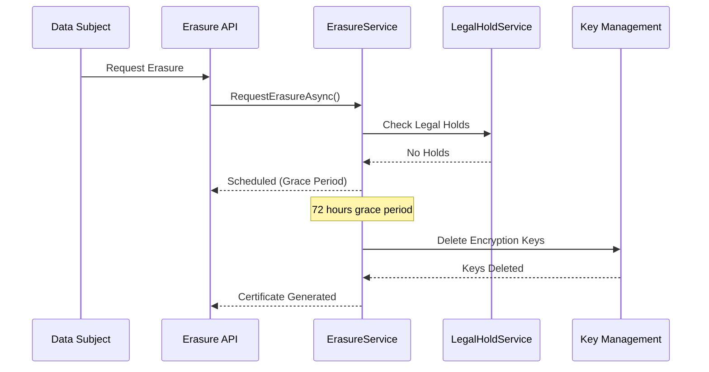

# GDPR Erasure

GDPR Article 17 ("Right to be Forgotten") requires organizations to delete personal data upon request. Dispatch implements this through cryptographic erasure (crypto-shredding), which renders data irrecoverable by deleting encryption keys.

## Before You Start

- **.NET 10.0**
- Install the required packages:
  ```bash
  dotnet add package Excalibur.Security
  ```
- Familiarity with [encryption architecture](../security/encryption-architecture.md) and [data masking](./data-masking.md)

## Overview


```mermaid
sequenceDiagram
    participant DS as Data Subject
    participant API as Erasure API
    participant ES as ErasureService
    participant LH as LegalHoldService
    participant KMS as Key Management

    DS->>API: Request Erasure
    API->>ES: RequestErasureAsync()
    ES->>LH: Check Legal Holds
    LH-->>ES: No Holds
    ES-->>API: Scheduled (Grace Period)

    Note over ES: 72 hours grace period

    ES->>KMS: Delete Encryption Keys
    KMS-->>ES: Keys Deleted
    ES-->>API: Certificate Generated
```

## Quick Start

### Configuration

```csharp
services.AddGdprErasure(options =>
{
    options.DefaultGracePeriod = TimeSpan.FromHours(72);
    options.RequireVerification = true;
});

// Development (in-memory stores)
services.AddInMemoryErasureStore();
services.AddInMemoryLegalHoldStore();
services.AddLegalHoldService();
services.AddErasureScheduler();
```

:::tip Minimal wiring (Sprint 790 `bd-20ft0e` FIX 2)

`AddGdprErasure(...)` now `TryAdd`-registers a default `IKeyManagementAdmin` (the in-memory `InMemoryKeyManagementProvider`), so the call above is sufficient for a working minimal wiring in samples, tests, or local development. Calling `AddComplianceEncryption(...)` later wins via first-registrant-TryAdd semantics when a real KMS provider is required. This closes a class of "hidden sibling dependency" defects where consumers were required to register a provider the public entry point never advertised.
:::

```csharp

// Production (SQL Server storage)
// Package: Excalibur.Compliance.SqlServer
services.AddSqlServerErasureStore(options =>
{
    options.ConnectionString = connectionString;
    options.SchemaName = "compliance";
});
```

### Submit Erasure Request

```csharp
public class ErasureController : ControllerBase
{
    private readonly IErasureService _erasureService;

    [HttpPost("erasure")]
    public async Task<IActionResult> RequestErasure(
        [FromBody] ErasureRequestDto dto,
        CancellationToken ct)
    {
        var request = new ErasureRequest
        {
            DataSubjectId = dto.SubjectId,
            IdType = DataSubjectIdType.UserId,
            LegalBasis = ErasureLegalBasis.DataSubjectRequest,
            RequestedBy = User.Identity?.Name ?? "anonymous",
            TenantId = dto.TenantId,
            Scope = ErasureScope.User
        };

        var result = await _erasureService.RequestErasureAsync(request, ct);

        return Ok(new
        {
            RequestId = result.RequestId,
            Status = result.Status,
            ScheduledFor = result.ScheduledExecutionTime
        });
    }
}
```

## Erasure Workflow

### 1. Request Submission

```csharp
var request = new ErasureRequest
{
    DataSubjectId = "user-12345",
    IdType = DataSubjectIdType.UserId,
    LegalBasis = ErasureLegalBasis.DataSubjectRequest,
    RequestedBy = "compliance@company.com",
    TenantId = "tenant-abc",
    Scope = ErasureScope.User
};

var result = await _erasureService.RequestErasureAsync(request, ct);
```

### 2. Grace Period

Requests enter a configurable grace period (default 72 hours) before execution:

```csharp
services.AddGdprErasure(options =>
{
    // Default grace period (minimum recommended 72 hours for production)
    options.DefaultGracePeriod = TimeSpan.FromHours(72);

    // Configure min/max bounds
    options.MinimumGracePeriod = TimeSpan.FromHours(24);
    options.MaximumGracePeriod = TimeSpan.FromDays(30);
});
```

### 3. Cancellation (During Grace Period)

```csharp
var cancelled = await _erasureService.CancelErasureAsync(
    requestId: result.RequestId,
    reason: "Request withdrawn by data subject",
    cancelledBy: "support@company.com",
    ct);

if (!cancelled)
{
    // Request already executed or not found
}
```

### 4. Execution (Crypto-Shredding)

Erasure execution is handled automatically by the background scheduler after the grace period expires. Consumers do not call execution directly — monitor status via `GetStatusAsync`:

```csharp
// Poll for completion after grace period
var status = await _erasureService.GetStatusAsync(requestId, ct);

switch (status?.Status)
{
    case ErasureRequestStatus.Completed:
        _logger.LogInformation("Erasure complete for {RequestId}", requestId);
        break;
    case ErasureRequestStatus.PartiallyCompleted:
        _logger.LogWarning("Partial erasure for {RequestId}", requestId);
        break;
    case ErasureRequestStatus.Scheduled:
        _logger.LogInformation("Awaiting grace period for {RequestId}", requestId);
        break;
}
```

:::warning Partial Completion Is Structural, Not Just On Failure

An erasure reaches `Completed` **only** when every discovered personal-data location is *covered* **and** no contributor reported an error. Two distinct conditions force `PartiallyCompleted`:

1. **A contributor erasure fails** (an error is reported), or
2. **A discovered location is left _uncovered_** — its store holds personal data but no mechanism erases it (no crypto-shred key, no covering `IErasureContributor`, no declared exemption).

A coverage gap forces `PartiallyCompleted` **even when nothing threw** — the framework will not report `Completed` over a store it never erased. See [Erasure Coverage Model](#erasure-coverage-model) below. Monitor the `ErasurePartiallyCompleted` event (ID 92729) and investigate uncovered stores and failed contributors.
:::

### 5. Compliance Certificate

Generate cryptographic proof of erasure:

```csharp
var certificate = await _erasureService.GenerateCertificateAsync(requestId, ct);

// Certificate contains:
// - Request details (RequestId, anonymized DataSubjectReference)
// - Execution timestamp (CompletedAt) and Method (e.g. CryptographicErasure)
// - Summary.KeysDeleted / RecordsAffected / DataCategories
// - Verification.Verified + Verification.DeletedKeyIds (the specific key IDs proven gone)
// - Exceptions: stores deliberately retained under Article 17(3) (e.g. the audit store), with legal Basis
// - SHA-256 Signature
```

The verification summary records the **specific** deleted key IDs (`Verification.DeletedKeyIds`) and is non-vacuous: if the summary claims `KeysDeleted > 0` but no deleted key can be confirmed gone — or a discovered location was left uncovered — `Verification.Verified` is `false` rather than a blanket `true`.

## Erasure Coverage Model

Erasure breadth is governed by a **three-state coverage gate**. Every personal-data [location](#data-inventory) discovered for the data subject is classified as one of:

| State | Meaning | Effect on status |
|-------|---------|------------------|
| **Covered** | A mechanism erases this location: its per-subject encryption key was deleted (crypto-shred), **or** a registered `IErasureContributor` declares its store kind. | Does not block `Completed`. |
| **Exempt** | A declared, documented retention exemption with a legal basis (e.g. the audit/security store). | Enumerated on the certificate (`Exceptions`), but **non-blocking**. |
| **Uncovered** | Neither covered nor exempt — a genuine gap. | **Forces `PartiallyCompleted`**, naming the uncovered store. |

`Completed` is reachable **only** when there are zero uncovered locations and zero errors. This is enforced structurally — the framework cannot report `Completed` over a store it never erased.

### Store kinds and contributor coverage

Each `DataLocation` carries a `StoreKind` (`Excalibur.Compliance.DataStoreKind`). A contributor declares which kinds it erases via `CoveredStoreKinds`:

```csharp
using Excalibur.Compliance;

public sealed class OutboxErasureContributor : IErasureContributor
{
    public string Name => "Outbox";

    // The coverage gate marks an Outbox-kind location as Covered when this contributor is registered.
    public IReadOnlySet<DataStoreKind> CoveredStoreKinds { get; } =
        new HashSet<DataStoreKind> { DataStoreKind.Outbox };

    public Task<ErasureContributorResult> EraseAsync(
        ErasureContributorContext context,
        CancellationToken cancellationToken)
    {
        // Delete/tombstone rows for context.DataSubjectIdHash, then:
        return Task.FromResult(ErasureContributorResult.Succeeded(recordsAffected: 0));
    }
}
```

`DataStoreKind` is an **extensible**, string-backed kind (the Microsoft "names" pattern), not a closed enum — consumers may have custom stores holding personal data. Use the well-known members (`DataStoreKind.EventStore`, `.Snapshot`, `.Outbox`, `.Inbox`, `.Projection`, `.Saga`, `.Audit`, `.Cache`) for first-party stores and `DataStoreKind.Create("MyCustomStore")` for your own. The default/unclassified kind (`DataStoreKind.Unknown`) is **never coverable** — an unclassified location always blocks `Completed`, so a store can never silently pass as erased.

### Audit/security store: exempt by default

The audit/security store kind (`DataStoreKind.Audit`) is treated as **`Exempt` by default**, on the legal basis of **GDPR Article 17(3)(b)** (processing necessary for compliance with a legal obligation — security audit-trail retention) and **Article 17(3)(e)** (establishment, exercise, or defence of legal claims — security-incident investigation). The exemption is recorded explicitly on the certificate's `Exceptions` list with its basis — it is never a silent skip and is never falsely counted as covered.

If your compliance posture requires the audit store to be erased (no legal-retention basis, or post-retention-window erasure), **override the default** by registering an `IErasureContributor` whose `CoveredStoreKinds` includes `DataStoreKind.Audit` (contributor coverage wins over the default exemption).

:::warning Compliance assistance, not a compliance guarantee

The default audit-store exemption is a **sensible documented default**, not a legal determination. Excalibur is a framework, not your application — it cannot make your organization's final legal call. Your Data Protection Officer owns the decision of whether the audit store is in scope for a given erasure. See the [Compliance Disclaimer](../legal/compliance-disclaimer.md).
:::

## Legal Holds

Article 17(3) exceptions prevent erasure for:
- Legal claims
- Litigation holds
- Regulatory investigations
- Legal obligations

### Check for Holds

```csharp
public class LegalHoldAwareErasure
{
    private readonly ILegalHoldService _holdService;
    private readonly IErasureService _erasureService;

    public async Task<ErasureResult> SafeErasure(
        ErasureRequest request,
        CancellationToken ct)
    {
        // Check for active holds (requires DataSubjectIdType)
        var checkResult = await _holdService.CheckHoldsAsync(
            request.DataSubjectId,
            request.IdType,
            request.TenantId,
            ct);

        if (checkResult.HasActiveHolds)
        {
            throw new ErasureException(
                $"Cannot erase: {checkResult.ActiveHolds.Count} active legal hold(s)");
        }

        return await _erasureService.RequestErasureAsync(request, ct);
    }
}
```

### Create Legal Hold

```csharp
var hold = await _holdService.CreateHoldAsync(new LegalHoldRequest
{
    DataSubjectId = "user-12345",
    IdType = DataSubjectIdType.UserId,
    TenantId = "tenant-abc",
    Basis = LegalHoldBasis.LitigationHold,
    CaseReference = "Case #2024-001",
    Description = "Pending lawsuit - Case #2024-001",
    CreatedBy = "legal@company.com",
    ExpiresAt = DateTimeOffset.UtcNow.AddYears(2)
}, ct);
```

### Release Hold

```csharp
await _holdService.ReleaseHoldAsync(
    holdId: hold.HoldId,
    reason: "Litigation concluded",
    releasedBy: "legal@company.com",
    ct);
```

## Erasure Scopes

Control what data is erased:

```csharp
public enum ErasureScope
{
    User = 0,       // Erase all data for a specific user
    Tenant = 1,     // Erase all data for an entire tenant
    Selective = 2   // Erase specific data categories only
}

// Selective erasure with data categories
var request = new ErasureRequest
{
    DataSubjectId = "user-12345",
    IdType = DataSubjectIdType.UserId,
    LegalBasis = ErasureLegalBasis.ConsentWithdrawal,
    RequestedBy = "compliance@company.com",
    Scope = ErasureScope.Selective,
    DataCategories = ["marketing", "analytics"]
};
```

## Data Inventory

Track where personal data is stored. Register the data inventory service via DI:

```csharp
// Register data inventory services
services.AddDataInventoryService();
services.AddInMemoryDataInventoryStore(); // or SQL Server store for production
```

:::note

The `IDataInventoryService` provides registration and discovery of personal data locations across your system, enabling comprehensive erasure and Records of Processing Activities (RoPA) documentation.
:::

## Verification

### Check Erasure Status

```csharp
var status = await _erasureService.GetStatusAsync(requestId, ct);

switch (status?.Status)
{
    case ErasureRequestStatus.Scheduled:
        // In grace period
        break;
    case ErasureRequestStatus.Completed:
        // Successfully erased
        break;
    case ErasureRequestStatus.Failed:
        // Execution failed
        break;
    case ErasureRequestStatus.Cancelled:
        // Cancelled during grace period
        break;
}
```

### List Requests

```csharp
// Inject IErasureQueryStore (ISP sub-interface of IErasureStore)
var requests = await _erasureQueryStore.ListRequestsAsync(
    status: ErasureRequestStatus.Completed,
    tenantId: "tenant-abc",
    fromDate: DateTimeOffset.UtcNow.AddDays(-30),
    toDate: DateTimeOffset.UtcNow,
    ct);
```

## Background Scheduler

Register the erasure scheduler to automatically execute requests after the grace period:

```csharp
// Register the scheduler service
services.AddErasureScheduler();
```

For serverless environments where background services are not available, register the erasure scheduler as a timer-triggered function:

```csharp
public class ErasureFunction
{
    private readonly IServiceProvider _serviceProvider;

    [Function("ProcessErasureRequests")]
    public async Task Run(
        [TimerTrigger("0 */5 * * * *")] TimerInfo timer,
        CancellationToken ct)
    {
        // The scheduler handles execution internally when started
        // For serverless, use AddErasureScheduler() in DI and
        // let the hosted service process pending requests
        await using var scope = _serviceProvider.CreateAsyncScope();
        // Scheduler auto-processes pending requests on activation
    }
}
```

:::tip

For serverless deployments, `AddErasureScheduler()` registers the background service that automatically processes requests past their grace period. The execution logic is internal to the framework — consumers only need to submit requests and monitor status.

## Database Schema

### SQL Server

```sql
CREATE SCHEMA [compliance];

CREATE TABLE [compliance].[ErasureRequests] (
    [Id] UNIQUEIDENTIFIER NOT NULL,
    [DataSubjectId] NVARCHAR(256) NOT NULL,
    [TenantId] NVARCHAR(100) NOT NULL,
    [Status] INT NOT NULL,
    [Scope] INT NOT NULL,
    [RequestedBy] NVARCHAR(256) NOT NULL,
    [RequestedAt] DATETIME2 NOT NULL,
    [ScheduledFor] DATETIME2 NOT NULL,
    [ExecutedAt] DATETIME2 NULL,
    [CancelledAt] DATETIME2 NULL,
    [Reason] NVARCHAR(MAX) NULL,

    CONSTRAINT [PK_ErasureRequests] PRIMARY KEY ([Id])
);

CREATE INDEX [IX_ErasureRequests_Status]
ON [compliance].[ErasureRequests] ([Status], [ScheduledFor])
WHERE [Status] = 1; -- Scheduled
```

## Testing

### Unit Tests

```csharp
[Fact]
public async Task Should_Schedule_Erasure_With_Grace_Period()
{
    // Arrange
    var request = new ErasureRequest
    {
        DataSubjectId = "user-123",
        IdType = DataSubjectIdType.UserId,
        LegalBasis = ErasureLegalBasis.DataSubjectRequest,
        RequestedBy = "test@example.com",
        TenantId = "tenant-abc"
    };

    // Act
    var result = await _erasureService.RequestErasureAsync(request, CancellationToken.None);

    // Assert
    result.Status.ShouldBe(ErasureRequestStatus.Scheduled);
    result.ScheduledExecutionTime.ShouldBeGreaterThan(DateTimeOffset.UtcNow);
}

[Fact]
public async Task Should_Block_Erasure_With_Legal_Hold()
{
    // Arrange — create a legal hold first
    await _holdService.CreateHoldAsync(new LegalHoldRequest
    {
        DataSubjectId = "user-123",
        IdType = DataSubjectIdType.UserId,
        Basis = LegalHoldBasis.LitigationHold,
        CaseReference = "CASE-001",
        Description = "Test litigation hold",
        CreatedBy = "legal@example.com"
    }, CancellationToken.None);

    var request = new ErasureRequest
    {
        DataSubjectId = "user-123",
        IdType = DataSubjectIdType.UserId,
        LegalBasis = ErasureLegalBasis.DataSubjectRequest,
        RequestedBy = "test@example.com"
    };

    // Act & Assert — erasure should be blocked
    var result = await _erasureService.RequestErasureAsync(request, CancellationToken.None);
    result.Status.ShouldBe(ErasureRequestStatus.BlockedByLegalHold);
}
```

## Event Store Erasure

When using event sourcing, GDPR erasure must extend to event stores. The `IEventStoreErasure` interface (in `Excalibur.EventSourcing`) enables cryptographic erasure at the event store level.

### IEventStoreErasure Interface

```csharp
namespace Excalibur.EventSourcing;

public interface IEventStoreErasure
{
    /// <summary>
    /// Erases all event payloads for the specified aggregate, replacing them
    /// with a tombstone marker. The stream is retained for referential integrity.
    /// </summary>
    Task<int> EraseEventsAsync(
        string aggregateId,
        string aggregateType,
        Guid erasureRequestId,
        CancellationToken cancellationToken);

    /// <summary>
    /// Checks whether erasure has been performed for the specified aggregate.
    /// </summary>
    Task<bool> IsErasedAsync(
        string aggregateId,
        string aggregateType,
        CancellationToken cancellationToken);
}
```

Event store providers that support GDPR erasure implement this interface. Use `GetService(typeof(IEventStoreErasure))` to probe for erasure capability at runtime:

```csharp
if (eventStore is IEventStoreErasure erasure)
{
    var count = await erasure.EraseEventsAsync(
        aggregateId: "user-12345",
        aggregateType: "UserProfile",
        erasureRequestId: requestId,
        cancellationToken);

    logger.LogInformation("Erased {Count} events for aggregate {AggregateId}", count, "user-12345");
}
```

### DataSubjectHasher

All GDPR components use `DataSubjectHasher` for consistent SHA-256 hashing of data subject identifiers:

```csharp
using Excalibur.Compliance;

// Hash a data subject ID for lookup/storage
var hashedId = DataSubjectHasher.HashDataSubjectId("user-12345");
// Returns uppercase hex-encoded SHA-256 hash
```

This ensures that plain-text data subject IDs are never stored in erasure request tables or audit logs.

### Implementing Custom Event Store Erasure

If you have a custom event store, implement `IEventStoreErasure` alongside your `IEventStore`:

```csharp
public class MyEventStore : IEventStore, IEventStoreErasure
{
    public async Task<int> EraseEventsAsync(
        string aggregateId,
        string aggregateType,
        Guid erasureRequestId,
        CancellationToken cancellationToken)
    {
        // Replace event payloads with tombstone markers
        // Retain the stream and event metadata for referential integrity
        var count = await ReplacePayloadsWithTombstone(aggregateId, aggregateType, cancellationToken);

        // Log the erasure for audit
        await RecordErasureAudit(aggregateId, erasureRequestId, count, cancellationToken);

        return count;
    }

    public async Task<bool> IsErasedAsync(
        string aggregateId,
        string aggregateType,
        CancellationToken cancellationToken)
    {
        return await CheckForTombstoneMarker(aggregateId, aggregateType, cancellationToken);
    }
}
```

:::tip Key Design Decision

Event store erasure uses **tombstoning** (replacing payloads) rather than **deletion** (removing events). This preserves the event sequence and version numbers for other aggregates that may reference these events, while making the personal data irrecoverable.
:::

## Best Practices

| Practice | Recommendation |
|----------|----------------|
| Grace period | 72 hours minimum for production |
| Legal holds | Always check before execution |
| Audit logging | Enable for compliance evidence |
| Key rotation | Use separate keys per data subject |
| Verification | Generate certificates for all completions |
| Data inventory | Maintain accurate data location registry |

## Compliance Mapping

| GDPR Article | Feature |
|--------------|---------|
| Article 17(1) | ErasureService.RequestErasureAsync() |
| Article 17(2) | Cascade to all data locations via DataInventory |
| Article 17(3)(b) | LegalHoldService for compliance obligations |
| Article 17(3)(e) | LegalHoldService for legal claims |

## Next Steps

- [Data Masking](data-masking.md) - PII/PHI protection
- [Audit Logging](audit-logging.md) - Compliance audit trails

## See Also

- [Data Masking](data-masking.md) - PII/PHI protection in logs and outputs
- [Compliance Overview](index.md) - Compliance framework capabilities
- [Audit Logging](audit-logging.md) - Tamper-evident audit logging with hash chain integrity
