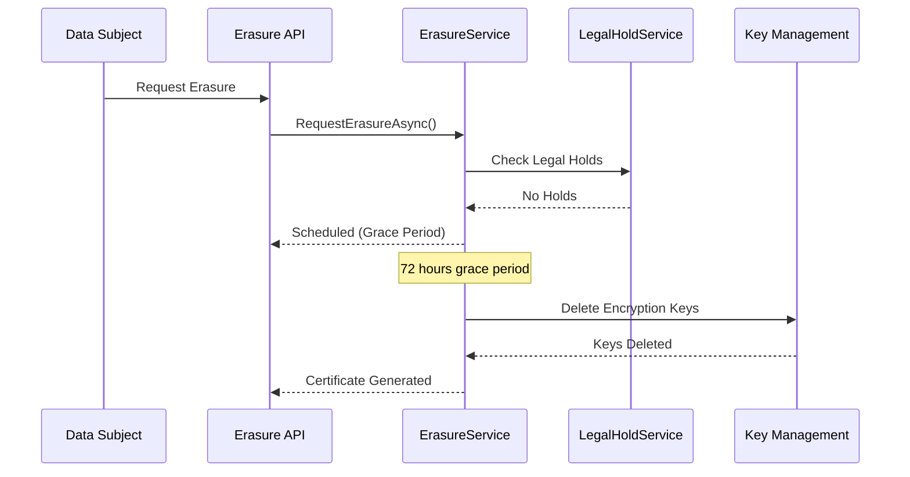

# GDPR Erasure

:::warning Not legal advice

This page describes technical features that can **support** your compliance work. It is not legal
advice, and it does not establish that any system is compliant with any law, regulation or standard.
You remain responsible for your own compliance assessment, independent testing and validation, and
review by qualified legal and compliance professionals. See the [Compliance Disclaimer](../legal/compliance-disclaimer.md).
:::

GDPR Article 17 ("Right to be Forgotten") requires organizations to delete personal data upon request. Dispatch implements this through cryptographic erasure (crypto-shredding), which renders data irrecoverable by deleting encryption keys.

## What you map is what gets destroyed

:::danger Erasure is whole-aggregate. Mapping the wrong aggregate destroys records you must keep.

`IAggregateDataSubjectMapping` is where you tell the framework which aggregates belong to a data
subject. **Every event of every aggregate you return is tombstoned** — the payload is nulled and the
event type is replaced with a reserved marker. Nothing is selective: not by field, not by event type,
and it cannot be undone.

So if you map a **transaction** aggregate — an order, a sale, a service visit, a loan — you lose the
transaction, not just the personal data inside it. The amount, the dates, the line items and the
vehicle or account identifier go with the customer's name. Those are frequently records you are
separately obliged to keep: tax records, warranty and product-recall traceability, anti-money-laundering
records with multi-year retention minimums.

:::

### Model for it

Put the identifying data in its own aggregate and have transaction aggregates hold a **reference** to
it. Then map only the personal-data aggregate:

```csharp
// Returns the aggregate holding the subject's PERSONAL DATA -- not their orders.
// Erasing this removes the person; the orders survive, carrying only a customer reference.
public sealed class CustomerAggregateMapping : IAggregateDataSubjectMapping
{
    private readonly ICustomerRepository _repository;

    public CustomerAggregateMapping(ICustomerRepository repository) => _repository = repository;

    public async Task<IReadOnlyList<AggregateReference>> GetAggregatesForDataSubjectAsync(
        string dataSubjectIdHash,
        string? tenantId,
        CancellationToken cancellationToken)
    {
        var customerId = await _repository.FindIdByHashAsync(dataSubjectIdHash, cancellationToken);

        return customerId is null
            ? []
            : [new AggregateReference(customerId, "Customer")];
    }
}
```

### When the law requires you to keep the record: declare a retention

Modelling only works while the personal data is *separable*. Where it is **unavoidably embedded in a
transaction record** — the buyer's name on a vehicle sales record, the warranty holder on a service
history — the record is worthless without it, and Article 17(3) withholds the right to erasure to the
extent processing is necessary to comply with a legal obligation.

Declare those aggregate types with `AddErasureRetention`. An erasure then **skips them**: the record
survives whole and readable, and the erasure record names the retention, its legal basis, the written
justification and the period.

```csharp
using Microsoft.Extensions.DependencyInjection;
using Excalibur.Compliance;
using Excalibur.Dispatch; // TenantScope

services.AddErasureRetention(
    new ErasureRetention
    {
        AggregateType = "SalesRecord",
        TenantId = TenantScope.UntenantedSentinel, // not multi-tenant; see below
        Basis = LegalHoldBasis.LegalObligation,
        Justification = "Vehicle sales records are kept for six years under the tax code's "
                      + "record-keeping requirement and for product-recall traceability.",
        RetentionPeriod = TimeSpan.FromDays(365 * 6),
    },
    new ErasureRetention
    {
        AggregateType = "WarrantyClaim",
        TenantId = TenantScope.UntenantedSentinel,
        Basis = LegalHoldBasis.LegalObligation,
        Justification = "Warranty claims are kept for the statutory warranty term plus the "
                      + "limitation period for claims arising from them.",
        RetentionPeriod = TimeSpan.FromDays(365 * 8),
    });
```

Every property is required, and each one is required for a reason:

| Property | Meaning |
|---|---|
| `AggregateType` | The aggregate type **exactly as the event store records it**. Matching is ordinal: a declaration of `salesrecord` against a stored `SalesRecord` is not a retention, and the record is destroyed. |
| `TenantId` | The tenant whose obligation this is. A deployment that is not multi-tenant names `TenantScope.UntenantedSentinel` — the same value an untenanted erasure request carries, so a declaration and a request spell one tenant the same way. It is non-nullable: an absent tenant was a second spelling of the untenanted one, and two spellings for one thing is what made the match undecidable. Required so the deployment has to say which case it is in — a tenant-blind retention would make one tenant inherit another's statute. A retention declared for the wrong tenant does not match, so the record is erased; that is visible on the erasure record, where the opposite default would silently withhold erasure from every other tenant's data subjects. |
| `Basis` | The Article 17(3) ground you are relying on (`LegalHoldBasis`). |
| `Justification` | The written obligation, in terms an auditor can evaluate — the statute, the retention schedule, the regulator's requirement. See the warning below on who reads it. |
| `RetentionPeriod` | How long the obligation lasts. Must be greater than zero. |

Nothing declared means every aggregate is erased exactly as it was before this capability existed, so a
deployment that declares no retention is unaffected by it.

Declarations are validated at host start: the aggregate type must be named, the justification must say
more than which ground was picked, and the period must be greater than zero. Calling
`AddErasureRetention` more than once accumulates.

:::warning Declare the retention **before** the data is written

Naming a type here changes which key its personal fields are encrypted under, and that is what keeps the
record readable after an erasure. Events written **before** the declaration were encrypted under the
subject's own key — the key the erasure destroys — so they survive the erasure with their personal fields
no longer decryptable. See [Crypto-Shredding](./crypto-shredding.md#per-subject-keys-and-erasure).
:::

:::danger The retained record must carry its own copy of what it needs

A sales record that reaches its buyer by following a reference into a customer aggregate **breaks when
that customer is erased** — the reference survives and resolves to a tombstone. Retention protects the
aggregate types you name and nothing they point at. This is ordinary aggregate independence, and the
retention depends on it.
:::

#### What this obliges you to do

- **Write the justification about the RECORD, not about a person.** It is shown to *every* data subject
  who appears in the retained record, including people the statute was not written with in mind. "Vehicle
  sales records are kept for six years under the tax code's record-keeping requirement" is evaluable by
  an auditor and by anyone named on the record; "the buyer's identity is required" reads as one person's
  obligation and is wrong for everyone else on the same record. Startup validation cannot check this — it
  refuses only a blank justification and one that merely restates the basis.
- **Release the retention when it expires.** The period is recorded and reported; **it is not a timer.**
  When a particular record's obligation lapses depends on facts the framework does not hold — the
  transaction date, the jurisdiction, whether the period was extended — so acting on your statutory clock
  is not a promise it makes. What it guarantees is that the period is declared, carried onto the erasure
  record, and visible.
- **Re-link returning subjects yourself.** If a subject returns and a new aggregate is created for them,
  matching it to the retained record is a business decision, on identifiers or transaction data you hold.
  The framework keeps no hidden link, because a hidden link would be exactly the re-identification the
  erasure was meant to remove.

#### Everyone named in a retained record is covered by the same declaration

A data subject who appears in a retained aggregate is not erased from it. The retention's basis,
justification and period are carried onto the erasure record for **every** such subject — not only for
whoever the obligation was written about.

**What the record does NOT say, because the distinction is easy to miss.** It does not tell the subject
that THEY are what persists in the retained type. The justification is written about the RECORD, and a
conformance arm requires the entry to avoid claiming lawful persistence — that is a legal claim about the
data, and the framework has not established it. If you owe a data subject a subject-scoped notice,
compose it from the basis, justification and period the record carries; the framework does not compose it
for you.

### The case that remains unsupported

**The retention unit is the aggregate type, whole. There is no field-level erasure inside a retained
record.** If you declare `SalesRecord` retained, every data subject named on a sales record keeps their
personal data there for the declared period; you cannot erase the buyer's name from an otherwise-retained
invoice.

That is a deliberate limit rather than an unfinished one. An obligation to keep a record attaches to the
*record*: a statute requiring sales records to be kept does not require the buyer and permit deleting the
salesperson, and a partly-erased record is a mutated record with no evidentiary value — which was the
entire reason for keeping it. An aggregate boundary is also an event boundary, so a retention can be
honoured without splitting a stored event, whose erasure is total; a finer unit has no boundary to use.

So the choice this page presents is between two supported outcomes — erase the aggregate type, or retain
it whole under a declared obligation — and not a third that erases selectively within it. Where you need
personal data gone from a record you must otherwise keep, that redaction remains yours to perform in your
own process.

## Before You Start

- **.NET 10.0**
- Install the required packages:
  ```bash
  dotnet add package Excalibur.Compliance
  # plus Excalibur.Compliance.SqlServer or Excalibur.Compliance.Postgres for the stores below
  ```
- Familiarity with [encryption architecture](../security/encryption-architecture.md) and [data masking](./data-masking.md)

## Overview


```mermaid
sequenceDiagram
    participant DS as Data Subject
    participant API as Erasure API
    participant ES as ErasureService
    participant LH as LegalHoldService
    participant KMS as Key Management

    DS->>API: Request Erasure
    API->>ES: RequestErasureAsync()
    ES->>LH: Check Legal Holds
    LH-->>ES: No Holds
    ES-->>API: Scheduled (Grace Period)

    Note over ES: 72 hours grace period

    ES->>KMS: Delete Encryption Keys
    KMS-->>ES: Keys Deleted
    ES-->>API: Certificate Generated
```

## Quick Start

### Configuration

```csharp
services.AddGdprErasure(options =>
{
    options.DefaultGracePeriod = TimeSpan.FromHours(72);
    options.RequireVerification = true;
});

// Development (in-memory stores)
services.AddInMemoryErasureStore();
services.AddInMemoryLegalHoldStore();
services.AddLegalHoldService();
services.AddErasureScheduler();

// Development only — see the two startup gates described below.
services.Configure<KeyDurabilityOptions>(o => o.AllowVolatileKeyProvider = true);
```

:::tip Minimal wiring

`AddGdprErasure(...)` `TryAdd`-registers a default `IKeyManagementAdmin` (the in-memory `InMemoryKeyManagementProvider`). When you need a real KMS provider, call `AddComplianceEncryption(...)` — an explicit registration takes precedence over the `TryAdd` default.

**The block above is not yet a host that starts.** Two startup gates refuse it, both deliberately:

- **No discovery source.** Erasure refuses to start with neither an `IDataInventoryService` nor an explicit
  opt-in, because a completion certificate would otherwise be issued over coverage nobody verified. Register
  `AddDataInventoryService()`, or set `options.KeyShredOnlyErasure = true` to accept key-destruction-only
  erasure (certificates then report a coverage basis of key destruction rather than store-verified coverage).
- **A volatile key provider.** Erasure works by destroying keys, so a durability gate refuses the in-memory
  provider unless the host says so explicitly: `services.Configure<KeyDurabilityOptions>(o =>
  o.AllowVolatileKeyProvider = true);`. A production host registers a durable provider instead.

The in-memory provider holds keys in process memory and does not persist them. **It is not suitable for production**, where a restart would lose the keys required to read crypto-shredded data.
:::

```csharp

// Production (SQL Server storage)
// Package: Excalibur.Compliance.SqlServer
services.AddSqlServerErasureStore(options =>
{
    options.ConnectionString = connectionString;
    options.SchemaName = "compliance";
});
services.AddSqlServerLegalHoldStore(options =>
{
    options.ConnectionString = connectionString;
    options.SchemaName = "compliance";
});
services.AddLegalHoldService();
```

:::caution Erasure refuses to start without a legal-hold service

Registering an erasure store on its own is **not** a working configuration. Erasure consults legal holds
through an optional dependency and skips the check when no legal-hold service is registered — correct for a
deployment that has no holds, and irreversible for one that does. Because the absence cannot be distinguished
from a misconfiguration, it must be declared rather than inferred, so the host **fails at startup** when
erasure is registered with no legal-hold service.

Register one, as the block above does.

A deployment that genuinely operates no legal holds declares that explicitly instead, with
`ErasureOptions.OperatesNoLegalHolds` — see [Legal Holds](#legal-holds) for that declaration and for which
released versions carry it.

The `AddExcaliburPostgres` and `AddExcaliburSqlServer` metapackages register the full compliance set,
including the legal-hold service, so a host composed through either of those needs neither the registration
above nor the flag.

:::

:::info The compliance stores require a tenant context — the registrations supply it

`SqlServerErasureStore`, `SqlServerLegalHoldStore` and their PostgreSQL counterparts take `ITenantContext`
as a **required** constructor parameter. It used to be optional and default to `null`, and a store built
without one partitioned by whatever an absent context resolved to — not a decision a compliance store should
make silently. The in-memory erasure and legal-hold stores changed the same way, but they are internal types
reachable only through `AddInMemoryErasureStore()` / `AddInMemoryLegalHoldStore()`, so nothing is different
from where you sit.

**If you register through the extensions shown on this page, nothing changes for you.** Each
`Add*ErasureStore` / `Add*LegalHoldStore` extension registers a fail-closed single-tenant `ITenantContext`
default on your behalf, so the store resolves one whether or not your host calls
[`AddMultiTenancy`](../multi-tenancy.md). You only need to act if you **construct one of these stores
directly** — pass an `ITenantContext`, or the constructor throws `ArgumentNullException`.

Registering a tenant context does not by itself make a deployment multi-tenant: the store reads the
deployment mode from `TenantContextOptions.RequireTenant`, which `AddMultiTenancy(...)` sets. A single-tenant
host resolves the reserved `__untenanted__` partition, exactly as before.
:::

:::note The in-memory stores now store the untenanted sentinel, matching the SQL providers

The SQL stores fold an absent tenant to the reserved `__untenanted__` sentinel before storing it. The
in-memory stores assigned the raw value, so a `null` reached storage and the same input produced a different
stored term depending on which provider you used. Both now fold identically, and the in-memory legal-hold
read no longer carries a second spelling of *absent*.

If you asserted on an in-memory store returning a `null` tenant — in a test, most likely — it returns
`__untenanted__` instead. See [Untenanted is a value, not an absence](../multi-tenancy.md#2-untenanted-is-a-value-not-an-absence).
:::

### Submit Erasure Request

```csharp
public class ErasureController : ControllerBase
{
    private readonly IErasureService _erasureService;

    [HttpPost("erasure")]
    public async Task<IActionResult> RequestErasure(
        [FromBody] ErasureRequestDto dto,
        CancellationToken ct)
    {
        var request = new ErasureRequest
        {
            DataSubjectId = dto.SubjectId,
            IdType = DataSubjectIdType.UserId,
            LegalBasis = ErasureLegalBasis.DataSubjectRequest,
            RequestedBy = User.Identity?.Name ?? "anonymous",
            TenantId = dto.TenantId,
            Scope = ErasureScope.User
        };

        var result = await _erasureService.RequestErasureAsync(request, ct);

        return Ok(new
        {
            RequestId = result.RequestId,
            Status = result.Status,
            ScheduledFor = result.ScheduledExecutionTime
        });
    }
}
```

## Erasure Workflow

### 1. Request Submission

```csharp
var request = new ErasureRequest
{
    DataSubjectId = "user-12345",
    IdType = DataSubjectIdType.UserId,
    LegalBasis = ErasureLegalBasis.DataSubjectRequest,
    RequestedBy = "compliance@company.com",
    TenantId = "tenant-abc",
    Scope = ErasureScope.User
};

var result = await _erasureService.RequestErasureAsync(request, ct);
```

### 2. Grace Period

Requests enter a configurable grace period (default 72 hours) before execution:

```csharp
services.AddGdprErasure(options =>
{
    // Default grace period (minimum recommended 72 hours for production)
    options.DefaultGracePeriod = TimeSpan.FromHours(72);

    // Configure min/max bounds
    options.MinimumGracePeriod = TimeSpan.FromHours(24);
    options.MaximumGracePeriod = TimeSpan.FromDays(30);
});
```

### 3. Cancellation (During Grace Period)

```csharp
var cancelled = await _erasureService.CancelErasureAsync(
    requestId: result.RequestId,
    reason: "Request withdrawn by data subject",
    cancelledBy: "support@company.com",
    ct);

if (!cancelled)
{
    // Request already executed or not found
}
```

### 4. Execution (Crypto-Shredding)

Erasure execution is handled automatically by the background scheduler after the grace period expires. Consumers do not call execution directly — monitor status via `GetStatusAsync`:

```csharp
// Poll for completion after grace period
var status = await _erasureService.GetStatusAsync(requestId, ct);

switch (status?.Status)
{
    case ErasureRequestStatus.Completed:
        _logger.LogInformation("Erasure complete for {RequestId}", requestId);
        break;
    case ErasureRequestStatus.PartiallyCompleted:
        _logger.LogWarning("Partial erasure for {RequestId}", requestId);
        break;
    case ErasureRequestStatus.Scheduled:
        _logger.LogInformation("Awaiting grace period for {RequestId}", requestId);
        break;
    case ErasureRequestStatus.Pending:
    case ErasureRequestStatus.InProgress:
        _logger.LogInformation("Erasure in flight for {RequestId}", requestId);
        break;
}
```

### Status values

`GetStatusAsync` can return any of the following. Handle `Pending` and `InProgress` explicitly if you poll — a request occupies them briefly but genuinely, and a `switch` that omits them falls through silently while work is still in flight.

| value | meaning |
|---|---|
| `Pending` | Request received, validation in progress. |
| `Scheduled` | In grace period, awaiting execution. |
| `InProgress` | Erasure currently executing. |
| `Completed` | Erasure completed successfully. |
| `BlockedByLegalHold` | Blocked by a legal hold (Article 17(3)). |
| `Cancelled` | Cancelled during the grace period. |
| `Failed` | Erasure failed and requires investigation. |
| `PartiallyCompleted` | Some data retained under a documented exception. |

### Statutory deadline

`ErasureStatus.DaysUntilDeadline(asOf)` is a **method**, not a property: it reports the days remaining against the one-month response deadline in Article 12(3), measured from `RequestedAt` as of the instant you pass, and floored at zero. Use it to surface requests approaching the limit:

```csharp
// GetStatusAsync is on IErasureStore. IErasureQueryStore carries only the two
// list-shaped members (GetScheduledRequestsAsync, ListRequestsAsync).
var status = await _erasureStore.GetStatusAsync(requestId, ct);
var remaining = status?.DaysUntilDeadline(DateTimeOffset.UtcNow);

if (status is { IsExecuted: false } && remaining <= 5)
{
    _logger.LogWarning(
        "Erasure {RequestId} has {Days} days remaining against the statutory deadline",
        requestId, remaining);
}
```

The framework reports the deadline. It does not enforce it — a request blocked by a legal hold, or one whose grace period has not elapsed, will pass the deadline without the framework intervening. Monitoring it is the controller's obligation.

### Certificate retention

Erasure certificates are your internal record of each request — not proof that it was carried out — and **the framework deletes them on a schedule.** Each certificate is stamped with a `RetainUntil` of completion plus `Retention.CertificateRetentionPeriod` — **7 years by default** — and `CleanupExpiredCertificatesAsync` permanently deletes every certificate past that date.

```csharp
services.Configure<ErasureOptions>(o =>
    o.Retention.CertificateRetentionPeriod = TimeSpan.FromDays(365 * 10)); // extend to 10 years
```

If your retention obligation is longer than the configured period, raise it before certificates begin ageing out, or export them to your own archive. Deletion is permanent and is not announced.

### Retention enforcement (`RetentionDays`)

`[PersonalData(RetentionDays = N)]` deletes nothing by itself. Retention is enforced only for the types you **declare**, by the `IRetentionContributor` implementations you register:

```csharp
services.AddRetentionPolicies<Customer>();   // Customer's [PersonalData] properties with RetentionDays > 0
services.AddRetentionEnforcement();          // periodic pass, every ScanInterval (24 hours by default)
services.AddSingleton<IRetentionContributor, CustomerRetentionContributor>();
```

Each pass hands your contributors `RetentionContributorContext.Policies` — the retention policies of the declared types and of nothing else — plus `AsOf`, the evaluation time. A contributor deletes records of those types older than the policy's `RetentionDays` as of `AsOf`, and must skip everything on a dry run. An annotated type you did not declare is never in `Policies`, even when its assembly is loaded. `AddRetentionPoliciesFromAssembly(assembly)` declares every annotated type in one assembly; it is not trim-safe, so trimmed and ahead-of-time applications should use `AddRetentionPolicies<T>()`.

- **Startup fails if enforcement is enabled and nothing is declared**, unless the only contributors registered are the built-in outbox and inbox ones (`AddOutboxRetention`, `AddInboxRetention`), which delete by their own age bound. To turn enforcement off, set `RetentionEnforcementOptions.Enabled = false`.
- **Declaring a type or assembly with no positive `RetentionDays` throws** at registration.
- **The enforcement pass does not check legal holds.** A contributor that deletes a data subject's records must call `ILegalHoldService.CheckHoldsAsync` itself before deleting.

:::warning Partial Completion Is Structural, Not Just On Failure

An erasure reaches `Completed` **only** when every discovered personal-data location is *covered* **and** no contributor reported an error. **Three** distinct conditions prevent it:

1. **A contributor erasure fails** (an error is reported), or
2. **A discovered location is left _uncovered_** — its store holds personal data but no mechanism erases it (no crypto-shred key, no covering `IErasureContributor`, no declared exemption), or
3. **A `[PersonalData]` category matches no discovered location at all** — annotated personal data the inventory never located. A `Completed` certificate over silently-skipped annotated data is deliberately made inexpressible.

Any of the three forces a non-`Completed` outcome **even when nothing threw** — the framework will not report `Completed` over a store it never erased.

**Which non-`Completed` status you get depends on whether anything succeeded.** If at least one key was deleted or at least one record was affected, the request is `PartiallyCompleted`. **If nothing succeeded at all — a pure coverage gap with zero deletions — the request is `Failed`, not `PartiallyCompleted`.** Handle both; a `switch` that treats coverage problems as always-partial will fall through on the pure-gap case.

See [Erasure Coverage Model](#erasure-coverage-model) below. Monitor the `ErasurePartiallyCompleted` event (ID 92729) and investigate uncovered stores and failed contributors.
:::

### 5. Compliance Certificate

Generate the erasure certificate — a signed **record** of the erasure, not proof of disposal (see the caution below). **A certificate can only be produced for a request whose status is
exactly `Completed`:** `GenerateCertificateAsync` throws `InvalidOperationException` for any other status —
including the `PartiallyCompleted` and `Failed` outcomes described directly above — and `KeyNotFoundException`
for a request id it does not know. So the cases most in need of documentation are the ones that cannot be
certified; evidence them from the status and its error summary instead.

```csharp
var certificate = await _erasureService.GenerateCertificateAsync(requestId, ct);

// The certificate is an envelope: certificate.Payload carries every claim, certificate.Signature
// covers that payload. Read claims through Payload.
// - Payload.RequestId, Payload.DataSubjectReference (anonymized), Payload.CertificateId
// - Payload.CompletedAt and Payload.Method (e.g. CryptographicErasure)
// - Payload.Summary.KeysDeleted / RecordsAffected
// - Payload.Summary.DataCategories is present on the type but is NOT populated: both paths that build
//   a certificate summary set it to an empty list, so do not rely on it
// - Payload.Verification.Verified + Payload.Verification.DeletedKeyIds (the key IDs proven gone)
// - Payload.Exceptions: stores deliberately retained under Article 17(3) (e.g. the audit store),
//   each with its legal Basis
// - Payload.Version: the certificate format version, INSIDE the signed payload. Read the scheme from
//   here, never from an untrusted envelope
// - Signature: an HMAC-SHA256 keyed with your configured signing key, computed over a canonical
//   serialization of Payload IN FULL. Every claim above is covered; the signature itself sits on the
//   envelope, outside the signed input, so there is no exclusion list to get wrong.
```

:::danger A certificate is a record, not proof of disposal — and two things about it still need care

**`Verification.Verified` does not mean the deletions were confirmed.** On the execution path it is
`DeletedKeyIds.Count == KeysDeleted`, so it reads `true` when both are zero — the value produced by a
hard deletion in which no key was ever shredded, and by an erasure that substantiated nothing. Read
`Payload.Verification.DeletedKeyIds` for what was actually proven gone, treat an empty list as
*unsubstantiated* rather than as *nothing needed deleting*, and read
`Payload.Verification.Methods`: it reports `None` when no check substantiated the erasure.

**The framework ships no way to verify a certificate's signature.** It signs; it does not verify.
`ErasureVerificationService` is not that check — it verifies that erasure occurred and does not touch
the signature. Write the verification side yourself: recompute HMAC-SHA256 over a canonical
serialization of `Payload` with your signing key, and compare in constant time.

**Certificates written by earlier versions carry a weaker signature.** Format `1.0` signed three
identity fields only — the request id, the subject hash and the completion instant — so a `1.0`
certificate's claims could be altered while its signature still verified, and its version marker sat
outside the signed input. Format `2.0` signs the payload whole and carries the version inside it.
Check `Payload.Version` before relying on any `1.0` certificate you have retained, and see the
[Known issues](../known-issues.md) page.

**The evidence of disposal is your key-management service's record of the key deletion**, not this
document. The certificate records that a request was processed and what the framework observed.
:::

## Erasure Coverage Model

Erasure breadth is governed by a **three-state coverage gate**. Every personal-data [location](#data-inventory) discovered for the data subject is classified as one of:

| State | Meaning | Effect on status |
|-------|---------|------------------|
| **Covered** | A mechanism erases this location: its per-subject encryption key was deleted (crypto-shred), **or** a registered `IErasureContributor` declares its store kind. | Does not block `Completed`. |
| **Exempt** | A declared, documented retention exemption with a legal basis (e.g. the audit/security store). | Enumerated on the certificate (`Exceptions`), but **non-blocking**. |
| **Uncovered** | Neither covered nor exempt — a genuine gap. | **Forces a non-`Completed` outcome** — `PartiallyCompleted` if anything succeeded, `Failed` if nothing did — naming the uncovered store. |

`Completed` is reachable **only** when there are zero uncovered locations and zero errors. This is enforced structurally — the framework cannot report `Completed` over a store it never erased.

### Store kinds and contributor coverage

Each `DataLocation` carries a `StoreKind` (`Excalibur.Compliance.DataStoreKind`). A contributor declares which kinds it erases via `CoveredStoreKinds`:

```csharp
using Excalibur.Compliance;

public sealed class OutboxErasureContributor : IErasureContributor
{
    public string Name => "Outbox";

    // The coverage gate marks an Outbox-kind location as Covered when this contributor is registered.
    public IReadOnlySet<DataStoreKind> CoveredStoreKinds { get; } =
        new HashSet<DataStoreKind> { DataStoreKind.Outbox };

    public Task<ErasureContributorResult> EraseAsync(
        ErasureContributorContext context,
        CancellationToken cancellationToken)
    {
        // Delete/tombstone rows for context.DataSubjectIdHash, then:
        return Task.FromResult(ErasureContributorResult.Succeeded(recordsAffected: 0));
    }
}
```

`DataStoreKind` is an **extensible**, string-backed kind (the Microsoft "names" pattern), not a closed enum — consumers may have custom stores holding personal data. Use the well-known members (`DataStoreKind.EventStore`, `.Snapshot`, `.Outbox`, `.Inbox`, `.Projection`, `.Saga`, `.Audit`, `.Cache`) for first-party stores and `DataStoreKind.Create("MyCustomStore")` for your own. The default/unclassified kind (`DataStoreKind.Unknown`) is **never coverable** — an unclassified location always blocks `Completed`, so a store can never silently pass as erased.

### Audit/security store: exempt by default

The audit/security store kind (`DataStoreKind.Audit`) is treated as **`Exempt` by default**, on the legal basis of **GDPR Article 17(3)(b)** (processing necessary for compliance with a legal obligation — security audit-trail retention) and **Article 17(3)(e)** (establishment, exercise, or defence of legal claims — security-incident investigation). The exemption is recorded explicitly on the certificate's `Exceptions` list with its basis — it is never a silent skip and is never falsely counted as covered.

If your compliance posture requires the audit store to be erased (no legal-retention basis, or post-retention-window erasure), **override the default** by registering an `IErasureContributor` whose `CoveredStoreKinds` includes `DataStoreKind.Audit` (contributor coverage wins over the default exemption).

:::warning Compliance assistance, not a compliance guarantee

The default audit-store exemption is a **sensible documented default**, not a legal determination. Excalibur is a framework, not your application — it cannot make your organization's final legal call. Your Data Protection Officer owns the decision of whether the audit store is in scope for a given erasure. See the [Compliance Disclaimer](../legal/compliance-disclaimer.md).
:::

## Legal Holds

Article 17(3) exceptions prevent erasure for:
- Legal claims
- Litigation holds
- Regulatory investigations
- Legal obligations

:::info Not in any published version yet
The startup refusal and `ErasureOptions.OperatesNoLegalHolds` described in this section are **not present
in `10.0.0-alpha.10` or any earlier release** — verified against the published assembly. On a released
package, erasure starts with no legal-hold service registered and **silently skips the hold check**. Until
a release carries this, register `AddLegalHoldService()` yourself and do not rely on a startup error to
tell you it is missing. When a release does carry it, this note will name that version.
:::

Erasure **refuses to start** unless a legal-hold service is registered, because the hold check is
skipped when the service is absent and erasure is irreversible. Registering only an `ILegalHoldStore`
is rejected as well — that is the configuration most easily mistaken for protection, since holds would
be written and readable but never enforced. Register `AddLegalHoldService()` alongside the store.

If a deployment genuinely operates no legal holds, declare it rather than leaving it to be inferred:

```csharp
services.AddNoLegalHolds();
```

`AddNoLegalHolds()` is one call that does both halves: it registers the service that reports no holds, and it records the declaration. **Setting `ErasureOptions.OperatesNoLegalHolds` on its own fails at startup** — the wiring validator has no early return for it, and refuses with a message naming this call. Declaring no holds accepts that no erasure request will ever be blocked by one. The
absence of the check has to be a decision, so there is no configuration that silently skips it.

### Register a Legal Hold Store

Holds are persisted through `ILegalHoldStore`, which is a separate registration from the erasure store —
registering the erasure store alone gives you no hold storage.

```csharp
// SQL Server — package: Excalibur.Compliance.SqlServer
services.AddSqlServerLegalHoldStore(options =>
{
    options.ConnectionString = builder.Configuration.GetConnectionString("Compliance");
    // options.SchemaName = "compliance";     // default
    // options.TableName = "LegalHolds";      // default
    // options.AutoCreateSchema = true;       // opt in to have the store create its own table
});

// PostgreSQL — package: Excalibur.Compliance.Postgres
services.AddPostgresLegalHoldStore(options =>
{
    options.ConnectionString = builder.Configuration.GetConnectionString("Compliance");
    // options.SchemaName = "compliance";     // default
    // options.TableName = "LegalHolds";      // default
    // options.AutoCreateSchema = true;       // opt in to have the store create its own table
});
```

Both providers also expose an `…FromConfiguration` overload that binds the options from a configuration
section instead of a lambda.

`AutoCreateSchema` has the same meaning here as for the erasure store — same default of `false`, same
create-versus-verify semantics — but **not the same timing.** Only the erasure store registers a startup
validator. The legal-hold store (and the data-inventory store below) verify their schema **lazily, on first
use**, so a missing or wrong table surfaces on the first erasure-related operation rather than at startup.
See [Database Schema](#database-schema).

### Check for Holds

```csharp
public class LegalHoldAwareErasure
{
    private readonly ILegalHoldService _holdService;
    private readonly IErasureService _erasureService;

    public async Task<ErasureResult> SafeErasure(
        ErasureRequest request,
        CancellationToken ct)
    {
        // Check for active holds (requires DataSubjectIdType)
        var checkResult = await _holdService.CheckHoldsAsync(
            request.DataSubjectId,
            request.IdType,
            request.TenantId,
            ct);

        if (checkResult.HasActiveHolds)
        {
            throw new ErasureOperationException(
                $"Cannot erase: {checkResult.ActiveHolds.Count} active legal hold(s)");
        }

        return await _erasureService.RequestErasureAsync(request, ct);
    }
}
```

### Create Legal Hold

```csharp
var hold = await _holdService.CreateHoldAsync(new LegalHoldRequest
{
    DataSubjectId = "user-12345",
    IdType = DataSubjectIdType.UserId,
    TenantId = "tenant-abc",
    Basis = LegalHoldBasis.LitigationHold,
    CaseReference = "Case #2024-001",
    Description = "Pending lawsuit - Case #2024-001",
    CreatedBy = "legal@company.com",
    ExpiresAt = DateTimeOffset.UtcNow.AddYears(2)
}, ct);
```

### Release Hold

```csharp
await _holdService.ReleaseHoldAsync(
    holdId: hold.HoldId,
    reason: "Litigation concluded",
    releasedBy: "legal@company.com",
    ct);
```

### Updating a hold is a compare-and-set

`LegalHold` carries a `Version` — a portable `int` the **store** owns. A new hold is stored at `0` and each
successful update increments it. `UpdateHoldAsync` applies a write only while the stored record still carries
the version the caller read.

This exists because updating a hold is a read-modify-write, and without the check a decision is applied over
whatever the record became in the meantime. A hold whose expiry was extended between a sweep's read and its
write would be released anyway, and the next erasure for that subject would proceed — destroying records a
court order says to keep, with no signal that anything went wrong.

**Round-trip the version by building the record you write from the one you read:**

```csharp
var hold = await store.GetHoldAsync(holdId, ct);
if (hold is null)
{
    return;
}

// `with` carries Version across -- this is the shape to use. Constructing a fresh
// LegalHold from parts sets Version to 0, and the write is refused.
var extended = hold with { ExpiresAt = hold.ExpiresAt?.AddDays(30) };

try
{
    var applied = await store.UpdateHoldAsync(extended, ct);
    if (!applied)
    {
        // No such hold, or not visible to this tenant. NOT a conflict.
    }
}
catch (LegalHoldConcurrencyException)
{
    // Present and visible, but it moved under you; the write was not applied.
    // Re-READ and re-DECIDE -- do not re-apply the same write with a fresh version.
}
```

Three outcomes, where there were previously two: `true` (applied), `false` (nothing to write to — absent or
another tenant's), and `LegalHoldConcurrencyException` (the record moved). A conflict is an exception rather
than a return value because the failure it prevents is silent, and a conflict returned as a `bool` can be
discarded at the call site.

**If you implement `ILegalHoldStore` yourself**, note that the method signature has not changed — so a store
that ignores the version still compiles and keeps the lost update silently. The full contract, the schema
column, and what an existing database does at startup:
[a legal hold carries a concurrency token](../migration/legal-hold-concurrency-token.md).

## Erasure Scopes

Control what data is erased:

```csharp
public enum ErasureScope
{
    User = 0,       // Erase all data for a specific user
    Tenant = 1,     // Erase all data for an entire tenant
    Selective = 2   // Erase specific data categories only
}

// Selective erasure with data categories
var request = new ErasureRequest
{
    DataSubjectId = "user-12345",
    IdType = DataSubjectIdType.UserId,
    LegalBasis = ErasureLegalBasis.ConsentWithdrawal,
    RequestedBy = "compliance@company.com",
    Scope = ErasureScope.Selective,
    DataCategories = ["marketing", "analytics"]
};
```

## Data Inventory

Track where personal data is stored. Register the data inventory service via DI:

```csharp
// Register data inventory services
services.AddDataInventoryService();

// Development / tests
services.AddInMemoryDataInventoryStore();

// SQL Server — package: Excalibur.Compliance.SqlServer
services.AddSqlServerDataInventoryStore(options =>
{
    options.ConnectionString = builder.Configuration.GetConnectionString("Compliance");
    // options.SchemaName = "compliance";                             // default
    // options.RegistrationsTableName = "DataInventoryRegistrations"; // default
    // options.DiscoveredLocationsTableName = "DiscoveredDataLocations";
    // options.AutoCreateSchema = true;   // opt in to have the store create its own tables
});

// PostgreSQL — package: Excalibur.Compliance.Postgres
services.AddPostgresDataInventoryStore(options =>
{
    options.ConnectionString = builder.Configuration.GetConnectionString("Compliance");
    // options.SchemaName = "compliance";                             // default
    // options.RegistrationsTableName = "DataInventoryRegistrations"; // default
    // options.DiscoveredLocationsTableName = "DiscoveredDataLocations";
    // options.AutoCreateSchema = true;   // opt in to have the store create its own tables
});
```

The data inventory store keeps two tables rather than one — the registrations you declare and the
locations discovery finds — so it has a table-name option for each.

:::note

The `IDataInventoryService` provides registration and discovery of personal data locations across your system, enabling comprehensive erasure and Records of Processing Activities (RoPA) documentation.
:::

:::caution The in-memory data-inventory store is not tenant-capable
`IDataInventoryStore` is a tenant-owned contract. The **SQL Server and PostgreSQL** data-inventory stores
both attest a tenant capability, so they work alongside
[`AddMultiTenancy`](../multi-tenancy.md#first-class-persistence-isolation-addmultitenancy) with the
`RowDiscriminator` strategy.

The **in-memory** store shown above does not attest one, so a host that registers it *and* calls
`AddMultiTenancy(RowDiscriminator)` fails fast at startup. That is a startup refusal, not a silent leak —
you see it immediately in a local run, not in production. Register a durable data-inventory store, or keep
the in-memory one out of a container that configures row-discriminator tenancy.
:::

## Verification

### Check Erasure Status

```csharp
var status = await _erasureService.GetStatusAsync(requestId, ct);

switch (status?.Status)
{
    case ErasureRequestStatus.Scheduled:
        // In grace period
        break;
    case ErasureRequestStatus.Completed:
        // Successfully erased
        break;
    case ErasureRequestStatus.Failed:
        // Execution failed
        break;
    case ErasureRequestStatus.Cancelled:
        // Cancelled during grace period
        break;
}
```

### List Requests

```csharp
// Inject IErasureQueryStore — a separate, list-shaped contract. It does NOT inherit IErasureStore;
// request-addressed members such as GetStatusAsync live on IErasureStore.
var requests = await _erasureQueryStore.ListRequestsAsync(
    status: ErasureRequestStatus.Completed,
    tenantId: "tenant-abc",
    fromDate: DateTimeOffset.UtcNow.AddDays(-30),
    toDate: DateTimeOffset.UtcNow,
    pageNumber: 1,
    pageSize: 100,
    ct);
```

Results are paged. `pageNumber` is 1-based and `pageSize` accepts 1–1000; both are required, and values outside those ranges are rejected. Page through the result set rather than requesting an unbounded list — **nothing prunes the erasure-request table.** Certificate cleanup deletes from the certificates table only, so on a busy tenant the request table grows without bound and is yours to archive.

## Background Scheduler

Register the erasure scheduler to automatically execute requests after the grace period:

```csharp
// Register the scheduler service
services.AddErasureScheduler();
```

For serverless environments where background services are not available, register the erasure scheduler as a timer-triggered function:

```csharp
public class ErasureFunction
{
    private readonly IServiceProvider _serviceProvider;

    [Function("ProcessErasureRequests")]
    public async Task Run(
        [TimerTrigger("0 */5 * * * *")] TimerInfo timer,
        CancellationToken ct)
    {
        // The scheduler handles execution internally when started
        // For serverless, use AddErasureScheduler() in DI and
        // let the hosted service process pending requests
        await using var scope = _serviceProvider.CreateAsyncScope();
        // Scheduler auto-processes pending requests on activation
    }
}
```

:::tip

For serverless deployments, `AddErasureScheduler()` registers the background service that automatically processes requests past their grace period. The execution logic is internal to the framework — consumers only need to submit requests and monitor status.

:::

## Database Schema

**By default the erasure store does not create its tables. You provision them, and the store verifies they exist at startup.**

Schema handling is controlled by `AutoCreateSchema`, which **defaults to `false`**: on startup the store verifies that the `compliance` schema and both of its tables — the erasure-request table and the erasure-certificate table — are present, and fails fast if they are missing rather than creating them. Set `AutoCreateSchema = true` to have the store create the schema and tables on first use if they do not already exist. Behavior is identical on SQL Server and PostgreSQL.

```csharp
// SQL Server — default: you provision the tables, the store verifies them at startup
services.AddSqlServerErasureStore(options =>
{
    options.ConnectionString = builder.Configuration.GetConnectionString("Compliance");
    // options.AutoCreateSchema = true;       // opt in to have the store create its own tables
});

// PostgreSQL — default: you provision the tables, the store verifies them at startup
services.AddPostgresErasureStore(options =>
{
    options.ConnectionString = builder.Configuration.GetConnectionString("Compliance");
    // options.AutoCreateSchema = true;       // opt in to have the store create its own tables
});
```

:::warning Provision the tables from the store's own definition, not a copied schema

The column set — including the pseudonymized subject identifier described under [Data-subject hashing](#data-subject-hashing-idatasubjecthasher) — is an implementation detail that evolves with the framework.

Whether you provision the tables yourself (the default) or opt into `AutoCreateSchema = true`, a table built from a schema that does not match is not corrected: the store finds a table already present and leaves it as is. The mismatch surfaces later, at the moment a data subject exercises a right, rather than at startup. Provision from the store's own definition, not a copy transcribed into documentation.

:::

Because `AutoCreateSchema` defaults to `false`, DBA-managed environments get fail-fast verification without extra configuration: provision the tables to match the store's own definition and the store confirms they exist at startup. The schema and table names are configurable via `SchemaName`, `RequestsTableName`, and `CertificatesTableName`.

## Testing

### Unit Tests

```csharp
[Fact]
public async Task Should_Schedule_Erasure_With_Grace_Period()
{
    // Arrange
    var request = new ErasureRequest
    {
        DataSubjectId = "user-123",
        IdType = DataSubjectIdType.UserId,
        LegalBasis = ErasureLegalBasis.DataSubjectRequest,
        RequestedBy = "test@example.com",
        TenantId = "tenant-abc"
    };

    // Act
    var result = await _erasureService.RequestErasureAsync(request, CancellationToken.None);

    // Assert
    result.Status.ShouldBe(ErasureRequestStatus.Scheduled);
    result.ScheduledExecutionTime.ShouldBeGreaterThan(DateTimeOffset.UtcNow);
}

[Fact]
public async Task Should_Block_Erasure_With_Legal_Hold()
{
    // Arrange — create a legal hold first
    await _holdService.CreateHoldAsync(new LegalHoldRequest
    {
        DataSubjectId = "user-123",
        IdType = DataSubjectIdType.UserId,
        Basis = LegalHoldBasis.LitigationHold,
        CaseReference = "CASE-001",
        Description = "Test litigation hold",
        CreatedBy = "legal@example.com"
    }, CancellationToken.None);

    var request = new ErasureRequest
    {
        DataSubjectId = "user-123",
        IdType = DataSubjectIdType.UserId,
        LegalBasis = ErasureLegalBasis.DataSubjectRequest,
        RequestedBy = "test@example.com"
    };

    // Act & Assert — erasure should be blocked
    var result = await _erasureService.RequestErasureAsync(request, CancellationToken.None);
    result.Status.ShouldBe(ErasureRequestStatus.BlockedByLegalHold);
}
```

## Event Store Erasure

When using event sourcing, GDPR erasure must extend to event stores. The `IEventStoreErasure` interface (in `Excalibur.EventSourcing`) enables cryptographic erasure at the event store level.

### IEventStoreErasure Interface

```csharp
namespace Excalibur.EventSourcing;

public interface IEventStoreErasure
{
    /// <summary>
    /// Erases all event payloads for the specified aggregate, replacing them
    /// with a tombstone marker. The stream is retained for referential integrity.
    /// </summary>
    Task<int> EraseEventsAsync(
        string aggregateId,
        string aggregateType,
        Guid erasureRequestId,
        CancellationToken cancellationToken);

    /// <summary>
    /// Checks whether erasure has been performed for the specified aggregate.
    /// </summary>
    Task<bool> IsErasedAsync(
        string aggregateId,
        string aggregateType,
        CancellationToken cancellationToken);
}
```


:::info Tenant confinement

Both erasure operations are confined to the ambient tenant established for the store instance:
`EraseEventsAsync` tombstones only that tenant's stream for the given aggregate, and `IsErasedAsync`
answers only for it. The confinement is structural, and the mechanism differs by provider family.
The relational stores bind an unconditional tenant term on every erase and existence check, routed
through a partition type with no empty inhabitant, so a tenant-less erase cannot be constructed. The
document and in-memory stores address a key whose leading segment is the owning tenant, so another
tenant's stream is unaddressable rather than merely filtered out.

**Where a provider composes the tenant into a key, the composition is injective.** Erasure is
destructive and irreversible — a confinement failure here would destroy another tenant's history rather
than disclose it — so the tenant and the record identifier are encoded rather than concatenated: no pair
of identifiers can compose to another pair's key, whatever characters they contain. **Identifiers
containing the separator are supported and need no special handling by you.** A store presenting no
tenant capability marker is not confined by the framework at all.

Stated here because an assessor reading this page is entitled to know both what the framework
guarantees and what, if anything, it requires of you — and for these operations the answer to the
second is nothing.
:::

Event store providers that support GDPR erasure implement this interface. Ask the store for the
capability with `GetService(typeof(IEventStoreErasure))` — do **not** test its type. A store is
commonly reached through a decorator, whose own interface list is fixed when it is compiled while the
capabilities of the store it wraps are known only at run time, so `is IEventStoreErasure` reports the
decorator rather than the chain beneath it. A decorator answers this probe on behalf of the store it
wraps, and one that cannot honour erasure over its inner store answers `null` rather than claiming it:

```csharp
if (eventStore.GetService(typeof(IEventStoreErasure)) is IEventStoreErasure erasure)
{
    var count = await erasure.EraseEventsAsync(
        aggregateId: "user-12345",
        aggregateType: "UserProfile",
        erasureRequestId: requestId,
        cancellationToken);

    logger.LogInformation("Erased {Count} events for aggregate {AggregateId}", count, "user-12345");
}
```

### Saving an aggregate whose events were erased: `ErasedStreamRepublicationException`

Erasure rewrites existing event rows rather than removing them, and that creates one narrow hazard on the
**save** path. `ErasedStreamRepublicationException` closes it.

**The shape it closes.** An append commits. Its acknowledgement is lost. An erasure then destroys those
events. The caller — still holding the aggregate the payloads were built from — retries the save. The store
recognises its own rows by identity and answers `AppendOutcome.AlreadyCommitted`, which is *correct*: the
append genuinely did commit. What has stopped being true is that **present implies retrievable.** Continuing
from there would stage the erased subject's own payloads to the outbox and hand them to inline projections —
after the erasure certificate was already issued, and with nothing downstream ever learning.

So the repository refuses instead:

```csharp
try
{
    await _repository.SaveAsync(order, ct);
}
catch (ErasedStreamRepublicationException)
{
    // The append LANDED and the stream has been erased since. Nothing was staged to the
    // outbox and nothing was notified, so there is nothing to compensate.
    // Discard this in-memory instance and reload; retrying the same one throws again.
    order = await _repository.GetByIdAsync(orderId, ct);
}
```

**What catching it tells you**, precisely:

- the append **did** commit and remains durable — this is not a failed write;
- the stream **has been erased** since, so the events are no longer retrievable;
- **nothing was staged and nothing was notified**, so there is no compensation to perform;
- retrying the **same in-memory instance** will throw again. That is intended. Reload.

**It carries no identifiers, by design.** The type is the whole signal — a caller that needs to know catches
it. The message names no aggregate, no subject and no payload, and the framework writes no log line at the
refusal, so neither a surfaced exception message nor a log built from one can disclose which subject was
involved. If you construct one yourself, the same obligation applies: do not pass an aggregate identifier, a
subject identifier, or any payload into the message.

It derives from `InvalidOperationException`, so an existing broad `catch (InvalidOperationException)` already
catches it — but it will not tell you to reload rather than retry, which is the whole point of the distinct
type.

:::note Two reasons this costs you nothing on the ordinary path
It runs **only** where an append was *recognised* rather than written — the store's identity probe fired, or
the in-memory staging breadcrumb matched — which is already a failure-path outcome. A fresh append never
reaches the check and never pays the round trip.

And where the store chain does not present `IEventStoreErasure`, the check returns immediately. That is a
**sound negative rather than a gap**: the erasure that would create this hazard can only be performed
through that capability on the same store chain, so a store that does not present it cannot have been erased
through it. The probe asks the store for the capability rather than testing its type, so a decorator answers
on behalf of the store it wraps.
:::

### Data-subject hashing (`IDataSubjectHasher`)

GDPR components pseudonymize data-subject identifiers through the injected
`IDataSubjectHasher` service, so plain-text IDs are never stored in erasure request
tables or audit logs. The default implementation (`HmacDataSubjectHasher`) uses a
**keyed HMAC-SHA-256** with a required secret **pepper** — a keyed one-way hash, not a
plain SHA-256 digest. The pepper (held apart from the data) defeats offline
brute-forcing of low-entropy identifiers; because the scheme is one-way and
deterministic, the same ID always maps to the same token for match-and-erase, but the
token cannot be reversed to recover the ID.

The pepper is **required** and validated at startup: if it is missing or shorter than
`DataSubjectHashingOptions.MinimumPepperLength` (32 characters) the host **fails closed**
with an `OptionsValidationException` rather than pseudonymizing with a weak key. Supply
it from your secret manager / KMS — never a literal in source:

```csharp
using Excalibur.Compliance.Erasure;

// Registered automatically by AddGdprErasure / AddLegalHoldService / AddDataInventoryService.
// You only need to configure the required pepper:
builder.Services.Configure<DataSubjectHashingOptions>(o =>
    o.Pepper = builder.Configuration["Gdpr:DataSubjectPepper"]); // high-entropy secret, ≥ 32 chars

// Resolve/inject IDataSubjectHasher where you need a stable pseudonym:
public sealed class MyService(IDataSubjectHasher hasher)
{
    public string Pseudonymize(string dataSubjectId) => hasher.HashDataSubjectId(dataSubjectId);
}
```

### Implementing Custom Event Store Erasure

If you have a custom event store, implement `IEventStoreErasure` alongside your `IEventStore`:

```csharp
public class MyEventStore : IEventStore, IEventStoreErasure
{
    public async Task<int> EraseEventsAsync(
        string aggregateId,
        string aggregateType,
        Guid erasureRequestId,
        CancellationToken cancellationToken)
    {
        // Replace event payloads with tombstone markers
        // Retain the stream and event metadata for referential integrity
        var count = await ReplacePayloadsWithTombstone(aggregateId, aggregateType, cancellationToken);

        // Log the erasure for audit
        await RecordErasureAudit(aggregateId, erasureRequestId, count, cancellationToken);

        return count;
    }

    public async Task<bool> IsErasedAsync(
        string aggregateId,
        string aggregateType,
        CancellationToken cancellationToken)
    {
        return await CheckForTombstoneMarker(aggregateId, aggregateType, cancellationToken);
    }
}
```

:::tip Key Design Decision

Event store erasure uses **tombstoning** (replacing payloads) rather than **deletion** (removing events). This preserves the event sequence and version numbers for other aggregates that may reference these events, while making the personal data irrecoverable.
:::

## Best Practices

| Practice | Recommendation |
|----------|----------------|
| Grace period | Leave `DefaultGracePeriod` at 72 hours for production, and raise `MinimumGracePeriod` above its 1-hour default so no caller can request a shorter window |
| Legal holds | Always check before execution |
| Audit logging | Enable for compliance evidence |
| Key rotation | Use separate keys per data subject |
| Verification | Keep your key-management service's record of each key deletion: that, not the certificate, is the evidence of disposal. The framework does not write erasure events to the audit log |
| Data inventory | Maintain accurate data location registry |

## Compliance Mapping

| GDPR Article | Feature |
|--------------|---------|
| Article 17(1) | ErasureService.RequestErasureAsync() |
| Article 17(2) | Cascade to all data locations via DataInventory |
| Article 17(3)(b) | LegalHoldService for compliance obligations |
| Article 17(3)(e) | LegalHoldService for legal claims |

## Next Steps

- [Data Masking](data-masking.md) - PII/PHI protection
- [Audit Logging](audit-logging.md) - Compliance audit trails

## See Also

- [Data Masking](data-masking.md) - PII/PHI protection in logs and outputs
- [Compliance Overview](index.md) - Compliance framework capabilities
- [Audit Logging](audit-logging.md) - Tamper-evident audit logging with hash chain integrity
