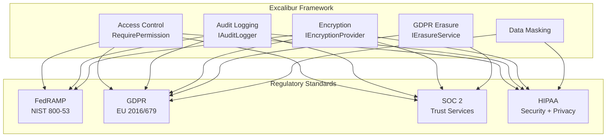

---
sidebar_position: 31
title: Compliance
description: Enterprise compliance features for FedRAMP, GDPR, SOC 2, and HIPAA
---

# Compliance Documentation

Excalibur provides comprehensive compliance features for enterprise regulatory requirements including **FedRAMP**, **GDPR**, **SOC 2**, and **HIPAA**.

## Quick Navigation

### 🚀 Getting Started

**New to compliance?** Start with the [Quick Start Guide](quick-start.md) - a 30-minute walkthrough covering installation, configuration, and verification.

**Visual learner?** Check out the [Navigation Guide](navigation-guide.md) with flowcharts, diagrams, and timelines for all frameworks.

### 📋 Certification Checklists {#compliance-checklists}

Step-by-step guides for achieving compliance certification:

| Framework | When to Use | Checklist | Certification Time |
|-----------|-------------|-----------|-------------------|
| **[FedRAMP](checklists/fedramp.md)** | Selling to US federal government | NIST 800-53 (14/14 controls) | 6-12 months |
| **[GDPR](checklists/gdpr.md)** | Processing EU resident data | Articles 17, 30, 32 | 3-6 months |
| **[SOC 2](checklists/soc2.md)** | SaaS, cloud, MSP businesses | Trust Services Criteria | 3-18 months |
| **[HIPAA](checklists/hipaa.md)** | Healthcare data (PHI) | Security + Privacy Rules | 6-12 months |

### 🔧 Framework Features {#framework-capabilities}

Core compliance capabilities provided by Excalibur.Dispatch:

| Feature | Documentation | FedRAMP | GDPR | SOC 2 | HIPAA |
|---------|---------------|---------|------|-------|-------|
| **Access Control** | [Security Guide](../advanced/security.md) | AC-3, AC-6 | Art 32 | CC5, CC6 | §164.312(a) |
| **Audit Logging** | [Audit Logging](audit-logging.md) | AU-2, AU-3, AU-9 | Art 32 | CC4, CC7 | §164.312(b) |
| **Encryption** | [Encryption Architecture](../security/encryption-architecture.md) | SC-28 | Art 25, 32 | C2 | §164.312(a)(2)(iv) |
| **Data Masking** | [Data Masking](data-masking.md) | N/A | Art 32 | C2 | §164.312 |
| **GDPR Erasure** | [GDPR Erasure](gdpr-erasure.md) | N/A | Art 17 | C3 | Disposal |

### 📊 FedRAMP Epic Closure

**Status:** ✅ 14/14 NIST 800-53 controls SATISFIED (100% complete)

The FedRAMP compliance epic (i43v) has been successfully closed after a 7-sprint journey (Sprints 265-272):

- [FedRAMP Overview](fedramp/README.md) - Complete 14/14 control implementation
- [CM-8 SBOM](fedramp/CM-8-SBOM.md) - Software Bill of Materials (CycloneDX)

## Compliance Overview



## Quick Start

### Install Packages

All frameworks require the core security packages:

```bash
# Core domain capabilities (required for all)
dotnet add package Excalibur.Domain

# Compliance features (GDPR erasure, SOC 2 validation)
dotnet add package Excalibur.Dispatch.Compliance

# Audit logging
dotnet add package Excalibur.Dispatch.AuditLogging

# For production audit persistence (SQL Server)
dotnet add package Excalibur.Dispatch.AuditLogging.SqlServer

# For production erasure/legal hold persistence (SQL Server)
dotnet add package Excalibur.Compliance.SqlServer
```

### Basic Configuration

```csharp
using Excalibur.Dispatch.Compliance;

var builder = WebApplication.CreateBuilder(args);

// 1. Access Control (All frameworks)
builder.Services.AddAuthorization();

// 2. Encryption (FedRAMP, GDPR, SOC 2, HIPAA)
builder.Services.AddEncryption(encryption => encryption
    .UseKeyManagement<AesGcmEncryptionProvider>("aes-gcm-primary")
    .ConfigureOptions(options => options.DefaultPurpose = "field-encryption"));

// 3. Audit Logging (All frameworks)
builder.Services.AddSqlServerAuditStore(options =>
{
    options.ConnectionString = builder.Configuration.GetConnectionString("Compliance")!;
    options.SchemaName = "audit";
    options.EnableHashChain = true;
});

// 4. GDPR Erasure (GDPR + optional for others)
builder.Services.AddGdprErasure(options =>
{
    options.DefaultGracePeriod = TimeSpan.FromHours(72);
    options.RequireVerification = true;
});
```

### Usage Example

```csharp
using Excalibur.Dispatch.Compliance;

// 1. Annotate sensitive data for automatic encryption
public class Patient
{
    public Guid Id { get; set; }

    [PersonalData]  // Automatically encrypted at rest
    public string FirstName { get; set; }

    [PersonalData]
    [Sensitive]
    public string SSN { get; set; }
}

// 2. Audit access using IAuditStore
public class PatientService
{
    private readonly IAuditStore _auditStore;

    public async Task<Patient> GetPatientAsync(Guid patientId, CancellationToken ct)
    {
        var patient = await _repository.GetAsync(patientId, ct);

        await _auditStore.StoreAsync(new AuditEvent
        {
            EventId = Guid.NewGuid().ToString(),
            EventType = AuditEventType.DataAccess,
            Action = "Patient.Read",
            ActorId = _currentUser.Id,
            ResourceId = patientId.ToString(),
            ResourceType = "Patient",
            Outcome = AuditOutcome.Success,
            Timestamp = DateTimeOffset.UtcNow
        }, ct);

        return patient;
    }
}
```

## Framework Capabilities vs Consumer Responsibilities

### What Excalibur Provides ✅

- **Technical Controls:** Encryption, audit logging, access control, erasure
- **Conformance Tests:** 80 automated tests (Audit, Erasure, LegalHold, DataInventory)
- **Evidence Collection:** Automated scripts for CI/CD artifacts
- **SBOM Generation:** CycloneDX format with 90-day retention
- **Security Scanning:** SAST, DAST, container, secrets scanning

### What Consumers Must Implement ⚠️

- **Organizational Policies:** Risk assessments, security policies, privacy policies
- **Business Processes:** Consent management, incident response, breach notification
- **Training:** Annual security awareness, HIPAA training, GDPR training
- **Documentation:** System Security Plans (SSP), Records of Processing Activities (RoPA)
- **Infrastructure:** TLS configuration, key management, backup/recovery

## Evidence Automation {#evidence-automation}

Automated scripts for collecting compliance evidence from CI/CD pipelines:

### Available Scripts

| Script | Purpose | Platform |
|--------|---------|----------|
| `collect-evidence.ps1` | Collect CI/CD evidence | PowerShell/Windows |
| `collect-evidence.sh` | Collect CI/CD evidence | Bash/Linux/macOS |
| `generate-evidence-package.ps1` | Create ZIP archive | PowerShell/Windows |
| `export-audit-samples.sh` | Export audit logs | Bash/Linux/macOS |
| `generate-ropa-template.sh` | Generate RoPA template | Bash/Linux/macOS |

**Location:** `eng/compliance/` in repository root

### Evidence Types Collected

- **Test Results:** JUnit XML, code coverage (≥60% enforced)
- **Security Scans:** SAST (CodeQL), DAST (OWASP ZAP), container (Trivy), secrets (Gitleaks)
- **SBOM:** CycloneDX JSON/XML (90-day retention)
- **Audit Logs:** Sample templates (anonymized)
- **Requirements Traceability:** RTM validation results

## Certification Roadmap

Typical timelines for achieving compliance certification:

| Framework | Type | Duration | Key Milestones |
|-----------|------|----------|----------------|
| **FedRAMP** | Moderate | 6-12 months | Risk assessment → SSP → 3PAO → PMO review |
| **GDPR** | Full Compliance | 3-6 months | Risk assessment → Policies → DPIA → Audit |
| **SOC 2 Type I** | Point-in-time | 3-6 months | Scope → Implementation → Readiness → Audit |
| **SOC 2 Type II** | 6-12 month period | 12-18 months | Type I + observation + audit |
| **HIPAA** | Compliance | 6-12 months | Risk assessment → Policies → Training → Audit |

## Legacy Features

The following features were part of the original compliance module and remain available:

### Data Masking

Protect sensitive data (PII/PHI) in logs, responses, and error messages.

[Learn more about Data Masking →](data-masking.md)

### GDPR Erasure

Basic GDPR erasure implementation with crypto-shredding.

[Learn more about GDPR Erasure →](gdpr-erasure.md)

### Audit Logging

Tamper-evident logging with hash chain integrity.

[Learn more about Audit Logging →](audit-logging.md)

:::info Recommendation
For new implementations, use the comprehensive compliance capabilities described in the [Quick Start Guide](quick-start.md) and certification checklists rather than the legacy features.
:::

## Next Steps

1. **Choose Your Framework:** Review the [Quick Start Guide](quick-start.md) decision tree
2. **Follow the Checklist:** Select from [FedRAMP](checklists/fedramp.md), [GDPR](checklists/gdpr.md), [SOC 2](checklists/soc2.md), or [HIPAA](checklists/hipaa.md)
3. **Collect Evidence:** Use automated scripts in `eng/compliance/`
4. **Engage Auditor:** 3PAO (FedRAMP), CPA (SOC 2), DPO (GDPR), or HIPAA specialist

## Support

**Questions:**

- Product Manager: Compliance scope, legal basis, privacy policies
- Software Architect: Technical implementation, architecture decisions
- Project Manager: Evidence packages, audit coordination

**Escalation:**

- Security incidents: Follow breach notification procedures
- Compliance gaps: Create GitHub issue with `compliance` label
- Audit requests: Contact Project Manager for evidence package

---

## See Also

- [Quick Start](quick-start.md) - 30-minute compliance setup guide
- [Audit Logging](audit-logging.md) - Tamper-evident audit logging with hash chain integrity
- [GDPR Erasure](gdpr-erasure.md) - Right to be forgotten with cryptographic deletion
- [Compliance Checklists](checklists/index.md) - FedRAMP, SOC 2, GDPR, and HIPAA checklists

---

**Framework Version:** Excalibur 1.0.0
**Last Updated:** 2026-02-09
**Status:** Technical controls implemented for FedRAMP, GDPR, SOC 2, HIPAA. Full certification requires organizational policies, processes, and external audit.
