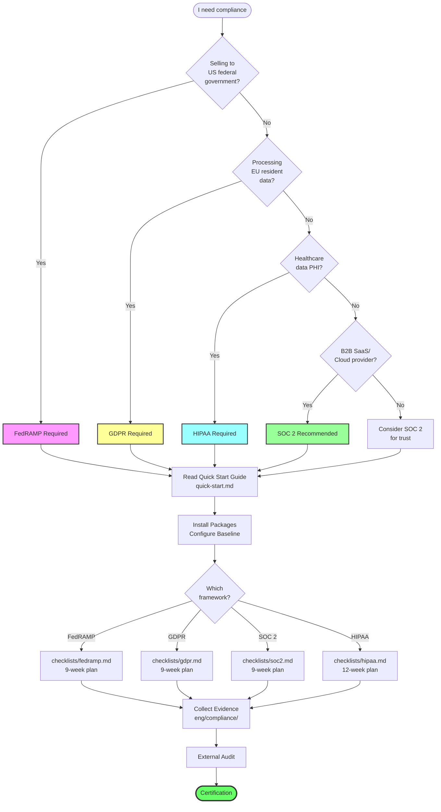
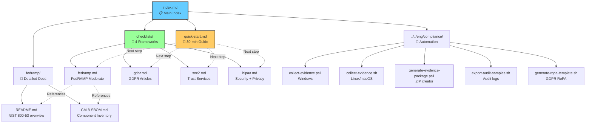
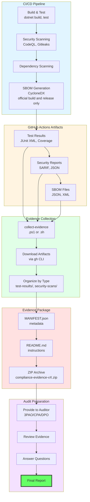

# Compliance Documentation Navigation Guide

:::warning Not legal advice

This page describes technical features that can **support** your compliance work. It is not legal
advice, and it does not establish that any system is compliant with any law, regulation or standard.
You remain responsible for your own compliance assessment, independent testing and validation, and
review by qualified legal and compliance professionals. See the [Compliance Disclaimer](../legal/compliance-disclaimer.md).
:::

**Framework:** Excalibur
**Purpose:** Visual navigation for compliance documentation
**Last Updated:** 2026-09-12

---

## Overview

This guide provides visual diagrams to help you navigate the compliance documentation and understand the implementation workflow.

**Diagrams:**
1. [User Journey - Choosing Your Path](#1-user-journey---choosing-your-path)
2. [Documentation Structure](#2-documentation-structure)
3. [Implementation Workflow](#3-implementation-workflow)
4. [Evidence Collection Pipeline](#4-evidence-collection-pipeline)
5. [Certification Timeline](#5-certification-timeline)

---

## 1. User Journey - Choosing Your Path

```mermaid
flowchart TD
    Start([I need compliance]) --> Question1{Selling to<br/>US federal<br/>government?}

    Question1 -->|Yes| FedRAMP[FedRAMP Required]
    Question1 -->|No| Question2{Processing<br/>EU resident<br/>data?}

    Question2 -->|Yes| GDPR[GDPR Required]
    Question2 -->|No| Question3{Healthcare<br/>data PHI?}

    Question3 -->|Yes| HIPAA[HIPAA Required]
    Question3 -->|No| Question4{B2B SaaS/<br/>Cloud provider?}

    Question4 -->|Yes| SOC2[SOC 2 Recommended]
    Question4 -->|No| Optional[Consider SOC 2<br/>for trust]

    FedRAMP --> QuickStart
    GDPR --> QuickStart
    HIPAA --> QuickStart
    SOC2 --> QuickStart
    Optional --> QuickStart

    QuickStart[Read Quick Start Guide<br/>quick-start.md] --> Install[Install Packages<br/>Configure Baseline]

    Install --> ChooseChecklist{Which<br/>framework?}

    ChooseChecklist -->|FedRAMP| FedRAMPChecklist[checklists/fedramp.md<br/>9-week plan]
    ChooseChecklist -->|GDPR| GDPRChecklist[checklists/gdpr.md<br/>9-week plan]
    ChooseChecklist -->|SOC 2| SOC2Checklist[checklists/soc2.md<br/>9-week plan]
    ChooseChecklist -->|HIPAA| HIPAAChecklist[checklists/hipaa.md<br/>12-week plan]

    FedRAMPChecklist --> Evidence
    GDPRChecklist --> Evidence
    SOC2Checklist --> Evidence
    HIPAAChecklist --> Evidence

    Evidence[Collect Evidence<br/>eng/compliance/] --> Audit[External Audit]
    Audit --> Cert([Certification])

    style FedRAMP fill:#f9f,stroke:#333,stroke-width:2px
    style GDPR fill:#ff9,stroke:#333,stroke-width:2px
    style HIPAA fill:#9ff,stroke:#333,stroke-width:2px
    style SOC2 fill:#9f9,stroke:#333,stroke-width:2px
    style Cert fill:#6f6,stroke:#333,stroke-width:3px
```

---

## 2. Documentation Structure

```mermaid
graph TD
    README[index.md<br/>📋 Main Index] --> QuickStart[quick-start.md<br/>🚀 30-min Guide]
    README --> Checklists[checklists/<br/>📝 4 Frameworks]
    README --> Scripts[../../eng/compliance/<br/>🔧 Automation]
    README --> FedRAMPDocs[fedramp/<br/>📄 Detailed Docs]

    Checklists --> FedRAMP[fedramp.md<br/>FedRAMP Moderate]
    Checklists --> GDPR[gdpr.md<br/>GDPR Articles]
    Checklists --> SOC2[soc2.md<br/>Trust Services]
    Checklists --> HIPAA[hipaa.md<br/>Security + Privacy]

    Scripts --> CollectPS[collect-evidence.ps1<br/>Windows]
    Scripts --> CollectSH[collect-evidence.sh<br/>Linux/macOS]
    Scripts --> Package[generate-evidence-package.ps1<br/>ZIP creator]
    Scripts --> Audit[export-audit-samples.sh<br/>Audit logs]
    Scripts --> RoPA[generate-ropa-template.sh<br/>GDPR RoPA]

    FedRAMPDocs --> FedREADME[README.md<br/>NIST 800-53 overview]
    FedRAMPDocs --> SBOM[CM-8-SBOM.md<br/>Component Inventory]

    FedRAMP -.->|References| FedREADME
    FedRAMP -.->|References| SBOM

    QuickStart -.->|Next step| FedRAMP
    QuickStart -.->|Next step| GDPR
    QuickStart -.->|Next step| SOC2
    QuickStart -.->|Next step| HIPAA

    style README fill:#6cf,stroke:#333,stroke-width:3px
    style QuickStart fill:#fc6,stroke:#333,stroke-width:2px
    style Checklists fill:#9f9,stroke:#333,stroke-width:2px
```

---

## 3. Implementation Workflow

```mermaid
flowchart LR
    subgraph Phase1[Phase 1: Setup]
        Install[Install Packages<br/>dotnet add package] --> Configure[Configure Services<br/>Program.cs]
        Configure --> Annotate[Annotate Models<br/>PersonalData]
    end

    subgraph Phase2[Phase 2: Core Capabilities]
        Annotate --> AccessControl[Access Control<br/>RequirePermission]
        AccessControl --> Encryption[Encryption<br/>IEncryptionProvider]
        Encryption --> Audit[Audit Logging<br/>IAuditLogger]
    end

    subgraph Phase3[Phase 3: Framework-Specific]
        Audit --> Decision{Which<br/>framework?}
        Decision -->|FedRAMP| FedRAMPImpl[SBOM Generation<br/>Security Scanning]
        Decision -->|GDPR| GDPRImpl[Erasure Service<br/>Legal Holds<br/>Data Inventory]
        Decision -->|SOC 2| SOC2Impl[Automated Validators<br/>Continuous Monitoring]
        Decision -->|HIPAA| HIPAAImpl[PHI Protection<br/>BAAs]
    end

    subgraph Phase4[Phase 4: Verification]
        FedRAMPImpl --> Tests
        GDPRImpl --> Tests
        SOC2Impl --> Tests
        HIPAAImpl --> Tests
        Tests[Wrap and Run Conformance Arms] --> ManualTest[Manual Verification<br/>Database inspection]
    end

    subgraph Phase5[Phase 5: Certification]
        ManualTest --> CollectEv[Collect Evidence<br/>CI/CD artifacts]
        CollectEv --> Policies[Develop Policies<br/>Training]
        Policies --> Engage[Engage Auditor<br/>3PAO/CPA]
        Engage --> Remediate[Remediate Findings]
        Remediate --> Certify([Obtain Certification])
    end

    style Phase1 fill:#e1f5ff
    style Phase2 fill:#fff4e1
    style Phase3 fill:#e1ffe7
    style Phase4 fill:#ffe1e1
    style Phase5 fill:#f4e1ff
    style Certify fill:#6f6,stroke:#333,stroke-width:3px
```

---

## 4. Evidence Collection Pipeline

```mermaid
flowchart TD
    subgraph CI[CI/CD Pipeline<br/>.github/workflows/]
        Build[Build & Test<br/>dotnet build, test] --> SAST[Security Scanning<br/>CodeQL, Gitleaks]
        SAST --> Deps[Dependency Scanning]
        Deps --> SBOM[SBOM Generation<br/>CycloneDX<br/>official build and release only]
    end

    subgraph Artifacts[GitHub Actions Artifacts<br/>90-day retention]
        SBOM --> ArtTest[Test Results<br/>JUnit XML, Coverage]
        ArtTest --> ArtSec[Security Reports<br/>SARIF, JSON]
        ArtSec --> ArtSBOM[SBOM Files<br/>JSON, XML]
    end

    subgraph Collection[Evidence Collection<br/>eng/compliance/]
        ArtTest --> Script1
        ArtSec --> Script1
        ArtSBOM --> Script1
        Script1[collect-evidence<br/>.ps1 or .sh] --> Download[Download Artifacts<br/>via gh CLI]
        Download --> Organize[Organize by Type<br/>test-results/, security-scans/]
    end

    subgraph Output[Evidence Package]
        Organize --> Manifest[MANIFEST.json<br/>metadata]
        Manifest --> README2[README.md<br/>instructions]
        README2 --> Package[ZIP Archive<br/>compliance-evidence-vX.zip]
    end

    subgraph Audit[Audit Preparation]
        Package --> Auditor[Provide to Auditor<br/>3PAO/CPA/DPO]
        Auditor --> Review[Review Evidence]
        Review --> Questions[Answer Questions]
        Questions --> Final[Final Report]
    end

    style CI fill:#e1f5ff
    style Artifacts fill:#fff4e1
    style Collection fill:#e1ffe7
    style Output fill:#ffe1e1
    style Audit fill:#f4e1ff
    style Final fill:#6f6,stroke:#333,stroke-width:3px
```

---

## 5. Certification Timeline

### FedRAMP Timeline

**FedRAMP Moderate Certification** — all offsets are relative to the day you start; no calendar dates are implied.

| Phase | Activity | Starts (day) | Duration |
|---|---|---|---|
| Preparation | Risk Assessment | 0 | 60 days |
|  | SSP Development | 59 | 60 days |
| Implementation | Install Framework | 120 | 14 days |
|  | Configure Controls | 134 | 63 days |
|  | Evidence Collection | 181 | 30 days |
| Assessment | 3PAO Engagement | 212 | 90 days |
|  | Remediation | 304 | 30 days |
| Authorization | PMO Review | 334 | 90 days |
|  | ATO Issuance | 424 | milestone |

Total elapsed: **425 days** (~14 months) from start to the final milestone, summed from the table above rather than quoted.

### GDPR Timeline

**GDPR Compliance** — all offsets are relative to the day you start; no calendar dates are implied.

| Phase | Activity | Starts (day) | Duration |
|---|---|---|---|
| Preparation | Scope Assessment | 0 | 30 days |
|  | Risk Assessment | 31 | 30 days |
| Implementation | Install Framework | 59 | 14 days |
|  | Configure Erasure | 73 | 21 days |
|  | Configure RoPA | 94 | 14 days |
|  | Policy Development | 108 | 30 days |
| Verification | Conformance Testing | 138 | 14 days |
|  | Training | 152 | 30 days |
| Audit | External Audit (Optional) | 182 | 30 days |
|  | Certification | 212 | milestone |

Total elapsed: **213 days** (~7 months) from start to the final milestone, summed from the table above rather than quoted.

### SOC 2 Type I Timeline

**SOC 2 Type I Certification** — all offsets are relative to the day you start; no calendar dates are implied.

| Phase | Activity | Starts (day) | Duration |
|---|---|---|---|
| Preparation | Scope Definition | 0 | 30 days |
| Implementation | Install Framework | 31 | 14 days |
|  | Configure Controls | 45 | 60 days |
|  | Automated Validators | 105 | 14 days |
|  | Readiness Assessment | 119 | 30 days |
| Audit | CPA Engagement | 149 | 60 days |
|  | Type I Report | 209 | milestone |

Total elapsed: **210 days** (~7 months) from start to the final milestone, summed from the table above rather than quoted.

### SOC 2 Type II Timeline

**SOC 2 Type II Certification** — all offsets are relative to the day you start; no calendar dates are implied.

| Phase | Activity | Starts (day) | Duration |
|---|---|---|---|
| Type I | Type I Certification | 0 | 180 days |
| Observation Period | 6-Month Operation | 181 | 180 days |
|  | 12-Month Operation | 181 | 365 days |
| Type II Audit | CPA Engagement | 361 | 60 days |
|  | Type II Report | 421 | milestone |

Total elapsed: **546 days** (~18 months) from start to the final milestone, summed from the table above rather than quoted.

### HIPAA Timeline

**HIPAA Compliance** — all offsets are relative to the day you start; no calendar dates are implied.

| Phase | Activity | Starts (day) | Duration |
|---|---|---|---|
| Preparation | Engage Specialist | 0 | 14 days |
|  | Risk Assessment | 14 | 60 days |
| Policy Development | Security Policies | 74 | 60 days |
|  | Privacy Policies | 74 | 60 days |
| Implementation | Install Framework | 134 | 14 days |
|  | Configure Tech Safeguards | 148 | 60 days |
|  | Workforce Training | 208 | 60 days |
| Verification | Internal Audit | 268 | 60 days |
|  | External Audit | 328 | 60 days |
|  | Certification | 388 | milestone |

Total elapsed: **389 days** (~13 months) from start to the final milestone, summed from the table above rather than quoted.

---

## Quick Reference Table

| **Step** | **FedRAMP** | **GDPR** | **SOC 2 Type I** | **SOC 2 Type II** | **HIPAA** |
|----------|-------------|----------|------------------|-------------------|-----------|
| **1. Preparation** | Risk assessment, scope | DPIA, scope | Scope definition | Type I complete | Engage specialist |
| **2. Install** | 2 weeks | 2 weeks | 2 weeks | N/A | 2 weeks |
| **3. Implement** | 9 weeks (14 controls) | 7 weeks (Articles 17, 17(3), 25, 30, 32) | 6 weeks of control phases (CC1-CC9, A1-A3, PI1-PI3, C1-C3) | N/A | 7 weeks (§164.308, §164.310, §164.312) |
| **4. Policies** | SSP, SAR | Privacy policy, RoPA | System description | N/A | Security + Privacy policies |
| **5. Tests** | Opt-in conformance arms | Opt-in conformance arms | Automated validators | N/A | Opt-in conformance arms |
| **6. Evidence** | SBOM, scans, audit logs | Erasure certs, RoPA | Reports, logs | Continuous | Audit logs, BAAs |
| **7. Audit** | 3PAO (3 months) | External DPO (1 month) | CPA (2 months) | CPA (2 months) | External (2 months) |
| **8. Timeline** | **6-12 months** | **3-6 months** | **3-6 months** | **12-18 months** | **6-12 months** |

---

## Navigation Shortcuts

### By Role

**Developers:**
1. Start: [Quick Start Guide](quick-start.md)
2. Reference: [Framework Capabilities](index.md#framework-features)
3. Code Examples: Individual checklists (fedramp.md, gdpr.md, soc2.md, hipaa.md)

**Compliance Officers:**
1. Start: [Compliance Checklists](index.md#certification-checklists)
2. Evidence: [Evidence Automation](index.md#evidence-automation)
3. Timeline: [Certification Roadmap](#5-certification-timeline)

**Auditors:**
1. Evidence: [Evidence Automation](index.md#evidence-automation) — `eng/compliance/collect-evidence.*` in the [framework repository](https://github.com/TrigintaFaces/Excalibur)
2. Conformance: the arms you wrapped and ran (Audit, Erasure, LegalHold, DataInventory)
3. Reports: Type I/II generation (SOC 2), SBOM artifacts (FedRAMP)

**Management:**
1. Overview: [index.md](index.md)
2. Timeline: [Certification Roadmap](index.md#certification-roadmap)
3. Costs: External audit fees + training + policies

### By Task

**"I need to get started"**
→ [Quick Start Guide](quick-start.md)

**"I need FedRAMP certification"**
→ [checklists/fedramp.md](checklists/fedramp.md)

**"I need GDPR compliance"**
→ [checklists/gdpr.md](checklists/gdpr.md)

**"I need SOC 2 certification"**
→ [checklists/soc2.md](checklists/soc2.md)

**"I need HIPAA compliance"**
→ [checklists/hipaa.md](checklists/hipaa.md)

**"I need to collect evidence"**
→ [Evidence Automation](index.md#evidence-automation)
→ `eng/compliance/collect-evidence.*` in the [framework repository](https://github.com/TrigintaFaces/Excalibur)

**"I need to understand what the framework provides"**
→ [Framework Capabilities](index.md#framework-features)

**"I need help choosing"**
→ [User Journey Diagram](#1-user-journey---choosing-your-path)

**"I need to know the timeline"**
→ [Certification Timeline](#5-certification-timeline)

---

## Related Documentation

**Within Compliance:**
- [index.md](index.md) - Main compliance index
- [quick-start.md](quick-start.md) - 30-minute getting started
- [checklists/](checklists/) - 4 detailed certification checklists
- [fedramp/](fedramp/) - FedRAMP-specific documentation

**Framework Documentation:**
- `../security/` - Security implementation guides
- `../advanced/` - Advanced topics (deployment, testing, performance)
- `../../eng/compliance/` - Evidence automation scripts

**External Standards:**
- [FedRAMP Program](https://www.fedramp.gov/)
- [NIST SP 800-53 Rev 5](https://csrc.nist.gov/publications/detail/sp/800-53/rev-5/final)
- [GDPR Official Text](https://eur-lex.europa.eu/eli/reg/2016/679/oj)
- [AICPA Trust Services Criteria](https://www.aicpa.org/resources/download/trust-services-criteria)
- [HHS HIPAA](https://www.hhs.gov/hipaa/index.html)

---

**Last Updated:** 2026-09-12
**Framework:** Excalibur 10.0.0 prerelease

## See Also

- [Compliance Overview](./index.md) — Main compliance documentation index with framework capabilities and evidence automation
- [Quick Start Guide](./quick-start.md) — Get baseline compliance capabilities running in 30 minutes
- [Audit Logging](./audit-logging.md) — Configure and use audit logging for compliance evidence collection
