# Compliance Documentation Navigation Guide

**Framework:** Excalibur.Dispatch
**Purpose:** Visual navigation for compliance documentation
**Last Updated:** 2026-01-01

---

## Overview

This guide provides visual diagrams to help you navigate the compliance documentation and understand the implementation workflow.

**Diagrams:**
1. [User Journey - Choosing Your Path](#1-user-journey---choosing-your-path)
2. [Documentation Structure](#2-documentation-structure)
3. [Implementation Workflow](#3-implementation-workflow)
4. [Evidence Collection Pipeline](#4-evidence-collection-pipeline)
5. [Certification Timeline](#5-certification-timeline)

---

## 1. User Journey - Choosing Your Path

---

## 2. Documentation Structure

```mermaid
graph TD
    README[index.md<br/>📋 Main Index] --> QuickStart[quick-start.md<br/>🚀 30-min Guide]
    README --> Checklists[checklists/<br/>📝 4 Frameworks]
    README --> Scripts[../../eng/compliance/<br/>🔧 Automation]
    README --> FedRAMPDocs[fedramp/<br/>📄 Detailed Docs]

    Checklists --> FedRAMP[fedramp.md<br/>FedRAMP Moderate]
    Checklists --> GDPR[gdpr.md<br/>GDPR Articles]
    Checklists --> SOC2[soc2.md<br/>Trust Services]
    Checklists --> HIPAA[hipaa.md<br/>Security + Privacy]

    Scripts --> CollectPS[collect-evidence.ps1<br/>Windows]
    Scripts --> CollectSH[collect-evidence.sh<br/>Linux/macOS]
    Scripts --> Package[generate-evidence-package.ps1<br/>ZIP creator]
    Scripts --> Audit[export-audit-samples.sh<br/>Audit logs]
    Scripts --> RoPA[generate-ropa-template.sh<br/>GDPR RoPA]

    FedRAMPDocs --> FedREADME[index.md<br/>14/14 Controls]
    FedRAMPDocs --> SBOM[CM-8-SBOM.md<br/>Component Inventory]

    FedRAMP -.->|References| FedREADME
    FedRAMP -.->|References| SBOM

    QuickStart -.->|Next step| FedRAMP
    QuickStart -.->|Next step| GDPR
    QuickStart -.->|Next step| SOC2
    QuickStart -.->|Next step| HIPAA

    style README fill:#6cf,stroke:#333,stroke-width:3px
    style QuickStart fill:#fc6,stroke:#333,stroke-width:2px
    style Checklists fill:#9f9,stroke:#333,stroke-width:2px
```

---

## 3. Implementation Workflow

---

## 4. Evidence Collection Pipeline

---

## 5. Certification Timeline

### FedRAMP Timeline (6-12 months)

### GDPR Timeline (3-6 months)

### SOC 2 Type I Timeline (3-6 months)

### SOC 2 Type II Timeline (12-18 months)

### HIPAA Timeline (6-12 months)

---

## Quick Reference Table

| **Step** | **FedRAMP** | **GDPR** | **SOC 2 Type I** | **SOC 2 Type II** | **HIPAA** |
|----------|-------------|----------|------------------|-------------------|-----------|
| **1. Preparation** | Risk assessment, scope | DPIA, scope | Scope definition | Type I complete | Engage specialist |
| **2. Install** | 2 weeks | 2 weeks | 2 weeks | N/A | 2 weeks |
| **3. Implement** | 9 weeks (14 controls) | 7 weeks (Articles 17, 30, 32) | 8 weeks (Security + optional) | N/A | 12 weeks (§164.312) |
| **4. Policies** | SSP, SAR | Privacy policy, RoPA | System description | N/A | Security + Privacy policies |
| **5. Tests** | 80 conformance tests | 80 conformance tests | Automated validators | N/A | 80 conformance tests |
| **6. Evidence** | SBOM, scans, audit logs | Erasure certs, RoPA | Reports, logs | Continuous | Audit logs, BAAs |
| **7. Audit** | 3PAO (3 months) | External DPO (1 month) | CPA (2 months) | CPA (2 months) | External (2 months) |
| **8. Timeline** | **6-12 months** | **3-6 months** | **3-6 months** | **12-18 months** | **6-12 months** |

---

## Navigation Shortcuts

### By Role

**Developers:**
1. Start: [Quick Start Guide](quick-start.md)
2. Reference: [Framework Capabilities](index.md#framework-capabilities)
3. Code Examples: Individual checklists (fedramp.md, gdpr.md, soc2.md, hipaa.md)

**Compliance Officers:**
1. Start: [Compliance Checklists](index.md#compliance-checklists)
2. Evidence: [Evidence Automation](index.md#evidence-automation)
3. Timeline: [Certification Roadmap](#5-certification-timeline)

**Auditors:**
1. Evidence: `eng/compliance/collect-evidence.*`
2. Conformance: 80 tests (Audit, Erasure, LegalHold, DataInventory)
3. Reports: Type I/II generation (SOC 2), SBOM artifacts (FedRAMP)

**Management:**
1. Overview: [index.md](index.md)
2. Timeline: [Certification Roadmap](index.md#certification-roadmap)
3. Costs: External audit fees + training + policies

### By Task

**"I need to get started"**
→ [Quick Start Guide](quick-start.md)

**"I need FedRAMP certification"**
→ [checklists/fedramp.md](checklists/fedramp.md)

**"I need GDPR compliance"**
→ [checklists/gdpr.md](checklists/gdpr.md)

**"I need SOC 2 certification"**
→ [checklists/soc2.md](checklists/soc2.md)

**"I need HIPAA compliance"**
→ [checklists/hipaa.md](checklists/hipaa.md)

**"I need to collect evidence"**
→ [Evidence Automation](index.md#evidence-automation)
→ `eng/compliance/collect-evidence.*`

**"I need to understand what the framework provides"**
→ [Framework Capabilities](index.md#framework-capabilities)

**"I need help choosing"**
→ [User Journey Diagram](#1-user-journey---choosing-your-path)

**"I need to know the timeline"**
→ [Certification Timeline](#5-certification-timeline)

---

## Related Documentation

**Within Compliance:**
- [index.md](index.md) - Main compliance index
- [quick-start.md](quick-start.md) - 30-minute getting started
- [checklists/](checklists/) - 4 detailed certification checklists
- [fedramp/](fedramp/) - FedRAMP-specific documentation

**Framework Documentation:**
- `../security/` - Security implementation guides
- `../advanced/` - Advanced topics (deployment, testing, performance)
- `../../eng/compliance/` - Evidence automation scripts

**External Standards:**
- [FedRAMP Program](https://www.fedramp.gov/)
- [NIST SP 800-53 Rev 5](https://csrc.nist.gov/publications/detail/sp/800-53/rev-5/final)
- [GDPR Official Text](https://eur-lex.europa.eu/eli/reg/2016/679/oj)
- [AICPA Trust Services Criteria](https://www.aicpa.org/resources/download/trust-services-criteria)
- [HHS HIPAA](https://www.hhs.gov/hipaa/index.html)

---

**Last Updated:** 2026-01-01
**Next Review:** 2026-04-01
**Framework:** Excalibur 1.0.0

## See Also

- [Compliance Overview](./index.md) — Main compliance documentation index with framework capabilities and evidence automation
- [Quick Start Guide](./quick-start.md) — Get baseline compliance capabilities running in 30 minutes
- [Audit Logging](./audit-logging.md) — Configure and use audit logging for compliance evidence collection
