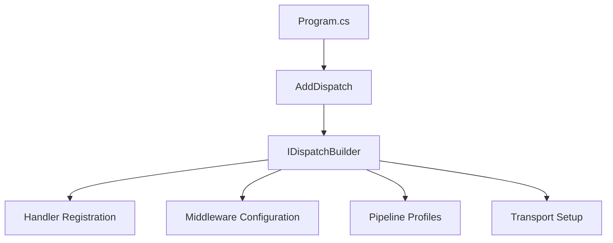

---
sidebar_position: 7
title: Configuration
description: Configure Dispatch with options, builders, and environment-specific settings
---

# Configuration

Dispatch uses the standard .NET configuration patterns with fluent builders for service registration.

## Before You Start

- **.NET 8.0+** (or .NET 9/10 for latest features)
- Install the required packages:
  ```bash
  dotnet add package Excalibur.Dispatch
  dotnet add package Excalibur.Dispatch.Abstractions
  ```
- Familiarity with [.NET configuration](https://learn.microsoft.com/en-us/dotnet/core/extensions/configuration) and [dependency injection](./dependency-injection.md)

## Basic Configuration

### Service Registration

Register Dispatch in your `Program.cs`:

```csharp
var builder = WebApplication.CreateBuilder(args);

// Auto-discover handlers from an assembly (recommended)
builder.Services.AddDispatch(dispatch =>
{
    dispatch.AddHandlersFromAssembly(typeof(Program).Assembly);
});

var app = builder.Build();
```

### Configuration Flow



## Using the Dispatch Builder

The main configuration method uses a fluent builder for comprehensive setup:

```csharp
// Register handlers from assembly with configuration
builder.Services.AddDispatch(dispatch =>
{
    // Handler registration
    dispatch.AddHandlersFromAssembly(typeof(Program).Assembly);

    // Global middleware
    dispatch.UseMiddleware<LoggingMiddleware>();
    dispatch.UseMiddleware<ValidationMiddleware>();

    // Options configuration
    dispatch.ConfigureOptions<DispatchOptions>(options =>
    {
        options.DefaultTimeout = TimeSpan.FromSeconds(30);
    });
});

// Serialization is registered separately via DI
builder.Services.AddMemoryPackInternalSerialization();
// Or: builder.Services.AddMessagePackSerialization();
// Or: builder.Services.AddJsonSerialization();
```

### Handler Registration

```csharp
// Single assembly (recommended)
builder.Services.AddDispatch(dispatch =>
{
    dispatch.AddHandlersFromAssembly(typeof(Program).Assembly);
});

// Multiple assemblies
builder.Services.AddDispatch(dispatch =>
{
    dispatch.AddHandlersFromAssembly(typeof(OrderHandler).Assembly);
    dispatch.AddHandlersFromAssembly(typeof(PaymentHandler).Assembly);
});
```

### Middleware Configuration

```csharp
builder.Services.AddDispatch(dispatch =>
{
    dispatch.AddHandlersFromAssembly(typeof(Program).Assembly);

    // Add global middleware (applies to all pipelines)
    dispatch.UseMiddleware<LoggingMiddleware>();
    dispatch.UseMiddleware<ValidationMiddleware>();
    dispatch.UseMiddleware<AuthorizationMiddleware>();

    // Or configure a named pipeline with specific middleware
    dispatch.ConfigurePipeline("Events", pipeline =>
    {
        pipeline.ForMessageKinds(MessageKinds.All);
    });
});
```

:::info Automatic Default Pipeline
When you use `UseMiddleware<T>()` without explicitly calling `ConfigurePipeline()`, Dispatch automatically creates a **"Default" pipeline** containing your global middleware. This means you don't need to configure pipelines for simple scenarios—your middleware is applied to all messages automatically.
:::

### Options Configuration

```csharp
builder.Services.AddDispatch(dispatch =>
{
    dispatch.AddHandlersFromAssembly(typeof(Program).Assembly);

    // Configure dispatch options
    dispatch.ConfigureOptions<DispatchOptions>(options =>
    {
        options.DefaultTimeout = TimeSpan.FromSeconds(30);
    });
});
```

### Ultra-Local Performance Options

Configure direct-local/ultra-local behavior on `DispatchOptions.CrossCutting.Performance`:

```csharp
builder.Services.AddDispatch(dispatch =>
{
    dispatch.AddHandlersFromAssembly(typeof(Program).Assembly);
    dispatch.ConfigureOptions<DispatchOptions>(options =>
    {
        options.CrossCutting.Performance.DirectLocalContextInitialization =
            DirectLocalContextInitializationProfile.Lean; // default

        options.CrossCutting.Performance.EmitDirectLocalResultMetadata = false; // default
    });
});
```

Use `DirectLocalContextInitializationProfile.Full` when you need eager full-context initialization on direct-local paths.

See [Ultra-Local Dispatch](../performance/ultra-local-dispatch.md) for dispatch semantics and fallback behavior.

Profile detail:

| Profile | Direct-local initialization behavior |
|---|---|
| `Lean` (default) | Sets `Message`, correlation/causation (when needed), and skips eager `MessageType` population |
| `Full` | Same as `Lean`, plus eager `MessageType` initialization when missing |

## Cross-Cutting Concerns

Configure observability, resilience, caching, and security through the builder:

```csharp
builder.Services.AddDispatch(dispatch =>
{
    dispatch.AddHandlersFromAssembly(typeof(Program).Assembly);

    // Observability (tracing, metrics, context flow)
    dispatch.AddObservability();

    // Resilience (retry, circuit breaker, timeout)
    dispatch.AddResilience(res => res.DefaultRetryCount = 3);

    // Caching
    dispatch.AddCaching();

    // Security (requires IConfiguration for reflection-based scanning)
    dispatch.AddSecurity(builder.Configuration);
});
```

:::tip Short names on the builder
When called on `IDispatchBuilder`, the `Dispatch` prefix is dropped since it's redundant.
For example, `services.AddDispatchObservability()` becomes `dispatch.AddObservability()`.
:::

## Configuration from appsettings.json

Bind configuration from your settings file. `DispatchOptions` supports nested options for cross-cutting concerns:

```json title="appsettings.json"
{
  "Dispatch": {
    "DefaultTimeout": "00:00:30",
    "EnableMetrics": true,
    "Security": {
      "EnableEncryption": false,
      "EnableValidation": true
    },
    "Observability": {
      "Enabled": true,
      "EnableTracing": true,
      "EnableMetrics": true
    },
    "Resilience": {
      "DefaultRetryCount": 3,
      "EnableCircuitBreaker": false
    },
    "Caching": {
      "Enabled": false,
      "DefaultExpiration": "00:05:00"
    }
  }
}
```

```csharp
// Program.cs
builder.Services.AddDispatch(dispatch =>
{
    dispatch.AddHandlersFromAssembly(typeof(Program).Assembly);
});

// Bind all Dispatch options from appsettings (including nested options)
builder.Services.Configure<DispatchOptions>(
    builder.Configuration.GetSection("Dispatch"));
```

## Transport Configuration

Configure transports through the `AddDispatch()` builder using `Use{Transport}()` methods:

### Single Transport

```csharp
builder.Services.AddDispatch(dispatch =>
{
    dispatch.AddHandlersFromAssembly(typeof(Program).Assembly);

    // Configure transport through the builder (recommended)
    dispatch.UseRabbitMQ(rmq => rmq.HostName("localhost"));
});
```

All five transports follow the same pattern:

```csharp
builder.Services.AddDispatch(dispatch =>
{
    dispatch.UseKafka(kafka => kafka.BootstrapServers("localhost:9092"));
    dispatch.UseAzureServiceBus(asb => asb.ConnectionString("..."));
    dispatch.UseAwsSqs(sqs => sqs.Region("us-east-1"));
    dispatch.UseGooglePubSub(pubsub => pubsub.ProjectId("my-project"));
    dispatch.UseRabbitMQ(rmq => rmq.HostName("localhost"));
});
```

:::tip Standalone methods still work
You can also register transports directly on `IServiceCollection` if preferred:
```csharp
builder.Services.AddKafkaTransport(options => { /* ... */ });
```
The builder `Use{Transport}()` methods are thin wrappers that delegate to these standalone methods.
:::

See [Transports](../transports/index.md) for transport-specific setup guides.

### Named Transports

Register multiple instances of the same transport with different names:

```csharp
builder.Services.AddDispatch(dispatch =>
{
    dispatch.UseKafka(kafka => kafka.BootstrapServers("localhost:9092"));
    dispatch.UseKafka("analytics", kafka => kafka.BootstrapServers("analytics:9092"));
});
```

### Multi-Transport Routing

```csharp
builder.Services.AddDispatch(dispatch =>
{
    dispatch.AddHandlersFromAssembly(typeof(Program).Assembly);

    // Transports
    dispatch.UseKafka(kafka => kafka.BootstrapServers("localhost:9092"));
    dispatch.UseRabbitMQ(rmq => rmq.HostName("localhost"));

    // Configure routing
    dispatch.UseRouting(routing =>
    {
        routing.Transport
            .Route<OrderCreatedEvent>().To("kafka")
            .Route<PaymentProcessedEvent>().To("rabbitmq")
            .Default("rabbitmq");
    });
});
```

## Environment-Specific Configuration

### Development vs Production

```csharp
var builder = WebApplication.CreateBuilder(args);

builder.Services.AddDispatch(dispatch =>
{
    dispatch.AddHandlersFromAssembly(typeof(Program).Assembly);

    if (builder.Environment.IsDevelopment())
    {
        // Development: add debug middleware
        dispatch.UseMiddleware<DebugMiddleware>();
    }
});

// Environment-specific transport
if (builder.Environment.IsDevelopment())
{
    // Use in-memory transport for local development
    builder.Services.AddMessageBus();
}
else
{
    builder.Services.AddKafkaTransport(options =>
    {
        options.BootstrapServers = builder.Configuration["Kafka:Servers"];
    });
}
```

### Using IConfiguration

```csharp
builder.Services.AddDispatch(dispatch =>
{
    dispatch.AddHandlersFromAssembly(typeof(Program).Assembly);
});

// Bind from configuration
builder.Services.AddOptions<DispatchOptions>()
    .Bind(builder.Configuration.GetSection("Dispatch"))
    .ValidateDataAnnotations()
    .ValidateOnStart();
```

## Health Checks

Add health checks for Dispatch components:

```csharp
builder.Services.AddHealthChecks()
    .AddTransportHealthChecks();

var app = builder.Build();
app.MapHealthChecks("/health");
```

## Observability Configuration

### OpenTelemetry Integration

```csharp
builder.Services.AddOpenTelemetry()
    .WithTracing(tracing =>
    {
        tracing.AddSource("Excalibur.Dispatch.Observability");
        tracing.AddOtlpExporter();
    })
    .WithMetrics(metrics =>
    {
        metrics.AddDispatchMetrics();
        metrics.AddOtlpExporter();
    });
```

### Logging Configuration

```csharp
builder.Logging.AddConfiguration(builder.Configuration.GetSection("Logging"));

// In appsettings.json
{
  "Logging": {
    "LogLevel": {
      "Default": "Information",
      "Excalibur.Dispatch": "Debug",
      "Excalibur.Dispatch.Pipeline": "Trace"
    }
  }
}
```

## Configuration Validation

Validate configuration at startup:

```csharp
builder.Services.AddOptions<DispatchOptions>()
    .Bind(builder.Configuration.GetSection("Dispatch"))
    .Validate(options =>
    {
        if (options.DefaultTimeout <= TimeSpan.Zero)
            return false;
        return true;
    }, "DefaultTimeout must be positive")
    .ValidateOnStart();
```

## Builder Pattern Reference

### IDispatchBuilder — Core Methods

| Method | Purpose | Example |
|--------|---------|---------|
| `ConfigurePipeline()` | Named pipeline setup | `dispatch.ConfigurePipeline("default", p => ...)` |
| `RegisterProfile()` | Pipeline profile | `dispatch.RegisterProfile(new MyProfile())` |
| `AddBinding()` | Transport binding | `dispatch.AddBinding(b => ...)` |
| `UseMiddleware<T>()` | Global middleware | `dispatch.UseMiddleware<LoggingMiddleware>()` |
| `ConfigureOptions<T>()` | Options configuration | `dispatch.ConfigureOptions<DispatchOptions>(o => ...)` |

### IDispatchBuilder — Transport Extensions (`Use` prefix)

| Method | Package | Example |
|--------|---------|---------|
| `UseRabbitMQ()` | `Excalibur.Dispatch.Transport.RabbitMQ` | `dispatch.UseRabbitMQ(rmq => ...)` |
| `UseKafka()` | `Excalibur.Dispatch.Transport.Kafka` | `dispatch.UseKafka(kafka => ...)` |
| `UseAwsSqs()` | `Excalibur.Dispatch.Transport.AwsSqs` | `dispatch.UseAwsSqs(sqs => ...)` |
| `UseAzureServiceBus()` | `Excalibur.Dispatch.Transport.AzureServiceBus` | `dispatch.UseAzureServiceBus(asb => ...)` |
| `UseGooglePubSub()` | `Excalibur.Dispatch.Transport.GooglePubSub` | `dispatch.UseGooglePubSub(pubsub => ...)` |

All transport methods support named overloads: `dispatch.UseKafka("analytics", kafka => ...)`.

### IDispatchBuilder — Cross-Cutting Extensions (`Add` prefix)

| Method | Package | Example |
|--------|---------|---------|
| `AddObservability()` | `Excalibur.Dispatch.Observability` | `dispatch.AddObservability(obs => ...)` |
| `AddResilience()` | `Excalibur.Dispatch.Resilience.Polly` | `dispatch.AddResilience(res => ...)` |
| `AddCaching()` | `Excalibur.Dispatch.Caching` | `dispatch.AddCaching()` |
| `AddSecurity()` | `Excalibur.Dispatch.Security` | `dispatch.AddSecurity(configuration)` |

### Standalone IServiceCollection Methods

These standalone methods remain available for consumers who prefer direct registration:

| Method | Purpose | Package |
|--------|---------|---------|
| `AddDispatch()` | Core Dispatch services | `Excalibur.Dispatch` |
| `AddRabbitMQTransport()` | RabbitMQ transport | `Excalibur.Dispatch.Transport.RabbitMQ` |
| `AddKafkaTransport()` | Kafka transport | `Excalibur.Dispatch.Transport.Kafka` |
| `AddAwsSqsTransport()` | AWS SQS transport | `Excalibur.Dispatch.Transport.AwsSqs` |
| `AddAzureServiceBusTransport()` | Azure Service Bus | `Excalibur.Dispatch.Transport.AzureServiceBus` |
| `AddGooglePubSubTransport()` | Google Pub/Sub | `Excalibur.Dispatch.Transport.GooglePubSub` |
| `AddDispatchObservability()` | Observability | `Excalibur.Dispatch.Observability` |
| `AddDispatchResilience()` | Resilience (Polly) | `Excalibur.Dispatch.Resilience.Polly` |
| `AddDispatchCaching()` | Caching | `Excalibur.Dispatch.Caching` |
| `AddDispatchSecurity()` | Security | `Excalibur.Dispatch.Security` |
| `AddMemoryPackInternalSerialization()` | MemoryPack serialization | `Excalibur.Dispatch.Serialization.MemoryPack` |
| `AddMessagePackSerialization()` | MessagePack serialization | `Excalibur.Dispatch.Serialization.MessagePack` |

## Common Configuration Patterns

### Minimal API

```csharp
var builder = WebApplication.CreateBuilder(args);
builder.Services.AddDispatch(dispatch =>
{
    dispatch.AddHandlersFromAssembly(typeof(Program).Assembly);
});
var app = builder.Build();

app.MapPost("/orders", async (CreateOrderAction action, IDispatcher dispatcher, CancellationToken ct) =>
    await dispatcher.DispatchAsync(action, ct));

app.Run();
```

### Full-Featured Setup

```csharp
var builder = WebApplication.CreateBuilder(args);

// Unified Dispatch registration — transports + cross-cutting through the builder
builder.Services.AddDispatch(dispatch =>
{
    dispatch.AddHandlersFromAssembly(typeof(Program).Assembly);

    // Transports (Use prefix)
    dispatch.UseKafka(kafka => kafka.BootstrapServers(builder.Configuration["Kafka:Servers"]));
    dispatch.UseRabbitMQ(rmq => rmq.HostName("localhost"));

    // Cross-cutting concerns (Add prefix)
    dispatch.AddObservability();
    dispatch.AddResilience(res => res.DefaultRetryCount = 3);
    dispatch.AddCaching();
    dispatch.AddSecurity(builder.Configuration);

    // Global middleware
    dispatch.UseMiddleware<LoggingMiddleware>();
    dispatch.UseMiddleware<ValidationMiddleware>();
    dispatch.UseMiddleware<AuthorizationMiddleware>();

    // Options
    dispatch.ConfigureOptions<DispatchOptions>(options =>
    {
        options.DefaultTimeout = TimeSpan.FromSeconds(30);
    });

    // Multi-transport routing
    dispatch.UseRouting(routing =>
    {
        routing.Transport
            .Route<OrderCreatedEvent>().To("kafka")
            .Default("rabbitmq");
    });
});

// Serialization
builder.Services.AddMemoryPackInternalSerialization();

// Health checks
builder.Services.AddHealthChecks()
    .AddTransportHealthChecks();

// OpenTelemetry
builder.Services.AddOpenTelemetry()
    .WithTracing(t => t.AddSource("Excalibur.Dispatch.Observability"))
    .WithMetrics(m => m.AddDispatchMetrics());

var app = builder.Build();
app.MapHealthChecks("/health");
app.Run();
```

### Combined with Excalibur

When using Excalibur subsystems alongside Dispatch, call `AddDispatch` for transport and pipeline configuration, then `AddExcalibur` for domain infrastructure. `AddExcalibur` registers Dispatch primitives with defaults, so both orderings are safe:

```csharp
// Dispatch — transports, middleware, pipelines
builder.Services.AddDispatch(dispatch =>
{
    dispatch.AddHandlersFromAssembly(typeof(Program).Assembly);
    dispatch.UseKafka(kafka => kafka.BootstrapServers("localhost:9092"));
    dispatch.AddObservability();
    dispatch.ConfigurePipeline("default", p => p.UseValidation());
});

// Excalibur — event sourcing, outbox, sagas
builder.Services.AddExcalibur(excalibur =>
{
    excalibur
        .AddEventSourcing(es => es.UseEventStore<SqlServerEventStore>())
        .AddOutbox(outbox => outbox.UseSqlServer(connectionString))
        .AddSagas();
});
```

## What's Next

- [Dependency Injection](dependency-injection.md) - DI patterns and lifetimes
- [Pipeline](../pipeline/index.md) - Middleware configuration details
- [Transports](../transports/index.md) - Transport-specific configuration

## See Also

- [Built-in Middleware](../middleware/built-in.md) — Pre-built middleware for logging, validation, authorization, and more
- [Getting Started](../getting-started/index.md) — Step-by-step guide to setting up your first Dispatch project
- [Pipeline Profiles](../pipeline/profiles.md) — Define reusable pipeline configurations for different message types
- [Actions and Handlers](./actions-and-handlers.md) — Define actions and register handlers that configuration wires together
