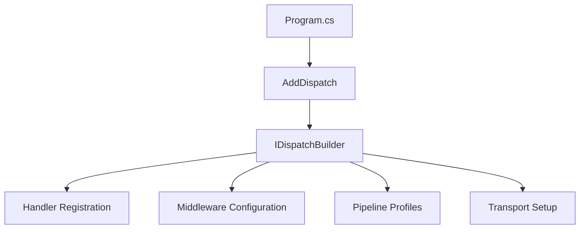

---
sidebar_position: 7
title: Configuration
description: Configure Dispatch with options, builders, and environment-specific settings
---

# Configuration

Dispatch uses the standard .NET configuration patterns with fluent builders for service registration.

## Before You Start

- **.NET 8.0+** (or .NET 9/10 for latest features)
- Install the required packages:
  ```bash
  dotnet add package Excalibur.Dispatch
  ```
- Familiarity with [.NET configuration](https://learn.microsoft.com/en-us/dotnet/core/extensions/configuration) and [dependency injection](./dependency-injection.md)

## Basic Configuration

### Service Registration

Register Dispatch in your `Program.cs`:

```csharp
var builder = WebApplication.CreateBuilder(args);

// Auto-discover handlers from an assembly (recommended)
builder.Services.AddDispatch(dispatch =>
{
    dispatch.AddHandlersFromAssembly(typeof(Program).Assembly);
});

var app = builder.Build();
```

### Configuration Flow


```mermaid
flowchart TD
    A[Program.cs] --> B[AddDispatch]
    B --> C[IDispatchBuilder]
    C --> D[Handler Registration]
    C --> E[Middleware Configuration]
    C --> F[Pipeline Profiles]
    C --> G[Transport Setup]
```

## Using the Dispatch Builder

The main configuration method uses a fluent builder for comprehensive setup:

```csharp
// Register handlers from assembly with configuration
builder.Services.AddDispatch(dispatch =>
{
    // Handler registration
    dispatch.AddHandlersFromAssembly(typeof(Program).Assembly);

    // Global middleware
    dispatch.UseMiddleware<LoggingMiddleware>();
    dispatch.UseMiddleware<ValidationMiddleware>();

    // Options configuration
    dispatch.ConfigureOptions<DispatchOptions>(options =>
    {
        options.DefaultTimeout = TimeSpan.FromSeconds(30);
    });
});

// Serialization is registered separately via DI
builder.Services.AddMemoryPackInternalSerialization();
// Or: builder.Services.AddMessagePackSerialization();
// Or: builder.Services.AddJsonSerialization();
```

### Handler Registration

```csharp
// Single assembly (recommended)
builder.Services.AddDispatch(dispatch =>
{
    dispatch.AddHandlersFromAssembly(typeof(Program).Assembly);
});

// Multiple assemblies
builder.Services.AddDispatch(dispatch =>
{
    dispatch.AddHandlersFromAssembly(typeof(OrderHandler).Assembly);
    dispatch.AddHandlersFromAssembly(typeof(PaymentHandler).Assembly);
});
```

### Middleware Configuration

```csharp
builder.Services.AddDispatch(dispatch =>
{
    dispatch.AddHandlersFromAssembly(typeof(Program).Assembly);

    // Add global middleware (applies to all pipelines)
    dispatch.UseMiddleware<LoggingMiddleware>();
    dispatch.UseMiddleware<ValidationMiddleware>();
    dispatch.UseMiddleware<AuthorizationMiddleware>();

    // Or configure a named pipeline with specific middleware
    dispatch.ConfigurePipeline("Events", pipeline =>
    {
        pipeline.ForMessageKinds(MessageKinds.All);
    });
});
```

:::info Automatic Default Pipeline
When you use `UseMiddleware<T>()` without explicitly calling `ConfigurePipeline()`, Dispatch automatically creates a **"Default" pipeline** containing your global middleware. This means you don't need to configure pipelines for simple scenarios—your middleware is applied to all messages automatically.
:::

### Options Configuration

```csharp
builder.Services.AddDispatch(dispatch =>
{
    dispatch.AddHandlersFromAssembly(typeof(Program).Assembly);

    // Configure dispatch options
    dispatch.ConfigureOptions<DispatchOptions>(options =>
    {
        options.DefaultTimeout = TimeSpan.FromSeconds(30);
    });
});
```

### Ultra-Local Performance Options

Configure direct-local/ultra-local behavior on `DispatchOptions.CrossCutting.Performance`:

```csharp
builder.Services.AddDispatch(dispatch =>
{
    dispatch.AddHandlersFromAssembly(typeof(Program).Assembly);
    dispatch.ConfigureOptions<DispatchOptions>(options =>
    {
        options.CrossCutting.Performance.DirectLocalContextInitialization =
            DirectLocalContextInitializationProfile.Lean; // default

        options.CrossCutting.Performance.EmitDirectLocalResultMetadata = false; // default
    });
});
```

Use `DirectLocalContextInitializationProfile.Full` when you need eager full-context initialization on direct-local paths.

See [Ultra-Local Dispatch](../performance/ultra-local-dispatch.md) for dispatch semantics and fallback behavior.

Profile detail:

| Profile | Direct-local initialization behavior |
|---|---|
| `Lean` (default) | Sets `Message`, correlation/causation (when needed), and skips eager `MessageType` population |
| `Full` | Same as `Lean`, plus eager `MessageType` initialization when missing |

## Cross-Cutting Concerns

Configure observability, resilience, caching, and security through the builder:

```csharp
builder.Services.AddDispatch(dispatch =>
{
    dispatch.AddHandlersFromAssembly(typeof(Program).Assembly);

    // Observability (tracing, metrics, context flow)
    dispatch.AddObservability();

    // Resilience (retry, circuit breaker, timeout)
    dispatch.AddResilience(res => res.DefaultRetryCount = 3);

    // Caching
    dispatch.AddCaching();

    // Security (requires IConfiguration for reflection-based scanning)
    dispatch.AddSecurity(builder.Configuration);
});
```

:::tip Short names on the builder
When called on `IDispatchBuilder`, the `Dispatch` prefix is dropped since it's redundant.
For example, `services.AddDispatchObservability()` becomes `dispatch.AddObservability()`.
:::

## What's Next

- [Configuration - Environments & Transports](./configuration-environments.md) -- appsettings, transports, health checks, observability
- [Configuration - Advanced](./configuration-advanced.md) -- ValidateOnStart, builder API reference, common patterns
- [Dependency Injection](dependency-injection.md) -- DI patterns and lifetimes
- [Pipeline](../pipeline/index.md) -- Middleware configuration details

## See Also

- [Built-in Middleware](../middleware/built-in.md) -- Pre-built middleware for logging, validation, authorization, and more
- [Getting Started](../getting-started/index.md) -- Step-by-step guide to setting up your first Dispatch project
- [Transports](../transports/index.md) -- Transport-specific configuration
