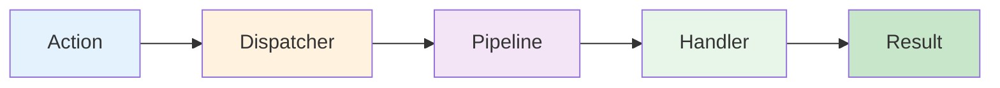

# Core Concepts

This section covers the foundational concepts you need to understand to use Dispatch effectively.

## Before You Start

- **.NET 8.0+** (or .NET 9/10 for latest features)
- Install the required packages:
  ```bash
  dotnet add package Excalibur.Dispatch
  dotnet add package Excalibur.Dispatch.Abstractions
  ```
- Complete the [Getting Started](../getting-started/index.md) guide

## Overview

Dispatch is built around a simple flow:



1. **Action** - A message representing something you want to do
2. **Dispatcher** - Routes actions to the right handler
3. **Pipeline** - Optional behaviors that run before/after handling
4. **Handler** - Code that processes the action
5. **Result** - Success or failure with optional data

## Key Concepts

### Actions

Actions are messages that represent work to be done. They're simple data classes:

```csharp
// Action without return value (command)
public record CreateOrderAction(string CustomerId, List<string> Items) : IDispatchAction;

// Action with return value (query)
public record GetOrderAction(Guid OrderId) : IDispatchAction<Order>;
```

**Learn more:** [Actions and Handlers](actions-and-handlers.md)

### Handlers

Handlers contain the business logic that processes actions:

```csharp
public class CreateOrderHandler : IActionHandler<CreateOrderAction>
{
    public async Task HandleAsync(CreateOrderAction action, CancellationToken ct)
    {
        // Process the action
    }
}
```

**Learn more:** [Actions and Handlers](actions-and-handlers.md)

### Results

Results indicate success or failure without exceptions:

```csharp
var result = await dispatcher.DispatchAsync(action, cancellationToken);

if (result.IsSuccess)
{
    // Handle success
}
else
{
    // Handle failure
    var error = result.ErrorMessage;
}
```

**Learn more:** [Results and Errors](results-and-errors.md)

### Message Context

Context carries metadata through the pipeline:

```csharp
public class MyHandler : IActionHandler<MyAction>
{
    private readonly IMessageContextAccessor _contextAccessor;

    public async Task HandleAsync(MyAction action, CancellationToken ct)
    {
        var context = _contextAccessor.MessageContext;
        var correlationId = context.CorrelationId;
        var tenantId = context.GetItem<string>("TenantId");
    }
}
```

**Learn more:** [Message Context](message-context.md)

### Dependency Injection

Dispatch integrates seamlessly with Microsoft.Extensions.DependencyInjection:

```csharp
// Recommended pattern with fluent configuration
services.AddDispatch(dispatch =>
{
    dispatch.AddHandlersFromAssembly(typeof(Program).Assembly);
    dispatch.ConfigurePipeline("Default", pipeline =>
    {
        pipeline.Use<ValidationMiddleware>();
    });
});
```

**Learn more:** [Dependency Injection](dependency-injection.md)

## In This Section

- [Actions and Handlers](actions-and-handlers.md) - Define actions and implement handlers
- [Message Context](message-context.md) - Work with message metadata and context
- [Results and Errors](results-and-errors.md) - Handle success and failure patterns
- [Dependency Injection](dependency-injection.md) - Configure services and handlers

## What's Next

Once you understand these core concepts, move on to building with Dispatch:

- [Handlers](../handlers.md) - Deep dive into action and event handler patterns
- [Pipeline](../pipeline/index.md) - Add middleware behaviors to your message processing
- [Transports](../transports/index.md) - Configure message transports for production

## See Also

- [Getting Started](../getting-started/index.md) - Quick start tutorial
- [Configuration](../configuration/index.md) - Detailed configuration reference
- [Middleware](../middleware/index.md) - Cross-cutting concerns and pipeline behaviors
