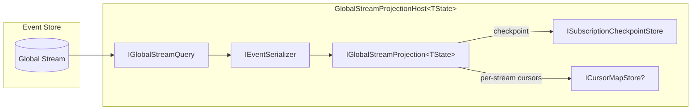

# GlobalStreamProjectionHost

`GlobalStreamProjectionHost<TState>` is a background service that continuously reads from the global event stream and applies events to a custom projection. Use it when you need full control over how events are projected — beyond what `AddProjection<T>().Async()` provides.

## Before You Start

- **.NET 10.0**
- Install the required packages:
  ```bash
  dotnet add package Excalibur.EventSourcing
  ```
- Familiarity with [projections](./projections.md) and [event stores](./event-store.md)

## When to Use GlobalStreamProjectionHost

| Scenario | Use |
|----------|-----|
| Standard per-aggregate read models | `AddProjection<T>().Inline()` or `.Async()` |
| Cross-aggregate custom state machines | **GlobalStreamProjectionHost** |
| Global metrics / statistics | **GlobalStreamProjectionHost** |
| CDC-like stream tailing with custom logic | **GlobalStreamProjectionHost** |
| Simple background catch-up processing | `EnableProjectionProcessing()` (uses `AsyncProjectionProcessingHost`) |

### GlobalStreamProjectionHost vs AsyncProjectionProcessingHost

| Aspect | GlobalStreamProjectionHost | AsyncProjectionProcessingHost |
|--------|---------------------------|-------------------------------|
| **Scope** | Single custom projection (your `IGlobalStreamProjection<TState>`) | All registered `.Async()` projections |
| **State type** | Your custom `TState` class | Per-projection stores via `IProjectionStore<T>` |
| **Registration** | Manual — register as hosted service | Automatic via `EnableProjectionProcessing()` |
| **Flexibility** | Full control over event handling logic | Convention-based `When<T>` handlers |
| **Use case** | Global aggregations, custom state machines | Standard async read models |

## Architecture



## Core Interface

Implement `IGlobalStreamProjection<TState>` to define how events update your state:

```csharp
public interface IGlobalStreamProjection<TState>
    where TState : class
{
    Task ApplyAsync(IDomainEvent domainEvent, TState state, CancellationToken cancellationToken);
}
```

## Getting Started

### 1. Define Your State

```csharp
public class SystemMetricsState
{
    public long TotalEventsProcessed { get; set; }
    public long TotalOrders { get; set; }
    public decimal TotalRevenue { get; set; }
    public DateTimeOffset LastEventTimestamp { get; set; }
}
```

### 2. Implement the Projection

```csharp
public class SystemMetricsProjection : IGlobalStreamProjection<SystemMetricsState>
{
    private readonly ILogger<SystemMetricsProjection> _logger;

    public SystemMetricsProjection(ILogger<SystemMetricsProjection> logger)
        => _logger = logger;

    public Task ApplyAsync(
        IDomainEvent domainEvent,
        SystemMetricsState state,
        CancellationToken cancellationToken)
    {
        state.TotalEventsProcessed++;
        state.LastEventTimestamp = domainEvent.OccurredAt;

        switch (domainEvent)
        {
            case OrderCreated e:
                state.TotalOrders++;
                state.TotalRevenue += e.Amount;
                break;
        }

        return Task.CompletedTask;
    }
}
```

### 3. Register the Host

```csharp
services.AddSingleton<IGlobalStreamProjection<SystemMetricsState>, SystemMetricsProjection>();
services.AddHostedService<GlobalStreamProjectionHost<SystemMetricsState>>();
services.Configure<GlobalStreamProjectionOptions>(opts =>
{
    opts.ProjectionName = "SystemMetrics";  // Unique name for checkpoint tracking
    opts.BatchSize = 500;
    opts.IdlePollingInterval = TimeSpan.FromSeconds(2);
    opts.CheckpointInterval = 100;
});
```

:::warning Unique ProjectionName

Each `GlobalStreamProjectionHost` instance **must** have a unique `ProjectionName`. If two hosts share a name, they will overwrite each other's checkpoint positions. Default is `"AsyncProjectionProcessingHost"` — always override it.
:::

## Configuration Options

| Option | Default | Description |
|--------|---------|-------------|
| `ProjectionName` | `"AsyncProjectionProcessingHost"` | Unique checkpoint identifier — **always override** |
| `BatchSize` | 500 | Maximum events read per poll |
| `IdlePollingInterval` | 1 second | Delay between polls when no events are found |
| `CheckpointInterval` | 100 | Events processed between checkpoint saves |

## Lifecycle

The host follows this loop:

1. **Startup** — Restores last checkpoint position from `ISubscriptionCheckpointStore`
2. **Poll** — Reads up to `BatchSize` events from the global stream via `IGlobalStreamQuery`
3. **Apply** — Deserializes each event and calls `ApplyAsync` on your projection
4. **Checkpoint** — After `CheckpointInterval` events, persists the current position
5. **Idle** — If no events found, waits `IdlePollingInterval` before polling again
6. **Shutdown** — Persists final checkpoint position on graceful stop

### Error Handling

- **Per-event errors** are logged and skipped — processing continues with the next event
- **Batch-level errors** are logged, then the host waits `IdlePollingInterval` before retrying
- **Cancellation** triggers graceful shutdown with final checkpoint persistence

## Cursor Map (Multi-Stream Tracking)

When `ICursorMapStore` is registered in DI, the host tracks per-stream positions in addition to the global checkpoint. This enables scenarios like:

- Detecting which aggregates have been processed
- Building per-aggregate cursor maps for selective replay
- Coordinating with other services that need stream-level granularity

```csharp
// Optional: register a cursor map store for per-stream tracking
services.AddSingleton<ICursorMapStore, SqlServerCursorMapStore>();
```

The cursor map is saved alongside the checkpoint — positions accumulate between checkpoint saves to minimize I/O.

## Observability

When registered in DI, the host integrates with:

- **ProjectionObservability** — Records error counts per projection
- **ProjectionHealthState** — Reports current position as async lag metric

These are automatically available when you call `WithProjectionHealthChecks()` on the event sourcing builder.

## Testing

```csharp
[Fact]
public async Task AppliesOrderCreatedToMetrics()
{
    var projection = new SystemMetricsProjection(NullLogger<SystemMetricsProjection>.Instance);
    var state = new SystemMetricsState();

    var @event = new OrderCreated("order-1", 1) { Amount = 99.95m };
    await projection.ApplyAsync(@event, state, CancellationToken.None);

    state.TotalOrders.ShouldBe(1);
    state.TotalRevenue.ShouldBe(99.95m);
    state.TotalEventsProcessed.ShouldBe(1);
}
```

## See Also

- [Projections](./projections.md) — Standard projection system (inline, async, ephemeral)
- [Materialized Views](./materialized-views.md) — Schedule-driven views with `IMaterializedViewProcessor`
- [Event Store](./event-store.md) — Core event persistence and global stream queries
