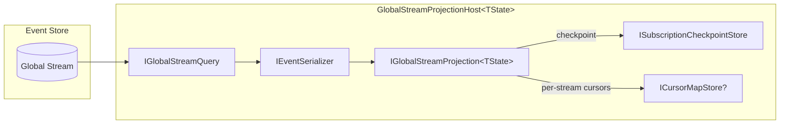

# GlobalStreamProjectionHost

`GlobalStreamProjectionHost<TState>` is a background service that continuously reads from the global event stream and applies events to a custom projection. Use it when you need full control over how events are projected — beyond what `AddProjection<T>().Async()` provides.

## Before You Start

- **.NET 10.0**
- Install the required packages:
  ```bash
  dotnet add package Excalibur.EventSourcing
  ```
- Familiarity with [projections](./projections.md) and [event stores](./event-store.md)

## When to Use GlobalStreamProjectionHost

| Scenario | Use |
|----------|-----|
| Standard per-aggregate read models | `AddProjection<T>().Inline()` or `.Async()` |
| Cross-aggregate custom state machines | **GlobalStreamProjectionHost** |
| Global metrics / statistics | **GlobalStreamProjectionHost** |
| CDC-like stream tailing with custom logic | **GlobalStreamProjectionHost** |
| Simple background catch-up processing | `EnableProjectionProcessing()` (uses `AsyncProjectionProcessingHost`) |

### GlobalStreamProjectionHost vs AsyncProjectionProcessingHost

| Aspect | GlobalStreamProjectionHost | AsyncProjectionProcessingHost |
|--------|---------------------------|-------------------------------|
| **Scope** | Single custom projection (your `IGlobalStreamProjection<TState>`) | All registered `.Async()` projections |
| **State type** | Your custom `TState` class | Per-projection stores via `IProjectionStore<T>` |
| **Registration** | Manual — register as hosted service | Automatic via `EnableProjectionProcessing()` |
| **Flexibility** | Full control over event handling logic | Convention-based `When<T>` handlers |
| **Use case** | Global aggregations, custom state machines | Standard async read models |

## Architecture


```mermaid
flowchart LR
    subgraph EventStore["Event Store"]
        GS[(Global Stream)]
    end

    subgraph Host["GlobalStreamProjectionHost&lt;TState&gt;"]
        Query[IGlobalStreamQuery]
        Deser[IEventSerializer]
        Proj["IGlobalStreamProjection&lt;TState&gt;"]
        CP[ISubscriptionCheckpointStore]
        CM[ICursorMapStore?]
    end

    GS --> Query
    Query --> Deser
    Deser --> Proj
    Proj -->|checkpoint| CP
    Proj -->|per-stream cursors| CM
```

## Core Interface

Implement `IGlobalStreamProjection<TState>` to define how events update your state:

```csharp
public interface IGlobalStreamProjection<TState>
    where TState : class
{
    Task ApplyAsync(IDomainEvent domainEvent, TState state, CancellationToken cancellationToken);
}
```

## Getting Started

### 1. Define Your State

```csharp
public class SystemMetricsState
{
    public long TotalEventsProcessed { get; set; }
    public long TotalOrders { get; set; }
    public decimal TotalRevenue { get; set; }
    public DateTimeOffset LastEventTimestamp { get; set; }
}
```

### 2. Implement the Projection

```csharp
public class SystemMetricsProjection : IGlobalStreamProjection<SystemMetricsState>
{
    private readonly ILogger<SystemMetricsProjection> _logger;

    public SystemMetricsProjection(ILogger<SystemMetricsProjection> logger)
        => _logger = logger;

    public Task ApplyAsync(
        IDomainEvent domainEvent,
        SystemMetricsState state,
        CancellationToken cancellationToken)
    {
        state.TotalEventsProcessed++;
        state.LastEventTimestamp = domainEvent.OccurredAt;

        switch (domainEvent)
        {
            case OrderCreated e:
                state.TotalOrders++;
                state.TotalRevenue += e.Amount;
                break;
        }

        return Task.CompletedTask;
    }
}
```

### 3. Register the Host

```csharp
services.AddSingleton<IGlobalStreamProjection<SystemMetricsState>, SystemMetricsProjection>();
services.AddHostedService<GlobalStreamProjectionHost<SystemMetricsState>>();
services.Configure<GlobalStreamProjectionOptions>(opts =>
{
    opts.ProjectionName = "SystemMetrics";  // Unique name for checkpoint tracking
    opts.BatchSize = 500;
    opts.IdlePollingInterval = TimeSpan.FromSeconds(2);
    opts.CheckpointInterval = 100;
});
```

:::warning Unique ProjectionName

Each `GlobalStreamProjectionHost` instance **must** have a unique `ProjectionName`. If two hosts share a name, they will overwrite each other's checkpoint positions. Default is `"AsyncProjectionProcessingHost"` — always override it.
:::

## Configuration Options

| Option | Default | Description |
|--------|---------|-------------|
| `ProjectionName` | `"AsyncProjectionProcessingHost"` | Unique checkpoint identifier — **always override** |
| `BatchSize` | 500 | Maximum events read per poll |
| `IdlePollingInterval` | 1 second | Delay between polls when no events are found |
| `CheckpointInterval` | 100 | Events processed between checkpoint saves |

## Lifecycle

The host follows this loop:

1. **Startup** — Restores last checkpoint position from `ISubscriptionCheckpointStore`
2. **Poll** — Reads up to `BatchSize` events from the global stream via `IGlobalStreamQuery`
3. **Apply** — Deserializes each event and calls `ApplyAsync` on your projection
4. **Checkpoint** — After `CheckpointInterval` events, persists the position of the **last successfully-applied event** (never past an unapplied event)
5. **Idle** — If no events found, waits `IdlePollingInterval` before polling again
6. **Shutdown** — Persists final checkpoint position on graceful stop

### Error Handling

The host **never silently skips a poison event**. A poison event is one that fails to deserialize, deserializes to `null`, or throws from `ApplyAsync`.

- **Poison event** — the host **halts the batch at that event**, records it, and marks the projection **unhealthy**. The checkpoint is advanced **only** to the last successfully-applied event, so the poison event is **never skipped and the checkpoint never advances past it**. The host backs off (`IdlePollingInterval`) and re-reads from the unadvanced checkpoint on the next poll: a *transient* failure self-heals on retry, while a *permanent* one keeps the projection unhealthy until an operator intervenes. A `null` deserialization is treated as an error, not a skip.
- **Batch-level errors** are logged, then the host waits `IdlePollingInterval` before retrying.
- **Cancellation** triggers graceful shutdown with final checkpoint persistence.

:::warning Behavior change

Earlier versions logged a per-event error and **skipped** the event, advancing the checkpoint past it — silently dropping the event from the read model (a data-loss defect). The host now halts-and-marks-unhealthy instead. If you previously relied on skip-to-continue behavior, route known-bad events to an explicit dead-letter/quarantine sink rather than letting them be silently dropped.
:::

## Cursor Map (Multi-Stream Tracking)

When `ICursorMapStore` is registered in DI, the host tracks per-stream positions in addition to the global checkpoint. This enables scenarios like:

- Detecting which aggregates have been processed
- Building per-aggregate cursor maps for selective replay
- Coordinating with other services that need stream-level granularity

```csharp
// Optional: register a cursor map store for per-stream tracking
services.AddSingleton<ICursorMapStore, SqlServerCursorMapStore>();
```

The cursor map is saved alongside the checkpoint — positions accumulate between checkpoint saves to minimize I/O.

### Provision the table first

The SQL Server and PostgreSQL cursor map stores issue no DDL at run time. Run the script shipped in the
provider package before the first checkpoint:

| Package | Script |
| --- | --- |
| `Excalibur.EventSourcing.SqlServer` | `scripts/008_CreateCursorMapSchema.sql` |
| `Excalibur.EventSourcing.Postgres` | `scripts/008_CreateCursorMapSchema.sql` |

Without it the first save fails — `Msg 208, Invalid object name 'ProjectionCursorMaps'` on SQL Server,
`42P01: relation "projection_cursor_maps" does not exist` on PostgreSQL — and the host halts.

Do not hand-write this table from the column list in the store's API documentation. Both scripts carry
constraints that the column list does not show and that are load-bearing: on SQL Server the natural key is
1152 bytes, over the 900-byte clustered-index limit, so a plain `PRIMARY KEY` creates a table that accepts
the definition and then refuses long rows at run time; and the three key columns take a binary collation so
the database agrees with the store's ordinal comparison rather than folding two distinct stream ids onto one
cursor. On PostgreSQL the primary key is also what makes the upsert legal — the save path uses
`ON CONFLICT (tenant_id, projection_name, stream_id)`, which requires a matching unique constraint.

Cursor positions are partitioned by tenant. Each tenant running the same projection over the same stream
keeps its own position, so one tenant's progress never advances another's.

## Observability

When registered in DI, the host integrates with:

- **ProjectionObservability** — Records error counts per projection
- **ProjectionHealthState** — Reports current position as async lag metric

These are automatically available when you call `WithProjectionHealthChecks()` on the event sourcing builder.

## Testing

```csharp
[Fact]
public async Task AppliesOrderCreatedToMetrics()
{
    var projection = new SystemMetricsProjection(NullLogger<SystemMetricsProjection>.Instance);
    var state = new SystemMetricsState();

    var @event = new OrderCreated("order-1", 1) { Amount = 99.95m };
    await projection.ApplyAsync(@event, state, CancellationToken.None);

    state.TotalOrders.ShouldBe(1);
    state.TotalRevenue.ShouldBe(99.95m);
    state.TotalEventsProcessed.ShouldBe(1);
}
```

## See Also

- [Projections](./projections.md) — Standard projection system (inline, async, ephemeral)
- [Materialized Views](./materialized-views.md) — Schedule-driven views with `IMaterializedViewProcessor`
- [Event Store](./event-store.md) — Core event persistence and global stream queries
