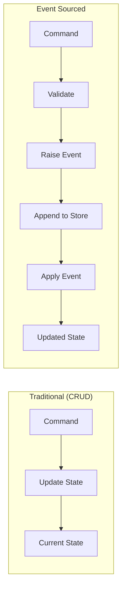
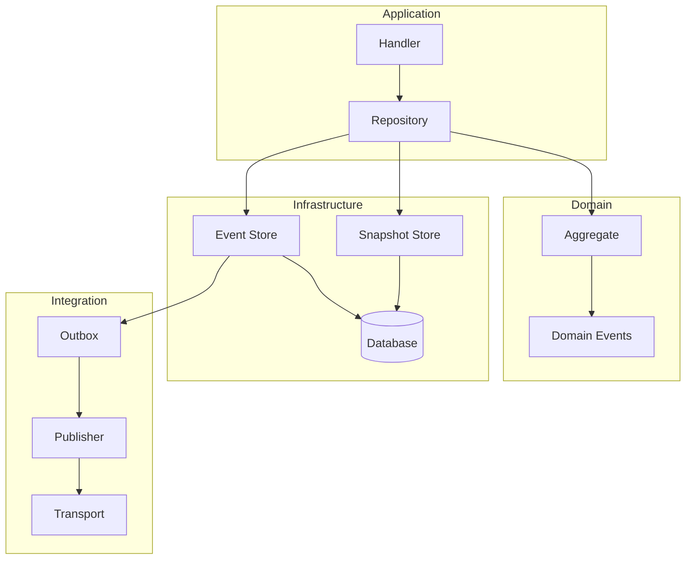

# Event Sourcing

Excalibur provides a complete event sourcing implementation with aggregates, event stores, snapshots, and projections.

## Before You Start

- **.NET 8.0+** (or .NET 9/10 for latest features)
- Install the required packages:
  ```bash
  dotnet add package Excalibur.Dispatch
  dotnet add package Excalibur.Dispatch.Abstractions
  dotnet add package Excalibur.EventSourcing
  ```
- Familiarity with [handlers](../handlers.md) and [domain modeling](../domain-modeling/aggregates.md)

## Overview

Event sourcing captures all changes to application state as a sequence of events. Instead of storing current state, you store the history of state changes.



## Key Benefits

| Benefit | Description |
|---------|-------------|
| Complete audit trail | Every change is recorded with timestamp and metadata |
| Temporal queries | Query state at any point in time |
| Event replay | Rebuild state by replaying events |
| Debugging | Understand exactly how state evolved |
| Integration | Events naturally feed downstream systems |

## Quick Start

### 1. Define Domain Events

Events extend the `DomainEventBase` abstract record which provides `EventId`, `AggregateId`, `Version`, `OccurredAt`, and `Metadata`:

```csharp
public record OrderCreated(Guid OrderId, string CustomerId, decimal TotalAmount) : DomainEventBase
{
    public override string AggregateId => OrderId.ToString();
}

public record OrderShipped(Guid OrderId, string TrackingNumber, DateTime ShippedAt) : DomainEventBase
{
    public override string AggregateId => OrderId.ToString();
}

public record OrderCancelled(Guid OrderId, string Reason) : DomainEventBase
{
    public override string AggregateId => OrderId.ToString();
}
```

### 2. Create an Aggregate

```csharp
public class Order : AggregateRoot<Guid>
{
    public string CustomerId { get; private set; }
    public decimal TotalAmount { get; private set; }
    public OrderStatus Status { get; private set; }
    public string? TrackingNumber { get; private set; }

    // Private constructor for rehydration
    private Order() { }

    // Factory method for creation
    public static Order Create(Guid orderId, string customerId, decimal totalAmount)
    {
        var order = new Order();
        order.RaiseEvent(new OrderCreated(orderId, customerId, totalAmount));
        return order;
    }

    // Command methods
    public void Ship(string trackingNumber)
    {
        if (Status != OrderStatus.Created)
            throw new InvalidOperationException("Only created orders can be shipped");

        RaiseEvent(new OrderShipped(Id, trackingNumber, DateTime.UtcNow));
    }

    public void Cancel(string reason)
    {
        if (Status == OrderStatus.Shipped)
            throw new InvalidOperationException("Shipped orders cannot be cancelled");

        RaiseEvent(new OrderCancelled(Id, reason));
    }

    // Event application - uses pattern matching, no reflection
    protected override void ApplyEventInternal(IDomainEvent @event) => _ = @event switch
    {
        OrderCreated e => Apply(e),
        OrderShipped e => Apply(e),
        OrderCancelled e => Apply(e),
        _ => throw new InvalidOperationException($"Unknown event: {@event.GetType().Name}")
    };

    private bool Apply(OrderCreated e)
    {
        Id = e.OrderId;
        CustomerId = e.CustomerId;
        TotalAmount = e.TotalAmount;
        Status = OrderStatus.Created;
        return true;
    }

    private bool Apply(OrderShipped e)
    {
        TrackingNumber = e.TrackingNumber;
        Status = OrderStatus.Shipped;
        return true;
    }

    private bool Apply(OrderCancelled e)
    {
        Status = OrderStatus.Cancelled;
        return true;
    }
}
```

### 3. Configure Event Sourcing

```csharp
services.AddExcaliburEventSourcing(builder =>
{
    // Register repositories with explicit factory
    builder.AddRepository<Order, Guid>(id => new Order());

    // Configure snapshot strategy (optional)
    builder.UseIntervalSnapshots(100); // Snapshot every 100 events

    // Or use composite strategy for more control
    // builder.UseCompositeSnapshotStrategy(s => s
    //     .AddIntervalStrategy(50)
    //     .AddTimeBasedStrategy(TimeSpan.FromMinutes(5))
    //     .RequireAll());
});

// Add SQL Server event store (separate package)
services.AddSqlServerEventStore(connectionString);
services.AddSqlServerSnapshotStore(connectionString);
```

### 4. Use in Handlers

```csharp
public class CreateOrderHandler : IActionHandler<CreateOrderAction, OrderResult>
{
    private readonly IEventSourcedRepository<Order, Guid> _repository;

    public CreateOrderHandler(IEventSourcedRepository<Order, Guid> repository)
    {
        _repository = repository;
    }

    public async Task<OrderResult> HandleAsync(
        CreateOrderAction action,
        CancellationToken ct)
    {
        var order = Order.Create(
            Guid.NewGuid(),
            action.CustomerId,
            action.TotalAmount);

        await _repository.SaveAsync(order, ct);

        return new OrderResult(order.Id);
    }
}

public class ShipOrderHandler : IActionHandler<ShipOrderAction>
{
    private readonly IEventSourcedRepository<Order, Guid> _repository;

    public async Task HandleAsync(ShipOrderAction action, CancellationToken ct)
    {
        var order = await _repository.GetByIdAsync(action.OrderId, ct);

        if (order is null)
            throw new OrderNotFoundException(action.OrderId);

        order.Ship(action.TrackingNumber);

        await _repository.SaveAsync(order, ct);
    }
}
```

## Architecture



## Core Concepts

### Domain Events

Events represent facts that have happened. They are immutable and named in past tense.

```csharp
// Base interface
public interface IDomainEvent : IDispatchEvent
{
    string EventId { get; }
    string AggregateId { get; }
    long Version { get; }
    DateTimeOffset OccurredAt { get; }
    string EventType { get; }
    IDictionary<string, object>? Metadata { get; }
}

// Convenient base record with auto-generated defaults
public abstract record DomainEventBase : IDomainEvent
{
    public virtual string EventId { get; init; } = Guid.NewGuid().ToString();
    public virtual string AggregateId { get; init; } = string.Empty;
    public virtual long Version { get; init; }
    public virtual DateTimeOffset OccurredAt { get; init; } = DateTimeOffset.UtcNow;
    public virtual string EventType => GetType().Name;
    public virtual IDictionary<string, object>? Metadata { get; init; }
}
```

### Aggregates

Aggregates enforce business rules and emit events when state changes.

```csharp
public abstract class AggregateRoot<TKey> : IAggregateRoot<TKey>
{
    public TKey Id { get; protected set; }
    public long Version { get; protected set; }
    public string? ETag { get; set; }

    public IReadOnlyList<IDomainEvent> GetUncommittedEvents();
    public void MarkEventsAsCommitted();
    public void LoadFromHistory(IEnumerable<IDomainEvent> history);

    protected void RaiseEvent(IDomainEvent @event);
    protected abstract void ApplyEventInternal(IDomainEvent @event);
}
```

### Event Store

Persists events with optimistic concurrency control.

```csharp
public interface IEventStore
{
    ValueTask<IReadOnlyList<StoredEvent>> LoadAsync(
        string aggregateId,
        string aggregateType,
        CancellationToken cancellationToken);

    ValueTask<AppendResult> AppendAsync(
        string aggregateId,
        string aggregateType,
        IEnumerable<IDomainEvent> events,
        long expectedVersion,
        CancellationToken cancellationToken);
}
```

## In This Section

- [Domain Events](domain-events.md) — Define and work with domain events
- [Aggregates](aggregates.md) — Build event-sourced aggregates
- [Event Store](event-store.md) — Persist and load events
- [Snapshots](snapshots.md) — Optimize loading with snapshots
- [Projections](projections.md) — Build read models from events
- [Materialized Views](materialized-views.md) — Query-optimized analytics views
- [Migrations](migrations.md) — Schema migrations CLI tool
- [Event Versioning](versioning.md) — Handle schema evolution

## See Also

- [Patterns](../patterns/index.md) - Outbox pattern for reliable event publishing
- [Handlers](../handlers.md) - Command and event handler patterns
- [Dispatch vs Excalibur](../dispatch-vs-excalibur.md) - Understanding the Dispatch/Excalibur boundary for event sourcing
