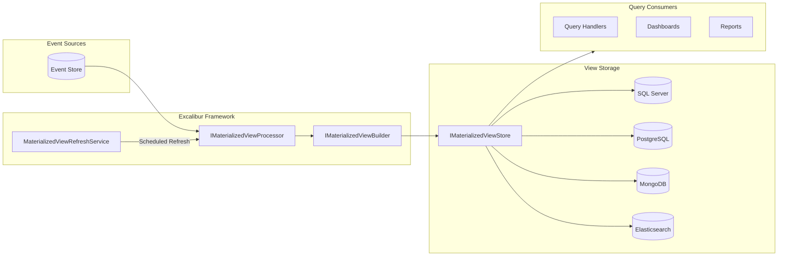

# Materialized Views

Materialized views are pre-computed, query-optimized read models that aggregate data from event streams. While [projections](projections.md) build read models in real-time as events occur, materialized views are **schedule-driven** and designed for complex queries, reporting, and analytics where staleness is acceptable.

## Before You Start

- **.NET 8.0+** (or .NET 9/10 for latest features)
- Install the required packages:
  ```bash
  dotnet add package Excalibur.EventSourcing
  dotnet add package Excalibur.EventSourcing.SqlServer  # or your provider
  ```
- Familiarity with [projections](./projections.md) and [event stores](./event-store.md)

## Projections vs Materialized Views

| Aspect | Projections | Materialized Views |
|--------|-------------|-------------------|
| **Trigger** | Event-driven (real-time) | Schedule-driven (batched) |
| **Purpose** | General read models | Query-optimized analytics |
| **Staleness** | Near-zero | Configurable (seconds to hours) |
| **Complexity** | Single aggregate focus | Cross-aggregate aggregation |
| **Use case** | Order details, lists | Dashboards, reports, KPIs |

## When to Use Materialized Views

Use materialized views when:

- Queries aggregate data across multiple aggregates or event streams
- Data can tolerate staleness (dashboards, reports)
- Building the view is expensive (complex joins, aggregations)
- You need to leverage native database features (indexed views, aggregation pipelines)

## Architecture Overview



## Key Concepts

### How GetViewId Works

The `GetViewId` method extracts the **view instance identifier** from an event. It determines *which specific view instance* should be updated by a given event.

```csharp
string? GetViewId(IDomainEvent @event);
```

The method returns `string?`:

- **Returns a string** → The processor loads that view instance, applies the event, and saves it
- **Returns `null`** → The event is skipped—no view is updated

Combined with `ViewName`, this forms a unique key: `(ViewName, ViewId)` → one view instance.

### Example: Order Summary View

```csharp
public class OrderSummaryViewBuilder : IMaterializedViewBuilder<OrderSummaryView>
{
    public string ViewName => "OrderSummary";

    public IReadOnlyList<Type> HandledEventTypes => new[]
    {
        typeof(OrderCreated),
        typeof(OrderItemAdded),
        typeof(OrderShipped)
    };

    public string? GetViewId(IDomainEvent @event) => @event switch
    {
        OrderCreated e => e.OrderId.ToString(),
        OrderItemAdded e => e.OrderId.ToString(),
        OrderShipped e => e.OrderId.ToString(),
        _ => null  // Skip unhandled events
    };

    public OrderSummaryView Apply(OrderSummaryView view, IDomainEvent @event) { ... }
}
```

### Multiple Views on the Same Event Stream

What if you need multiple materialized views built from the same events? Each builder has its own:

1. **`ViewName`** — unique identifier for the view type
2. **`HandledEventTypes`** — the events it subscribes to
3. **Position** — tracked separately per `ViewName`

When you register multiple builders, the processor iterates through **all registered builders** for each event. Each builder whose `HandledEventTypes` includes the event type will:

1. Call `GetViewId(@event)` to determine which view instance
2. If not null, load the view, apply the event, and save the view

### Example: Same Event, Different Views

Consider an `OrderCreated` event with `OrderId: 123`, `CustomerId: 456`, and `Amount: 99.99`. Three different builders can each extract a **different key** from the same event:

```csharp
// Builder 1: OrderSummaryViewBuilder
// Keyed by OrderId → Updates OrderSummaryView for order 123
public string? GetViewId(IDomainEvent @event) => @event switch
{
    OrderCreated e => e.OrderId.ToString(),  // "123"
    _ => null
};

// Builder 2: CustomerOrderHistoryViewBuilder
// Keyed by CustomerId → Updates CustomerOrderHistoryView for customer 456
public string? GetViewId(IDomainEvent @event) => @event switch
{
    OrderCreated e => e.CustomerId.ToString(),  // "456"
    _ => null
};

// Builder 3: DailyRevenueViewBuilder
// Keyed by date → Updates DailyRevenueView for Feb 5, 2026
public string? GetViewId(IDomainEvent @event) => @event switch
{
    OrderCreated e => e.OccurredAt.ToString("yyyy-MM-dd"),  // "2026-02-05"
    _ => null
};
```

Each builder uses **different keys** from the same event to build different kinds of projections.

### Position Tracking Per View

Position is tracked **per `ViewName`**, not globally. This enables independent catch-up for each view:

```sql
SELECT * FROM materialized_view_positions;

| view_name              | position | updated_at          |
|------------------------|----------|---------------------|
| OrderSummary           | 15234    | 2026-02-05 12:00:00 |
| CustomerOrderHistory   | 15234    | 2026-02-05 12:00:00 |
| DailyRevenue           | 15100    | 2026-02-05 11:55:00 |  -- lagging behind
```

This enables:

- **Independent catch-up** — Each view can process at its own pace
- **Selective rebuild** — Rebuild one view without affecting others
- **Different refresh schedules** — Critical views refresh more frequently

## Core Interfaces

### IMaterializedViewBuilder

Defines how to build a view from events:

```csharp
public interface IMaterializedViewBuilder<TView>
    where TView : class, new()
{
    /// <summary>
    /// Gets the name of this view builder for position tracking.
    /// </summary>
    string ViewName { get; }

    /// <summary>
    /// Gets the types of events this builder handles.
    /// </summary>
    IReadOnlyList<Type> HandledEventTypes { get; }

    /// <summary>
    /// Determines the view ID for an event.
    /// </summary>
    string? GetViewId(IDomainEvent @event);

    /// <summary>
    /// Applies an event to the view, updating its state.
    /// </summary>
    TView Apply(TView view, IDomainEvent @event);

    /// <summary>
    /// Creates a new instance of the view.
    /// </summary>
    TView CreateNew() => new();
}
```

### IMaterializedViewStore

Handles persistence of materialized views:

```csharp
public interface IMaterializedViewStore
{
    /// <summary>
    /// Gets a materialized view by its identifier.
    /// </summary>
    ValueTask<TView?> GetAsync<TView>(
        string viewName,
        string viewId,
        CancellationToken cancellationToken)
        where TView : class;

    /// <summary>
    /// Saves a materialized view.
    /// </summary>
    ValueTask SaveAsync<TView>(
        string viewName,
        string viewId,
        TView view,
        CancellationToken cancellationToken)
        where TView : class;

    /// <summary>
    /// Deletes a materialized view.
    /// </summary>
    ValueTask DeleteAsync(
        string viewName,
        string viewId,
        CancellationToken cancellationToken);

    /// <summary>
    /// Gets the last processed position for a view.
    /// </summary>
    ValueTask<long?> GetPositionAsync(
        string viewName,
        CancellationToken cancellationToken);

    /// <summary>
    /// Saves the last processed position for a view.
    /// </summary>
    ValueTask SavePositionAsync(
        string viewName,
        long position,
        CancellationToken cancellationToken);
}
```

## Getting Started

### 1. Define Your View Model

```csharp
public class OrderSummaryView
{
    public string OrderId { get; set; } = string.Empty;
    public string CustomerId { get; set; } = string.Empty;
    public decimal TotalAmount { get; set; }
    public int ItemCount { get; set; }
    public string Status { get; set; } = string.Empty;
    public DateTimeOffset CreatedAt { get; set; }
    public DateTimeOffset LastUpdatedAt { get; set; }
}
```

### 2. Create a View Builder

```csharp
public class OrderSummaryViewBuilder : IMaterializedViewBuilder<OrderSummaryView>
{
    public string ViewName => "OrderSummary";

    public IReadOnlyList<Type> HandledEventTypes { get; } = new[]
    {
        typeof(OrderCreated),
        typeof(OrderItemAdded),
        typeof(OrderCompleted)
    };

    public string? GetViewId(IDomainEvent @event) => @event switch
    {
        OrderCreated e => e.OrderId,
        OrderItemAdded e => e.OrderId,
        OrderCompleted e => e.OrderId,
        _ => null
    };

    public OrderSummaryView Apply(OrderSummaryView view, IDomainEvent @event)
    {
        switch (@event)
        {
            case OrderCreated e:
                view.OrderId = e.OrderId;
                view.CustomerId = e.CustomerId;
                view.Status = "Created";
                view.CreatedAt = e.OccurredAt;
                view.LastUpdatedAt = e.OccurredAt;
                break;

            case OrderItemAdded e:
                view.TotalAmount += e.UnitPrice * e.Quantity;
                view.ItemCount += e.Quantity;
                view.LastUpdatedAt = e.OccurredAt;
                break;

            case OrderCompleted e:
                view.Status = "Completed";
                view.LastUpdatedAt = e.OccurredAt;
                break;
        }

        return view;
    }
}
```

### 3. Register Services

```csharp
// Register the materialized view store (choose one provider)
services.AddSqlServerMaterializedViewStore(connectionString);
// services.AddPostgresMaterializedViewStore(connectionString);

services.AddMaterializedViews(builder =>
{
    // Register view builders
    builder.AddBuilder<OrderSummaryView, OrderSummaryViewBuilder>()
           .AddBuilder<CustomerStatsView, CustomerStatsViewBuilder>();

    // MongoDB and ElasticSearch have builder extensions:
    // builder.UseMongoDb("mongodb://localhost:27017", "myapp");
    // builder.UseElasticSearch("http://localhost:9200");

    // Enable background refresh
    builder.UseRefreshService(options =>
    {
        options.RefreshInterval = TimeSpan.FromSeconds(30);
        // Or use cron: options.CronExpression = "*/5 * * * *";
        options.CatchUpOnStartup = true;
        options.MaxRetryCount = 3;
    });

    // Enable health checks and metrics
    builder.WithHealthChecks()
           .WithMetrics();
});
```

### 4. Query Views in Handlers

```csharp
public class GetOrderSummaryHandler : IActionHandler<GetOrderSummaryQuery, OrderSummaryDto>
{
    private readonly IMaterializedViewStore _viewStore;

    public GetOrderSummaryHandler(IMaterializedViewStore viewStore)
    {
        _viewStore = viewStore;
    }

    public async Task<OrderSummaryDto> HandleAsync(
        GetOrderSummaryQuery query,
        CancellationToken ct)
    {
        var view = await _viewStore.GetAsync<OrderSummaryView>(
            "OrderSummary",
            query.OrderId,
            ct);

        if (view is null)
            return OrderSummaryDto.NotFound;

        return new OrderSummaryDto
        {
            OrderId = view.OrderId,
            CustomerId = view.CustomerId,
            TotalAmount = view.TotalAmount,
            ItemCount = view.ItemCount,
            Status = view.Status,
            LastUpdatedAt = view.LastUpdatedAt
        };
    }
}
```

## Store Providers

### SQL Server

```csharp
// Simple registration
services.AddSqlServerMaterializedViewStore(connectionString);

// Or with fluent builder
services.AddMaterializedViews(builder =>
{
    builder.AddBuilder<OrderSummaryView, OrderSummaryViewBuilder>()
           .UseStore<SqlServerMaterializedViewStore>();
});

// With custom table names
services.AddSqlServerMaterializedViewStore(
    connectionString,
    viewTableName: "MyViews",
    positionTableName: "MyViewPositions");
```

**Storage:** JSON in `nvarchar(max)` column with MERGE upserts.

**Tables:**
- `MaterializedViews` (ViewName, ViewId, Data, CreatedAt, UpdatedAt)
- `MaterializedViewPositions` (ViewName, Position, CreatedAt, UpdatedAt)

### PostgreSQL

```csharp
services.AddPostgresMaterializedViewStore(connectionString);
```

**Storage:** JSONB with `INSERT ON CONFLICT` upserts.

**Tables:** (snake_case per ADR-109)
- `materialized_views` (view_name, view_id, data, created_at, updated_at)
- `materialized_view_positions` (view_name, position, created_at, updated_at)

### MongoDB

```csharp
services.AddMaterializedViews(builder =>
{
    builder.UseMongoDb("mongodb://localhost:27017", "myapp");
    // Or with options:
    builder.UseMongoDb(options =>
    {
        options.ConnectionString = "mongodb://localhost:27017";
        options.DatabaseName = "myapp";
        options.ViewsCollectionName = "materialized_views";
        options.PositionsCollectionName = "materialized_view_positions";
        options.UseSsl = true;
    });
});
```

**Storage:** BSON documents with composite IDs (`viewName:viewId`).

**Collections:**
- `materialized_views`
- `materialized_view_positions`

### Elasticsearch

```csharp
services.AddMaterializedViews(builder =>
{
    builder.UseElasticSearch("http://localhost:9200");
    // Or with options:
    builder.UseElasticSearch(options =>
    {
        options.NodeUri = "http://localhost:9200";
        options.ViewsIndexName = "materialized-views";
        options.PositionsIndexName = "materialized-view-positions";
        options.Username = "elastic";
        options.Password = "changeme";
        // Or API key:
        // options.ApiKey = "your-api-key";
    });
});
```

**Storage:** JSON documents with automatic index creation.

**Indices:**
- `materialized-views`
- `materialized-view-positions`

## Background Refresh Service

The `MaterializedViewRefreshService` is a `BackgroundService` that periodically processes new events and updates views.

### Configuration Options

```csharp
builder.UseRefreshService(options =>
{
    // Interval-based scheduling (default)
    options.RefreshInterval = TimeSpan.FromSeconds(30);

    // OR cron-based scheduling (takes precedence)
    options.CronExpression = "*/5 * * * *"; // Every 5 minutes

    // Catch up on startup
    options.CatchUpOnStartup = true;

    // Retry configuration
    options.MaxRetryCount = 3;
    options.InitialRetryDelay = TimeSpan.FromSeconds(1);
    options.MaxRetryDelay = TimeSpan.FromSeconds(30);

    // Enable/disable
    options.Enabled = true;
});
```

### Cron Expression Examples

| Expression | Schedule |
|------------|----------|
| `*/30 * * * * *` | Every 30 seconds |
| `*/5 * * * *` | Every 5 minutes |
| `0 * * * *` | Every hour |
| `0 0 * * *` | Daily at midnight |
| `0 0 * * 0` | Weekly on Sunday |

## Health Checks

The `MaterializedViewHealthCheck` monitors view health and integrates with ASP.NET Core health checks.

### Configuration

```csharp
builder.WithHealthChecks(options =>
{
    options.Name = "materialized-views";
    options.Tags = new[] { "ready", "event-sourcing" };
    options.StalenessThreshold = TimeSpan.FromMinutes(5);
    options.FailureRateThresholdPercent = 10.0;
    options.IncludeDetails = true;
});
```

### Health States

| State | Condition |
|-------|-----------|
| **Healthy** | All views current, failure rate acceptable |
| **Degraded** | Views stale OR failure rate exceeds threshold |
| **Unhealthy** | No views registered OR store unavailable |

### Endpoint Setup

```csharp
app.MapHealthChecks("/health/ready", new HealthCheckOptions
{
    Predicate = check => check.Tags.Contains("ready")
});
```

**Response:**

```json
{
  "status": "Healthy",
  "checks": [
    {
      "name": "materialized-views",
      "status": "Healthy",
      "description": "3 materialized views healthy.",
      "data": {
        "registeredViews": 3,
        "viewNames": ["OrderSummary", "CustomerStats", "ProductAnalytics"],
        "maxStaleness": "00:00:45",
        "failureRatePercent": 0
      }
    }
  ]
}
```

## OpenTelemetry Metrics

The `MaterializedViewMetrics` class provides comprehensive observability.

### Configuration

```csharp
builder.WithMetrics();
```

### Available Metrics

| Metric | Type | Description |
|--------|------|-------------|
| `materialized_view.refresh.duration` | Histogram | Duration of refresh operations (seconds) |
| `materialized_view.staleness` | ObservableGauge | Time since last refresh per view (seconds) |
| `materialized_view.refresh.failures` | Counter | Count of refresh failures |
| `materialized_view.state` | ObservableGauge | View health (1=healthy, 0=unhealthy) |

**Meter name:** `Excalibur.EventSourcing.MaterializedViews`

### OpenTelemetry Setup

```csharp
builder.Services.AddOpenTelemetry()
    .WithMetrics(metrics =>
    {
        metrics.AddMeter("Excalibur.EventSourcing.MaterializedViews");
        metrics.AddPrometheusExporter();
    });
```

## Best Practices

### 1. Design for Staleness

Always surface when data was last updated:

```csharp
public class DashboardDto
{
    public SalesData Sales { get; set; }
    public DateTime DataAsOf { get; set; }
    public bool IsStale { get; set; }  // > 2x refresh interval
}
```

### 2. Choose Appropriate Refresh Intervals

| View Type | Suggested Interval |
|-----------|-------------------|
| Real-time dashboards | 15-60 seconds |
| Operational reports | 5-15 minutes |
| Analytics dashboards | 1-4 hours |
| Historical reports | Daily |

### 3. Use Position Tracking

Position tracking ensures exactly-once processing:

```csharp
// The framework handles this automatically, but for manual scenarios:
var position = await _store.GetPositionAsync("OrderSummary", ct);
// Process events from position...
await _store.SavePositionAsync("OrderSummary", newPosition, ct);
```

### 4. Handle Build Failures Gracefully

```csharp
public async Task<TView?> GetViewWithFallbackAsync<TView>(
    string viewName,
    string viewId,
    CancellationToken ct) where TView : class
{
    var view = await _store.GetAsync<TView>(viewName, viewId, ct);

    if (view is null)
    {
        _logger.LogWarning(
            "View {ViewName}/{ViewId} not available",
            viewName, viewId);
        return default;
    }

    return view;
}
```

### 5. Monitor View Health

Configure alerts based on health check status and metrics:

```csharp
// Prometheus alerting rule example
groups:
  - name: materialized-views
    rules:
      - alert: MaterializedViewStale
        expr: materialized_view_staleness > 300
        for: 5m
        labels:
          severity: warning
        annotations:
          summary: "Materialized view is stale"
```

## Advanced Scenarios

### Single Store Per Application

The framework registers one `IMaterializedViewStore` per application (using `TryAddSingleton`). The first registration wins — subsequent registrations are silently ignored. Choose the store that best fits your primary query workload:

```csharp
// Pick ONE store provider
services.AddSqlServerMaterializedViewStore(sqlConnectionString);
// OR: services.AddPostgresMaterializedViewStore(pgConnectionString);
// OR: builder.UseMongoDb("mongodb://localhost:27017", "myapp");
// OR: builder.UseElasticSearch("http://elasticsearch:9200");
```

:::tip Hybrid Architectures
If you need views in multiple stores (e.g., SQL Server for transactional queries + Elasticsearch for full-text search), use [projections](projections.md) for the secondary store — each projection store is registered per `TProjection` type and doesn't conflict.
:::

### Custom Processors

Implement `IMaterializedViewProcessor` for custom processing logic:

```csharp
public class CustomProcessor : IMaterializedViewProcessor
{
    public Task CatchUpAsync(string viewName, CancellationToken ct)
    {
        // Custom catch-up logic
    }

    public Task ProcessEventAsync(IDomainEvent @event, CancellationToken ct)
    {
        // Custom event processing
    }
}

// Register
builder.UseProcessor<CustomProcessor>();
```

## Next Steps

- **[Projections](projections.md)** — Event-driven read models
- **[Event Store](event-store.md)** — Core event persistence
- **[Data Providers](../data-providers/index.md)** — Provider-specific features
- **[Health Checks](../observability/health-checks.md)** — Monitoring infrastructure

## See Also

- [Projections](./projections.md) - Event-driven read models for real-time query optimization
- [Event Sourcing Overview](./index.md) - Core concepts and getting started with event sourcing
- [CDC Pattern](../patterns/cdc.md) - Change Data Capture for async event processing
