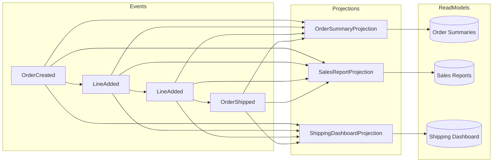

# Projections

Projections transform event streams into read-optimized views (read models) for queries.

## Before You Start

- **.NET 8.0+** (or .NET 9/10 for latest features)
- Install the required packages:
  ```bash
  dotnet add package Excalibur.EventSourcing
  ```
- Familiarity with [event stores](./event-store.md) and [domain events](./domain-events.md)

## Overview



## Defining Projections

Projections use `IProjectionStore<T>` for storage and custom handlers that process events:

### Using IProjectionStore

```csharp
public class OrderSummaryProjectionHandler
{
    private readonly IProjectionStore<OrderSummary> _store;

    public OrderSummaryProjectionHandler(IProjectionStore<OrderSummary> store)
    {
        _store = store;
    }

    public async Task HandleAsync(IDomainEvent @event, CancellationToken ct)
    {
        switch (@event)
        {
            case OrderCreated e:
                await _store.UpsertAsync(e.OrderId.ToString(), new OrderSummary
                {
                    OrderId = e.OrderId,
                    CustomerId = e.CustomerId,
                    Status = "Created",
                    TotalAmount = 0,
                    LineCount = 0,
                    CreatedAt = e.OccurredAt
                }, ct);
                break;

            case OrderLineAdded e:
                var summary = await _store.GetByIdAsync(e.OrderId.ToString(), ct);
                if (summary is not null)
                {
                    summary.TotalAmount += e.Quantity * e.UnitPrice;
                    summary.LineCount++;
                    await _store.UpsertAsync(e.OrderId.ToString(), summary, ct);
                }
                break;

            case OrderShipped e:
                var order = await _store.GetByIdAsync(e.OrderId.ToString(), ct);
                if (order is not null)
                {
                    order.Status = "Shipped";
                    order.ShippedAt = e.ShippedAt;
                    await _store.UpsertAsync(e.OrderId.ToString(), order, ct);
                }
                break;
        }
    }
}
```

### IProjectionStore Interface

The `IProjectionStore<T>` interface provides CRUD operations with dictionary-based querying:

```csharp
public interface IProjectionStore<TProjection> where TProjection : class
{
    Task<TProjection?> GetByIdAsync(string id, CancellationToken cancellationToken);
    Task UpsertAsync(string id, TProjection projection, CancellationToken cancellationToken);
    Task DeleteAsync(string id, CancellationToken cancellationToken);
    Task<IReadOnlyList<TProjection>> QueryAsync(
        IDictionary<string, object>? filters,
        QueryOptions? options,
        CancellationToken cancellationToken);
    Task<long> CountAsync(IDictionary<string, object>? filters, CancellationToken cancellationToken);
}
```

### Typed Event Handlers

Use Dispatch handlers to process events and update projections:

```csharp
public class OrderCreatedProjectionHandler : IEventHandler<OrderCreated>
{
    private readonly IProjectionStore<OrderSummary> _store;

    public OrderCreatedProjectionHandler(IProjectionStore<OrderSummary> store)
    {
        _store = store;
    }

    public async Task HandleAsync(OrderCreated @event, CancellationToken ct)
    {
        await _store.UpsertAsync(@event.OrderId.ToString(), new OrderSummary
        {
            OrderId = @event.OrderId,
            CustomerId = @event.CustomerId,
            Status = "Created",
            CreatedAt = @event.OccurredAt
        }, ct);
    }
}

public class OrderLineAddedProjectionHandler : IEventHandler<OrderLineAdded>
{
    private readonly IProjectionStore<OrderSummary> _store;

    public async Task HandleAsync(OrderLineAdded @event, CancellationToken ct)
    {
        var summary = await _store.GetByIdAsync(@event.OrderId.ToString(), ct);
        if (summary is null) return;

        summary.TotalAmount += @event.Quantity * @event.UnitPrice;
        summary.LineCount++;
        await _store.UpsertAsync(@event.OrderId.ToString(), summary, ct);
    }
}
```

## Configuration

### Register Projection Stores

Configure projection stores based on your storage backend:

```csharp
// MongoDB projection store
services.AddMongoDbProjectionStore<OrderSummary>(mongoConnectionString, "projections");

// ElasticSearch projection store
services.AddElasticSearchProjectionStore<OrderSummary>(options =>
{
    options.NodeUri = "https://elasticsearch.example.com:9200";
    // Environment-scoped prefix → e.g. "development-projections-ordersummary"
    options.IndexPrefix = $"{builder.Environment.EnvironmentName.ToLowerInvariant()}-projections";
});

// CosmosDb projection store
services.AddCosmosDbProjectionStore<OrderSummary>(cosmosConnectionString, "projections");

// SQL Server projection store
services.AddSqlServerProjectionStore<OrderSummary>(sqlConnectionString, options =>
{
    options.TableName = "OrderSummaries";
});

// PostgreSQL projection store
services.AddPostgresProjectionStore<OrderSummary>(pgConnectionString, options =>
{
    options.TableName = "order_summaries";
});
```

### Register Event Handlers

Register handlers via Dispatch to process events and update projections:

```csharp
services.AddDispatch(builder =>
{
    builder.AddHandlersFromAssembly(typeof(OrderCreatedProjectionHandler).Assembly);
});
```

### Projection Modes

Projections run in two modes:

| Mode | Description | Use Case |
|------|-------------|----------|
| **Inline** | Handlers run synchronously during event dispatch | Read models requiring immediate consistency |
| **Async** | Handlers run via CDC (Change Data Capture) | Eventually-consistent read models, reporting |

See [Async Projection Processing](#async-projection-processing) for CDC configuration.

## Read Models

### Define Read Model

```csharp
public class OrderSummary
{
    public Guid OrderId { get; set; }
    public string CustomerId { get; set; }
    public string Status { get; set; }
    public decimal TotalAmount { get; set; }
    public int LineCount { get; set; }
    public DateTime CreatedAt { get; set; }
    public DateTime? ShippedAt { get; set; }
    public DateTime? DeliveredAt { get; set; }
}

public class SalesReport
{
    public DateTime Date { get; set; }
    public int OrderCount { get; set; }
    public decimal TotalRevenue { get; set; }
    public decimal AverageOrderValue { get; set; }
    public Dictionary<string, int> OrdersByStatus { get; set; }
}
```

### Read Model Repository

```csharp
public interface IOrderSummaryRepository
{
    Task<OrderSummary?> GetByIdAsync(Guid orderId, CancellationToken ct);
    Task<IReadOnlyList<OrderSummary>> GetByCustomerAsync(string customerId, CancellationToken ct);
    Task<IReadOnlyList<OrderSummary>> SearchAsync(OrderSearchCriteria criteria, CancellationToken ct);
    Task InsertAsync(OrderSummary summary, CancellationToken ct);
    Task UpdateAsync(OrderSummary summary, CancellationToken ct);
}

// Implementation using Dapper
public class SqlServerOrderSummaryRepository : IOrderSummaryRepository
{
    private readonly IDbConnection _db;

    public async Task<OrderSummary?> GetByIdAsync(Guid orderId, CancellationToken ct)
    {
        return await _db.QuerySingleOrDefaultAsync<OrderSummary>(
            "SELECT * FROM OrderSummaries WHERE OrderId = @OrderId",
            new { OrderId = orderId });
    }

    public async Task<IReadOnlyList<OrderSummary>> SearchAsync(
        OrderSearchCriteria criteria,
        CancellationToken ct)
    {
        var sql = new StringBuilder("SELECT * FROM OrderSummaries WHERE 1=1");
        var parameters = new DynamicParameters();

        if (!string.IsNullOrEmpty(criteria.CustomerId))
        {
            sql.Append(" AND CustomerId = @CustomerId");
            parameters.Add("CustomerId", criteria.CustomerId);
        }

        if (criteria.Status is not null)
        {
            sql.Append(" AND Status = @Status");
            parameters.Add("Status", criteria.Status);
        }

        sql.Append(" ORDER BY CreatedAt DESC");
        sql.Append(" OFFSET @Skip ROWS FETCH NEXT @Take ROWS ONLY");
        parameters.Add("Skip", criteria.Skip);
        parameters.Add("Take", criteria.Take);

        var results = await _db.QueryAsync<OrderSummary>(sql.ToString(), parameters);
        return results.ToList();
    }
}
```

## Async Projection Processing

For eventually-consistent projections, use CDC (Change Data Capture) rather than polling:

```csharp
// Configure CDC for async projections
services.AddCdcProcessor(cdc =>
{
    cdc.UseSqlServer(connectionString)
       .TrackTable("dbo.Orders", table =>
       {
           table.MapInsert<OrderCreatedEvent>()
                .MapUpdate<OrderUpdatedEvent>();
       })
       .EnableBackgroundProcessing();
});
```

CDC automatically handles:
- **Position tracking** — Checkpoints managed internally
- **Subscription-based delivery** — Events pushed to handlers, not polled
- **Scalability** — Partition-aware processing

See [CDC Pattern](../patterns/cdc.md) for complete configuration.

## Rebuilding Projections

Projection rebuilds are typically triggered through operational tooling or the ElasticSearch lifecycle services (see below).

For custom rebuild scenarios, clear the projection store and replay events through your handlers:

```csharp
public class ProjectionRebuildService
{
    private readonly IProjectionStore<OrderSummary> _store;
    private readonly IEventSourcedRepository<Order, Guid> _repository;

    public async Task RebuildOrderSummariesAsync(
        IEnumerable<Guid> orderIds,
        CancellationToken ct)
    {
        foreach (var orderId in orderIds)
        {
            // Delete existing projection
            await _store.DeleteAsync(orderId.ToString(), ct);

            // Load aggregate and rebuild from its events
            var order = await _repository.GetByIdAsync(orderId, ct);
            if (order is null) continue;

            // Create fresh projection from aggregate state
            await _store.UpsertAsync(orderId.ToString(), new OrderSummary
            {
                OrderId = order.Id,
                CustomerId = order.CustomerId,
                Status = order.Status.ToString(),
                TotalAmount = order.TotalAmount,
                CreatedAt = order.CreatedAt
            }, ct);
        }
    }
}
```

For large-scale rebuilds with ElasticSearch, use the `IProjectionRebuildManager` (see below).

## ElasticSearch Projection Lifecycle

When projections are backed by ElasticSearch, use the lifecycle services to manage indexing and schema changes.

### Configuration

```csharp
services.Configure<ProjectionSettings>(options =>
{
    // Index name is composed as: {IndexPrefix}-{projectionType}
    options.IndexPrefix = "orders";
});
```

### Rebuild Manager

Use `IProjectionRebuildManager` for index migrations and rebuilds:

```csharp
public class ProjectionMigrationService
{
    private readonly IProjectionRebuildManager _rebuildManager;

    public async Task MigrateToNewSchemaAsync(CancellationToken ct)
    {
        var rebuildRequest = new ProjectionRebuildRequest
        {
            ProjectionType = nameof(OrderSummaryProjection),
            SourceIndexName = "orders-v1",
            TargetIndexName = "orders-v2",
            CreateNewIndex = true,
            UseAliasing = true
        };

        var result = await _rebuildManager.StartRebuildAsync(rebuildRequest, ct);

        // Monitor progress
        var status = await _rebuildManager.GetRebuildStatusAsync(result.OperationId, ct);
    }
}
```

### Schema Evolution

Use `ISchemaEvolutionHandler` to compare and migrate index schemas:

```csharp
public class SchemaComparisonService
{
    private readonly ISchemaEvolutionHandler _schemaEvolution;

    public async Task<SchemaComparisonResult> CompareVersionsAsync(CancellationToken ct)
    {
        return await _schemaEvolution.CompareSchemaAsync("orders-v1", "orders-v2", ct);
    }
}
```

## Aggregating Projections

### Daily Sales Report

Use `IEventHandler<T>` to build aggregate projections across multiple event types:

```csharp
public class DailySalesOrderCreatedHandler : IEventHandler<OrderCreated>
{
    private readonly IProjectionStore<SalesReport> _store;

    public async Task HandleAsync(OrderCreated @event, CancellationToken ct)
    {
        var dateKey = @event.OccurredAt.Date.ToString("yyyy-MM-dd");
        var report = await _store.GetByIdAsync(dateKey, ct)
            ?? new SalesReport { Date = @event.OccurredAt.Date };

        report.OrderCount++;
        report.TotalRevenue += @event.TotalAmount;
        report.AverageOrderValue = report.TotalRevenue / report.OrderCount;

        await _store.UpsertAsync(dateKey, report, ct);
    }
}

public class DailySalesOrderShippedHandler : IEventHandler<OrderShipped>
{
    private readonly IProjectionStore<SalesReport> _store;

    public async Task HandleAsync(OrderShipped @event, CancellationToken ct)
    {
        var dateKey = @event.ShippedAt.Date.ToString("yyyy-MM-dd");
        var report = await _store.GetByIdAsync(dateKey, ct);
        if (report is null) return;

        report.ShippedCount++;
        await _store.UpsertAsync(dateKey, report, ct);
    }
}
```

### Cross-Aggregate Projections

Build projections that span multiple aggregates:

```csharp
public class CustomerOrderHistoryHandler : IEventHandler<OrderCreated>
{
    private readonly IProjectionStore<CustomerOrderHistory> _store;

    public async Task HandleAsync(OrderCreated @event, CancellationToken ct)
    {
        var history = await _store.GetByIdAsync(@event.CustomerId, ct)
            ?? new CustomerOrderHistory { CustomerId = @event.CustomerId };

        history.TotalOrders++;
        history.TotalSpent += @event.TotalAmount;
        history.LastOrderDate = @event.OccurredAt;
        history.Orders.Add(new OrderHistoryItem
        {
            OrderId = @event.OrderId,
            Amount = @event.TotalAmount,
            Status = "Created",
            Date = @event.OccurredAt
        });

        await _store.UpsertAsync(@event.CustomerId, history, ct);
    }
}
```

## Testing Projections

Test projection handlers with an in-memory projection store:

```csharp
public class OrderSummaryProjectionTests
{
    private readonly InMemoryProjectionStore<OrderSummary> _store;
    private readonly OrderCreatedProjectionHandler _handler;

    public OrderSummaryProjectionTests()
    {
        _store = new InMemoryProjectionStore<OrderSummary>();
        _handler = new OrderCreatedProjectionHandler(_store);
    }

    [Fact]
    public async Task Projects_OrderCreated_To_Summary()
    {
        // Arrange
        var @event = new OrderCreated("order-123", 1)
        {
            OrderId = Guid.NewGuid(),
            CustomerId = "customer-1",
            TotalAmount = 100m
        };

        // Act
        await _handler.HandleAsync(@event, CancellationToken.None);

        // Assert
        var summary = await _store.GetByIdAsync(
            @event.OrderId.ToString(), CancellationToken.None);
        summary.Should().NotBeNull();
        summary!.CustomerId.Should().Be("customer-1");
        summary.Status.Should().Be("Created");
    }
}

// Simple in-memory store for testing
public class InMemoryProjectionStore<T> : IProjectionStore<T> where T : class
{
    private readonly ConcurrentDictionary<string, T> _data = new();

    public Task<T?> GetByIdAsync(string id, CancellationToken ct)
        => Task.FromResult(_data.GetValueOrDefault(id));

    public Task UpsertAsync(string id, T projection, CancellationToken ct)
    {
        _data[id] = projection;
        return Task.CompletedTask;
    }

    public Task DeleteAsync(string id, CancellationToken ct)
    {
        _data.TryRemove(id, out _);
        return Task.CompletedTask;
    }

    public Task<IReadOnlyList<T>> QueryAsync(
        IDictionary<string, object>? filters,
        QueryOptions? options,
        CancellationToken ct)
        => Task.FromResult<IReadOnlyList<T>>(_data.Values.ToList());

    public Task<long> CountAsync(IDictionary<string, object>? filters, CancellationToken ct)
        => Task.FromResult((long)_data.Count);
}
```

## Best Practices

| Practice | Recommendation |
|----------|----------------|
| Idempotency | Make projections idempotent (safe to replay) |
| Denormalization | Don't be afraid to duplicate data for query optimization |
| Indexing | Index read model tables for your query patterns |
| Batch processing | Process events in batches for async projections |
| Monitoring | Track projection lag and processing time |

## Next Steps

- [Event Store](event-store.md) — Understand event persistence
- [Event Versioning](versioning.md) — Handle schema evolution
- [Handlers](../handlers.md) — React to events

## See Also

- [Materialized Views](./materialized-views.md) - Schedule-driven, query-optimized views for reporting and analytics
- [Event Sourcing Overview](./index.md) - Core concepts and getting started with event sourcing
- [CDC Pattern](../patterns/cdc.md) - Change Data Capture for async projection processing
