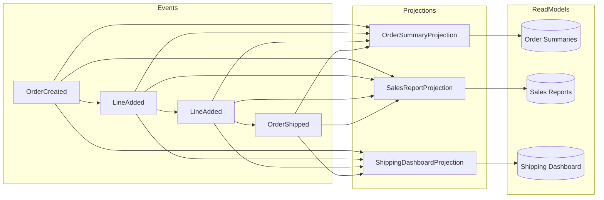
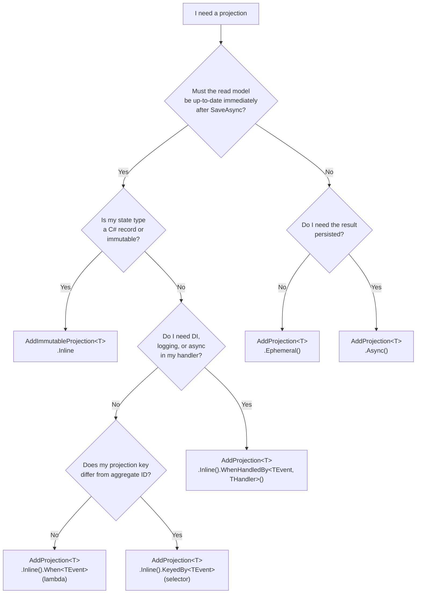
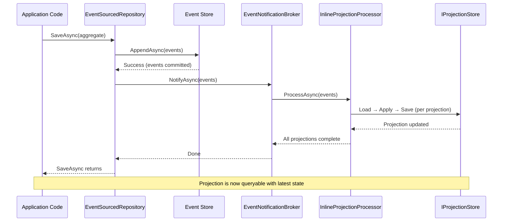
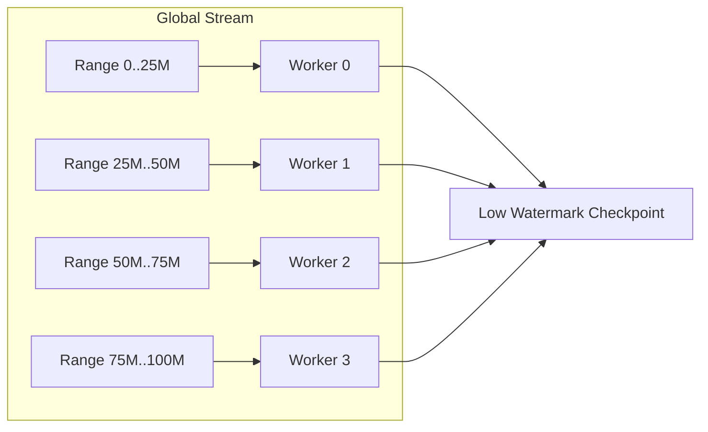

# Projections

Projections transform event streams into read-optimized views (read models) for queries.

## Before You Start

- **.NET 10.0**
- Install the required packages:
  ```bash
  dotnet add package Excalibur.EventSourcing
  ```
- Familiarity with [event stores](./event-store.md) and [domain events](./domain-events.md)

## Overview


```mermaid
flowchart LR
    subgraph Events
        E1[OrderCreated] --> E2[LineAdded]
        E2 --> E3[LineAdded]
        E3 --> E4[OrderShipped]
    end

    subgraph Projections
        E1 & E2 & E3 & E4 --> P1[OrderSummaryProjection]
        E1 & E2 & E3 & E4 --> P2[SalesReportProjection]
        E1 & E2 & E3 & E4 --> P3[ShippingDashboardProjection]
    end

    subgraph ReadModels
        P1 --> R1[(Order Summaries)]
        P2 --> R2[(Sales Reports)]
        P3 --> R3[(Shipping Dashboard)]
    end
```

## Choosing the Right Approach

Excalibur offers several projection approaches. Use this decision tree to pick the right one:


```mermaid
flowchart TD
    START[I need a projection] --> Q1{Must the read model<br/>be up-to-date immediately<br/>after SaveAsync?}

    Q1 -->|Yes| Q2{Is my state type<br/>a C# record or<br/>immutable?}
    Q1 -->|No| Q3{Do I need the result<br/>persisted?}

    Q2 -->|Yes| IMMUTABLE[AddImmutableProjection&lt;T&gt;<br/>.Inline]
    Q2 -->|No| Q4{Do I need DI,<br/>logging, or async<br/>in my handler?}

    Q4 -->|No| Q5{Does my projection key<br/>differ from aggregate ID?}
    Q4 -->|Yes| INLINE_DI["AddProjection&lt;T&gt;<br/>.Inline().WhenHandledBy&lt;TEvent, THandler&gt;()"]

    Q5 -->|No| INLINE_LAMBDA["AddProjection&lt;T&gt;<br/>.Inline().When&lt;TEvent&gt;(lambda)"]
    Q5 -->|Yes| INLINE_KEYED["AddProjection&lt;T&gt;<br/>.Inline().KeyedBy&lt;TEvent&gt;(selector)"]

    Q3 -->|No| EPHEMERAL["AddProjection&lt;T&gt;<br/>.Ephemeral()"]
    Q3 -->|Yes| ASYNC["AddProjection&lt;T&gt;<br/>.Async()"]
```

### Quick Comparison

| Approach | Consistency | State Type | DI Support | Best For |
|----------|------------|------------|------------|----------|
| **Inline lambda** | Immediate | Mutable class | No | Simple property mapping |
| **Inline + KeyedBy** | Immediate | Mutable class | No | Multi-stream aggregation (category, tenant) |
| **Inline DI handler** | Immediate | Mutable class | Yes | Complex logic, logging |
| **Inline immutable** | Immediate | Records, immutable | Yes | Functional patterns, audit trails |
| **Async** | Eventual | Any | Yes | Reporting, search indexes |
| **Ephemeral** | On-demand | Any | No | Debugging, ad-hoc queries |

---

## Quick Start: IProjectionConfiguration&lt;T&gt; (Recommended)

The preferred approach for organizing projections. Each projection gets its own configuration class, discovered automatically via assembly scanning:

```csharp
// 1. Define your projection configuration class
public class OrderSummaryProjectionConfig : IProjectionConfiguration<OrderSummary>
{
    public void Configure(IProjectionBuilder<OrderSummary> builder)
    {
        builder.Inline()
            .When<OrderPlaced>((proj, e) =>
            {
                proj.Status = "Placed";
                proj.Total = e.Total;
                proj.CreatedAt = e.OccurredAt;
            })
            .When<OrderShipped>((proj, e) =>
            {
                proj.Status = "Shipped";
                proj.ShippedAt = e.ShippedAt;
            });
    }
}

// 2. Register all projections via assembly scanning
services.AddExcalibur(excalibur => excalibur.AddEventSourcing(builder =>
{
    builder.AddAggregate<OrderAggregate>(agg => agg.UseInMemoryStore());
    builder.AddProjectionsFromAssembly(typeof(OrderSummary).Assembly);
}));
```

After `SaveAsync`, the read model is immediately consistent:

```csharp
await repository.SaveAsync(order, cancellationToken);
var summary = await projectionStore.GetByIdAsync(order.Id, cancellationToken);
// summary.Status == "Placed" -- guaranteed, not eventual
```

### Why IProjectionConfiguration&lt;T&gt;?

| Benefit | Description |
|---------|-------------|
| **Organized** | Each projection lives in its own file, easy to navigate |
| **Testable** | Configuration classes can be unit-tested in isolation |
| **Discoverable** | Assembly scanning finds all projections automatically |
| **Scalable** | No single giant DI registration block as projections grow |

:::warning AOT Compatibility

`AddProjectionsFromAssembly` uses reflection and is annotated with `[RequiresUnreferencedCode]`. For AOT/trimming scenarios, use explicit `AddProjection<T>()` calls with inline lambdas instead.
:::

---

## Quick Start: Inline Lambda (Alternative)

For simple cases or AOT scenarios, register projections directly with inline lambdas:

```csharp
services.AddExcalibur(excalibur => excalibur.AddEventSourcing(builder =>
{
    builder.AddAggregate<OrderAggregate>(agg => agg.UseInMemoryStore());

    builder.AddProjection<OrderSummary>(p => p
        .Inline()
        .When<OrderPlaced>((proj, e) =>
        {
            proj.Status = "Placed";
            proj.Total = e.Total;
            proj.CreatedAt = e.OccurredAt;
        })
        .When<OrderShipped>((proj, e) =>
        {
            proj.Status = "Shipped";
            proj.ShippedAt = e.ShippedAt;
        }));
}));
```

This approach is best for:
- Small projects with few projections
- AOT/trimming scenarios where reflection is unavailable
- Quick prototyping

---

## Inline Projections (Mutable)

Inline projections run during `SaveAsync()` and guarantee read-after-write consistency. The projection type must be a mutable class with a parameterless constructor (`new()` constraint).

### Lambda Handlers (Tier 1)

Zero-allocation, zero-DI. Best for simple property mapping:

```csharp
builder.AddProjection<OrderSummary>(p => p
    .Inline()
    .When<OrderPlaced>((proj, e) => { proj.Status = "Placed"; proj.Total = e.Total; })
    .When<OrderShipped>((proj, e) => { proj.Status = "Shipped"; }));
```

### Multi-Stream Projections (KeyedBy)

By default, inline projections are keyed by aggregate ID -- each aggregate gets its own projection instance. Use `KeyedBy<TEvent>()` to derive the projection key from event data instead, enabling projections that aggregate across multiple streams:

```csharp
builder.AddProjection<CategorySummaryProjection>(p => p
    .Inline()
    .KeyedBy<ProductCreated>(e => e.Category.ToUpperInvariant())
    .KeyedBy<ProductPriceChanged>(e => e.Category.ToUpperInvariant())
    .KeyedBy<ProductStockAdded>(e => e.Category.ToUpperInvariant())
    .When<ProductCreated>((proj, e) =>
    {
        proj.CategoryName = e.Category;
        proj.TotalProducts++;
        proj.ActiveProducts++;
    })
    .When<ProductPriceChanged>((proj, e) =>
    {
        proj.ProductPrices[e.ProductId.ToString()] = e.NewPrice;
    })
    .When<ProductStockAdded>((proj, e) =>
    {
        proj.ProductStocks[e.ProductId.ToString()] = e.NewStockLevel;
    }));
```

All products in "Electronics" share one `CategorySummaryProjection` instance, automatically loaded and saved during `SaveAsync()`. No manual handler classes or `GetUncommittedEvents()` loops needed.

**Key rules:**

- Register a `KeyedBy` selector for every event type that should route to a custom key. Events without a selector fall back to aggregate ID.
- The key selector must return a non-null, non-empty string.
- Events must carry the data needed for key derivation (e.g., a `Category` property on the event record).
- `KeyedBy` works with both `When<T>` lambdas and `WhenHandledBy<T, THandler>` DI handlers.

:::tip When to use KeyedBy vs OverrideProjectionId

Use `KeyedBy` when the key can be derived purely from event data -- it works with all handler tiers and keeps registration declarative. Use `OverrideProjectionId` (Tier 3 only) when the key requires DI services, async lookups, or runtime logic beyond the event.
:::

### DI-Resolved Handlers (Tier 3)

When your projection logic needs dependency injection, async operations, or custom projection IDs, implement `IProjectionEventHandler<TProjection, TEvent>`:

```csharp
public sealed class CustomerCreatedHandler
    : IProjectionEventHandler<CustomerSearchProjection, CustomerCreated>
{
    private readonly ILogger<CustomerCreatedHandler> _logger;

    public CustomerCreatedHandler(ILogger<CustomerCreatedHandler> logger)
        => _logger = logger;

    public Task HandleAsync(
        CustomerSearchProjection projection,
        CustomerCreated @event,
        ProjectionHandlerContext context,
        CancellationToken cancellationToken)
    {
        projection.Name = @event.Name;
        projection.Email = @event.Email;
        projection.IsActive = true;
        _logger.LogDebug("Projected customer {Id}", context.AggregateId);
        return Task.CompletedTask;
    }
}
```

Register with `WhenHandledBy`. You can mix lambdas and DI handlers in the same projection:

```csharp
builder.AddProjection<CustomerSearchProjection>(p => p
    .Inline()
    .WhenHandledBy<CustomerCreated, CustomerCreatedHandler>()
    .WhenHandledBy<CustomerOrderPlaced, CustomerOrderPlacedHandler>()
    .When<CustomerDeactivated>((proj, e) => { proj.IsActive = false; }));
```

`WhenHandledBy` auto-registers the handler in DI as `Transient` -- no manual `services.AddTransient<THandler>()` needed.

### Assembly Scanning

For projects with many handlers, scan an assembly to auto-discover all `IProjectionEventHandler<T, TEvent>` implementations:

```csharp
builder.AddProjection<CustomerSearchProjection>(p => p
    .Inline()
    .AddProjectionHandlersFromAssembly(typeof(CustomerCreatedHandler).Assembly));
```

:::warning AOT Compatibility

Assembly scanning uses reflection and is annotated with `[RequiresUnreferencedCode]`. For AOT/trimming scenarios, use explicit `WhenHandledBy<TEvent, THandler>()` instead.
:::

### Custom Projection IDs (OverrideProjectionId)

For Tier 3 DI handlers, `OverrideProjectionId` provides an escape hatch when the key cannot be derived from event data alone. Prefer [`KeyedBy`](#multi-stream-projections-keyedby) for most multi-stream scenarios.

```csharp
public sealed class TierSummaryOnCustomerCreated
    : IProjectionEventHandler<TierSummaryProjection, CustomerCreated>
{
    public Task HandleAsync(
        TierSummaryProjection projection,
        CustomerCreated @event,
        ProjectionHandlerContext context,
        CancellationToken cancellationToken)
    {
        context.OverrideProjectionId = "Bronze"; // Key by tier, not aggregate
        projection.CustomerCount++;
        return Task.CompletedTask;
    }
}
```

### ProjectionHandlerContext

Every DI handler receives aggregate metadata:

```csharp
public sealed class ProjectionHandlerContext
{
    public string AggregateId { get; }
    public string AggregateType { get; }
    public long CommittedVersion { get; }
    public DateTimeOffset Timestamp { get; }
    public string? OverrideProjectionId { get; set; }
}
```

### Handler Tier Comparison

| Tier | API | DI | Async | Custom ID | AOT-Safe | Best For |
|------|-----|-----|-------|-----------|----------|----------|
| 2 | **`IProjectionConfiguration<T>`** (recommended) | No | No | Via `KeyedBy` | No (reflection) | Organized, scalable projection definitions |
| 1 | `When<TEvent>(lambda)` | No | No | Via `KeyedBy` | Yes | Simple property mapping, AOT scenarios |
| 3 | `WhenHandledBy<TEvent, THandler>()` | Yes | Yes | `KeyedBy` + `OverrideProjectionId` | Yes | Complex logic, logging, cross-aggregate |

### Performance

| Scenario | Overhead per Event | Allocation |
|----------|-------------------|------------|
| `When<T>` lambda (Tier 1) | Baseline | Zero |
| `WhenHandledBy` singleton handler | ~20-50ns (`GetRequiredService`) | Zero |
| `WhenHandledBy` transient handler | ~20-50ns + constructor | Handler instance |

When all handlers in a projection are Tier 1 lambdas and no `KeyedBy` selectors are registered, the pipeline uses a zero-allocation fast path. Adding `KeyedBy` selectors or any Tier 3 handler activates the multi-ID code path with `Dictionary<string, TProjection>` tracking.

### Read-After-Write Consistency Guarantee

Inline projections provide a **read-after-write consistency guarantee**: after `SaveAsync()` returns, any query against the projection store will reflect all events just committed. This is the strongest consistency model available in Excalibur's projection system.

#### How It Works


```mermaid
sequenceDiagram
    participant App as Application Code
    participant Repo as EventSourcedRepository
    participant ES as Event Store
    participant Broker as EventNotificationBroker
    participant IP as InlineProjectionProcessor
    participant PS as IProjectionStore

    App->>Repo: SaveAsync(aggregate)
    Repo->>ES: AppendAsync(events)
    ES-->>Repo: Success (events committed)
    Repo->>Broker: NotifyAsync(events)
    Broker->>IP: ProcessAsync(events)
    IP->>PS: Load → Apply → Save (per projection)
    PS-->>IP: Projection updated
    IP-->>Broker: All projections complete
    Broker-->>Repo: Done
    Repo-->>App: SaveAsync returns
    Note over App,PS: Projection is now queryable with latest state
```

#### Execution Semantics

| Aspect | Behavior |
|--------|----------|
| **Timing** | Projections update *after* events are committed but *before* `SaveAsync` returns to the caller |
| **Concurrency** | Multiple projection types run concurrently via `Task.WhenAll` (R27.20) |
| **Event ordering** | Events are applied sequentially within each projection type |
| **Failure policy** | Configurable: `Propagate` (throw to caller) or `LogAndContinue` (best-effort) |
| **Partial failure** | If one projection fails, others still commit — only the failed projection needs recovery |

#### When to Rely on This Guarantee

```csharp
// After SaveAsync returns, the OrderSummary projection is up-to-date
await repository.SaveAsync(order, cancellationToken);

// This query reflects the events just committed ✓
var summary = await projectionStore.GetAsync<OrderSummary>(
    order.Id.ToString(), cancellationToken);

// summary.Status is guaranteed to reflect the latest event
```

:::warning Failure Policy Matters

The read-after-write guarantee holds only when using `NotificationFailurePolicy.Propagate` (the default). If you configure `LogAndContinue`, projection updates become best-effort — `SaveAsync` returns successfully even if a projection update fails.

```csharp
services.Configure<EventNotificationOptions>(opts =>
    opts.FailurePolicy = NotificationFailurePolicy.Propagate); // Default — guarantees consistency
```

:::

#### Comparison with Other Modes

| Mode | Consistency | Trade-off |
|------|------------|-----------|
| **Inline** | Read-after-write | Adds latency to `SaveAsync` (projection I/O) |
| **Async** | Eventually consistent | No latency impact on writes; background catch-up |
| **Ephemeral** | On-demand rebuild | No persistence; rebuilt from full event stream |

Choose inline when your application reads the projection immediately after writing (e.g., returning updated state in an API response). Choose async when projection latency is acceptable and write throughput is prioritized.

### IProjectionBuilder&lt;T&gt; API Reference

| Method | Description |
|--------|-------------|
| `.Inline()` | Run during `SaveAsync()` for immediate consistency |
| `.Async()` | Run via background host (default if neither is called) |
| `.Ephemeral()` | Build on-demand, no persistence |
| `.When<TEvent>(Action<TProjection, TEvent>)` | Register a synchronous event handler (Tier 1) |
| `.WhenHandledBy<TEvent, THandler>()` | Register a DI-resolved async event handler (Tier 3) |
| `.KeyedBy<TEvent>(Func<TEvent, string>)` | Derive projection ID from event data (multi-stream) |
| `.AddProjectionHandlersFromAssembly(Assembly)` | Discover handlers via assembly scanning |
| `.WithCacheTtl(TimeSpan)` | Optional caching for ephemeral projection results |
| `.WithSearchText(Func, Action)` | Automatic computed search text field ([details](#automatic-search-text)) |
| `.WithOptions(Action<ProjectionOptions>)` | Per-projection options (warning thresholds) |
| `.WithStore<TStore>()` | Override the default DI-resolved projection store |
| `.WhenDeleted(Func<string, CancellationToken, Task>)` | Handle aggregate deletion |

:::tip

A second `AddProjection<T>()` call for the same projection type **replaces** the first registration. This is useful for testing and conditional reconfiguration.
:::

---

## Automatic Search Text

Use `WithSearchText` to compute a denormalized search field automatically whenever the projection is updated. This is ideal for full-text search without requiring provider-specific search APIs:

```csharp
builder.AddProjection<OrderSummary>(p => p
    .Inline()
    .WithSearchText(
        proj => $"{proj.CustomerName} {proj.OrderNumber} {proj.Status}",
        (proj, text) => proj.SearchText = text)
    .When<OrderPlaced>((proj, e) =>
    {
        proj.CustomerName = e.CustomerName;
        proj.OrderNumber = e.OrderNumber;
        proj.Status = "Placed";
    })
    .When<OrderShipped>((proj, e) =>
    {
        proj.Status = "Shipped";
    }));
```

Your projection type needs a `SearchText` property to receive the computed value:

```csharp
public class OrderSummary
{
    public string CustomerName { get; set; } = "";
    public string OrderNumber { get; set; } = "";
    public string Status { get; set; } = "";
    public string SearchText { get; set; } = "";
}
```

Then query using the standard `:contains` filter:

```csharp
var filters = new ProjectionFilterBuilder()
    .Where("SearchText").Contains("john")
    .Build();

var results = await projectionStore.QueryAsync(filters, null, cancellationToken);
```

### How It Works

| Aspect | Behavior |
|--------|----------|
| **Timing** | Computed **once per upsert** — after all events in the batch are applied, before the store saves |
| **Scope** | Per projection instance — multi-stream projections (via `KeyedBy`) compute search text for each instance independently |
| **Zero overhead** | Projections without `WithSearchText` have no performance impact |
| **AOT-safe** | Dual-delegate approach avoids reflection — fully compatible with Native AOT |
| **Null/empty** | If the compute function returns `null` or empty, the setter receives an empty string |

### When to Use

| Scenario | Approach |
|----------|----------|
| Simple substring search across multiple fields | **WithSearchText** — concatenate fields, query with `:contains` |
| Full-text search with relevance scoring, fuzzy matching, stemming | [Custom repository](#custom-repositories) with native provider API |
| Single-field substring search | `:contains` filter directly — no `WithSearchText` needed |

:::tip WithSearchText vs Multi-Field Contains

`WithSearchText` computes a single searchable field at write time, making reads fast (one field to search). The [multi-field `:contains` pattern](#multi-field-text-search-pattern) searches multiple fields at query time. Choose `WithSearchText` when you search frequently and want indexed performance; choose multi-field `:contains` for ad-hoc queries without schema changes.
:::

---

## Immutable Projections

For projections backed by C# records or other immutable types, use `AddImmutableProjection<T>()`. Unlike `AddProjection<T>()`, this builder has **no `new()` constraint** -- it uses factory and reducer patterns instead of in-place mutation:

```csharp
public record OrderSummaryRecord(
    string OrderId,
    decimal Total,
    string Status,
    DateTimeOffset? ShippedAt = null);

services.AddExcalibur(excalibur => excalibur.AddEventSourcing(builder =>
{
    builder.AddImmutableProjection<OrderSummaryRecord>(p => p
        .Inline()
        .WhenCreating<OrderPlaced>(e =>
            new OrderSummaryRecord(e.AggregateId, e.Amount, "Placed"))
        .WhenTransforming<OrderShipped>((proj, e) =>
            proj with { Status = "Shipped", ShippedAt = e.ShippedAt }));
}));
```

### WhenCreating vs WhenTransforming

| Handler | Input | Output | Use Case |
|---------|-------|--------|----------|
| `WhenCreating<TEvent>(Func<TEvent, T>)` | Event only | New projection | First event that initializes the projection |
| `WhenTransforming<TEvent>(Func<T, TEvent, T>)` | Current state + Event | New projection | Subsequent events that evolve state |

**Null-current semantics:**

| Current State | Handler Type | Behavior |
|---------------|-------------|----------|
| `null` | `WhenCreating` | Factory creates new instance |
| `null` | `WhenTransforming` | Throws `InvalidOperationException` |
| non-null | `WhenTransforming` | Reducer produces new instance |
| non-null | `WhenCreating` | Factory replaces (last-wins) |

:::warning

If the first event for a projection ID uses `WhenTransforming` without a prior `WhenCreating` event, the pipeline throws `InvalidOperationException`. Always register a `WhenCreating` handler for the event that initializes the projection.
:::

### Custom Projection IDs (Multi-ID)

Lambda handlers (`WhenCreating`, `WhenTransforming`) always key the projection by aggregate ID. They do **not** support `OverrideProjectionId` or `KeyedBy` because the immutable projection builder has a different handler model.

If you need to key an immutable projection by something other than aggregate ID (e.g., by customer, by region, by tier), use a DI-resolved handler via `WhenHandledBy`:

```csharp
public sealed class RegionSummaryOnOrderPlaced
    : IImmutableProjectionHandler<RegionSummaryRecord, OrderPlaced>
{
    public Task<RegionSummaryRecord> TransformAsync(
        RegionSummaryRecord? current,
        OrderPlaced @event,
        ProjectionHandlerContext context,
        CancellationToken cancellationToken)
    {
        context.OverrideProjectionId = @event.Region; // Key by region, not aggregate
        var record = current ?? new RegionSummaryRecord(@event.Region, 0, 0m);
        return Task.FromResult(record with
        {
            OrderCount = record.OrderCount + 1,
            TotalRevenue = record.TotalRevenue + @event.Amount
        });
    }
}

builder.AddImmutableProjection<RegionSummaryRecord>(p => p
    .Inline()
    .WhenHandledBy<OrderPlaced, RegionSummaryOnOrderPlaced>());
```

:::note Multi-ID Summary

| Handler Type | Custom Projection ID | Reason |
|---|---|---|
| `WhenCreating` / `WhenTransforming` (lambdas) | Not supported | No `ProjectionHandlerContext` in lambda signature |
| `WhenHandledBy` (DI handler) | Supported via `context.OverrideProjectionId` | Handler receives full context |

This is a deliberate design decision (Q2) to keep lambda signatures simple. If you need multi-ID, use `WhenHandledBy`.
:::

### DI-Resolved Immutable Handlers

For complex transforms that need DI, implement `IImmutableProjectionHandler<TProjection, TEvent>`. This interface **returns a new instance** instead of mutating:

```csharp
public interface IImmutableProjectionHandler<TProjection, in TEvent>
    where TProjection : class
    where TEvent : IDomainEvent
{
    Task<TProjection> TransformAsync(
        TProjection? current,     // null on first event
        TEvent @event,
        ProjectionHandlerContext context,
        CancellationToken cancellationToken);
}
```

Register with `WhenHandledBy`:

```csharp
builder.AddImmutableProjection<CustomerRecord>(p => p
    .Inline()
    .WhenHandledBy<CustomerCreated, CustomerCreatedImmutableHandler>()
    .WhenTransforming<CustomerDeactivated>((proj, e) =>
        proj with { IsActive = false }));
```

Assembly scanning is also supported:

```csharp
builder.AddImmutableProjection<CustomerRecord>(p => p
    .Inline()
    .AddImmutableProjectionHandlersFromAssembly(typeof(CustomerCreatedImmutableHandler).Assembly));
```

### IImmutableProjectionBuilder&lt;T&gt; API Reference

| Method | Description |
|--------|-------------|
| `.Inline()` | Run during `SaveAsync()` |
| `.Async()` | Run via background host (default) |
| `.WhenCreating<TEvent>(Func<TEvent, T>)` | Factory: event -> new projection |
| `.WhenTransforming<TEvent>(Func<T, TEvent, T>)` | Reducer: (current, event) -> new projection |
| `.WhenHandledBy<TEvent, THandler>()` | DI-resolved immutable handler |
| `.AddImmutableProjectionHandlersFromAssembly(Assembly)` | Assembly scanning |
| `.WithCacheTtl(TimeSpan)` | Optional caching for ephemeral results |

### When to Use Immutable vs Mutable

| Factor | `AddProjection<T>()` (Mutable) | `AddImmutableProjection<T>()` (Immutable) |
|--------|-------------------------------|------------------------------------------|
| State type | `class` with `new()` | Any `class` (records, init-only) |
| Handler pattern | Mutate in-place | Return new instance |
| Thread safety | Projection locked per batch | Naturally thread-safe (no shared mutation) |
| Best for | Simple POCO read models | C# records, audit trails, versioned state |

---

## Async Projections

Async projections are updated in the background, eventually consistent with the event stream. Use them for reporting, search indexes, and read models that don't need immediate consistency.

```csharp
builder.AddProjection<OrderSearchIndex>(p => p
    .Async()
    .When<OrderPlaced>((proj, e) => { /* index update */ }));
```

### Enabling the Background Host

Async projections require a background host to poll the global event stream and dispatch events. Register it with `EnableProjectionProcessing()`:

```csharp
services.AddExcalibur(excalibur => excalibur.AddEventSourcing(builder =>
{
    builder.UseSqlServer(sql => sql.ConnectionString(connStr));

    builder.AddProjection<OrderSearchIndex>(p => p
        .Async()
        .When<OrderPlaced>((proj, e) => { /* index update */ }));

    // Start the background host that processes async projections
    builder.EnableProjectionProcessing(opts =>
    {
        opts.IdlePollingInterval = TimeSpan.FromSeconds(2);
        opts.BatchSize = 200;
    });
}));
```

`EnableProjectionProcessing()` registers:
- A hosted service (`AsyncProjectionProcessingHost`) that polls the global stream via `IGlobalStreamQuery`
- An in-memory checkpoint store as fallback (providers like SQL Server register durable implementations that take precedence)
- `ValidateOnStart` for `GlobalStreamProjectionOptions`

If no `IGlobalStreamQuery` implementation is registered (e.g., the event store provider doesn't support it), the host logs a warning and exits gracefully.

| Option | Default | Description |
|--------|---------|-------------|
| `IdlePollingInterval` | 1 second | Delay between polls when no new events are found |
| `BatchSize` | 500 | Maximum events read per batch |
| `CheckpointInterval` | 100 | Events between checkpoint saves |
| `ProjectionName` | `"AsyncProjectionProcessingHost"` | Unique name for checkpoint tracking (must differ per host instance) |

Async projections are processed by `AsyncProjectionProcessingHost` using checkpoint-based delivery. For CDC-based processing, see [CDC Pattern](../patterns/cdc.md).

### Parallel Catch-Up

When catching up from position 0 on a large global stream (100B+ events), sequential processing would take years. Enable parallel catch-up to split the stream into ranges and process them concurrently:

```csharp
services.AddExcalibur(excalibur => excalibur.AddEventSourcing(builder =>
{
    builder.UseParallelCatchUp(opts =>
    {
        opts.Strategy = CatchUpStrategy.RangePartitioned;
        opts.WorkerCount = Environment.ProcessorCount;
        opts.BatchSize = 1000;
        opts.CheckpointInterval = 5000;
    });
}));
```

The infrastructure:

1. **Partitions** the global stream into position ranges via `IGlobalStreamPartitioner`
2. **Spawns** one worker per range
3. **Checkpoints** each worker independently
4. **Merges** cursors using a low-watermark strategy (global position = minimum of all worker checkpoints)


```mermaid
flowchart LR
    subgraph Global Stream
        R1["Range 0..25M"] --> W1[Worker 0]
        R2["Range 25M..50M"] --> W2[Worker 1]
        R3["Range 50M..75M"] --> W3[Worker 2]
        R4["Range 75M..100M"] --> W4[Worker 3]
    end

    W1 & W2 & W3 & W4 --> CP[Low Watermark Checkpoint]
```

| Option | Default | Description |
|--------|---------|-------------|
| `Strategy` | `Sequential` | `Sequential`, `RangePartitioned`, or `PerShard` |
| `WorkerCount` | `ProcessorCount` | Number of parallel workers |
| `BatchSize` | 1000 | Events per batch read |
| `CheckpointInterval` | 5000 | Events between checkpoints |
| `MaxRetries` | 3 | Retry attempts for failed workers |
| `WorkerHeartbeatTimeout` | 60s | Timeout for detecting hung workers |

Parallel processing activates only during catch-up. Once caught up, the host automatically switches to sequential single-worker processing for lower latency.

**Provider support:** SQL Server (indexed `GlobalPosition` range queries). PostgreSQL planned for Phase 2. Providers without range query support fall back to sequential automatically.

:::note Idempotency Requirement

Projections used with parallel catch-up **must** handle duplicate events, since range boundaries may overlap slightly.
:::

---

## Ephemeral Projections

Ephemeral projections build a read model on-demand by replaying events **without persisting** the result. Useful for debugging, ad-hoc queries, and audit trails:

```csharp
builder.AddProjection<OrderAuditTrail>(p => p
    .Ephemeral()
    .When<OrderPlaced>((proj, e) => { proj.Events.Add($"Placed: {e.Total}"); })
    .When<OrderShipped>((proj, e) => { proj.Events.Add($"Shipped: {e.ShippedAt}"); }));
```

```csharp
var engine = serviceProvider.GetRequiredService<IEphemeralProjectionEngine>();
var auditTrail = await engine.BuildAsync<OrderAuditTrail>(
    orderId, "OrderAggregate", cancellationToken);
```

Key characteristics:
- Uses the **same `When<T>` handlers** as inline and async projections
- Returns a **fresh instance** on every call (no shared mutable state)
- **Never invoked** by the notification broker -- consumer-initiated only
- Optional caching via `IDistributedCache` when configured with `.WithCacheTtl()`

---

## Projection Stores

### IProjectionStore&lt;T&gt;

The standard storage interface for all projection backends:

```csharp
public interface IProjectionStore<TProjection> where TProjection : class
{
    Task<TProjection?> GetByIdAsync(string id, CancellationToken cancellationToken);
    Task UpsertAsync(string id, TProjection projection, CancellationToken cancellationToken);
    Task DeleteAsync(string id, CancellationToken cancellationToken);
    Task<IReadOnlyList<TProjection>> QueryAsync(
        IDictionary<string, object>? filters,
        QueryOptions? options,
        CancellationToken cancellationToken);
    Task<long> CountAsync(IDictionary<string, object>? filters, CancellationToken cancellationToken);
}
```

### Registering Store Backends

```csharp
// SQL Server
services.AddSqlServerProjections(sqlConnectionString, projections =>
{
    projections.Add<OrderSummary>(o => o.TableName = "OrderSummaries");
});

// PostgreSQL
services.AddPostgresProjections(pgConnectionString, projections =>
{
    projections.Add<OrderSummary>(o => o.TableName = "order_summaries");
});

// ElasticSearch
services.AddElasticSearchProjections("https://es.example.com:9200", projections =>
{
    projections.Add<OrderSummary>();
    projections.Add<CustomerProfile>(o => o.IndexName = "customers");
});
// Tip: Implement IElasticIndexConfiguration<T> on your projection class
// for explicit field mappings (full-text search, keyword vs text, etc.).
// See Elasticsearch Provider > Index Field Mappings for details.

// MongoDB
services.AddMongoDbProjections(mongoConnectionString, "projections", projections =>
{
    projections.Add<OrderSummary>();
});

// CosmosDB
services.AddCosmosDbProjections(cosmosConnectionString, "projections", projections =>
{
    projections.Add<OrderSummary>();
});
```

### Querying Read Models

`IProjectionStore<T>` supports dictionary-based filters with operator suffixes:

```csharp
var results = await projectionStore.QueryAsync(
    new Dictionary<string, object>
    {
        ["CustomerId"] = customerId,
        ["Status:neq"] = "Deleted",
        ["TotalAmount:gte"] = 100m
    },
    new QueryOptions { Skip = 0, Take = 25, SortBy = "CreatedAt", SortDescending = true },
    cancellationToken);

var summary = await projectionStore.GetByIdAsync(orderId.ToString(), cancellationToken);
```

For most use cases, `IProjectionStore<T>` is all you need. Graduate to a custom repository only when you need backend-native features (full-text search, aggregations, SQL joins).

### Type-Safe Filters with ProjectionFilterBuilder

Instead of constructing filter dictionaries with magic string operators, use `ProjectionFilterBuilder` for compile-time safety:

```csharp
using Excalibur.EventSourcing.Abstractions;

var filters = new ProjectionFilterBuilder()
    .Where("CustomerId").EqualTo(customerId)
    .Where("Status").NotEqualTo("Deleted")
    .Where("TotalAmount").GreaterThanOrEqual(100m)
    .Where("Category").In(new[] { "Electronics", "Books" })
    .Where("Name").Contains("search term")
    .Build();

var results = await projectionStore.QueryAsync(filters, queryOptions, cancellationToken);
```

The builder supports all filter operators:

| Method | Operator Suffix | Example |
|--------|----------------|---------|
| `EqualTo(value)` | *(none)* | `["Status"] = "Active"` |
| `NotEqualTo(value)` | `:neq` | `["Status:neq"] = "Deleted"` |
| `GreaterThan(value)` | `:gt` | `["Amount:gt"] = 100` |
| `GreaterThanOrEqual(value)` | `:gte` | `["Amount:gte"] = 100` |
| `LessThan(value)` | `:lt` | `["Amount:lt"] = 1000` |
| `LessThanOrEqual(value)` | `:lte` | `["Amount:lte"] = 1000` |
| `In(values)` | `:in` | `["Category:in"] = ["A", "B"]` |
| `Contains(value)` | `:contains` | `["Name:contains"] = "search"` |

`Build()` returns a new `IDictionary<string, object>` each time — the builder is reusable and mutations to the returned dictionary do not affect the builder state.

### Multi-Field Search and OR Patterns

The standard filter API uses **AND semantics** — all conditions must match. For OR-style queries and multi-field text search, use these patterns:

#### Single-Field Text Search (Contains)

Use the `:contains` operator for substring matching on a single field:

```csharp
var filters = new ProjectionFilterBuilder()
    .Where("Name").Contains("search term")
    .Build();

var results = await projectionStore.QueryAsync(filters, null, cancellationToken);
```

#### Multi-Field Text Search Pattern

To search across multiple fields (e.g., search by name OR email OR phone), apply the same `:contains` filter to each field you want to search. Providers interpret multiple `:contains` filters as an OR condition across those fields:

```csharp
// Search across Name, Email, and Phone — matches if ANY field contains the term
var searchTerm = "john";
var filters = new Dictionary<string, object>
{
    ["Name:contains"] = searchTerm,
    ["Email:contains"] = searchTerm,
    ["Phone:contains"] = searchTerm
};

var results = await projectionStore.QueryAsync(filters, queryOptions, cancellationToken);
```

:::tip Provider-Specific Behavior

How multi-field `:contains` is implemented depends on the store provider:

| Provider | Implementation |
|----------|---------------|
| **ElasticSearch** | `multi_match` query across specified fields |
| **SQL Server** | `WHERE Name LIKE @p OR Email LIKE @p OR Phone LIKE @p` |
| **MongoDB** | `$or` with `$regex` per field |
| **CosmosDB** | `CONTAINS(c.Name, @p) OR CONTAINS(c.Email, @p)` |

For full-text search with relevance scoring, stemming, and fuzzy matching, consider a [custom repository](./projections.md#custom-repositories) using your provider's native search API (e.g., ElasticSearch `multi_match` with `fuzziness`).
:::

#### Combining Search with Filters (AND + OR)

Combine text search with standard equality/range filters. Non-`:contains` filters use AND semantics as usual:

```csharp
var filters = new ProjectionFilterBuilder()
    .Where("Status").EqualTo("Active")           // AND: must be active
    .Where("Region").In(new[] { "US", "EU" })    // AND: must be in US or EU
    .Where("Name").Contains("search term")       // text search within filtered set
    .Build();

var results = await projectionStore.QueryAsync(filters, queryOptions, cancellationToken);
```

#### When to Use Custom Repositories Instead

Graduate to a custom repository when you need:

- **Relevance scoring** — rank results by match quality
- **Fuzzy matching** — handle typos and misspellings
- **Stemming** — match "running" when searching "run"
- **Aggregations** — faceted search with count-per-category
- **Highlighting** — show which parts of the text matched

See [Custom Repositories](#custom-repositories) for ElasticSearch and SQL Server examples.

### Paginated Queries

For UI-facing scenarios that need pagination metadata, check if your store supports the `IPageableProjectionStore<T>` or `ICursorProjectionStore<T>` sub-interfaces via pattern matching:

#### Offset-Based Pagination (IPageableProjectionStore)

```csharp
if (projectionStore is IPageableProjectionStore<OrderSummary> pagedStore)
{
    var page = await pagedStore.QueryPagedAsync(
        filters,
        pageNumber: 1,
        pageSize: 25,
        options: new QueryOptions { SortBy = "CreatedAt", SortDescending = true },
        cancellationToken);

    // page.Items — the current page of results
    // page.TotalItems — total matching records
    // page.TotalPages — computed from TotalItems / pageSize
    // page.HasNextPage — whether more pages exist
}
```

Best for: traditional table UIs with page numbers, small-to-medium datasets, jump-to-page-N navigation.

#### Cursor-Based Pagination (ICursorProjectionStore)

```csharp
if (projectionStore is ICursorProjectionStore<OrderSummary> cursorStore)
{
    // First page
    var firstPage = await cursorStore.QueryCursorAsync(
        filters,
        cursor: null,    // null = start from beginning
        pageSize: 25,
        cancellationToken);

    // Subsequent pages — pass the opaque cursor from the previous result
    if (firstPage.HasMore)
    {
        var nextPage = await cursorStore.QueryCursorAsync(
            filters,
            cursor: firstPage.NextCursor,
            pageSize: 25,
            cancellationToken);
    }
}
```

Best for: infinite scroll UIs, large datasets, Elasticsearch (avoids the 10K `max_result_window` limit), DynamoDB and CosmosDB (natively cursor-based).

:::tip Choosing Between Offset and Cursor

Use **offset** (`IPageableProjectionStore`) when users need to jump to arbitrary page numbers (e.g., "go to page 5"). Use **cursor** (`ICursorProjectionStore`) when scrolling forward through large result sets — it provides stable results under concurrent writes and better performance on large datasets.

Both sub-interfaces follow the `IBufferDistributedCache` ISP precedent — providers implement them only when they can offer an optimized implementation.
:::

#### Optimistic Concurrency (IVersionedProjectionStore)

When consumers need to read a projection, modify it, and write it back safely (e.g., in an API controller), use `IVersionedProjectionStore<T>` for optimistic concurrency:

```csharp
if (projectionStore is IVersionedProjectionStore<OrderSummary> versionedStore)
{
    // 1. Read projection with its version
    var result = await versionedStore.GetVersionedAsync(orderId, cancellationToken);
    if (result is null) return NotFound();

    // 2. Modify the projection
    var modified = result.Projection;
    modified.Notes = "Updated by operator";

    // 3. Write back with version check — throws ConcurrencyException on stale version
    await versionedStore.UpsertVersionedAsync(
        orderId, modified, result.Version, cancellationToken);
}
```

**Version semantics:**

| Aspect | Behavior |
|--------|----------|
| **Start** | Version starts at `1` on first insert |
| **Increment** | Version increments by 1 on each update |
| **Type** | `long` (numeric, not HTTP ETag strings) |
| **Initial insert** | Pass `expectedVersion: null` to skip the concurrency check |
| **Mismatch** | Throws `ConcurrencyException` (from `Excalibur.Data.Abstractions`) |

**`VersionedProjection<T>`** wraps the projection and its version:

```csharp
public sealed class VersionedProjection<TProjection>
{
    public TProjection Projection { get; }
    public long Version { get; }
}
```

:::note Engine vs Consumer Writes

The projection engine (inline/async processing) is the sole writer during event processing — it auto-increments the version without reading it. `IVersionedProjectionStore<T>` is for **consumer read-path concurrency** scenarios where application code reads, modifies, and writes back a projection outside of event processing.
:::

:::tip Pattern Matching Discovery

Like `IPageableProjectionStore<T>` and `ICursorProjectionStore<T>`, `IVersionedProjectionStore<T>` is an ISP sub-interface. Not all store implementations support it. Use pattern matching (`if (store is IVersionedProjectionStore<T> versioned)`) to detect support at runtime.
:::

### Document Storage Format

All document-based projection stores (ElasticSearch, Cosmos DB, DynamoDB, MongoDB) store projections **flat at the document root** — your projection properties are top-level fields, not nested under an envelope wrapper. This means custom repositories querying the same index/container/collection use natural field names without any prefix.

| Provider | Projection Properties | Framework Metadata | Partition/Routing |
|---|---|---|---|
| **ElasticSearch** | Document root | None — completely flat | Index per projection type |
| **Cosmos DB** | Document root | `_projection` object (id, type, updatedAt) | `projectionType` field at root (partition key) |
| **DynamoDB** | Document root | `_projection` object (id, type, updatedAt) | PK/SK attributes |
| **MongoDB** | Document root | `_projection` object (id, type, updatedAt) | Collection per projection type |

**ElasticSearch** stores your projection with zero framework overhead:

```json
{
  "orderId": "ORD-123",
  "customerId": "CUST-456",
  "status": "Shipped",
  "total": 99.95
}
```

**Cosmos DB, DynamoDB, and MongoDB** add a `_projection` metadata object alongside your properties:

```json
{
  "orderId": "ORD-123",
  "customerId": "CUST-456",
  "status": "Shipped",
  "total": 99.95,
  "_projection": {
    "id": "ORD-123",
    "type": "OrderSummary",
    "updatedAt": "2026-05-20T14:30:00.000Z"
  }
}
```

:::warning Reserved Field Name

Do not define a property named `_projection` on your projection classes — it will collide with the framework metadata object. Cosmos DB also reserves `projectionType` and `id` at the document root for its partition key and document identifier.
:::

:::tip Custom Repositories

Because projections are stored flat, an `ElasticRepositoryBase<OrderSummary>` targeting the same index as `IProjectionStore<OrderSummary>` can query fields like `status.keyword` directly — no `data.` prefix needed. Use `ElasticSearchProjectionIndexConvention.GetIndexName<T>()` to share the same index name.
:::

---

## Execution and Failure Handling

### Execution Order

When `SaveAsync()` completes event persistence, the notification broker runs in two strict phases:

1. **Phase 1 -- Inline projections:** All registered inline projections run concurrently via `Task.WhenAll` (different projection types in parallel, events applied sequentially within each type).
2. **Phase 2 -- Notification handlers:** All `IEventNotificationHandler<T>` handlers run sequentially, only after ALL projections complete.

Projections and handlers **never overlap**, so handlers can safely read updated projection state.

### Failure Handling

Since events are already committed when inline projections run, failure handling is critical:

```csharp
services.Configure<EventNotificationOptions>(options =>
{
    // Default: surface projection failures to the caller
    options.FailurePolicy = NotificationFailurePolicy.Propagate;

    // Alternative: log and continue (async path catches up)
    // options.FailurePolicy = NotificationFailurePolicy.LogAndContinue;

    // Warn when inline processing exceeds this threshold
    options.InlineProjectionWarningThreshold = TimeSpan.FromMilliseconds(100);
});
```

| Policy | Behavior |
|--------|----------|
| `Propagate` (default) | Failed projections throw `InlineProjectionException`. Events remain committed. **Do NOT retry `SaveAsync`**. |
| `LogAndContinue` | Failures logged at Error level. Processing continues. Async path catches up. |

### Recovery

Use `IProjectionRecovery` to recover failed inline projections without re-appending events:

```csharp
try
{
    await repository.SaveAsync(order, cancellationToken);
}
catch (InlineProjectionException ex)
{
    // Events ARE committed -- recover the projection only
    var recovery = serviceProvider.GetRequiredService<IProjectionRecovery>();
    await recovery.ReapplyAsync<OrderSummary>(
        ex.AggregateId, nameof(OrderAggregate), cancellationToken);
}
```

`IProjectionRecovery` is automatically registered when you call `UseEventNotification()` or `AddProjection<T>()`.

### Event Notification Handlers

For in-process event handling after `SaveAsync()` (without transport round-trips), implement `IEventNotificationHandler<T>`:

```csharp
public class OrderPlacedNotificationHandler : IEventNotificationHandler<OrderPlaced>
{
    public Task HandleAsync(
        OrderPlaced @event,
        EventNotificationContext context,
        CancellationToken cancellationToken)
    {
        // Runs after ALL inline projections complete (Phase 2)
        return Task.CompletedTask;
    }
}
```

:::note

`IEventNotificationHandler<T>` is distinct from `IEventHandler<T>` in the Dispatch layer. Notification handlers are EventSourcing-level, in-process only, and invoked during `SaveAsync`.
:::

### Zero-Overhead Opt-In

If you never call `AddProjection<T>()` or `UseEventNotification()`, the broker is not registered in DI. `SaveAsync` behaves identically to pre-notification behavior with zero overhead.

---

## Advanced Patterns

### List View vs Detail View

A common CQRS pattern uses separate projections for list and detail views, backed by different stores:

```csharp
// List view: ElasticSearch for fast search
services.AddElasticSearchProjections("https://es.example.com:9200", projections =>
{
    projections.Add<OrderListItem>(o => o.IndexPrefix = $"{env}-projections");
});

// Detail view: SQL Server for strong consistency
services.AddSqlServerProjectionStore<OrderDetail>(options =>
{
    options.ConnectionString = sqlConnectionString;
    options.TableName = "OrderDetails";
});

services.AddExcalibur(excalibur => excalibur.AddEventSourcing(builder =>
{
    builder.AddProjection<OrderListItem>(p => p
        .Async()
        .When<OrderPlaced>((proj, e) =>
        {
            proj.OrderId = e.OrderId;
            proj.Status = "Placed";
            proj.Total = e.Total;
        })
        .When<OrderShipped>((proj, e) => { proj.Status = "Shipped"; }));

    builder.AddProjection<OrderDetail>(p => p
        .Inline()
        .When<OrderPlaced>((proj, e) =>
        {
            proj.OrderId = e.OrderId;
            proj.Status = "Placed";
            proj.Total = e.Total;
            proj.ShippingAddress = e.ShippingAddress;
        })
        .When<OrderShipped>((proj, e) => { proj.Status = "Shipped"; }));
}));
```

Both projections stay in sync automatically -- events are the synchronization mechanism.

### Cross-Aggregate Projections

The preferred approach for cross-aggregate projections is [`KeyedBy`](#multi-stream-projections-keyedby), which routes events to projection instances by a shared business concept automatically during `SaveAsync()`:

```csharp
builder.AddProjection<CustomerOrderHistory>(p => p
    .Inline()
    .KeyedBy<OrderCreated>(e => e.CustomerId)
    .KeyedBy<OrderShipped>(e => e.CustomerId)
    .When<OrderCreated>((proj, e) =>
    {
        proj.CustomerId = e.CustomerId;
        proj.TotalOrders++;
        proj.TotalSpent += e.TotalAmount;
        proj.LastOrderDate = e.OccurredAt;
    })
    .When<OrderShipped>((proj, e) =>
    {
        proj.LastShippedAt = e.ShippedAt;
    }));
```

For cases where you need full DI access or async operations in the handler, use a standalone event handler with manual store access:

```csharp
public class CustomerOrderHistoryHandler : IEventHandler<OrderCreated>
{
    private readonly IProjectionStore<CustomerOrderHistory> _store;

    public async Task HandleAsync(OrderCreated @event, CancellationToken ct)
    {
        var history = await _store.GetByIdAsync(@event.CustomerId, ct)
            ?? new CustomerOrderHistory { CustomerId = @event.CustomerId };

        history.TotalOrders++;
        history.TotalSpent += @event.TotalAmount;
        history.LastOrderDate = @event.OccurredAt;

        await _store.UpsertAsync(@event.CustomerId, history, ct);
    }
}
```

### Custom Repositories

When you need capabilities beyond `IProjectionStore<T>` -- such as full-text search, aggregations, or SQL joins -- build a custom repository targeting your backend:

```csharp
// SQL Server (Dapper)
public class SqlServerOrderSummaryRepository
{
    private readonly IDbConnection _db;

    public async Task<IReadOnlyList<OrderSummary>> SearchAsync(
        OrderSearchCriteria criteria, CancellationToken ct)
    {
        var sql = new StringBuilder("SELECT * FROM OrderSummaries WHERE 1=1");
        var parameters = new DynamicParameters();

        if (!string.IsNullOrEmpty(criteria.CustomerId))
        {
            sql.Append(" AND CustomerId = @CustomerId");
            parameters.Add("CustomerId", criteria.CustomerId);
        }

        sql.Append(" ORDER BY CreatedAt DESC");
        sql.Append(" OFFSET @Skip ROWS FETCH NEXT @Take ROWS ONLY");
        parameters.Add("Skip", criteria.Skip);
        parameters.Add("Take", criteria.Take);

        var results = await _db.QueryAsync<OrderSummary>(sql.ToString(), parameters);
        return results.ToList();
    }
}
```

```csharp
// ElasticSearch (full-text search + aggregations)
public class OrderSearchRepository : ElasticRepositoryBase<OrderSummary>
{
    public OrderSearchRepository(
        ElasticsearchClient client,
        IOptionsMonitor<ElasticSearchProjectionStoreOptions> optionsMonitor)
        : base(client, ElasticSearchProjectionIndexConvention.GetIndexName<OrderSummary>(
            optionsMonitor.Get(nameof(OrderSummary))))
    {
    }

    public async Task<SearchResponse<OrderSummary>> FullTextSearchAsync(
        string searchText, CancellationToken ct)
    {
        return await SearchAsync(s => s
            .Query(q => q.MultiMatch(mm => mm
                .Query(searchText)
                .Fields(new[] { "customerId", "status" })))
            .Aggregations(a => a
                .Add("by_status", agg => agg
                    .Terms(t => t.Field("status.keyword")))),
            ct);
    }
}
```

:::tip

`ElasticSearchProjectionIndexConvention.GetIndexName<T>()` ensures both `IProjectionStore<T>` and your custom repository resolve to the same index from a single source of truth.
:::

### Incremental Snapshots

Incremental snapshots reduce storage overhead by saving only the **delta** (changes) since the last full snapshot:

:::info Unique Feature

No competing .NET event sourcing framework offers incremental snapshots.
:::

```csharp
builder.AddAggregate<OrderAggregate>(agg =>
{
    agg.UseInMemoryStore();
    agg.UseSnapshotStrategy(new IncrementalSnapshotStrategy(compactionThreshold: 10));
});
```

How it works:
1. **Every commit:** A delta snapshot is saved (only changes)
2. **On load:** Base + ordered deltas are merged to reconstruct full state
3. **Compaction:** After `compactionThreshold` deltas (default 10), a full snapshot replaces the base

### ElasticSearch Projection Lifecycle

When projections are backed by ElasticSearch, use the lifecycle services for index management:

```csharp
// Rebuild Manager
var result = await rebuildManager.StartRebuildAsync(new ProjectionRebuildRequest
{
    ProjectionType = nameof(OrderSummaryProjection),
    SourceIndexName = "orders-v1",
    TargetIndexName = "orders-v2",
    CreateNewIndex = true,
    UseAliasing = true
}, ct);

var status = await rebuildManager.GetRebuildStatusAsync(result.OperationId, ct);
```

---

## Testing Projections

Test projection handlers with an in-memory projection store:

```csharp
public class OrderSummaryProjectionTests
{
    private readonly InMemoryProjectionStore<OrderSummary> _store;
    private readonly OrderCreatedProjectionHandler _handler;

    public OrderSummaryProjectionTests()
    {
        _store = new InMemoryProjectionStore<OrderSummary>();
        _handler = new OrderCreatedProjectionHandler(_store);
    }

    [Fact]
    public async Task Projects_OrderCreated_To_Summary()
    {
        var @event = new OrderCreated("order-123", 1)
        {
            OrderId = Guid.NewGuid(),
            CustomerId = "customer-1",
            TotalAmount = 100m
        };

        await _handler.HandleAsync(@event, CancellationToken.None);

        var summary = await _store.GetByIdAsync(
            @event.OrderId.ToString(), CancellationToken.None);
        summary.Should().NotBeNull();
        summary!.CustomerId.Should().Be("customer-1");
        summary.Status.Should().Be("Created");
    }
}

public class InMemoryProjectionStore<T> : IProjectionStore<T> where T : class
{
    private readonly ConcurrentDictionary<string, T> _data = new();

    public Task<T?> GetByIdAsync(string id, CancellationToken ct)
        => Task.FromResult(_data.GetValueOrDefault(id));

    public Task UpsertAsync(string id, T projection, CancellationToken ct)
    {
        _data[id] = projection;
        return Task.CompletedTask;
    }

    public Task DeleteAsync(string id, CancellationToken ct)
    {
        _data.TryRemove(id, out _);
        return Task.CompletedTask;
    }

    public Task<IReadOnlyList<T>> QueryAsync(
        IDictionary<string, object>? filters,
        QueryOptions? options,
        CancellationToken ct)
        => Task.FromResult<IReadOnlyList<T>>(_data.Values.ToList());

    public Task<long> CountAsync(IDictionary<string, object>? filters, CancellationToken ct)
        => Task.FromResult((long)_data.Count);
}
```

---

## Observability

### Metrics

All metrics use the shared `Excalibur.EventSourcing.Projections` Meter via `IMeterFactory`:

| Metric | Type | Description |
|--------|------|-------------|
| `excalibur.projection.lag.events` | UpDownCounter | Events an async projection is behind the stream head |
| `excalibur.projection.error.count` | Counter | Total projection processing errors |
| `excalibur.projection.rebuild.duration` | Histogram (ms) | Duration of rebuild operations |
| `excalibur.projection.cursor_map.positions` | Observable Gauge | Current cursor position per projection |

### Health Check

The `ProjectionHealthCheck` is available as an opt-in extension. Call `WithProjectionHealthChecks()` on the `IEventSourcingBuilder` to register the `"projections"` health check:

```csharp
services.AddExcalibur(excalibur => excalibur.AddEventSourcing(builder =>
{
    builder.AddProjection<OrderSummary>(p => p
        .Inline()
        .When<OrderPlaced>((proj, e) => { proj.Status = "Placed"; }));

    builder.WithProjectionHealthChecks();
}));
```

| Status | Condition |
|--------|-----------|
| **Healthy** | No inline errors in the configured window AND async lag below degraded threshold |
| **Degraded** | Inline projection error within the last 5 minutes (configurable), or async lag > 100 events |
| **Unhealthy** | Async projection lag > 1000 events |

---

## Gotchas

### Inline projection failures do NOT roll back events

When an inline projection fails during `SaveAsync()`, events are **already committed**. Never retry `SaveAsync()` -- use `IProjectionRecovery.ReapplyAsync<T>()` instead.

```csharp
// WRONG: This duplicates events!
try { await repository.SaveAsync(order, ct); }
catch (InlineProjectionException) { await repository.SaveAsync(order, ct); }

// CORRECT: Recover the projection only
try { await repository.SaveAsync(order, ct); }
catch (InlineProjectionException ex)
{
    var recovery = sp.GetRequiredService<IProjectionRecovery>();
    await recovery.ReapplyAsync<OrderSummary>(
        ex.AggregateId, nameof(OrderAggregate), ct);
}
```

### Don't retry `SaveAsync` on `ConcurrencyException` without reloading

```csharp
// WRONG: Same stale version fails again
catch (ConcurrencyException) { await repository.SaveAsync(order, ct); }

// CORRECT: Reload and re-apply domain logic
catch (ConcurrencyException)
{
    var fresh = await repository.GetByIdAsync(order.Id, ct);
    fresh.AddLine(productId, quantity, price);
    await repository.SaveAsync(fresh, ct);
}
```

### Projection handlers must be idempotent

Both inline and async projections may replay events during recovery or rebuild:

```csharp
// Wrong: replays double-count
report.OrderCount++;

// Correct: guard against replays
var existing = await _store.GetByIdAsync(key, ct);
if (existing?.LastProcessedVersion >= @event.Version) return;
```

---

## Best Practices

| Practice | Recommendation |
|----------|----------------|
| **Start simple** | Use inline lambdas. Add `KeyedBy` for multi-stream. Graduate to DI handlers only when needed |
| **Idempotency** | Make all projection handlers safe to replay |
| **Denormalization** | Don't be afraid to duplicate data for query optimization |
| **Mode selection** | Inline for immediate consistency, async for eventual, ephemeral for ad-hoc |
| **Failure recovery** | Use `IProjectionRecovery.ReapplyAsync<T>(aggregateId, aggregateType, ct)`, never retry `SaveAsync` |
| **Monitoring** | Use projection observability metrics and health checks |
| **Indexing** | Index read model tables for your query patterns |

## Next Steps

- [Event Store](event-store.md) -- Understand event persistence
- [Event Versioning](versioning.md) -- Handle schema evolution
- [Snapshots](snapshots.md) -- Snapshot strategies including incremental snapshots
- [Handlers](../handlers.md) -- React to events

## See Also

- [Materialized Views](./materialized-views.md) -- Schedule-driven, query-optimized views for reporting and analytics
- [Event Sourcing Overview](./index.md) -- Core concepts and getting started with event sourcing
- [CDC Pattern](../patterns/cdc.md) -- Change Data Capture for async projection processing
