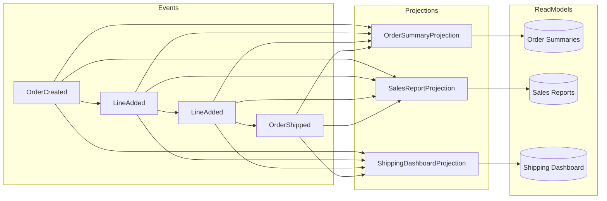
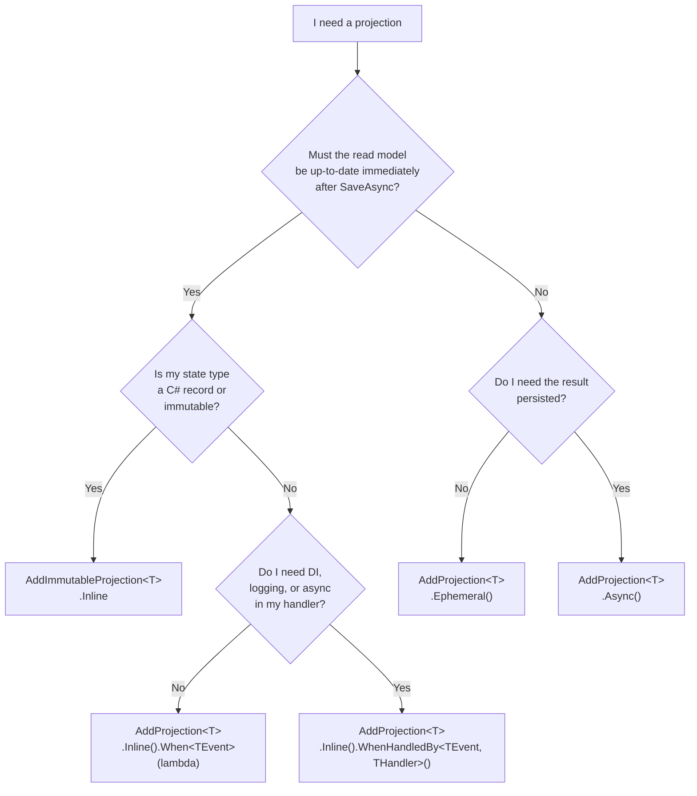
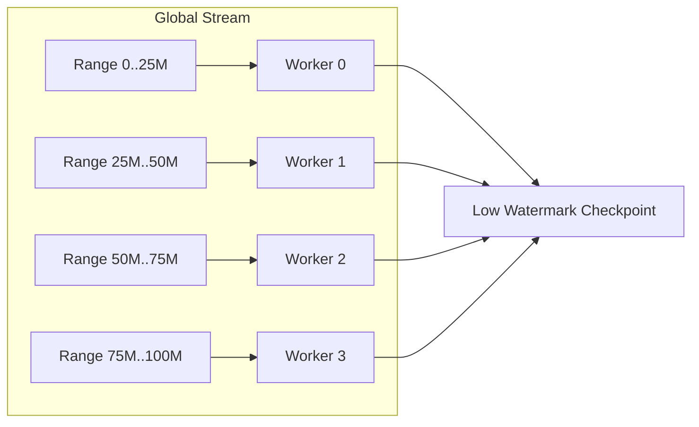

# Projections

Projections transform event streams into read-optimized views (read models) for queries.

## Before You Start

- **.NET 8.0+** (or .NET 9/10 for latest features)
- Install the required packages:
  ```bash
  dotnet add package Excalibur.EventSourcing
  ```
- Familiarity with [event stores](./event-store.md) and [domain events](./domain-events.md)

## Overview


```mermaid
flowchart LR
    subgraph Events
        E1[OrderCreated] --> E2[LineAdded]
        E2 --> E3[LineAdded]
        E3 --> E4[OrderShipped]
    end

    subgraph Projections
        E1 & E2 & E3 & E4 --> P1[OrderSummaryProjection]
        E1 & E2 & E3 & E4 --> P2[SalesReportProjection]
        E1 & E2 & E3 & E4 --> P3[ShippingDashboardProjection]
    end

    subgraph ReadModels
        P1 --> R1[(Order Summaries)]
        P2 --> R2[(Sales Reports)]
        P3 --> R3[(Shipping Dashboard)]
    end
```

## Choosing the Right Approach

Excalibur offers several projection approaches. Use this decision tree to pick the right one:


```mermaid
flowchart TD
    START[I need a projection] --> Q1{Must the read model<br/>be up-to-date immediately<br/>after SaveAsync?}

    Q1 -->|Yes| Q2{Is my state type<br/>a C# record or<br/>immutable?}
    Q1 -->|No| Q3{Do I need the result<br/>persisted?}

    Q2 -->|Yes| IMMUTABLE[AddImmutableProjection&lt;T&gt;<br/>.Inline]
    Q2 -->|No| Q4{Do I need DI,<br/>logging, or async<br/>in my handler?}

    Q4 -->|No| INLINE_LAMBDA["AddProjection&lt;T&gt;<br/>.Inline().When&lt;TEvent&gt;(lambda)"]
    Q4 -->|Yes| INLINE_DI["AddProjection&lt;T&gt;<br/>.Inline().WhenHandledBy&lt;TEvent, THandler&gt;()"]

    Q3 -->|No| EPHEMERAL["AddProjection&lt;T&gt;<br/>.Ephemeral()"]
    Q3 -->|Yes| ASYNC["AddProjection&lt;T&gt;<br/>.Async()"]
```

### Quick Comparison

| Approach | Consistency | State Type | DI Support | Best For |
|----------|------------|------------|------------|----------|
| **Inline lambda** | Immediate | Mutable class | No | Simple property mapping |
| **Inline DI handler** | Immediate | Mutable class | Yes | Complex logic, logging |
| **Inline immutable** | Immediate | Records, immutable | Yes | Functional patterns, audit trails |
| **Async** | Eventual | Any | Yes | Reporting, search indexes |
| **Ephemeral** | On-demand | Any | No | Debugging, ad-hoc queries |

---

## Quick Start: Inline Lambda Projection

The simplest and most common approach. Events update a read model during `SaveAsync()`:

```csharp
services.AddExcaliburEventSourcing(builder =>
{
    builder.AddAggregate<OrderAggregate>(agg => agg.UseInMemoryStore());

    builder.AddProjection<OrderSummary>(p => p
        .Inline()
        .When<OrderPlaced>((proj, e) =>
        {
            proj.Status = "Placed";
            proj.Total = e.Total;
            proj.CreatedAt = e.OccurredAt;
        })
        .When<OrderShipped>((proj, e) =>
        {
            proj.Status = "Shipped";
            proj.ShippedAt = e.ShippedAt;
        }));
});
```

After `SaveAsync`, the read model is immediately consistent:

```csharp
await repository.SaveAsync(order, cancellationToken);
var summary = await projectionStore.GetByIdAsync(order.Id, cancellationToken);
// summary.Status == "Placed" -- guaranteed, not eventual
```

---

## Inline Projections (Mutable)

Inline projections run during `SaveAsync()` and guarantee read-after-write consistency. The projection type must be a mutable class with a parameterless constructor (`new()` constraint).

### Lambda Handlers (Tier 1)

Zero-allocation, zero-DI. Best for simple property mapping:

```csharp
builder.AddProjection<OrderSummary>(p => p
    .Inline()
    .When<OrderPlaced>((proj, e) => { proj.Status = "Placed"; proj.Total = e.Total; })
    .When<OrderShipped>((proj, e) => { proj.Status = "Shipped"; }));
```

### DI-Resolved Handlers (Tier 3)

When your projection logic needs dependency injection, async operations, or custom projection IDs, implement `IProjectionEventHandler<TProjection, TEvent>`:

```csharp
public sealed class CustomerCreatedHandler
    : IProjectionEventHandler<CustomerSearchProjection, CustomerCreated>
{
    private readonly ILogger<CustomerCreatedHandler> _logger;

    public CustomerCreatedHandler(ILogger<CustomerCreatedHandler> logger)
        => _logger = logger;

    public Task HandleAsync(
        CustomerSearchProjection projection,
        CustomerCreated @event,
        ProjectionHandlerContext context,
        CancellationToken cancellationToken)
    {
        projection.Name = @event.Name;
        projection.Email = @event.Email;
        projection.IsActive = true;
        _logger.LogDebug("Projected customer {Id}", context.AggregateId);
        return Task.CompletedTask;
    }
}
```

Register with `WhenHandledBy`. You can mix lambdas and DI handlers in the same projection:

```csharp
builder.AddProjection<CustomerSearchProjection>(p => p
    .Inline()
    .WhenHandledBy<CustomerCreated, CustomerCreatedHandler>()
    .WhenHandledBy<CustomerOrderPlaced, CustomerOrderPlacedHandler>()
    .When<CustomerDeactivated>((proj, e) => { proj.IsActive = false; }));
```

`WhenHandledBy` auto-registers the handler in DI as `Transient` -- no manual `services.AddTransient<THandler>()` needed.

### Assembly Scanning

For projects with many handlers, scan an assembly to auto-discover all `IProjectionEventHandler<T, TEvent>` implementations:

```csharp
builder.AddProjection<CustomerSearchProjection>(p => p
    .Inline()
    .AddProjectionHandlersFromAssembly(typeof(CustomerCreatedHandler).Assembly));
```

:::warning AOT Compatibility
Assembly scanning uses reflection and is annotated with `[RequiresUnreferencedCode]`. For AOT/trimming scenarios, use explicit `WhenHandledBy<TEvent, THandler>()` instead.
:::

### Custom Projection IDs

By default, projections are keyed by aggregate ID. Set `OverrideProjectionId` in a DI handler to key by a different concept:

```csharp
public sealed class TierSummaryOnCustomerCreated
    : IProjectionEventHandler<TierSummaryProjection, CustomerCreated>
{
    public Task HandleAsync(
        TierSummaryProjection projection,
        CustomerCreated @event,
        ProjectionHandlerContext context,
        CancellationToken cancellationToken)
    {
        context.OverrideProjectionId = "Bronze"; // Key by tier, not aggregate
        projection.CustomerCount++;
        return Task.CompletedTask;
    }
}
```

### ProjectionHandlerContext

Every DI handler receives aggregate metadata:

```csharp
public sealed class ProjectionHandlerContext
{
    public string AggregateId { get; }
    public string AggregateType { get; }
    public long CommittedVersion { get; }
    public DateTimeOffset Timestamp { get; }
    public string? OverrideProjectionId { get; set; }
}
```

### Handler Tier Comparison

| Tier | API | DI | Async | Custom ID | AOT-Safe | Best For |
|------|-----|-----|-------|-----------|----------|----------|
| 1 | `When<TEvent>(lambda)` | No | No | No | Yes | Simple property mapping |
| 2 | `IProjectionConfiguration<T>` | No | No | No | Yes | Organized lambda groups |
| 3 | `WhenHandledBy<TEvent, THandler>()` | Yes | Yes | Yes | Yes | Complex logic, logging, cross-aggregate |

### Performance

| Scenario | Overhead per Event | Allocation |
|----------|-------------------|------------|
| `When<T>` lambda (Tier 1) | Baseline | Zero |
| `WhenHandledBy` singleton handler | ~20-50ns (`GetRequiredService`) | Zero |
| `WhenHandledBy` transient handler | ~20-50ns + constructor | Handler instance |

When all handlers in a projection are Tier 1 lambdas, the pipeline uses a zero-allocation fast path. Adding any Tier 3 handler activates the multi-ID code path with `Dictionary<string, TProjection>` tracking.

### IProjectionBuilder&lt;T&gt; API Reference

| Method | Description |
|--------|-------------|
| `.Inline()` | Run during `SaveAsync()` for immediate consistency |
| `.Async()` | Run via background host (default if neither is called) |
| `.Ephemeral()` | Build on-demand, no persistence |
| `.When<TEvent>(Action<TProjection, TEvent>)` | Register a synchronous event handler (Tier 1) |
| `.WhenHandledBy<TEvent, THandler>()` | Register a DI-resolved async event handler (Tier 3) |
| `.AddProjectionHandlersFromAssembly(Assembly)` | Discover handlers via assembly scanning |
| `.WithCacheTtl(TimeSpan)` | Optional caching for ephemeral projection results |

:::tip
A second `AddProjection<T>()` call for the same projection type **replaces** the first registration. This is useful for testing and conditional reconfiguration.
:::

---

## Immutable Projections

For projections backed by C# records or other immutable types, use `AddImmutableProjection<T>()`. Unlike `AddProjection<T>()`, this builder has **no `new()` constraint** -- it uses factory and reducer patterns instead of in-place mutation:

```csharp
public record OrderSummaryRecord(
    string OrderId,
    decimal Total,
    string Status,
    DateTimeOffset? ShippedAt = null);

services.AddExcaliburEventSourcing(builder =>
{
    builder.AddImmutableProjection<OrderSummaryRecord>(p => p
        .Inline()
        .WhenCreating<OrderPlaced>(e =>
            new OrderSummaryRecord(e.AggregateId, e.Amount, "Placed"))
        .WhenTransforming<OrderShipped>((proj, e) =>
            proj with { Status = "Shipped", ShippedAt = e.ShippedAt }));
});
```

### WhenCreating vs WhenTransforming

| Handler | Input | Output | Use Case |
|---------|-------|--------|----------|
| `WhenCreating<TEvent>(Func<TEvent, T>)` | Event only | New projection | First event that initializes the projection |
| `WhenTransforming<TEvent>(Func<T, TEvent, T>)` | Current state + Event | New projection | Subsequent events that evolve state |

**Null-current semantics:**

| Current State | Handler Type | Behavior |
|---------------|-------------|----------|
| `null` | `WhenCreating` | Factory creates new instance |
| `null` | `WhenTransforming` | Throws `InvalidOperationException` |
| non-null | `WhenTransforming` | Reducer produces new instance |
| non-null | `WhenCreating` | Factory replaces (last-wins) |

:::warning
If the first event for a projection ID uses `WhenTransforming` without a prior `WhenCreating` event, the pipeline throws `InvalidOperationException`. Always register a `WhenCreating` handler for the event that initializes the projection.
:::

### Custom Projection IDs (Multi-ID)

Lambda handlers (`WhenCreating`, `WhenTransforming`) always key the projection by aggregate ID. They do **not** support `OverrideProjectionId` because the lambda signature has no access to `ProjectionHandlerContext`.

If you need to key an immutable projection by something other than aggregate ID (e.g., by customer, by region, by tier), use a DI-resolved handler via `WhenHandledBy`:

```csharp
public sealed class RegionSummaryOnOrderPlaced
    : IImmutableProjectionHandler<RegionSummaryRecord, OrderPlaced>
{
    public Task<RegionSummaryRecord> TransformAsync(
        RegionSummaryRecord? current,
        OrderPlaced @event,
        ProjectionHandlerContext context,
        CancellationToken cancellationToken)
    {
        context.OverrideProjectionId = @event.Region; // Key by region, not aggregate
        var record = current ?? new RegionSummaryRecord(@event.Region, 0, 0m);
        return Task.FromResult(record with
        {
            OrderCount = record.OrderCount + 1,
            TotalRevenue = record.TotalRevenue + @event.Amount
        });
    }
}

builder.AddImmutableProjection<RegionSummaryRecord>(p => p
    .Inline()
    .WhenHandledBy<OrderPlaced, RegionSummaryOnOrderPlaced>());
```

:::note Multi-ID Summary
| Handler Type | Custom Projection ID | Reason |
|---|---|---|
| `WhenCreating` / `WhenTransforming` (lambdas) | Not supported | No `ProjectionHandlerContext` in lambda signature |
| `WhenHandledBy` (DI handler) | Supported via `context.OverrideProjectionId` | Handler receives full context |

This is a deliberate design decision (Q2) to keep lambda signatures simple. If you need multi-ID, use `WhenHandledBy`.
:::

### DI-Resolved Immutable Handlers

For complex transforms that need DI, implement `IImmutableProjectionHandler<TProjection, TEvent>`. This interface **returns a new instance** instead of mutating:

```csharp
public interface IImmutableProjectionHandler<TProjection, in TEvent>
    where TProjection : class
    where TEvent : IDomainEvent
{
    Task<TProjection> TransformAsync(
        TProjection? current,     // null on first event
        TEvent @event,
        ProjectionHandlerContext context,
        CancellationToken cancellationToken);
}
```

Register with `WhenHandledBy`:

```csharp
builder.AddImmutableProjection<CustomerRecord>(p => p
    .Inline()
    .WhenHandledBy<CustomerCreated, CustomerCreatedImmutableHandler>()
    .WhenTransforming<CustomerDeactivated>((proj, e) =>
        proj with { IsActive = false }));
```

Assembly scanning is also supported:

```csharp
builder.AddImmutableProjection<CustomerRecord>(p => p
    .Inline()
    .AddImmutableProjectionHandlersFromAssembly(typeof(CustomerCreatedImmutableHandler).Assembly));
```

### IImmutableProjectionBuilder&lt;T&gt; API Reference

| Method | Description |
|--------|-------------|
| `.Inline()` | Run during `SaveAsync()` |
| `.Async()` | Run via background host (default) |
| `.WhenCreating<TEvent>(Func<TEvent, T>)` | Factory: event -> new projection |
| `.WhenTransforming<TEvent>(Func<T, TEvent, T>)` | Reducer: (current, event) -> new projection |
| `.WhenHandledBy<TEvent, THandler>()` | DI-resolved immutable handler |
| `.AddImmutableProjectionHandlersFromAssembly(Assembly)` | Assembly scanning |
| `.WithCacheTtl(TimeSpan)` | Optional caching for ephemeral results |

### When to Use Immutable vs Mutable

| Factor | `AddProjection<T>()` (Mutable) | `AddImmutableProjection<T>()` (Immutable) |
|--------|-------------------------------|------------------------------------------|
| State type | `class` with `new()` | Any `class` (records, init-only) |
| Handler pattern | Mutate in-place | Return new instance |
| Thread safety | Projection locked per batch | Naturally thread-safe (no shared mutation) |
| Best for | Simple POCO read models | C# records, audit trails, versioned state |

---

## Async Projections

Async projections are updated in the background, eventually consistent with the event stream. Use them for reporting, search indexes, and read models that don't need immediate consistency.

```csharp
builder.AddProjection<OrderSearchIndex>(p => p
    .Async()
    .When<OrderPlaced>((proj, e) => { /* index update */ }));
```

Async projections are processed by `GlobalStreamProjectionHost` using checkpoint-based delivery. For CDC-based processing, see [CDC Pattern](../patterns/cdc.md).

### Parallel Catch-Up

When catching up from position 0 on a large global stream (100B+ events), sequential processing would take years. Enable parallel catch-up to split the stream into ranges and process them concurrently:

```csharp
services.AddExcaliburEventSourcing(builder =>
{
    builder.UseParallelCatchUp(opts =>
    {
        opts.Strategy = CatchUpStrategy.RangePartitioned;
        opts.WorkerCount = Environment.ProcessorCount;
        opts.BatchSize = 1000;
        opts.CheckpointInterval = 5000;
    });
});
```

The infrastructure:

1. **Partitions** the global stream into position ranges via `IGlobalStreamPartitioner`
2. **Spawns** one worker per range
3. **Checkpoints** each worker independently
4. **Merges** cursors using a low-watermark strategy (global position = minimum of all worker checkpoints)


```mermaid
flowchart LR
    subgraph Global Stream
        R1["Range 0..25M"] --> W1[Worker 0]
        R2["Range 25M..50M"] --> W2[Worker 1]
        R3["Range 50M..75M"] --> W3[Worker 2]
        R4["Range 75M..100M"] --> W4[Worker 3]
    end

    W1 & W2 & W3 & W4 --> CP[Low Watermark Checkpoint]
```

| Option | Default | Description |
|--------|---------|-------------|
| `Strategy` | `Sequential` | `Sequential`, `RangePartitioned`, or `PerShard` |
| `WorkerCount` | `ProcessorCount` | Number of parallel workers |
| `BatchSize` | 1000 | Events per batch read |
| `CheckpointInterval` | 5000 | Events between checkpoints |
| `MaxRetries` | 3 | Retry attempts for failed workers |
| `WorkerHeartbeatTimeout` | 60s | Timeout for detecting hung workers |

Parallel processing activates only during catch-up. Once caught up, the host automatically switches to sequential single-worker processing for lower latency.

**Provider support:** SQL Server (indexed `GlobalPosition` range queries). PostgreSQL planned for Phase 2. Providers without range query support fall back to sequential automatically.

:::note Idempotency Requirement
Projections used with parallel catch-up **must** handle duplicate events, since range boundaries may overlap slightly.
:::

---

## Ephemeral Projections

Ephemeral projections build a read model on-demand by replaying events **without persisting** the result. Useful for debugging, ad-hoc queries, and audit trails:

```csharp
builder.AddProjection<OrderAuditTrail>(p => p
    .Ephemeral()
    .When<OrderPlaced>((proj, e) => { proj.Events.Add($"Placed: {e.Total}"); })
    .When<OrderShipped>((proj, e) => { proj.Events.Add($"Shipped: {e.ShippedAt}"); }));
```

```csharp
var engine = serviceProvider.GetRequiredService<IEphemeralProjectionEngine>();
var auditTrail = await engine.BuildAsync<OrderAuditTrail>(
    orderId, "OrderAggregate", cancellationToken);
```

Key characteristics:
- Uses the **same `When<T>` handlers** as inline and async projections
- Returns a **fresh instance** on every call (no shared mutable state)
- **Never invoked** by the notification broker -- consumer-initiated only
- Optional caching via `IDistributedCache` when configured with `.WithCacheTtl()`

---

## Projection Stores

### IProjectionStore&lt;T&gt;

The standard storage interface for all projection backends:

```csharp
public interface IProjectionStore<TProjection> where TProjection : class
{
    Task<TProjection?> GetByIdAsync(string id, CancellationToken cancellationToken);
    Task UpsertAsync(string id, TProjection projection, CancellationToken cancellationToken);
    Task DeleteAsync(string id, CancellationToken cancellationToken);
    Task<IReadOnlyList<TProjection>> QueryAsync(
        IDictionary<string, object>? filters,
        QueryOptions? options,
        CancellationToken cancellationToken);
    Task<long> CountAsync(IDictionary<string, object>? filters, CancellationToken cancellationToken);
}
```

### Registering Store Backends

```csharp
// SQL Server
services.AddSqlServerProjections(sqlConnectionString, projections =>
{
    projections.Add<OrderSummary>(o => o.TableName = "OrderSummaries");
});

// PostgreSQL
services.AddPostgresProjections(pgConnectionString, projections =>
{
    projections.Add<OrderSummary>(o => o.TableName = "order_summaries");
});

// ElasticSearch
services.AddElasticSearchProjections("https://es.example.com:9200", projections =>
{
    projections.Add<OrderSummary>();
    projections.Add<CustomerProfile>(o => o.IndexName = "customers");
});

// MongoDB
services.AddMongoDbProjections(mongoConnectionString, "projections", projections =>
{
    projections.Add<OrderSummary>();
});

// CosmosDB
services.AddCosmosDbProjections(cosmosConnectionString, "projections", projections =>
{
    projections.Add<OrderSummary>();
});
```

### Querying Read Models

`IProjectionStore<T>` supports dictionary-based filters with operator suffixes:

```csharp
var results = await projectionStore.QueryAsync(
    new Dictionary<string, object>
    {
        ["CustomerId"] = customerId,
        ["Status:neq"] = "Deleted",
        ["TotalAmount:gte"] = 100m
    },
    new QueryOptions { Skip = 0, Take = 25, SortBy = "CreatedAt", SortDescending = true },
    cancellationToken);

var summary = await projectionStore.GetByIdAsync(orderId.ToString(), cancellationToken);
```

For most use cases, `IProjectionStore<T>` is all you need. Graduate to a custom repository only when you need backend-native features (full-text search, aggregations, SQL joins).

---

## Execution and Failure Handling

### Execution Order

When `SaveAsync()` completes event persistence, the notification broker runs in two strict phases:

1. **Phase 1 -- Inline projections:** All registered inline projections run concurrently via `Task.WhenAll` (different projection types in parallel, events applied sequentially within each type).
2. **Phase 2 -- Notification handlers:** All `IEventNotificationHandler<T>` handlers run sequentially, only after ALL projections complete.

Projections and handlers **never overlap**, so handlers can safely read updated projection state.

### Failure Handling

Since events are already committed when inline projections run, failure handling is critical:

```csharp
services.Configure<EventNotificationOptions>(options =>
{
    // Default: surface projection failures to the caller
    options.FailurePolicy = NotificationFailurePolicy.Propagate;

    // Alternative: log and continue (async path catches up)
    // options.FailurePolicy = NotificationFailurePolicy.LogAndContinue;

    // Warn when inline processing exceeds this threshold
    options.InlineProjectionWarningThreshold = TimeSpan.FromMilliseconds(100);
});
```

| Policy | Behavior |
|--------|----------|
| `Propagate` (default) | Failed projections throw `InlineProjectionException`. Events remain committed. **Do NOT retry `SaveAsync`**. |
| `LogAndContinue` | Failures logged at Error level. Processing continues. Async path catches up. |

### Recovery

Use `IProjectionRecovery` to recover failed inline projections without re-appending events:

```csharp
try
{
    await repository.SaveAsync(order, cancellationToken);
}
catch (InlineProjectionException ex)
{
    // Events ARE committed -- recover the projection only
    var recovery = serviceProvider.GetRequiredService<IProjectionRecovery>();
    await recovery.ReapplyAsync<OrderSummary>(ex.AggregateId, cancellationToken);
}
```

`IProjectionRecovery` is automatically registered when you call `UseEventNotification()` or `AddProjection<T>()`.

### Event Notification Handlers

For in-process event handling after `SaveAsync()` (without transport round-trips), implement `IEventNotificationHandler<T>`:

```csharp
public class OrderPlacedNotificationHandler : IEventNotificationHandler<OrderPlaced>
{
    public Task HandleAsync(
        OrderPlaced @event,
        EventNotificationContext context,
        CancellationToken cancellationToken)
    {
        // Runs after ALL inline projections complete (Phase 2)
        return Task.CompletedTask;
    }
}
```

:::note
`IEventNotificationHandler<T>` is distinct from `IEventHandler<T>` in the Dispatch layer. Notification handlers are EventSourcing-level, in-process only, and invoked during `SaveAsync`.
:::

### Zero-Overhead Opt-In

If you never call `AddProjection<T>()` or `UseEventNotification()`, the broker is not registered in DI. `SaveAsync` behaves identically to pre-notification behavior with zero overhead.

---

## Advanced Patterns

### List View vs Detail View

A common CQRS pattern uses separate projections for list and detail views, backed by different stores:

```csharp
// List view: ElasticSearch for fast search
services.AddElasticSearchProjections("https://es.example.com:9200", projections =>
{
    projections.Add<OrderListItem>(o => o.IndexPrefix = $"{env}-projections");
});

// Detail view: SQL Server for strong consistency
services.AddSqlServerProjectionStore<OrderDetail>(options =>
{
    options.ConnectionString = sqlConnectionString;
    options.TableName = "OrderDetails";
});

services.AddExcaliburEventSourcing(builder =>
{
    builder.AddProjection<OrderListItem>(p => p
        .Async()
        .When<OrderPlaced>((proj, e) =>
        {
            proj.OrderId = e.OrderId;
            proj.Status = "Placed";
            proj.Total = e.Total;
        })
        .When<OrderShipped>((proj, e) => { proj.Status = "Shipped"; }));

    builder.AddProjection<OrderDetail>(p => p
        .Inline()
        .When<OrderPlaced>((proj, e) =>
        {
            proj.OrderId = e.OrderId;
            proj.Status = "Placed";
            proj.Total = e.Total;
            proj.ShippingAddress = e.ShippingAddress;
        })
        .When<OrderShipped>((proj, e) => { proj.Status = "Shipped"; }));
});
```

Both projections stay in sync automatically -- events are the synchronization mechanism.

### Cross-Aggregate Projections

Build projections that span multiple aggregates by keying on a shared business concept (e.g., customer ID):

```csharp
public class CustomerOrderHistoryHandler : IEventHandler<OrderCreated>
{
    private readonly IProjectionStore<CustomerOrderHistory> _store;

    public async Task HandleAsync(OrderCreated @event, CancellationToken ct)
    {
        var history = await _store.GetByIdAsync(@event.CustomerId, ct)
            ?? new CustomerOrderHistory { CustomerId = @event.CustomerId };

        history.TotalOrders++;
        history.TotalSpent += @event.TotalAmount;
        history.LastOrderDate = @event.OccurredAt;

        await _store.UpsertAsync(@event.CustomerId, history, ct);
    }
}
```

### Custom Repositories

When you need capabilities beyond `IProjectionStore<T>` -- such as full-text search, aggregations, or SQL joins -- build a custom repository targeting your backend:

```csharp
// SQL Server (Dapper)
public class SqlServerOrderSummaryRepository
{
    private readonly IDbConnection _db;

    public async Task<IReadOnlyList<OrderSummary>> SearchAsync(
        OrderSearchCriteria criteria, CancellationToken ct)
    {
        var sql = new StringBuilder("SELECT * FROM OrderSummaries WHERE 1=1");
        var parameters = new DynamicParameters();

        if (!string.IsNullOrEmpty(criteria.CustomerId))
        {
            sql.Append(" AND CustomerId = @CustomerId");
            parameters.Add("CustomerId", criteria.CustomerId);
        }

        sql.Append(" ORDER BY CreatedAt DESC");
        sql.Append(" OFFSET @Skip ROWS FETCH NEXT @Take ROWS ONLY");
        parameters.Add("Skip", criteria.Skip);
        parameters.Add("Take", criteria.Take);

        var results = await _db.QueryAsync<OrderSummary>(sql.ToString(), parameters);
        return results.ToList();
    }
}
```

```csharp
// ElasticSearch (full-text search + aggregations)
public class OrderSearchRepository : ElasticRepositoryBase<OrderSummary>
{
    public OrderSearchRepository(
        ElasticsearchClient client,
        IOptionsMonitor<ElasticSearchProjectionStoreOptions> optionsMonitor)
        : base(client, ElasticSearchProjectionIndexConvention.GetIndexName<OrderSummary>(
            optionsMonitor.Get(nameof(OrderSummary))))
    {
    }

    public async Task<SearchResponse<OrderSummary>> FullTextSearchAsync(
        string searchText, CancellationToken ct)
    {
        return await SearchAsync(s => s
            .Query(q => q.MultiMatch(mm => mm
                .Query(searchText)
                .Fields(new[] { "customerId", "status" })))
            .Aggregations(a => a
                .Add("by_status", agg => agg
                    .Terms(t => t.Field("status.keyword")))),
            ct);
    }
}
```

:::tip
`ElasticSearchProjectionIndexConvention.GetIndexName<T>()` ensures both `IProjectionStore<T>` and your custom repository resolve to the same index from a single source of truth.
:::

### Incremental Snapshots

Incremental snapshots reduce storage overhead by saving only the **delta** (changes) since the last full snapshot:

:::info Unique Feature
No competing .NET event sourcing framework offers incremental snapshots.
:::

```csharp
builder.AddAggregate<OrderAggregate>(agg =>
{
    agg.UseInMemoryStore();
    agg.UseSnapshotStrategy(new IncrementalSnapshotStrategy(compactionThreshold: 10));
});
```

How it works:
1. **Every commit:** A delta snapshot is saved (only changes)
2. **On load:** Base + ordered deltas are merged to reconstruct full state
3. **Compaction:** After `compactionThreshold` deltas (default 10), a full snapshot replaces the base

### ElasticSearch Projection Lifecycle

When projections are backed by ElasticSearch, use the lifecycle services for index management:

```csharp
// Rebuild Manager
var result = await rebuildManager.StartRebuildAsync(new ProjectionRebuildRequest
{
    ProjectionType = nameof(OrderSummaryProjection),
    SourceIndexName = "orders-v1",
    TargetIndexName = "orders-v2",
    CreateNewIndex = true,
    UseAliasing = true
}, ct);

var status = await rebuildManager.GetRebuildStatusAsync(result.OperationId, ct);
```

---

## Testing Projections

Test projection handlers with an in-memory projection store:

```csharp
public class OrderSummaryProjectionTests
{
    private readonly InMemoryProjectionStore<OrderSummary> _store;
    private readonly OrderCreatedProjectionHandler _handler;

    public OrderSummaryProjectionTests()
    {
        _store = new InMemoryProjectionStore<OrderSummary>();
        _handler = new OrderCreatedProjectionHandler(_store);
    }

    [Fact]
    public async Task Projects_OrderCreated_To_Summary()
    {
        var @event = new OrderCreated("order-123", 1)
        {
            OrderId = Guid.NewGuid(),
            CustomerId = "customer-1",
            TotalAmount = 100m
        };

        await _handler.HandleAsync(@event, CancellationToken.None);

        var summary = await _store.GetByIdAsync(
            @event.OrderId.ToString(), CancellationToken.None);
        summary.Should().NotBeNull();
        summary!.CustomerId.Should().Be("customer-1");
        summary.Status.Should().Be("Created");
    }
}

public class InMemoryProjectionStore<T> : IProjectionStore<T> where T : class
{
    private readonly ConcurrentDictionary<string, T> _data = new();

    public Task<T?> GetByIdAsync(string id, CancellationToken ct)
        => Task.FromResult(_data.GetValueOrDefault(id));

    public Task UpsertAsync(string id, T projection, CancellationToken ct)
    {
        _data[id] = projection;
        return Task.CompletedTask;
    }

    public Task DeleteAsync(string id, CancellationToken ct)
    {
        _data.TryRemove(id, out _);
        return Task.CompletedTask;
    }

    public Task<IReadOnlyList<T>> QueryAsync(
        IDictionary<string, object>? filters,
        QueryOptions? options,
        CancellationToken ct)
        => Task.FromResult<IReadOnlyList<T>>(_data.Values.ToList());

    public Task<long> CountAsync(IDictionary<string, object>? filters, CancellationToken ct)
        => Task.FromResult((long)_data.Count);
}
```

---

## Observability

### Metrics

All metrics use the shared `Excalibur.EventSourcing.Projections` Meter via `IMeterFactory`:

| Metric | Type | Description |
|--------|------|-------------|
| `excalibur.projection.lag.events` | UpDownCounter | Events an async projection is behind the stream head |
| `excalibur.projection.error.count` | Counter | Total projection processing errors |
| `excalibur.projection.rebuild.duration` | Histogram (ms) | Duration of rebuild operations |
| `excalibur.projection.cursor_map.positions` | Observable Gauge | Current cursor position per projection |

### Health Check

The built-in `ProjectionHealthCheck` is automatically registered as `"projections"`:

- **Healthy:** No inline errors in window AND async lag below thresholds
- **Degraded:** Inline error within last 5 minutes, or lag > 100 events
- **Unhealthy:** Async projection lag > 1000 events

---

## Gotchas

### Inline projection failures do NOT roll back events

When an inline projection fails during `SaveAsync()`, events are **already committed**. Never retry `SaveAsync()` -- use `IProjectionRecovery.ReapplyAsync<T>()` instead.

```csharp
// WRONG: This duplicates events!
try { await repository.SaveAsync(order, ct); }
catch (InlineProjectionException) { await repository.SaveAsync(order, ct); }

// CORRECT: Recover the projection only
try { await repository.SaveAsync(order, ct); }
catch (InlineProjectionException ex)
{
    var recovery = sp.GetRequiredService<IProjectionRecovery>();
    await recovery.ReapplyAsync<OrderSummary>(ex.AggregateId, ct);
}
```

### Don't retry `SaveAsync` on `ConcurrencyException` without reloading

```csharp
// WRONG: Same stale version fails again
catch (ConcurrencyException) { await repository.SaveAsync(order, ct); }

// CORRECT: Reload and re-apply domain logic
catch (ConcurrencyException)
{
    var fresh = await repository.GetByIdAsync(order.Id, ct);
    fresh.AddLine(productId, quantity, price);
    await repository.SaveAsync(fresh, ct);
}
```

### Projection handlers must be idempotent

Both inline and async projections may replay events during recovery or rebuild:

```csharp
// Wrong: replays double-count
report.OrderCount++;

// Correct: guard against replays
var existing = await _store.GetByIdAsync(key, ct);
if (existing?.LastProcessedVersion >= @event.Version) return;
```

---

## Best Practices

| Practice | Recommendation |
|----------|----------------|
| **Start simple** | Use inline lambdas. Graduate to DI handlers or immutable projections only when needed |
| **Idempotency** | Make all projection handlers safe to replay |
| **Denormalization** | Don't be afraid to duplicate data for query optimization |
| **Mode selection** | Inline for immediate consistency, async for eventual, ephemeral for ad-hoc |
| **Failure recovery** | Use `IProjectionRecovery.ReapplyAsync<T>()`, never retry `SaveAsync` |
| **Monitoring** | Use projection observability metrics and health checks |
| **Indexing** | Index read model tables for your query patterns |

## Next Steps

- [Event Store](event-store.md) -- Understand event persistence
- [Event Versioning](versioning.md) -- Handle schema evolution
- [Snapshots](snapshots.md) -- Snapshot strategies including incremental snapshots
- [Handlers](../handlers.md) -- React to events

## See Also

- [Materialized Views](./materialized-views.md) -- Schedule-driven, query-optimized views for reporting and analytics
- [Event Sourcing Overview](./index.md) -- Core concepts and getting started with event sourcing
- [CDC Pattern](../patterns/cdc.md) -- Change Data Capture for async projection processing
