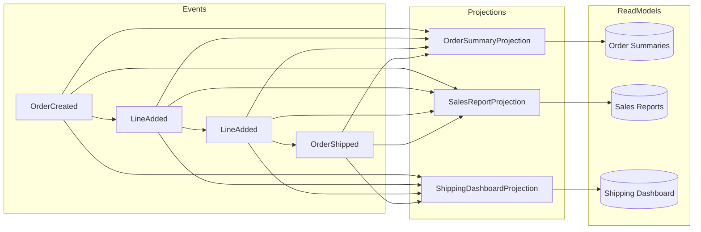

# Projections

Projections transform event streams into read-optimized views (read models) for queries.

## Before You Start

- **.NET 8.0+** (or .NET 9/10 for latest features)
- Install the required packages:
  ```bash
  dotnet add package Excalibur.EventSourcing
  ```
- Familiarity with [event stores](./event-store.md) and [domain events](./domain-events.md)

## Overview


```mermaid
flowchart LR
    subgraph Events
        E1[OrderCreated] --> E2[LineAdded]
        E2 --> E3[LineAdded]
        E3 --> E4[OrderShipped]
    end

    subgraph Projections
        E1 & E2 & E3 & E4 --> P1[OrderSummaryProjection]
        E1 & E2 & E3 & E4 --> P2[SalesReportProjection]
        E1 & E2 & E3 & E4 --> P3[ShippingDashboardProjection]
    end

    subgraph ReadModels
        P1 --> R1[(Order Summaries)]
        P2 --> R2[(Sales Reports)]
        P3 --> R3[(Shipping Dashboard)]
    end
```

## Defining Projections

Projections use `IProjectionStore<T>` for storage and custom handlers that process events:

### Using IProjectionStore

```csharp
public class OrderSummaryProjectionHandler
{
    private readonly IProjectionStore<OrderSummary> _store;

    public OrderSummaryProjectionHandler(IProjectionStore<OrderSummary> store)
    {
        _store = store;
    }

    public async Task HandleAsync(IDomainEvent @event, CancellationToken ct)
    {
        switch (@event)
        {
            case OrderCreated e:
                await _store.UpsertAsync(e.OrderId.ToString(), new OrderSummary
                {
                    OrderId = e.OrderId,
                    CustomerId = e.CustomerId,
                    Status = "Created",
                    TotalAmount = 0,
                    LineCount = 0,
                    CreatedAt = e.OccurredAt
                }, ct);
                break;

            case OrderLineAdded e:
                var summary = await _store.GetByIdAsync(e.OrderId.ToString(), ct);
                if (summary is not null)
                {
                    summary.TotalAmount += e.Quantity * e.UnitPrice;
                    summary.LineCount++;
                    await _store.UpsertAsync(e.OrderId.ToString(), summary, ct);
                }
                break;

            case OrderShipped e:
                var order = await _store.GetByIdAsync(e.OrderId.ToString(), ct);
                if (order is not null)
                {
                    order.Status = "Shipped";
                    order.ShippedAt = e.ShippedAt;
                    await _store.UpsertAsync(e.OrderId.ToString(), order, ct);
                }
                break;
        }
    }
}
```

### IProjectionStore Interface

The `IProjectionStore<T>` interface provides CRUD operations with dictionary-based querying:

```csharp
public interface IProjectionStore<TProjection> where TProjection : class
{
    Task<TProjection?> GetByIdAsync(string id, CancellationToken cancellationToken);
    Task UpsertAsync(string id, TProjection projection, CancellationToken cancellationToken);
    Task DeleteAsync(string id, CancellationToken cancellationToken);
    Task<IReadOnlyList<TProjection>> QueryAsync(
        IDictionary<string, object>? filters,
        QueryOptions? options,
        CancellationToken cancellationToken);
    Task<long> CountAsync(IDictionary<string, object>? filters, CancellationToken cancellationToken);
}
```

### Typed Event Handlers

Use Dispatch handlers to process events and update projections:

```csharp
public class OrderCreatedProjectionHandler : IEventHandler<OrderCreated>
{
    private readonly IProjectionStore<OrderSummary> _store;

    public OrderCreatedProjectionHandler(IProjectionStore<OrderSummary> store)
    {
        _store = store;
    }

    public async Task HandleAsync(OrderCreated @event, CancellationToken ct)
    {
        await _store.UpsertAsync(@event.OrderId.ToString(), new OrderSummary
        {
            OrderId = @event.OrderId,
            CustomerId = @event.CustomerId,
            Status = "Created",
            CreatedAt = @event.OccurredAt
        }, ct);
    }
}

public class OrderLineAddedProjectionHandler : IEventHandler<OrderLineAdded>
{
    private readonly IProjectionStore<OrderSummary> _store;

    public async Task HandleAsync(OrderLineAdded @event, CancellationToken ct)
    {
        var summary = await _store.GetByIdAsync(@event.OrderId.ToString(), ct);
        if (summary is null) return;

        summary.TotalAmount += @event.Quantity * @event.UnitPrice;
        summary.LineCount++;
        await _store.UpsertAsync(@event.OrderId.ToString(), summary, ct);
    }
}
```

## Configuration

### Register Projection Stores

Configure projection stores based on your storage backend:

```csharp
// MongoDB projection store
services.AddMongoDbProjectionStore<OrderSummary>(mongoConnectionString, "projections");

// ElasticSearch projection store
services.AddElasticSearchProjectionStore<OrderSummary>(options =>
{
    options.NodeUri = "https://elasticsearch.example.com:9200";
    // Environment-scoped prefix → e.g. "development-projections-ordersummary"
    options.IndexPrefix = $"{builder.Environment.EnvironmentName.ToLowerInvariant()}-projections";
    // Optional: override index name (replaces projection type name in convention)
    // options.IndexName = "order-summaries";
});

// ElasticSearch with multi-node cluster
services.AddElasticSearchProjectionStore<OrderSummary>(options =>
{
    options.NodeUris = new[]
    {
        new Uri("https://es-node1.example.com:9200"),
        new Uri("https://es-node2.example.com:9200"),
        new Uri("https://es-node3.example.com:9200"),
    };
    options.ConnectionPoolType = ConnectionPoolType.Static; // or Sniffing
});

// CosmosDb projection store
services.AddCosmosDbProjectionStore<OrderSummary>(cosmosConnectionString, "projections");

// SQL Server projection store
services.AddSqlServerProjectionStore<OrderSummary>(options =>
{
    options.ConnectionString = sqlConnectionString;
    options.TableName = "OrderSummaries";
});

// SQL Server projection store with typed IDb marker
services.AddSqlServerProjectionStore<OrderSummary, IOrderDb>();

// PostgreSQL projection store
services.AddPostgresProjectionStore<OrderSummary>(options =>
{
    options.ConnectionString = pgConnectionString;
    options.TableName = "order_summaries";
});
```

### Register Projection Handlers

Register projection handlers using assembly scanning or explicit registration:

```csharp
// Assembly scanning -- discovers all IProjectionHandler implementations
// ⚠️ Requires [RequiresUnreferencedCode] (not AOT-safe)
services.AddProjectionHandlersFromAssembly(typeof(OrderCreatedProjectionHandler).Assembly);

// With custom lifetime (default is Singleton)
services.AddProjectionHandlersFromAssembly(
    typeof(OrderCreatedProjectionHandler).Assembly,
    ServiceLifetime.Transient);
```

Assembly scanning finds all concrete (non-abstract, non-interface) classes implementing `IProjectionHandler` and registers them with `TryAdd` semantics -- existing registrations are not overwritten.

### Register Event Handlers

Register Dispatch event handlers to process events and update projections:

```csharp
services.AddDispatch(builder =>
{
    builder.AddHandlersFromAssembly(typeof(OrderCreatedProjectionHandler).Assembly);
});
```

### Projection Modes

Projections support three modes, configured per projection via `IProjectionBuilder<T>`:

| Mode | Description | Use Case |
|------|-------------|----------|
| **Inline** | Updated synchronously during `SaveAsync()`, before returning to caller | Read models requiring immediate read-after-write consistency |
| **Async** | Updated by `GlobalStreamProjectionHost` (background, checkpoint-based) | Eventually-consistent read models, reporting |
| **Ephemeral** | Built on-demand by replaying events, no persistence | Ad-hoc queries, debugging, auditing |

## Inline Projections (Projection Builder API)

Inline projections run during `SaveAsync()` and guarantee that the read model is up-to-date **before** the call returns. Configure them with the fluent `IProjectionBuilder<T>` API:

```csharp
services.AddExcaliburEventSourcing(builder =>
{
    builder.AddAggregate<OrderAggregate>(agg => agg.UseInMemoryStore());

    // Inline: updated synchronously during SaveAsync()
    builder.AddProjection<OrderSummary>(p => p
        .Inline()
        .When<OrderPlaced>((proj, e) => { proj.Status = "Placed"; proj.Total = e.Total; })
        .When<OrderShipped>((proj, e) => { proj.Status = "Shipped"; }));

    // Async: updated by GlobalStreamProjectionHost (default mode)
    builder.AddProjection<OrderSearchIndex>(p => p
        .Async()
        .When<OrderPlaced>((proj, e) => { /* index update */ }));
});
```

After `SaveAsync`, inline projections are immediately consistent:

```csharp
await repository.SaveAsync(order, cancellationToken);
var summary = await projectionStore.GetByIdAsync(order.Id, cancellationToken);
// summary.Status == "Placed" -- guaranteed, not eventual
```

### IProjectionBuilder&lt;T&gt; API

| Method | Description |
|--------|-------------|
| `.Inline()` | Run during `SaveAsync()` for immediate consistency |
| `.Async()` | Run via background host (default if neither is called) |
| `.When<TEvent>(Action<TProjection, TEvent>)` | Register an event handler for a specific domain event type |
| `.WithCacheTtl(TimeSpan)` | Optional caching for ephemeral projection results |

:::tip
A second `AddProjection<T>()` call for the same projection type **replaces** the first registration. This is useful for testing and conditional reconfiguration.
:::

### Execution Order

When `SaveAsync()` completes event persistence, the notification broker runs in two strict phases:

1. **Phase 1 -- Inline projections:** All registered inline projections run concurrently via `Task.WhenAll` (different projection types in parallel, events applied sequentially within each type).
2. **Phase 2 -- Notification handlers:** All `IEventNotificationHandler<T>` handlers run sequentially, only after ALL projections complete.

Projections and handlers **never overlap**, so handlers can safely read updated projection state.

### Failure Handling

Since events are already committed when inline projections run, failure handling is critical:

```csharp
services.Configure<EventNotificationOptions>(options =>
{
    // Default: surface projection failures to the caller
    options.FailurePolicy = NotificationFailurePolicy.Propagate;

    // Alternative: log and continue (async path catches up)
    // options.FailurePolicy = NotificationFailurePolicy.LogAndContinue;

    // Warn when inline processing exceeds this threshold
    options.InlineProjectionWarningThreshold = TimeSpan.FromMilliseconds(100);
});
```

| Policy | Behavior |
|--------|----------|
| `Propagate` (default) | Failed projections throw `InlineProjectionException`. Events remain committed. **Do NOT retry `SaveAsync`**. |
| `LogAndContinue` | Failures logged at Error level. Processing continues. Async path catches up. |

:::warning
When `FailurePolicy` is `Propagate` and an inline projection fails, the events **are already committed** to the event store. Never retry `SaveAsync()` -- this would duplicate events. Use `IProjectionRecovery` instead.
:::

### Recovery

Use `IProjectionRecovery` to recover failed inline projections without re-appending events:

```csharp
try
{
    await repository.SaveAsync(order, cancellationToken);
}
catch (InlineProjectionException ex)
{
    // Events ARE committed -- recover the failed projection
    logger.LogError(ex, "Projection {Type} failed for {AggregateId}",
        ex.FailedProjectionType.Name, ex.AggregateId);

    // Re-apply all events to the projection (no re-append)
    var recovery = serviceProvider.GetRequiredService<IProjectionRecovery>();
    await recovery.ReapplyAsync<OrderSummary>(ex.AggregateId, cancellationToken);
}
```

`IProjectionRecovery` is automatically registered when you call `UseEventNotification()` or `AddProjection<T>()`. You can also register it standalone via `UseProjectionRecovery()`.

### Event Notification Handlers

For in-process event handling after `SaveAsync()` (without transport round-trips), implement `IEventNotificationHandler<T>`:

```csharp
public class OrderPlacedNotificationHandler : IEventNotificationHandler<OrderPlaced>
{
    public Task HandleAsync(
        OrderPlaced @event,
        EventNotificationContext context,
        CancellationToken cancellationToken)
    {
        // Runs after ALL inline projections complete (Phase 2)
        // context.AggregateId, context.CommittedVersion available
        return Task.CompletedTask;
    }
}
```

:::note
`IEventNotificationHandler<T>` is distinct from `IEventHandler<T>` in the Dispatch layer. Dispatch handlers are transport-aware and participate in the messaging pipeline. Notification handlers are EventSourcing-level, in-process only, and invoked during `SaveAsync`.
:::

### Zero-Overhead Opt-In

If you never call `AddProjection<T>()` or `UseEventNotification()`, the broker is not registered in DI. `SaveAsync` behaves identically to pre-notification behavior with zero overhead.

See [Async Projection Processing](#async-projection-processing) for CDC configuration.

## Read Models

### Define Read Model

```csharp
public class OrderSummary
{
    public Guid OrderId { get; set; }
    public string CustomerId { get; set; }
    public string Status { get; set; }
    public decimal TotalAmount { get; set; }
    public int LineCount { get; set; }
    public DateTime CreatedAt { get; set; }
    public DateTime? ShippedAt { get; set; }
    public DateTime? DeliveredAt { get; set; }
}

public class SalesReport
{
    public DateTime Date { get; set; }
    public int OrderCount { get; set; }
    public decimal TotalRevenue { get; set; }
    public decimal AverageOrderValue { get; set; }
    public Dictionary<string, int> OrdersByStatus { get; set; }
}
```

### Querying Read Models

`IProjectionStore<T>` is the default query interface -- it works across all backends (SQL, ElasticSearch, MongoDB, CosmosDB) and supports dictionary-based filters with operator suffixes:

```csharp
// No custom repository needed for standard queries
var results = await projectionStore.QueryAsync(
    new Dictionary<string, object>
    {
        ["CustomerId"] = customerId,
        ["Status:neq"] = "Deleted",
        ["TotalAmount:gte"] = 100m
    },
    new QueryOptions { Skip = 0, Take = 25, SortBy = "CreatedAt", SortDescending = true },
    cancellationToken);

// Single record lookup
var summary = await projectionStore.GetByIdAsync(orderId.ToString(), cancellationToken);
```

For most use cases, `IProjectionStore<T>` is all you need. Graduate to a custom repository only when you need backend-native features.

### Custom Repositories (Advanced)

When you need capabilities beyond `IProjectionStore<T>` -- such as full-text search, aggregations, or SQL joins -- build a custom repository targeting your chosen backend.

#### SQL Server (Dapper)

```csharp
public class SqlServerOrderSummaryRepository
{
    private readonly IDbConnection _db;

    public async Task<OrderSummary?> GetByIdAsync(Guid orderId, CancellationToken ct)
    {
        return await _db.QuerySingleOrDefaultAsync<OrderSummary>(
            "SELECT * FROM OrderSummaries WHERE OrderId = @OrderId",
            new { OrderId = orderId });
    }

    public async Task<IReadOnlyList<OrderSummary>> SearchAsync(
        OrderSearchCriteria criteria,
        CancellationToken ct)
    {
        var sql = new StringBuilder("SELECT * FROM OrderSummaries WHERE 1=1");
        var parameters = new DynamicParameters();

        if (!string.IsNullOrEmpty(criteria.CustomerId))
        {
            sql.Append(" AND CustomerId = @CustomerId");
            parameters.Add("CustomerId", criteria.CustomerId);
        }

        if (criteria.Status is not null)
        {
            sql.Append(" AND Status = @Status");
            parameters.Add("Status", criteria.Status);
        }

        sql.Append(" ORDER BY CreatedAt DESC");
        sql.Append(" OFFSET @Skip ROWS FETCH NEXT @Take ROWS ONLY");
        parameters.Add("Skip", criteria.Skip);
        parameters.Add("Take", criteria.Take);

        var results = await _db.QueryAsync<OrderSummary>(sql.ToString(), parameters);
        return results.ToList();
    }
}
```

#### ElasticSearch (Full-Text Search, Aggregations)

When projections are backed by ElasticSearch and you need native query features (full-text search, faceted filtering, aggregations, geo queries), extend `ElasticRepositoryBase<T>`. Use `ElasticSearchProjectionIndexConvention` to resolve the same index name that `IProjectionStore<T>` uses:

```csharp
public class OrderSearchRepository : ElasticRepositoryBase<OrderSummary>
{
    public OrderSearchRepository(
        ElasticsearchClient client,
        IOptionsMonitor<ElasticSearchProjectionStoreOptions> optionsMonitor)
        : base(client, ElasticSearchProjectionIndexConvention.GetIndexName<OrderSummary>(
            optionsMonitor.Get(nameof(OrderSummary))))
    {
    }

    public async Task<SearchResponse<OrderSummary>> FullTextSearchAsync(
        string searchText,
        CancellationToken ct)
    {
        return await SearchAsync(s => s
            .Query(q => q.MultiMatch(mm => mm
                .Query(searchText)
                .Fields(new[] { "customerId", "status" })))
            .Aggregations(a => a
                .Add("by_status", agg => agg
                    .Terms(t => t.Field("status.keyword")))),
            ct);
    }
}
```

:::tip
`ElasticSearchProjectionIndexConvention.GetIndexName<T>()` ensures both `IProjectionStore<T>` and your custom repository resolve to the same index from a single source of truth. If you change the `IndexPrefix` in options, both paths stay in sync automatically.
:::

### List View vs Detail View (Multiple Projections)

A common CQRS pattern uses separate read models for list and detail views, each optimized for its query pattern. Define two projection types and optionally back them with different storage:

```csharp
// Slim model for list/search views
public class OrderListItem
{
    public Guid OrderId { get; set; }
    public string CustomerName { get; set; }
    public string Status { get; set; }
    public decimal Total { get; set; }
    public DateTime CreatedAt { get; set; }
}

// Rich model for single-record detail views
public class OrderDetail
{
    public Guid OrderId { get; set; }
    public string CustomerName { get; set; }
    public string Status { get; set; }
    public decimal Total { get; set; }
    public DateTime CreatedAt { get; set; }
    public List<OrderLineItem> Lines { get; set; }
    public string ShippingAddress { get; set; }
    public string Notes { get; set; }
}
```

Register separate projections -- they can target different backends:

```csharp
// List view: ElasticSearch for fast full-text search and faceted filtering
services.AddElasticSearchProjectionStore<OrderListItem>(options =>
{
    options.NodeUri = "https://elasticsearch.example.com:9200";
    options.IndexPrefix = $"{env}-projections";
});

// Detail view: SQL Server for strong consistency and relational queries
services.AddSqlServerProjectionStore<OrderDetail>(options =>
{
    options.ConnectionString = sqlConnectionString;
    options.TableName = "OrderDetails";
});

services.AddExcaliburEventSourcing(builder =>
{
    // List projection: fewer fields, async (eventually consistent)
    builder.AddProjection<OrderListItem>(p => p
        .Async()
        .When<OrderPlaced>((proj, e) =>
        {
            proj.OrderId = e.OrderId;
            proj.CustomerName = e.CustomerName;
            proj.Status = "Placed";
            proj.Total = e.Total;
            proj.CreatedAt = e.OccurredAt;
        })
        .When<OrderShipped>((proj, e) => { proj.Status = "Shipped"; }));

    // Detail projection: all fields, inline (immediately consistent)
    builder.AddProjection<OrderDetail>(p => p
        .Inline()
        .When<OrderPlaced>((proj, e) =>
        {
            proj.OrderId = e.OrderId;
            proj.CustomerName = e.CustomerName;
            proj.Status = "Placed";
            proj.Total = e.Total;
            proj.CreatedAt = e.OccurredAt;
            proj.ShippingAddress = e.ShippingAddress;
        })
        .When<OrderLineAdded>((proj, e) =>
        {
            proj.Lines.Add(new OrderLineItem
            {
                ProductId = e.ProductId,
                Quantity = e.Quantity,
                UnitPrice = e.UnitPrice
            });
        })
        .When<OrderShipped>((proj, e) => { proj.Status = "Shipped"; }));
});
```

Both projections stay in sync automatically because they are fed by the same event stream -- events are the synchronization mechanism, not any cross-store sync process.

## Async Projection Processing

For eventually-consistent projections, use CDC (Change Data Capture) rather than polling:

```csharp
// Configure CDC for async projections
services.AddCdcProcessor(cdc =>
{
    cdc.UseSqlServer(sql => sql.ConnectionString(connectionString))
       .TrackTable("dbo.Orders", table =>
       {
           table.MapInsert<OrderCreatedEvent>()
                .MapUpdate<OrderUpdatedEvent>();
       })
       .EnableBackgroundProcessing();
});
```

CDC automatically handles:
- **Position tracking** — Checkpoints managed internally
- **Subscription-based delivery** — Events pushed to handlers, not polled
- **Scalability** — Partition-aware processing

See [CDC Pattern](../patterns/cdc.md) for complete configuration.

## Rebuilding Projections

Projection rebuilds are typically triggered through operational tooling or the ElasticSearch lifecycle services (see below).

For custom rebuild scenarios, clear the projection store and replay events through your handlers:

```csharp
public class ProjectionRebuildService
{
    private readonly IProjectionStore<OrderSummary> _store;
    private readonly IEventSourcedRepository<Order, Guid> _repository;

    public async Task RebuildOrderSummariesAsync(
        IEnumerable<Guid> orderIds,
        CancellationToken ct)
    {
        foreach (var orderId in orderIds)
        {
            // Delete existing projection
            await _store.DeleteAsync(orderId.ToString(), ct);

            // Load aggregate and rebuild from its events
            var order = await _repository.GetByIdAsync(orderId, ct);
            if (order is null) continue;

            // Create fresh projection from aggregate state
            await _store.UpsertAsync(orderId.ToString(), new OrderSummary
            {
                OrderId = order.Id,
                CustomerId = order.CustomerId,
                Status = order.Status.ToString(),
                TotalAmount = order.TotalAmount,
                CreatedAt = order.CreatedAt
            }, ct);
        }
    }
}
```

For large-scale rebuilds with ElasticSearch, use the `IProjectionRebuildManager` (see below).

## ElasticSearch Projection Lifecycle

When projections are backed by ElasticSearch, use the lifecycle services to manage indexing and schema changes.

### Configuration

```csharp
services.Configure<ProjectionSettings>(options =>
{
    // Index name is composed as: {IndexPrefix}-{projectionType}
    options.IndexPrefix = "orders";
});
```

### Rebuild Manager

Use `IProjectionRebuildManager` for index migrations and rebuilds:

```csharp
public class ProjectionMigrationService
{
    private readonly IProjectionRebuildManager _rebuildManager;

    public async Task MigrateToNewSchemaAsync(CancellationToken ct)
    {
        var rebuildRequest = new ProjectionRebuildRequest
        {
            ProjectionType = nameof(OrderSummaryProjection),
            SourceIndexName = "orders-v1",
            TargetIndexName = "orders-v2",
            CreateNewIndex = true,
            UseAliasing = true
        };

        var result = await _rebuildManager.StartRebuildAsync(rebuildRequest, ct);

        // Monitor progress
        var status = await _rebuildManager.GetRebuildStatusAsync(result.OperationId, ct);
    }
}
```

### Schema Evolution

Use `ISchemaEvolutionHandler` to compare and migrate index schemas:

```csharp
public class SchemaComparisonService
{
    private readonly ISchemaEvolutionHandler _schemaEvolution;

    public async Task<SchemaComparisonResult> CompareVersionsAsync(CancellationToken ct)
    {
        return await _schemaEvolution.CompareSchemaAsync("orders-v1", "orders-v2", ct);
    }
}
```

## Aggregating Projections

### Daily Sales Report

Use `IEventHandler<T>` to build aggregate projections across multiple event types:

```csharp
public class DailySalesOrderCreatedHandler : IEventHandler<OrderCreated>
{
    private readonly IProjectionStore<SalesReport> _store;

    public async Task HandleAsync(OrderCreated @event, CancellationToken ct)
    {
        var dateKey = @event.OccurredAt.Date.ToString("yyyy-MM-dd");
        var report = await _store.GetByIdAsync(dateKey, ct)
            ?? new SalesReport { Date = @event.OccurredAt.Date };

        report.OrderCount++;
        report.TotalRevenue += @event.TotalAmount;
        report.AverageOrderValue = report.TotalRevenue / report.OrderCount;

        await _store.UpsertAsync(dateKey, report, ct);
    }
}

public class DailySalesOrderShippedHandler : IEventHandler<OrderShipped>
{
    private readonly IProjectionStore<SalesReport> _store;

    public async Task HandleAsync(OrderShipped @event, CancellationToken ct)
    {
        var dateKey = @event.ShippedAt.Date.ToString("yyyy-MM-dd");
        var report = await _store.GetByIdAsync(dateKey, ct);
        if (report is null) return;

        report.ShippedCount++;
        await _store.UpsertAsync(dateKey, report, ct);
    }
}
```

### Cross-Aggregate Projections

Build projections that span multiple aggregates:

```csharp
public class CustomerOrderHistoryHandler : IEventHandler<OrderCreated>
{
    private readonly IProjectionStore<CustomerOrderHistory> _store;

    public async Task HandleAsync(OrderCreated @event, CancellationToken ct)
    {
        var history = await _store.GetByIdAsync(@event.CustomerId, ct)
            ?? new CustomerOrderHistory { CustomerId = @event.CustomerId };

        history.TotalOrders++;
        history.TotalSpent += @event.TotalAmount;
        history.LastOrderDate = @event.OccurredAt;
        history.Orders.Add(new OrderHistoryItem
        {
            OrderId = @event.OrderId,
            Amount = @event.TotalAmount,
            Status = "Created",
            Date = @event.OccurredAt
        });

        await _store.UpsertAsync(@event.CustomerId, history, ct);
    }
}
```

## Testing Projections

Test projection handlers with an in-memory projection store:

```csharp
public class OrderSummaryProjectionTests
{
    private readonly InMemoryProjectionStore<OrderSummary> _store;
    private readonly OrderCreatedProjectionHandler _handler;

    public OrderSummaryProjectionTests()
    {
        _store = new InMemoryProjectionStore<OrderSummary>();
        _handler = new OrderCreatedProjectionHandler(_store);
    }

    [Fact]
    public async Task Projects_OrderCreated_To_Summary()
    {
        // Arrange
        var @event = new OrderCreated("order-123", 1)
        {
            OrderId = Guid.NewGuid(),
            CustomerId = "customer-1",
            TotalAmount = 100m
        };

        // Act
        await _handler.HandleAsync(@event, CancellationToken.None);

        // Assert
        var summary = await _store.GetByIdAsync(
            @event.OrderId.ToString(), CancellationToken.None);
        summary.Should().NotBeNull();
        summary!.CustomerId.Should().Be("customer-1");
        summary.Status.Should().Be("Created");
    }
}

// Simple in-memory store for testing
public class InMemoryProjectionStore<T> : IProjectionStore<T> where T : class
{
    private readonly ConcurrentDictionary<string, T> _data = new();

    public Task<T?> GetByIdAsync(string id, CancellationToken ct)
        => Task.FromResult(_data.GetValueOrDefault(id));

    public Task UpsertAsync(string id, T projection, CancellationToken ct)
    {
        _data[id] = projection;
        return Task.CompletedTask;
    }

    public Task DeleteAsync(string id, CancellationToken ct)
    {
        _data.TryRemove(id, out _);
        return Task.CompletedTask;
    }

    public Task<IReadOnlyList<T>> QueryAsync(
        IDictionary<string, object>? filters,
        QueryOptions? options,
        CancellationToken ct)
        => Task.FromResult<IReadOnlyList<T>>(_data.Values.ToList());

    public Task<long> CountAsync(IDictionary<string, object>? filters, CancellationToken ct)
        => Task.FromResult((long)_data.Count);
}
```

## Ephemeral Projections (On-Demand)

Ephemeral projections build a read model by replaying events on-demand **without persisting** the result. Equivalent to Marten's "Live" projection mode. Useful for ad-hoc queries, debugging, and audit trails.

```csharp
// Register an ephemeral projection (same handlers as inline/async)
services.AddExcaliburEventSourcing(builder =>
{
    builder.AddProjection<OrderAuditTrail>(p => p
        .Ephemeral()
        .When<OrderPlaced>((proj, e) => { proj.Events.Add($"Placed: {e.Total}"); })
        .When<OrderShipped>((proj, e) => { proj.Events.Add($"Shipped: {e.ShippedAt}"); }));
});

// Build the projection on-demand (not persisted)
var engine = serviceProvider.GetRequiredService<IEphemeralProjectionEngine>();
var auditTrail = await engine.BuildAsync<OrderAuditTrail>(
    orderId, "OrderAggregate", cancellationToken);
// auditTrail.Events contains the full history, built fresh from events
```

### Key Characteristics

- Uses the **same `When<T>` handlers** as inline and async projections
- Returns a **fresh instance** on every call (no shared mutable state)
- **Never invoked** by the notification broker -- consumer-initiated only
- Optional caching via `IDistributedCache` when configured with `.WithCacheTtl()`

## Incremental Snapshots

Incremental snapshots reduce storage overhead by saving only the **delta** (changes) since the last full snapshot, rather than the complete aggregate state on every save.

:::info Unique Feature
No competing .NET event sourcing framework offers incremental snapshots. This is a unique competitive advantage of Excalibur.
:::

```csharp
services.AddExcaliburEventSourcing(builder =>
{
    builder.AddAggregate<OrderAggregate>(agg =>
    {
        agg.UseInMemoryStore();
        // Use incremental snapshot strategy -- saves a delta on every commit
        agg.UseSnapshotStrategy(new IncrementalSnapshotStrategy(compactionThreshold: 10));
    });
});
```

### How It Works

1. **Every commit:** A delta snapshot is saved (only changes, not full state)
2. **On load:** Base snapshot + ordered deltas are merged to reconstruct full state
3. **Compaction:** After `CompactionThreshold` deltas (default 10), a full snapshot replaces the base and deletes prior deltas

### IIncrementalSnapshotStore&lt;T&gt;

```csharp
public interface IIncrementalSnapshotStore<TState> where TState : class
{
    // Load base + merge deltas to reconstruct full state
    Task<TState?> LoadAsync(string aggregateId, string aggregateType,
        CancellationToken cancellationToken);

    // Save only the delta (changes since last save)
    Task SaveDeltaAsync(string aggregateId, string aggregateType,
        TState delta, long version, CancellationToken cancellationToken);

    // Compact: save full state, delete prior deltas
    Task SaveFullAsync(string aggregateId, string aggregateType,
        TState state, long version, CancellationToken cancellationToken);
}
```

## Projection Observability

The projection system exposes OpenTelemetry-compatible metrics and an ASP.NET Core health check for production monitoring. All observability services are automatically registered when you call `UseEventNotification()` or `AddProjection<T>()`.

### Metrics

| Metric | Type | Description |
|--------|------|-------------|
| `excalibur.projection.lag.events` | UpDownCounter | Events an async projection is behind the global stream head |
| `excalibur.projection.error.count` | Counter | Total projection processing errors |
| `excalibur.projection.rebuild.duration` | Histogram (ms) | Duration of projection rebuild operations |
| `excalibur.projection.cursor_map.positions` | Observable Gauge | Current cursor map position per stream per projection |

All metrics use the shared `Excalibur.EventSourcing.Projections` Meter via `IMeterFactory`.

### Health Check

The built-in `ProjectionHealthCheck` is automatically registered as an ASP.NET Core health check named `"projections"`. It reports:

- **Healthy:** No inline errors in window AND async lag below thresholds
- **Degraded:** Inline projection error within the last 5 minutes, or lag > 100 events
- **Unhealthy:** Async projection lag > 1000 events

The health check reads from `ProjectionHealthState`, which is updated in real-time by the inline projection processor and async projection host.

## Best Practices

| Practice | Recommendation |
|----------|----------------|
| Idempotency | Make projections idempotent (safe to replay) |
| Denormalization | Don't be afraid to duplicate data for query optimization |
| Indexing | Index read model tables for your query patterns |
| Batch processing | Process events in batches for async projections |
| Monitoring | Use projection observability metrics and health check |
| Mode selection | Use **inline** for immediate consistency, **async** for eventual, **ephemeral** for ad-hoc |
| Failure recovery | Use `IProjectionRecovery.ReapplyAsync<T>()` for failed inline projections |

## Next Steps

- [Event Store](event-store.md) — Understand event persistence
- [Event Versioning](versioning.md) — Handle schema evolution
- [Snapshots](snapshots.md) — Snapshot strategies including incremental snapshots
- [Handlers](../handlers.md) — React to events

## See Also

- [Materialized Views](./materialized-views.md) - Schedule-driven, query-optimized views for reporting and analytics
- [Event Sourcing Overview](./index.md) - Core concepts and getting started with event sourcing
- [CDC Pattern](../patterns/cdc.md) - Change Data Capture for async projection processing
