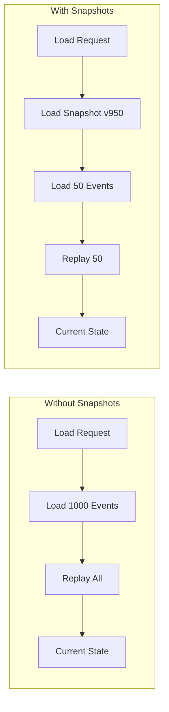

# Snapshots

Snapshots optimize loading for aggregates with many events by storing periodic state captures.

## Before You Start

- **.NET 8.0+** (or .NET 9/10 for latest features)
- Install the required packages:
  ```bash
  dotnet add package Excalibur.EventSourcing
  dotnet add package Excalibur.EventSourcing.SqlServer  # or your provider
  ```
- Familiarity with [event stores](./event-store.md) and [repositories](./repositories.md)

## Overview



## Configuration

### Basic Setup

```csharp
// Option 1: All-in-one SQL Server setup (recommended)
services.AddSqlServerEventSourcing(connectionString);

// Option 2: Configure with options
services.AddSqlServerEventSourcing(options =>
{
    options.ConnectionString = connectionString;
    options.RegisterHealthChecks = true;
});

// Option 3: Register stores separately
services.AddSqlServerEventStore(connectionString);
services.AddSqlServerSnapshotStore(connectionString);

// Configure snapshot strategy via event sourcing builder
services.AddExcaliburEventSourcing(builder =>
{
    builder.UseIntervalSnapshots(100); // Every 100 events
});
```

### Snapshot Strategies

```csharp
services.AddExcaliburEventSourcing(builder =>
{
    // Interval-based (default) - snapshot every N events
    builder.UseIntervalSnapshots(100);

    // Time-based - snapshot if older than duration
    builder.UseTimeBasedSnapshots(TimeSpan.FromDays(7));

    // Size-based - snapshot when aggregate exceeds size threshold
    builder.UseSizeBasedSnapshots(maxSizeInBytes: 1024 * 1024); // 1MB

    // Composite - combine multiple strategies
    builder.UseCompositeSnapshotStrategy(s => s
        .AddIntervalStrategy(100)
        .AddTimeBasedStrategy(TimeSpan.FromDays(7))
        .RequireAll(false)); // Any condition triggers snapshot

    // No snapshots (explicit opt-out)
    builder.UseNoSnapshots();

    // Custom strategy
    builder.AddSnapshotStrategy<MyCustomStrategy>();
});
```

## Implementing Snapshots

### Define Snapshot State Type

Define a serializable type for your aggregate's state. This is NOT the `ISnapshot` interface - it's your domain state that will be serialized into the snapshot's `Data` property:

```csharp
// Domain state to be serialized - NOT ISnapshot
public record OrderSnapshotState
{
    public required Guid OrderId { get; init; }
    public required string CustomerId { get; init; }
    public required OrderStatus Status { get; init; }
    public required decimal TotalAmount { get; init; }
    public required List<OrderLineState> Lines { get; init; }
}

public record OrderLineState(
    Guid LineId,
    string ProductId,
    int Quantity,
    decimal UnitPrice);
```

### Override Snapshot Methods

The `ISnapshot` interface uses `byte[] Data` for serialized state. Use the built-in `Snapshot` record:

```csharp
public class Order : AggregateRoot<Guid>
{
    public string CustomerId { get; private set; }
    public OrderStatus Status { get; private set; }
    public decimal TotalAmount { get; private set; }
    private readonly List<OrderLine> _lines = [];

    // Override to create snapshot from current state
    public override ISnapshot CreateSnapshot()
    {
        // Create domain state object
        var state = new OrderSnapshotState
        {
            OrderId = Id,
            CustomerId = CustomerId,
            Status = Status,
            TotalAmount = TotalAmount,
            Lines = _lines.Select(l => new OrderLineState(
                l.Id, l.ProductId, l.Quantity, l.UnitPrice
            )).ToList()
        };

        // Serialize state to bytes and wrap in Snapshot using factory method
        return Snapshot.Create(
            aggregateId: Id.ToString(),
            version: Version,
            data: JsonSerializer.SerializeToUtf8Bytes(state),
            aggregateType: nameof(Order));
    }

    // Override to restore state from snapshot
    protected override void ApplySnapshot(ISnapshot snapshot)
    {
        // Deserialize state from snapshot Data
        var state = JsonSerializer.Deserialize<OrderSnapshotState>(snapshot.Data)
            ?? throw new InvalidOperationException("Failed to deserialize snapshot");

        Id = state.OrderId;
        CustomerId = state.CustomerId;
        Status = state.Status;
        TotalAmount = state.TotalAmount;
        _lines.Clear();
        _lines.AddRange(state.Lines.Select(l =>
            new OrderLine(l.LineId, l.ProductId, l.Quantity, l.UnitPrice)));
    }

    // ... rest of aggregate implementation
}
```

> **Note:** The base `LoadFromSnapshot` method handles version assignment and calls `ApplySnapshot`. Override `ApplySnapshot` (not `LoadFromSnapshot`) to restore your aggregate's state.

## Repository Integration

The repository automatically uses snapshots:

```csharp
public class EventSourcedRepository<TAggregate, TKey> : IEventSourcedRepository<TAggregate, TKey>
    where TAggregate : AggregateRoot<TKey>
{
    public async Task<TAggregate?> GetByIdAsync(TKey id, CancellationToken ct)
    {
        var aggregateId = id!.ToString()!;
        TAggregate aggregate;

        // Try to load snapshot first
        var snapshot = await _snapshotStore.GetLatestSnapshotAsync(
            aggregateId, typeof(TAggregate).Name, ct);

        if (snapshot is not null)
        {
            aggregate = CreateInstance();
            aggregate.LoadFromSnapshot(snapshot);

            // Load only events after snapshot
            var events = await _eventStore.LoadAsync(
                aggregateId, typeof(TAggregate).Name, snapshot.Version, ct);
            aggregate.LoadFromHistory(DeserializeEvents(events));

            return aggregate;
        }

        // No snapshot - load all events
        var allEvents = await _eventStore.LoadAsync(
            aggregateId, typeof(TAggregate).Name, ct);
        if (!allEvents.Any())
            return null;

        aggregate = CreateInstance();
        aggregate.LoadFromHistory(DeserializeEvents(allEvents));
        return aggregate;
    }

    public async Task SaveAsync(TAggregate aggregate, CancellationToken ct)
    {
        // Append events
        var uncommittedEvents = aggregate.GetUncommittedEvents();
        var result = await _eventStore.AppendAsync(
            aggregate.Id,
            aggregate.AggregateType,
            uncommittedEvents,
            aggregate.Version - uncommittedEvents.Count,
            ct);

        if (!result.Success)
            throw new ConcurrencyException(result.ErrorMessage);

        aggregate.MarkEventsAsCommitted();

        // Check if snapshot needed
        if (_snapshotStrategy.ShouldCreateSnapshot(aggregate))
        {
            var snapshot = aggregate.CreateSnapshot();
            await _snapshotStore.SaveSnapshotAsync(snapshot, ct);
        }
    }
}
```

## Snapshot Store Interface

```csharp
public interface ISnapshotStore
{
    ValueTask<ISnapshot?> GetLatestSnapshotAsync(
        string aggregateId,
        string aggregateType,
        CancellationToken cancellationToken);

    ValueTask SaveSnapshotAsync(
        ISnapshot snapshot,
        CancellationToken cancellationToken);

    ValueTask DeleteSnapshotsAsync(
        string aggregateId,
        string aggregateType,
        CancellationToken cancellationToken);

    ValueTask DeleteSnapshotsOlderThanAsync(
        string aggregateId,
        string aggregateType,
        long olderThanVersion,
        CancellationToken cancellationToken);
}
```

> **Note:** Methods return `ValueTask` to avoid allocations for synchronous completions.

## Database Schema

### SQL Server

```sql
CREATE TABLE [snapshots].[Snapshots] (
    [Id] BIGINT IDENTITY(1,1) NOT NULL,
    [AggregateId] NVARCHAR(100) NOT NULL,
    [AggregateType] NVARCHAR(500) NOT NULL,
    [Version] BIGINT NOT NULL,
    [SnapshotData] NVARCHAR(MAX) NOT NULL,
    [CreatedAt] DATETIME2 NOT NULL DEFAULT GETUTCDATE(),

    CONSTRAINT [PK_Snapshots] PRIMARY KEY CLUSTERED ([Id]),
    CONSTRAINT [UQ_Snapshots_Aggregate] UNIQUE ([AggregateId])
);

CREATE INDEX [IX_Snapshots_AggregateId] ON [snapshots].[Snapshots] ([AggregateId]);
```

## Custom Snapshot Strategies

```csharp
public class AdaptiveSnapshotStrategy : ISnapshotStrategy
{
    public int MinInterval { get; init; } = 50;
    public int MaxInterval { get; init; } = 200;
    public int EventSizeThreshold { get; init; } = 1000; // bytes

    public bool ShouldCreateSnapshot<T>(T aggregate) where T : IAggregateRoot
    {
        var eventCount = aggregate.UncommittedEvents.Count;
        var version = aggregate.Version;

        // More frequent snapshots for aggregates with large events
        var averageEventSize = EstimateAverageEventSize(aggregate.UncommittedEvents);
        var interval = averageEventSize > EventSizeThreshold
            ? MinInterval
            : MaxInterval;

        return version > 0 && version % interval == 0;
    }
}
```

## Snapshot Versioning

Handle snapshot schema changes by versioning your snapshot state types. Since snapshots store serialized `byte[]` data, you can evolve the schema by handling deserialization gracefully.

### Current Approach: Graceful Deserialization

```csharp
// Version your snapshot state types (NOT ISnapshot - that's the envelope)
public record OrderSnapshotStateV1
{
    public Guid OrderId { get; init; }
    public string CustomerId { get; init; }
    public decimal TotalAmount { get; init; }
}

public record OrderSnapshotStateV2
{
    public Guid OrderId { get; init; }
    public string CustomerId { get; init; }
    public decimal TotalAmount { get; init; }
    // V2 adds new field with default
    public Address? ShippingAddress { get; init; }
}

// In your aggregate, handle both versions during deserialization
protected override void ApplySnapshot(ISnapshot snapshot)
{
    // Try V2 first (current version)
    var state = TryDeserialize<OrderSnapshotStateV2>(snapshot.Data);

    if (state is null)
    {
        // Fall back to V1 and upgrade
        var v1 = JsonSerializer.Deserialize<OrderSnapshotStateV1>(snapshot.Data);
        state = new OrderSnapshotStateV2
        {
            OrderId = v1!.OrderId,
            CustomerId = v1.CustomerId,
            TotalAmount = v1.TotalAmount,
            ShippingAddress = null // Default for new field
        };
    }

    // Apply state
    Id = state.OrderId;
    CustomerId = state.CustomerId;
    TotalAmount = state.TotalAmount;
    ShippingAddress = state.ShippingAddress;
}
```

### Declarative Snapshot Upgraders

For formal version migrations, use the `SnapshotUpgrader<TFrom, TTo>` base class and `SnapshotVersionManager`:

```csharp
// Implement a typed upgrader
public class OrderSnapshotV1ToV2 : SnapshotUpgrader<OrderSnapshotStateV1, OrderSnapshotStateV2>
{
    public OrderSnapshotV1ToV2(ISnapshotDataSerializer serializer) : base(serializer) { }

    public override string AggregateType => "Order";
    public override int FromVersion => 1;
    public override int ToVersion => 2;

    protected override OrderSnapshotStateV2 UpgradeSnapshot(OrderSnapshotStateV1 old)
        => new()
        {
            OrderId = old.OrderId,
            CustomerId = old.CustomerId,
            TotalAmount = old.TotalAmount,
            ShippingAddress = null // Default for new field
        };
}

// Register in DI
services.AddExcaliburEventSourcing(builder => builder
    .AddSnapshotUpgrading(upgrading => upgrading
        .RegisterUpgrader(new OrderSnapshotV1ToV2(serializer))
        .SetCurrentVersion(2)
        .EnableAutoUpgradeOnLoad()));
```

The `SnapshotVersionManager` uses BFS to find the shortest upgrade path between any two versions, supporting multi-hop migrations (e.g., v1 &rarr; v2 &rarr; v3). Schema version is stored in the snapshot's `Metadata["SnapshotSchemaVersion"]` key.

## Performance Considerations

### When to Use Snapshots

| Scenario | Recommendation |
|----------|----------------|
| < 100 events | Don't use snapshots |
| 100-500 events | Optional, depends on event complexity |
| 500+ events | Strongly recommended |
| Long-running aggregates | Required |

### Snapshot Size

Keep snapshot state types small (these are serialized into `ISnapshot.Data`):

```csharp
// Good - only essential state
public record OrderSnapshotState
{
    public required Guid OrderId { get; init; }
    public required string CustomerId { get; init; }
    public required OrderStatus Status { get; init; }
    public required decimal TotalAmount { get; init; }
    public required List<OrderLineState> Lines { get; init; }
}

// Bad - too much data
public record OrderSnapshotState
{
    public required Guid OrderId { get; init; }
    public Customer? Customer { get; init; }           // Don't embed other aggregates
    public List<Order>? RelatedOrders { get; init; }   // Don't include relationships
    public AuditLog? History { get; init; }            // Don't duplicate event data
}
```

> **Note:** Your state type is serialized into the `ISnapshot.Data` byte array. The `ISnapshot` interface is the envelope - you don't implement it directly for your state.

## Testing with Snapshots

### Unit Test: Snapshot Round-Trip

```csharp
public class OrderSnapshotTests
{
    [Fact]
    public void Snapshot_RestoresState_Correctly()
    {
        // Arrange
        var order = Order.Create(Guid.NewGuid(), "customer-1");
        order.AddLine("product-1", 2, 10.00m);
        order.AddLine("product-2", 1, 25.00m);
        order.Submit();

        // Act
        var snapshot = order.CreateSnapshot();
        var restored = Order.Create(order.Id, "");  // Create empty aggregate
        restored.LoadFromSnapshot(snapshot);

        // Assert
        restored.Id.Should().Be(order.Id);
        restored.CustomerId.Should().Be(order.CustomerId);
        restored.Status.Should().Be(order.Status);
        restored.TotalAmount.Should().Be(order.TotalAmount);
        restored.Lines.Should().HaveCount(2);
    }
}
```

### Integration Test: Repository with Snapshots

For integration tests, use DI to wire up the full repository:

```csharp
public class OrderRepositorySnapshotTests : IClassFixture<WebApplicationFactory<Program>>
{
    private readonly IServiceProvider _services;

    public OrderRepositorySnapshotTests(WebApplicationFactory<Program> factory)
    {
        _services = factory.Services;
    }

    [Fact]
    public async Task Repository_UsesSnapshot_WhenAvailable()
    {
        // Arrange
        using var scope = _services.CreateScope();
        var repository = scope.ServiceProvider
            .GetRequiredService<IEventSourcedRepository<Order, Guid>>();

        var order = Order.Create(Guid.NewGuid(), "customer-1");
        for (int i = 0; i < 150; i++)
            order.AddLine($"product-{i}", 1, 10.00m);
        await repository.SaveAsync(order, CancellationToken.None);

        // Act - loading should use snapshot after threshold
        var loaded = await repository.GetByIdAsync(order.Id, CancellationToken.None);

        // Assert
        loaded.Should().NotBeNull();
        loaded!.Lines.Should().HaveCount(150);
    }
}
```

### Testing Setup with In-Memory Stores

```csharp
// In your test fixture or Startup
services.AddExcaliburEventSourcing(builder =>
{
    builder.UseIntervalSnapshots(100);
    builder.AddRepository<Order, Guid>();
});

// Register in-memory stores for testing
services.AddSingleton<IEventStore, InMemoryEventStore>();
services.AddSingleton<ISnapshotStore, InMemorySnapshotStore>();
```

## Next Steps

- [Event Store](event-store.md) — Understand event persistence
- [Projections](projections.md) — Build read models
- [Event Versioning](versioning.md) — Handle schema evolution

## See Also

- [Repositories](./repositories.md) — How repositories integrate with the snapshot store during loading and saving
- [Snapshot Setup](../configuration/snapshot-setup.md) — Step-by-step configuration guide for snapshot providers
- [Caching](../performance/caching.md) — Complementary caching strategies for read-model performance
- [Event Store Providers](./providers.md) — Provider-specific snapshot store implementations
