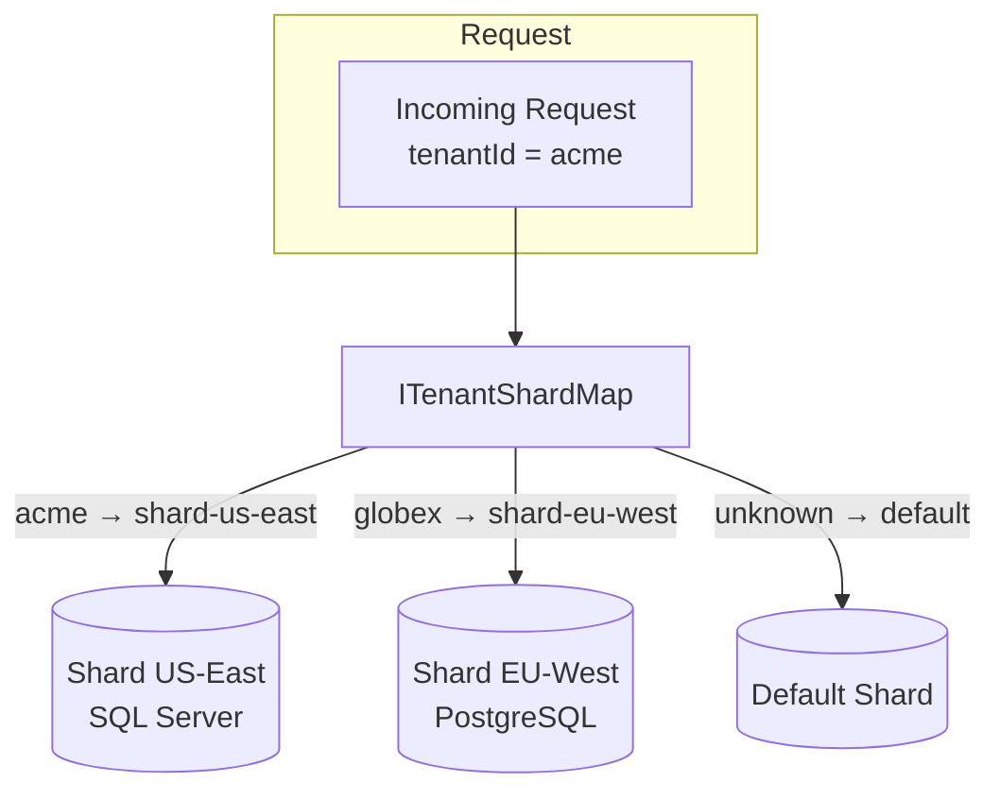
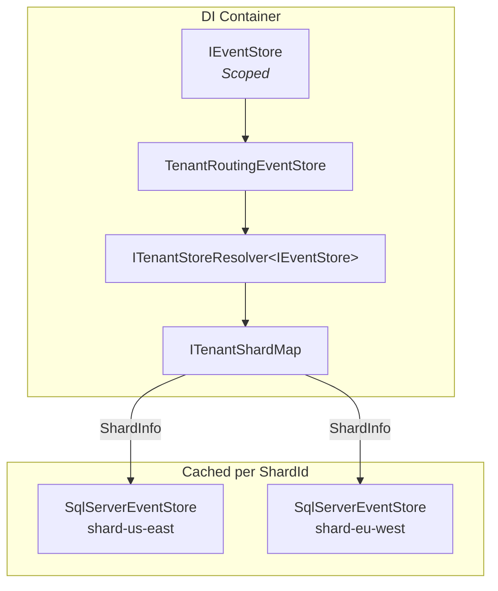

# Tenant Data Sharding

Route each tenant's data to a dedicated database shard for isolation, compliance, and scale.

## Before You Start

- **.NET 8.0+** (or .NET 9/10 for latest features)
- Install the core package and your provider:
  ```bash
  dotnet add package Excalibur.EventSourcing
  dotnet add package Excalibur.EventSourcing.SqlServer  # or .Postgres, etc.
  ```
- Familiarity with [event stores](./event-store.md) and [multi-tenancy concepts](../core-concepts/message-context.md)

## Overview

Tenant sharding splits data across multiple databases based on tenant identity. Each tenant is mapped to a **shard** -- a database instance with its own connection string, schema, and event store.



### When to Use Sharding

| Scenario | Recommendation |
|----------|---------------|
| Few tenants, shared database | No sharding needed |
| Regulatory data residency (GDPR, sovereignty) | Shard by region |
| Large tenants requiring isolation | Shard per tenant |
| 100K+ events/sec aggregate throughput | Shard for write scalability |

## Quick Start

### 1. Define Your Shard Map

Register an `ITenantShardMap` that maps tenant IDs to `ShardInfo` records:

```csharp
services.AddSingleton<ITenantShardMap>(sp =>
{
    var shards = new Dictionary<string, ShardInfo>
    {
        ["shard-us-east"] = new ShardInfo(
            ShardId: "shard-us-east",
            ConnectionString: "Server=us-east.db;Database=Events;..."),
        ["shard-eu-west"] = new ShardInfo(
            ShardId: "shard-eu-west",
            ConnectionString: "Server=eu-west.db;Database=Events;...",
            Region: "eu-west-1"),
    };

    var tenantMappings = new Dictionary<string, string>
    {
        ["acme"] = "shard-us-east",
        ["globex"] = "shard-eu-west",
    };

    var options = new ShardMapOptions
    {
        EnableTenantSharding = true,
        DefaultShardId = "shard-us-east",  // Unknown tenants go here
    };

    return new InMemoryTenantShardMap(shards, tenantMappings, options);
});
```

### 2. Enable Sharding and Register Provider

```csharp
services.AddExcaliburEventSourcing(builder =>
{
    // Step 1: Enable tenant sharding
    builder.EnableTenantSharding(options =>
    {
        options.EnableTenantSharding = true;
        options.DefaultShardId = "shard-us-east";
    });

    // Step 2: Register the provider-specific resolver
    builder.UseSqlServerTenantEventStore();
});
```

That's it. `IEventStore` is now scoped per-request and routes to the correct shard based on the current tenant.

## Core Abstractions

### ShardInfo

A record describing a single shard's connection and routing metadata:

```csharp
public sealed record ShardInfo(
    string ShardId,
    string ConnectionString,
    string? SchemaName = null,      // Schema-per-tenant (SQL Server: dbo, Postgres: public)
    string? DatabaseName = null,     // Database-per-tenant isolation
    string? IndexPrefix = null,      // Document/search store prefix (Elasticsearch, CosmosDB)
    string? Region = null);          // Geo-distributed shard hint
```

### ITenantShardMap

Resolves shard routing for a tenant. Must be fast (< 1us target) since it's on the hot path of every data operation:

```csharp
public interface ITenantShardMap
{
    ShardInfo GetShardInfo(string tenantId);
}
```

When a tenant is not found and no `DefaultShardId` is configured, throws `TenantShardNotFoundException`.

### ITenantStoreResolver&lt;TStore&gt;

Provider-specific resolver that creates and caches store instances per shard:

```csharp
public interface ITenantStoreResolver<out TStore>
{
    TStore Resolve(string tenantId);
}
```

Resolvers use `ConcurrentDictionary<string, TStore>` internally -- each shard's store is created once and cached as a singleton.

## Provider Support

Each provider has a dedicated extension method that registers its `ITenantStoreResolver<IEventStore>`:

| Provider | Package | Extension Method |
|----------|---------|------------------|
| **SQL Server** | `Excalibur.EventSourcing.SqlServer` | `builder.UseSqlServerTenantEventStore()` |
| **PostgreSQL** | `Excalibur.EventSourcing.Postgres` | `builder.UsePostgresTenantEventStore()` |
| **MongoDB** | `Excalibur.EventSourcing.MongoDB` | `builder.UseMongoDbTenantEventStore()` |
| **Cosmos DB** | `Excalibur.EventSourcing.CosmosDb` | `builder.UseCosmosDbTenantEventStore()` |
| **DynamoDB** | `Excalibur.EventSourcing.DynamoDb` | `builder.UseDynamoDbTenantEventStore()` |
| **Firestore** | `Excalibur.EventSourcing.Firestore` | `builder.UseFirestoreTenantEventStore()` |
| **Elasticsearch** | `Excalibur.Data.ElasticSearch` | `builder.UseElasticSearchTenantProjectionStore<T>()` |

### SQL Server Example

```csharp
services.AddExcaliburEventSourcing(builder =>
{
    builder.EnableTenantSharding(opts => opts.EnableTenantSharding = true);
    builder.UseSqlServerTenantEventStore();
    // Schema defaults to dbo; override via ShardInfo.SchemaName per shard
});
```

### PostgreSQL Example

```csharp
services.AddExcaliburEventSourcing(builder =>
{
    builder.EnableTenantSharding(opts => opts.EnableTenantSharding = true);
    builder.UsePostgresTenantEventStore();
    // Schema defaults to public; override via ShardInfo.SchemaName per shard
    // Each shard gets its own NpgsqlDataSource for connection pooling
});
```

## ShardMapOptions

| Option | Default | Description |
|--------|---------|-------------|
| `EnableTenantSharding` | `false` | Master switch. When `false`, sharding is a no-op |
| `DefaultShardId` | `null` | Shard ID for unknown tenants. When `null`, unknown tenants throw `TenantShardNotFoundException` |

## Automatic Tenant Placement

When a new tenant arrives that isn't in the shard map, `ITenantPlacementStrategy` selects which shard to assign it to:

```csharp
public interface ITenantPlacementStrategy
{
    string SelectShard(string tenantId, IReadOnlyCollection<string> availableShardIds);
}
```

Two built-in strategies:

| Strategy | Algorithm | Best For |
|----------|-----------|----------|
| `RoundRobinPlacementStrategy` | Cycles through shards sequentially (Interlocked counter) | Even distribution when tenants arrive at steady rate |
| `LeastLoadedPlacementStrategy` | Picks shard with fewest assigned tenants (atomic find-min + increment) | Balancing when shard sizes vary |

```csharp
// Register a placement strategy
services.AddSingleton<ITenantPlacementStrategy, LeastLoadedPlacementStrategy>();
```

Both implementations are thread-safe and suitable for concurrent request handling.

## Shared-Shard Tenant Filtering

When multiple tenants share the same physical database (shared-shard model), use `ITenantFilteredEventStore` to add tenant-level WHERE clauses:

```csharp
public interface ITenantFilteredEventStore
{
    ValueTask<IReadOnlyList<StoredEvent>> LoadByTenantAsync(
        string aggregateId, string aggregateType, string tenantId, CancellationToken ct);
    ValueTask<AppendResult> AppendByTenantAsync(
        string aggregateId, string aggregateType, string tenantId,
        IEnumerable<IDomainEvent> events, long expectedVersion, CancellationToken ct);
}
```

This is distinct from `ITenantStoreResolver` (which routes to entirely different databases). The routing layer checks for this interface via `GetService<ITenantFilteredEventStore>` and delegates when available.

## Integration with Other Features

### Partitioned Outbox

When sharding is enabled, the outbox can be partitioned per shard automatically using `OutboxPartitionStrategy.PerShard`:

```csharp
builder.UsePartitionedOutbox(opts =>
{
    opts.Strategy = OutboxPartitionStrategy.PerShard;
});
```

Each shard gets its own outbox table and processor. See [Partitioned Outbox](../patterns/outbox.md#partitioned-outbox).

### Saga Routing

`TenantRoutingSagaStore` decorates `ISagaStore` to route saga persistence to the initiating tenant's shard. Sagas are stored in the same database as their tenant's events.

### Health Checks

`TenantShardHealthCheck` verifies shard map operational status:

```csharp
services.AddHealthChecks()
    .AddCheck<TenantShardHealthCheck>("tenant-shards");
```

Reports:
- **Healthy** when all shards are reachable
- **Degraded** when some shards are unreachable
- **Unhealthy** when no shards are reachable

The health check iterates all registered shard IDs and probes each via `ITenantStoreResolver` for actual connectivity verification.

## Architecture



Key design points:
- `IEventStore` is re-registered as **Scoped** (per-request) when sharding is enabled
- `TenantRoutingEventStore` resolves the current tenant and delegates to the correct shard's store
- Store instances are **cached per shard ID** via `ConcurrentDictionary` -- not per tenant
- ADO.NET manages connection pooling per connection string automatically

## Best Practices

| Practice | Recommendation |
|----------|---------------|
| **Default shard** | Set `DefaultShardId` during migration; remove it once all tenants are mapped |
| **Connection pooling** | ADO.NET pools per connection string. Each shard ID = 1 pool |
| **Schema isolation** | Use `ShardInfo.SchemaName` for schema-per-tenant within a shared database |
| **Shard map source** | Load from config, database, or service discovery. Refresh on interval for dynamic sharding |
| **Monitoring** | Register `TenantShardHealthCheck` and alert on unhealthy status |

## See Also

- [Event Store Providers](./providers.md) -- Provider-specific setup
- [Outbox Pattern](../patterns/outbox.md) -- Partitioned outbox with sharding
- [Projections](./projections.md) -- Parallel catch-up with sharding
