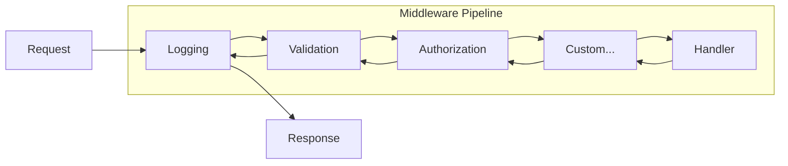

---
sidebar_position: 1
title: Middleware
description: Cross-cutting concerns with the Dispatch middleware pipeline
---

# Middleware

Middleware components process messages before and after handlers, providing cross-cutting concerns like logging, validation, and authorization.

## Before You Start

- **.NET 8.0+** (or .NET 9/10 for latest features)
- Install the required package:
  ```bash
  dotnet add package Excalibur.Dispatch
  ```
- Familiarity with [handlers](../handlers.md) and [pipeline concepts](../pipeline/index.md)

## Overview



## Quick Start

### Register Middleware

```csharp
builder.Services.AddDispatch(dispatch =>
{
    dispatch.AddHandlersFromAssembly(typeof(Program).Assembly);

    // Configure middleware pipeline
    dispatch.ConfigurePipeline("Default", pipeline =>
    {
        pipeline.Use<LoggingMiddleware>();
        pipeline.Use<ValidationMiddleware>();
        pipeline.Use<AuthorizationMiddleware>();
    });
});
```

### Create Custom Middleware

```csharp
public class TimingMiddleware : IDispatchMiddleware
{
    private readonly ILogger<TimingMiddleware> _logger;

    public TimingMiddleware(ILogger<TimingMiddleware> logger)
    {
        _logger = logger;
    }

    public DispatchMiddlewareStage? Stage => DispatchMiddlewareStage.Logging;

    public async ValueTask<IMessageResult> InvokeAsync(
        IDispatchMessage message,
        IMessageContext context,
        DispatchRequestDelegate next,
        CancellationToken ct)
    {
        var sw = Stopwatch.StartNew();

        // Call next middleware
        var result = await next(message, context, ct);

        sw.Stop();
        _logger.LogInformation(
            "{MessageType} completed in {ElapsedMs}ms",
            message.GetType().Name,
            sw.ElapsedMilliseconds);

        return result;
    }
}
```

## Middleware Stages

Middleware executes in defined stages for consistent ordering:

| Stage | Order | Purpose |
|-------|-------|---------|
| `Start` | 0 | Pipeline starting point |
| `RateLimiting` | 50 | Throttle requests |
| `PreProcessing` | 100 | Early processing, enrichment |
| `Instrumentation` | 150 | Performance metrics, telemetry |
| `Authentication` | 175 | Verify identity |
| `Logging` | 190 | Structured logging |
| `Validation` | 200 | Input validation |
| `Serialization` | 250 | Message serialization |
| `Authorization` | 300 | Permission checks |
| `Cache` | 400 | Response caching |
| `Optimization` | 450 | Batching, bulk operations |
| `Routing` | 500 | Message routing |
| `Processing` | 600 | Handler execution |
| `PostProcessing` | 700 | Result processing |
| `Error` | 800 | Exception handling |
| `ErrorHandling` | 801 | Exception handling (alias) |
| `End` | 1000 | Pipeline final stage |

### Stage Assignment

```csharp
public class MyMiddleware : IDispatchMiddleware
{
    // Explicit stage
    public DispatchMiddlewareStage? Stage => DispatchMiddlewareStage.Validation;

    // Or null for default ordering
    // public DispatchMiddlewareStage? Stage => null;
}
```

### Custom Stage Ordering

```csharp
builder.Services.AddDispatch(dispatch =>
{
    dispatch.AddHandlersFromAssembly(typeof(Program).Assembly);

    dispatch.ConfigurePipeline("Default", pipeline =>
    {
        // Add at specific stage
        pipeline.UseAt<CustomMiddleware>(DispatchMiddlewareStage.PreProcessing);

        // Middleware is ordered by stage - set the Stage property
        // on your middleware class to control execution order
        pipeline.Use<CustomMiddleware>();
    });
});
```

## Built-in Middleware

| Middleware | Stage | Package | Description |
|------------|-------|---------|-------------|
| `LoggingMiddleware` | Logging | Excalibur.Dispatch | Structured request/response logging |
| `ValidationMiddleware` | Validation | Excalibur.Dispatch | FluentValidation / DataAnnotations |
| `AspNetCoreAuthorizationMiddleware` | Authorization | Excalibur.Dispatch.Hosting.AspNetCore | ASP.NET Core `[Authorize]` policy bridge |
| `AuthorizationMiddleware` (A3) | Authorization | Excalibur.A3 | Activity-based `[RequirePermission]` authorization |
| `ExceptionMiddleware` | ErrorHandling | Excalibur.Dispatch | Exception to result conversion |
| `MetricsMiddleware` | Logging | Excalibur.Dispatch | OpenTelemetry metrics |
| `TracingMiddleware` | PreProcessing | Excalibur.Dispatch | Distributed tracing |

## Message Context

Access and modify the message context:

```csharp
public async ValueTask<IMessageResult> InvokeAsync(
    IDispatchMessage message,
    IMessageContext context,
    DispatchRequestDelegate next,
    CancellationToken ct)
{
    // Read direct properties (hot-path, preferred)
    var userId = context.UserId;
    var correlationId = context.CorrelationId;

    // Read/write custom items dictionary
    var customValue = context.GetItem<string>("CustomKey");
    context.SetItem("ProcessedAt", DateTime.UtcNow);

    // Access scoped services
    var db = context.RequestServices.GetRequiredService<IDbConnection>();

    return await next(message, context, ct);
}
```

## Short-Circuiting

Return early without calling the next middleware:

```csharp
public async ValueTask<IMessageResult> InvokeAsync(
    IDispatchMessage message,
    IMessageContext context,
    DispatchRequestDelegate next,
    CancellationToken ct)
{
    // Check cache
    if (TryGetCached(message, out var cached))
    {
        return cached; // Short-circuit - don't call next
    }

    // Continue pipeline
    var result = await next(message, context, ct);

    // Cache result
    Cache(message, result);

    return result;
}
```

## Conditional Middleware

Apply middleware based on conditions:

```csharp
builder.Services.AddDispatch(dispatch =>
{
    dispatch.AddHandlersFromAssembly(typeof(Program).Assembly);

    dispatch.ConfigurePipeline("Default", pipeline =>
    {
        // Only in development
        pipeline.UseWhen<DebugMiddleware>(
            sp => sp.GetRequiredService<IHostEnvironment>().IsDevelopment());

        // Only for specific message types
        pipeline.UseWhen<AuditMiddleware>(
            message => message is IDispatchAction);

        // Based on configuration
        pipeline.UseWhen<FeatureMiddleware>(
            sp => sp.GetRequiredService<IConfiguration>()
                .GetValue<bool>("Features:NewFeature"));
    });
});
```

## In This Section

- [Built-in Middleware](built-in.md) — Pre-built middleware components
- [Custom Middleware](custom.md) — Create your own middleware
- [Validation](validation.md) — Input validation patterns
- [Authorization](authorization.md) — Permission and policy checks
- [Serialization](serialization.md) — Message serialization options

## See Also

- [Pipeline](../pipeline/index.md) - Full pipeline architecture and stages
- [Handlers](../handlers.md) - Action and event handlers
- [Transports](../transports/index.md) - Transport-level middleware integration
