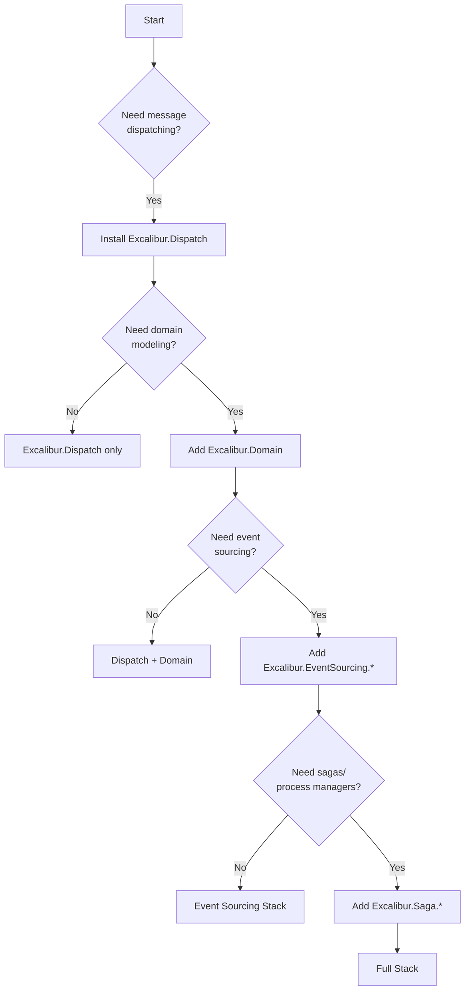

# Package Guide

Excalibur is one framework with focused package families. Install only what your application needs — every package beyond `Excalibur.Dispatch` is optional.

## Quick Summary

| Package Family | Purpose | When to Add |
|----------------|---------|-------------|
| `Excalibur.Dispatch.*` | Messaging, pipeline, handlers, transports | Always — this is the foundation |
| `Excalibur.Domain` | Aggregates, entities, value objects | When you need rich domain modeling |
| `Excalibur.EventSourcing.*` | Event stores, snapshots, persistence | When you need event sourcing |
| `Excalibur.Saga.*` | Sagas and process managers | When you need long-running workflows |
| `Excalibur.Hosting.*` | ASP.NET Core, serverless hosting | When you need opinionated hosting templates |
| `Excalibur.LeaderElection.*` | Distributed coordination | When you need single-leader guarantees |

:::tip Key Rule
All packages share the `Excalibur.*` namespace. You never rewrite existing code when adding new capabilities — just install additional packages.
:::

---

## Decision Flowchart



---

## Scenario-Based Package Selection

| If You're Building... | Install These |
|----------------------|---------------|
| Simple API with handlers (MediatR replacement) | `Excalibur.Dispatch`, `Excalibur.Dispatch.Abstractions` |
| Message-driven microservices with Kafka | + `Excalibur.Dispatch.Transport.Kafka` |
| DDD application with aggregates | + `Excalibur.Domain` |
| Event-sourced system | + `Excalibur.EventSourcing`, `Excalibur.EventSourcing.SqlServer` |
| CQRS with projections | + `Excalibur.Caching` |
| Long-running workflows | + `Excalibur.Saga`, `Excalibur.Saga.SqlServer` |
| Azure Functions serverless | `Excalibur.Dispatch.Hosting.AzureFunctions` |
| AWS Lambda serverless | `Excalibur.Dispatch.Hosting.AwsLambda` |
| Production ASP.NET Core app | + `Excalibur.Hosting.Web` |
| SOC2/GDPR compliant system | + `Excalibur.Dispatch.Compliance.*`, `Excalibur.Dispatch.AuditLogging.*` |

---

## Hosting Packages

| Deployment Model | Package | Notes |
|------------------|---------|-------|
| **Console App** | `Excalibur.Dispatch` | Minimal |
| **ASP.NET Core** | `Excalibur.Dispatch.Hosting.AspNetCore` + `Excalibur.Hosting.Web` | Full hosting |
| **Worker Service** | `Excalibur.Dispatch` + `Excalibur.Hosting` | Background jobs |
| **Azure Functions** | `Excalibur.Dispatch.Hosting.AzureFunctions` | Serverless |
| **AWS Lambda** | `Excalibur.Dispatch.Hosting.AwsLambda` | Serverless |
| **Google Cloud Functions** | `Excalibur.Dispatch.Hosting.GoogleCloudFunctions` | Serverless |

---

## Compliance & Audit Packages

| Package | Purpose |
|---------|---------|
| `Excalibur.Dispatch.Compliance.*` | Compliance scanning, audit trail |
| `Excalibur.Dispatch.AuditLogging.Datadog` | Datadog SIEM integration |
| `Excalibur.Dispatch.AuditLogging.Sentinel` | Microsoft Sentinel integration |
| `Excalibur.Dispatch.AuditLogging.Splunk` | Splunk integration |
| `Excalibur.Compliance.SqlServer` | Key escrow persistence |

---

## Gradual Adoption Path

### Phase 1: Messaging (MediatR Replacement)

```bash
dotnet add package Excalibur.Dispatch
dotnet add package Excalibur.Dispatch.Abstractions
```

```csharp
// Program.cs
services.AddDispatch(dispatch =>
{
    dispatch.AddHandlersFromAssembly(typeof(Program).Assembly);
});
```

```csharp
// Define action
public record CreateOrderAction(string CustomerId, decimal Amount) : IDispatchAction;

// Define handler
public class CreateOrderHandler : IActionHandler<CreateOrderAction>
{
    public async Task HandleAsync(CreateOrderAction action, CancellationToken ct)
    {
        // Business logic
    }
}

// Dispatch
await dispatcher.DispatchAsync(new CreateOrderAction("cust-123", 99.99m), ct);
```

**This alone replaces MediatR.**

---

### Phase 2: Add Domain Modeling

When you need rich domain models with aggregates:

```bash
dotnet add package Excalibur.Domain
```

```csharp
public class Order : AggregateRoot<Guid>
{
    public OrderStatus Status { get; private set; }

    public static Order Create(string customerId, decimal amount)
    {
        var order = new Order();
        order.RaiseEvent(new OrderCreatedEvent(Guid.NewGuid(), customerId, amount));
        return order;
    }

    public void Confirm()
    {
        if (Status != OrderStatus.Pending)
            throw new InvalidOperationException("Order must be pending");
        RaiseEvent(new OrderConfirmedEvent(Id));
    }

    protected override void ApplyEventInternal(IDomainEvent @event) => _ = @event switch
    {
        OrderCreatedEvent e => ApplyEvent(e),
        OrderConfirmedEvent e => ApplyEvent(e),
        _ => false
    };

    private bool ApplyEvent(OrderCreatedEvent e) { Id = e.OrderId; Status = OrderStatus.Pending; return true; }
    private bool ApplyEvent(OrderConfirmedEvent e) { Status = OrderStatus.Confirmed; return true; }
}
```

---

### Phase 3: Add Event Sourcing

When you need to persist events and rebuild state:

```bash
dotnet add package Excalibur.EventSourcing
dotnet add package Excalibur.EventSourcing.SqlServer
dotnet add package Excalibur.Hosting
```

```csharp
// Program.cs — sensible defaults
services.AddExcalibur(excalibur =>
{
    excalibur.AddEventSourcing(es => es.UseEventStore<SqlServerEventStore>());
});
```

Need transports or custom pipelines? Call `AddDispatch` with a builder action:

```csharp
// Program.cs — with custom messaging configuration
services.AddDispatch(dispatch =>
{
    dispatch.AddHandlersFromAssembly(typeof(Program).Assembly);
    dispatch.UseRabbitMQ(rmq => rmq.HostName("localhost"));
});

services.AddExcalibur(excalibur =>
{
    excalibur.AddEventSourcing(es => es.UseEventStore<SqlServerEventStore>());
});
```

```csharp
// In handler
public class ConfirmOrderHandler : IActionHandler<ConfirmOrderAction>
{
    private readonly IEventSourcedRepository<Order> _repository;

    public ConfirmOrderHandler(IEventSourcedRepository<Order> repository)
    {
        _repository = repository;
    }

    public async Task HandleAsync(ConfirmOrderAction action, CancellationToken ct)
    {
        var order = await _repository.GetByIdAsync(action.OrderId, ct);
        order.Confirm();
        await _repository.SaveAsync(order, ct);
    }
}
```

---

### Phase 4: Full Stack

Add sagas, hosting templates, and compliance as needed:

```bash
dotnet add package Excalibur.Hosting.Web
dotnet add package Excalibur.Saga
dotnet add package Excalibur.Saga.SqlServer
```

```csharp
services.AddDispatch(dispatch =>
{
    dispatch.AddHandlersFromAssembly(typeof(Program).Assembly);
    dispatch.UseRabbitMQ(rmq => rmq.HostName("localhost"));
    dispatch.AddObservability();
    dispatch.AddResilience(res => res.DefaultRetryCount = 3);
});

services.AddExcalibur(excalibur =>
{
    excalibur
        .AddEventSourcing(es => es.UseEventStore<SqlServerEventStore>())
        .AddOutbox(outbox => outbox.UseSqlServer(connectionString))
        .AddSagas(opts => opts.EnableTimeouts = true)
        .AddLeaderElection(opts => opts.LeaseDuration = TimeSpan.FromSeconds(30));
});
```

---

## Package Ownership by Family

### Excalibur.Dispatch (Messaging)

| Category | Package | Examples |
|----------|---------|----------|
| Message dispatching | `Excalibur.Dispatch` | `IDispatcher`, `DispatchAsync()` |
| Message contracts | `Excalibur.Dispatch.Abstractions` | `IDomainEvent`, `IDispatchAction` |
| Pipeline | `Excalibur.Dispatch` | `IDispatchMiddleware` |
| Handlers | `Excalibur.Dispatch.Abstractions` | `IActionHandler<T>`, `IEventHandler<T>` |
| Context | `Excalibur.Dispatch` | `MessageContext`, correlation |
| Serialization | `Excalibur.Dispatch.Serialization.*` | MemoryPack, MessagePack |
| Transports | `Excalibur.Dispatch.Transport.*` | Kafka, RabbitMQ, Azure Service Bus |
| Observability | `Excalibur.Dispatch.Observability` | Metrics, tracing |
| Compliance | `Excalibur.Dispatch.Compliance.*` | Audit logging, SIEM |

### Excalibur (Domain & Persistence)

| Category | Package | Examples |
|----------|---------|----------|
| Domain modeling | `Excalibur.Domain` | `AggregateRoot<T>`, `Entity<T>` |
| Event sourcing | `Excalibur.EventSourcing` | `IEventStore`, `ISnapshotStore` |
| SQL Server persistence | `Excalibur.EventSourcing.SqlServer` | Event store implementation |
| Data access | `Excalibur.Data.Abstractions` | `IDataRequest`, `IDb` |
| Sagas | `Excalibur.Saga.*` | Process managers, orchestration |
| Hosting | `Excalibur.Hosting.*` | Web, Worker templates |
| Leader election | `Excalibur.LeaderElection.*` | Distributed coordination |
| Caching | `Excalibur.Caching` | Projection invalidation |

---

## Common Questions

### Can I use Excalibur.Dispatch without the other packages?

**Yes!** `Excalibur.Dispatch` is completely standalone. Use it as a MediatR replacement with zero additional dependencies.

### Do I need multiple packages for event sourcing?

**Yes.** `Excalibur.Dispatch` provides the message contracts (`IDomainEvent`), `Excalibur.Domain` provides aggregates, and `Excalibur.EventSourcing` provides the persistence (`IEventStore`).

### Which hosting package for serverless?

Use the serverless hosting packages (`Excalibur.Dispatch.Hosting.AzureFunctions`, `Excalibur.Dispatch.Hosting.AwsLambda`). They don't need the full hosting stack.

### Where do compliance features live?

In the `Excalibur.Dispatch.Compliance.*` and `Excalibur.Dispatch.AuditLogging.*` packages.

---

## See Also

- [Getting Started](./getting-started/) - Quick start tutorial
- [Handlers](handlers.md) - Handler patterns and best practices
- [Event Sourcing](./event-sourcing/index.md) - Event store patterns
- [Architecture Overview](./architecture/index.md) - Package architecture and boundaries
- [Patterns](patterns/index.md) - Outbox, Inbox, and more
