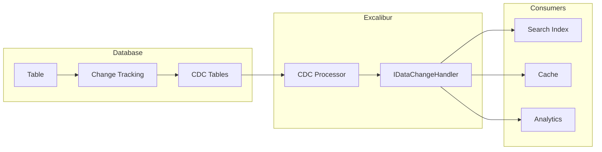

# Change Data Capture (CDC)

CDC captures row-level changes from your database and publishes them as events, enabling real-time data synchronization without modifying application code.

## Before You Start

- **.NET 8.0+** (or .NET 9/10 for latest features)
- Install the required packages:
  ```bash
  dotnet add package Excalibur.Data.SqlServer  # or Excalibur.Data.Postgres
  ```
- SQL Server CDC must be enabled on the database and target tables
- Familiarity with [event sourcing concepts](../event-sourcing/index.md) and [outbox pattern](./outbox.md)

## Overview



## Quick Start

### Enable CDC on Database

```sql
-- Enable CDC on database
EXEC sys.sp_cdc_enable_db;

-- Enable CDC on table
EXEC sys.sp_cdc_enable_table
    @source_schema = 'dbo',
    @source_name = 'Orders',
    @role_name = NULL,
    @supports_net_changes = 1;
```

### Configure CDC Processor

```csharp
using Excalibur.Cdc;

// Register CDC processor with fluent builder
services.AddCdcProcessor(cdc =>
{
    cdc.UseSqlServer(connectionString, sql =>
    {
        sql.SchemaName("Cdc")
           .StateTableName("CdcProcessingState")
           .PollingInterval(TimeSpan.FromSeconds(5))
           .BatchSize(100);
    })
    .TrackTable("dbo.Orders", table =>
    {
        table.MapInsert<OrderCreatedEvent>()
             .MapUpdate<OrderUpdatedEvent>()
             .MapDelete<OrderDeletedEvent>();
    })
    .EnableBackgroundProcessing();
});
```

## Table Tracking with Event Mapping

The recommended approach is to use the fluent builder API to configure table tracking and event mapping:

### Basic Table Tracking

```csharp
services.AddCdcProcessor(cdc =>
{
    cdc.UseSqlServer(connectionString)
       .TrackTable("dbo.Orders", table =>
       {
           // Map all change types to a single event
           table.MapAll<OrderChangedEvent>();
       })
       .EnableBackgroundProcessing();
});
```

### Separate Events per Change Type

```csharp
services.AddCdcProcessor(cdc =>
{
    cdc.UseSqlServer(connectionString)
       .TrackTable("dbo.Orders", table =>
       {
           table.MapInsert<OrderCreatedEvent>()
                .MapUpdate<OrderUpdatedEvent>()
                .MapDelete<OrderDeletedEvent>();
       })
       .TrackTable("dbo.Customers", table =>
       {
           table.MapAll<CustomerChangedEvent>();
       })
       .EnableBackgroundProcessing();
});
```

### Entity-Inferred Table Names

```csharp
services.AddCdcProcessor(cdc =>
{
    cdc.UseSqlServer(connectionString)
       .TrackTable<Order>(table => table.MapAll<OrderChangedEvent>())
       .TrackTable<Customer>(table => table.MapAll<CustomerChangedEvent>())
       .EnableBackgroundProcessing();
});
```

## Low-Level Handler Interface

For advanced scenarios requiring custom processing logic, implement `IDataChangeHandler`:

```csharp
using Excalibur.Data.SqlServer.Cdc;

public class OrderCdcHandler : IDataChangeHandler
{
    private readonly ISearchIndex _searchIndex;
    private readonly ICache _cache;

    public OrderCdcHandler(ISearchIndex searchIndex, ICache cache)
    {
        _searchIndex = searchIndex;
        _cache = cache;
    }

    // Specify which tables this handler processes
    public string[] TableNames => ["dbo.Orders"];

    public async Task HandleAsync(DataChangeEvent changeEvent, CancellationToken cancellationToken)
    {
        switch (changeEvent.ChangeType)
        {
            case DataChangeType.Insert:
                await HandleInsertAsync(changeEvent, cancellationToken);
                break;
            case DataChangeType.Update:
                await HandleUpdateAsync(changeEvent, cancellationToken);
                break;
            case DataChangeType.Delete:
                await HandleDeleteAsync(changeEvent, cancellationToken);
                break;
        }
    }

    private async Task HandleInsertAsync(DataChangeEvent changeEvent, CancellationToken ct)
    {
        // Use built-in extension methods on DataChangeEvent
        var orderId = changeEvent.GetNewValue<Guid>("OrderId");
        var customerId = changeEvent.GetNewValue<string>("CustomerId");
        var totalAmount = changeEvent.GetNewValue<decimal>("TotalAmount");

        await _searchIndex.IndexAsync(new OrderDocument
        {
            Id = orderId,
            CustomerId = customerId,
            Amount = totalAmount
        }, ct);

        await _cache.SetAsync($"order:{orderId}", changeEvent, ct);
    }

    private async Task HandleUpdateAsync(DataChangeEvent changeEvent, CancellationToken ct)
    {
        var orderId = changeEvent.GetNewValue<Guid>("OrderId");
        await _searchIndex.UpdateAsync(orderId, changeEvent, ct);
        await _cache.InvalidateAsync($"order:{orderId}", ct);
    }

    private async Task HandleDeleteAsync(DataChangeEvent changeEvent, CancellationToken ct)
    {
        // For deletes, use GetOldValue since NewValue is null
        var orderId = changeEvent.GetOldValue<Guid>("OrderId");
        await _searchIndex.DeleteAsync(orderId, ct);
        await _cache.InvalidateAsync($"order:{orderId}", ct);
    }
}

## DataChangeEvent Structure

The `DataChangeEvent` class provides complete information about each database change:

```csharp
public class DataChangeEvent
{
    // Log sequence number for ordering
    public byte[] Lsn { get; init; }

    // Sequence value within the transaction
    public byte[] SeqVal { get; init; }

    // When the transaction was committed
    public DateTime CommitTime { get; init; }

    // The table that changed
    public string TableName { get; init; }

    // Insert, Update, or Delete
    public DataChangeType ChangeType { get; init; }

    // Column-level changes
    public IList<DataChange> Changes { get; init; }
}

public class DataChange
{
    public string ColumnName { get; init; }
    public object? OldValue { get; init; }  // null for inserts
    public object? NewValue { get; init; }  // null for deletes
    public Type? DataType { get; init; }
}

public enum DataChangeType
{
    Unknown = 0,
    Insert = 1,
    Update = 2,
    Delete = 3
}
```

:::tip Built-in Extension Methods
The framework provides extension methods for extracting typed values from `DataChangeEvent`:

```csharp
// Get the new value (for inserts and updates)
var customerId = changeEvent.GetNewValue<string>("CustomerId");

// Get the old value (for updates and deletes)
var previousStatus = changeEvent.GetOldValue<string>("Status");

// With default value if column not found
var amount = changeEvent.GetNewValue<decimal>("Amount", defaultValue: 0m);
```

These methods handle type conversion and nullable types automatically.
:::

### Working with Changes

```csharp
public async Task HandleAsync(DataChangeEvent changeEvent, CancellationToken cancellationToken)
{
    // Check if a specific column changed
    var statusChange = changeEvent.Changes
        .FirstOrDefault(c => c.ColumnName == "Status");

    if (statusChange is not null &&
        changeEvent.ChangeType == DataChangeType.Update &&
        !Equals(statusChange.OldValue, statusChange.NewValue))
    {
        await PublishStatusChangedEvent(
            changeEvent.TableName,
            statusChange.OldValue?.ToString(),
            statusChange.NewValue?.ToString(),
            cancellationToken);
    }

    // Get all column values as a dictionary
    var newValues = changeEvent.Changes
        .Where(c => c.NewValue is not null)
        .ToDictionary(c => c.ColumnName, c => c.NewValue);

    var oldValues = changeEvent.Changes
        .Where(c => c.OldValue is not null)
        .ToDictionary(c => c.ColumnName, c => c.OldValue);
}
```

## Anti-Corruption Pattern Example

:::info User-Implemented Pattern
This section shows a recommended **pattern** for implementing an anti-corruption layer using `IDataChangeHandler`. This is not a built-in framework component — you implement this yourself using the CDC handler infrastructure.
:::

Protect downstream systems from database schema changes by transforming raw CDC events into domain events:

```csharp
public class OrderAntiCorruptionHandler : IDataChangeHandler
{
    private readonly IDispatcher _dispatcher;

    public OrderAntiCorruptionHandler(IDispatcher dispatcher)
    {
        _dispatcher = dispatcher;
    }

    public string[] TableNames => ["dbo.Orders"];

    public async Task HandleAsync(DataChangeEvent change, CancellationToken ct)
    {
        var domainEvent = change.ChangeType switch
        {
            DataChangeType.Insert => CreateOrderCreatedEvent(change),
            DataChangeType.Update => CreateOrderUpdatedEvent(change),
            DataChangeType.Delete => CreateOrderDeletedEvent(change),
            _ => null
        };

        if (domainEvent is not null)
        {
            await _dispatcher.DispatchAsync(domainEvent, ct);
        }
    }

    private OrderCreatedEvent CreateOrderCreatedEvent(DataChangeEvent change)
    {
        // Use built-in extension methods on DataChangeEvent
        return new OrderCreatedEvent(
            OrderId: change.GetNewValue<Guid>("order_id"),
            CustomerId: change.GetNewValue<string>("customer_id"),
            TotalAmount: change.GetNewValue<decimal>("total_amt"),
            Currency: MapCurrency(change.GetNewValue<int>("currency_code")),
            CreatedAt: change.GetNewValue<DateTime>("created_date")
        );
    }

    private OrderUpdatedEvent? CreateOrderUpdatedEvent(DataChangeEvent change)
    {
        var statusChange = change.Changes.FirstOrDefault(c => c.ColumnName == "status");
        if (statusChange is null || Equals(statusChange.OldValue, statusChange.NewValue))
            return null;

        return new OrderUpdatedEvent(
            OrderId: change.GetNewValue<Guid>("order_id"),
            OldStatus: statusChange.OldValue?.ToString() ?? "",
            NewStatus: statusChange.NewValue?.ToString() ?? ""
        );
    }

    private OrderDeletedEvent CreateOrderDeletedEvent(DataChangeEvent change)
    {
        // For deletes, use GetOldValue since NewValue is null
        return new OrderDeletedEvent(
            OrderId: change.GetOldValue<Guid>("order_id")
        );
    }

    private static string MapCurrency(int code) => code switch
    {
        1 => "USD",
        2 => "EUR",
        3 => "GBP",
        _ => "USD"
    };
}
```

## Checkpointing

### State Store Configuration

Configure the CDC state store via the fluent builder:

```csharp
services.AddCdcProcessor(cdc =>
{
    cdc.UseSqlServer(connectionString, sql =>
    {
        sql.SchemaName("Cdc")
           .StateTableName("CdcProcessingState");
    })
    .TrackTable("dbo.Orders", t => t.MapAll<OrderChangedEvent>())
    .EnableBackgroundProcessing();
});
```

### ICdcStateStore Interface

The framework provides `ICdcStateStore` for checkpoint management. The state store tracks processing positions per database and capture instance:

```csharp
public class CdcManager
{
    private readonly ICdcStateStore _stateStore;

    public CdcManager(ICdcStateStore stateStore)
    {
        _stateStore = stateStore;
    }

    public async Task<IEnumerable<CdcProcessingState>> GetPositionsAsync(
        string connectionId,
        string databaseName,
        CancellationToken ct)
    {
        return await _stateStore.GetLastProcessedPositionAsync(
            connectionId,
            databaseName,
            ct);
    }

    public async Task UpdatePositionAsync(
        string connectionId,
        string databaseName,
        string tableName,
        byte[] lsn,
        byte[]? seqVal,
        DateTime? commitTime,
        CancellationToken ct)
    {
        await _stateStore.UpdateLastProcessedPositionAsync(
            connectionId,
            databaseName,
            tableName,
            lsn,
            seqVal,
            commitTime,
            ct);
    }
}
```

## Error Handling

### Handler-Level Error Handling

Handle errors within your `IDataChangeHandler` implementation:

```csharp
public class ResilientOrderCdcHandler : IDataChangeHandler
{
    private readonly ILogger<ResilientOrderCdcHandler> _logger;
    private readonly IDeadLetterQueue _deadLetter;

    public string[] TableNames => ["dbo.Orders"];

    public async Task HandleAsync(DataChangeEvent changeEvent, CancellationToken ct)
    {
        try
        {
            await ProcessChangeAsync(changeEvent, ct);
        }
        catch (Exception ex)
        {
            _logger.LogError(ex, "Failed to process CDC event for {Table} at LSN {Lsn}",
                changeEvent.TableName,
                BitConverter.ToString(changeEvent.Lsn));

            // Send to dead letter for manual investigation
            await _deadLetter.EnqueueAsync(
                changeEvent,
                DeadLetterReason.UnhandledException,
                ex,
                new Dictionary<string, string>
                {
                    ["TableName"] = changeEvent.TableName,
                    ["Lsn"] = BitConverter.ToString(changeEvent.Lsn),
                    ["ChangeType"] = changeEvent.ChangeType.ToString()
                },
                ct);

            // Optionally re-throw to stop processing
            // throw;
        }
    }

    private Task ProcessChangeAsync(DataChangeEvent changeEvent, CancellationToken ct)
    {
        // Processing logic
        return Task.CompletedTask;
    }
}
```

### Stale Position Recovery

Handle stale LSN positions when CDC retention expires using the fluent builder:

```csharp
using Excalibur.Cdc;

services.AddCdcProcessor(cdc =>
{
    cdc.UseSqlServer(connectionString)
       .TrackTable("dbo.Orders", t => t.MapAll<OrderChangedEvent>())
       .WithRecovery(recovery =>
       {
           // Choose a recovery strategy
           recovery.Strategy(StalePositionRecoveryStrategy.FallbackToEarliest)
                   .MaxAttempts(5)
                   .AttemptDelay(TimeSpan.FromSeconds(30));
       })
       .EnableBackgroundProcessing();
});
```

#### Recovery Strategies

| Strategy | Description |
|----------|-------------|
| `Throw` | Throw an exception (default, requires manual intervention) |
| `FallbackToEarliest` | Reset to earliest available position (may reprocess events) |
| `FallbackToLatest` | Skip to latest position (may lose unprocessed events) |
| `InvokeCallback` | Call custom handler for advanced recovery logic |

#### Custom Recovery Callback

For complex recovery scenarios, use `InvokeCallback` with a custom handler:

```csharp
services.AddCdcProcessor(cdc =>
{
    cdc.UseSqlServer(connectionString)
       .TrackTable("dbo.Orders", t => t.MapAll<OrderChangedEvent>())
       .WithRecovery(recovery =>
       {
           recovery.Strategy(StalePositionRecoveryStrategy.InvokeCallback)
                   .OnPositionReset(async (args, ct) =>
                   {
                       _logger.LogWarning(
                           "Stale CDC position for {CaptureInstance}. Reason: {Reason}",
                           args.CaptureInstance,
                           args.ReasonCode);

                       // Handle based on reason code
                       // StalePositionReasonCodes: CdcCleanup, BackupRestore,
                       // CdcReenabled, LsnOutOfRange, CaptureInstanceDropped, Unknown
                   });
       })
       .EnableBackgroundProcessing();
});
```

## Monitoring

### Health Checks

```csharp
services.AddHealthChecks()
    .AddCheck<CdcHealthCheck>("cdc");

public class CdcHealthCheck : IHealthCheck
{
    private readonly ICdcStateStore _stateStore;
    private readonly string _connectionId;
    private readonly string _databaseName;
    private readonly TimeSpan _maxLag = TimeSpan.FromMinutes(5);

    public CdcHealthCheck(ICdcStateStore stateStore)
    {
        _stateStore = stateStore;
        _connectionId = "default";  // Configure based on your setup
        _databaseName = "MyDatabase";
    }

    public async Task<HealthCheckResult> CheckHealthAsync(
        HealthCheckContext context,
        CancellationToken ct)
    {
        var positions = await _stateStore.GetLastProcessedPositionAsync(
            _connectionId,
            _databaseName,
            ct);

        foreach (var position in positions)
        {
            if (position.LastCommitTime.HasValue)
            {
                var lag = DateTime.UtcNow - position.LastCommitTime.Value;
                if (lag > _maxLag)
                {
                    return HealthCheckResult.Degraded(
                        $"CDC lag for {position.CaptureInstance}: {lag}");
                }
            }
        }

        return HealthCheckResult.Healthy();
    }
}
```

### Metrics

```csharp
services.AddOpenTelemetry()
    .WithMetrics(metrics =>
    {
        metrics.AddMeter("Excalibur.Data.Cdc");
        // Emits:
        // - excalibur.cdc.events.processed
        // - excalibur.cdc.events.failed
        // - excalibur.cdc.batch.duration
        // - excalibur.cdc.batch.size
    });
```

## Database Maintenance

### Retention Configuration

```sql
-- Set CDC retention (default 3 days)
EXEC sys.sp_cdc_change_job
    @job_type = 'cleanup',
    @retention = 4320; -- minutes (3 days)
```

### Monitor CDC

```sql
-- Check CDC tables
SELECT *
FROM sys.tables
WHERE is_tracked_by_cdc = 1;

-- Check capture instances
SELECT *
FROM cdc.change_tables;

-- Check CDC job status
EXEC sys.sp_cdc_help_jobs;
```

## Running CDC Processing

CDC requires an active processing loop. Choose the approach that fits your hosting model:

### Option 1: Built-in Background Service (Recommended)

Call `EnableBackgroundProcessing()` on the CDC builder to register a `CdcProcessingHostedService` that polls for changes automatically:

```csharp
services.AddCdcProcessor(cdc =>
{
    cdc.UseSqlServer(connectionString)
       .TrackTable("dbo.Orders", t => t.MapAll<OrderChangedEvent>())
       .EnableBackgroundProcessing();
});
```

The hosted service:
- Polls for CDC changes at a configurable interval (default 5 seconds)
- Catches and logs exceptions without crashing the host
- Supports graceful drain on shutdown (default 30-second timeout)
- Reports structured log events via `LoggerMessage` source generation

#### Configuration

Configure processing behavior with `CdcProcessingOptions`:

```csharp
services.Configure<CdcProcessingOptions>(options =>
{
    options.PollingInterval = TimeSpan.FromSeconds(10); // Default: 5 seconds
    options.Enabled = true;                             // Default: true
    options.DrainTimeoutSeconds = 60;                   // Default: 30
});
```

| Option | Default | Description |
|--------|---------|-------------|
| `PollingInterval` | 5 seconds | Interval between processing cycles |
| `Enabled` | `true` | Set to `false` to disable without removing registration |
| `DrainTimeoutSeconds` | 30 | Seconds to wait for in-flight processing on shutdown |

You can also configure processing inline via the SQL Server builder:

```csharp
services.AddCdcProcessor(cdc =>
{
    cdc.UseSqlServer(connectionString, sql =>
    {
        sql.PollingInterval(TimeSpan.FromSeconds(10))
           .BatchSize(200);
    })
    .TrackTable("dbo.Orders", t => t.MapAll<OrderChangedEvent>())
    .EnableBackgroundProcessing();
});
```

### Option 2: Quartz Job

Use `CdcJob` from the `Excalibur.Jobs` package for cron-scheduled CDC processing:

```csharp
// Install: dotnet add package Excalibur.Jobs

services.AddCdcProcessor(cdc =>
{
    cdc.UseSqlServer(connectionString)
       .TrackTable("dbo.Orders", t => t.MapAll<OrderChangedEvent>());
    // Don't call EnableBackgroundProcessing() — Quartz handles scheduling
});

// Schedule via Quartz.NET — CdcJob supports:
// - Multiple database configurations
// - Built-in health checks
// - Cron-based scheduling
```

### Option 3: Manual/Serverless

For serverless environments, omit `EnableBackgroundProcessing()` and call `ICdcProcessor` directly from an Azure Function, AWS Lambda, or other trigger:

```csharp
services.AddCdcProcessor(cdc =>
{
    cdc.UseSqlServer(connectionString)
       .TrackTable("dbo.Orders", t => t.MapAll<OrderChangedEvent>());
    // Don't call EnableBackgroundProcessing() — you'll trigger manually
});

public class CdcProcessorFunction
{
    private readonly ICdcProcessor _processor;
    private readonly IDispatcher _dispatcher;

    public CdcProcessorFunction(ICdcProcessor processor, IDispatcher dispatcher)
    {
        _processor = processor;
        _dispatcher = dispatcher;
    }

    [Function("ProcessCdc")]
    public async Task Run([TimerTrigger("*/10 * * * * *")] TimerInfo timer)
    {
        // ICdcProcessor.ProcessCdcChangesAsync requires an event handler delegate
        var processedCount = await _processor.ProcessCdcChangesAsync(
            async (changeEvent, ct) =>
            {
                // Handle each change event - dispatch to handlers, update projections, etc.
                await _dispatcher.DispatchAsync(
                    new DataChangeNotification(changeEvent), ct);
            },
            CancellationToken.None);
    }
}
```

## Connection Management

CDC services are registered as singletons. To avoid holding long-lived database connections open, CDC uses a **connection factory** pattern (`Func<SqlConnection>`) instead of injecting raw connection objects. Each operation creates a fresh connection from the factory, allowing ADO.NET connection pooling to manage the lifecycle.

### Connection String Approach (Simple)

When you pass a connection string directly, the framework creates a factory internally:

```csharp
services.AddCdcProcessor(cdc =>
{
    cdc.UseSqlServer(connectionString)
       .TrackTable("dbo.Orders", t => t.MapAll<OrderChangedEvent>())
       .EnableBackgroundProcessing();
});
```

### Connection Factory Approach (Recommended for Production)

Use the factory overload when you need custom connection management, DI-resolved connection strings, or managed identity authentication:

```csharp
// Factory with DI access
services.AddCdcProcessor(cdc =>
{
    cdc.UseSqlServer(
        sp => () => new SqlConnection(
            sp.GetRequiredService<IConfiguration>().GetConnectionString("Cdc")),
        sql =>
        {
            sql.SchemaName("cdc")
               .BatchSize(200);
        })
       .TrackTable("dbo.Orders", t => t.MapAll<OrderChangedEvent>())
       .EnableBackgroundProcessing();
});
```

The factory signature is `Func<IServiceProvider, Func<SqlConnection>>`:
- The outer function receives `IServiceProvider` for resolving DI services
- The inner function creates a new `SqlConnection` each time it is called

This same pattern applies to PostgreSQL:

```csharp
services.AddCdcProcessor(cdc =>
{
    cdc.UsePostgres(
        sp => () => new NpgsqlConnection(
            sp.GetRequiredService<IConfiguration>().GetConnectionString("Cdc")),
        pg =>
        {
            pg.PublicationName("my_publication");
        })
       .TrackTable("public.orders", t => t.MapAll<OrderChangedEvent>())
       .EnableBackgroundProcessing();
});
```

### Why Connection Factories Matter

| Concern | Direct Connection | Connection Factory |
|---------|-------------------|-------------------|
| Connection pooling | Bypassed (single long-lived connection) | Properly leveraged (short-lived connections) |
| Connection recovery | Requires manual reconnection logic | Fresh connection per operation |
| DI integration | Connection string hardcoded at registration | Resolved from `IServiceProvider` at runtime |
| Managed identity | Difficult (token refresh on held connection) | Natural (fresh connection with current token) |

:::warning Avoid holding connections in singletons
CDC processors, outbox processors, and inbox stores are all registered as singletons. Never inject a raw `SqlConnection` or `IDbConnection` into these services. Always use the factory pattern to create connections on demand.
:::

## Best Practices

| Practice | Recommendation |
|----------|----------------|
| Table configuration | Use `TrackTable()` fluent builder with `MapInsert/Update/Delete<T>()` |
| Event mapping | Use `MapAll<T>()` for simple scenarios, separate events for fine-grained control |
| Error handling | Implement dead letter queue in `IDataChangeHandler` implementations |
| Connection management | Use `Func<SqlConnection>` factory overload for production (see [Connection Management](#connection-management)) |
| Checkpointing | Configure state store schema via `UseSqlServer(sql => sql.SchemaName(...))` |
| Anti-corruption | Transform database columns to domain events using mapping functions |
| Recovery | Configure `WithRecovery()` with `FallbackToEarliest` for idempotent handlers |
| Hosting | Use `EnableBackgroundProcessing()` for most cases, Quartz job for cron schedules |

## Providers

Excalibur CDC uses `ICdcBuilder` as its core abstraction with provider-specific builders for each database. Some providers use the builder pattern (`AddCdcProcessor` + `UseSqlServer`/`UsePostgres`), while cloud-native providers register directly via `IServiceCollection`.

### Core Registration

```csharp
using Microsoft.Extensions.DependencyInjection;

// Builder pattern (SQL providers)
services.AddCdcProcessor(cdc =>
{
    cdc.UseSqlServer(connectionString, sql =>
    {
        // Configure SQL Server CDC
    });
});

// Direct registration (cloud-native providers)
services.AddCosmosDbCdc(options =>
{
    // Configure Cosmos DB change feed
});
```

### SQL Server

Uses SQL Server's native CDC feature with polling-based change capture.

```csharp
services.AddCdcProcessor(cdc =>
{
    cdc.UseSqlServer(connectionString, sql =>
    {
        // Configure tracked tables, polling interval, etc.
    });
});

// Or with a connection factory
services.AddCdcProcessor(cdc =>
{
    cdc.UseSqlServer(
        sp => () => new SqlConnection(connectionString),
        sql =>
        {
            // Configure CDC options
        });
});
```

SQL Server CDC tracks row-level changes via change tables. The processor polls `cdc.fn_cdc_get_all_changes_*` functions for inserts, updates, and deletes.

### PostgreSQL

Uses PostgreSQL logical replication for real-time change streaming.

```csharp
services.AddCdcProcessor(cdc =>
{
    cdc.UsePostgres(connectionString, pg =>
    {
        // Configure publication, replication slot, etc.
    });
});

// Or with a connection factory
services.AddCdcProcessor(cdc =>
{
    cdc.UsePostgres(
        sp => () => new NpgsqlConnection(connectionString),
        pg =>
        {
            // Configure CDC options
        });
});
```

PostgreSQL CDC uses logical replication slots and publications. Changes are streamed via the `pgoutput` plugin in real time.

### MongoDB

Uses MongoDB Change Streams for real-time change notification.

```bash
dotnet add package Excalibur.Data.MongoDB
```

```csharp
// With options callback
services.AddMongoDbCdc(options =>
{
    options.ConnectionString = "mongodb://localhost:27017";
    options.DatabaseName = "MyApp";
});

// With connection string and processor ID
services.AddMongoDbCdc(
    connectionString: "mongodb://localhost:27017",
    processorId: "order-processor",
    configure: options =>
    {
        options.DatabaseName = "MyApp";
    });
```

**State Store:**

```csharp
// Persistent state store
services.AddMongoDbCdcStateStore(
    connectionString: "mongodb://localhost:27017",
    databaseName: "cdc",
    collectionName: "state");

// In-memory state store (development)
services.AddInMemoryMongoDbCdcStateStore();
```

MongoDB Change Streams use the oplog to push change events. The processor receives insert, update, replace, and delete notifications in real time.

### Azure Cosmos DB

Uses the Cosmos DB Change Feed for continuous change processing.

```bash
dotnet add package Excalibur.Data.CosmosDb
```

```csharp
// With options callback
services.AddCosmosDbCdc(options =>
{
    options.ConnectionString = "AccountEndpoint=...;AccountKey=...";
    options.DatabaseName = "MyApp";
    options.ContainerName = "orders";
    options.LeaseContainerName = "leases";
});

// From configuration
services.AddCosmosDbCdc(configuration);
services.AddCosmosDbCdc(configuration, sectionName: "CosmosDbCdc");
```

**State Store:**

```csharp
// Cosmos DB state store
services.AddCosmosDbCdcStateStore(options =>
{
    options.ConnectionString = "AccountEndpoint=...;AccountKey=...";
});

// From configuration
services.AddCosmosDbCdcStateStore(configuration);

// In-memory state store (development)
services.AddInMemoryCosmosDbCdcStateStore();
```

The Cosmos DB Change Feed provides ordered change notifications per logical partition. The lease container coordinates multiple processors for scale-out.

### Amazon DynamoDB

Uses DynamoDB Streams for change capture.

```bash
dotnet add package Excalibur.Data.DynamoDb
```

```csharp
services.AddDynamoDbCdc(options =>
{
    options.TableName = "Orders";
    options.StreamViewType = DynamoDbStreamViewType.NewAndOldImages;
});
```

Available `DynamoDbStreamViewType` values:

| Value | Description |
|-------|-------------|
| `KeysOnly` | Only the key attributes of the modified item |
| `NewImage` | The entire item as it appears after modification |
| `OldImage` | The entire item as it appeared before modification |
| `NewAndOldImages` | Both the new and old item images (recommended for CDC) |

**State Store:**

```csharp
// DynamoDB state store
services.AddDynamoDbCdcStateStore(
    tableName: "cdc-state",
    configureOptions: options =>
    {
        // Configure state store options
    });

// In-memory state store (development)
services.AddInMemoryDynamoDbCdcStateStore();
```

DynamoDB Streams captures item-level changes with configurable stream view types (keys only, new image, old image, or both).

### Google Firestore

Uses Firestore real-time listeners for change detection.

```bash
dotnet add package Excalibur.Data.Firestore
```

```csharp
services.AddFirestoreCdc(options =>
{
    options.ProjectId = "my-gcp-project";
    options.CollectionPath = "orders";
});
```

**State Store:**

```csharp
// Firestore state store
services.AddFirestoreCdcStateStore(
    collectionName: "cdc-state",
    configureOptions: options =>
    {
        // Configure state store options
    });

// Default state store
services.AddFirestoreCdcStateStore();

// In-memory state store (development)
services.AddInMemoryFirestoreCdcStateStore();
```

Firestore uses snapshot listeners on collection references. Changes are pushed in real time with document-level granularity.

### In-Memory (Testing)

```csharp
services.AddCdcProcessor(cdc =>
{
    cdc.UseInMemory(mem =>
    {
        // Configure in-memory CDC for testing
    });
});
```

### Background Processing

Call `EnableBackgroundProcessing()` on the CDC builder to register a `CdcProcessingHostedService` that polls for changes automatically. This works with any provider that registers an `ICdcBackgroundProcessor` implementation.

**SQL Server / PostgreSQL:**

```csharp
services.AddCdcProcessor(cdc =>
{
    cdc.UseSqlServer(connectionString)
       .TrackTable("dbo.Orders", t => t.MapAll<OrderChangedEvent>())
       .EnableBackgroundProcessing();
});

// PostgreSQL follows the same pattern
services.AddCdcProcessor(cdc =>
{
    cdc.UsePostgres(connectionString)
       .TrackTable("public.orders", t => t.MapAll<OrderChangedEvent>())
       .EnableBackgroundProcessing();
});
```

Cloud-native providers (MongoDB, Cosmos DB, DynamoDB, Firestore) use their own change stream / change feed mechanisms and manage their own background processing lifecycle.

### Provider Comparison

| Provider | Mechanism | Latency | State Store |
|----------|-----------|---------|-------------|
| SQL Server | Polling (change tables) | Seconds | Built-in |
| PostgreSQL | Logical replication | Real-time | Built-in |
| MongoDB | Change Streams | Real-time | MongoDB / In-memory |
| Cosmos DB | Change Feed | Near real-time | Cosmos DB / In-memory |
| DynamoDB | DynamoDB Streams | Near real-time | DynamoDB / In-memory |
| Firestore | Snapshot listeners | Real-time | Firestore / In-memory |

## Limitations

| Limitation | Provider | Workaround |
|------------|----------|------------|
| Enterprise/Developer edition required | SQL Server | Use PostgreSQL or cloud-native providers |
| Schema changes require capture instance recreation | SQL Server | Plan schema migrations carefully |
| Replica set required for Change Streams | MongoDB | Use replica set or Atlas |
| Lease container required | Cosmos DB | Provision dedicated lease container |
| Large tables | All | Consider partitioning or incremental backfill |

## Next Steps

- [Outbox Pattern](outbox.md) - Reliable message publishing
- [Inbox Pattern](inbox.md) - Idempotent processing
- [Event Sourcing](../event-sourcing/index.md) - Event-based architecture

## See Also

- [Projections](../event-sourcing/projections.md) -- Build read models from CDC change events or event-sourced streams
- [Outbox Pattern](outbox.md) -- Pair CDC with transactional outbox for reliable change event publishing
- [SQL Server Data Provider](../data-providers/sqlserver.md) -- SQL Server connection and configuration for CDC state stores
- [CDC Troubleshooting](../operations/cdc-troubleshooting.md) -- Diagnose and resolve common CDC processing issues

