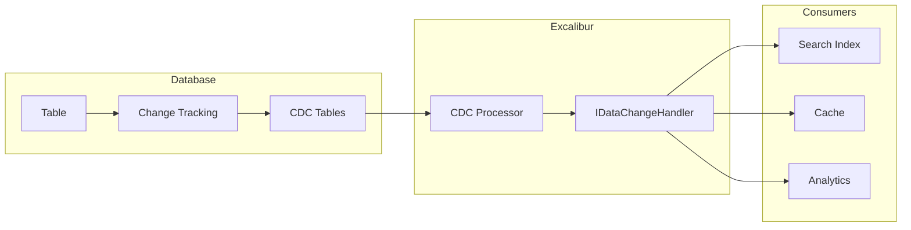

# Change Data Capture (CDC)

CDC captures row-level changes from your database and publishes them as events, enabling real-time data synchronization without modifying application code.

## Before You Start

- **.NET 10.0**
- Install the required packages:
  ```bash
  dotnet add package Excalibur.Cdc.SqlServer  # or Excalibur.Cdc.Postgres
  ```
- SQL Server CDC must be enabled on the database and target tables
- **SQL Server:** the CDC schema is shipped as scripts you apply before the first poll — see [Database Schema Setup](#database-schema-setup)
- Familiarity with [event sourcing concepts](../event-sourcing/index.md) and [outbox pattern](./outbox.md)

## Database Schema Setup

CDC records how far it has read each source table in a **state table**. The two providers obtain
that table in deliberately different ways, and this is the most common first-run failure.

| Provider | Default state table | How it is created |
|---|---|---|
| **SQL Server** | `[Cdc].[CdcProcessingState]` | You apply the DDL scripts shipped in the package. |
| **Postgres** | `excalibur.cdc_state` | The provider issues `CREATE SCHEMA` / `CREATE TABLE` on first use. |

### SQL Server — apply the shipped scripts

`Excalibur.Cdc.SqlServer` ships its DDL inside the package rather than executing it at runtime.
Apply the scripts to the target database **before starting the processor**:

| Script | Creates | When it is required |
|---|---|---|
| `001_CreateCdcStateSchema.sql` | `[Cdc].[CdcProcessingState]` | Always |
| `002_CreateCdcIdempotencySchema.sql` | `[Cdc].[CdcProcessedEvents]` | Only with [`UseSqlServerIdempotencyFilter()`](#idempotency-filtering) |

Both ship under `scripts/` in the NuGet package, so after a restore they are on disk at:

```
~/.nuget/packages/excalibur.cdc.sqlserver/<version>/scripts/
```

Every statement in both scripts is guarded, so they are safe to re-run.

:::danger Apply the shipped scripts — do not hand-write equivalent DDL

If the state table does not exist, the **first checkpoint save fails**:

```
Microsoft.Data.SqlClient.SqlException: Invalid object name 'Cdc.CdcProcessingState'.
```

Authoring your own table instead of applying the script risks a quieter version of the same
problem. The idempotency table's natural key uses 532 of SQL Server's 900 allowed key bytes;
widening `TableName` or `ConsumerId` beyond `NVARCHAR(128)` **still creates the table, with only a
warning**, and the table then rejects oversized rows at run time with `Msg 1946`. A row that cannot
be inserted is not a duplicate, so the filter's duplicate handling does not absorb it — the insert
throws and CDC processing stops. The shipped scripts already carry the correct shapes.

`SchemaName()` and `StateTableName()` change the object the provider **looks for**. They do not
create it. If you override either, rename the objects in the script to match.
:::

This is the same model as `Microsoft.Extensions.Caching.SqlServer` (`dotnet sql-cache create`) and
EF Core migrations: creating tables is normally a privileged, audited operation rather than
something an application performs against a production database.

### Postgres — created for you

`Excalibur.Cdc.Postgres` creates its schema and state table on first use, so no script is required.
Note the trade-off this implies for a locked-down deployment: the DDL runs on the application's own
connection, so the runtime principal must hold schema-creation rights. There is currently no option
to disable it — if your deployment grants the application DML only, pre-create
`excalibur.cdc_state` and grant no DDL, and the provider's guarded `CREATE ... IF NOT EXISTS` will
find it already present.

## Overview


```mermaid
flowchart LR
    subgraph Database
        T[Table] --> CT[Change Tracking]
        CT --> CDC[CDC Tables]
    end

    subgraph Excalibur
        CDC --> P[CDC Processor]
        P --> H[IDataChangeHandler]
    end

    subgraph Consumers
        H --> S1[Search Index]
        H --> S2[Cache]
        H --> S3[Analytics]
    end
```

## Delivery Guarantees

**Both providers deliver at least once. Your handler must be idempotent.** What differs is the unit the
duplicate window is measured in, and what a failure does to the rest of your tables — so do not assume the
two behave alike.

| | SQL Server | Postgres |
|---|---|---|
| **Guarantee** | At-least-once per tracked table | At-least-once |
| **Duplicate window after a failure** | Every change that table saw since its last durable checkpoint | The entire transaction, including changes that already succeeded |
| **Checkpoint unit** | One position per table, written after a batch | One position per transaction commit |
| **Effect on other tables** | Contained: sibling tables still checkpoint | A transaction is confirmed or not, as a whole |
| **Resume position** | The state store's per-table position | The replication slot's confirmed position; the state store never decides where |
| **Deduplication** | Optional idempotency filter, keyed on `(TableName, Lsn, SeqVal)` | Optional idempotency filter, keyed on the change position |
| **Multi-instance safety** | Leader election with fencing tokens; a demoted instance's checkpoint write is rejected | PostgreSQL permits one consumer per replication slot |

The full contract for each provider — the seam that achieves it, the test that would catch a violation,
your obligations, and the known gaps — is in that package's `ARCHITECTURE.md`.

:::warning A poisoned change blocks its table

Neither provider skips a change your handler can never process, and neither has a dead-letter path for
one. On SQL Server the affected table stops advancing; on Postgres the stream stops advancing. That is
deliberate — the alternative is losing the change silently — but it means a permanently failing handler
needs your intervention, so alert on checkpoint age rather than on errors alone.
:::

## Two Processing Patterns

Excalibur CDC provides two ways to process database changes. Choose the one that fits your scenario:

| | Auto-Mapped | Manual Handler |
|---|---|---|
| **Register tables** | `TrackTable()` with mapper, or `BindTrackedTables()` + code mappings | `.CaptureInstances()`, `BindTrackedTables()`, or `TrackTable()` without mapper |
| **Map changes** | Framework creates typed events via `ICdcEventMapper<T>` | You write an `IDataChangeHandler` and process raw `DataChangeEvent` |
| **Dispatch** | Framework dispatches via `IDispatcher` automatically | You decide what to do (dispatch, index, cache, etc.) |
| **Best for** | Domain event pipelines, CQRS projections | Search indexing, cache invalidation, custom integrations |
| **Config-driven** | Yes — tables from `appsettings.json` via `BindTrackedTables` | Yes — tables from `appsettings.json` via `BindTrackedTables` |

Both patterns use the same CDC processor under the hood. The difference is **who handles the changes**: the framework (auto-mapped) or your code (manual handler).

All three table registration methods — `TrackTable()`, `BindTrackedTables()`, and `.CaptureInstances()` — feed into the same capture instance list that the processor polls. `BindTrackedTables()` works with either pattern: tables from config can be handled by auto-mapping (if event mappers are configured in code) or by your own `IDataChangeHandler` implementations.

:::tip Composing Both Patterns

You can use both patterns in the same processor. For example, auto-map `dbo.Orders` with `TrackTable()` while processing `dbo.AuditLog` via a manual `IDataChangeHandler` registered through `BindTrackedTables()` or `.CaptureInstances()`.
:::

## Quick Start

### Enable CDC on Database

```sql
-- Enable CDC on database
EXEC sys.sp_cdc_enable_db;

-- Enable CDC on table
EXEC sys.sp_cdc_enable_table
    @source_schema = 'dbo',
    @source_name = 'Orders',
    @role_name = NULL,
    @supports_net_changes = 1;
```

:::note
On SQL Server, also apply `001_CreateCdcStateSchema.sql` from the package before starting the
processor — see [Database Schema Setup](#database-schema-setup). Postgres needs no script.
:::

### Auto-Mapped Quick Start (Recommended)

Use `TrackTable` with `ICdcEventMapper<T>` to have the framework create typed events and dispatch them automatically:

```csharp
services.AddCdcProcessor(cdc =>
{
    cdc.UseSqlServer(sql =>
    {
        sql.ConnectionString(connectionString)
           .DatabaseName("OrdersDb");
    })
    .TrackTable("dbo.Orders", table =>
    {
        table.MapInsert<OrderCreatedEvent, OrderCreatedMapper>()
             .MapUpdate<OrderUpdatedEvent, OrderUpdatedMapper>()
             .MapDelete<OrderDeletedEvent, OrderDeletedMapper>();
    })
    .EnableBackgroundProcessing();
});
```

The processor derives which CDC capture instances to poll from the tracked tables. `"dbo.Orders"` is automatically normalized to the SQL Server capture instance `dbo_Orders`. If your capture instance has a custom name (e.g., `dbo_Orders_v2`), set it explicitly:

```csharp
.TrackTable("dbo.Orders", table =>
{
    table.CaptureInstance("dbo_Orders_v2")   // Override the default
         .MapInsert<OrderCreatedEvent, OrderCreatedMapper>();
})
```

### Manual Handler Quick Start

Use `.CaptureInstances()` when you want full control over change processing via your own `IDataChangeHandler`:

```csharp
// 1. Register the processor with capture instances
services.AddCdcProcessor(cdc =>
{
    cdc.UseSqlServer(sql =>
    {
        sql.ConnectionString(connectionString)
           .DatabaseName("OrdersDb")
           .CaptureInstances("dbo_Orders", "dbo_Customers");
    })
    .EnableBackgroundProcessing();
});

// 2. Register your handlers
services.AddDataChangeHandlersFromAssembly(typeof(Program).Assembly);
```

```csharp
// 3. Implement IDataChangeHandler
public class OrderCdcHandler : IDataChangeHandler
{
    public string[] TableNames => ["dbo_Orders"];

    public async Task HandleAsync(DataChangeEvent changeEvent, CancellationToken ct)
    {
        // You control what happens with the change
        var orderId = changeEvent.GetNewValue<Guid>("OrderId");
        await _searchIndex.IndexAsync(orderId, changeEvent, ct);
    }
}
```

## Table Tracking with Event Mapping

`TrackTable` registers a table for auto-mapped processing. The framework creates typed domain events from CDC column data and dispatches them via `IDispatcher`.

Two sub-patterns are available:

1. **`ICdcEventMapper<T>` (recommended)** — provide a mapper class that creates typed events from column data. The framework handles dispatch.
2. **Metadata-only** — register event type metadata without a mapper. You still need a manual `IDataChangeHandler` to process changes.

### Auto-Mapping with ICdcEventMapper (Recommended)

Define a mapper that converts CDC column data to your domain event:

```csharp
// 1. Define the event
public record OrderCreatedEvent(int OrderId, string CustomerId, decimal Total) : IDispatchMessage;

// 2. Implement ICdcEventMapper<TEvent>
internal sealed class OrderCreatedEventMapper : ICdcEventMapper<OrderCreatedEvent>
{
    public OrderCreatedEvent Map(IReadOnlyList<CdcDataChange> changes, CdcChangeType changeType)
    {
        return new OrderCreatedEvent(
            OrderId: changes.GetValue<int>("OrderId"),
            CustomerId: changes.GetValue<string>("CustomerId"),
            Total: changes.GetValue<decimal>("Total"));
    }
}

// 3. Register with the 2-type-param overload
services.AddCdcProcessor(cdc =>
{
    cdc.UseSqlServer(sql =>
    {
        sql.ConnectionString(connectionString)
           .SchemaName("Cdc")
           .BatchSize(100);
    })
    .TrackTable("dbo.Orders", table =>
    {
        table.MapInsert<OrderCreatedEvent, OrderCreatedEventMapper>()
             .MapUpdate<OrderUpdatedEvent, OrderUpdatedEventMapper>()
             .MapDelete<OrderDeletedEvent, OrderDeletedEventMapper>();
    })
    .EnableBackgroundProcessing();
});
```

When a CDC change is detected, the framework:
1. Resolves the `ICdcEventMapper<TEvent>` from DI
2. Calls `mapper.Map(changes, changeType)` to create a typed event
3. Dispatches via `IDispatcher.DispatchAsync()` if the event implements `IDispatchMessage`

Use `MapAll<TEvent, TMapper>()` when a single event type handles all change types:

```csharp
.TrackTable("dbo.Orders", table =>
{
    table.MapAll<OrderChangedEvent, OrderChangedEventMapper>();
})
```

### CdcDataChangeExtensions

Helper methods for extracting typed column values in mapper implementations:

| Method | Description |
|--------|-------------|
| `changes.GetValue<T>(columnName)` | Get new value; throws `CdcMappingException` if missing |
| `changes.GetOldValue<T>(columnName)` | Get old value (before change); throws if missing |
| `changes.TryGetValue<T>(columnName, out value)` | Safe lookup; returns `false` if missing |

### Metadata-Only Overloads

The single-type-param overloads (`MapInsert<TEvent>()`, `MapAll<TEvent>()`) register event type metadata but do **not** auto-map or dispatch. Use these when you plan to process changes via a manual `IDataChangeHandler`:

```csharp
// Registers metadata only -- requires a manual IDataChangeHandler for "dbo.Orders"
.TrackTable("dbo.Orders", table =>
{
    table.MapInsert<OrderCreatedEvent>()
         .MapUpdate<OrderUpdatedEvent>()
         .MapDelete<OrderDeletedEvent>();
})
```

### Entity-Inferred Table Names

```csharp
services.AddCdcProcessor(cdc =>
{
    cdc.UseSqlServer(sql => sql.ConnectionString(connectionString))
       .TrackTable<Order>(table =>
           table.MapAll<OrderChangedEvent, OrderChangedEventMapper>())
       .TrackTable<Customer>(table =>
           table.MapAll<CustomerChangedEvent, CustomerChangedEventMapper>())
       .EnableBackgroundProcessing();
});
```

## Manual Handler Pattern

When you need full control over change processing — for search indexing, cache invalidation, or custom integrations — implement `IDataChangeHandler` directly. Tables can come from `.CaptureInstances()` on the SQL builder, `BindTrackedTables()` from config, or `TrackTable()` without event mappers:

```csharp ignore
using Excalibur.Cdc.SqlServer;

public class OrderCdcHandler : IDataChangeHandler
{
    private readonly ISearchIndex _searchIndex;
    private readonly ICache _cache;

    public OrderCdcHandler(ISearchIndex searchIndex, ICache cache)
    {
        _searchIndex = searchIndex;
        _cache = cache;
    }

    // Specify which tables this handler processes
    public string[] TableNames => ["dbo.Orders"];

    public async Task HandleAsync(DataChangeEvent changeEvent, CancellationToken cancellationToken)
    {
        switch (changeEvent.ChangeType)
        {
            case DataChangeType.Insert:
                await HandleInsertAsync(changeEvent, cancellationToken);
                break;
            case DataChangeType.Update:
                await HandleUpdateAsync(changeEvent, cancellationToken);
                break;
            case DataChangeType.Delete:
                await HandleDeleteAsync(changeEvent, cancellationToken);
                break;
        }
    }

    private async Task HandleInsertAsync(DataChangeEvent changeEvent, CancellationToken ct)
    {
        // Use built-in extension methods on DataChangeEvent
        var orderId = changeEvent.GetNewValue<Guid>("OrderId");
        var customerId = changeEvent.GetNewValue<string>("CustomerId");
        var totalAmount = changeEvent.GetNewValue<decimal>("TotalAmount");

        await _searchIndex.IndexAsync(new OrderDocument
        {
            Id = orderId,
            CustomerId = customerId,
            Amount = totalAmount
        }, ct);

        await _cache.SetAsync($"order:{orderId}", changeEvent, ct);
    }

    private async Task HandleUpdateAsync(DataChangeEvent changeEvent, CancellationToken ct)
    {
        var orderId = changeEvent.GetNewValue<Guid>("OrderId");
        await _searchIndex.UpdateAsync(orderId, changeEvent, ct);
        await _cache.InvalidateAsync($"order:{orderId}", ct);
    }

    private async Task HandleDeleteAsync(DataChangeEvent changeEvent, CancellationToken ct)
    {
        // For deletes, use GetOldValue since NewValue is null
        var orderId = changeEvent.GetOldValue<Guid>("OrderId");
        await _searchIndex.DeleteAsync(orderId, ct);
        await _cache.InvalidateAsync($"order:{orderId}", ct);
    }
}

### Registering Data Change Handlers

Register `IDataChangeHandler` implementations using assembly scanning or explicit registration:

```csharp
// Assembly scanning -- discovers all IDataChangeHandler implementations
// ⚠️ Requires [RequiresUnreferencedCode] (not AOT-safe)
services.AddDataChangeHandlersFromAssembly(typeof(OrderCdcHandler).Assembly);

// With custom lifetime (default is Singleton)
services.AddDataChangeHandlersFromAssembly(
    typeof(OrderCdcHandler).Assembly,
    ServiceLifetime.Transient);
```

Assembly scanning finds all concrete classes implementing `IDataChangeHandler` and registers them with `TryAdd` semantics. Each handler is registered both as its concrete type and as `IDataChangeHandler` for enumerable resolution.

## DataChangeEvent Structure

The `DataChangeEvent` class provides complete information about each database change:

```csharp
public class DataChangeEvent
{
    // Log sequence number for ordering
    public byte[] Lsn { get; init; }

    // Sequence value within the transaction
    public byte[] SeqVal { get; init; }

    // When the transaction was committed
    public DateTime CommitTime { get; init; }

    // The table that changed
    public string TableName { get; init; }

    // Insert, Update, or Delete
    public DataChangeType ChangeType { get; init; }

    // Column-level changes
    public IList<DataChange> Changes { get; init; }
}

public class DataChange
{
    public string ColumnName { get; init; }
    public object? OldValue { get; init; }  // null for inserts
    public object? NewValue { get; init; }  // null for deletes
    public Type? DataType { get; init; }
}

public enum DataChangeType
{
    Unknown = 0,
    Insert = 1,
    Update = 2,
    Delete = 3
}
```

:::tip Built-in Extension Methods

The framework provides extension methods for extracting typed values from `DataChangeEvent`:

```csharp
// Get the new value (for inserts and updates)
var customerId = changeEvent.GetNewValue<string>("CustomerId");

// Get the old value (for updates and deletes)
var previousStatus = changeEvent.GetOldValue<string>("Status");

// With default value if column not found
var amount = changeEvent.GetNewValue<decimal>("Amount", defaultValue: 0m);
```

These methods handle type conversion and nullable types automatically.
:::

### Working with Changes

```csharp
public async Task HandleAsync(DataChangeEvent changeEvent, CancellationToken cancellationToken)
{
    // Check if a specific column changed
    var statusChange = changeEvent.Changes
        .FirstOrDefault(c => c.ColumnName == "Status");

    if (statusChange is not null &&
        changeEvent.ChangeType == DataChangeType.Update &&
        !Equals(statusChange.OldValue, statusChange.NewValue))
    {
        await PublishStatusChangedEvent(
            changeEvent.TableName,
            statusChange.OldValue?.ToString(),
            statusChange.NewValue?.ToString(),
            cancellationToken);
    }

    // Get all column values as a dictionary
    var newValues = changeEvent.Changes
        .Where(c => c.NewValue is not null)
        .ToDictionary(c => c.ColumnName, c => c.NewValue);

    var oldValues = changeEvent.Changes
        .Where(c => c.OldValue is not null)
        .ToDictionary(c => c.ColumnName, c => c.OldValue);
}
```

## Anti-Corruption Pattern Example

:::info User-Implemented Pattern

This section shows a recommended **pattern** for implementing an anti-corruption layer using `IDataChangeHandler`. This is not a built-in framework component — you implement this yourself using the CDC handler infrastructure.
:::

Protect downstream systems from database schema changes by transforming raw CDC events into domain events:

```csharp
public class OrderAntiCorruptionHandler : IDataChangeHandler
{
    private readonly IDispatcher _dispatcher;

    public OrderAntiCorruptionHandler(IDispatcher dispatcher)
    {
        _dispatcher = dispatcher;
    }

    public string[] TableNames => ["dbo.Orders"];

    public async Task HandleAsync(DataChangeEvent change, CancellationToken ct)
    {
        var domainEvent = change.ChangeType switch
        {
            DataChangeType.Insert => CreateOrderCreatedEvent(change),
            DataChangeType.Update => CreateOrderUpdatedEvent(change),
            DataChangeType.Delete => CreateOrderDeletedEvent(change),
            _ => null
        };

        if (domainEvent is not null)
        {
            // Dispatch from within a handler; DispatchAsync auto-childs so causation/correlation
            // identifiers propagate to the child message.
            await _dispatcher.DispatchAsync(domainEvent, ct);
        }
    }

    private OrderCreatedEvent CreateOrderCreatedEvent(DataChangeEvent change)
    {
        // Use built-in extension methods on DataChangeEvent
        return new OrderCreatedEvent(
            OrderId: change.GetNewValue<Guid>("order_id"),
            CustomerId: change.GetNewValue<string>("customer_id"),
            TotalAmount: change.GetNewValue<decimal>("total_amt"),
            Currency: MapCurrency(change.GetNewValue<int>("currency_code")),
            CreatedAt: change.GetNewValue<DateTime>("created_date")
        );
    }

    private OrderUpdatedEvent? CreateOrderUpdatedEvent(DataChangeEvent change)
    {
        var statusChange = change.Changes.FirstOrDefault(c => c.ColumnName == "status");
        if (statusChange is null || Equals(statusChange.OldValue, statusChange.NewValue))
            return null;

        return new OrderUpdatedEvent(
            OrderId: change.GetNewValue<Guid>("order_id"),
            OldStatus: statusChange.OldValue?.ToString() ?? "",
            NewStatus: statusChange.NewValue?.ToString() ?? ""
        );
    }

    private OrderDeletedEvent CreateOrderDeletedEvent(DataChangeEvent change)
    {
        // For deletes, use GetOldValue since NewValue is null
        return new OrderDeletedEvent(
            OrderId: change.GetOldValue<Guid>("order_id")
        );
    }

    private static string MapCurrency(int code) => code switch
    {
        1 => "USD",
        2 => "EUR",
        3 => "GBP",
        _ => "USD"
    };
}
```

## SQL Server Builder Reference

The `ISqlServerCdcBuilder` interface provides fluent configuration for SQL Server CDC:

| Method | Description | Default |
|--------|-------------|---------|
| `SchemaName(string)` | Schema for CDC state tables | `"Cdc"` |
| `StateTableName(string)` | Table name for processing state | `"CdcProcessingState"` |
| `PollingInterval(TimeSpan)` | How often to poll for changes | 5 seconds |
| `BatchSize(int)` | Changes per processing batch | 100 |
| `CommandTimeout(TimeSpan)` | Database command timeout | 30 seconds |
| `DatabaseName(string)` | Database name; auto-registers `IDatabaseOptions` | -- |
| `DatabaseConnectionIdentifier(string)` | Identifier for CDC source connection | `cdc-{DatabaseName}` |
| `StateConnectionIdentifier(string)` | Identifier for state store connection | `state-{DatabaseName}` |
| `CaptureInstances(params string[])` | CDC capture instances to poll (for manual `IDataChangeHandler` pattern; auto-mapped tables via `TrackTable`/`BindTrackedTables` are derived automatically) | -- |
| `StopOnMissingTableHandler(bool)` | Stop processing on missing handler | `true` |
| `ConnectionStringName(string)` | Resolve connection from `IConfiguration.GetConnectionString()` | -- |
| `ConnectionFactory(Func<IServiceProvider, Func<SqlConnection>>)` | DI-integrated source connection factory | -- |
| `WithStateStore(Action<ICdcStateStoreBuilder>)` | Configure separate state store connection and schema | Source connection |
| `StateConnectionFactory(Func<IServiceProvider, Func<SqlConnection>>)` | DI-integrated state connection factory | Source connection |
| `BindConfiguration(string)` | Bind source options from `IConfiguration` section | -- |

:::warning `SchemaName()` and `StateTableName()` rename — they do not create
These change the object the provider looks for. The SQL Server provider never issues DDL, so if
you override either, rename the objects in `001_CreateCdcStateSchema.sql` to match before
applying it. See [Database Schema Setup](#database-schema-setup).
:::

:::tip Auto-Registration of IDatabaseOptions

When you call `DatabaseName()`, the builder automatically registers an `IDatabaseOptions` factory with sensible defaults for connection identifiers. The factory derives `CaptureInstances` at runtime from all registered sources — `TrackTable()`, `BindTrackedTables()`, and `.CaptureInstances()` — so config-driven tables are included automatically. You only need to set `DatabaseConnectionIdentifier()` or `StateConnectionIdentifier()` if you want custom values. Manual `IDatabaseOptions` registration takes precedence.
:::

### Connection Factory

For custom connection management (e.g., pooling or dynamic connection strings):

```csharp
services.AddCdcProcessor(cdc =>
{
    cdc.UseSqlServer(sql =>
        {
            sql.ConnectionFactory(sp =>
                {
                    var config = sp.GetRequiredService<IConfiguration>();
                    var connStr = config.GetConnectionString("CdcDatabase")!;
                    return () => new SqlConnection(connStr);
                })
               .SchemaName("audit")
               .BatchSize(200)
               .DatabaseName("AuditDb");
        })
       .TrackTable("dbo.AuditLog", table => table.MapAll<AuditLogChangedEvent>())
       .EnableBackgroundProcessing();
});
```

## Postgres Builder Reference

The `IPostgresCdcBuilder` interface provides fluent configuration for Postgres CDC:

| Method | Description | Default |
|--------|-------------|---------|
| `SchemaName(string)` | Schema for CDC state tables | `"excalibur"` |
| `StateTableName(string)` | Table name for CDC processing state | `"cdc_state"` |
| `PollingInterval(TimeSpan)` | How often to poll for changes | 1 second |
| `BatchSize(int)` | Changes per processing batch | 1000 |
| `Timeout(TimeSpan)` | Replication operation timeout | 30 seconds |
| `ProcessorId(string)` | Identifier for this CDC processor instance | Machine name |
| `ReplicationSlotName(string)` | Postgres logical replication slot name | `"excalibur_cdc_slot"` |
| `PublicationName(string)` | Postgres publication name | `"excalibur_cdc_publication"` |
| `UseBinaryProtocol(bool)` | Use binary protocol for logical replication | `false` |
| `AutoCreateSlot(bool)` | Auto-create replication slot if missing | `false` |
| `ConnectionString(string)` | Postgres source connection string | -- |
| `ConnectionStringName(string)` | Resolve connection from `IConfiguration.GetConnectionString()` | -- |
| `ConnectionFactory(Func<IServiceProvider, Func<NpgsqlConnection>>)` | DI-integrated source connection factory | -- |
| `BindConfiguration(string)` | Bind source options from `IConfiguration` section | -- |
| `WithStateStore(Action<ICdcStateStoreBuilder>)` | Configure separate state store connection and schema | Source connection |
| `StateConnectionFactory(Func<IServiceProvider, Func<NpgsqlConnection>>)` | DI-integrated state connection factory | Source connection |

:::note No schema script needed
Unlike SQL Server, the Postgres provider creates its schema and state table on first use. The DDL
runs on the application's own connection, so the runtime principal needs schema-creation rights —
see [Database Schema Setup](#database-schema-setup).
:::

### Postgres Example

```csharp
services.AddCdcProcessor(cdc =>
{
    cdc.UsePostgres(pg =>
    {
        pg.ConnectionString(connectionString)
           .ReplicationSlotName("orders_cdc_slot")
           .PublicationName("orders_publication")
           .AutoCreateSlot()
           .PollingInterval(TimeSpan.FromSeconds(1))
           .BatchSize(500);
    })
    .TrackTable("public.orders", t => t.MapAll<OrderChangedEvent>())
    .EnableBackgroundProcessing();
});
```

## Separate State Store Connection

By default, CDC uses the same connection for reading changes and persisting checkpoints. In production, you may want to separate these concerns — for example, when your CDC source is a read-replica that should not carry checkpoint write load, or when the state store lives on a different tier.

The `WithStateStore` method follows the [Microsoft Change Feed Processor](https://learn.microsoft.com/en-us/azure/cosmos-db/nosql/change-feed-processor) pattern where lease/checkpoint storage is configured separately from the monitored source.

### Connection String

```csharp
services.AddCdcProcessor(cdc =>
{
    cdc.UseSqlServer(sql =>
    {
        sql.ConnectionString(sourceConnectionString)
           .WithStateStore(state =>
           {
               state.ConnectionString(stateConnectionString);
           });
    })
    .TrackTable("dbo.Orders", t => t.MapAll<OrderChangedEvent>())
    .EnableBackgroundProcessing();
});
```

### Connection String with State Store Configuration

```csharp
services.AddCdcProcessor(cdc =>
{
    cdc.UseSqlServer(sql =>
    {
        sql.ConnectionString(sourceConnectionString)
           .WithStateStore(state =>
           {
               state.ConnectionString(stateConnectionString)
                    .SchemaName("dbo")
                    .TableName("CdcCheckpoints");
           });
    })
    .TrackTable("dbo.Orders", t => t.MapAll<OrderChangedEvent>())
    .EnableBackgroundProcessing();
});
```

### Named Connection Strings

Resolve connections from `IConfiguration.GetConnectionString()` at DI resolution time:

```csharp
services.AddCdcProcessor(cdc =>
{
    cdc.UseSqlServer(sql =>
    {
        sql.ConnectionStringName("CdcSource")
           .WithStateStore(state =>
           {
               state.ConnectionStringName("CdcState");
           });
    })
    .TrackTable("dbo.Orders", t => t.MapAll<OrderChangedEvent>())
    .EnableBackgroundProcessing();
});
```

### Configuration Binding

Bind all options from `appsettings.json`:

```json
{
  "Cdc": {
    "SqlServer": {
      "ConnectionString": "Server=.;Database=OrdersDb;...",
      "SchemaName": "Cdc",
      "PollingInterval": "00:00:05",
      "BatchSize": 100
    }
  }
}
```

```csharp
services.AddCdcProcessor(cdc =>
{
    cdc.UseSqlServer(sql =>
    {
        sql.BindConfiguration("Cdc:SqlServer")
           .DatabaseName("OrdersDb");
    })
    .TrackTable("dbo.Orders", t => t.MapAll<OrderChangedEvent>())
    .EnableBackgroundProcessing();
});
```

### DI-Integrated Factory

For advanced scenarios (managed identity, dynamic connection strings):

```csharp
services.AddCdcProcessor(cdc =>
{
    cdc.UseSqlServer(sql =>
    {
        sql.ConnectionFactory(sp =>
            {
                var config = sp.GetRequiredService<IConfiguration>();
                return () => new SqlConnection(config.GetConnectionString("CdcSource")!);
            })
           .DatabaseName("OrdersDb")
           .WithStateStore(state =>
           {
               state.ConnectionStringName("CdcState")
                    .SchemaName("cdc")
                    .TableName("ProcessingState");
           });
    })
    .TrackTable("dbo.Orders", t => t.MapAll<OrderChangedEvent>())
    .EnableBackgroundProcessing();
});
```

### PostgreSQL

The same pattern works with `IPostgresCdcBuilder`:

```csharp
services.AddCdcProcessor(cdc =>
{
    cdc.UsePostgres(pg =>
    {
        pg.ConnectionString(sourceConnectionString)
          .WithStateStore(state =>
          {
              state.ConnectionString(stateConnectionString)
                   .SchemaName("excalibur")
                   .TableName("cdc_state");
          });
    })
    .TrackTable("public.orders", t => t.MapAll<OrderChangedEvent>())
    .EnableBackgroundProcessing();
});
```

### ICdcStateStoreBuilder Reference

The `Action<ICdcStateStoreBuilder>` callback configures state store persistence:

| Method | Description |
|--------|-------------|
| `ConnectionString(string)` | Set the state store connection string directly |
| `ConnectionStringName(string)` | Resolve connection from `IConfiguration.GetConnectionString()` |
| `SchemaName(string)` | Database schema for the checkpoint table |
| `TableName(string)` | Table name for checkpoint persistence |
| `BindConfiguration(string)` | Bind state store options from an `IConfiguration` section |

:::tip Backward Compatibility

When `WithStateStore` is omitted, the source connection is used for state persistence — existing code continues to work without changes.
:::

### Configuration-Driven Setup

Use `BindConfiguration` on the provider builder to bind CDC source options from `appsettings.json`:

```csharp
services.AddCdcProcessor(cdc =>
{
    cdc.UseSqlServer(sourceConnectionString, sql =>
    {
        sql.BindConfiguration("Cdc:SqlServer");
    })
    .TrackTable("dbo.Orders", t => t.MapAll<OrderChangedEvent>())
    .EnableBackgroundProcessing();
});
```

```json
{
  "Cdc": {
    "SqlServer": {
      "SchemaName": "Cdc",
      "StateTableName": "CdcProcessingState",
      "PollingInterval": "00:00:05",
      "BatchSize": 100
    }
  }
}
```

`BindConfiguration` uses `OptionsBuilder<T>.BindConfiguration()` with `ValidateDataAnnotations` and `ValidateOnStart` for fail-fast startup validation.

## Config-Driven Table Binding

Instead of (or in addition to) registering tables in code, you can declare tracked tables in `appsettings.json` and bind them with `BindTrackedTables`. This is the recommended approach for **per-environment configuration** — different environments can track different tables or use different capture instances without code changes.

```json
{
  "Cdc": {
    "Tables": [
      { "TableName": "dbo.Orders", "CaptureInstance": "dbo_Orders_v2" },
      { "TableName": "dbo.Customers" }
    ]
  }
}
```

| Property | Required | Description |
|----------|----------|-------------|
| `TableName` | Yes | Fully qualified table name (e.g., `"dbo.Orders"`). Used for handler routing and as the default capture instance name. |
| `CaptureInstance` | No | Explicit SQL Server capture instance name. When omitted, `TableName` is normalized (e.g., `dbo.Orders` becomes `dbo_Orders`). Use this when your capture instance has a custom name like `dbo_Orders_v2`. |

```csharp
services.AddCdcProcessor(cdc =>
{
    cdc.UseSqlServer(sql => sql
        .ConnectionString(connectionString)
        .DatabaseName("OrdersDb"))
       .BindTrackedTables("Cdc:Tables")
       .EnableBackgroundProcessing();
});
```

The processor derives which CDC capture instances to poll from these config entries. In the example above, the processor polls `dbo_Orders_v2` (explicit) and `dbo_Customers` (derived from `TableName`).

Config-bound tables work with both processing patterns:
- **Auto-mapped**: Combine with `TrackTable()` in code to provide event mappers for config-bound tables. Code-registered tables take precedence over config duplicates.
- **Manual handler**: Register `IDataChangeHandler` implementations whose `TableNames` match the config entries. No event mappers needed.

Config-bound tables merge additively with code-registered tables. Duplicate table names (case-insensitive) are skipped — code-registered tables always take precedence. Event mappings cannot be expressed in configuration and remain code-only via `TrackTable()`.

:::tip Per-Environment Configuration

Use `appsettings.{Environment}.json` to vary tracked tables by environment:
```json
// appsettings.Development.json
{ "Cdc": { "Tables": [{ "TableName": "dbo.Orders" }] } }

// appsettings.Production.json
{ "Cdc": { "Tables": [
    { "TableName": "dbo.Orders", "CaptureInstance": "dbo_Orders_v3" },
    { "TableName": "dbo.Customers" },
    { "TableName": "dbo.Payments" }
] } }
```
:::

### Combining Code and Config

```csharp
services.AddCdcProcessor(cdc =>
{
    cdc.UseSqlServer(sql => sql.ConnectionString(connectionString))
       // Code-registered table with event mappings (takes precedence)
       .TrackTable("dbo.Orders", table =>
       {
           table.MapInsert<OrderCreatedEvent, OrderCreatedMapper>()
                .MapUpdate<OrderUpdatedEvent, OrderUpdatedMapper>();
       })
       // Config-bound tables (additively merged, duplicates skipped)
       .BindTrackedTables("Cdc:Tables")
       .EnableBackgroundProcessing();
});
```

## Handler Auto-Discovery

Use `TrackTablesFromHandlers()` to automatically discover tracked tables from registered handler implementations without listing each table explicitly:

```csharp
services.AddCdcProcessor(cdc =>
{
    cdc.UseSqlServer(sql => sql.ConnectionString(connectionString))
       .TrackTablesFromHandlers()
       .EnableBackgroundProcessing();
});

// Register your handlers (or use assembly scanning)
services.AddDataChangeHandlersFromAssembly(typeof(OrderCdcHandler).Assembly);
```

At startup, the framework resolves all `ICdcTableProvider` services from DI and registers their declared `TableNames` as tracked tables. Provider-specific handlers like `IDataChangeHandler` (SQL Server) implement `ICdcTableProvider`, so they are discovered automatically.

### ICdcTableProvider Interface

Any type implementing `ICdcTableProvider` participates in auto-discovery:

```csharp
public interface ICdcTableProvider
{
    string[] TableNames { get; }
}
```

`IDataChangeHandler` extends `ICdcTableProvider`, so existing SQL Server handlers are discovered without changes.

### Precedence Rules

When combining all three table registration methods, the precedence order is:

1. **Code-registered** (`TrackTable()`) — highest priority
2. **Config-bound** (`BindTrackedTables()`)
3. **Handler-discovered** (`TrackTablesFromHandlers()`) — lowest priority

Duplicates by table name (case-insensitive) are skipped at each level.

### Full Example

```csharp
services.AddCdcProcessor(cdc =>
{
    cdc.UseSqlServer(sql =>
    {
        sql.ConnectionStringName("CdcSource")
           .DatabaseName("OrdersDb");
    })
    // Explicit table with event mappings
    .TrackTable("dbo.Orders", table =>
    {
        table.MapInsert<OrderCreatedEvent, OrderCreatedMapper>()
             .MapUpdate<OrderUpdatedEvent, OrderUpdatedMapper>()
             .MapDelete<OrderDeletedEvent, OrderDeletedMapper>();
    })
    // Additional tables from config
    .BindTrackedTables("Cdc:Tables")
    // Remaining tables from registered handlers
    .TrackTablesFromHandlers()
    .EnableBackgroundProcessing()
    // Bind processing options from config
    .BindProcessingConfiguration("Cdc:Processing");
});
```

## Checkpointing

### State Store Configuration

Configure the CDC state store via the fluent builder:

```csharp
services.AddCdcProcessor(cdc =>
{
    cdc.UseSqlServer(sql =>
    {
        sql.ConnectionString(connectionString)
           .SchemaName("Cdc")
           .StateTableName("CdcProcessingState");
    })
    .TrackTable("dbo.Orders", t => t.MapAll<OrderChangedEvent>())
    .EnableBackgroundProcessing();
});
```

### ICdcStateStore Interface

The framework provides `ICdcStateStore` for checkpoint management. The state store tracks processing positions per database and capture instance:

```csharp
public class CdcManager
{
    private readonly ICdcStateStore _stateStore;

    public CdcManager(ICdcStateStore stateStore)
    {
        _stateStore = stateStore;
    }

    public async Task<IEnumerable<CdcProcessingState>> GetPositionsAsync(
        string connectionId,
        string databaseName,
        CancellationToken ct)
    {
        return await _stateStore.GetLastProcessedPositionAsync(
            connectionId,
            databaseName,
            ct);
    }

    public async Task UpdatePositionAsync(
        string connectionId,
        string databaseName,
        string tableName,
        byte[] lsn,
        byte[]? seqVal,
        DateTime? commitTime,
        CancellationToken ct)
    {
        await _stateStore.UpdateLastProcessedPositionAsync(
            connectionId,
            databaseName,
            tableName,
            lsn,
            seqVal,
            commitTime,
            ct);
    }
}
```

## Error Handling

### Handler-Level Error Handling

Handle errors within your `IDataChangeHandler` implementation:

```csharp
public class ResilientOrderCdcHandler : IDataChangeHandler
{
    private readonly ILogger<ResilientOrderCdcHandler> _logger;
    private readonly IDeadLetterQueue _deadLetter;

    public string[] TableNames => ["dbo.Orders"];

    public async Task HandleAsync(DataChangeEvent changeEvent, CancellationToken ct)
    {
        try
        {
            await ProcessChangeAsync(changeEvent, ct);
        }
        catch (Exception ex)
        {
            _logger.LogError(ex, "Failed to process CDC event for {Table} at LSN {Lsn}",
                changeEvent.TableName,
                BitConverter.ToString(changeEvent.Lsn));

            // Send to dead letter for manual investigation
            await _deadLetter.EnqueueAsync(
                changeEvent,
                DeadLetterReason.UnhandledException,
                ex,
                new Dictionary<string, string>
                {
                    ["TableName"] = changeEvent.TableName,
                    ["Lsn"] = BitConverter.ToString(changeEvent.Lsn),
                    ["ChangeType"] = changeEvent.ChangeType.ToString()
                },
                ct);

            // Optionally re-throw to stop processing
            // throw;
        }
    }

    private Task ProcessChangeAsync(DataChangeEvent changeEvent, CancellationToken ct)
    {
        // Processing logic
        return Task.CompletedTask;
    }
}
```

### Stale Position Recovery

Handle stale LSN positions when CDC retention expires, a database is restored from backup, or an invalid LSN range triggers SQL Error 313. The framework detects these scenarios automatically and invokes the configured recovery strategy:

```csharp ignore
using Excalibur.Cdc;

services.AddCdcProcessor(cdc =>
{
    cdc.UseSqlServer(sql => sql.ConnectionString(connectionString))
       .TrackTable("dbo.Orders", t => t.MapAll<OrderChangedEvent>())
       .WithRecovery(recovery =>
       {
           // Choose a recovery strategy
           recovery.Strategy(StalePositionRecoveryStrategy.FallbackToEarliest)
                   .MaxAttempts(5)
                   .AttemptDelay(TimeSpan.FromSeconds(30));
       })
       .EnableBackgroundProcessing();
});
```

#### Recovery Strategies

| Strategy | Description |
|----------|-------------|
| `Throw` | Throw an exception (default, requires manual intervention) |
| `FallbackToEarliest` | Reset to earliest available position (may reprocess events) |
| `FallbackToLatest` | Skip to latest position (may lose unprocessed events) |
| `InvokeCallback` | Call custom handler for advanced recovery logic |

#### Reason Codes

The `ReasonCode` on `CdcPositionResetEventArgs` tells you *why* the position is stale:

| Reason Code | Description |
|-------------|-------------|
| `CdcCleanup` | CDC cleanup job purged records older than the retention threshold |
| `BackupRestore` | Database restored from backup with different CDC history |
| `CdcReenabled` | CDC was disabled and re-enabled, invalidating previous positions |
| `LsnOutOfRange` | LSN falls outside the valid min/max range (SQL Error 22037/22029) |
| `TvfInsufficientArguments` | CDC TVF received an invalid LSN range (SQL Error 313) |
| `CaptureInstanceDropped` | The capture instance no longer exists in the database |
| `Unknown` | Cause could not be determined from the SQL error |

:::info SQL Error 313

SQL Server sometimes raises error 313 ("An insufficient number of arguments were supplied") instead of the more specific 22037/22029 errors when the LSN falls outside the valid CDC window. The framework recognizes this error and treats it the same as `LsnOutOfRange` — the position is stale and recovery is triggered automatically.
:::

#### Custom Recovery Callback

For complex recovery scenarios, use `InvokeCallback` with a custom handler:

```csharp
services.AddCdcProcessor(cdc =>
{
    cdc.UseSqlServer(sql => sql.ConnectionString(connectionString))
       .TrackTable("dbo.Orders", t => t.MapAll<OrderChangedEvent>())
       .WithRecovery(recovery =>
       {
           recovery.Strategy(StalePositionRecoveryStrategy.InvokeCallback)
                   .OnPositionReset(async (args, ct) =>
                   {
                       _logger.LogWarning(
                           "Stale CDC position for {CaptureInstance}. Reason: {Reason}",
                           args.CaptureInstance,
                           args.ReasonCode);

                       // Handle based on reason code
                       // StalePositionReasonCodes: CdcCleanup, BackupRestore,
                       // CdcReenabled, LsnOutOfRange, CaptureInstanceDropped,
                       // TvfInsufficientArguments, Unknown
                   });
       })
       .EnableBackgroundProcessing();
});
```

## Idempotency Filtering

**Delivery semantics are provider-specific — this page does not state one guarantee that holds for every CDC provider.** Several providers are **at-least-once**: an event may be replayed after a crash, restart, or stale position reset. **That is not true of all of them**, so treat "at-least-once" as a property of the provider you have chosen rather than of CDC in this framework, and do not assume exactly-once anywhere. **Make your handlers idempotent: that obligation is correct for every provider**, and it is the one thing to implement unconditionally. Where they are not naturally idempotent, enable an **idempotency filter** to deduplicate events before they reach your handler.

**Replay is not the only failure mode, and an idempotency filter does not defend against the other one.** Reading pending changes is destructive in the in-memory provider, so changes handed to a handler that then throws are not seen again. On the DynamoDB and Firestore providers the batch path does not durably record its position — only their continuous and streaming paths do. **If delivery *completeness* matters to you, verify it against your source tables rather than against your own pipeline's counts**: a deduplicating filter and a dropped batch produce the same shortfall downstream, and the filter gives you a documented reason to expect it.

When registered, the CDC processor checks each event's `(tableName, LSN, seqVal)` composite key before invoking the handler. Events that have already been processed are skipped automatically. This is an opt-in feature — when no filter is registered, all events are processed without deduplication.

:::caution PostgreSQL only — a multi-table `TRUNCATE` replays every table, not just the one that failed

**This hazard is specific to the PostgreSQL provider, and the idempotency filters described in this section do not apply to it** — they are SQL Server CDC registrations, and the PostgreSQL processor does not consult a filter. The remedy below is the one a PostgreSQL consumer can actually use.

PostgreSQL reports `TRUNCATE orders, order_items` as a **single** transaction covering every table named, and the processor delivers one truncate event per table. If your handler succeeds on `orders` and then throws on `order_items`, the position is not advanced and **both** events are delivered again on the next attempt — including the one that already succeeded.

This is easy to miss because a truncate *looks* naturally idempotent: truncating an already-empty table is harmless. The risk is in whatever your handler does **alongside** the truncate — publishing a notification, writing an audit row, incrementing a counter. Those run twice.

**Make that side effect idempotent yourself, and key it on `(TransactionId, SchemaName, TableName)`.** A truncate carries no row, so it is created without key columns: a dedup keyed on a primary key has nothing to grip, and those three values are the only identity the event has.
:::

:::warning SQL Server filter: apply `002_CreateCdcIdempotencySchema.sql` first
The SQL Server idempotency filter reads and writes `[Cdc].[CdcProcessedEvents]`, which the
provider does not create. Apply the second shipped script before enabling the filter, or every
duplicate check fails with `Invalid object name` and CDC processing stops. The in-memory filter
needs no schema. See [Database Schema Setup](#database-schema-setup).
:::

### In-Memory Filter (Single Instance)

For single-instance deployments where CDC events are processed by one consumer:

```csharp
services.AddCdcProcessor(cdc =>
{
    cdc.UseSqlServer(sql => sql.ConnectionString(connectionString))
       .TrackTable("dbo.Orders", t => t.MapAll<OrderChangedEvent>())
       .UseInMemoryIdempotencyFilter()
       .EnableBackgroundProcessing();
});
```

The in-memory filter uses a bounded `ConcurrentDictionary` with a capacity of 10,000 entries. When capacity is reached, new events are processed without deduplication tracking (skip-when-full pattern), ensuring bounded memory usage.

:::warning Limitations

The in-memory filter does **not** survive process restarts — it is purely in-memory. For durable deduplication across restarts or multi-instance deployments, use the SQL Server filter.
:::

### SQL Server Filter (Multi-Instance)

For multi-instance deployments where multiple CDC consumers may process the same events:

```csharp
services.AddCdcProcessor(cdc =>
{
    cdc.UseSqlServer(sql => sql.ConnectionString(connectionString))
       .TrackTable("dbo.Orders", t => t.MapAll<OrderChangedEvent>())
       .UseSqlServerIdempotencyFilter()
       .EnableBackgroundProcessing();
});
```

The SQL Server filter persists processed event records in a `[Cdc].[CdcProcessedEvents]` table with a clustered composite primary key on `(TableName, Lsn, SeqVal, ConsumerId)`. Duplicate inserts are handled gracefully via primary key violation detection — concurrent instances processing the same event will not error.

`ConsumerId` is part of the key, not decoration. It scopes the dedupe namespace to a single consumer: without it, the first consumer to process a change would mark it done for every other consumer of that table, and the others would skip a change they never saw. A duplicate merely reprocesses, which an idempotent handler absorbs; a suppression is silent and unrecoverable. If you create this table by hand, do not omit the column or drop it from the key.

#### Customizing Options

```csharp
services.AddCdcProcessor(cdc =>
{
    cdc.UseSqlServer(sql => sql.ConnectionString(connectionString))
       .TrackTable("dbo.Orders", t => t.MapAll<OrderChangedEvent>())
       .UseSqlServerIdempotencyFilter(opts =>
       {
           opts.SchemaName = "MySchema";             // Default: "Cdc"
           opts.TableName = "MyProcessedEvents";     // Default: "CdcProcessedEvents"
           opts.RetentionPeriod = TimeSpan.FromHours(48); // Default: 24 hours
           opts.CleanupBatchSize = 5000;             // Default: 1000
       })
       .EnableBackgroundProcessing();
});
```

| Option | Default | Description |
|--------|---------|-------------|
| `SchemaName` | `"Cdc"` | Schema for the processed events table |
| `TableName` | `"CdcProcessedEvents"` | Table name for tracking processed events |
| `RetentionPeriod` | 24 hours | Records older than this are eligible for cleanup |
| `CleanupBatchSize` | 1000 | Max records deleted per cleanup batch (prevents long transactions) |

Options are validated at startup via `IValidateOptions<T>` and `ValidateOnStart()`. Schema and table names are validated against SQL identifier rules (alphanumeric and underscores only), and retention period and batch size must be positive.

#### DDL Migration

Create the processed events table before starting the CDC processor:

```sql
-- Create schema if it doesn't exist
IF NOT EXISTS (SELECT 1 FROM sys.schemas WHERE name = 'Cdc')
    EXEC('CREATE SCHEMA [Cdc]');

-- Create processed events table
CREATE TABLE [Cdc].[CdcProcessedEvents] (
    TableName   NVARCHAR(256)   NOT NULL,
    Lsn         VARBINARY(10)   NOT NULL,
    SeqVal      VARBINARY(10)   NOT NULL,
    ConsumerId  NVARCHAR(128)   NOT NULL,
    ProcessedAt DATETIME2       NOT NULL DEFAULT SYSUTCDATETIME(),
    CONSTRAINT PK_CdcProcessedEvents
        PRIMARY KEY CLUSTERED (TableName, Lsn, SeqVal, ConsumerId)
);
```

:::warning Column widths are load-bearing — do not widen them

SQL Server caps a **clustered** index key at 900 bytes, and every column above is part of the key. The
widths shown total 788 bytes (`256×2 + 10 + 10 + 128×2`), which leaves headroom while still allowing a
fully-qualified `schema.table` capture name.

Widening either string column pushes the key past the cap. SQL Server does **not** reject the
`CREATE TABLE` when that happens — it issues a warning and then fails individual inserts at runtime with
`Msg 1946, index entry of length N bytes … exceeds the maximum length of 900 bytes`. That error is not a
duplicate-key violation, so the filter does not absorb it: the change is processed but never recorded as
processed, and it is redelivered on every subsequent pass. If you need a longer `ConsumerId`, make the
constraint `PRIMARY KEY NONCLUSTERED` (1700-byte cap) rather than enlarging the column in place.

:::

#### Retention and Cleanup

Old records are cleaned up periodically based on the configured `RetentionPeriod`. Cleanup uses batched `DELETE TOP (@batchSize)` to prevent long-running transactions from blocking CDC processing. The cleanup is invoked internally by the CDC processor.

### Choosing a Filter

| | In-Memory | SQL Server |
|---|---|---|
| **Durability** | Lost on restart | Survives restarts |
| **Multi-instance** | No (single consumer only) | Yes (concurrent consumers) |
| **Performance** | Fastest (dictionary lookup) | Fast (clustered PK point lookup) |
| **Capacity** | Bounded at 10,000 entries | Limited only by disk |
| **Maintenance** | None | Retention cleanup (automatic) |
| **Best for** | Dev/test, single-instance prod | Multi-instance production |

:::tip TryAdd Semantics

`UseInMemoryIdempotencyFilter()` uses `TryAddSingleton` — if a filter is already registered, the call is a no-op. `UseSqlServerIdempotencyFilter()` uses `AddSingleton` and replaces any previously registered filter. This means you can safely call both, and the last one wins.
:::

## Resilience

### Transient Fault Handling

When `Excalibur.Data.SqlServer` (or another provider that registers `IDataAccessPolicyFactory`) is present, the CDC processor automatically wraps all database operations in a comprehensive resilience policy:

- **Retry** — 3 attempts with exponential backoff and jitter for transient SQL failures (timeouts, deadlocks, connection resets, Azure SQL throttling)
- **Circuit breaker** — Opens after sustained failure (50% failure rate over 60 seconds, minimum 5 requests) and stays open for 30 seconds

This covers change detection queries, checkpoint updates, and event handler execution — all DB operations in the CDC pipeline are protected.

```csharp
// Resilience is automatic — IDataAccessPolicyFactory is injected
// into CdcProcessor, CdcChangeDetector, and CdcChangeApplier.
// No additional configuration is required beyond registering the
// SQL Server data access provider:
builder.Services.AddExcaliburDataSqlServer(options =>
{
    options.ConnectionString = connectionString;
});
```

### Reconnect Backoff and Limits (Streaming Providers)

The streaming providers (Postgres, MongoDB, Cosmos DB and DynamoDB) reconnect after a failure they do not
recognise as fatal. Unrecognised failures are treated as transient by design, so a problem that clears
(a failover, a network blip, another instance still holding a replication slot) recovers on its own. To
keep one that does not clear from retrying silently forever, every reconnect is bounded:

- **Backoff.** The wait starts at the provider's own polling or reconnect interval and doubles with each
  consecutive failure, up to `MaxReconnectDelay` (one minute by default).
- **Visibility.** Each consecutive failure without progress is reported to the CDC health check (see
  [Health Checks](#health-checks)).
- **An optional limit.** Set `MaxConsecutiveTransientFailures` and the processor stops after that many
  consecutive failures, through the same path as a fatal error. It invokes `OnFatalError` when you set
  one; otherwise `StartAsync` throws a `CdcRetryExhaustedException` whose `InnerException` is the last
  failure. The checkpoint is never advanced on the way out, so a restarted processor resumes where this
  one stopped.

```csharp
builder.Services.Configure<CdcFatalErrorOptions<PostgresDataChangeEvent>>(options =>
{
    options.MaxReconnectDelay = TimeSpan.FromSeconds(30);

    // Stop after 20 consecutive failures instead of retrying for as long as the process runs.
    options.MaxConsecutiveTransientFailures = 20;
});
```

A failure counts only when its attempt made no progress and stayed up for less than `MaxReconnectDelay`,
so a quiet source dropped by an idle timeout every few minutes is not counted towards the limit. Both
values are validated when the host starts.

Set `MaxReconnectDelay` above your client's connect and request timeouts. An attempt that takes longer
than `MaxReconnectDelay` to fail counts as a stable connection, so a connection that always times out
slowly never reaches the limit.

:::warning Size the limit against your shutdown grace period
During a rolling deployment the previous instance can hold a resource, such as a Postgres replication
slot, until it has shut down. With a one-second interval, five consecutive failures take about
thirty-one seconds, which is close to a typical termination grace period. A small limit can stop the new
instance before the old one has let go. When in doubt, leave the limit unset and alert on the health check.
:::

The SQL Server processor is not a streaming provider and is not affected; its retries are governed by the
resilience policy above.

### Database Restore Survivability

The CDC processor is designed to handle database unavailability during restores and data replacement from backup:

- **Checkpoint ordering** — Checkpoints advance only after successful event processing. If the database becomes unavailable mid-batch, the checkpoint stays at the last successfully processed position
- **Stale position recovery** — When a restored database has different CDC LSN ranges, the configurable recovery strategy (see [Stale Position Recovery](#stale-position-recovery)) handles the mismatch automatically
- **Guarded operations** — Checkpoint updates and state store writes are wrapped in try-catch with logging, preventing the processing loop from crashing during transient DB unavailability

## Monitoring

### Health Checks

`AddCdcHealthCheck()` reports Unhealthy when a streaming processor has failed to reconnect
`UnhealthyConsecutiveTransientFailures` times in a row without making progress (three by default). The
count returns to zero as soon as the processor makes progress again.

```csharp
services.AddHealthChecks()
    .AddCdcHealthCheck(options => options.UnhealthyConsecutiveTransientFailures = 5);
```

```csharp
// The built-in CdcHealthCheck is internal and registered via AddCdcHealthCheck().
// For custom lag monitoring, create your own health check:
services.AddHealthChecks()
    .AddCdcHealthCheck()  // built-in health check
    .AddCheck<CdcLagHealthCheck>("cdc-lag");  // custom lag monitor

public class CdcLagHealthCheck : IHealthCheck
{
    private readonly ICdcStateStore _stateStore;
    private readonly string _connectionId;
    private readonly string _databaseName;
    private readonly TimeSpan _maxLag = TimeSpan.FromMinutes(5);

    public CdcLagHealthCheck(ICdcStateStore stateStore)
    {
        _stateStore = stateStore;
        _connectionId = "default";  // Configure based on your setup
        _databaseName = "MyDatabase";
    }

    public async Task<HealthCheckResult> CheckHealthAsync(
        HealthCheckContext context,
        CancellationToken ct)
    {
        var positions = await _stateStore.GetLastProcessedPositionAsync(
            _connectionId,
            _databaseName,
            ct);

        foreach (var position in positions)
        {
            if (position.LastCommitTime.HasValue)
            {
                var lag = DateTime.UtcNow - position.LastCommitTime.Value;
                if (lag > _maxLag)
                {
                    return HealthCheckResult.Degraded(
                        $"CDC lag for {position.CaptureInstance}: {lag}");
                }
            }
        }

        return HealthCheckResult.Healthy();
    }
}
```

### Metrics

```csharp
services.AddOpenTelemetry()
    .WithMetrics(metrics =>
    {
        metrics.AddMeter("Excalibur.Data.Cdc");
        // Emits:
        // - excalibur.cdc.events.processed
        // - excalibur.cdc.events.failed
        // - excalibur.cdc.batch.duration
        // - excalibur.cdc.batch.size
    });
```

## Database Maintenance

### Retention Configuration

```sql
-- Set CDC retention (default 3 days)
EXEC sys.sp_cdc_change_job
    @job_type = 'cleanup',
    @retention = 4320; -- minutes (3 days)
```

### Monitor CDC

```sql
-- Check CDC tables
SELECT *
FROM sys.tables
WHERE is_tracked_by_cdc = 1;

-- Check capture instances
SELECT *
FROM cdc.change_tables;

-- Check CDC job status
EXEC sys.sp_cdc_help_jobs;
```

## Running CDC Processing

CDC requires an active processing loop. Choose the approach that fits your hosting model:

### Option 1: Built-in Background Service (Recommended)

Call `EnableBackgroundProcessing()` on the CDC builder to register a `CdcProcessingHostedService` that polls for changes automatically:

```csharp
services.AddCdcProcessor(cdc =>
{
    cdc.UseSqlServer(sql => sql.ConnectionString(connectionString))
       .TrackTable("dbo.Orders", t => t.MapAll<OrderChangedEvent>())
       .EnableBackgroundProcessing();
});
```

The hosted service:
- Polls for CDC changes at a configurable interval (default 5 seconds)
- Applies exponential backoff on errors (up to 5× the polling interval), resetting on success
- Catches and logs exceptions without crashing the host
- Supports graceful drain on shutdown (default 30-second timeout)
- Reports structured log events via `LoggerMessage` source generation

#### Configuration

Configure processing behavior with `CdcProcessingOptions`:

```csharp
services.Configure<CdcProcessingOptions>(options =>
{
    options.PollingInterval = TimeSpan.FromSeconds(10); // Default: 5 seconds
    options.Enabled = true;                             // Default: true
    options.DrainTimeoutSeconds = 60;                   // Default: 30
    options.UnhealthyThreshold = 5;                     // Default: 5
});
```

| Option | Default | Description |
|--------|---------|-------------|
| `PollingInterval` | 5 seconds | Interval between processing cycles |
| `Enabled` | `true` | Set to `false` to disable without removing registration |
| `DrainTimeoutSeconds` | 30 | Seconds to wait for in-flight processing on shutdown |
| `UnhealthyThreshold` | 5 | Consecutive failures before health check reports unhealthy |

#### Configuration Binding (Recommended)

Use `BindProcessingConfiguration` to bind processing options from `appsettings.json` instead of hardcoding values:

```csharp
services.AddCdcProcessor(cdc =>
{
    cdc.UseSqlServer(sql => sql.ConnectionString(connectionString))
       .TrackTable("dbo.Orders", t => t.MapAll<OrderChangedEvent>())
       .EnableBackgroundProcessing()
       .BindProcessingConfiguration("Cdc:Processing");
});
```

```json
{
  "Cdc": {
    "Processing": {
      "Enabled": false,
      "PollingInterval": "00:00:10",
      "DrainTimeoutSeconds": 30,
      "UnhealthyThreshold": 5
    }
  }
}
```

This uses `OptionsBuilder<CdcProcessingOptions>.BindConfiguration()` with `ValidateDataAnnotations` and `ValidateOnStart` for fail-fast startup validation.

You can also configure processing inline via the SQL Server builder:

```csharp
services.AddCdcProcessor(cdc =>
{
    cdc.UseSqlServer(sql =>
    {
        sql.ConnectionString(connectionString)
           .PollingInterval(TimeSpan.FromSeconds(10))
           .BatchSize(200);
    })
    .TrackTable("dbo.Orders", t => t.MapAll<OrderChangedEvent>())
    .EnableBackgroundProcessing();
});
```

### Option 2: Quartz Job

Use `CdcJob` from the `Excalibur.Jobs.Cdc` package for cron-scheduled CDC processing. There are two ways to drive it.

**2a. Builder config + Quartz scheduling.** Configure tables in code, but let Quartz schedule execution instead of a background service — just omit `EnableBackgroundProcessing()`:

```csharp
// Install: dotnet add package Excalibur.Jobs.Cdc

services.AddCdcProcessor(cdc =>
{
    cdc.UseSqlServer(sql => sql.ConnectionString(connectionString))
       .TrackTable("dbo.Orders", t => t.MapAll<OrderChangedEvent>());
    // Don't call EnableBackgroundProcessing() — Quartz handles scheduling
});
```

**2b. Fully config-driven (`Jobs:CdcJob`).** For operations-tunable, handler-based ingestion (a common anti-corruption-layer setup), the `CdcJob` reads its tables from configuration and routes each change to an `IDataChangeHandler`. This path does **not** use the fluent `TrackTable`/event-mapping API.

Configure the job and its databases under the `Jobs:CdcJob` section:

```json title="appsettings.json"
{
  "ConnectionStrings": {
    "LegacyCdc": "Server=...;Database=Legacy;...",
    "LegacyState": "Server=...;Database=AppDb;..."
  },
  "Jobs": {
    "CdcJob": {
      "JobName": "LegacyCdcProcessor",
      "JobGroup": "CDC",
      "CronSchedule": "0/5 * * * * ?",
      "DegradedThreshold": "00:05:00",
      "UnhealthyThreshold": "00:10:00",
      "Disabled": false,
      "DatabaseConfigs": [
        {
          "DatabaseName": "Legacy",
          "DatabaseConnectionIdentifier": "LegacyCdc",
          "StateConnectionIdentifier": "LegacyState",
          "StopOnMissingTableHandler": false,
          "Tables": [
            { "TableName": "Account", "CaptureInstance": "dbo_Account" },
            { "TableName": "sales.Order", "CaptureInstance": "sales_Order" }
          ]
        }
      ]
    }
  }
}
```

Each `Tables` entry maps a SQL Server capture instance to the **logical table name** your handler matches on:

```csharp
public sealed class AccountChangeHandler : IDataChangeHandler
{
    // Must equal Tables[].TableName — NOT the capture instance.
    public string[] TableNames => ["Account"];

    public Task HandleAsync(DataChangeEvent change, CancellationToken cancellationToken)
    {
        // Translate the raw CDC row into domain operations.
        return Task.CompletedTask;
    }
}
```

Wire it up. Connections are resolved by name from `ConnectionStrings` using each config's `DatabaseConnectionIdentifier`/`StateConnectionIdentifier`:

```csharp
// Install: dotnet add package Excalibur.Jobs.Cdc

builder.Services.AddExcaliburSqlServices();
builder.Services.AddCdcProcessor(); // core processor factory — no fluent config needed here

// Register every IDataChangeHandler in the assembly. They MUST be registered as
// IDataChangeHandler (the processor resolves them via GetServices<IDataChangeHandler>());
// a concrete-only AddSingleton<AccountChangeHandler>() is silently ignored.
builder.Services.AddDataChangeHandlersFromAssembly(typeof(Program).Assembly);

builder.Services.AddExcalibur(excalibur => excalibur
    .ScanAssemblies(typeof(Program).Assembly)
    .AddJobs(
        configureQuartz: q => CdcJob.ConfigureJob(q, builder.Configuration),
        typeof(Program).Assembly));

// Optional: register the job's health check
builder.Services.AddExcaliburHealthChecks(healthChecks =>
    CdcJob.ConfigureHealthChecks(healthChecks, builder.Configuration));
```

:::tip TableName vs. CaptureInstance
`TableName` is the logical name handlers match on; `CaptureInstance` is the SQL Server capture instance the CDC functions actually read (the default is `{schema}_{table}`, e.g. `dbo_Account`). Set `CaptureInstance` whenever it differs from `TableName`. **No schema is assumed** — for a non-`dbo` table, give the real capture instance explicitly (e.g. `"TableName": "sales.Order", "CaptureInstance": "sales_Order"`). If you omit `CaptureInstance`, it defaults to `TableName`.
:::

:::warning Every configured table needs a handler
A `Tables` entry with no matching `IDataChangeHandler` raises `CdcMissingTableHandlerException`. With `StopOnMissingTableHandler: false` the change is logged and skipped; with `true` (the default) the job fails. If a `DatabaseConfig` has no `Tables` at all, the job logs an error and processes nothing.
:::

**`DatabaseConfigs[]` reference**

| Setting | Description | Default |
|---------|-------------|---------|
| `DatabaseName` | Friendly name for logging | Required |
| `DatabaseConnectionIdentifier` | `ConnectionStrings` key for the CDC source database | Required |
| `StateConnectionIdentifier` | `ConnectionStrings` key for the checkpoint/state store | Required |
| `StopOnMissingTableHandler` | Throw (vs. log + skip) when a table has no handler | `true` |
| `Tables` | Tables to track — see below | Required |
| `QueueSize` | Internal producer/consumer queue size | `1000` |
| `ProducerBatchSize` | Rows fetched per poll | `100` |
| `ConsumerBatchSize` | Rows processed per batch | `50` |

**`Tables[]` reference**

| Setting | Description | Default |
|---------|-------------|---------|
| `TableName` | Logical table name handlers match via `IDataChangeHandler.TableNames` | Required |
| `CaptureInstance` | SQL Server capture instance to read | Falls back to `TableName` |

### Option 3: Manual/Serverless

For serverless environments, omit `EnableBackgroundProcessing()` and call `ISqlServerCdcProcessor` directly from an Azure Function, AWS Lambda, or other trigger:

```csharp
services.AddCdcProcessor(cdc =>
{
    cdc.UseSqlServer(sql => sql.ConnectionString(connectionString))
       .TrackTable("dbo.Orders", t => t.MapAll<OrderChangedEvent>());
    // Don't call EnableBackgroundProcessing() — you'll trigger manually
});

public class CdcProcessorFunction
{
    private readonly ISqlServerCdcProcessor _processor;
    private readonly IDispatcher _dispatcher;

    public CdcProcessorFunction(ISqlServerCdcProcessor processor, IDispatcher dispatcher)
    {
        _processor = processor;
        _dispatcher = dispatcher;
    }

    [Function("ProcessCdc")]
    public async Task Run([TimerTrigger("*/10 * * * * *")] TimerInfo timer)
    {
        // ICdcProcessor<T>.ProcessBatchAsync requires an event handler delegate
        var processedCount = await _processor.ProcessBatchAsync(
            async (changeEvent, ct) =>
            {
                // Handle each change event - dispatch to handlers, update projections, etc.
                await _dispatcher.DispatchAsync(
                    new DataChangeNotification(changeEvent), ct);
            },
            CancellationToken.None);
    }
}
```

:::info CDC Interface Hierarchy

All CDC providers implement a two-tier interface hierarchy:
- **`ICdcProcessor<TEvent>`** — poll-based batch processing (SqlServer, InMemory)
- **`ICdcStreamProcessor<TEvent, TPosition>`** — streaming with position tracking (Postgres, MongoDB, CosmosDB, DynamoDB, Firestore)

Each provider has a marker interface (e.g., `ISqlServerCdcProcessor`, `IPostgresCdcProcessor`) for type-safe DI injection. Inject the provider-specific marker interface (e.g., `ISqlServerCdcProcessor`) in your DI registrations for compile-time safety.
:::

## Connection Management

CDC services are registered as singletons. To avoid holding long-lived database connections open, CDC uses a **connection factory** pattern (`Func<SqlConnection>`) instead of injecting raw connection objects. Each operation creates a fresh connection from the factory, allowing ADO.NET connection pooling to manage the lifecycle.

### Connection String Approach (Simple)

When you pass a connection string directly, the framework creates a factory internally:

```csharp
services.AddCdcProcessor(cdc =>
{
    cdc.UseSqlServer(sql => sql.ConnectionString(connectionString))
       .TrackTable("dbo.Orders", t => t.MapAll<OrderChangedEvent>())
       .EnableBackgroundProcessing();
});
```

### Connection Factory Approach (Recommended for Production)

Use the factory overload when you need custom connection management, DI-resolved connection strings, or managed identity authentication:

```csharp
// Factory with DI access
services.AddCdcProcessor(cdc =>
{
    cdc.UseSqlServer(
        sp => () => new SqlConnection(
            sp.GetRequiredService<IConfiguration>().GetConnectionString("Cdc")),
        sql =>
        {
            sql.SchemaName("cdc")
               .BatchSize(200);
        })
       .TrackTable("dbo.Orders", t => t.MapAll<OrderChangedEvent>())
       .EnableBackgroundProcessing();
});
```

The factory signature is `Func<IServiceProvider, Func<SqlConnection>>`:
- The outer function receives `IServiceProvider` for resolving DI services
- The inner function creates a new `SqlConnection` each time it is called

This same pattern applies to PostgreSQL:

```csharp
services.AddCdcProcessor(cdc =>
{
    cdc.UsePostgres(
        sp => () => new NpgsqlConnection(
            sp.GetRequiredService<IConfiguration>().GetConnectionString("Cdc")),
        pg =>
        {
            pg.PublicationName("my_publication");
        })
       .TrackTable("public.orders", t => t.MapAll<OrderChangedEvent>())
       .EnableBackgroundProcessing();
});
```

### Why Connection Factories Matter

| Concern | Direct Connection | Connection Factory |
|---------|-------------------|-------------------|
| Connection pooling | Bypassed (single long-lived connection) | Properly leveraged (short-lived connections) |
| Connection recovery | Requires manual reconnection logic | Fresh connection per operation |
| DI integration | Connection string hardcoded at registration | Resolved from `IServiceProvider` at runtime |
| Managed identity | Difficult (token refresh on held connection) | Natural (fresh connection with current token) |

:::warning Avoid holding connections in singletons

CDC processors, outbox processors, and inbox stores are all registered as singletons. Never inject a raw `SqlConnection` or `IDbConnection` into these services. Always use the factory pattern to create connections on demand.
:::

## Best Practices

| Practice | Recommendation |
|----------|----------------|
| Table configuration | Use `TrackTable()` fluent builder with `MapInsert/Update/Delete<T>()` |
| Event mapping | Use `MapAll<T>()` for simple scenarios, separate events for fine-grained control |
| Error handling | Implement dead letter queue in `IDataChangeHandler` implementations |
| Connection management | Use `Func<SqlConnection>` factory overload for production (see [Connection Management](#connection-management)) |
| Checkpointing | Configure state store schema via `UseSqlServer(sql => sql.SchemaName(...))` |
| Anti-corruption | Transform database columns to domain events using mapping functions |
| Recovery | Configure `WithRecovery()` with `FallbackToEarliest` for idempotent handlers |
| Idempotency | Use `UseInMemoryIdempotencyFilter()` for single-instance, `UseSqlServerIdempotencyFilter()` for multi-instance. **Not applicable to the PostgreSQL provider** — see [Idempotency Filtering](#idempotency-filtering) for what to do there instead |
| Hosting | Use `EnableBackgroundProcessing()` for most cases, Quartz job for cron schedules |

## Providers

Excalibur CDC uses `ICdcBuilder` as its core abstraction with provider-specific builder interfaces for each database. All providers follow the same pattern: `AddCdcProcessor` + `UseXxx(options => { ... })`.

### Core Registration

```csharp
using Microsoft.Extensions.DependencyInjection;

// SQL providers
services.AddCdcProcessor(cdc =>
{
    cdc.UseSqlServer(sql =>
    {
        sql.ConnectionString(connectionString)
           .WithStateStore(stateConnectionString); // Optional: separate state store
    });
});

// Cloud-native providers (same builder pattern)
services.AddCdcProcessor(cdc =>
{
    cdc.UseCosmosDb(cosmos =>
    {
        cosmos.ConnectionString(connectionString)
              .DatabaseName("mydb")
              .ContainerName("orders");
    });
});
```

### SQL Server

Uses SQL Server's native CDC feature with polling-based change capture.

```csharp
services.AddCdcProcessor(cdc =>
{
    cdc.UseSqlServer(sql =>
    {
        sql.ConnectionString(connectionString);
        // Configure tracked tables, polling interval, etc.
    });
});

// Or with a connection factory
services.AddCdcProcessor(cdc =>
{
    cdc.UseSqlServer(
        sp => () => new SqlConnection(connectionString),
        sql =>
        {
            // Configure CDC options
        });
});
```

SQL Server CDC tracks row-level changes via change tables. The processor polls `cdc.fn_cdc_get_all_changes_*` functions for inserts, updates, and deletes.

### PostgreSQL

Uses PostgreSQL logical replication for real-time change streaming.

```csharp
services.AddCdcProcessor(cdc =>
{
    cdc.UsePostgres(pg =>
    {
        pg.ConnectionString(connectionString)
          .ReplicationSlotName("my_slot")
          .PublicationName("my_pub");
    });
});
```

PostgreSQL CDC uses logical replication slots and publications. Changes are streamed via the `pgoutput` plugin in real time.

### MongoDB

Uses MongoDB Change Streams for real-time change notification.

```bash
dotnet add package Excalibur.Cdc.MongoDB
```

```csharp
services.AddCdcProcessor(cdc =>
{
    cdc.UseMongoDB(mongo =>
    {
        mongo.ConnectionString(connectionString)
             .DatabaseName("MyApp")
             .CollectionNames("orders", "customers")
             .ProcessorId("order-processor")
             .BatchSize(100)
             .ReconnectInterval(TimeSpan.FromSeconds(5));
    })
    .TrackTable("orders", t => t.MapAll<OrderChangedEvent>())
    .EnableBackgroundProcessing();
});

// With separate state store (different MongoDB cluster)
services.AddCdcProcessor(cdc =>
{
    cdc.UseMongoDB(mongo =>
    {
        mongo.ConnectionString(connectionString)
             .DatabaseName("MyApp")
             .WithStateStore("mongodb://state-cluster:27017", state =>
             {
                 state.SchemaName("cdc")       // Maps to DatabaseName
                      .TableName("checkpoints"); // Maps to CollectionName
             });
    })
    .TrackTable("orders", t => t.MapAll<OrderChangedEvent>())
    .EnableBackgroundProcessing();
});
```

MongoDB Change Streams use the oplog to push change events. The processor receives insert, update, replace, and delete notifications in real time.

### Azure Cosmos DB

Uses the Cosmos DB Change Feed for continuous change processing.

```bash
dotnet add package Excalibur.Cdc.CosmosDb
```

```csharp
services.AddCdcProcessor(cdc =>
{
    cdc.UseCosmosDb(cosmos =>
    {
        cosmos.ConnectionString(connectionString)
              .DatabaseName("MyApp")
              .ContainerName("orders")
              .ProcessorName("order-processor");
    })
    .TrackTable("orders", t => t.MapAll<OrderChangedEvent>())
    .EnableBackgroundProcessing();
});
```

The Cosmos DB Change Feed provides ordered change notifications per logical partition. `WithStateStore` follows Microsoft's `ChangeFeedProcessorBuilder.WithLeaseContainer()` pattern — the state store (lease container) can be in a different database or account.

### Amazon DynamoDB

Uses DynamoDB Streams for change capture.

```bash
dotnet add package Excalibur.Cdc.DynamoDb
```

```csharp
services.AddCdcProcessor(cdc =>
{
    cdc.UseDynamoDb(dynamo =>
    {
        dynamo.TableName("Orders")
              .ProcessorName("order-processor")
              .MaxBatchSize(100)
              .PollInterval(TimeSpan.FromSeconds(5));
    })
    .TrackTable("Orders", t => t.MapAll<OrderChangedEvent>())
    .EnableBackgroundProcessing();
});

// With separate state store (different AWS region/account)
services.AddCdcProcessor(cdc =>
{
    cdc.UseDynamoDb(dynamo =>
    {
        dynamo.TableName("Orders")
              .WithStateStore(
                  sp => new AmazonDynamoDBClient(stateRegionEndpoint),
                  state =>
                  {
                      state.TableName("cdc-checkpoints"); // Maps to DynamoDB table name
                  });
    })
    .TrackTable("Orders", t => t.MapAll<OrderChangedEvent>())
    .EnableBackgroundProcessing();
});
```

:::note DynamoDB has no connection string

DynamoDB uses AWS SDK credential resolution (environment variables, IAM roles, profiles) instead of connection strings. `WithStateStore` accepts only factory overloads (`Func<IServiceProvider, IAmazonDynamoDB>`), not connection strings.
:::

DynamoDB Streams captures item-level changes. The processor reads from the stream and checkpoints progress to a separate DynamoDB table.

### Google Firestore

Uses Firestore real-time listeners for change detection.

```bash
dotnet add package Excalibur.Cdc.Firestore
```

```csharp
services.AddCdcProcessor(cdc =>
{
    cdc.UseFirestore(firestore =>
    {
        firestore.CollectionPath("orders")
                 .ProcessorName("order-processor")
                 .MaxBatchSize(100)
                 .PollInterval(TimeSpan.FromSeconds(5));
    })
    .TrackTable("orders", t => t.MapAll<OrderChangedEvent>())
    .EnableBackgroundProcessing();
});

// With separate state store (different GCP project)
services.AddCdcProcessor(cdc =>
{
    cdc.UseFirestore(firestore =>
    {
        firestore.CollectionPath("orders")
                 .WithStateStore("state-project-id", state =>
                 {
                     state.TableName("cdc-checkpoints"); // Maps to Firestore collection name
                 });
    })
    .TrackTable("orders", t => t.MapAll<OrderChangedEvent>())
    .EnableBackgroundProcessing();
});
```

Firestore uses snapshot listeners on collection references. Changes are pushed in real time with document-level granularity. `WithStateStore` accepts a GCP project ID (creates a separate `FirestoreDb`) or a factory (`Func<IServiceProvider, FirestoreDb>`).

### In-Memory (Testing)

```csharp
services.AddCdcProcessor(cdc =>
{
    cdc.UseInMemory(mem =>
    {
        // Configure in-memory CDC for testing
    });
});
```

### Background Processing

Call `EnableBackgroundProcessing()` on the CDC builder to register a `CdcProcessingHostedService` that polls for changes automatically. This works with any provider that registers an `ICdcBackgroundProcessor` implementation.

**SQL Server / PostgreSQL:**

```csharp
services.AddCdcProcessor(cdc =>
{
    cdc.UseSqlServer(sql => sql.ConnectionString(connectionString))
       .TrackTable("dbo.Orders", t => t.MapAll<OrderChangedEvent>())
       .EnableBackgroundProcessing();
});

// PostgreSQL follows the same pattern
services.AddCdcProcessor(cdc =>
{
    cdc.UsePostgres(pg => pg.ConnectionString(connectionString))
       .TrackTable("public.orders", t => t.MapAll<OrderChangedEvent>())
       .EnableBackgroundProcessing();
});
```

Cloud-native providers (MongoDB, Cosmos DB, DynamoDB, Firestore) use their own change stream / change feed mechanisms and manage their own background processing lifecycle.

### Provider Comparison

| Provider | Mechanism | Latency | State Store |
|----------|-----------|---------|-------------|
| SQL Server | Polling (change tables) | Seconds | Built-in |
| PostgreSQL | Logical replication | Real-time | Built-in |
| MongoDB | Change Streams | Real-time | MongoDB / In-memory |
| Cosmos DB | Change Feed | Near real-time | Cosmos DB / In-memory |
| DynamoDB | DynamoDB Streams | Near real-time | DynamoDB / In-memory |
| Firestore | Snapshot listeners | Real-time | Firestore / In-memory |

## Limitations

| Limitation | Provider | Workaround |
|------------|----------|------------|
| Enterprise/Developer edition required | SQL Server | Use PostgreSQL or cloud-native providers |
| Schema changes require capture instance recreation | SQL Server | Plan schema migrations carefully |
| Replica set required for Change Streams | MongoDB | Use replica set or Atlas |
| Lease container required | Cosmos DB | Provision dedicated lease container |
| Large tables | All | Consider partitioning or incremental backfill |

## Next Steps

- [Outbox Pattern](outbox.md) - Reliable message publishing
- [Inbox Pattern](inbox.md) - Idempotent processing
- [Event Sourcing](../event-sourcing/index.md) - Event-based architecture

## See Also

- [Projections](../event-sourcing/projections.md) -- Build read models from CDC change events or event-sourced streams
- [Outbox Pattern](outbox.md) -- Pair CDC with transactional outbox for reliable change event publishing
- [SQL Server Data Provider](../data-providers/sqlserver.md) -- SQL Server connection and configuration for CDC state stores
- [CDC Troubleshooting](../operations/cdc-troubleshooting.md) -- Diagnose and resolve common CDC processing issues

