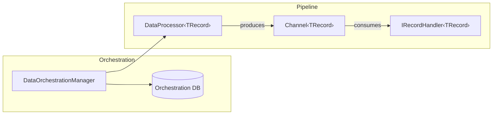

# Data Processing

Excalibur's data processing module provides a producer-consumer pipeline for batch processing database records. It handles orchestration (task tracking, progress, retries), while you supply the data fetching and record handling logic.

## Before You Start

- **.NET 8.0+** (or .NET 9/10 for latest features)
- Install the required package:
  ```bash
  dotnet add package Excalibur.Data.DataProcessing
  ```
- A SQL database for orchestration tables (task requests, progress tracking)
- Familiarity with [dependency injection](../core-concepts/dependency-injection.md) and [IOptions pattern](../configuration/index.md)

## Architecture



The `DataOrchestrationManager` tracks data task requests in a SQL table. Each `DataProcessor<TRecord>` runs a producer-consumer loop: the producer fetches batches from the source database and writes to an in-memory `Channel<TRecord>`, while the consumer reads from the channel and delegates to `IRecordHandler<TRecord>` implementations.

## Quick Start

### 1. Define a record type

```csharp
public record CustomerRecord(int Id, string Name, string Email);
```

### 2. Implement a data processor

```csharp
public class CustomerProcessor : DataProcessor<CustomerRecord>
{
    private readonly Func<IDbConnection> _connectionFactory;

    public CustomerProcessor(
        [FromKeyedServices("customers")] Func<IDbConnection> connectionFactory,
        IHostApplicationLifetime appLifetime,
        IOptions<DataProcessingOptions> configuration,
        IServiceProvider serviceProvider,
        ILogger<CustomerProcessor> logger)
        : base(appLifetime, configuration, serviceProvider, logger)
    {
        _connectionFactory = connectionFactory;
    }

    public override async Task<IEnumerable<CustomerRecord>> FetchBatchAsync(
        long skip, int batchSize, CancellationToken cancellationToken)
    {
        using var connection = _connectionFactory();
        return await connection.Ready().ResolveAsync(
            new SelectCustomerBatch(skip, batchSize, cancellationToken));
    }
}
```

### 3. Implement a record handler

```csharp
public class CustomerMigrationHandler : IRecordHandler<CustomerRecord>
{
    private readonly ILogger<CustomerMigrationHandler> _logger;

    public CustomerMigrationHandler(ILogger<CustomerMigrationHandler> logger)
    {
        _logger = logger;
    }

    public async Task ProcessAsync(CustomerRecord record, CancellationToken cancellationToken)
    {
        _logger.LogInformation("Processing customer {Id}: {Name}", record.Id, record.Name);
        // Transform, validate, write to target database, etc.
        await Task.CompletedTask;
    }
}
```

### 4. Register services

```csharp
// AOT-safe explicit registration (recommended)
builder.Services.AddDataProcessor<CustomerProcessor>(
    builder.Configuration, "DataProcessing");
builder.Services.AddRecordHandler<CustomerMigrationHandler, CustomerRecord>();

// Register the source database connection factory
builder.Services.AddKeyedSingleton<Func<IDbConnection>>(
    "customers",
    (_, _) => () => new SqlConnection(customersConnectionString));
```

## DI Registration

### Assembly Scanning (Reflection-Based)

Discovers all `IDataProcessor` and `IRecordHandler<T>` implementations via assembly scanning. Registers the orchestration connection factory as a keyed singleton.

```csharp
builder.Services.AddDataProcessing(
    () => new SqlConnection(orchestrationConnectionString),
    builder.Configuration,
    "DataProcessing",
    typeof(Program).Assembly);
```

:::warning AOT Compatibility
`AddDataProcessing` uses reflection-based assembly scanning and is annotated with `[RequiresUnreferencedCode]` and `[RequiresDynamicCode]`. For AOT-safe deployments, use the explicit generic overloads below.
:::

### AOT-Safe Explicit Registration

Register individual processors and handlers without assembly scanning:

```csharp
// Bare registration (no configuration)
builder.Services.AddDataProcessor<CustomerProcessor>();
builder.Services.AddRecordHandler<CustomerMigrationHandler, CustomerRecord>();

// With inline configuration object
builder.Services.AddDataProcessor<CustomerProcessor>(new DataProcessingOptions
{
    QueueSize = 128,
    ProducerBatchSize = 50,
    ConsumerBatchSize = 20
});

// With IConfiguration binding (recommended for production)
builder.Services.AddDataProcessor<CustomerProcessor>(
    builder.Configuration, "DataProcessing");
builder.Services.AddRecordHandler<CustomerMigrationHandler, CustomerRecord>(
    builder.Configuration, "DataProcessing");
```

### Registration API Reference

| Method | Configuration | Validation |
|--------|--------------|------------|
| `AddDataProcessor<T>()` | None | None |
| `AddDataProcessor<T>(DataProcessingOptions)` | Inline object | `ValidateDataAnnotations` + `ValidateOnStart` + cross-property |
| `AddDataProcessor<T>(IConfiguration, string)` | Bind from section | `ValidateDataAnnotations` + `ValidateOnStart` |
| `AddRecordHandler<T,R>()` | None | None |
| `AddRecordHandler<T,R>(DataProcessingOptions)` | Inline object | `ValidateDataAnnotations` + `ValidateOnStart` + cross-property |
| `AddRecordHandler<T,R>(IConfiguration, string)` | Bind from section | `ValidateDataAnnotations` + `ValidateOnStart` |
| `AddDataProcessing(Func, IConfig, string, Assembly[])` | Assembly scanning + bind | `ValidateDataAnnotations` + `ValidateOnStart` |
| `EnableDataProcessingBackgroundService(Action?)` | Optional configure action | `ValidateDataAnnotations` + `ValidateOnStart` + cross-property |

## Configuration

### DataProcessingOptions

| Property | Type | Default | Description |
|----------|------|---------|-------------|
| `SchemaName` | `string` | `"DataProcessor"` | SQL schema for the orchestration table |
| `TableName` | `string` | `"DataTaskRequests"` | SQL table name for orchestration task records |
| `QualifiedTableName` | `string` | (computed) | Read-only `[SchemaName].[TableName]` with bracket-escaping |
| `QueueSize` | `int` | 5000 | In-memory channel capacity between producer and consumer |
| `ProducerBatchSize` | `int` | 100 | Records fetched per producer iteration |
| `ConsumerBatchSize` | `int` | 10 | Records dequeued per consumer iteration |
| `MaxAttempts` | `int` | 3 | Maximum retry attempts per data task |
| `DispatcherTimeoutMilliseconds` | `int` | 60000 | Timeout for a dispatcher to process tasks (ms) |

All numeric properties require values > 0 (enforced by `[Range(1, int.MaxValue)]`).

### appsettings.json

```json
{
  "DataProcessing": {
    "SchemaName": "DataProcessor",
    "TableName": "DataTaskRequests",
    "QueueSize": 128,
    "ProducerBatchSize": 50,
    "ConsumerBatchSize": 20,
    "MaxAttempts": 3,
    "DispatcherTimeoutMilliseconds": 60000
  }
}
```

### Cross-Property Validation

An `IValidateOptions<DataProcessingOptions>` validator enforces inter-property constraints at startup:

| Rule | Constraint |
|------|-----------|
| `ProducerBatchSize` must not exceed `QueueSize` | Prevents the producer from overwhelming the channel |
| `ConsumerBatchSize` must not exceed `QueueSize` | Prevents impossible dequeue sizes |
| `DispatcherTimeoutMilliseconds` must be 1,000–3,600,000 | Enforces 1 second to 1 hour range |

If any constraint fails, the application throws `OptionsValidationException` at startup (fail-fast).

## Database Setup

The data processing system requires one table in your SQL Server database. Create the schema and table before starting the application:

```sql
-- Create the schema (if it doesn't exist)
IF NOT EXISTS (SELECT 1 FROM sys.schemas WHERE name = 'DataProcessor')
BEGIN
    EXEC('CREATE SCHEMA [DataProcessor]');
END
GO

-- Create the data task requests table
IF NOT EXISTS (SELECT 1 FROM sys.objects
    WHERE object_id = OBJECT_ID(N'[DataProcessor].[DataTaskRequests]') AND type = N'U')
BEGIN
    CREATE TABLE [DataProcessor].[DataTaskRequests]
    (
        [DataTaskId]     UNIQUEIDENTIFIER  NOT NULL,
        [CreatedAt]      DATETIMEOFFSET    NOT NULL,
        [RecordType]     NVARCHAR(256)     NOT NULL,
        [Attempts]       INT               NOT NULL DEFAULT 0,
        [MaxAttempts]    INT               NOT NULL DEFAULT 3,
        [CompletedCount] INT               NOT NULL DEFAULT 0,

        CONSTRAINT [PK_DataTaskRequests] PRIMARY KEY CLUSTERED ([DataTaskId])
    );

    -- Index for the polling query (WHERE Attempts < MaxAttempts ORDER BY CreatedAt)
    CREATE NONCLUSTERED INDEX [IX_DataTaskRequests_Pending]
        ON [DataProcessor].[DataTaskRequests] ([Attempts], [MaxAttempts])
        INCLUDE ([DataTaskId], [CreatedAt], [RecordType], [CompletedCount])
        WHERE [Attempts] < [MaxAttempts];
END
GO
```

If you customize `SchemaName` or `TableName` in `DataProcessingOptions`, update the script accordingly. A complete setup script is included in the [DataProcessingBackgroundService sample](https://github.com/nickniverson/Excalibur.Dispatch/tree/main/samples/09-advanced/DataProcessingBackgroundService/setup-database.sql).

## Orchestration Connection

The `AddDataProcessing` method registers the orchestration database connection factory as a **keyed singleton** under `DataProcessingKeys.OrchestrationConnection`. This connection is used by `DataOrchestrationManager` to manage data task records.

```csharp
// Resolve explicitly in your own services
public class MyService(
    [FromKeyedServices(DataProcessingKeys.OrchestrationConnection)]
    Func<IDbConnection> orchestrationFactory)
{
    // orchestrationFactory creates connections to the orchestration database
}
```

The key value is `"Excalibur.DataProcessing.Orchestration"`.

## Multi-Database

When processors need different source databases, use .NET 8 keyed services:

```csharp
var orchestrationDb = builder.Configuration.GetConnectionString("Orchestration");
var customersDb = builder.Configuration.GetConnectionString("CustomersDb");
var inventoryDb = builder.Configuration.GetConnectionString("InventoryDb");

// Orchestration database (registered as keyed singleton automatically)
builder.Services.AddDataProcessing(
    () => new SqlConnection(orchestrationDb),
    builder.Configuration,
    "DataProcessing",
    typeof(Program).Assembly);

// Source database factories for individual processors
builder.Services.AddKeyedSingleton<Func<IDbConnection>>(
    "customers",
    (_, _) => () => new SqlConnection(customersDb));

builder.Services.AddKeyedSingleton<Func<IDbConnection>>(
    "inventory",
    (_, _) => () => new SqlConnection(inventoryDb));
```

Each processor injects its keyed factory:

```csharp
public class CustomerProcessor : DataProcessor<CustomerRecord>
{
    private readonly Func<IDbConnection> _connectionFactory;

    public CustomerProcessor(
        [FromKeyedServices("customers")] Func<IDbConnection> connectionFactory,
        IHostApplicationLifetime appLifetime,
        IOptions<DataProcessingOptions> configuration,
        IServiceProvider serviceProvider,
        ILogger<CustomerProcessor> logger)
        : base(appLifetime, configuration, serviceProvider, logger)
    {
        _connectionFactory = connectionFactory;
    }

    public override async Task<IEnumerable<CustomerRecord>> FetchBatchAsync(
        long skip, int batchSize, CancellationToken cancellationToken)
    {
        using var connection = _connectionFactory();
        return await connection.Ready().ResolveAsync(
            new SelectCustomerBatch(skip, batchSize, cancellationToken));
    }
}
```

See [Multi-Database Support](../data-providers/multi-database.md#data-processing-multi-database) for full details including configuration examples.

## Key Abstractions

### IDataProcessor

The core processing interface. Implementations run the producer-consumer pipeline.

```csharp
public interface IDataProcessor : IAsyncDisposable, IDisposable
{
    Task<long> RunAsync(
        long completedCount,
        UpdateCompletedCount updateCompletedCount,
        CancellationToken cancellationToken);
}
```

### DataProcessor\<TRecord\>

Abstract base class providing the producer-consumer pipeline. You implement `FetchBatchAsync` to supply records:

```csharp
public abstract class DataProcessor<TRecord> : IDataProcessor, IRecordFetcher<TRecord>
{
    // You implement this:
    public abstract Task<IEnumerable<TRecord>> FetchBatchAsync(
        long skip, int batchSize, CancellationToken cancellationToken);
}
```

The base class handles:
- Channel-based producer-consumer coordination
- Batch sizing (configurable via `DataProcessingOptions`)
- Progress tracking (via `UpdateCompletedCount` delegate)
- Graceful shutdown on application stop
- Logging via `[LoggerMessage]` source generation

### IRecordHandler\<TRecord\>

Processes individual records from the consumer side of the channel:

```csharp
public interface IRecordHandler<in TRecord>
{
    Task ProcessAsync(TRecord record, CancellationToken cancellationToken);
}
```

## Best Practices

| Practice | Recommendation |
|----------|----------------|
| Registration | Use AOT-safe `AddDataProcessor<T>` for production; assembly scanning for prototyping |
| Configuration | Use `IConfiguration` binding with `ValidateOnStart` for fail-fast startup |
| Connection management | Use `Func<IDbConnection>` factories with keyed services for multi-database |
| Batch sizes | Set `ProducerBatchSize` and `ConsumerBatchSize` at or below `QueueSize` (validated at startup) |
| Timeouts | Keep `DispatcherTimeoutMilliseconds` at 1000ms or above; default 60s is suitable for most cases |
| Error handling | Implement retry logic in `IRecordHandler<T>.ProcessAsync`; `MaxAttempts` controls task-level retries |

## Background Processing

Instead of scheduling data processing via Quartz jobs, you can use the built-in `BackgroundService` that polls for pending data tasks on a configurable interval.

### Enable Background Service

```csharp
// Enable with defaults (5s polling interval)
builder.Services.EnableDataProcessingBackgroundService();

// Enable with custom options
builder.Services.EnableDataProcessingBackgroundService(options =>
{
    options.PollingInterval = TimeSpan.FromSeconds(10);
    options.DrainTimeoutSeconds = 60;
    options.UnhealthyThreshold = 5;
});
```

The hosted service calls `IDataOrchestrationManager.ProcessDataTasksAsync()` on each polling cycle. It works with both the assembly-scanning registration path (`AddDataProcessing`) and the AOT-safe explicit registration path (`AddDataProcessor<T>`).

:::info Two Separate Options Classes
Configuration is split into two concerns:

- **`DataProcessingOptions`** -- pipeline tuning: `SchemaName`, `TableName`, `QueueSize`, `ProducerBatchSize`, `ConsumerBatchSize`, `MaxAttempts`
- **`DataProcessingHostedServiceOptions`** -- polling lifecycle: `PollingInterval`, `Enabled`, `DrainTimeoutSeconds`, `UnhealthyThreshold`

```csharp
// Pipeline tuning (queue sizes, batching, table config)
builder.Services.AddDataProcessor<OrderDataProcessor>(new DataProcessingOptions
{
    SchemaName = "DataProcessor",
    TableName = "DataTaskRequests",
    QueueSize = 500,
    ProducerBatchSize = 50,
    ConsumerBatchSize = 10,
    MaxAttempts = 3,
});
builder.Services.AddRecordHandler<OrderRecordHandler, OrderRecord>();

// Or bind pipeline options from appsettings.json:
// builder.Services.AddDataProcessor<OrderDataProcessor>(
//     builder.Configuration, "DataProcessing");

// Polling/lifecycle tuning (separate concern)
builder.Services.EnableDataProcessingBackgroundService(options =>
{
    options.PollingInterval = TimeSpan.FromSeconds(10);
    options.DrainTimeoutSeconds = 60;
});
```

Both can also be configured entirely via `appsettings.json`:

```json
{
  "DataProcessing": {
    "SchemaName": "DataProcessor",
    "TableName": "DataTaskRequests",
    "QueueSize": 500,
    "ProducerBatchSize": 50,
    "ConsumerBatchSize": 10,
    "MaxAttempts": 3
  }
}
```

:::

### DataProcessingHostedServiceOptions

| Property | Type | Default | Description |
|----------|------|---------|-------------|
| `PollingInterval` | `TimeSpan` | 5 seconds | Interval between polling cycles |
| `Enabled` | `bool` | `true` | Whether the background processor is active |
| `DrainTimeoutSeconds` | `int` | 30 | Seconds to wait for in-flight processing during shutdown |
| `UnhealthyThreshold` | `int` | 3 | Consecutive errors before the service is considered unhealthy |

:::tip Computed Property
`DrainTimeout` is a read-only `TimeSpan` computed from `DrainTimeoutSeconds`. Use `DrainTimeoutSeconds` in configuration.
:::

### Cross-Property Validation

An `IValidateOptions<DataProcessingHostedServiceOptions>` validator enforces at startup:

| Rule | Constraint |
|------|-----------|
| `PollingInterval` must be positive | Prevents zero or negative polling |
| `DrainTimeout` must exceed `PollingInterval` | Ensures the drain window covers at least one full cycle |
| `UnhealthyThreshold` must be >= 1 | At least one error before marking unhealthy |

### Health Tracking

The hosted service tracks health state internally:
- **Healthy** on startup and after each successful processing cycle
- **Unhealthy** after `UnhealthyThreshold` consecutive errors
- **Error counter resets** to zero on any successful cycle

Access health state programmatically by resolving the `DataProcessingHostedService` from DI (it exposes `IsHealthy`, `ConsecutiveErrors`, and `LastSuccessfulProcessing` properties).

### Configuration via appsettings.json

```json
{
  "DataProcessingHostedService": {
    "PollingInterval": "00:00:10",
    "Enabled": true,
    "DrainTimeoutSeconds": 60,
    "UnhealthyThreshold": 5
  }
}
```

### Complete Example

```csharp
var builder = WebApplication.CreateBuilder(args);
var connectionString = builder.Configuration.GetConnectionString("DefaultConnection")!;

// 1. Register orchestration connection
builder.Services.AddKeyedSingleton(
    DataProcessingKeys.OrchestrationConnection,
    (_, _) => (Func<IDbConnection>)(() => new SqlConnection(connectionString)));

// 2. Register processor and handler (AOT-safe)
builder.Services.AddDataProcessor<OrderDataProcessor>(
    builder.Configuration, "DataProcessing");
builder.Services.AddRecordHandler<OrderRecordHandler, OrderRecord>();

// 3. Enable background service
builder.Services.EnableDataProcessingBackgroundService(options =>
{
    options.PollingInterval = TimeSpan.FromSeconds(10);
    options.DrainTimeoutSeconds = 60;
    options.UnhealthyThreshold = 5;
});

var app = builder.Build();
app.Run();
```

### Quartz vs Background Service

| Aspect | Quartz Job | Background Service |
|--------|-----------|-------------------|
| Scheduling | Cron expressions, complex schedules | Fixed polling interval |
| Dependencies | Requires `Excalibur.Jobs` + Quartz.NET | Built-in, no extra packages |
| Concurrency control | Job disallow concurrent execution | Single hosted service instance |
| Health monitoring | Via Quartz job listeners | Built-in `IsHealthy` / `UnhealthyThreshold` |
| Graceful shutdown | Quartz scheduler shutdown | `DrainTimeout` with linked cancellation |
| Best for | Complex schedules, multi-job orchestration | Simple polling, minimal dependencies |

## See Also

- [Multi-Database Support](../data-providers/multi-database.md#data-processing-multi-database) -- Keyed service registration for multi-database processors
- [Configuration Overview](../configuration/index.md) -- IOptions pattern and ValidateOnStart
- [SQL Server Provider](../data-providers/sqlserver.md) -- SQL Server connection setup
