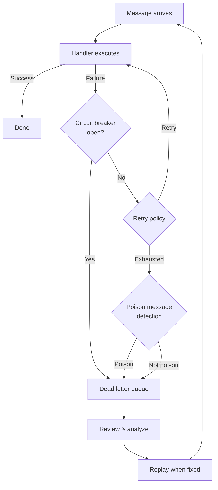
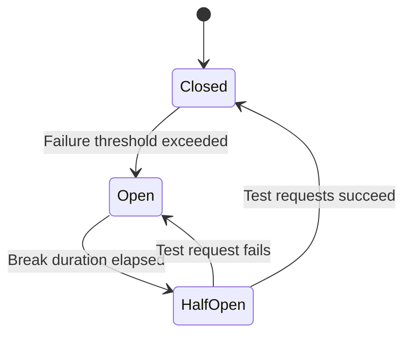

# Error Handling & Recovery Guide

Every message in a distributed system can fail. Networks drop, databases lock, external APIs time out, and services crash. The question is not whether failures will happen, but what happens to the message when they do.

This guide explains the complete failure lifecycle in Excalibur.Dispatch: from the first failed attempt, through retries and circuit breakers, into the dead letter queue, and back out via recovery. Understanding how these features compose is the key to building a system that handles failure gracefully.

## Before You Start

- **.NET 8.0+** (or .NET 9/10 for latest features)
- Install the required package:
  ```bash
  dotnet add package Excalibur.Dispatch
  ```
- Familiarity with [pipeline concepts](../pipeline/index.md) and [dead letter queues](./dead-letter.md)

## Why Messages Fail

Message processing failures fall into two categories, and the distinction matters because it determines the correct response.

### Transient Failures

Temporary problems that resolve on their own. Retrying is the correct response.

- Database connection timeout
- Network blip to an external API
- SQL deadlock between concurrent transactions
- Cloud service throttling (HTTP 429)
- Temporary resource exhaustion

### Permanent Failures

Problems that will never resolve by retrying. Continuing to retry wastes resources and delays other messages.

- Message payload cannot be deserialized (corrupt or wrong schema)
- No handler registered for the message type
- Business rule violation (order amount is negative)
- Authorization failed (invalid credentials)
- External resource permanently gone (HTTP 404/410)

The framework's job is to retry transient failures, stop retrying permanent failures quickly, and capture everything that fails for later analysis.

## The Failure Lifecycle

When a message fails processing, it moves through up to four layers of protection. Each layer operates independently, and you configure each one based on your needs.



### Layer 1: Retry Policy

The first line of defense. When a handler throws, the retry policy determines whether and how to retry.

```csharp
services.AddDispatch(dispatch =>
{
    dispatch.AddDispatchResilience(options =>
    {
        options.EnableRetry = true;
        options.EnableCircuitBreaker = true;
    });
});

// Named retry policies for specific operations
services.AddPollyRetryPolicy("transient-retry", options =>
{
    options.MaxRetries = 3;
    options.BaseDelay = TimeSpan.FromMilliseconds(200);
    options.UseExponentialBackoff = true;  // 200ms, 400ms, 800ms
    options.UseJitter = true;             // Prevents thundering herd
});
```

Dispatch supports two retry strategies:

| Strategy | Delay Pattern | Best For |
|----------|--------------|----------|
| `FixedDelay` | Same delay each time (e.g., 1s, 1s, 1s) | Predictable backoff, simple scenarios |
| `ExponentialBackoff` | Increasing delay (e.g., 200ms, 400ms, 800ms) | Network/API failures, database contention |

**Jitter** adds randomness to the delay. Without jitter, if 100 consumers all fail at the same time, they all retry at the same time, causing another failure. Jitter spreads retries across a time window.

You can also classify exceptions to control retry behavior:

```csharp
services.AddPoisonMessageHandling(options =>
{
    // Never retry these (permanent failures)
    options.PoisonExceptionTypes.Add(typeof(InvalidOperationException));
    options.PoisonExceptionTypes.Add(typeof(ArgumentNullException));

    // Always retry these (transient failures)
    options.TransientExceptionTypes.Add(typeof(TimeoutException));
    options.TransientExceptionTypes.Add(typeof(HttpRequestException));
});
```

### Layer 2: Circuit Breaker

The circuit breaker prevents your system from hammering a failing dependency. If a service is down, retrying every message against it wastes resources and can cascade the failure.

```csharp
services.AddPollyCircuitBreaker("payment-service", options =>
{
    options.FailureThreshold = 5;          // Open after 5 failures
    options.SamplingDuration = TimeSpan.FromSeconds(30);
    options.MinimumThroughput = 10;        // Need 10 requests in window
    options.DurationOfBreak = TimeSpan.FromSeconds(60);
});
```

The circuit breaker has three states:



| State | Behavior |
|-------|----------|
| **Closed** | Normal operation. Requests flow through. Failures are counted. |
| **Open** | All requests are rejected immediately without calling the handler. Messages go directly to the dead letter queue with reason `CircuitBreakerOpen`. |
| **Half-Open** | A limited number of test requests are allowed through. If they succeed, the circuit closes. If they fail, it opens again. |

**Transport isolation** is built in. Each transport gets its own circuit breaker, so a Kafka failure doesn't affect RabbitMQ processing:

```csharp
// Per-transport circuit breaker registry
var registry = serviceProvider.GetRequiredService<ITransportCircuitBreakerRegistry>();

// Check state
var states = registry.GetAllStates();
// { "kafka": Closed, "rabbitmq": Open, "azure-service-bus": Closed }

// Reset a specific transport
var cb = registry.TryGet("rabbitmq");
```

### Layer 3: Poison Message Detection

After retries are exhausted, the `PoisonMessageMiddleware` evaluates whether the message is a poison message -- one that will always fail regardless of how many times you retry it.

```csharp
services.AddDispatch(dispatch =>
{
    dispatch.UsePoisonMessageDetection(options =>
    {
        options.MaxRetryAttempts = 5;
        options.MaxProcessingTime = TimeSpan.FromMinutes(5);
        options.PoisonExceptionTypes.Add(typeof(JsonException));
    });
});
```

Dispatch includes four built-in detectors:

| Detector | Triggers When |
|----------|--------------|
| `RetryCountPoisonDetector` | Message has exceeded the max retry count |
| `ExceptionTypePoisonDetector` | Exception type is in the poison list (e.g., `JsonException`, `ArgumentNullException`) |
| `TimespanPoisonDetector` | Message has been in processing for longer than the max age |
| `CompositePoisonDetector` | Any of the above detectors triggers |

You can add custom detectors for domain-specific logic:

```csharp
public class BusinessRulePoisonDetector : IPoisonMessageDetector
{
    public Task<PoisonDetectionResult> IsPoisonMessageAsync(
        IDispatchMessage message,
        IMessageContext context,
        MessageProcessingInfo processingInfo,
        Exception? exception = null)
    {
        // Non-retryable business exception
        if (exception is BusinessRuleViolationException)
        {
            return Task.FromResult(PoisonDetectionResult.Poison(
                reason: "Business rule violation - will never succeed on retry",
                detectorName: nameof(BusinessRulePoisonDetector)));
        }

        return Task.FromResult(PoisonDetectionResult.NotPoison());
    }
}

services.AddDispatch(dispatch =>
{
    dispatch.AddPoisonDetector<BusinessRulePoisonDetector>();
});
```

### Layer 4: Dead Letter Queue

When a message cannot be processed -- either because retries are exhausted, the circuit breaker is open, or it's been detected as poison -- it moves to the dead letter queue.

The DLQ preserves the full context of the failure: the original message, the exception, the number of delivery attempts, the reason, and any metadata. Nothing is lost.

```csharp
services.AddDispatch(dispatch =>
{
    dispatch.AddPoisonMessageHandling(options =>
    {
        options.MaxRetryAttempts = 3;
        options.DeadLetterRetentionPeriod = TimeSpan.FromDays(30);
        options.EnableAutoCleanup = true;
    });
});
```

Every message that enters the DLQ is tagged with a reason:

| Reason | What Happened |
|--------|--------------|
| `MaxRetriesExceeded` | Handler failed on every retry attempt |
| `CircuitBreakerOpen` | Circuit breaker rejected the message |
| `DeserializationFailed` | Message payload could not be deserialized |
| `HandlerNotFound` | No handler registered for this message type |
| `ValidationFailed` | Message failed validation middleware |
| `AuthorizationFailed` | Authorization check rejected the message |
| `MessageExpired` | Message TTL expired before processing |
| `ManualRejection` | Handler explicitly rejected the message |
| `PoisonMessage` | Detected as poison by a detector |
| `UnhandledException` | Unhandled exception in processing |

## Two Levels of Dead Letter Handling

Dispatch provides dead letter handling at two independent levels. They can be used separately or together.

### Application-Level DLQ

The `IDeadLetterQueue` interface provides a transport-agnostic DLQ that works with any transport. Messages are captured at the Dispatch pipeline level.

```csharp
// Query dead letter entries
var entries = await dlq.GetEntriesAsync(
    DeadLetterQueryFilter.ByReason(DeadLetterReason.MaxRetriesExceeded),
    limit: 50,
    cancellationToken);

// Replay a single entry after fixing the issue
await dlq.ReplayAsync(entryId, cancellationToken);

// Batch replay all validation failures after updating validation logic
var replayedCount = await dlq.ReplayBatchAsync(
    DeadLetterQueryFilter.ByReason(DeadLetterReason.ValidationFailed),
    cancellationToken);

// Purge old entries
await dlq.PurgeOlderThanAsync(TimeSpan.FromDays(30), cancellationToken);
```

Providers for persistent storage:

| Provider | Package | Use Case |
|----------|---------|----------|
| In-Memory | Built-in | Testing, development |
| SQL Server | `Excalibur.Data.SqlServer` | SQL Server production |
| Elasticsearch | `Excalibur.Data.ElasticSearch` | Analytics, search, audit |

### Transport-Level DLQ

Each transport can also implement `IDeadLetterQueueManager` for native DLQ support. Transport-level DLQs use the broker's own infrastructure, which is important when messages fail before they even reach the Dispatch pipeline (e.g., deserialization failures in the transport adapter).

| Transport | Mechanism | Status |
|-----------|----------|--------|
| Kafka | Topic-based (`{topic}.dead-letter`) | Available |
| AWS SQS | Queue-based (native redrive via `IAmazonSQS`) | Available |
| Google Pub/Sub | Subscription-based | Available |
| Azure Service Bus | Subqueue-based | Planned |
| RabbitMQ | Exchange-based | Planned |

The transport-level interface supports the same operations -- move, retrieve, reprocess, statistics, purge:

```csharp
// Get statistics about failed messages
var stats = await dlqManager.GetStatisticsAsync(cancellationToken);
// stats.MessageCount, stats.ReasonBreakdown, stats.OldestMessageAge

// Reprocess messages back to their original queue
var result = await dlqManager.ReprocessDeadLetterMessagesAsync(
    messages,
    new ReprocessOptions
    {
        RemoveFromDlq = true,
        ProcessInParallel = true,
        MaxDegreeOfParallelism = 4
    },
    cancellationToken);
// result.SuccessCount, result.FailureCount, result.ProcessingTime
```

## How Retries and Idempotency Work Together

A common question: if a message is retried 3 times, does the inbox see 3 different messages or the same message 3 times?

The answer depends on who is doing the retrying:

| Retry Source | Same MessageId? | Inbox Behavior |
|-------------|----------------|----------------|
| **Pipeline retry** (Polly/built-in) | Yes -- same pipeline invocation | Inbox is not consulted during retries within one pipeline execution |
| **Broker redelivery** | Yes -- same transport message | Inbox detects duplicate and skips |
| **Publisher retry** (outbox re-publish) | Depends on outbox implementation | Use `MessageIdStrategy.Custom` with business keys for safety |

Pipeline retries happen inside a single message processing attempt. The inbox operates at the pipeline boundary -- it checks on message arrival and records on completion. So pipeline retries don't conflict with idempotency; they complement it.

**Reference:** [Idempotent Consumer Guide](idempotent-consumer.md) for the full inbox pattern.

## Monitoring Failed Messages

### Health Checks

Monitor DLQ depth as a health indicator:

```csharp
public class DeadLetterHealthCheck : IHealthCheck
{
    private readonly IDeadLetterQueue _dlq;

    public DeadLetterHealthCheck(IDeadLetterQueue dlq) => _dlq = dlq;

    public async Task<HealthCheckResult> CheckHealthAsync(
        HealthCheckContext context,
        CancellationToken ct)
    {
        var count = await _dlq.GetCountAsync(
            DeadLetterQueryFilter.PendingOnly(), ct);

        return count switch
        {
            > 100 => HealthCheckResult.Degraded(
                $"Dead letter queue has {count} pending entries"),
            > 0 => HealthCheckResult.Healthy(
                $"{count} entries in DLQ"),
            _ => HealthCheckResult.Healthy()
        };
    }
}
```

### Alerting on Thresholds

```csharp
services.AddPoisonMessageHandling(options =>
{
    options.EnableAlerting = true;
    options.AlertThreshold = 10;                      // Alert if 10+ failures
    options.AlertTimeWindow = TimeSpan.FromMinutes(15); // Within 15 minutes
});
```

### Circuit Breaker State

```csharp
var registry = serviceProvider.GetRequiredService<ITransportCircuitBreakerRegistry>();
var states = registry.GetAllStates();

foreach (var (transport, state) in states)
{
    if (state == CircuitState.Open)
    {
        logger.LogWarning("Circuit breaker OPEN for transport {Transport}", transport);
    }
}
```

## Recovery Strategies

When messages land in the DLQ, the recovery approach depends on the failure category.

### Transient Failures (MaxRetriesExceeded)

These usually resolve on their own. Wait for the underlying issue to clear, then replay:

```csharp
// After the database/service recovers, replay all transient failures
var count = await dlq.ReplayBatchAsync(
    DeadLetterQueryFilter.ByReason(DeadLetterReason.MaxRetriesExceeded),
    cancellationToken);

logger.LogInformation("Replayed {Count} messages after service recovery", count);
```

### Validation Failures

Fix the validation logic or data, then replay:

```csharp
var failures = await dlq.GetEntriesAsync(
    DeadLetterQueryFilter.ByReason(DeadLetterReason.ValidationFailed),
    cancellationToken: ct);

// Review each entry
foreach (var entry in failures)
{
    logger.LogInformation(
        "Validation failure: {Type} at {Time} - {Exception}",
        entry.MessageType,
        entry.EnqueuedAt,
        entry.ExceptionMessage);
}

// After updating validation rules, replay the batch
await dlq.ReplayBatchAsync(
    DeadLetterQueryFilter.ByReason(DeadLetterReason.ValidationFailed), ct);
```

### Deserialization Failures

These are permanent. The message payload is corrupt or the schema has changed. Review, fix the data or schema, then decide whether to replay or purge:

```csharp
var deserializationFailures = await dlq.GetEntriesAsync(
    DeadLetterQueryFilter.ByReason(DeadLetterReason.DeserializationFailed),
    cancellationToken: ct);

// These rarely succeed on replay -- purge after investigation
await dlq.PurgeOlderThanAsync(TimeSpan.FromDays(7), ct);
```

### Transport-Level Recovery (Reprocessing)

For transport-native DLQs, use `ReprocessOptions` for fine-grained control:

```csharp
var result = await dlqManager.ReprocessDeadLetterMessagesAsync(
    messages,
    new ReprocessOptions
    {
        // Only reprocess messages from the last hour
        MessageFilter = msg => msg.DeadLetteredAt > DateTimeOffset.UtcNow.AddHours(-1),
        // Transform messages before replay (e.g., fix headers)
        MessageTransform = msg =>
        {
            msg.Headers["RetrySource"] = "manual-recovery";
            return msg;
        },
        RemoveFromDlq = true,
        RetryDelay = TimeSpan.FromMilliseconds(100),
        MaxMessages = 100
    },
    cancellationToken);

logger.LogInformation(
    "Reprocessed {Success}/{Total} messages in {Duration}",
    result.SuccessCount, result.TotalCount, result.ProcessingTime);
```

## Decision Guide: What Level of Protection Do You Need?

Not every handler needs every layer. Match the protection to the consequence of failure.

```
Is the message from an external system (broker redelivery possible)?
  NO  --> Internal pipeline only? Basic retry is usually sufficient.
  YES --> What happens if processing fails permanently?
            Nothing (metrics, logs) --> Retry only, no DLQ needed
            Minor issue (duplicate email) --> Retry + DLQ for monitoring
            Data loss or corruption --> Retry + Circuit breaker + DLQ + Idempotent inbox
            Financial impact --> All layers + transport-level DLQ
```

### Recommended Configurations

**Minimal** -- Internal messages, low consequence:

```csharp
services.AddDispatch(dispatch =>
{
    dispatch.AddDispatchResilience(options =>
    {
        options.EnableRetry = true;
    });
});
```

**Standard** -- External messages, moderate consequence:

```csharp
services.AddDispatch(dispatch =>
{
    dispatch.AddDispatchResilience(options =>
    {
        options.EnableRetry = true;
        options.EnableCircuitBreaker = true;
    });

    dispatch.AddPoisonMessageHandling(options =>
    {
        options.MaxRetryAttempts = 3;
        options.DeadLetterRetentionPeriod = TimeSpan.FromDays(30);
        options.EnableAutoCleanup = true;
    });
});
```

**Full protection** -- Financial transactions, critical business processes:

```csharp
services.AddDispatch(dispatch =>
{
    dispatch.AddHandlersFromAssembly(typeof(Program).Assembly);

    // Resilience: retry + circuit breaker
    dispatch.AddDispatchResilience(options =>
    {
        options.EnableRetry = true;
        options.EnableCircuitBreaker = true;
    });

    // Poison message detection
    dispatch.UsePoisonMessageDetection(options =>
    {
        options.MaxRetryAttempts = 5;
        options.MaxAge = TimeSpan.FromHours(24);
        options.PoisonExceptionTypes.Add(typeof(JsonException));
    });

    // Dead letter queue with alerting
    dispatch.AddPoisonMessageHandling(options =>
    {
        options.DeadLetterRetentionPeriod = TimeSpan.FromDays(90);
        options.EnableAlerting = true;
        options.AlertThreshold = 5;
    });
});

// Transport-specific DLQ (e.g., Kafka)
services.AddKafkaDeadLetterQueue(options =>
{
    options.MaxDeliveryAttempts = 3;
});

// Named policies for critical operations
services.AddPollyRetryPolicy("payment-retry", options =>
{
    options.MaxRetries = 5;
    options.UseExponentialBackoff = true;
    options.UseJitter = true;
});

services.AddPollyCircuitBreaker("payment-cb", options =>
{
    options.FailureThreshold = 3;
    options.DurationOfBreak = TimeSpan.FromSeconds(60);
});

// Persistent DLQ store
services.AddSqlServerDeadLetterStore(connectionString);

// Idempotent consumer for critical handlers
services.AddSqlServerInboxStore(options =>
{
    options.ConnectionString = connectionString;
});
```

## Summary

| Layer | Purpose | Handles | Reference |
|-------|---------|---------|-----------|
| **Retry** | Recover from transient failures | Timeouts, deadlocks, throttling | [Polly Resilience](../operations/resilience-polly.md) |
| **Circuit Breaker** | Stop cascading failures | Downstream service outages | [Polly Resilience](../operations/resilience-polly.md) |
| **Poison Detection** | Identify permanent failures early | Bad payloads, missing handlers | [Dead Letter](dead-letter.md) |
| **Dead Letter Queue** | Preserve failed messages for analysis | All failures after retry exhaustion | [Dead Letter](dead-letter.md) |
| **Recovery/Replay** | Reprocess after fixing the issue | DLQ entries | [Dead Letter](dead-letter.md) |
| **Idempotent Consumer** | Prevent duplicate processing on replay | Redelivered messages | [Idempotent Consumer](idempotent-consumer.md) |

These layers are independent. You can use retry without a DLQ, a DLQ without circuit breakers, or all of them together. Start with retry and DLQ, then add circuit breakers and poison detection as your system grows.

## Next Steps

- [Polly Resilience](../operations/resilience-polly.md) -- Full retry, circuit breaker, timeout, and bulkhead configuration
- [Dead Letter Handling](dead-letter.md) -- DLQ interface, providers, filtering, and replay
- [Operational Resilience](../operations/resilience.md) -- Provider-level retry policies for SQL Server, PostgreSQL, cloud databases
- [Idempotent Consumer Guide](idempotent-consumer.md) -- Ensure replay doesn't cause duplicate processing

## See Also

- [Dead Letter Handling](dead-letter.md) -- DLQ interface reference, filtering, replay, and provider configuration
- [Polly Resilience](../operations/resilience-polly.md) -- Detailed retry, circuit breaker, timeout, and bulkhead policy setup
- [Recovery Runbooks](../operations/recovery-runbooks.md) -- Step-by-step operational procedures for production incident recovery
- [Validation Middleware](../middleware/validation.md) -- Configure message validation that feeds into the error handling pipeline
