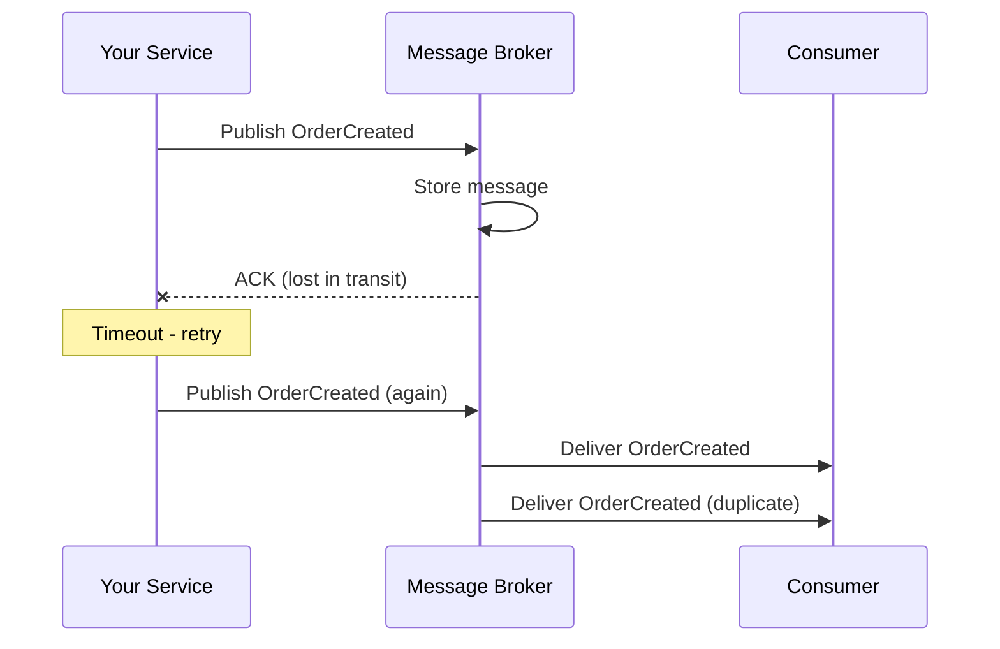
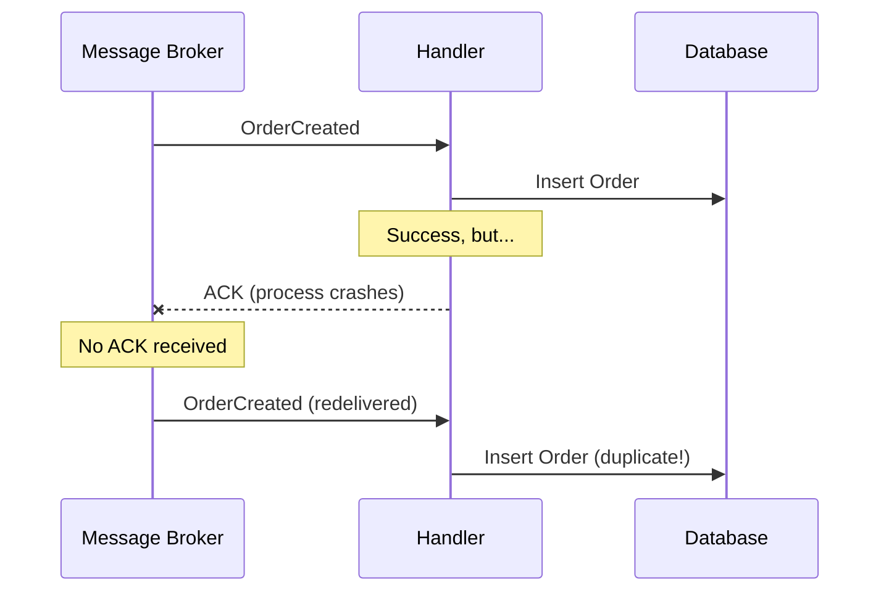
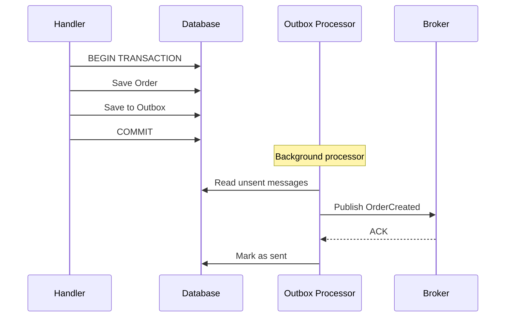

# Idempotent Consumer Guide

Distributed systems are unreliable by nature. Messages can arrive out of order, be duplicated, or be delayed indefinitely. If you design your system assuming every message will be processed exactly once, you are setting yourself up for subtle data corruption.

This guide explains why duplicate messages happen, how Excalibur protects you at both the producer and consumer side, and how to choose the right level of protection for each handler.

## Before You Start

- **.NET 8.0+** (or .NET 9/10 for latest features)
- Install the required packages:
  ```bash
  dotnet add package Excalibur.Dispatch
  dotnet add package Excalibur.Outbox  # for inbox/dedup support
  ```
- Familiarity with [outbox pattern](./outbox.md) and [inbox pattern](./inbox.md)

## Why Messages Get Duplicated

There are three common failure paths that produce duplicate messages, all of which happen in normal operation.

### Producer-Side Duplicates

Your service publishes an event. The broker stores it and sends an acknowledgment. A network glitch means the ACK never reaches your service. Your service times out and retries. The broker now has two copies of the same event.



### Consumer-Side Duplicates

Your consumer processes a message successfully but crashes before acknowledging it. The broker assumes the message was never processed and redelivers it.



### Broker Redelivery

Most brokers implement at-least-once delivery. If the consumer takes too long, the broker may redeliver the message to another instance. Both instances process the same message.

These are not edge cases. In any system running at scale, they happen regularly.

## The Two Sides of the Solution

Excalibur addresses duplicate messages at both the producer and consumer side. Understanding both is important because they solve different problems.

### Producer Side: The Transactional Outbox

The most robust way to prevent duplicate publishes is to never publish directly to the broker at all. Instead, store outbound messages in the **same database transaction** as your business data changes. A background processor reads the outbox and publishes to the broker.



This guarantees that:

- If the business operation fails, no message is published
- If the business operation succeeds, the message is guaranteed to be published (eventually)
- The publisher can safely retry because the outbox processor is idempotent

```csharp
public class CreateOrderHandler : IActionHandler<CreateOrderAction, IMessageContext>
{
    private readonly IDbConnection _db;

    public async Task HandleAsync(
        CreateOrderAction action,
        IMessageContext context,
        CancellationToken ct)
    {
        using var transaction = _db.BeginTransaction();

        // Business logic
        var orderId = Guid.NewGuid();
        await _db.ExecuteAsync(
            "INSERT INTO Orders (Id, CustomerId) VALUES (@Id, @CustomerId)",
            new { Id = orderId, action.CustomerId },
            transaction);

        // Stage message in outbox (same transaction)
        context.AddOutboundMessage(
            new OrderCreatedEvent(orderId, action.CustomerId),
            destination: "orders");

        transaction.Commit();
        // Message published later by background processor
    }
}
```

The outbox pattern is the gold standard for producer-side reliability. Most message brokers also support message deduplication via a stable `MessageId` (Azure Service Bus, Amazon SQS content-based deduplication), but broker-level dedup has time windows and is not a substitute for the outbox when you need transactional consistency between your data and your messages.

**Reference:** [Outbox Pattern](outbox.md) for full configuration, store providers, and presets.

### Consumer Side: The Idempotent Consumer

Even with a perfect producer, the consumer must handle redeliveries. The Idempotent Consumer pattern tracks which messages have been processed and skips duplicates.

Excalibur provides this at two levels:

| Level | Component | Scope |
|-------|-----------|-------|
| **Per-handler** | `[Idempotent]` attribute + `IdempotentHandlerMiddleware` | Opt-in per handler |
| **Pipeline-wide** | `InboxMiddleware` | All messages in the pipeline |

The per-handler approach is recommended for most scenarios because it lets you choose exactly which handlers need protection and how they extract message IDs.

## Implementing the Idempotent Consumer

### The Simple Case: `[Idempotent]` Attribute

Mark any handler that must not process duplicates:

```csharp
[Idempotent]
public class ProcessPaymentHandler : IEventHandler<PaymentRequestedEvent>
{
    private readonly IPaymentGateway _gateway;

    public async Task HandleAsync(PaymentRequestedEvent @event, CancellationToken ct)
    {
        // This code runs at most once per message ID,
        // even if the broker delivers the message multiple times
        await _gateway.ChargeAsync(@event.CustomerId, @event.Amount, ct);
    }
}
```

Under the hood, the `IdempotentHandlerMiddleware` does the following on every invocation:

1. Extracts a message ID (configurable strategy)
2. Checks if this `(messageId, handlerType)` pair has been processed
3. If yes, returns success immediately (skip)
4. If no, invokes the handler
5. On success, records the `(messageId, handlerType)` pair as processed

The composite key `(messageId, handlerType)` is critical. It means the same message can be processed independently by multiple handlers. An `OrderCreatedEvent` can trigger both `SendConfirmationEmailHandler` and `ReserveInventoryHandler`, each tracked separately.

### Choosing a Storage Mode

The `[Idempotent]` attribute supports two storage modes:

```csharp
// Persistent storage (default) - survives restarts, shared across instances
[Idempotent]
public class PaymentHandler : IEventHandler<PaymentEvent> { }

// In-memory storage - fast, but lost on restart
[Idempotent(UseInMemory = true, RetentionMinutes = 5)]
public class MetricsHandler : IEventHandler<MetricsCollectedEvent> { }
```

| Aspect | Persistent (`IInboxStore`) | In-Memory |
|--------|---------------------------|-----------|
| **Durability** | Survives restarts | Lost on restart |
| **Distributed** | Shared across instances | Single instance only |
| **Performance** | Database round-trip | Lock-free in-process |
| **Best for** | Payments, orders, critical ops | Metrics, telemetry, serverless |

Persistent storage requires registering an `IInboxStore` implementation. Excalibur provides 8 ready-made stores:

| Store | Package |
|-------|---------|
| SQL Server | `Excalibur.Data.SqlServer` |
| PostgreSQL | `Excalibur.Data.Postgres` |
| MongoDB | `Excalibur.Data.MongoDB` |
| Redis | `Excalibur.Data.Redis` |
| CosmosDB | `Excalibur.Data.CosmosDb` |
| DynamoDB | `Excalibur.Data.DynamoDb` |
| Firestore | `Excalibur.Data.Firestore` |
| In-Memory | `Excalibur.Data.InMemory` |

All implementations use atomic "first writer wins" semantics via `TryMarkAsProcessedAsync`. Only one concurrent processor can succeed for a given `(messageId, handlerType)` pair. The mechanism is native to each database (e.g., `SETNX` in Redis, `attribute_not_exists` in DynamoDB, `CreateItemAsync` with 409 Conflict in CosmosDB).

### Choosing a Message ID Strategy

The `[Idempotent]` attribute lets you control how the message ID is extracted:

```csharp
// Default: use MessageId from transport header
[Idempotent(Strategy = MessageIdStrategy.FromHeader)]
public class OrderHandler : IEventHandler<OrderCreatedEvent> { }

// Use CorrelationId (useful for sagas)
[Idempotent(Strategy = MessageIdStrategy.FromCorrelationId)]
public class SagaStepHandler : IEventHandler<SagaStepEvent> { }

// Composite key: {HandlerType}:{CorrelationId}
[Idempotent(Strategy = MessageIdStrategy.CompositeKey)]
public class MultiTenantHandler : IEventHandler<TenantEvent> { }

// Custom: implement IMessageIdProvider for business-key extraction
[Idempotent(Strategy = MessageIdStrategy.Custom)]
public class PaymentHandler : IEventHandler<PaymentEvent> { }
```

For the `Custom` strategy, implement `IMessageIdProvider`:

```csharp
public class OrderIdempotencyProvider : IMessageIdProvider
{
    public string? GetMessageId(IDispatchMessage message, IMessageContext context)
    {
        return message switch
        {
            OrderCreatedEvent e => $"order-created-{e.OrderId}",
            PaymentReceivedEvent e => $"payment-{e.OrderId}-{e.PaymentId}",
            _ => context.MessageId
        };
    }
}

services.AddSingleton<IMessageIdProvider, OrderIdempotencyProvider>();
```

Business-key extraction is important when the same logical operation might produce different transport-level `MessageId` values on retry (e.g., if the publisher generates a new GUID each time it publishes).

### Fluent Configuration

For centralized configuration instead of per-handler attributes:

```csharp
services.AddDispatch(options =>
{
    options.ConfigureInbox(inbox =>
    {
        // All payment handlers: persistent, 7-day retention
        inbox.ForNamespace("MyApp.Handlers.Financial",
            cfg => cfg.WithRetention(TimeSpan.FromDays(7))
                      .UsePersistent());

        // Specific handler override
        inbox.ForHandler<MetricsHandler>()
            .WithRetention(TimeSpan.FromMinutes(5))
            .UseInMemory();
    });
});
```

Fluent configuration takes precedence over `[Idempotent]` attributes when both are present.

**Reference:** [Inbox Pattern](inbox.md) for the full configuration API, all strategies, and testing patterns.

## The Hard Problem: Non-Deterministic Handlers

Everything above works cleanly when your handler's side effects are limited to database writes within a transaction. But what happens when your handler calls an external service?

```csharp
[Idempotent]
public class OrderCreatedHandler : IEventHandler<OrderCreatedEvent>
{
    public async Task HandleAsync(OrderCreatedEvent @event, CancellationToken ct)
    {
        // 1. Database write (protected by inbox transaction)
        await _db.ExecuteAsync("INSERT INTO OrderAudit ...", ct);

        // 2. External API call (NOT protected by inbox transaction)
        await _emailService.SendConfirmationAsync(@event.OrderId, ct);

        // 3. What if we crash here? The email was sent,
        //    but the inbox hasn't marked us as "processed" yet.
        //    On retry, we'll send the email again.
    }
}
```

The database write and the inbox record can share a transaction. The email API call cannot. If the process crashes after sending the email but before the inbox records success, the retry will send the email again.

### Strategy 1: Pass an Idempotency Key to the External Service

Many external APIs (payment processors, email platforms, notification services) support idempotency keys. Pass the message ID:

```csharp
[Idempotent]
public class SendWelcomeEmailHandler : IEventHandler<UserRegisteredEvent>
{
    public async Task HandleAsync(UserRegisteredEvent @event, CancellationToken ct)
    {
        await _emailService.SendAsync(new SendEmailRequest
        {
            To = @event.Email,
            Subject = "Welcome!",
            Body = "Thanks for signing up.",
            IdempotencyKey = $"welcome-{@event.UserId}" // External service deduplicates
        }, ct);
    }
}
```

If the external service receives the same idempotency key twice, it ignores the duplicate. This is the simplest and most reliable approach when available.

### Strategy 2: Store the Intent Locally (Outbox Pattern)

If the external service does not support idempotency keys, do not call it directly from your handler. Instead, store the *intent* to perform the action, and let a background process execute it:

```csharp
[Idempotent]
public class OrderCreatedHandler : IEventHandler<OrderCreatedEvent>
{
    public async Task HandleAsync(OrderCreatedEvent @event, IMessageContext context,
        CancellationToken ct)
    {
        // Store the intent to send an email (in the same DB transaction as inbox)
        await _db.ExecuteAsync(
            "INSERT INTO PendingEmails (OrderId, Template) VALUES (@OrderId, 'confirmation')",
            new { @event.OrderId }, ct);

        // Or use the outbox to stage a command for a dedicated email-sending service:
        context.AddOutboundMessage(
            new SendOrderConfirmationEmail(@event.OrderId),
            destination: "email-service");
    }
}
```

The handler becomes fully deterministic: it only writes to the database. The external call is deferred to a separate process that can handle its own retries and idempotency.

This is the Outbox pattern applied to side effects, and it is already built into Excalibur.Dispatch.

### When the Consequence is Acceptable

Not every external call needs this level of protection. Sending a duplicate log entry to a monitoring system is harmless. Sending a duplicate charge to a payment gateway is not. Match the level of protection to the consequence:

| Side Effect | Duplicate Impact | Recommended Approach |
|-------------|-----------------|---------------------|
| Payment charge | Financial loss | Idempotency key + inbox |
| Confirmation email | Minor annoyance | Idempotency key if available, otherwise accept |
| Metrics/telemetry | None | No protection needed |
| Cache invalidation | None | No protection needed |
| Webhook notification | Depends on consumer | Idempotency key recommended |

## When You Don't Need Idempotency

Not every handler needs the overhead of deduplication. If your operation is **naturally idempotent**, you can skip the inbox entirely.

### Naturally Idempotent Operations

Operations that overwrite state rather than append to it are safe to run multiple times:

```csharp
// Setting a status flag - safe to repeat
public class ActivateUserHandler : IEventHandler<UserVerifiedEvent>
{
    public async Task HandleAsync(UserVerifiedEvent @event, CancellationToken ct)
    {
        // UPDATE Users SET Status = 'Active' WHERE Id = @Id
        // Running this twice produces the same result
        await _db.ExecuteAsync(
            "UPDATE Users SET Status = 'Active' WHERE Id = @Id",
            new { Id = @event.UserId }, ct);
    }
}
```

Other naturally idempotent operations:

- **Upserts** (`INSERT ... ON CONFLICT UPDATE`)
- **Cache refreshes** (overwriting a cache key)
- **Projection rebuilds** (replacing a read model)
- **Status transitions** (setting a flag)

### Precondition Checks

If your handler can cheaply verify whether the work has already been done, a simple guard clause may be sufficient:

```csharp
public class CreateOrderHandler : IEventHandler<OrderCreatedEvent>
{
    public async Task HandleAsync(OrderCreatedEvent @event, CancellationToken ct)
    {
        // Check if order already exists
        var exists = await _db.ExecuteScalarAsync<bool>(
            "SELECT COUNT(1) FROM Orders WHERE Id = @Id",
            new { Id = @event.OrderId }, ct);

        if (exists) return; // Already processed

        await _db.ExecuteAsync(
            "INSERT INTO Orders (Id, CustomerId) VALUES (@Id, @CustomerId)",
            new { Id = @event.OrderId, @event.CustomerId }, ct);
    }
}
```

This is simpler than the full inbox pattern but has a race condition window between the check and the insert. For low-contention scenarios, this is often good enough.

### Decision Guide

```
Is the handler naturally idempotent (upsert, cache, status flag)?
  YES --> No [Idempotent] needed
  NO  --> Does duplicate processing cause real harm (financial, data corruption)?
            YES --> Use [Idempotent] with persistent IInboxStore
            NO  --> Is the handler high-throughput?
                      YES --> Consider [Idempotent(UseInMemory = true)]
                      NO  --> A precondition check may be sufficient
```

## Putting It All Together

Here is a complete example showing the Outbox and Inbox patterns working together for a realistic order processing scenario:

```csharp
// --- Service registration ---

services.AddDispatch(dispatch =>
{
    dispatch.AddHandlersFromAssembly(typeof(Program).Assembly);
});

// Producer side: transactional outbox
services.AddExcaliburOutbox(OutboxOptions.Balanced().Build());
services.AddSqlServerOutboxStore(options =>
{
    options.ConnectionString = connectionString;
});

// Consumer side: persistent inbox
services.AddSqlServerInboxStore(options =>
{
    options.ConnectionString = connectionString;
});

// Background processing
services.AddOutboxHostedService();
services.AddInboxHostedService();
```

```csharp
// --- Producer: Create Order handler ---
// Uses Outbox to guarantee OrderCreated is published exactly once

public class CreateOrderHandler : IActionHandler<CreateOrderAction, IMessageContext>
{
    private readonly IDbConnection _db;

    public async Task HandleAsync(
        CreateOrderAction action,
        IMessageContext context,
        CancellationToken ct)
    {
        using var transaction = _db.BeginTransaction();

        var orderId = Guid.NewGuid();
        await _db.ExecuteAsync(
            "INSERT INTO Orders (Id, CustomerId, Total) VALUES (@Id, @CustomerId, @Total)",
            new { Id = orderId, action.CustomerId, action.Total },
            transaction);

        // Staged in outbox within the same transaction
        context.AddOutboundMessage(
            new OrderCreatedEvent(orderId, action.CustomerId, action.Total),
            destination: "orders");

        transaction.Commit();
    }
}
```

```csharp
// --- Consumer: Handlers for OrderCreatedEvent ---
// Each handler is independently idempotent

[Idempotent(RetentionMinutes = 10080)] // 7 days
public class ReserveInventoryHandler : IEventHandler<OrderCreatedEvent>
{
    public async Task HandleAsync(OrderCreatedEvent @event, CancellationToken ct)
    {
        // Critical: must not double-reserve
        await _inventory.ReserveAsync(@event.OrderId, ct);
    }
}

[Idempotent(Strategy = MessageIdStrategy.Custom)]
public class ChargePaymentHandler : IEventHandler<OrderCreatedEvent>
{
    public async Task HandleAsync(OrderCreatedEvent @event, CancellationToken ct)
    {
        // Uses idempotency key with payment gateway as defense-in-depth
        await _paymentGateway.ChargeAsync(new ChargeRequest
        {
            Amount = @event.Total,
            CustomerId = @event.CustomerId,
            IdempotencyKey = $"order-charge-{@event.OrderId}"
        }, ct);
    }
}

// No [Idempotent] needed - upsert is naturally idempotent
public class UpdateOrderProjectionHandler : IEventHandler<OrderCreatedEvent>
{
    public async Task HandleAsync(OrderCreatedEvent @event, CancellationToken ct)
    {
        // INSERT ... ON CONFLICT UPDATE - safe to repeat
        await _readDb.UpsertOrderSummaryAsync(@event, ct);
    }
}
```

The result:

- **Producer side**: `CreateOrderHandler` uses the Outbox, so `OrderCreatedEvent` is published exactly once even if the handler is retried or the process crashes.
- **Consumer side**: `ReserveInventoryHandler` and `ChargePaymentHandler` use `[Idempotent]` with persistent storage, so they process each event at most once. `UpdateOrderProjectionHandler` is naturally idempotent and needs no protection.
- **External calls**: `ChargePaymentHandler` passes an idempotency key to the payment gateway as defense-in-depth on top of the inbox check.

## Summary

| Concern | Mechanism | Excalibur Feature |
|---------|-----------|---------------------------|
| Duplicate publishes | Transactional Outbox | `IOutboxStore` + `OutboxMiddleware` |
| Duplicate consumption | Idempotent Consumer | `[Idempotent]` + `IInboxStore` |
| Atomic side effects | First-writer-wins check | `TryMarkAsProcessedAsync` |
| External API duplicates | Idempotency keys or stored intent | `IMessageIdProvider` + Outbox |
| Cross-outbox/inbox atomicity | Shared-database transaction | `TryMarkSentAndReceivedAsync` |
| Cleanup | Configurable retention | `IInboxStore.CleanupAsync` + hosted service |
| Monitoring | Health checks + OpenTelemetry | `InboxHealthCheck` + activity tags |

Build your consumers to tolerate retries, and your distributed system will be that much more reliable.

## See Also

- [Inbox Pattern](./inbox.md) - Full inbox configuration, all deduplication strategies, and testing patterns
- [Outbox Pattern](./outbox.md) - Transactional outbox for reliable message publishing
- [Dead Letter](./dead-letter.md) - Handle messages that fail even after retries

## Next Steps

- [Outbox Pattern](outbox.md) -- Full outbox configuration, store providers, and presets
- [Inbox Pattern](inbox.md) -- Full inbox configuration, all strategies, testing patterns
- [Dead Letter](dead-letter.md) -- Handle messages that fail even after retries

