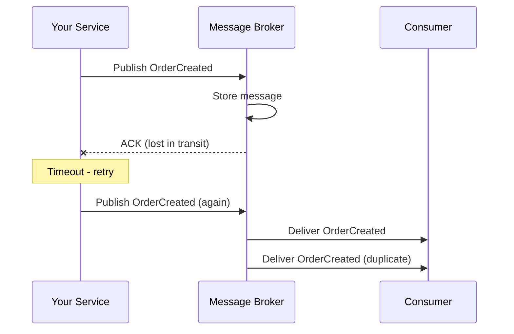
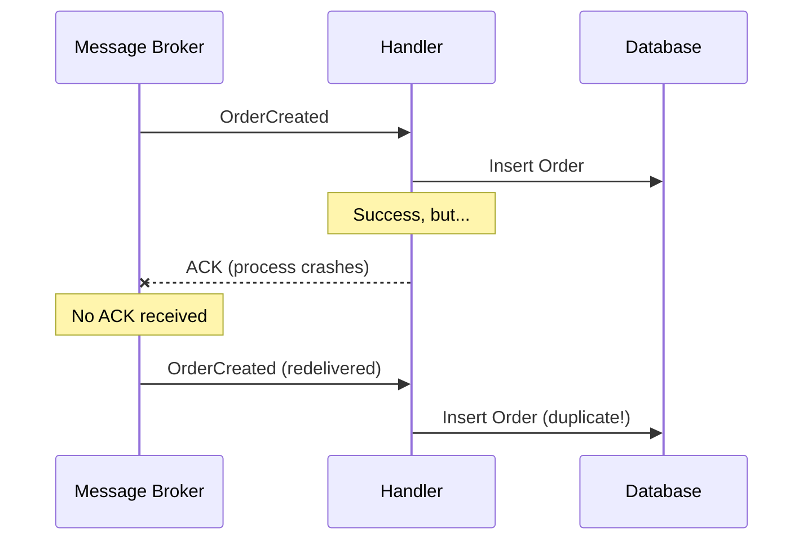
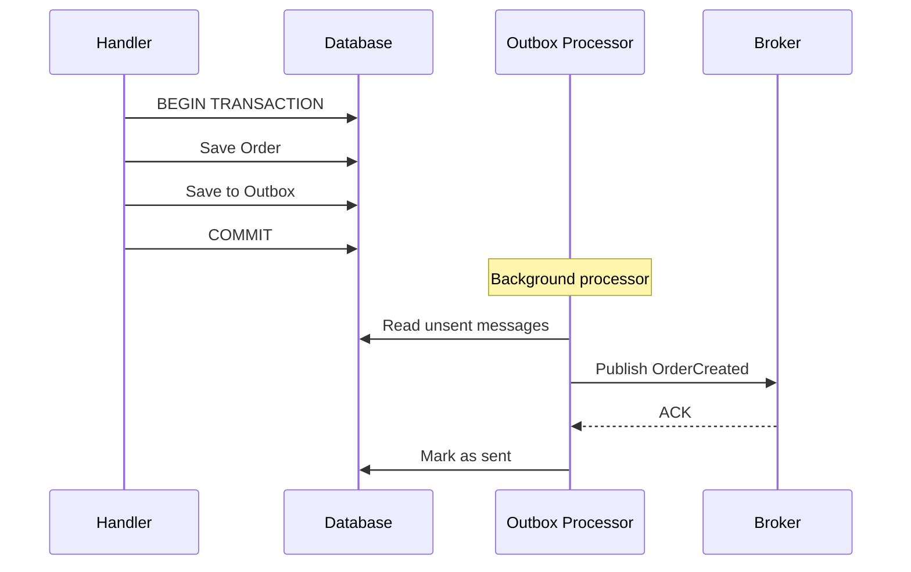

# Idempotent Consumer Guide

Distributed systems are unreliable by nature. Messages can arrive out of order, be duplicated, or be delayed indefinitely. If you design your system assuming every message will be processed exactly once, you are setting yourself up for subtle data corruption.

This guide explains why duplicate messages happen, how Excalibur protects you at both the producer and consumer side, and how to choose the right level of protection for each handler.

## Before You Start

- **.NET 10.0**
- Install the required packages:
  ```bash
  dotnet add package Excalibur.Dispatch
  dotnet add package Excalibur.Inbox.SqlServer   # consumer-side deduplication
  dotnet add package Excalibur.Outbox.SqlServer  # producer-side transactional outbox
  ```
- Familiarity with [outbox pattern](./outbox.md) and [inbox pattern](./inbox.md)

## Why Messages Get Duplicated

There are three common failure paths that produce duplicate messages, all of which happen in normal operation.

### Producer-Side Duplicates

Your service publishes an event. The broker stores it and sends an acknowledgment. A network glitch means the ACK never reaches your service. Your service times out and retries. The broker now has two copies of the same event.


```mermaid
sequenceDiagram
    participant S as Your Service
    participant B as Message Broker
    participant C as Consumer

    S->>B: Publish OrderCreated
    B->>B: Store message
    B--xS: ACK (lost in transit)
    Note over S: Timeout - retry
    S->>B: Publish OrderCreated (again)
    B->>C: Deliver OrderCreated
    B->>C: Deliver OrderCreated (duplicate)
```

### Consumer-Side Duplicates

Your consumer processes a message successfully but crashes before acknowledging it. The broker assumes the message was never processed and redelivers it.


```mermaid
sequenceDiagram
    participant B as Message Broker
    participant H as Handler
    participant DB as Database

    B->>H: OrderCreated
    H->>DB: Insert Order
    Note over H: Success, but...
    H--xB: ACK (process crashes)
    Note over B: No ACK received
    B->>H: OrderCreated (redelivered)
    H->>DB: Insert Order (duplicate!)
```

### Broker Redelivery

Most brokers implement at-least-once delivery. If the consumer takes too long, the broker may redeliver the message to another instance. Both instances process the same message.

These are not edge cases. In any system running at scale, they happen regularly.

## The Two Sides of the Solution

Excalibur addresses duplicate messages at both the producer and consumer side. Understanding both is important because they solve different problems.

### Producer Side: The Transactional Outbox

The most robust way to prevent duplicate publishes is to never publish directly to the broker at all. Instead, store outbound messages in the **same database transaction** as your business data changes. A background processor reads the outbox and publishes to the broker.


```mermaid
sequenceDiagram
    participant H as Handler
    participant DB as Database
    participant P as Outbox Processor
    participant B as Broker

    H->>DB: BEGIN TRANSACTION
    H->>DB: Save Order
    H->>DB: Save to Outbox
    H->>DB: COMMIT

    Note over P: Background processor
    P->>DB: Read unsent messages
    P->>B: Publish OrderCreated
    B-->>P: ACK
    P->>DB: Mark as sent
```

This guarantees that:

- If the business operation fails, no message is published
- If the business operation succeeds, the message is guaranteed to be published (eventually)
- The publisher can safely retry because the outbox processor is idempotent

```csharp ignore
using Excalibur.Dispatch.Outbox;

public class CreateOrderHandler : IDispatchHandler<CreateOrderAction>
{
    private readonly IDbConnection _db;
    private readonly IOutboxWriter _outboxWriter;

    public CreateOrderHandler(IDbConnection db, IOutboxWriter outboxWriter)
    {
        _db = db;
        _outboxWriter = outboxWriter;
    }

    public async Task<IMessageResult> HandleAsync(
        CreateOrderAction action,
        IMessageContext context,
        CancellationToken ct)
    {
        using var transaction = _db.BeginTransaction();
        context.SetItem("Transaction", transaction);

        // Business logic
        var orderId = Guid.NewGuid();
        await _db.ExecuteAsync(
            "INSERT INTO Orders (Id, CustomerId) VALUES (@Id, @CustomerId)",
            new { Id = orderId, action.CustomerId },
            transaction);

        // Stage message in outbox (same transaction)
        await _outboxWriter.WriteAsync(
            new OrderCreatedEvent(orderId, action.CustomerId),
            destination: "orders",
            ct);

        transaction.Commit();
        // Message published later by background processor
        return MessageResult.Success();
    }
}
```

The outbox pattern is the gold standard for producer-side reliability. Most message brokers also support message deduplication via a stable `MessageId` (Azure Service Bus, Amazon SQS content-based deduplication), but broker-level dedup has time windows and is not a substitute for the outbox when you need transactional consistency between your data and your messages.

**Reference:** [Outbox Pattern](outbox.md) for full configuration, store providers, and presets.

### Consumer Side: The Idempotent Consumer

Even with a perfect producer, the consumer must handle redeliveries. The Idempotent Consumer pattern tracks which messages have been processed and skips duplicates.

Excalibur provides this as pipeline middleware. `InboxMiddleware` is registered by `AddDispatch` and
sits at the pre-processing stage, so registering an `IInboxStore` is all that is needed for every
message flowing through the pipeline to be deduplicated.

## Implementing the Idempotent Consumer

### Registration

```csharp
services.AddDispatch(dispatch =>
{
    dispatch.AddHandlersFromAssembly(typeof(Program).Assembly);
});

// Registering a store is what activates deduplication
services.AddSqlServerInboxStore(options => options.ConnectionString = connectionString);
```

A handler then runs at most once per message id, without any per-handler annotation:

```csharp
public class ProcessPaymentHandler : IEventHandler<PaymentRequestedEvent>
{
    private readonly IPaymentGateway _gateway;

    public async Task HandleAsync(PaymentRequestedEvent @event, CancellationToken ct)
    {
        // This code runs at most once per message ID,
        // even if the broker delivers the message multiple times
        await _gateway.ChargeAsync(@event.CustomerId, @event.Amount, ct);
    }
}
```

To place the middleware explicitly in a custom pipeline, call `UseInbox()` (or its alias
`UseIdempotency()`).

### The Claim Protocol

The middleware uses an atomic **claim-before-execute** protocol on every invocation:

1. Resolves a message ID from `IMessageContext.MessageId`, falling back to the context items, the
   message envelope, and finally a `MessageId` or `CorrelationId` property on the message.
2. **Atomically claims** the message *before* the handler runs. The claim is a single
   first-writer-wins operation, so exactly one of N concurrent duplicates wins it.
3. If the claim fails - another caller already holds it - the message is a duplicate: skip and
   return success.
4. If the claim succeeds, invoke the handler while holding the claim.
5. On success, **finalize** the claim (it becomes terminal - the message is recorded as processed).
   On handler **failure**, the claim is **released** so a redelivery can re-admit the message - a
   failed handler never silently drops its message.

Because the claim is atomic, two concurrent duplicates can never both pass. Note the resulting
guarantee: **exactly-once for concurrent redelivery, at-least-once across a process crash.** If the
process dies between the claim and the finalize, the claim is reclaimed and the handler runs again,
so handlers must still be idempotent.

### Deduplication Scope

Every entry is keyed by a composite of the message id and a scope. The middleware runs before
handlers are resolved, so it has no single handler to name: it deduplicates **per message type**. A
message admitted by the inbox reaches every handler registered for it, or none of them. If two
handlers of the same event must succeed and fail independently, give them separate message types, or
track completion inside each handler against your own store.

### Choosing a Store

Persistent deduplication requires registering an `IInboxStore` implementation. Excalibur provides 8
ready-made stores:

| Store | Package | Builder call |
|-------|---------|--------------|
| SQL Server | `Excalibur.Inbox.SqlServer` | `UseSqlServer(...)` |
| PostgreSQL | `Excalibur.Inbox.Postgres` | `UsePostgres(...)` |
| Oracle | `Excalibur.Inbox.Oracle` | *(see note below)* |
| MongoDB | `Excalibur.Inbox.MongoDB` | `UseMongoDB(...)` |
| Redis | `Excalibur.Inbox.Redis` | `UseRedis(...)` |
| Cosmos DB | `Excalibur.Inbox.CosmosDb` | `UseCosmosDb(...)` |
| DynamoDB | `Excalibur.Inbox.DynamoDb` | `UseDynamoDb(...)` |
| Firestore | `Excalibur.Inbox.Firestore` | `UseFirestore(...)` |
| Elasticsearch | `Excalibur.Inbox.ElasticSearch` | `UseElasticSearch(...)` |
| In-Memory | `Excalibur.Inbox.InMemory` | `UseInMemory()` |

Those providers register through the same entry point:

```csharp
services.AddExcaliburInbox(inbox => inbox.UsePostgres(pg => pg.ConnectionString(connectionString)));
```

Oracle is the exception: it ships the service-collection form only, and is registered directly rather
than through the inbox builder.

```csharp
services.AddOracleInboxStore(options => options.ConnectionString = connectionString);
```

All implementations use atomic "first writer wins" semantics for the claim-before-execute protocol
(`IClaimableInboxStore.TryClaimAsync`). The mechanism is native to each database (e.g.,
`INSERT ... ON CONFLICT DO NOTHING` in PostgreSQL, `MERGE WITH (HOLDLOCK)` in SQL Server, `SETNX` in
Redis, `attribute_not_exists` in DynamoDB, `CreateItemAsync` with 409 Conflict in CosmosDB).

Registering a store that cannot claim atomically fails fast at startup rather than degrading to a
racy check-then-act.

When no store is registered, deduplication falls back to the in-process `IInMemoryDeduplicator` -
fast and lock-free, but lost on restart and not shared across instances. Use it for single-instance
or serverless workloads; use a persistent store for payments, orders, and anything else where a
duplicate is expensive.

#### Two claim protocols

A store offers one of two idempotency protocols, on separate interfaces, and may offer both:

| Interface | Protocol | Ends when |
| --- | --- | --- |
| `IClaimableInboxStore` | Claim before execute. You govern the TTL. | You finalize on success, or release on failure. |
| `ILeasedInboxStore` | Acquire a self-expiring lease. | The lease expires on its own; another processor may then reclaim it. |

They are separate interfaces because they disagree about who ends a claim and about whether a stuck claim
recovers on its own — so a caller must be able to tell which it holds before it calls. The lease collapses
admission and expired-lease reclaim into one atomic compare-and-set, which is why a processor that dies
mid-handler does not strand the message: **SQL Server, PostgreSQL, Oracle, MongoDB, Redis and In-Memory**
lease. **DynamoDB, Firestore, Elasticsearch and Cosmos DB** offer the claim only; a dead processor's claim
there is cleared by the stuck-processing timeout rather than by lease expiry.

Writing a custom store? Implement whichever protocol your database can enforce atomically, and implement
`IInboxStoreCapabilities` if you decorate another store, so the startup guard reads the capability you can
actually forward rather than the interface you declare.

### Idempotency Under Load

The claim protocol is correct under concurrent duplicate delivery, but two operational caveats are worth knowing for high-throughput deployments:

:::note In-memory deduplication has a capacity ceiling
The in-process `IInMemoryDeduplicator` fallback uses a bounded store (`InMemoryDeduplicatorOptions.MaxEntries`, default 100,000 tracked entries; set `0` for unbounded) so it cannot grow unboundedly. Because deduplication is a correctness guarantee, the store **fails closed** at capacity rather than admitting un-trackable messages: a claim that cannot be tracked is denied, and the record-producing operations throw a transient `DeduplicationCapacityExceededException` so the message is **not acknowledged and is redelivered** (never silently admitted without deduplication) until periodic cleanup reclaims space as entries expire. For workloads where duplicate suppression must hold under sustained load, raise `MaxEntries` or use a **persistent `IInboxStore`** rather than in-memory mode — the database enforces the claim with no in-process capacity ceiling.
:::

:::note Handler failure releases the claim
When a handler throws, the middleware releases the claim before propagating the exception, so the message stays retryable on redelivery. The released claim is a best-effort cleanup on the failure path; the original handler exception is what your error-handling and dead-letter pipeline acts on. This is why a [dead-letter](./dead-letter.md) policy still matters even with idempotency enabled — idempotency prevents *double* processing, not *failed* processing.
:::

### Deduplicating on a Business Key

The middleware deduplicates on the message id. When the same logical operation may be published with
a fresh transport id on retry, carry the business key on the message id itself:

```csharp
public record OrderCreatedEvent(Guid OrderId, string CustomerId) : IDispatchEvent
{
    public string MessageId { get; init; } = $"order-created-{OrderId}";
}
```

A middleware running before the inbox stage can equally write the key into
`IMessageContext.MessageId`.

## The Hard Problem: Non-Deterministic Handlers

Everything above works cleanly when your handler's side effects are limited to database writes within a transaction. But what happens when your handler calls an external service?

```csharp
public class OrderCreatedHandler : IEventHandler<OrderCreatedEvent>
{
    public async Task HandleAsync(OrderCreatedEvent @event, CancellationToken ct)
    {
        // 1. Database write (protected by inbox transaction)
        await _db.ExecuteAsync("INSERT INTO OrderAudit ...", ct);

        // 2. External API call (NOT protected by inbox transaction)
        await _emailService.SendConfirmationAsync(@event.OrderId, ct);

        // 3. What if we crash here? The email was sent,
        //    but the inbox hasn't marked us as "processed" yet.
        //    On retry, we'll send the email again.
    }
}
```

The database write and the inbox record can share a transaction. The email API call cannot. If the process crashes after sending the email but before the inbox records success, the retry will send the email again.

### Strategy 1: Pass an Idempotency Key to the External Service

Many external APIs (payment processors, email platforms, notification services) support idempotency keys. Pass the message ID:

```csharp
public class SendWelcomeEmailHandler : IEventHandler<UserRegisteredEvent>
{
    public async Task HandleAsync(UserRegisteredEvent @event, CancellationToken ct)
    {
        await _emailService.SendAsync(new SendEmailRequest
        {
            To = @event.Email,
            Subject = "Welcome!",
            Body = "Thanks for signing up.",
            IdempotencyKey = $"welcome-{@event.UserId}" // External service deduplicates
        }, ct);
    }
}
```

If the external service receives the same idempotency key twice, it ignores the duplicate. This is the simplest and most reliable approach when available.

### Strategy 2: Store the Intent Locally (Outbox Pattern)

If the external service does not support idempotency keys, do not call it directly from your handler. Instead, store the *intent* to perform the action, and let a background process execute it:

```csharp
public class OrderCreatedHandler : IEventHandler<OrderCreatedEvent>
{
    private readonly IDbConnection _db;
    private readonly IOutboxWriter _outboxWriter;

    public OrderCreatedHandler(IDbConnection db, IOutboxWriter outboxWriter)
    {
        _db = db;
        _outboxWriter = outboxWriter;
    }

    public async Task HandleAsync(OrderCreatedEvent @event, CancellationToken ct)
    {
        // Store the intent to send an email (in the same DB transaction as inbox)
        await _db.ExecuteAsync(
            "INSERT INTO PendingEmails (OrderId, Template) VALUES (@OrderId, 'confirmation')",
            new { @event.OrderId }, ct);

        // Or use the outbox to stage a command for a dedicated email-sending service:
        await _outboxWriter.WriteAsync(
            new SendOrderConfirmationEmail(@event.OrderId),
            destination: "email-service",
            ct);
    }
}
```

The handler becomes fully deterministic: it only writes to the database. The external call is deferred to a separate process that can handle its own retries and idempotency.

This is the Outbox pattern applied to side effects, and it is already built into Excalibur.Dispatch.

### When the Consequence is Acceptable

Not every external call needs this level of protection. Sending a duplicate log entry to a monitoring system is harmless. Sending a duplicate charge to a payment gateway is not. Match the level of protection to the consequence:

| Side Effect | Duplicate Impact | Recommended Approach |
|-------------|-----------------|---------------------|
| Payment charge | Financial loss | Idempotency key + inbox |
| Confirmation email | Minor annoyance | Idempotency key if available, otherwise accept |
| Metrics/telemetry | None | No protection needed |
| Cache invalidation | None | No protection needed |
| Webhook notification | Depends on consumer | Idempotency key recommended |

## When You Don't Need Idempotency

Not every handler needs the overhead of deduplication. If your operation is **naturally idempotent**, you can skip the inbox entirely.

### Naturally Idempotent Operations

Operations that overwrite state rather than append to it are safe to run multiple times:

```csharp
// Setting a status flag - safe to repeat
public class ActivateUserHandler : IEventHandler<UserVerifiedEvent>
{
    public async Task HandleAsync(UserVerifiedEvent @event, CancellationToken ct)
    {
        // UPDATE Users SET Status = 'Active' WHERE Id = @Id
        // Running this twice produces the same result
        await _db.ExecuteAsync(
            "UPDATE Users SET Status = 'Active' WHERE Id = @Id",
            new { Id = @event.UserId }, ct);
    }
}
```

Other naturally idempotent operations:

- **Upserts** (`INSERT ... ON CONFLICT UPDATE`)
- **Cache refreshes** (overwriting a cache key)
- **Projection rebuilds** (replacing a read model)
- **Status transitions** (setting a flag)

### Precondition Checks

If your handler can cheaply verify whether the work has already been done, a simple guard clause may be sufficient:

```csharp
public class CreateOrderHandler : IEventHandler<OrderCreatedEvent>
{
    public async Task HandleAsync(OrderCreatedEvent @event, CancellationToken ct)
    {
        // Check if order already exists
        var exists = await _db.ExecuteScalarAsync<bool>(
            "SELECT COUNT(1) FROM Orders WHERE Id = @Id",
            new { Id = @event.OrderId }, ct);

        if (exists) return; // Already processed

        await _db.ExecuteAsync(
            "INSERT INTO Orders (Id, CustomerId) VALUES (@Id, @CustomerId)",
            new { Id = @event.OrderId, @event.CustomerId }, ct);
    }
}
```

This is simpler than the full inbox pattern but has a race condition window between the check and the insert. For low-contention scenarios, this is often good enough.

### Decision Guide

```
Is the handler naturally idempotent (upsert, cache, status flag)?
  YES --> No inbox store needed for this handler's safety
  NO  --> Does duplicate processing cause real harm (financial, data corruption)?
            YES --> Register a persistent IInboxStore
            NO  --> Is the handler high-throughput and single-instance?
                      YES --> The in-process deduplicator fallback may be enough
                      NO  --> A precondition check may be sufficient
```

## Putting It All Together

Here is a complete example showing the Outbox and Inbox patterns working together for a realistic order processing scenario:

```csharp
// --- Service registration ---

services.AddDispatch(dispatch =>
{
    dispatch.AddHandlersFromAssembly(typeof(Program).Assembly);
});

// Producer side: transactional outbox
services.AddExcalibur(excalibur => excalibur.AddOutbox(outbox => outbox
    .UseSqlServer(sql => sql.ConnectionString(connectionString))
    .WithProcessing(processing => processing
        .BatchSize(100)
        .PollingInterval(TimeSpan.FromSeconds(1))
        .MaxRetryCount(5)
        .RetryDelay(TimeSpan.FromMinutes(5)))
    .EnableBackgroundProcessing()));

// Consumer side: persistent inbox
services.AddSqlServerInboxStore(options =>
{
    options.ConnectionString = connectionString;
});

// Background processing
services.AddOutboxHostedService();
services.AddInboxHostedService();
```

```csharp
// --- Producer: Create Order handler ---
// Uses Outbox so OrderCreated cannot be lost if the broker is down.
// Delivery is at-least-once - the consumer below is what makes reprocessing safe.

public class CreateOrderHandler : IDispatchHandler<CreateOrderAction>
{
    private readonly IDbConnection _db;
    private readonly IOutboxWriter _outboxWriter;

    public CreateOrderHandler(IDbConnection db, IOutboxWriter outboxWriter)
    {
        _db = db;
        _outboxWriter = outboxWriter;
    }

    public async Task<IMessageResult> HandleAsync(
        CreateOrderAction action,
        IMessageContext context,
        CancellationToken ct)
    {
        using var transaction = _db.BeginTransaction();
        context.SetItem("Transaction", transaction);

        var orderId = Guid.NewGuid();
        await _db.ExecuteAsync(
            "INSERT INTO Orders (Id, CustomerId, Total) VALUES (@Id, @CustomerId, @Total)",
            new { Id = orderId, action.CustomerId, action.Total },
            transaction);

        // Staged in outbox within the same transaction
        await _outboxWriter.WriteAsync(
            new OrderCreatedEvent(orderId, action.CustomerId, action.Total),
            destination: "orders",
            ct);

        transaction.Commit();
        return MessageResult.Success();
    }
}
```

```csharp
// --- Consumer: Handlers for OrderCreatedEvent ---
// The inbox claims each event once before any handler runs

public class ReserveInventoryHandler : IEventHandler<OrderCreatedEvent>
{
    public async Task HandleAsync(OrderCreatedEvent @event, CancellationToken ct)
    {
        // Critical: must not double-reserve
        await _inventory.ReserveAsync(@event.OrderId, ct);
    }
}

public class ChargePaymentHandler : IEventHandler<OrderCreatedEvent>
{
    public async Task HandleAsync(OrderCreatedEvent @event, CancellationToken ct)
    {
        // Uses idempotency key with payment gateway as defense-in-depth
        await _paymentGateway.ChargeAsync(new ChargeRequest
        {
            Amount = @event.Total,
            CustomerId = @event.CustomerId,
            IdempotencyKey = $"order-charge-{@event.OrderId}"
        }, ct);
    }
}

// Naturally idempotent - the upsert is safe to repeat
public class UpdateOrderProjectionHandler : IEventHandler<OrderCreatedEvent>
{
    public async Task HandleAsync(OrderCreatedEvent @event, CancellationToken ct)
    {
        // INSERT ... ON CONFLICT UPDATE - safe to repeat
        await _readDb.UpsertOrderSummaryAsync(@event, ct);
    }
}
```

The result:

- **Producer side**: `CreateOrderHandler` uses the Outbox, so `OrderCreatedEvent` cannot be lost if the handler is retried or the process crashes. It can still be published **more than once** — delivery is at-least-once, which is exactly why the receiver side below exists.
- **Consumer side**: with a persistent inbox store registered, every event is claimed before any handler runs, so `ReserveInventoryHandler` and `ChargePaymentHandler` process each event at most once per delivery attempt. `UpdateOrderProjectionHandler` is naturally idempotent and would be safe even without it.
- **External calls**: `ChargePaymentHandler` passes an idempotency key to the payment gateway as defense-in-depth on top of the inbox check.

## Summary

| Concern | Mechanism | Excalibur Feature |
|---------|-----------|---------------------------|
| Duplicate publishes | Transactional Outbox | `IOutboxStore` + `OutboxMiddleware` |
| Duplicate consumption | Idempotent Consumer | `InboxMiddleware` + `IInboxStore` |
| Atomic side effects | First-writer-wins claim, release-on-failure | `IClaimableInboxStore.TryClaimAsync` |
| External API duplicates | Idempotency keys or stored intent | Business-key message ids + Outbox |
| Cross-outbox/inbox atomicity | Shared-database transaction | `TryMarkSentAndReceivedAsync` |
| Cleanup | Configurable retention | `IInboxStoreAdmin.CleanupAllTenantsProcessedEntriesAsync` + hosted service |
| Monitoring | Health checks + OpenTelemetry | `InboxHealthCheck` + activity tags |

Build your consumers to tolerate retries, and your distributed system will be that much more reliable.

## See Also

- [Inbox Pattern](./inbox.md) - Full inbox configuration, all deduplication strategies, and testing patterns
- [Outbox Pattern](./outbox.md) - Transactional outbox for reliable message publishing
- [Dead Letter](./dead-letter.md) - Handle messages that fail even after retries

## Next Steps

- [Outbox Pattern](outbox.md) -- Full outbox configuration, store providers, and presets
- [Inbox Pattern](inbox.md) -- Full inbox configuration, all strategies, testing patterns
- [Dead Letter](dead-letter.md) -- Handle messages that fail even after retries

