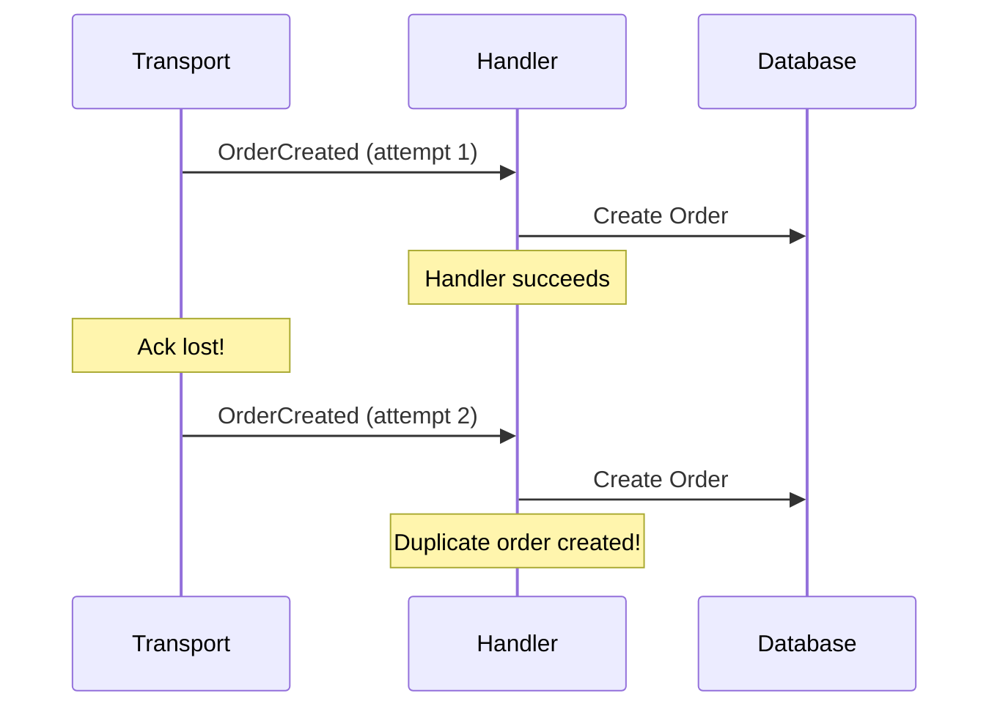
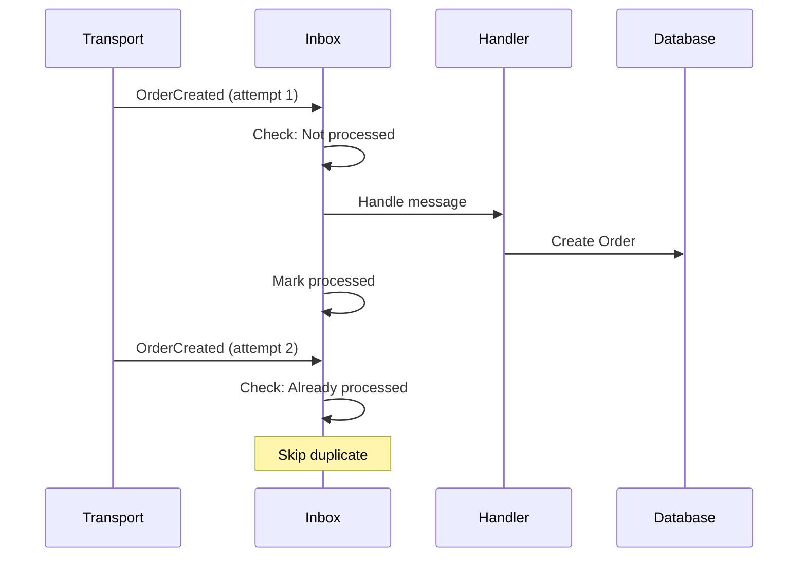

# Inbox Pattern

:::tip New to idempotent messaging?
Start with the [Idempotent Consumer Guide](idempotent-consumer.md) to understand why messages get duplicated and how the Outbox and Inbox patterns work together.
:::

The inbox pattern ensures messages are processed exactly once, preventing duplicate handling when messages are redelivered.

## Before You Start

- **.NET 8.0+** (or .NET 9/10 for latest features)
- Install the required packages:
  ```bash
  dotnet add package Excalibur.Dispatch.Patterns
  dotnet add package Excalibur.EventSourcing.SqlServer  # or your provider
  ```
- Familiarity with [Dispatch pipeline](../pipeline/index.md) and the [Outbox Pattern](./outbox.md)
- A SQL Server or PostgreSQL database for inbox storage

## The Problem

Message transports may deliver the same message multiple times:



## The Solution

Track processed messages and skip duplicates:



## Quick Start

### Configuration

```csharp
services.AddDispatch(dispatch =>
{
    dispatch.AddHandlersFromAssembly(typeof(Program).Assembly);
});

// Add SQL Server inbox store
services.AddSqlServerInboxStore(options =>
{
    options.ConnectionString = connectionString;
    options.SchemaName = "inbox";
    options.TableName = "ProcessedMessages";
});
```

### Automatic Deduplication

The inbox middleware automatically deduplicates messages:

```csharp
// Handler is called at most once per message ID
public class CreateOrderHandler : IEventHandler<OrderCreatedEvent>
{
    public async Task HandleAsync(OrderCreatedEvent @event, CancellationToken ct)
    {
        // This code runs at most once per event
        await _db.ExecuteAsync(
            "INSERT INTO Orders ...",
            new { @event.OrderId, @event.CustomerId });
    }
}
```

## Inbox Stores

### SQL Server

```csharp
services.AddSqlServerInboxStore(options =>
{
    options.ConnectionString = connectionString;
    options.SchemaName = "inbox";
    options.TableName = "ProcessedMessages";
    options.CommandTimeoutSeconds = 30;
    options.MaxRetryCount = 3;
});
```

### Redis

```csharp
services.AddRedisInboxStore(options =>
{
    options.ConnectionString = "localhost:6379";
    options.KeyPrefix = "inbox";
    options.DefaultTtlSeconds = 604800; // 7 days
    options.DatabaseId = 0;
});
```

### In-Memory (Testing)

```csharp
services.AddInMemoryInboxStore();
```

## Database Schema

### SQL Server

```sql
CREATE SCHEMA [inbox];

CREATE TABLE [inbox].[ProcessedMessages] (
    [Id] BIGINT IDENTITY(1,1) NOT NULL,
    [MessageId] NVARCHAR(100) NOT NULL,
    [MessageType] NVARCHAR(500) NOT NULL,
    [HandlerType] NVARCHAR(500) NOT NULL,
    [ProcessedAt] DATETIME2 NOT NULL DEFAULT GETUTCDATE(),
    [ExpiresAt] DATETIME2 NOT NULL,

    CONSTRAINT [PK_ProcessedMessages] PRIMARY KEY CLUSTERED ([Id]),
    CONSTRAINT [UQ_ProcessedMessages] UNIQUE ([MessageId], [HandlerType])
);

CREATE INDEX [IX_ProcessedMessages_ExpiresAt]
ON [inbox].[ProcessedMessages] ([ExpiresAt])
WHERE [ExpiresAt] < GETUTCDATE();
```

## Message Identity

### Default Identity

By default, the inbox uses `IDispatchMessage.MessageId`:

```csharp
public record OrderCreatedEvent(
    Guid OrderId,
    string CustomerId) : IDispatchEvent
{
    // MessageId from IDispatchMessage is used
    public string MessageId { get; init; } = Guid.NewGuid().ToString();
}
```

### Custom Identity

For business-key based deduplication, implement `IMessageIdProvider`:

```csharp
public class OrderMessageIdProvider : IMessageIdProvider
{
    public string? GetMessageId(IDispatchMessage message, IMessageContext context)
    {
        return message switch
        {
            // Use order ID for order events
            OrderCreatedEvent e => $"order-created-{e.OrderId}",

            // Use composite key for payments
            PaymentReceivedEvent e => $"payment-{e.OrderId}-{e.PaymentId}",

            // Default to message ID from context
            _ => context.MessageId
        };
    }
}

// Register and use with [Idempotent] attribute
services.AddSingleton<IMessageIdProvider, OrderMessageIdProvider>();

[Idempotent(Strategy = MessageIdStrategy.Custom)]
public class OrderHandler : IEventHandler<OrderCreatedEvent> { }
```

## Idempotency Keys

Use the `[Idempotent]` attribute with different `MessageIdStrategy` values to control how message IDs are extracted:

### From Message Headers (Default)

```csharp
// Uses "MessageId" header by default
[Idempotent(Strategy = MessageIdStrategy.FromHeader)]
public class OrderHandler : IEventHandler<OrderCreatedEvent> { }

// Custom header name
[Idempotent(Strategy = MessageIdStrategy.FromHeader, HeaderName = "X-Idempotency-Key")]
public class PaymentHandler : IEventHandler<PaymentEvent> { }
```

### Composite Keys

```csharp
// Uses {HandlerType}:{CorrelationId} format
[Idempotent(Strategy = MessageIdStrategy.CompositeKey)]
public class MultiTenantHandler : IEventHandler<TenantEvent> { }
```

## Cleanup

### Manual Cleanup

The `IInboxStore.CleanupAsync` method removes processed entries older than the specified retention period:

```csharp
public class InboxCleanupJob
{
    private readonly IInboxStore _store;
    private readonly ILogger<InboxCleanupJob> _logger;

    public async Task CleanupAsync(CancellationToken ct)
    {
        var retentionPeriod = TimeSpan.FromDays(7);
        var deleted = await _store.CleanupAsync(retentionPeriod, ct);
        _logger.LogInformation("Cleaned up {Count} expired inbox entries", deleted);
    }
}
```

### Scheduled Cleanup with Hosted Service

Register the inbox hosted service for automatic background cleanup:

```csharp
services.AddInboxHostedService();
```

## Per-Handler Deduplication

The inbox store tracks messages by a composite key of `(MessageId, HandlerType)`, allowing multiple handlers to process the same message independently:

```csharp
// Both handlers can process the same event - tracked separately
[Idempotent]
public class SendEmailHandler : IEventHandler<OrderCreatedEvent> { }

[Idempotent]
public class UpdateInventoryHandler : IEventHandler<OrderCreatedEvent> { }
```

Each handler's processing is tracked independently, so `SendEmailHandler` and `UpdateInventoryHandler` can both process the same `OrderCreatedEvent` exactly once.

## Distributed Deduplication

The inbox stores provide atomic "first writer wins" semantics via `TryMarkAsProcessedAsync()`:

```csharp
// SQL Server uses MERGE with HOLDLOCK for atomic check-and-mark
// Redis uses atomic SET NX operations

// Both ensure only one instance processes each message
public class SqlServerInboxStore : IInboxStore
{
    public async ValueTask<bool> TryMarkAsProcessedAsync(
        string messageId,
        string handlerType,
        CancellationToken cancellationToken)
    {
        // Returns true if this is the first processor
        // Returns false if already processed (duplicate)
    }
}
```

For multi-instance deployments, the atomic deduplication check prevents race conditions without requiring explicit distributed locks.

## Health Checks

```csharp
services.AddHealthChecks()
    .AddInboxHealthCheck(options =>
    {
        options.UnhealthyInactivityTimeout = TimeSpan.FromMinutes(5);
        options.DegradedInactivityTimeout = TimeSpan.FromMinutes(2);
    });
```

## Metrics

Inbox metrics are included in the core Dispatch metrics:

```csharp
services.AddOpenTelemetry()
    .WithMetrics(metrics =>
    {
        metrics.AddDispatchMetrics();
        // Includes inbox-related metrics:
        // - dispatch.messages.processed
        // - dispatch.messages.duplicates
        // - dispatch.messages.duration
    });
```

## Testing

### Verify Idempotency

Test idempotency by registering the in-memory inbox store and verifying duplicate messages are ignored:

```csharp
public class OrderHandlerTests : IClassFixture<WebApplicationFactory<Program>>
{
    private readonly WebApplicationFactory<Program> _factory;

    public OrderHandlerTests(WebApplicationFactory<Program> factory)
    {
        _factory = factory.WithWebHostBuilder(builder =>
        {
            builder.ConfigureServices(services =>
            {
                // Use in-memory inbox for testing
                services.AddInMemoryInboxStore();
            });
        });
    }

    [Fact]
    public async Task Duplicate_Message_Is_Ignored()
    {
        // Arrange
        using var scope = _factory.Services.CreateScope();
        var dispatcher = scope.ServiceProvider.GetRequiredService<IDispatcher>();
        var db = scope.ServiceProvider.GetRequiredService<IDbConnection>();

        var orderId = Guid.NewGuid();
        var @event = new OrderCreatedEvent(orderId, "customer-1");

        // Act - Dispatch same event twice
        await dispatcher.PublishAsync(@event);
        await dispatcher.PublishAsync(@event);

        // Assert - Only one order created (handler is [Idempotent])
        var orders = await db.QueryAsync<Order>(
            "SELECT * FROM Orders WHERE Id = @Id",
            new { Id = orderId });
        orders.Should().HaveCount(1);
    }
}
```

### Unit Test with IInboxStore

For unit tests, mock the inbox store:

```csharp
[Fact]
public async Task Handler_Skips_Duplicate_Message()
{
    // Arrange
    var inboxStore = A.Fake<IInboxStore>();
    var messageId = "order-123";
    var handlerType = typeof(CreateOrderHandler).FullName!;

    // First call returns false (not processed), second returns true (duplicate)
    A.CallTo(() => inboxStore.TryMarkAsProcessedAsync(messageId, handlerType, A<CancellationToken>._))
        .ReturnsNextFromSequence(true, false);

    // Act & Assert via handler invocation
}
```

## Declarative Idempotency

For handler-level control over idempotency, use the `[Idempotent]` attribute. This enables per-handler deduplication based on the handler's configuration.

### Quick Start

```csharp
// 1. Register an inbox store (required for persistent deduplication)
services.AddSqlServerInboxStore(options =>
{
    options.ConnectionString = connectionString;
});

// 2. Mark handlers with the attribute
[Idempotent]
public class PaymentHandler : IEventHandler<PaymentEvent>
{
    public async Task HandleAsync(PaymentEvent @event, CancellationToken ct)
    {
        // Duplicate messages are automatically skipped
        await _paymentService.ProcessAsync(@event, ct);
    }
}
```

The `IdempotentHandlerMiddleware` automatically detects handlers with `[Idempotent]` and applies deduplication.

### The `[Idempotent]` Attribute

| Property | Type | Default | Description |
|----------|------|---------|-------------|
| `RetentionMinutes` | `int` | 1440 (24h) | How long to track processed message IDs |
| `UseInMemory` | `bool` | `false` | Use fast in-memory deduplication |
| `Strategy` | `MessageIdStrategy` | `FromHeader` | How to extract message IDs |
| `HeaderName` | `string` | `"MessageId"` | Header name for `FromHeader` strategy |

### Usage Examples

```csharp
// Default settings (24h retention, persistent storage, from header)
[Idempotent]
public class OrderHandler : IEventHandler<OrderCreatedEvent> { }

// Custom retention period
[Idempotent(RetentionMinutes = 60)]
public class NotificationHandler : IEventHandler<NotificationEvent> { }

// High-throughput with in-memory storage
[Idempotent(UseInMemory = true, RetentionMinutes = 5)]
public class MetricsHandler : IEventHandler<MetricsEvent> { }

// Use correlation ID for deduplication
[Idempotent(Strategy = MessageIdStrategy.FromCorrelationId)]
public class SagaHandler : IEventHandler<SagaEvent> { }

// Custom header name
[Idempotent(Strategy = MessageIdStrategy.FromHeader, HeaderName = "X-Idempotency-Key")]
public class ApiHandler : IEventHandler<ApiEvent> { }
```

### Message ID Strategies

| Strategy | Description | Use Case |
|----------|-------------|----------|
| `FromHeader` | Extract from message header (default: `MessageId`) | Standard message transports |
| `FromCorrelationId` | Use `IMessageContext.CorrelationId` | Saga/workflow scenarios |
| `CompositeKey` | `{HandlerType}:{CorrelationId}` | Multi-handler with same message |
| `Custom` | Use registered `IMessageIdProvider` | Business-key extraction |

### Custom Message ID Provider

For complex ID extraction, implement `IMessageIdProvider`:

```csharp
public class OrderIdempotencyProvider : IMessageIdProvider
{
    public string? GetMessageId(IDispatchMessage message, IMessageContext context)
    {
        return message switch
        {
            // Use order ID for order events
            OrderCreatedEvent e => $"order-{e.OrderId}",

            // Use composite key for payments
            PaymentReceivedEvent e => $"payment-{e.OrderId}-{e.PaymentId}",

            // Fall back to message ID
            _ => context.MessageId
        };
    }
}

// Register the provider
services.AddSingleton<IMessageIdProvider, OrderIdempotencyProvider>();

// Use custom strategy in handler
[Idempotent(Strategy = MessageIdStrategy.Custom)]
public class OrderHandler : IEventHandler<OrderCreatedEvent> { }
```

### In-Memory vs Persistent Storage

| Aspect | In-Memory | Persistent (IInboxStore) |
|--------|-----------|-------------------------|
| **Performance** | Faster (no I/O) | Slower (database calls) |
| **Durability** | Lost on restart | Survives restarts |
| **Distributed** | Single instance only | Shared across instances |
| **Best For** | Serverless, testing | Production clusters |

#### When to Use In-Memory

- **Serverless functions**: Short-lived processes where persistence adds latency
- **Single-instance deployments**: No need for distributed deduplication
- **High-throughput, low-risk**: Metrics, telemetry where duplicates are acceptable
- **Testing**: Fast, isolated test execution

```csharp
[Idempotent(UseInMemory = true, RetentionMinutes = 5)]
public class MetricsHandler : IEventHandler<MetricsCollectedEvent> { }
```

#### When to Use Persistent Storage

- **Multi-instance deployments**: Kubernetes, App Service scale-out
- **Critical handlers**: Payments, orders, inventory updates
- **Long retention needs**: Hours or days of deduplication window
- **Audit requirements**: Need to query processed message history

```csharp
// Uses IInboxStore (must be registered)
[Idempotent(RetentionMinutes = 1440)] // 24 hours
public class PaymentHandler : IEventHandler<PaymentEvent> { }
```

### Best Practices for Declarative Idempotency

- **Mark only handlers that need it**: Not all handlers require idempotency. Logging handlers or read-only handlers can safely receive duplicates.
- **Use appropriate retention**: Match retention to your message redelivery window (typically 1-7 days).
- **Choose storage wisely**: Use `UseInMemory = true` for single-instance, high-throughput handlers; use persistent storage for multi-instance or critical handlers.
- **Register an inbox store**: For persistent deduplication, register a store via `AddSqlServerInboxStore()`, `AddRedisInboxStore()`, or `AddInMemoryInboxStore()`.

## Processing Modes

The inbox supports three processing modes:

| Mode | Component | Use Case |
|------|-----------|----------|
| **Attribute-based (automatic)** | `IdempotentHandlerMiddleware` | Most scenarios — deduplicates handlers marked with `[Idempotent]` |
| **Pipeline-level** | `InboxMiddleware` | Full inbox semantics for all messages in the pipeline |
| **Background service** | `InboxService` via `AddInboxHostedService()` | Background cleanup and reprocessing of failed inbox entries |
| **Manual** | `IInboxProcessor` | Serverless environments (Azure Functions, AWS Lambda) — trigger processing on demand |

### Attribute-Based Mode (Recommended)

When you register an inbox store, the `IdempotentHandlerMiddleware` automatically handles deduplication for handlers marked with `[Idempotent]`. Each incoming message is checked against the inbox before the handler executes:

```csharp
services.AddSqlServerInboxStore(options =>
{
    options.ConnectionString = connectionString;
});

// Handlers marked with [Idempotent] are automatically deduplicated
[Idempotent]
public class OrderHandler : IEventHandler<OrderCreatedEvent> { }
```

### Pipeline-Level Mode

For full inbox semantics applied to all messages in the pipeline (not just handlers with `[Idempotent]`), register `InboxMiddleware`:

```csharp
services.AddDispatch(dispatch =>
{
    dispatch.AddHandlersFromAssembly(typeof(Program).Assembly);
    dispatch.UseMiddleware<InboxMiddleware>();
});

services.AddSqlServerInboxStore(options =>
{
    options.ConnectionString = connectionString;
});
```

This mode applies inbox deduplication to all messages regardless of whether handlers are marked with `[Idempotent]`.

### Background Service

Register the inbox hosted service for background cleanup and maintenance:

```csharp
services.AddInboxHostedService();
```

### Manual Processing

For serverless or manual trigger scenarios:

```csharp
public class InboxCleanupFunction
{
    private readonly IInboxProcessor _processor;

    [Function("CleanupInbox")]
    public async Task Run([TimerTrigger("0 */30 * * * *")] TimerInfo timer)
    {
        await _processor.DispatchPendingMessagesAsync(CancellationToken.None);
    }
}
```

## Best Practices

| Practice | Recommendation |
|----------|----------------|
| Retention | 7 days minimum, match message TTL |
| Identity | Use business keys when possible |
| Scope | Per-handler for multi-subscriber scenarios |
| Cleanup | Regular cleanup to manage storage |
| Locking | Use distributed locks in clusters |
| Declarative | Use `[Idempotent]` for handler-specific control |
| Strategy | Match ID strategy to message source |

## Next Steps

- [Outbox Pattern](outbox.md) -- Reliable publishing
- [Dead Letter](dead-letter.md) -- Handle failed messages

## See Also

- [Outbox Pattern](outbox.md) -- Ensure reliable message publishing with transactional outbox storage
- [Idempotent Consumer Guide](idempotent-consumer.md) -- Narrative walkthrough of deduplication concepts and strategies
- [Outbox Setup & Configuration](../configuration/outbox-setup.md) -- Infrastructure setup for outbox and inbox stores
