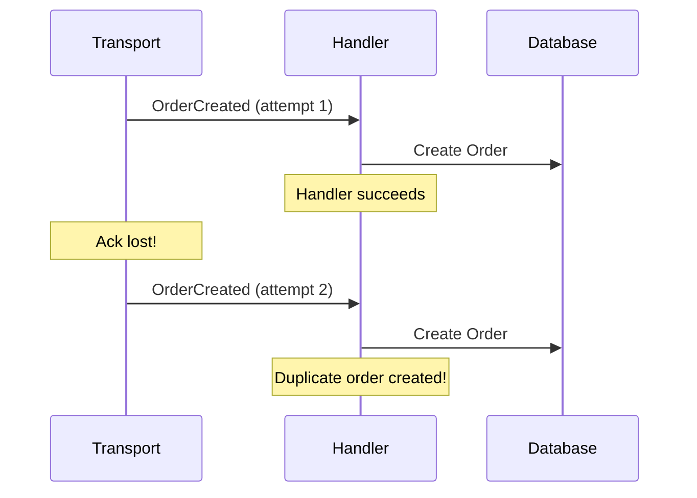
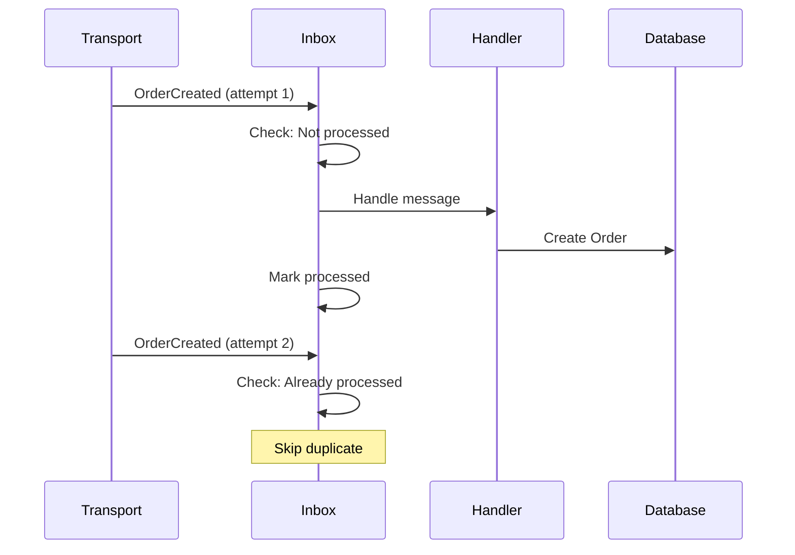

# Inbox Pattern

:::tip New to idempotent messaging?

Start with the [Idempotent Consumer Guide](idempotent-consumer.md) to understand why messages get duplicated and how the Outbox and Inbox patterns work together.
:::

The inbox pattern deduplicates redelivered messages with an atomic claim-before-execute protocol. The guarantee it provides is precise:

- **Exactly-once for *concurrent* redelivery** — when duplicates race, the atomic claim lets exactly one win; the others are skipped.
- **At-least-once across a *process crash*** — the claim is persisted before the handler runs, but the claim and the post-handler "mark processed" are two steps, not one transaction. A crash mid-handler leaves the claim to expire and the message to be reclaimed and re-run. **Your handler must be idempotent** to be safe across this boundary.

## Before You Start

- **.NET 10.0**
- Install the required packages:
  ```bash
  dotnet add package Excalibur.Dispatch.Patterns
  dotnet add package Excalibur.EventSourcing.SqlServer  # or your provider
  ```
- Familiarity with [Dispatch pipeline](../pipeline/index.md) and the [Outbox Pattern](./outbox.md)
- A SQL Server or PostgreSQL database for inbox storage

## The Problem

Message transports may deliver the same message multiple times:


```mermaid
sequenceDiagram
    participant T as Transport
    participant H as Handler
    participant DB as Database

    T->>H: OrderCreated (attempt 1)
    H->>DB: Create Order
    Note over H: Handler succeeds
    Note over T: Ack lost!
    T->>H: OrderCreated (attempt 2)
    H->>DB: Create Order
    Note over H: Duplicate order created!
```

## The Solution

Track processed messages and skip duplicates:


```mermaid
sequenceDiagram
    participant T as Transport
    participant I as Inbox
    participant H as Handler
    participant DB as Database

    T->>I: OrderCreated (attempt 1)
    I->>I: Check: Not processed
    I->>H: Handle message
    H->>DB: Create Order
    I->>I: Mark processed

    T->>I: OrderCreated (attempt 2)
    I->>I: Check: Already processed
    Note over I: Skip duplicate
```

## Quick Start

### Configuration

```csharp
services.AddDispatch(dispatch =>
{
    dispatch.AddHandlersFromAssembly(typeof(Program).Assembly);
});

// Add SQL Server inbox store
services.AddSqlServerInboxStore(options =>
{
    options.ConnectionString = connectionString;
    // Optional: defaults to schema "dbo", table "inbox_messages"
    options.SchemaName = "dbo";
    options.TableName = "inbox_messages";
});
```

### Automatic Deduplication

The inbox middleware automatically deduplicates messages:

```csharp
// Handler is called at most once per message ID
public class CreateOrderHandler : IEventHandler<OrderCreatedEvent>
{
    public async Task HandleAsync(OrderCreatedEvent @event, CancellationToken ct)
    {
        // This code runs at most once per event
        await _db.ExecuteAsync(
            "INSERT INTO Orders ...",
            new { @event.OrderId, @event.CustomerId });
    }
}
```

## Inbox Stores

### SQL Server

```csharp
services.AddSqlServerInboxStore(options =>
{
    options.ConnectionString = connectionString;
    options.SchemaName = "dbo";              // default
    options.TableName = "inbox_messages";    // default
    options.CommandTimeoutSeconds = 30;
    options.MaxRetryCount = 3;
});
```

### Redis

```csharp
services.AddExcaliburInbox(inbox =>
{
    inbox.UseRedis(redis =>
    {
        redis.ConnectionString("localhost:6379")
             .KeyPrefix("inbox")
             .Database(0);
    });
});
```

### In-Memory (Testing)

```csharp
services.AddInMemoryInboxStore();
```

## Database Schema

### SQL Server

The store does **not** auto-create the table — create it before starting the application. The default table is `[dbo].[inbox_messages]`; override the schema/table via `SchemaName` / `TableName`.

The physical schema is **column-agnostic by deployment mode**:

- **Single-tenant (the default)** — the dedup/claim key is the pair `(MessageId, HandlerType)` and there is **no `TenantId` column**. A single-tenant consumer pays nothing for a tenant discriminator it never uses; isolation is trivial because there are no other tenants' rows to collide with. Use the schema shown below.
- **Multi-tenant** — when you register multi-tenancy (`AddMultiTenancy()`), the key becomes the triple `(MessageId, HandlerType, TenantId)` with `TenantId` **`NOT NULL`**, so two tenants sharing a `(MessageId, HandlerType)` can never dedup against each other. Use the multi-tenant variant shown below the note.

The store **verifies the physical key against the registered mode at startup and fails fast on a mismatch** — a multi-tenant store can never silently run against the single-tenant (column-absent) schema, and vice versa.

```sql
-- SINGLE-TENANT (the default). Use this UNLESS you register multi-tenancy.
CREATE TABLE [dbo].[inbox_messages] (
    [MessageId]         NVARCHAR(255)  NOT NULL,
    [HandlerType]       NVARCHAR(500)  NOT NULL,
    [MessageType]       NVARCHAR(500)  NOT NULL,
    [Payload]           VARBINARY(MAX) NOT NULL,
    [Metadata]          NVARCHAR(MAX)  NULL,            -- JSON
    [ReceivedAt]        DATETIMEOFFSET NOT NULL,
    [ProcessedAt]       DATETIMEOFFSET NULL,
    [Status]            INT            NOT NULL DEFAULT 0,
    [RetryCount]        INT            NOT NULL DEFAULT 0,
    [LastError]         NVARCHAR(MAX)  NULL,
    [LastAttemptAt]     DATETIMEOFFSET NULL,
    [NextAttemptAt]     DATETIMEOFFSET NULL,            -- retry backoff: failed entry not re-admitted until this time
    [LeaseExpiresAtUtc] DATETIMEOFFSET NULL,            -- REQUIRED: backs the atomic lease-based claim (claim-before-execute)
    [CorrelationId]     NVARCHAR(255)  NULL,
    [Source]            NVARCHAR(255)  NULL,

    -- Single-tenant: the dedup/claim key is the pair. No TenantId column.
    CONSTRAINT [PK_inbox_messages] PRIMARY KEY ([MessageId], [HandlerType])
);

-- Backs the failed-entry re-admission claim and the received-order scan.
CREATE INDEX [IX_inbox_messages_Status_ReceivedAt]
ON [dbo].[inbox_messages] ([Status], [ReceivedAt]);
```

:::info Multi-tenant variant
Register multi-tenancy with `AddMultiTenancy()` and provision the table with the **multi-tenant** key instead — add a `TenantId NVARCHAR(64) COLLATE Latin1_General_BIN2 NOT NULL` column and make it part of the primary key:

```sql
-- MULTI-TENANT. Use this ONLY when multi-tenancy is registered.
CREATE TABLE [dbo].[inbox_messages] (
    [MessageId]         NVARCHAR(255)  NOT NULL,
    [HandlerType]       NVARCHAR(500)  NOT NULL,
    -- ... same columns as above ...
    [TenantId]          NVARCHAR(64) COLLATE Latin1_General_BIN2  NOT NULL,

    -- Multi-tenant: tenant is part of identity. The dedup/claim key is the triple.
    CONSTRAINT [PK_inbox_messages] PRIMARY KEY ([MessageId], [HandlerType], [TenantId])
);
```

A genuinely untenanted system row (or a row anchored during a single-tenant→multi-tenant migration) binds the reserved sentinel `'__untenanted__'`. The framework rejects that exact identifier as a tenant id, so the sentinel can never collide with a tenant literal.

To grow an existing single-tenant table into the multi-tenant key, run the shipped expand-contract migration (`002_MigrateToMultiTenant.sql`) during a maintenance window with the store stopped: it adds `TenantId NOT NULL DEFAULT '__untenanted__'` (anchoring existing rows to the sentinel) and rebuilds the primary key as `(MessageId, HandlerType, TenantId)`. After it completes, register multi-tenancy and restart — the startup handshake then confirms the triple key.
:::

:::warning `LeaseExpiresAtUtc` is required
The SQL Server inbox store claims each message with an **atomic lease** before the handler runs. The `LeaseExpiresAtUtc` column backs that claim — without it, every dispatch fails with `Invalid column name 'LeaseExpiresAtUtc'`. If you provisioned the table with an earlier schema, add the column:

```sql
ALTER TABLE [dbo].[inbox_messages]
ADD [LeaseExpiresAtUtc] DATETIMEOFFSET NULL;
```

The PostgreSQL store uses the equivalent `lease_expires_at timestamptz null` column.
:::

## Retry Backoff Schedule

When an inbox entry fails processing, the inbox processor computes an exponential backoff delay (`IBackoffCalculator.CalculateDelay(attempt)`) and records the absolute next-attempt time on the entry's `NextAttemptAt` column. The retryable-fetch predicate excludes the entry until that time elapses:

```sql
WHERE Status = @FailedStatus
  AND RetryCount < @MaxRetries
  AND (NextAttemptAt IS NULL OR NextAttemptAt <= @now)
```

so the configured retry delay **genuinely throttles redelivery** rather than re-admitting a failed entry on a fixed window.

Backoff scheduling uses the optional `IBackoffSchedulableInboxStore` capability (`MarkFailedWithBackoffAsync`). The SQL Server inbox store implements it; stores that do not implement it fall back to the existing `MarkFailedAsync` immediate-retry path (fail-open, no crash). The capability is forwarded transparently through the telemetry and encrypting inbox-store decorators.

:::warning Schema migration (SQL Server)
The `NextAttemptAt` column backs this feature and is included in the [schema above](#sql-server). **Inbox tables created before this column existed must add it** — the store does not auto-create or alter tables:

```sql
ALTER TABLE [dbo].[inbox_messages]
    ADD [NextAttemptAt] DATETIMEOFFSET NULL;
```

A `NULL` `NextAttemptAt` keeps the entry immediately eligible, so existing rows are unaffected.
:::

## Message Identity

### Default Identity

By default, the inbox uses `IDispatchMessage.MessageId`:

```csharp
public record OrderCreatedEvent(
    Guid OrderId,
    string CustomerId) : IDispatchEvent
{
    // MessageId from IDispatchMessage is used
    public string MessageId { get; init; } = Guid.NewGuid().ToString();
}
```

### Message Identity Fallbacks

When `IMessageContext.MessageId` is empty, the inbox middleware resolves an identity in this order,
and skips deduplication only if every step yields nothing:

1. `IMessageContext.MessageId`.
2. A `"MessageId"` entry in `IMessageContext.Items`.
3. The `MessageId` of an `IMessageEnvelope` stored in `Items` under `"MessageEnvelope"`.
4. A `MessageId` property on the message type, then a `CorrelationId` property.

To deduplicate on a business key rather than a transport identity, set that key as the message's
`MessageId` when you construct the message, or write it into `IMessageContext.MessageId` from a
middleware that runs before the inbox stage:

```csharp
public record OrderCreatedEvent(Guid OrderId, string CustomerId) : IDispatchEvent
{
    // Deduplicate on the business key rather than a fresh transport id
    public string MessageId { get; init; } = $"order-created-{OrderId}";
}
```

## Cleanup

### Manual Cleanup

The `IInboxStoreAdmin.CleanupAllTenantsProcessedEntriesAsync` method removes processed entries older than the specified cutoff timestamp, across every tenant. Administrative operations (cleanup, statistics, failed entry queries) are on the separate `IInboxStoreAdmin` interface:

```csharp
public class InboxCleanupJob
{
    private readonly IInboxStoreAdmin _adminStore;
    private readonly ILogger<InboxCleanupJob> _logger;

    public async Task CleanupAsync(CancellationToken ct)
    {
        var olderThan = DateTimeOffset.UtcNow.AddDays(-7);
        var deleted = await _adminStore.CleanupAllTenantsProcessedEntriesAsync(olderThan, ct);
        _logger.LogInformation("Cleaned up {Count} expired inbox entries", deleted);
    }
}
```

### Scheduled Cleanup with Hosted Service

Register the inbox hosted service for automatic background cleanup:

```csharp
services.AddInboxHostedService();
```

## Deduplication Scope

The inbox store keys every entry by a composite `(MessageId, HandlerType)` (extended to
`(MessageId, HandlerType, TenantId)` in a multi-tenant deployment). The store contract lets a caller
choose any scope for the second component, so several handlers can track the same message
independently.

**The inbox middleware does not do that.** It runs once per message, before handlers are resolved, so
it has no single handler to name — it deduplicates per **message type** and passes the message type's
fully qualified name as the scope. A message admitted by the inbox is therefore delivered to every
handler registered for it, or to none of them:

```csharp
// One inbox entry per (message id, OrderCreatedEvent). Both handlers run, or neither does.
public class SendEmailHandler : IEventHandler<OrderCreatedEvent> { }
public class UpdateInventoryHandler : IEventHandler<OrderCreatedEvent> { }
```

Concurrent redeliveries are blocked by the atomic claim, and a crash mid-handler results in a
reclaim-and-retry — so handlers must be idempotent. If two handlers of the same event need to
succeed and fail independently, give them separate message types, or track completion inside each
handler against your own store.

## Distributed Deduplication

The inbox stores provide atomic "first writer wins" semantics via `TryMarkAsProcessedAsync()`:

```csharp
// SQL Server uses MERGE with HOLDLOCK for atomic check-and-mark
// Redis uses atomic SET NX operations

// Both ensure only one instance processes each message
public class SqlServerInboxStore : IInboxStore
{
    public async ValueTask<bool> TryMarkAsProcessedAsync(
        string messageId,
        string handlerType,
        CancellationToken cancellationToken)
    {
        // Returns true if this is the first processor
        // Returns false if already processed (duplicate)
    }
}
```

For multi-instance deployments, the atomic deduplication check prevents race conditions without requiring explicit distributed locks.

## Provider-Native Transactional Inbox (SQL Server, PostgreSQL, MongoDB & Cosmos DB)

The default inbox guarantee is **exactly-once for concurrent redelivery, at-least-once across a process crash** — because the claim and the "mark processed" are two steps, not one transaction, a crash between the handler and the mark leaves the message to be reclaimed and re-run (so your handler must be idempotent).

SQL Server, PostgreSQL, MongoDB, and Azure Cosmos DB can do better. Their **provider-native transactional inbox** runs the duplicate check, your handler, and the processed-mark inside a **single native transaction** that commits or rolls back atomically. Your handler's own writes — enlisted on the same transaction — commit together with the mark, or not at all. This closes the crash window: there is no state where the handler's effect is durable but the mark is missing.

The guarantee holds on the success path. If the handler throws, the whole native transaction rolls back — nothing is marked processed, and the message is redelivered for retry.

### Enablement differs by provider

The middleware always probes the store's `SupportsTransactional` capability and uses the transactional path when it is available, falling back transparently to the at-least-once idempotent claim protocol otherwise — never a false atomic advertisement. How a store *reports* that capability differs:

- **SQL Server and PostgreSQL — always on.** The relational stores run the handler inside a local `IDbTransaction` and report `SupportsTransactional = true` unconditionally. No option to set: registering `AddSqlServerInboxStore(...)` / the Postgres inbox store is all that's required.
- **MongoDB and Cosmos DB — opt-in.** These report the capability only once you configure the native transaction primitive (a replica-set session / a shared logical partition), because without it the primitive isn't available.

```csharp
// SQL Server / PostgreSQL — nothing to configure; the transactional path is
// active as soon as the relational inbox store is registered.

// MongoDB — requires a replica set (transactions are a replica-set feature)
services.Configure<MongoDbInboxOptions>(mongo =>
{
    mongo.EnableTransactions = true;
});

// Azure Cosmos DB — the processed-mark and the handler's batch must share one
// logical partition, so set the shared partition-key value to opt in.
services.Configure<CosmosDbInboxOptions>(cosmos =>
{
    cosmos.SharedPartitionKey = "inbox";
});
```

No handler code change is required for the exactly-once mark itself — the middleware selects the transactional path automatically for any store that reports the capability.

### Enlisting handler writes in the same transaction

For your handler's own writes to commit atomically with the processed-mark, enlist them on the native transaction handed to the middleware. Read the scope from the current message context — inject `IMessageContextAccessor` (the context flows on an `AsyncLocal`, so it is available inside your handler) — and cast it to the provider-native handle:

```csharp
public class OrderCreatedHandler(IMessageContextAccessor contextAccessor, IMongoCollection<Order> orders)
    : IEventHandler<OrderCreatedEvent>
{
    public async Task HandleAsync(OrderCreatedEvent @event, CancellationToken ct)
    {
        // Non-null only on the transactional path; null under the at-least-once claim path.
        var scope = contextAccessor.MessageContext?.GetInboxTransactionScope();
        var order = new Order(@event.OrderId, @event.CustomerId);

        if (scope is not null)
        {
            // MongoDB: obtain the native session and pass it to your driver calls.
            var session = scope.AsMongoSession();
            await orders.InsertOneAsync(session, order, cancellationToken: ct);
            // This write commits atomically with the inbox processed-mark.
        }
        else
        {
            // Fallback: no scoped transaction — use your own connection/session.
            // Writes are NOT atomic with the mark, so this path must be idempotent.
            await orders.InsertOneAsync(order, cancellationToken: ct);
        }
    }
}
```

On Cosmos DB, obtain the batch instead with `scope.AsCosmosBatch()` and add your operations to the returned `TransactionalBatch`. Writes made outside the scope are not enlisted and are therefore not atomic with the mark.

On **SQL Server and PostgreSQL**, obtain the active `IDbTransaction` with `scope.AsSqlTransaction()` and enlist your own commands (Dapper, ADO.NET) on it — they commit atomically with the processed-mark:

```csharp
public class OrderCreatedHandler(IMessageContextAccessor contextAccessor)
    : IEventHandler<OrderCreatedEvent>
{
    public async Task HandleAsync(OrderCreatedEvent @event, CancellationToken ct)
    {
        var scope = contextAccessor.MessageContext?.GetInboxTransactionScope();

        if (scope is not null)
        {
            // Relational: enlist your write on the same local transaction.
            var tx = scope.AsSqlTransaction();
            await tx.Connection!.ExecuteAsync(
                "INSERT INTO orders (id, customer_id) VALUES (@Id, @CustomerId)",
                new { Id = @event.OrderId, CustomerId = @event.CustomerId },
                transaction: tx);
            // Commits atomically with the inbox processed-mark.
        }
        else
        {
            // Fallback: no scoped transaction — use your own connection.
            // Writes are NOT atomic with the mark, so this path must be idempotent.
        }
    }
}
```

`AsSqlTransaction()` fails loudly with `InvalidOperationException` if called on a non-relational scope (for example a MongoDB or Cosmos DB scope), surfacing a provider mismatch immediately rather than returning null.

:::warning Provider requirements
- **MongoDB** — `EnableTransactions` requires a **replica set**. Even with the flag set, starting a transaction against a standalone server fails loudly at runtime.
- **Cosmos DB** — a `TransactionalBatch` is single-partition, so the processed-mark and the handler's writes must share one logical partition. Set `SharedPartitionKey`; without it the store reports `SupportsTransactional = false` and falls back to the claim protocol.
:::

## Health Checks

```csharp
services.AddHealthChecks()
    .AddInboxHealthCheck(options =>
    {
        options.UnhealthyInactivityTimeout = TimeSpan.FromMinutes(5);
        options.DegradedInactivityTimeout = TimeSpan.FromMinutes(2);
    });
```

## Metrics

Inbox metrics are included in the core Dispatch metrics:

```csharp
services.AddOpenTelemetry()
    .WithMetrics(metrics =>
    {
        metrics.AddDispatchMetrics();
        // Includes inbox-related metrics:
        // - dispatch.messages.processed
        // - dispatch.messages.duplicates
        // - dispatch.messages.duration
    });
```

## Testing

### Verify Idempotency

Test idempotency by registering the in-memory inbox store and verifying duplicate messages are ignored:

```csharp
public class OrderHandlerTests : IClassFixture<WebApplicationFactory<Program>>
{
    private readonly WebApplicationFactory<Program> _factory;

    public OrderHandlerTests(WebApplicationFactory<Program> factory)
    {
        _factory = factory.WithWebHostBuilder(builder =>
        {
            builder.ConfigureServices(services =>
            {
                // Use in-memory inbox for testing
                services.AddInMemoryInboxStore();
            });
        });
    }

    [Fact]
    public async Task Duplicate_Message_Is_Ignored()
    {
        // Arrange
        using var scope = _factory.Services.CreateScope();
        var dispatcher = scope.ServiceProvider.GetRequiredService<IDispatcher>();
        var db = scope.ServiceProvider.GetRequiredService<IDbConnection>();

        var orderId = Guid.NewGuid();
        var @event = new OrderCreatedEvent(orderId, "customer-1");

        // Act - Dispatch same event twice
        await dispatcher.PublishAsync(@event);
        await dispatcher.PublishAsync(@event);

        // Assert - Only one order created (the inbox skipped the duplicate)
        var orders = await db.QueryAsync<Order>(
            "SELECT * FROM Orders WHERE Id = @Id",
            new { Id = orderId });
        orders.Should().HaveCount(1);
    }
}
```

### Unit Test with IInboxStore

For unit tests, mock the inbox store:

```csharp
[Fact]
public async Task Handler_Skips_Duplicate_Message()
{
    // Arrange
    var inboxStore = A.Fake<IInboxStore>();
    var messageId = "order-123";
    var handlerType = typeof(CreateOrderHandler).FullName!;

    // First call returns false (not processed), second returns true (duplicate)
    A.CallTo(() => inboxStore.TryMarkAsProcessedAsync(messageId, handlerType, A<CancellationToken>._))
        .ReturnsNextFromSequence(true, false);

    // Act & Assert via handler invocation
}
```

## Processing Modes

The inbox supports three processing modes:

| Mode | Component | Use Case |
|------|-----------|----------|
| **Pipeline** | `InboxMiddleware` | Deduplicate every message that flows through the dispatch pipeline |
| **Background service** | `InboxService` via `AddInboxHostedService()` | Background cleanup and reprocessing of failed inbox entries |
| **Manual** | `IInboxProcessor` | Serverless environments (Azure Functions, AWS Lambda) — trigger processing on demand |

### Pipeline Mode

`InboxMiddleware` is registered by `AddDispatch` and sits at the pre-processing stage, so registering
an inbox store is all that is needed for it to deduplicate every message in the pipeline:

```csharp
services.AddDispatch(dispatch =>
{
    dispatch.AddHandlersFromAssembly(typeof(Program).Assembly);
});

services.AddSqlServerInboxStore(options =>
{
    options.ConnectionString = connectionString;
});
```

To place the middleware explicitly in a custom pipeline, call `UseInbox()` (or its alias
`UseIdempotency()`) — deduplicate after authentication and before validation:

```csharp
services.AddDispatch(dispatch =>
{
    dispatch.UseAuthentication()
            .UseAuthorization()
            .UseInbox()
            .UseValidation();
});
```

### Background Service

Register the inbox hosted service for background cleanup and maintenance:

```csharp
services.AddInboxHostedService();
```

### Manual Processing

For serverless or manual trigger scenarios:

```csharp
public class InboxCleanupFunction
{
    private readonly IInboxProcessor _processor;

    [Function("CleanupInbox")]
    public async Task Run([TimerTrigger("0 */30 * * * *")] TimerInfo timer)
    {
        await _processor.DispatchPendingMessagesAsync(CancellationToken.None);
    }
}
```

## Best Practices

| Practice | Recommendation |
|----------|----------------|
| Retention | 7 days minimum, match message TTL |
| Identity | Use business keys when possible |
| Scope | Deduplication is per message type; split message types when handlers must fail independently |
| Cleanup | Regular cleanup to manage storage |
| Locking | Use distributed locks in clusters |
| Identity source | Carry the deduplication key on the message id, not on a handler attribute |

## Next Steps

- [Outbox Pattern](outbox.md) -- Reliable publishing
- [Dead Letter](dead-letter.md) -- Handle failed messages

## See Also

- [Outbox Pattern](outbox.md) -- Ensure reliable message publishing with transactional outbox storage
- [Idempotent Consumer Guide](idempotent-consumer.md) -- Narrative walkthrough of deduplication concepts and strategies
- [Outbox Setup & Configuration](../configuration/outbox-setup.md) -- Infrastructure setup for outbox and inbox stores
