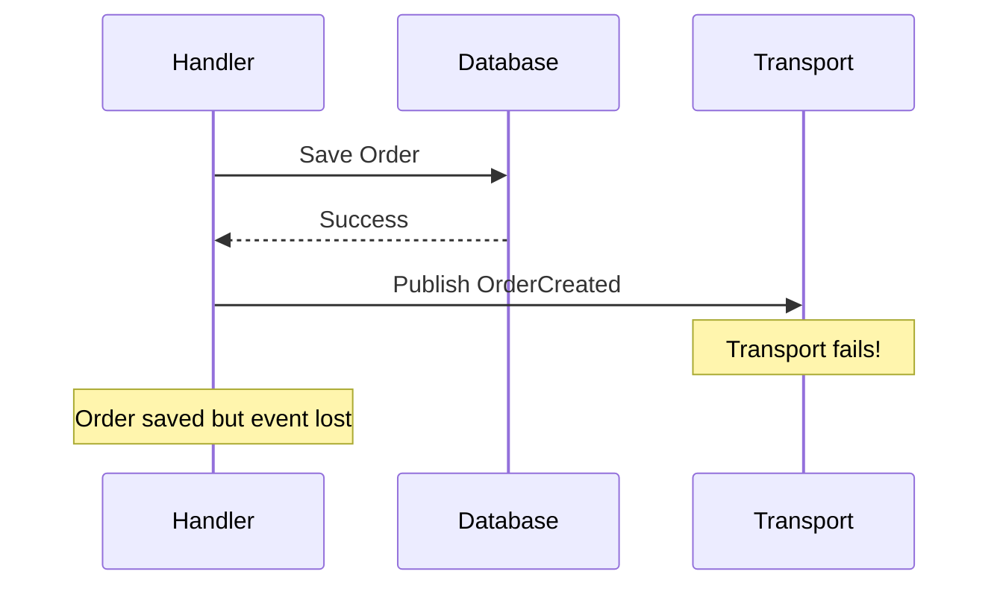
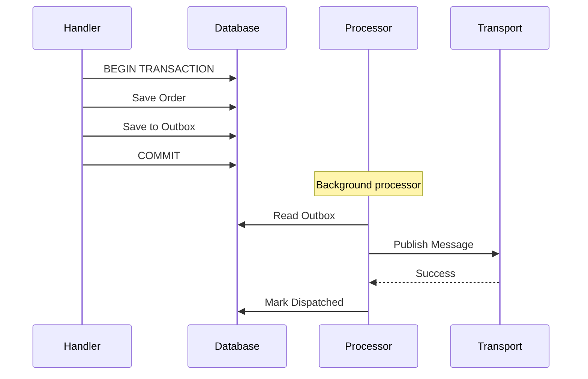

# Outbox Pattern

:::tip New to reliable messaging?
Start with the [Idempotent Consumer Guide](idempotent-consumer.md) to understand why messages get duplicated and how the Outbox and Inbox patterns work together.
:::

The outbox pattern ensures reliable message publishing by storing messages in the same database transaction as your domain changes.

## Before You Start

- **.NET 8.0+** (or .NET 9/10 for latest features)
- Install the required packages:
  ```bash
  dotnet add package Excalibur.Dispatch.Patterns
  dotnet add package Excalibur.EventSourcing.SqlServer  # or your provider
  ```
- Familiarity with [Dispatch pipeline](../pipeline/index.md) and database transactions
- A SQL Server or PostgreSQL database for outbox storage

## The Problem

Without the outbox pattern, you risk inconsistency:



## The Solution

Store messages in an outbox table within the same transaction:



## Quick Start

### Configuration with Presets

The preset-based API for outbox configuration replaces 20+ individual settings with intuitive performance presets. Choose the preset that matches your use case:

```csharp
services.AddDispatch(dispatch =>
{
    dispatch.AddHandlersFromAssembly(typeof(Program).Assembly);
});

// Recommended: Use presets for common scenarios
services.AddExcaliburOutbox(OutboxOptions.Balanced().Build());

// Add SQL Server outbox storage
services.AddSqlServerOutboxStore(options =>
{
    options.ConnectionString = connectionString;
    options.SchemaName = "outbox";
});
```

### Available Presets

| Preset | Use Case | Key Characteristics |
|--------|----------|---------------------|
| **HighThroughput** | Real-time event processing, high-volume systems | Large batches (1000), fast polling (100ms), 8 parallel threads |
| **Balanced** | Most production workloads | Moderate batches (100), 1s polling, 4 parallel threads |
| **HighReliability** | Financial transactions, critical systems | Small batches (10), sequential processing, extended retention (30 days) |
| **Custom** | Advanced users who need full control | Defaults to Balanced values, all settings configurable |

### Preset Configuration Values

| Setting | HighThroughput | Balanced | HighReliability |
|---------|----------------|----------|-----------------|
| BatchSize | 1000 | 100 | 10 |
| PollingInterval | 100ms | 1s | 5s |
| MaxRetryCount | 3 | 5 | 10 |
| RetryDelay | 1 min | 5 min | 15 min |
| EnableParallelProcessing | true | true | false |
| MaxDegreeOfParallelism | 8 | 4 | 1 (sequential) |
| MessageRetentionPeriod | 1 day | 7 days | 30 days |
| CleanupInterval | 15 min | 1 hour | 6 hours |

### Preset with Overrides

Start from a preset and override specific settings:

```csharp
// High throughput with larger batches
services.AddExcaliburOutbox(OutboxOptions.HighThroughput()
    .WithBatchSize(2000)
    .WithProcessorId("worker-1")
    .Build());

// Balanced with custom retention
services.AddExcaliburOutbox(OutboxOptions.Balanced()
    .WithRetentionPeriod(TimeSpan.FromDays(14))
    .WithMaxRetries(7)
    .Build());

// High reliability with disabled cleanup (manual cleanup preferred)
services.AddExcaliburOutbox(OutboxOptions.HighReliability()
    .DisableAutomaticCleanup()
    .Build());
```

### Full Custom Configuration

For advanced users who need complete control:

```csharp
services.AddExcaliburOutbox(OutboxOptions.Custom()
    .WithBatchSize(500)
    .WithPollingInterval(TimeSpan.FromMilliseconds(500))
    .WithParallelism(6)
    .WithMaxRetries(5)
    .WithRetryDelay(TimeSpan.FromMinutes(2))
    .WithRetentionPeriod(TimeSpan.FromDays(14))
    .WithCleanupInterval(TimeSpan.FromHours(2))
    .WithProcessorId("custom-processor")
    .EnableBackgroundProcessing()
    .Build());
```

### Usage in Handlers

The `OutboxStagingMiddleware` automatically stages outbound messages added during handler execution. Use the `AddOutboundMessage<T>()` extension method on the message context:

```csharp
// Use IDispatchHandler for direct access to IMessageContext (needed for outbox staging)
public class CreateOrderHandler : IDispatchHandler<CreateOrderAction>
{
    private readonly IDbConnection _db;

    public CreateOrderHandler(IDbConnection db) => _db = db;

    public async Task<IMessageResult> HandleAsync(
        CreateOrderAction action,
        IMessageContext context,
        CancellationToken ct)
    {
        using var transaction = _db.BeginTransaction();
        context.SetItem("Transaction", transaction); // Share transaction with outbox middleware

        // Save domain changes
        var orderId = Guid.NewGuid();
        await _db.ExecuteAsync(
            "INSERT INTO Orders (Id, CustomerId) VALUES (@Id, @CustomerId)",
            new { Id = orderId, action.CustomerId },
            transaction);

        // Add to outbox (staged automatically by OutboxStagingMiddleware)
        context.AddOutboundMessage(
            new OrderCreatedEvent(orderId, action.CustomerId),
            destination: "orders");

        transaction.Commit();
        return MessageResult.Success();
    }
}
```

The `AddOutboundMessage<T>()` extension method is in the `Excalibur.Dispatch.Middleware` namespace.

## Outbox Stores

### SQL Server

```csharp
services.AddSqlServerOutboxStore(options =>
{
    options.ConnectionString = connectionString;
    options.SchemaName = "outbox";
    options.OutboxTableName = "OutboxMessages";
    options.DeadLetterTableName = "OutboxDeadLetters";
});
```

### PostgreSQL

```csharp
services.AddExcaliburOutbox(outbox =>
{
    outbox.UsePostgres(connectionString, postgres =>
    {
        postgres.SchemaName("outbox")
                .TableName("outbox_messages");
    });
});
```

### MongoDB

```csharp
services.AddMongoDbOutboxStore(options =>
{
    options.ConnectionString = connectionString;
    options.DatabaseName = "myapp";
    options.CollectionName = "outbox";
});
```

## Database Schema

### SQL Server

```sql
CREATE SCHEMA [outbox];

CREATE TABLE [outbox].[OutboxMessages] (
    [Id] BIGINT IDENTITY(1,1) NOT NULL,
    [MessageId] NVARCHAR(100) NOT NULL,
    [MessageType] NVARCHAR(500) NOT NULL,
    [Payload] NVARCHAR(MAX) NOT NULL,
    [Headers] NVARCHAR(MAX) NULL,
    [CreatedAt] DATETIME2 NOT NULL DEFAULT GETUTCDATE(),
    [ProcessedAt] DATETIME2 NULL,
    [RetryCount] INT NOT NULL DEFAULT 0,
    [Error] NVARCHAR(MAX) NULL,

    CONSTRAINT [PK_OutboxMessages] PRIMARY KEY CLUSTERED ([Id]),
    CONSTRAINT [UQ_OutboxMessages_MessageId] UNIQUE ([MessageId])
);

CREATE INDEX [IX_OutboxMessages_Unprocessed]
ON [outbox].[OutboxMessages] ([ProcessedAt], [CreatedAt])
WHERE [ProcessedAt] IS NULL;
```

## Background Processing

### Hosted Service (Default)

```csharp
// Use presets - background processing enabled by default
services.AddExcaliburOutbox(OutboxOptions.Balanced().Build());

// Add storage
services.AddSqlServerOutboxStore(connectionString);

// Register the background service
services.AddOutboxHostedService();
```

### Quartz Job (Scheduled Processing)

For enterprise scheduling needs, use `OutboxProcessorJob` from `Excalibur.Jobs`:

```csharp
// Install: dotnet add package Excalibur.Jobs

services.AddExcaliburOutbox(OutboxOptions.Balanced().Build());
services.AddSqlServerOutboxStore(connectionString);

// Register the Quartz.NET outbox processor job
// Configure schedule in appsettings.json or via Quartz API
```

The `OutboxProcessorJob` integrates with Quartz.NET for scheduled outbox processing with built-in health checks and multi-database support.

### Manual Processing

For serverless environments (Azure Functions, AWS Lambda):

```csharp
// Use Custom preset to disable background processing
services.AddExcaliburOutbox(OutboxOptions.Custom()
    .WithBatchSize(50)
    .WithMaxRetries(3)
    .Build());  // EnableBackgroundProcessing defaults to true in presets

services.AddSqlServerOutboxStore(connectionString);

// Process manually (e.g., Azure Function timer trigger)
public class OutboxProcessorFunction
{
    private readonly IOutboxProcessor _processor;

    [Function("ProcessOutbox")]
    public async Task Run([TimerTrigger("*/5 * * * * *")] TimerInfo timer)
    {
        await _processor.DispatchPendingMessagesAsync(CancellationToken.None);
    }
}
```

## Publisher Configuration

### Default Publisher

The outbox uses the configured `IOutboxPublisher` to send messages. The default behavior dispatches through the registered message bus:

```csharp
services.AddExcaliburOutbox();
services.AddSqlServerOutboxStore(connectionString);

// Messages are dispatched through IDispatcher by default
```

### Transport-Specific Publisher

```csharp
services.AddDispatch(dispatch =>
{
    dispatch.AddHandlersFromAssembly(typeof(Program).Assembly);
    dispatch.UseKafka(kafka =>
    {
        kafka.BootstrapServers("localhost:9092");
        kafka.DefaultTopic("dispatch.events");
    });
});

services.AddExcaliburOutbox();
services.AddSqlServerOutboxStore(connectionString);

// Register Kafka publisher for outbox
services.AddSingleton<IOutboxPublisher, KafkaOutboxPublisher>();
```

### Custom Publisher

Implement `IOutboxPublisher` for custom message publishing:

```csharp
public class WebhookOutboxPublisher : IOutboxPublisher
{
    private readonly HttpClient _httpClient;
    private readonly IOutboxStore _store;
    private int _publishedCount;
    private int _failedCount;

    public WebhookOutboxPublisher(HttpClient httpClient, IOutboxStore store)
    {
        _httpClient = httpClient;
        _store = store;
    }

    public async Task<OutboundMessage> PublishAsync(
        object message,
        string destination,
        DateTimeOffset? scheduledAt,
        CancellationToken cancellationToken)
    {
        // Create and stage outbound message
        var payload = JsonSerializer.SerializeToUtf8Bytes(message);
        var outbound = new OutboundMessage(
            message.GetType().Name,
            payload,
            destination) { ScheduledAt = scheduledAt };

        await _store.StageMessageAsync(outbound, cancellationToken);
        return outbound;
    }

    public async Task<PublishingResult> PublishPendingMessagesAsync(
        CancellationToken cancellationToken)
    {
        var messages = await _store.GetUnsentMessagesAsync(100, cancellationToken);
        var published = 0;
        var failed = 0;

        foreach (var message in messages)
        {
            try
            {
                await _httpClient.PostAsync(
                    $"/webhooks/{message.Destination}",
                    new ByteArrayContent(message.Payload),
                    cancellationToken);

                await _store.MarkSentAsync(message.Id, cancellationToken);
                published++;
            }
            catch (Exception ex)
            {
                await _store.MarkFailedAsync(message.Id, ex.Message, 1, cancellationToken);
                failed++;
            }
        }

        Interlocked.Add(ref _publishedCount, published);
        Interlocked.Add(ref _failedCount, failed);

        return new PublishingResult { SuccessCount = published, FailureCount = failed };
    }

    // Implement other required methods...
}

services.AddExcaliburOutbox();
services.AddSqlServerOutboxStore(connectionString);
services.AddSingleton<IOutboxPublisher, WebhookOutboxPublisher>();
```

## Error Handling

### Retry Configuration

```csharp
// Use HighReliability preset for aggressive retries (10 retries, 15 min delay)
services.AddExcaliburOutbox(OutboxOptions.HighReliability().Build());

// Or customize retry behavior
services.AddExcaliburOutbox(OutboxOptions.Balanced()
    .WithMaxRetries(7)
    .WithRetryDelay(TimeSpan.FromMinutes(2))
    .Build());

services.AddSqlServerOutboxStore(options =>
{
    options.ConnectionString = connectionString;
});
```

### Dead Letter Handling

```csharp
services.AddSqlServerOutboxStore(options =>
{
    options.ConnectionString = connectionString;
    options.DeadLetterTableName = "DeadLetterMessages";
});

// Add dead letter queue handler
services.AddSqlServerDeadLetterQueue(connectionString);
```

## Cleanup

### Automatic Cleanup

All presets enable automatic cleanup by default with appropriate intervals:

```csharp
// Balanced: 7-day retention, hourly cleanup
services.AddExcaliburOutbox(OutboxOptions.Balanced().Build());

// HighReliability: 30-day retention, 6-hour cleanup interval
services.AddExcaliburOutbox(OutboxOptions.HighReliability().Build());

// Custom retention
services.AddExcaliburOutbox(OutboxOptions.Balanced()
    .WithRetentionPeriod(TimeSpan.FromDays(14))
    .WithCleanupInterval(TimeSpan.FromHours(2))
    .Build());

services.AddSqlServerOutboxStore(connectionString);
```

### Manual Cleanup

```csharp
public class OutboxCleanupJob
{
    private readonly IOutboxStore _store;

    public async Task CleanupAsync(CancellationToken ct)
    {
        var cutoff = DateTimeOffset.UtcNow.AddDays(-7);
        var deleted = await _store.CleanupSentMessagesAsync(cutoff, batchSize: 1000, ct);
        _logger.LogInformation("Deleted {Count} processed messages", deleted);
    }
}
```

## Monitoring

### Health Checks

```csharp
services.AddHealthChecks()
    .AddOutboxHealthCheck(options =>
    {
        options.UnhealthyInactivityTimeout = TimeSpan.FromMinutes(5);
        options.DegradedInactivityTimeout = TimeSpan.FromMinutes(2);
        options.UnhealthyFailureRatePercent = 20.0;
        options.DegradedFailureRatePercent = 5.0;
    });
```

### Metrics

Outbox metrics are included in the core Dispatch metrics:

```csharp
services.AddOpenTelemetry()
    .WithMetrics(metrics =>
    {
        metrics.AddDispatchMetrics();
        // Includes outbox-related metrics:
        // - dispatch.messages.processed
        // - dispatch.messages.published
        // - dispatch.messages.failed
        // - dispatch.messages.duration
    });
```

## Validation Rules

The preset-based API validates configuration at build time:

| Rule | Error Message |
|------|---------------|
| `BatchSize >= 1` | "BatchSize must be at least 1." |
| `BatchSize <= 10000` | "BatchSize cannot exceed 10000." |
| `PollingInterval >= 10ms` | "PollingInterval must be at least 10ms." |
| `MaxRetryCount >= 0` | "MaxRetryCount cannot be negative." |
| `MaxDegreeOfParallelism >= 1` | "MaxDegreeOfParallelism must be at least 1." |
| `RetryDelay > 0` | "RetryDelay must be positive." |
| `RetentionPeriod > 0` | "RetentionPeriod must be positive." |
| `RetentionPeriod >= CleanupInterval` (when cleanup enabled) | "RetentionPeriod must be greater than or equal to CleanupInterval." |
| `ProcessorId` not empty | "ProcessorId cannot be null or whitespace." |

## Best Practices

| Practice | Recommendation |
|----------|----------------|
| **Use presets** | Start with Balanced, adjust only if needed |
| Transaction scope | Keep outbox add in same transaction as domain changes |
| Batch size | Use preset defaults (HighThroughput: 1000, Balanced: 100, HighReliability: 10) |
| Processing interval | Use preset defaults; 100ms for real-time, 1-5s for standard |
| Retention | 7 days for most workloads, 30 days for compliance |
| Monitoring | Alert on high pending count or age |
| Preset selection | HighReliability for financial, Balanced for most, HighThroughput for event streaming |

## Troubleshooting

### Messages Not Processing

```sql
-- Check unprocessed messages
SELECT TOP 100 *
FROM [outbox].[OutboxMessages]
WHERE [ProcessedAt] IS NULL
ORDER BY [CreatedAt];

-- Check failed messages
SELECT *
FROM [outbox].[OutboxMessages]
WHERE [Error] IS NOT NULL;
```

### High Latency

- Increase batch size
- Reduce processing interval
- Add database indexes
- Scale out processors (with locking)

## Design Principles

| Principle | Description |
|----------|-------------|
| Preset-based API | `HighThroughput()`, `Balanced()`, `HighReliability()`, `Custom()` factory methods |
| Immutable options | `OutboxOptions` created via fluent `IOutboxOptionsBuilder` |
| Override support | Presets provide opinionated defaults; `.With*()` methods allow surgical overrides |
| Fail-fast validation | Validation at `Build()` time, not at registration |
| API consistency | Parallel `InboxOptions` presets for consistent experience |

## Next Steps

- [Inbox Pattern](inbox.md) -- Idempotent message processing
- [CDC Pattern](cdc.md) -- Change Data Capture integration
- [Dead Letter](dead-letter.md) -- Handle failed messages

## See Also

- [Outbox Setup & Configuration](../configuration/outbox-setup.md) -- Step-by-step setup guide for outbox infrastructure and connection options
- [Inbox Pattern](inbox.md) -- Complement the outbox with idempotent consumer deduplication
- [Dead Letter Handling](dead-letter.md) -- Capture and recover messages that fail after retry exhaustion
- [Transports Overview](../transports/index.md) -- Available message transports for outbox publishing
