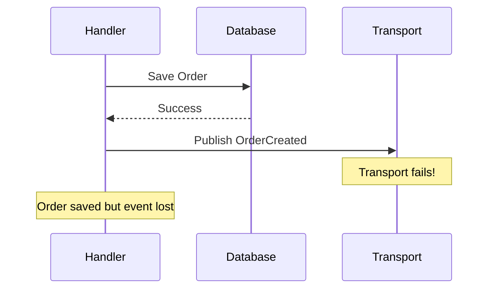
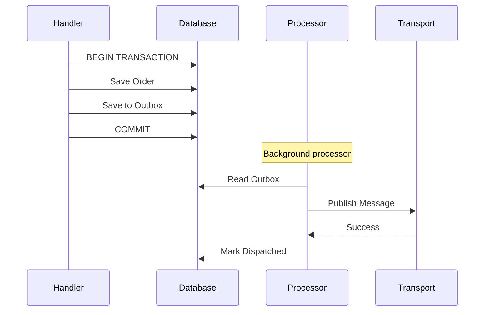
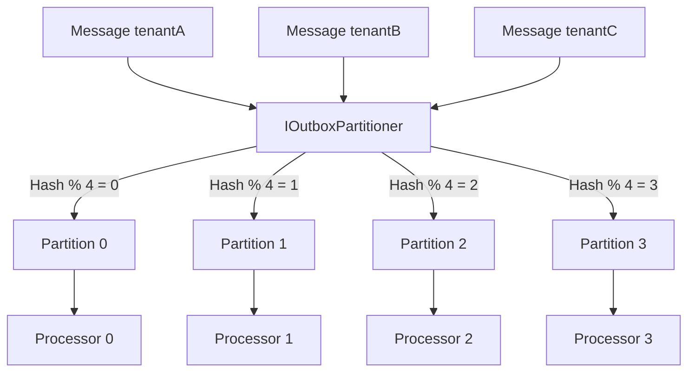

# Outbox Pattern

:::tip New to reliable messaging?

Start with the [Idempotent Consumer Guide](idempotent-consumer.md) to understand why messages get duplicated and how the Outbox and Inbox patterns work together.
:::

The outbox pattern ensures reliable message publishing by storing messages in the same database transaction as your domain changes.

## Before You Start

- **.NET 10.0**
- Install the required packages:
  ```bash
  dotnet add package Excalibur.Dispatch.Patterns
  dotnet add package Excalibur.EventSourcing.SqlServer  # or your provider
  ```
- Familiarity with [Dispatch pipeline](../pipeline/index.md) and database transactions
- A SQL Server or PostgreSQL database for outbox storage

## The Problem

Without the outbox pattern, you risk inconsistency:


```mermaid
sequenceDiagram
    participant H as Handler
    participant DB as Database
    participant T as Transport

    H->>DB: Save Order
    DB-->>H: Success
    H->>T: Publish OrderCreated
    Note over T: Transport fails!
    Note over H: Order saved but event lost
```

## The Solution

Store messages in an outbox table within the same transaction:


```mermaid
sequenceDiagram
    participant H as Handler
    participant DB as Database
    participant P as Processor
    participant T as Transport

    H->>DB: BEGIN TRANSACTION
    H->>DB: Save Order
    H->>DB: Save to Outbox
    H->>DB: COMMIT

    Note over P: Background processor
    P->>DB: Read Outbox
    P->>T: Publish Message
    T-->>P: Success
    P->>DB: Mark Dispatched
```

## Quick Start

### Configuration with Presets

The preset-based API for outbox configuration replaces 20+ individual settings with intuitive performance presets. Choose the preset that matches your use case:

```csharp
services.AddDispatch(dispatch =>
{
    dispatch.AddHandlersFromAssembly(typeof(Program).Assembly);
});

// Recommended: Use presets for common scenarios
services.AddExcalibur(excalibur => excalibur.AddOutbox(OutboxOptions.Balanced().Build()));

// Add SQL Server outbox storage
services.AddSqlServerOutboxStore(options =>
{
    options.ConnectionString = connectionString;
    options.SchemaName = "outbox";
});
```

### Available Presets

| Preset | Use Case | Key Characteristics |
|--------|----------|---------------------|
| **HighThroughput** | Real-time event processing, high-volume systems | Large batches (1000), fast polling (100ms), 8 parallel threads |
| **Balanced** | Most production workloads | Moderate batches (100), 1s polling, 4 parallel threads |
| **HighReliability** | Financial transactions, critical systems | Small batches (10), sequential processing, extended retention (30 days) |
| **Custom** | Advanced users who need full control | Defaults to Balanced values, all settings configurable |

### Preset Configuration Values

| Setting | HighThroughput | Balanced | HighReliability |
|---------|----------------|----------|-----------------|
| BatchSize | 1000 | 100 | 10 |
| PollingInterval | 100ms | 1s | 5s |
| MaxRetryCount | 3 | 5 | 10 |
| RetryDelay | 1 min | 5 min | 15 min |
| EnableParallelProcessing | true | true | false |
| MaxDegreeOfParallelism | 8 | 4 | 1 (sequential) |
| MessageRetentionPeriod | 1 day | 7 days | 30 days |
| CleanupInterval | 15 min | 1 hour | 6 hours |

### Preset with Overrides

Start from a preset and override specific settings:

```csharp
// High throughput with larger batches
services.AddExcalibur(excalibur => excalibur.AddOutbox(OutboxOptions.HighThroughput()
    .WithBatchSize(2000)
    .WithProcessorId("worker-1")
    .Build()));

// Balanced with custom retention
services.AddExcalibur(excalibur => excalibur.AddOutbox(OutboxOptions.Balanced()
    .WithRetentionPeriod(TimeSpan.FromDays(14))
    .WithMaxRetries(7)
    .Build()));

// High reliability with disabled cleanup (manual cleanup preferred)
services.AddExcalibur(excalibur => excalibur.AddOutbox(OutboxOptions.HighReliability()
    .DisableAutomaticCleanup()
    .Build()));
```

### Full Custom Configuration

For advanced users who need complete control:

```csharp
services.AddExcalibur(excalibur => excalibur.AddOutbox(OutboxOptions.Custom()
    .WithBatchSize(500)
    .WithPollingInterval(TimeSpan.FromMilliseconds(500))
    .WithParallelism(6)
    .WithMaxRetries(5)
    .WithRetryDelay(TimeSpan.FromMinutes(2))
    .WithRetentionPeriod(TimeSpan.FromDays(14))
    .WithCleanupInterval(TimeSpan.FromHours(2))
    .WithProcessorId("custom-processor")
    .EnableBackgroundProcessing()
    .Build()));
```

### Usage in Handlers

Inject `IOutboxWriter` into your handler and call `WriteAsync` to stage outbound messages. The consistency guarantee (eventually-consistent vs. transactional) is determined by configuration -- your handler code stays the same regardless of mode:

```csharp
using Excalibur.Dispatch.Outbox;

public class CreateOrderHandler : IDispatchHandler<CreateOrderAction>
{
    private readonly IDbConnection _db;
    private readonly IOutboxWriter _outboxWriter;

    public CreateOrderHandler(IDbConnection db, IOutboxWriter outboxWriter)
    {
        _db = db;
        _outboxWriter = outboxWriter;
    }

    public async Task<IMessageResult> HandleAsync(
        CreateOrderAction action,
        IMessageContext context,
        CancellationToken ct)
    {
        using var transaction = _db.BeginTransaction();
        context.SetItem("Transaction", transaction);

        // Save domain changes
        var orderId = Guid.NewGuid();
        await _db.ExecuteAsync(
            "INSERT INTO Orders (Id, CustomerId) VALUES (@Id, @CustomerId)",
            new { Id = orderId, action.CustomerId },
            transaction);

        // Write to outbox -- behavior depends on configured ConsistencyMode
        await _outboxWriter.WriteAsync(
            new OrderCreatedEvent(orderId, action.CustomerId),
            destination: "orders",
            ct);

        transaction.Commit();
        return MessageResult.Success();
    }
}
```

For scheduled delivery, use the `WriteScheduledAsync` extension method:

```csharp
await _outboxWriter.WriteScheduledAsync(
    new ReminderEvent(orderId),
    destination: "reminders",
    scheduledAt: DateTimeOffset.UtcNow.AddHours(24),
    ct);
```

### Consistency Modes

Configure the outbox consistency mode via `OutboxStagingOptions`:

```csharp
services.AddDispatch(dispatch =>
{
    dispatch.UseOutbox(outbox =>
    {
        // Default: messages buffered and staged after handler completes
        outbox.ConsistencyMode = OutboxConsistencyMode.EventuallyConsistent;

        // OR: messages written within the ambient transaction (requires IOutboxStore)
        outbox.ConsistencyMode = OutboxConsistencyMode.Transactional;
    });
});
```

| Mode | Behavior | Risk | Requires |
|------|----------|------|----------|
| **EventuallyConsistent** (default) | Messages buffered during handler execution, flushed to outbox after handler + transaction complete | Messages lost if process crashes between commit and flush | Nothing extra |
| **Transactional** | Messages written to `IOutboxStore` within the ambient transaction | None (atomic with business data) | `IOutboxStore` registration + `TransactionMiddleware` |


## Outbox Stores

### SQL Server

```csharp
services.AddSqlServerOutboxStore(options =>
{
    options.ConnectionString = connectionString;
    options.SchemaName = "outbox";
    options.OutboxTableName = "OutboxMessages";
    options.DeadLetterTableName = "OutboxDeadLetters";
});
```

### PostgreSQL

```csharp
services.AddExcalibur(excalibur => excalibur.AddOutbox(outbox =>
{
    outbox.UsePostgres(postgres =>
    {
        postgres.ConnectionString(connectionString)
                .SchemaName("outbox")
                .TableName("outbox_messages");
    });
}));
```

### Redis

```csharp
services.AddExcalibur(excalibur => excalibur.AddOutbox(outbox =>
{
    outbox.UseRedis(redis =>
    {
        redis.ConnectionString("localhost:6379")
             .KeyPrefix("outbox:");
    });
}));

// Or with an existing ConnectionMultiplexer from DI
services.AddExcalibur(excalibur => excalibur.AddOutbox(outbox =>
{
    outbox.UseRedis(redis =>
    {
        redis.Multiplexer(existingMultiplexer)
             .KeyPrefix("outbox:");
    });
}));
```

### MongoDB

```csharp
services.AddExcalibur(excalibur => excalibur.AddOutbox(outbox =>
{
    outbox.UseMongoDB(mongo =>
    {
        mongo.ConnectionString(connectionString)
             .DatabaseName("myapp");
    });
}));
```

### Elasticsearch

```csharp
services.AddExcalibur(excalibur => excalibur.AddOutbox(outbox =>
{
    outbox.UseElasticSearch(options =>
    {
        options.IndexName = "excalibur-outbox";
        options.DefaultBatchSize = 100;
    });
}));
```

### Firestore

```csharp
services.AddExcalibur(excalibur => excalibur.AddOutbox(outbox =>
{
    outbox.UseFirestore(options =>
    {
        options.ProjectId = "my-gcp-project";
        options.CollectionName = "outbox";
    });
}));
```

### Cosmos DB

```csharp
services.AddExcalibur(excalibur => excalibur.AddOutbox(outbox =>
{
    outbox.UseCosmosDb(cosmos =>
    {
        cosmos.ConnectionString(connectionString)
              .DatabaseName("myapp")
              .ContainerName("outbox");
    });
}));
```

### DynamoDB

```csharp
services.AddExcalibur(excalibur => excalibur.AddOutbox(outbox =>
{
    outbox.UseDynamoDb(options =>
    {
        options.Connection.Region = "us-east-1";
        options.TableName = "outbox";
    });
}));
```

## Database Schema

### SQL Server

The SQL Server store does **not** auto-create tables — create the schema before starting the application. The `IX_OutboxMessages_Claim` index backs the atomic claim predicate (status + retry-visibility) and the partition-ordered delivery guarantee.

```sql
CREATE TABLE dbo.OutboxMessages (
    Id               NVARCHAR(255)  NOT NULL PRIMARY KEY,
    MessageType      NVARCHAR(500)  NOT NULL,
    Payload          VARBINARY(MAX) NOT NULL,
    Headers          NVARCHAR(MAX)  NULL,
    Destination      NVARCHAR(255)  NOT NULL,
    CreatedAt        DATETIMEOFFSET NOT NULL DEFAULT SYSDATETIMEOFFSET(),
    ScheduledAt      DATETIMEOFFSET NULL,
    SentAt           DATETIMEOFFSET NULL,
    Status           INT            NOT NULL DEFAULT 0,
    RetryCount       INT            NOT NULL DEFAULT 0,
    LastError        NVARCHAR(MAX)  NULL,
    LastAttemptAt    DATETIMEOFFSET NULL,
    CorrelationId    NVARCHAR(255)  NULL,
    CausationId      NVARCHAR(255)  NULL,
    TenantId         NVARCHAR(255)  NULL,
    Priority         INT            NOT NULL DEFAULT 0,
    TargetTransports NVARCHAR(MAX)  NULL,
    IsMultiTransport BIT            NOT NULL DEFAULT 0,
    LeasedAt         DATETIMEOFFSET NULL,
    LeasedBy         NVARCHAR(255)  NULL,
    PartitionKey     NVARCHAR(256)  NULL,   -- ordered delivery: per-partition FIFO
    GroupKey         NVARCHAR(256)  NULL,   -- logical message grouping
    SequenceNumber   BIGINT         NOT NULL DEFAULT 0, -- monotonic ordering key
    NextAttemptAt    DATETIMEOFFSET NULL,   -- retry backoff: not re-claimed until this time
    INDEX IX_OutboxMessages_Status_CreatedAt (Status, CreatedAt),
    INDEX IX_OutboxMessages_Claim (Status, NextAttemptAt, PartitionKey, SequenceNumber)
);
```

:::note Ordering and retry-backoff columns
`PartitionKey` / `GroupKey` / `SequenceNumber` persist the message ordering keys, and `NextAttemptAt` records the per-message backoff deadline. The background processor claims rows with `WHERE Status IN (Staged, Failed, PartiallyFailed) AND (NextAttemptAt IS NULL OR NextAttemptAt <= @now) ORDER BY PartitionKey, SequenceNumber` — so same-partition messages are delivered in ascending `SequenceNumber`, and a failed message's computed backoff genuinely throttles re-delivery. See [Ordering and Retry Scheduling](#ordering-and-retry-scheduling).
:::

## Background Processing

### Hosted Service (Default)

```csharp
// Use presets - background processing enabled by default
services.AddExcalibur(excalibur => excalibur.AddOutbox(OutboxOptions.Balanced().Build()));

// Add storage
services.AddSqlServerOutboxStore(opts => opts.ConnectionString = connectionString);

// Register the background service
services.AddOutboxHostedService();
```

### Quartz Job (Scheduled Processing)

For enterprise scheduling needs, use `OutboxProcessorJob` from `Excalibur.Jobs`:

```csharp
// Install: dotnet add package Excalibur.Jobs

services.AddExcalibur(excalibur => excalibur.AddOutbox(OutboxOptions.Balanced().Build()));
services.AddSqlServerOutboxStore(opts => opts.ConnectionString = connectionString);

// Register the Quartz.NET outbox processor job
// Configure schedule in appsettings.json or via Quartz API
```

The `OutboxProcessorJob` integrates with Quartz.NET for scheduled outbox processing with built-in health checks and multi-database support.

### Manual Processing

For serverless environments (Azure Functions, AWS Lambda):

```csharp
// Use Custom preset to disable background processing
services.AddExcalibur(excalibur => excalibur.AddOutbox(OutboxOptions.Custom()
    .WithBatchSize(50)
    .WithMaxRetries(3)
    .Build()));  // EnableBackgroundProcessing defaults to true in presets

services.AddSqlServerOutboxStore(opts => opts.ConnectionString = connectionString);

// Process manually (e.g., Azure Function timer trigger)
public class OutboxProcessorFunction
{
    private readonly IOutboxProcessor _processor;

    [Function("ProcessOutbox")]
    public async Task Run([TimerTrigger("*/5 * * * * *")] TimerInfo timer)
    {
        await _processor.DispatchPendingMessagesAsync(CancellationToken.None);
    }
}
```

## Publisher Configuration

### Default Publisher

The outbox uses the configured `IOutboxPublisher` to send messages. The default behavior dispatches through the registered message bus:

```csharp
services.AddExcalibur(excalibur => excalibur.AddOutbox());
services.AddSqlServerOutboxStore(opts => opts.ConnectionString = connectionString);

// Messages are dispatched through IDispatcher by default
```

### Transport-Specific Publisher

```csharp
services.AddDispatch(dispatch =>
{
    dispatch.AddHandlersFromAssembly(typeof(Program).Assembly);
    dispatch.UseKafka(kafka =>
    {
        kafka.BootstrapServers("localhost:9092");
        kafka.DefaultTopic("dispatch.events");
    });
});

services.AddExcalibur(excalibur => excalibur.AddOutbox());
services.AddSqlServerOutboxStore(opts => opts.ConnectionString = connectionString);

// Register Kafka publisher for outbox
services.AddSingleton<IOutboxPublisher, KafkaOutboxPublisher>();
```

### Custom Publisher

Implement `IOutboxPublisher` for custom message publishing:

```csharp
public class WebhookOutboxPublisher : IOutboxPublisher
{
    private readonly HttpClient _httpClient;
    private readonly IOutboxStore _store;
    private int _publishedCount;
    private int _failedCount;

    public WebhookOutboxPublisher(HttpClient httpClient, IOutboxStore store)
    {
        _httpClient = httpClient;
        _store = store;
    }

    public async Task<OutboundMessage> PublishAsync(
        object message,
        string destination,
        DateTimeOffset? scheduledAt,
        CancellationToken cancellationToken)
    {
        // Create and stage outbound message
        var payload = JsonSerializer.SerializeToUtf8Bytes(message);
        var outbound = new OutboundMessage(
            message.GetType().Name,
            payload,
            destination) { ScheduledAt = scheduledAt };

        await _store.StageMessageAsync(outbound, cancellationToken);
        return outbound;
    }

    public async Task<PublishingResult> PublishPendingMessagesAsync(
        CancellationToken cancellationToken)
    {
        var messages = await _store.GetUnsentMessagesAsync(100, cancellationToken);
        var published = 0;
        var failed = 0;

        foreach (var message in messages)
        {
            try
            {
                await _httpClient.PostAsync(
                    $"/webhooks/{message.Destination}",
                    new ByteArrayContent(message.Payload),
                    cancellationToken);

                await _store.MarkSentAsync(message.Id, cancellationToken);
                published++;
            }
            catch (Exception ex)
            {
                await _store.MarkFailedAsync(message.Id, ex.Message, 1, cancellationToken);
                failed++;
            }
        }

        Interlocked.Add(ref _publishedCount, published);
        Interlocked.Add(ref _failedCount, failed);

        return new PublishingResult { SuccessCount = published, FailureCount = failed };
    }

    // Implement other required methods...
}

services.AddExcalibur(excalibur => excalibur.AddOutbox());
services.AddSqlServerOutboxStore(opts => opts.ConnectionString = connectionString);
services.AddSingleton<IOutboxPublisher, WebhookOutboxPublisher>();
```

## Error Handling

### Retry Configuration

```csharp
// Use HighReliability preset for aggressive retries (10 retries, 15 min delay)
services.AddExcalibur(excalibur => excalibur.AddOutbox(OutboxOptions.HighReliability().Build()));

// Or customize retry behavior
services.AddExcalibur(excalibur => excalibur.AddOutbox(OutboxOptions.Balanced()
    .WithMaxRetries(7)
    .WithRetryDelay(TimeSpan.FromMinutes(2))
    .Build()));

services.AddSqlServerOutboxStore(options =>
{
    options.ConnectionString = connectionString;
});
```

### Dead Letter Handling

```csharp
services.AddSqlServerOutboxStore(options =>
{
    options.ConnectionString = connectionString;
    options.DeadLetterTableName = "DeadLetterMessages";
});

// Add dead letter queue handler
services.AddSqlServerDeadLetterQueue(opts => opts.ConnectionString = connectionString);
```

## Ordering and Retry Scheduling

### Partition-Ordered Delivery

Each outbound message carries three ordering fields — `PartitionKey`, `GroupKey`, and a monotonically increasing `SequenceNumber`. The polling claim selects eligible rows in `(PartitionKey, SequenceNumber)` order, so **messages that share a `PartitionKey` are delivered in ascending `SequenceNumber` (per-partition FIFO)**. Messages without a `PartitionKey` have no cross-message ordering guarantee. `GroupKey` is an independent label for logical grouping and does not affect claim order.

> This is message-level ordering persisted on each row. It is distinct from [Partitioned Outbox](#partitioned-outbox) processing, which shards the *processor loops* for throughput.

### Retry Backoff Is Applied

When delivery fails, the processor computes an exponential backoff delay and records the absolute next-attempt time on the row's `NextAttemptAt` column. The claim predicate excludes the message until that time elapses (`NextAttemptAt IS NULL OR NextAttemptAt <= @now`), so the configured retry delay **genuinely throttles re-delivery** rather than re-claiming the message as soon as its lease expires.

A **circuit-breaker-open** short-circuit is treated differently: because no delivery was actually attempted, no backoff is applied — the message stays immediately eligible and retries as soon as the breaker closes.

Backoff scheduling requires a store that implements the optional `IBackoffSchedulableOutboxStore` capability (`MarkFailedWithBackoffAsync`). The SQL Server store implements it. Stores that do not are unaffected: the processor falls back to the plain `MarkFailedAsync` path (immediate re-eligibility), so no store is broken — matching the fail-open pattern used by `IDeadLetterableOutboxStore`. The capability is forwarded transparently through the telemetry and encrypting outbox-store decorators, so it survives a decorated store chain.

## Cleanup

### Automatic Cleanup

All presets enable automatic cleanup by default with appropriate intervals:

```csharp
// Balanced: 7-day retention, hourly cleanup
services.AddExcalibur(excalibur => excalibur.AddOutbox(OutboxOptions.Balanced().Build()));

// HighReliability: 30-day retention, 6-hour cleanup interval
services.AddExcalibur(excalibur => excalibur.AddOutbox(OutboxOptions.HighReliability().Build()));

// Custom retention
services.AddExcalibur(excalibur => excalibur.AddOutbox(OutboxOptions.Balanced()
    .WithRetentionPeriod(TimeSpan.FromDays(14))
    .WithCleanupInterval(TimeSpan.FromHours(2))
    .Build()));

services.AddSqlServerOutboxStore(opts => opts.ConnectionString = connectionString);
```

### Manual Cleanup

```csharp
public class OutboxCleanupJob
{
    private readonly IOutboxStore _store;

    public async Task CleanupAsync(CancellationToken ct)
    {
        var cutoff = DateTimeOffset.UtcNow.AddDays(-7);
        var deleted = await _store.CleanupSentMessagesAsync(cutoff, batchSize: 1000, ct);
        _logger.LogInformation("Deleted {Count} processed messages", deleted);
    }
}
```

## Monitoring

### Health Checks

```csharp
services.AddHealthChecks()
    .AddOutboxHealthCheck(options =>
    {
        options.UnhealthyInactivityTimeout = TimeSpan.FromMinutes(5);
        options.DegradedInactivityTimeout = TimeSpan.FromMinutes(2);
        options.UnhealthyFailureRatePercent = 20.0;
        options.DegradedFailureRatePercent = 5.0;
    });
```

### Metrics

Outbox metrics are included in the core Dispatch metrics:

```csharp
services.AddOpenTelemetry()
    .WithMetrics(metrics =>
    {
        metrics.AddDispatchMetrics();
        // Includes outbox-related metrics:
        // - dispatch.messages.processed
        // - dispatch.messages.published
        // - dispatch.messages.failed
        // - dispatch.messages.duration
    });
```

## Validation Rules

The preset-based API validates configuration at build time:

| Rule | Error Message |
|------|---------------|
| `BatchSize >= 1` | "BatchSize must be at least 1." |
| `BatchSize <= 10000` | "BatchSize cannot exceed 10000." |
| `PollingInterval >= 10ms` | "PollingInterval must be at least 10ms." |
| `MaxRetryCount >= 0` | "MaxRetryCount cannot be negative." |
| `MaxDegreeOfParallelism >= 1` | "MaxDegreeOfParallelism must be at least 1." |
| `RetryDelay > 0` | "RetryDelay must be positive." |
| `RetentionPeriod > 0` | "RetentionPeriod must be positive." |
| `RetentionPeriod >= CleanupInterval` (when cleanup enabled) | "RetentionPeriod must be greater than or equal to CleanupInterval." |
| `ProcessorId` not empty | "ProcessorId cannot be null or whitespace." |

## Best Practices

| Practice | Recommendation |
|----------|----------------|
| **Use presets** | Start with Balanced, adjust only if needed |
| Transaction scope | Keep outbox add in same transaction as domain changes |
| Batch size | Use preset defaults (HighThroughput: 1000, Balanced: 100, HighReliability: 10) |
| Processing interval | Use preset defaults; 100ms for real-time, 1-5s for standard |
| Retention | 7 days for most workloads, 30 days for compliance |
| Monitoring | Alert on high pending count or age |
| Preset selection | HighReliability for financial, Balanced for most, HighThroughput for event streaming |

## Troubleshooting

### Messages Not Processing

```sql
-- Check unprocessed messages
SELECT TOP 100 *
FROM [outbox].[OutboxMessages]
WHERE [ProcessedAt] IS NULL
ORDER BY [CreatedAt];

-- Check failed messages
SELECT *
FROM [outbox].[OutboxMessages]
WHERE [Error] IS NOT NULL;
```

### High Latency

- Increase batch size
- Reduce processing interval
- Add database indexes
- Scale out processors (with locking)

## Event Sourcing Outbox Integration

When using event sourcing, integration events can be staged to the unified outbox automatically during aggregate save. The `EventSourcedRepository` supports three staging strategies controlled by `OutboxStagingStrategy`:

### Staging Strategies

| Strategy | Behavior | Trade-off |
|----------|----------|-----------|
| `Auto` (default) | Framework selects the best available strategy | No configuration needed |
| `Transactional` | Stages events in the same DB transaction as the event append | Zero message loss, adds save latency |
| `EventuallyConsistent` | Stages events after a successful append in a separate call | Minimal latency, tiny loss window on crash |
| `Deferred` | No staging during save; a background service picks up events later | Zero added latency, higher delivery delay |

### Configuration

```csharp
services.AddExcalibur(excalibur => excalibur.AddEventSourcing(es =>
{
    es.UseSqlServer(sql => sql.ConnectionString(connectionString));

    // Per-aggregate staging strategy
    es.AddRepository<Order>(id => new Order(id), opts =>
    {
        opts.OutboxStagingStrategy = OutboxStagingStrategy.Transactional;
    });
}));

// Register the unified outbox store (required for Transactional and EventuallyConsistent)
services.AddExcalibur(excalibur => excalibur.AddOutbox(outbox => outbox.UseSqlServer(opts =>
{
    opts.ConnectionString = connectionString;
})));
```

### How Auto Resolution Works

When `OutboxStagingStrategy.Auto` is configured (the default), the repository checks at save time:

1. If an `ITransactionalEventStore` (a transactional event store) **and** an `ITransactionalOutboxWriter` are registered, uses **Transactional**
2. If only `IOutboxStore` is registered, uses **EventuallyConsistent**
3. If neither is registered, uses **Deferred** (no staging)

Selecting `OutboxStagingStrategy.Transactional` explicitly (rather than `Auto`) without both pieces of infrastructure fails fast at startup via a `ValidateOnStart` guard, naming exactly what is missing — it never silently degrades to non-atomic staging.

### ITransactionalEventStore

The event-store side of the atomic path. An event store provider backed by a transactional database (SQL Server, PostgreSQL) implements the optional `ITransactionalEventStore` extension of `IEventStore` to enable the **Transactional** strategy:

```csharp
namespace Excalibur.EventSourcing;

public interface ITransactionalEventStore : IEventStore
{
    ValueTask<AppendResult> AppendWithOutboxStagingAsync(
        string aggregateId,
        string aggregateType,
        IEnumerable<IDomainEvent> events,
        long expectedVersion,
        Func<IDbTransaction, CancellationToken, ValueTask> stageOutbox,
        CancellationToken cancellationToken);
}
```

This is a **store-owned unit of work**: the store opens and owns a single connection and transaction, runs the optimistic-concurrency version check, appends the events, invokes your `stageOutbox` callback on that *same* transaction (only when the version check succeeds), then commits. On a concurrency conflict or any throw from `stageOutbox`, the whole transaction rolls back, so neither the events nor the outbox rows persist. Because the transaction never leaves the store, appending events and staging outbox rows on two different transactions is structurally impossible.

`SqlServerEventStore` implements `ITransactionalEventStore`. You do not call `AppendWithOutboxStagingAsync` directly — `EventSourcedRepository` invokes it on your behalf when the resolved strategy is `Transactional`, supplying a `stageOutbox` callback that enlists each integration event's outbox write through `ITransactionalOutboxWriter` on the store's transaction. NoSQL event stores do not implement this interface; use `EventuallyConsistent` or `Deferred` staging with them.

### ITransactionalOutboxWriter

Relational outbox providers (SQL Server, PostgreSQL) implement `ITransactionalOutboxWriter` to stage outbox rows on the event store's database transaction (the `stageOutbox` callback above calls into it):

```csharp
public interface ITransactionalOutboxWriter
{
    ValueTask StageMessageAsync(
        OutboundMessage message,
        IDbTransaction transaction,
        CancellationToken cancellationToken);
}
```

NoSQL providers (CosmosDB, DynamoDB, MongoDB, etc.) do not implement this interface. Use `EventuallyConsistent` or `Deferred` staging with NoSQL event stores.

### Standard Header Names

The `OutboxHeaderNames` class provides well-known constants used in outbox message headers and event metadata:

| Constant | Value | Purpose |
|----------|-------|---------|
| `AggregateId` | `"aggregate-id"` | Aggregate that produced the event |
| `AggregateType` | `"aggregate-type"` | Aggregate type name |
| `TenantId` | `"tenant-id"` | Multi-tenant routing |
| `CorrelationId` | `"correlation-id"` | Distributed tracing |
| `CausationId` | `"causation-id"` | Cause-effect linking |

## Partitioned Outbox

At high event rates (100K+ events/sec), the single outbox table becomes a contention bottleneck. Partitioned outbox splits processing into multiple independent loops, each handling a subset of messages.

### Enable Partitioned Processing

```csharp
services.AddExcalibur(excalibur => excalibur.AddOutbox(outbox =>
{
    outbox.UseSqlServer(opts => opts.ConnectionString = connectionString);

    outbox.UsePartitionedProcessing(opts =>
    {
        opts.Strategy = OutboxPartitionStrategy.ByTenantHash;
        opts.PartitionCount = 8;
        opts.ProcessorCountPerPartition = 1;
        opts.PollingInterval = TimeSpan.FromSeconds(1);
        opts.ErrorBackoffInterval = TimeSpan.FromSeconds(5);
    });
}));
```

### Partitioning Strategies

| Strategy | Description | Use Case |
|----------|-------------|----------|
| `None` | Single processor loop (default) | Low-to-moderate throughput |
| `PerShard` | One partition per tenant shard | When tenant sharding is active |
| `ByTenantHash` | `XxHash32(tenantId) % N` partitions | High throughput without sharding infrastructure |

### How It Works


```mermaid
flowchart TD
    M1[Message tenantA] --> P[IOutboxPartitioner]
    M2[Message tenantB] --> P
    M3[Message tenantC] --> P

    P -->|"Hash % 4 = 0"| T0[Partition 0]
    P -->|"Hash % 4 = 1"| T1[Partition 1]
    P -->|"Hash % 4 = 2"| T2[Partition 2]
    P -->|"Hash % 4 = 3"| T3[Partition 3]

    T0 --> W0[Processor 0]
    T1 --> W1[Processor 1]
    T2 --> W2[Processor 2]
    T3 --> W3[Processor 3]
```

Each partition runs an independent processor loop with its own error isolation. When `ProcessorCountPerPartition > 1`, multiple concurrent processors handle the same partition.

### Configuration Options

| Option | Default | Description |
|--------|---------|-------------|
| `Strategy` | `None` | Partitioning strategy |
| `PartitionCount` | 8 | Number of partitions (for `ByTenantHash`) |
| `ProcessorCountPerPartition` | 1 | Concurrent processor instances per partition |
| `PollingInterval` | 1s | Delay when no messages are available |
| `ErrorBackoffInterval` | 5s | Delay after a processing error |
| `ShardIds` | `[]` | Required shard IDs when Strategy is `PerShard` |

### Custom Partitioner

Implement `IOutboxPartitioner` for custom routing logic:

```csharp
public interface IOutboxPartitioner
{
    int GetPartition(string tenantId);
    int PartitionCount { get; }
}
```

## Design Principles

| Principle | Description |
|----------|-------------|
| Preset-based API | `HighThroughput()`, `Balanced()`, `HighReliability()`, `Custom()` factory methods |
| Immutable options | `OutboxOptions` created via fluent `IOutboxOptionsBuilder` |
| Override support | Presets provide opinionated defaults; `.With*()` methods allow surgical overrides |
| Fail-fast validation | Validation at `Build()` time, not at registration |
| API consistency | Parallel `InboxOptions` presets for consistent experience |

## Next Steps

- [Inbox Pattern](inbox.md) -- Idempotent message processing
- [CDC Pattern](cdc.md) -- Change Data Capture integration
- [Dead Letter](dead-letter.md) -- Handle failed messages

## See Also

- [Outbox Setup & Configuration](../configuration/outbox-setup.md) -- Step-by-step setup guide for outbox infrastructure and connection options
- [Inbox Pattern](inbox.md) -- Complement the outbox with idempotent consumer deduplication
- [Dead Letter Handling](dead-letter.md) -- Capture and recover messages that fail after retry exhaustion
- [Transports Overview](../transports/index.md) -- Available message transports for outbox publishing
