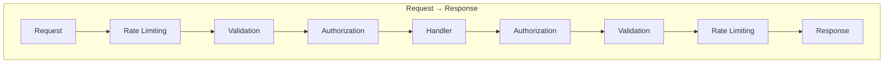

# Pipeline

The Dispatch pipeline processes messages through a chain of middleware components. Each middleware can inspect, modify, or short-circuit message processing.

## Before You Start

- **.NET 8.0+** (or .NET 9/10 for latest features)
- Install the required package:
  ```bash
  dotnet add package Excalibur.Dispatch
  ```
- Familiarity with [handlers](../handlers.md) and [dependency injection](../core-concepts/dependency-injection.md)

## Pipeline Architecture

Messages flow through middleware in a nested pattern:



Each middleware can:
- Execute logic before calling `next()`
- Execute logic after `next()` returns
- Modify the message or context
- Short-circuit by returning without calling `next()`
- Handle exceptions from downstream components

## Pipeline Stages

Middleware executes in defined stages. Lower values execute first on request, last on response:

| Stage | Value | Purpose |
|-------|-------|---------|
| `Start` | 0 | Pipeline entry point |
| `RateLimiting` | 50 | Throughput control |
| `PreProcessing` | 100 | Tracing and context setup |
| `Instrumentation` | 150 | Performance metrics |
| `Authentication` | 175 | Identity verification |
| `Logging` | 190 | Audit trails and diagnostics |
| `Validation` | 200 | Input validation |
| `Serialization` | 250 | Message serialization |
| `Authorization` | 300 | Permission checks |
| `Cache` | 400 | Cache lookup and storage |
| `Optimization` | 450 | Batching and bulk operations |
| `Routing` | 500 | Handler resolution |
| `Processing` | 600 | Core handler execution |
| `PostProcessing` | 700 | Cleanup and result transformation |
| `Error` | 800 | Exception handling |
| `ErrorHandling` | 801 | Exception handling (alias) |
| `End` | 1000 | Pipeline exit |

## Quick Start

### Register Middleware

```csharp
builder.Services.AddDispatch(dispatch =>
{
    dispatch.AddHandlersFromAssembly(typeof(Program).Assembly);

    // Configure middleware pipeline
    dispatch.ConfigurePipeline("Default", pipeline =>
    {
        pipeline.Use<LoggingMiddleware>();
        pipeline.Use<ValidationMiddleware>();
        pipeline.Use<AuthorizationMiddleware>();
    });
});
```

### Create Custom Middleware

```csharp
public class TimingMiddleware : IDispatchMiddleware
{
    private readonly ILogger<TimingMiddleware> _logger;

    public TimingMiddleware(ILogger<TimingMiddleware> logger)
    {
        _logger = logger;
    }

    public DispatchMiddlewareStage? Stage => DispatchMiddlewareStage.Logging;

    public async ValueTask<IMessageResult> InvokeAsync(
        IDispatchMessage message,
        IMessageContext context,
        DispatchRequestDelegate next,
        CancellationToken ct)
    {
        var sw = Stopwatch.StartNew();

        // Call next middleware
        var result = await next(message, context, ct);

        sw.Stop();
        _logger.LogInformation(
            "{MessageType} completed in {ElapsedMs}ms",
            message.GetType().Name,
            sw.ElapsedMilliseconds);

        return result;
    }
}
```

## Message Kind Filtering

Limit which messages your middleware processes:

```csharp
public class ValidationMiddleware : IDispatchMiddleware
{
    public DispatchMiddlewareStage? Stage => DispatchMiddlewareStage.Validation;

    // Only validate commands and queries, not events
    public MessageKinds ApplicableMessageKinds => MessageKinds.Action;

    public async ValueTask<IMessageResult> InvokeAsync(
        IDispatchMessage message,
        IMessageContext context,
        DispatchRequestDelegate next,
        CancellationToken ct)
    {
        // Validation logic...
        return await next(message, context, ct);
    }
}
```

## Short-Circuiting

Return early without calling `next()` to skip downstream processing:

```csharp
public class CachingMiddleware : IDispatchMiddleware
{
    public DispatchMiddlewareStage? Stage => DispatchMiddlewareStage.Cache;

    public async ValueTask<IMessageResult> InvokeAsync(
        IDispatchMessage message,
        IMessageContext context,
        DispatchRequestDelegate next,
        CancellationToken ct)
    {
        var cacheKey = BuildCacheKey(message);
        var cached = await _cache.GetAsync<IMessageResult>(cacheKey);

        if (cached is not null)
        {
            return cached; // Short-circuit: don't call next
        }

        var result = await next(message, context, ct);

        if (result.Succeeded)
        {
            await _cache.SetAsync(cacheKey, result, TimeSpan.FromMinutes(5));
        }

        return result;
    }
}
```

## Conditional Middleware

Apply middleware based on runtime conditions:

```csharp
builder.Services.AddDispatch(dispatch =>
{
    dispatch.ConfigurePipeline("Default", pipeline =>
    {
        // Only in development
        pipeline.UseWhen<DebugMiddleware>(
            sp => sp.GetRequiredService<IHostEnvironment>().IsDevelopment());

        // Only when audit feature is enabled
        pipeline.UseWhen<AuditMiddleware>(
            sp => sp.GetRequiredService<IConfiguration>()
                .GetValue<bool>("Features:AuditEnabled"));

        // Based on configuration
        pipeline.UseWhen<FeatureMiddleware>(
            sp => sp.GetRequiredService<IConfiguration>()
                .GetValue<bool>("Features:NewFeature"));
    });
});
```

## Automatic Default Pipeline

When you register middleware using `UseMiddleware<T>()` without explicitly calling `ConfigurePipeline()`, Dispatch automatically creates a "Default" pipeline:

```csharp
// This automatically creates a default pipeline
builder.Services.AddDispatch(dispatch =>
{
    dispatch.AddHandlersFromAssembly(typeof(Program).Assembly);
    dispatch.UseMiddleware<LoggingMiddleware>();
    dispatch.UseMiddleware<ValidationMiddleware>();
});
```

Middleware is then ordered by their `Stage` value.

## In This Section

| Topic | Description |
|-------|-------------|
| [Pipeline Profiles](profiles.md) | Reusable middleware configurations for different scenarios |

## See Also

- [Middleware](../middleware/index.md) - Built-in and custom middleware components
- [Handlers](../handlers.md) - Action and event handlers that the pipeline wraps
- [Performance](../performance/index.md) - Optimize pipeline throughput
