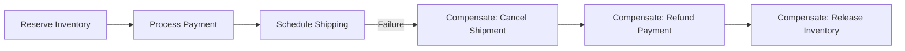
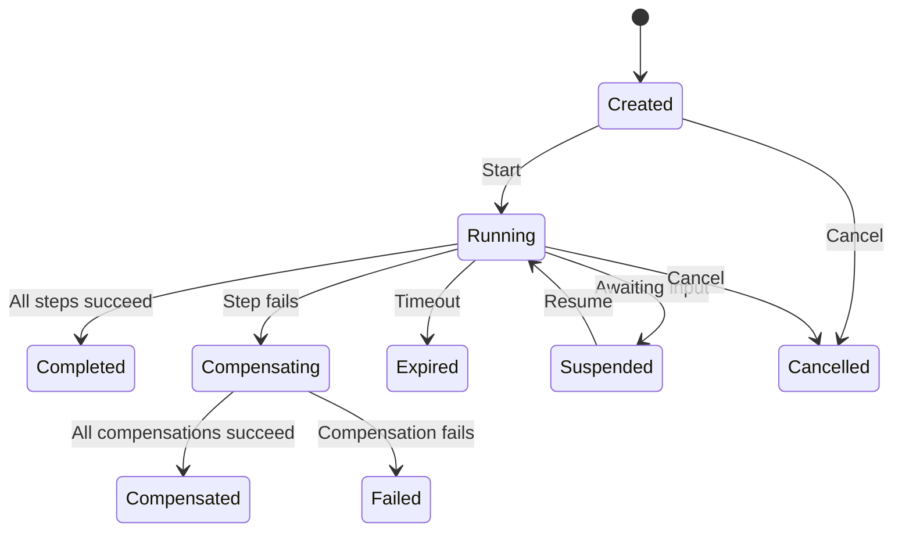

# Building Your First Saga

:::info Step-based pattern (in-process)
This guide covers the **step-based** saga API (`ISagaDefinition` + `ISagaStep`), where all steps execute sequentially in a single process. Each step directly `await`s its service call. This is the simplest way to coordinate multi-step workflows and is ideal for modular monoliths or services that call other services via HTTP/gRPC.

For sagas that span independently deployed microservices communicating through events, see the **[event-driven pattern](orchestration-vs-choreography.md)** using `SagaBase<T>`.
:::

A saga coordinates a multi-step business process where failure in one step requires undoing previous steps. Unlike a database transaction, a saga cannot simply roll back. Instead, each step defines a **compensation** action that undoes its work.

This guide walks through building a realistic saga from scratch: an order fulfillment process that reserves inventory, charges payment, and schedules shipping. Along the way, you will see what happens when things go wrong and how compensation keeps your system consistent.

## Before You Start

- **.NET 8.0+** (or .NET 9/10 for latest features)
- Install the required packages:
  ```bash
  dotnet add package Excalibur.Saga
  dotnet add package Excalibur.Saga.SqlServer  # or your provider
  ```
- Familiarity with [Dispatch pipeline](../pipeline/index.md) and [dependency injection](../core-concepts/dependency-injection.md)

## When Do You Need a Saga?

Not every multi-step operation needs a saga. Use this as a guide:

| Scenario | Solution |
|----------|----------|
| All writes go to one database | Use a database transaction |
| Two services, one can retry idempotently | Use the outbox pattern with retry |
| Multiple services, failure requires rollback of earlier steps | **Use a saga** |
| Long-running process with human approval steps | **Use a saga** with suspension |

The key question: **"If step 3 fails, do I need to undo steps 1 and 2?"** If yes, you need a saga.

## The Scenario

An e-commerce order fulfillment process with three steps:

1. **Reserve inventory** -- Put items on hold so they cannot be sold to someone else
2. **Process payment** -- Charge the customer's payment method
3. **Schedule shipping** -- Create a shipment with the carrier

Each step talks to a different service. If payment fails, we must release the inventory reservation. If shipping fails, we must refund the payment and release inventory.



## Step 1: Define the Saga Data

The saga data holds the state that is shared across all steps. Each step reads and writes to this object.

```csharp
public class OrderSagaData
{
    public Guid OrderId { get; set; }
    public string CustomerId { get; set; } = string.Empty;
    public decimal Amount { get; set; }

    // Populated by each step as it executes
    public string? ReservationId { get; set; }
    public Guid PaymentId { get; set; }
    public Guid ShipmentId { get; set; }
    public bool InventoryReserved { get; set; }
}
```

Each step stores its result in the saga data so that subsequent steps (and compensation) can reference it. For example, `ProcessPaymentStep` needs `ReservationId` to confirm the reservation is valid, and `CompensateAsync` needs `PaymentId` to issue a refund.

## Step 2: Implement the Steps

Each step implements `ISagaStep<TSagaData>` with two methods: `ExecuteAsync` (do the work) and `CompensateAsync` (undo the work).

### Reserve Inventory

```csharp
public class ReserveInventoryStep : ISagaStep<OrderSagaData>
{
    public string Name => "ReserveInventory";
    public bool CanCompensate => true;
    public TimeSpan Timeout => TimeSpan.FromSeconds(30);

    public async Task<StepResult> ExecuteAsync(
        ISagaContext<OrderSagaData> context,
        CancellationToken cancellationToken)
    {
        // Call the inventory service
        var reservationId = await _inventoryService.ReserveAsync(
            context.Data.OrderId,
            cancellationToken);

        // Store the result for later steps and compensation
        context.Data.ReservationId = reservationId;
        context.Data.InventoryReserved = true;

        return StepResult.Success();
    }

    public async Task<StepResult> CompensateAsync(
        ISagaContext<OrderSagaData> context,
        CancellationToken cancellationToken)
    {
        if (context.Data.ReservationId is not null)
        {
            await _inventoryService.ReleaseReservationAsync(
                context.Data.ReservationId,
                cancellationToken);
        }

        context.Data.InventoryReserved = false;
        return StepResult.Success();
    }
}
```

### Process Payment

```csharp
public class ProcessPaymentStep : ISagaStep<OrderSagaData>
{
    public string Name => "ProcessPayment";
    public bool CanCompensate => true;
    public TimeSpan Timeout => TimeSpan.FromSeconds(60);

    public async Task<StepResult> ExecuteAsync(
        ISagaContext<OrderSagaData> context,
        CancellationToken cancellationToken)
    {
        var paymentId = await _paymentService.ChargeAsync(
            context.Data.CustomerId,
            context.Data.Amount,
            idempotencyKey: $"order-{context.Data.OrderId}",
            cancellationToken);

        context.Data.PaymentId = paymentId;
        return StepResult.Success();
    }

    public async Task<StepResult> CompensateAsync(
        ISagaContext<OrderSagaData> context,
        CancellationToken cancellationToken)
    {
        if (context.Data.PaymentId != Guid.Empty)
        {
            await _paymentService.RefundAsync(
                context.Data.PaymentId,
                cancellationToken);
        }

        return StepResult.Success();
    }
}
```

Notice the idempotency key on the payment charge. If the saga retries this step, the payment service will recognize the duplicate and return the original result.

### Schedule Shipping

```csharp
public class ShipOrderStep : ISagaStep<OrderSagaData>
{
    public string Name => "ShipOrder";
    public bool CanCompensate => false; // Cannot un-ship a package
    public TimeSpan Timeout => TimeSpan.FromMinutes(5);

    public async Task<StepResult> ExecuteAsync(
        ISagaContext<OrderSagaData> context,
        CancellationToken cancellationToken)
    {
        var shipmentId = await _shippingService.ScheduleAsync(
            context.Data.OrderId,
            cancellationToken);

        context.Data.ShipmentId = shipmentId;
        return StepResult.Success();
    }

    public Task<StepResult> CompensateAsync(
        ISagaContext<OrderSagaData> context,
        CancellationToken cancellationToken)
    {
        // CanCompensate is false -- this method won't be called
        return Task.FromResult(StepResult.Success());
    }
}
```

**Important:** `CanCompensate = false` means this step cannot be undone. Once a package ships, you cannot un-ship it. Place non-compensable steps **last** in your saga so that if they fail, the compensable steps before them can still be rolled back.

## Step 3: Define the Saga

The saga definition ties the steps together and defines the overall behavior:

```csharp
public class OrderSaga : ISagaDefinition<OrderSagaData>
{
    public string Name => "OrderSaga";
    public TimeSpan Timeout => TimeSpan.FromMinutes(30);

    public IReadOnlyList<ISagaStep<OrderSagaData>> Steps =>
    [
        new ReserveInventoryStep(),
        new ProcessPaymentStep(),
        new ShipOrderStep()
    ];

    public IRetryPolicy? RetryPolicy => null; // No automatic retry

    public Task OnCompletedAsync(
        ISagaContext<OrderSagaData> context,
        CancellationToken cancellationToken)
    {
        // All steps succeeded -- send confirmation email, update read model, etc.
        return Task.CompletedTask;
    }

    public Task OnFailedAsync(
        ISagaContext<OrderSagaData> context,
        Exception exception,
        CancellationToken cancellationToken)
    {
        // Saga failed after compensation -- alert operations team, log for review
        return Task.CompletedTask;
    }
}
```

## Step 4: Register and Execute

```csharp
// Registration
services.AddExcaliburSaga();

// Execution
public class PlaceOrderHandler : IActionHandler<PlaceOrderAction>
{
    private readonly ISagaOrchestrator _orchestrator;

    public async Task HandleAsync(
        PlaceOrderAction action,
        CancellationToken ct)
    {
        var saga = _orchestrator.CreateSaga(
            new OrderSaga(),
            new OrderSagaData
            {
                OrderId = Guid.NewGuid(),
                CustomerId = action.CustomerId,
                Amount = action.Total
            });

        // saga.SagaId can be stored and used to query progress later
    }
}
```

## What Happens When It Fails

Let's walk through the failure scenario step by step.

### Happy Path

```
Step 1: ReserveInventory  → Success (ReservationId = "RES-123")
Step 2: ProcessPayment    → Success (PaymentId = "PAY-456")
Step 3: ShipOrder         → Success (ShipmentId = "SHIP-789")

Saga status: Completed
OnCompletedAsync called
```

### Payment Fails

```
Step 1: ReserveInventory  → Success (ReservationId = "RES-123")
Step 2: ProcessPayment    → FAILED (PaymentDeclinedException)

Compensation begins (reverse order):
  → Compensate ProcessPayment  → Skipped (nothing to refund, charge never completed)
  → Compensate ReserveInventory → Release reservation "RES-123"

Saga status: Compensated
OnFailedAsync called with PaymentDeclinedException
```

### Shipping Fails

```
Step 1: ReserveInventory  → Success (ReservationId = "RES-123")
Step 2: ProcessPayment    → Success (PaymentId = "PAY-456")
Step 3: ShipOrder         → FAILED (CarrierUnavailableException)

Compensation begins (reverse order):
  → ShipOrder: CanCompensate = false → Skipped
  → Compensate ProcessPayment  → Refund payment "PAY-456"
  → Compensate ReserveInventory → Release reservation "RES-123"

Saga status: Compensated
OnFailedAsync called with CarrierUnavailableException
```

## Adding Retry Logic

For transient failures (network timeouts, temporary service unavailability), add a retry policy:

```csharp
public class OrderSaga : ISagaDefinition<OrderSagaData>
{
    // ...

    public IRetryPolicy? RetryPolicy => new TransientRetryPolicy
    {
        MaxAttempts = 3,
        Delay = TimeSpan.FromSeconds(2)
    };
}

public class TransientRetryPolicy : IRetryPolicy
{
    public int MaxAttempts { get; init; } = 3;
    public TimeSpan Delay { get; init; } = TimeSpan.FromSeconds(2);

    public bool ShouldRetry(Exception exception)
    {
        // Only retry transient failures
        return exception is TimeoutException
            or HttpRequestException
            or TaskCanceledException;
    }
}
```

With this policy, if `ProcessPaymentStep` throws a `TimeoutException`, the saga engine retries it up to 3 times before giving up and starting compensation.

## Persisting Saga State

For production systems, persist saga state to survive process restarts:

```csharp
services.AddExcaliburSaga(options =>
{
    // SQL Server persistence
});
```

Without persistence, a process restart loses all in-flight saga state. The SQL Server store provides:

- Durable state across restarts
- Concurrent execution safety (multiple instances can process sagas)
- Query support for monitoring saga status

## Monitoring Sagas

### Query Saga State

```csharp
// Get a specific saga
var saga = await orchestrator.GetSagaAsync<OrderSagaData>(sagaId, ct);
// saga.Status: Running, Completed, Compensating, etc.

// List all active sagas
var active = await orchestrator.ListActiveSagasAsync(ct);

// Cancel a stuck saga
await orchestrator.CancelSagaAsync(sagaId, "Timeout - manual cancellation", ct);
```

### Saga Status Lifecycle



## Combining Sagas with Other Patterns

### Sagas + Outbox

Use the outbox pattern to guarantee that saga events are published reliably. The `AddOutboundMessage` extension method is on `IMessageContext`, so inject `IMessageContextAccessor` into your step:

```csharp
public async Task<StepResult> ExecuteAsync(
    ISagaContext<OrderSagaData> context,
    CancellationToken cancellationToken)
{
    // Process the step
    var result = await _service.ProcessAsync(context.Data, cancellationToken);

    // Stage the event in the outbox via the message context
    var messageContext = _contextAccessor.MessageContext
        ?? throw new InvalidOperationException("No message context available");

    messageContext.AddOutboundMessage(
        new InventoryReservedEvent(context.Data.OrderId, result.ReservationId));

    return StepResult.Success();
}
```

### Sagas + Idempotent Consumer

If saga steps are triggered by events, use `[Idempotent]` to prevent duplicate execution on redelivery:

```csharp
[Idempotent]
public class InventoryReservedHandler : IEventHandler<InventoryReservedEvent>
{
    private readonly ISagaCoordinator _coordinator;
    private readonly IMessageContextAccessor _contextAccessor;

    public async Task HandleAsync(InventoryReservedEvent @event, CancellationToken ct)
    {
        var context = _contextAccessor.MessageContext
            ?? throw new InvalidOperationException("No message context available");

        // Advance the saga -- inbox ensures this runs at most once
        await _coordinator.ProcessEventAsync(context, @event, ct);
    }
}
```

## Common Mistakes

### 1. Putting non-compensable steps early

```csharp
// Bad: If payment fails, we can't un-ship
Steps = [new ShipOrderStep(), new ProcessPaymentStep()];

// Good: Non-compensable steps go last
Steps = [new ProcessPaymentStep(), new ShipOrderStep()];
```

### 2. Forgetting idempotency in compensation

Compensation can be retried. Make sure `CompensateAsync` is safe to call multiple times:

```csharp
public async Task<StepResult> CompensateAsync(
    ISagaContext<OrderSagaData> context,
    CancellationToken cancellationToken)
{
    // Good: Check if there's actually something to refund
    if (context.Data.PaymentId != Guid.Empty)
    {
        await _paymentService.RefundAsync(context.Data.PaymentId, cancellationToken);
    }

    return StepResult.Success();
}
```

### 3. Not setting timeouts

Without timeouts, a saga can hang indefinitely if a service never responds:

```csharp
// Always set both saga-level and step-level timeouts
public TimeSpan Timeout => TimeSpan.FromMinutes(30);  // Saga
public TimeSpan Timeout => TimeSpan.FromSeconds(60);   // Step
```

## When to Use the Event-Driven Pattern Instead

The step-based pattern in this guide executes all steps sequentially in a single `ExecuteAsync` call. This has important implications:

- **All services must be reachable from one process.** The saga directly `await`s each service call. If the inventory service is a separate microservice, your saga process needs an HTTP/gRPC client to call it.
- **The saga cannot suspend between steps.** If you need to wait hours for a human approval before proceeding to the next step, the step-based pattern is not a good fit.
- **A process restart loses in-progress state.** If the process crashes between step 2 and step 3, the saga does not automatically resume (though you can add persistence to recover).

For these scenarios, use the **event-driven pattern** (`SagaBase<T>`) instead:

| Scenario | Pattern |
|----------|---------|
| API gateway coordinating internal services | **Step-based** (this guide) |
| Modular monolith with service classes | **Step-based** (this guide) |
| Independent microservices communicating via Kafka/RabbitMQ | **Event-driven** ([Orchestration vs Choreography](orchestration-vs-choreography.md)) |
| Long-running process with human approval steps | **Event-driven** ([Orchestration vs Choreography](orchestration-vs-choreography.md)) |
| Workflow spanning hours or days | **Event-driven** ([Orchestration vs Choreography](orchestration-vs-choreography.md)) |

The event-driven saga processes one event at a time, persists state between events, and resumes when the next event arrives -- even if that takes days. See [Orchestration vs Choreography](orchestration-vs-choreography.md) for the full pattern.

## Next Steps

- [Orchestration vs Choreography](orchestration-vs-choreography.md) -- Event-driven sagas for microservice architectures
- [Outbox Pattern](../patterns/outbox.md) -- Reliable event publishing from saga steps
- [Idempotent Consumer Guide](../patterns/idempotent-consumer.md) -- Prevent duplicate processing of saga events
- [Error Handling & Recovery](../patterns/error-handling.md) -- How retries and DLQ interact with sagas

## See Also

- [Sagas Overview](index.md) - Saga concepts and architecture
- [Orchestration vs Choreography](orchestration-vs-choreography.md) - Choosing the right saga pattern
- [Outbox Pattern](../patterns/outbox.md) - Reliable event publishing for distributed transactions
