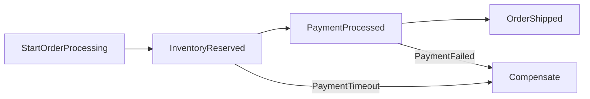

# Building Your First Saga

A saga coordinates a multi-step business process where failure in one step requires undoing previous steps. Unlike a database transaction, a saga cannot simply roll back. Instead, each step publishes a command, the saga suspends until it receives a response event, and compensation logic is built into the event handlers.

This guide walks through building a realistic saga from scratch: an order fulfillment process that reserves inventory, charges payment, and schedules shipping. Along the way, you will see how to handle failures, schedule timeouts, and keep your system consistent.

## Before You Start

- **.NET 10.0**
- Install the required packages:
  ```bash
  dotnet add package Excalibur.Saga
  dotnet add package Excalibur.Saga.SqlServer  # or your provider
  ```
- Familiarity with [Dispatch pipeline](../pipeline/index.md) and [dependency injection](../core-concepts/dependency-injection.md)

## When Do You Need a Saga?

Not every multi-step operation needs a saga. Use this as a guide:

| Scenario | Solution |
|----------|----------|
| All writes go to one database | Use a database transaction |
| Two services, one can retry idempotently | Use the outbox pattern with retry |
| Multiple services, failure requires rollback of earlier steps | **Use a saga** |
| Long-running process with human approval steps | **Use a saga** with suspension |

The key question: **"If step 3 fails, do I need to undo steps 1 and 2?"** If yes, you need a saga.

## The Scenario

An e-commerce order fulfillment process with three steps:

1. **Reserve inventory** -- Put items on hold so they cannot be sold to someone else
2. **Process payment** -- Charge the customer's payment method
3. **Schedule shipping** -- Create a shipment with the carrier

Each step is triggered by an event. If payment fails, we must release the inventory reservation. If payment takes too long, a timeout fires to cancel the order.


```mermaid
flowchart LR
    A[StartOrderProcessing] --> B[InventoryReserved]
    B --> C[PaymentProcessed]
    C --> D[OrderShipped]

    C -->|PaymentFailed| E[Compensate]
    B -->|PaymentTimeout| E
```

## Step 1: Define the Saga State

The saga state holds all data shared across event handlers. It extends `SagaState`, which provides the built-in `SagaId`, processed event tracking, and serialization support.

```csharp
using Excalibur.Saga.Orchestration;

public class OrderSagaState : SagaState
{
    public string OrderId { get; set; } = string.Empty;
    public string CustomerId { get; set; } = string.Empty;
    public decimal TotalAmount { get; set; }

    // Populated as events arrive
    public string? ReservationId { get; set; }
    public string? PaymentTransactionId { get; set; }
    public string? ShipmentTrackingNumber { get; set; }
    public string? FailureReason { get; set; }
    public string? TimeoutId { get; set; }
    public List<string> CompletedSteps { get; set; } = [];
}
```

## Step 2: Define the Saga Events

Events must implement `ISagaEvent` so the `SagaCoordinator` can route them to the correct saga instance. Each event carries a `SagaId` to identify which saga it belongs to.

```csharp
using Excalibur.Dispatch;

// Start event -- creates a new saga instance
public record StartOrderProcessing(
    string SagaId, string OrderId, string CustomerId, decimal TotalAmount) : ISagaEvent;

// Step completion events
public record InventoryReserved(string SagaId, string ReservationId) : ISagaEvent;
public record PaymentProcessed(string SagaId, string TransactionId) : ISagaEvent;
public record OrderShipped(string SagaId, string TrackingNumber) : ISagaEvent;

// Failure events
public record PaymentFailed(string SagaId, string Reason) : ISagaEvent;
```

## Step 3: Define a Timeout Message

Timeouts are also events. Define a timeout message for the payment deadline:

```csharp
using Excalibur.Dispatch;

public sealed class PaymentTimeout : ISagaEvent
{
    public string SagaId { get; set; } = string.Empty;
    public string? StepId => "PaymentTimeout";
}
```

## Step 4: Implement the Saga

Extend `SagaBase<TState>` and implement `ISagaTimeout<T>` for declarative timeout handling:

```csharp
using Excalibur.Dispatch;
using Excalibur.Saga;
using Excalibur.Saga.Orchestration;
using Microsoft.Extensions.Logging;

public sealed partial class OrderFulfillmentSaga(
    OrderSagaState initialState,
    IDispatcher dispatcher,
    ILogger<OrderFulfillmentSaga> logger)
    : SagaBase<OrderSagaState>(initialState, dispatcher, logger),
      ISagaTimeout<PaymentTimeout>
{
    /// <summary>
    /// Declares which events this saga handles. The SagaCoordinator calls
    /// this to determine if an incoming event should be routed here.
    /// </summary>
    public override bool HandlesEvent(object eventMessage)
    {
        return eventMessage is StartOrderProcessing
            or InventoryReserved
            or PaymentProcessed
            or OrderShipped
            or PaymentFailed;
    }

    /// <summary>
    /// Processes saga events and advances the workflow.
    /// </summary>
    public override async Task HandleAsync(
        object eventMessage, CancellationToken cancellationToken)
    {
        switch (eventMessage)
        {
            case StartOrderProcessing start:
                State.OrderId = start.OrderId;
                State.CustomerId = start.CustomerId;
                State.TotalAmount = start.TotalAmount;
                LogSagaStarted(State.SagaId, start.OrderId);

                // Schedule a payment timeout -- if payment is not
                // confirmed within 5 minutes, HandleTimeoutAsync fires
                State.TimeoutId = await RequestTimeoutAsync<PaymentTimeout>(
                    TimeSpan.FromMinutes(5), cancellationToken)
                    .ConfigureAwait(false);
                break;

            case InventoryReserved reserved:
                State.ReservationId = reserved.ReservationId;
                State.CompletedSteps.Add("ReserveInventory");
                break;

            case PaymentProcessed paid:
                State.PaymentTransactionId = paid.TransactionId;
                State.CompletedSteps.Add("ProcessPayment");

                // Cancel the payment timeout since we got confirmation
                if (State.TimeoutId is not null)
                {
                    await CancelTimeoutAsync(State.TimeoutId, cancellationToken)
                        .ConfigureAwait(false);
                }
                break;

            case OrderShipped shipped:
                State.ShipmentTrackingNumber = shipped.TrackingNumber;
                State.CompletedSteps.Add("ShipOrder");
                LogSagaCompleted(State.SagaId, State.OrderId);
                await MarkCompletedAsync(cancellationToken).ConfigureAwait(false);
                break;

            case PaymentFailed failed:
                State.FailureReason = failed.Reason;
                MarkCompleted();
                break;
        }
    }

    /// <summary>
    /// Called by the framework when a PaymentTimeout fires. Because the saga
    /// implements ISagaTimeout&lt;PaymentTimeout&gt;, this method is invoked
    /// directly instead of the general HandleAsync.
    /// </summary>
    public Task HandleTimeoutAsync(
        PaymentTimeout message, CancellationToken cancellationToken)
    {
        State.FailureReason = "Payment confirmation timed out";
        MarkCompleted();
        return Task.CompletedTask;
    }

    [LoggerMessage(Level = LogLevel.Information,
        Message = "Saga {SagaId} started for order {OrderId}")]
    private partial void LogSagaStarted(Guid sagaId, string orderId);

    [LoggerMessage(Level = LogLevel.Information,
        Message = "Saga {SagaId} completed for order {OrderId}")]
    private partial void LogSagaCompleted(Guid sagaId, string orderId);
}
```

Key points:
- **`HandlesEvent`** declares which event types this saga cares about. The `SagaCoordinator` uses this to route events.
- **`HandleAsync`** is called for each matched event. Use pattern matching to dispatch to the right logic.
- **`ISagaTimeout<PaymentTimeout>`** provides a dedicated `HandleTimeoutAsync` method that fires when the scheduled timeout expires.
- **`MarkCompleted()` / `MarkCompletedAsync()`** signals the saga is done. The state is persisted one final time.

## Step 5: Register and Configure

```csharp
using Excalibur.Dispatch.Messaging;
using Excalibur.Saga.Orchestration;
using Microsoft.Extensions.DependencyInjection;

public static class SagaConfiguration
{
    public static IServiceCollection AddOrderSaga(this IServiceCollection services)
    {
        // Register saga coordination infrastructure:
        //   - InMemorySagaStore (keyed "inmemory" + "default")
        //   - SagaCoordinator (routes ISagaEvent messages to saga instances)
        //   - SagaHandlingMiddleware (plugs into the Dispatch pipeline)
        services.AddExcaliburOrchestration();

        // Register timeout delivery (in-memory timeout store + delivery service)
        services.AddSagaTimeoutDelivery();

        // Register our saga type with the DI container
        services.AddSaga<OrderFulfillmentSaga, OrderSagaState>();

        // Map events so the coordinator knows which events start a new
        // saga instance vs. continue an existing one
        SagaRegistry.Register<OrderFulfillmentSaga, OrderSagaState>(info =>
        {
            info.StartsWith<StartOrderProcessing>();
            info.Handles<InventoryReserved>();
            info.Handles<PaymentProcessed>();
            info.Handles<OrderShipped>();
            info.Handles<PaymentFailed>();
            info.Handles<PaymentTimeout>();
        });

        return services;
    }
}
```

Or use the `ISagaBuilder` fluent API with a persistence provider:

```csharp
services.AddExcalibur(excalibur => excalibur.AddSagas(saga =>
{
    saga.UseSqlServer(sql => sql.ConnectionString(connectionString))
        .WithCoordination()
        .WithTimeouts();
}));
```

## What Happens When It Works

```
StartOrderProcessing    → State created, payment timeout scheduled (5 min)
InventoryReserved       → ReservationId stored, step marked complete
PaymentProcessed        → TransactionId stored, timeout cancelled
OrderShipped            → TrackingNumber stored, saga marked completed
```

## What Happens When It Fails

### Payment Fails

```
StartOrderProcessing    → State created, timeout scheduled
InventoryReserved       → ReservationId stored
PaymentFailed           → FailureReason set, saga marked completed

Result: Saga knows inventory was reserved but payment failed.
Your event handlers for PaymentFailed can publish compensation
commands (e.g., ReleaseInventory) to undo earlier steps.
```

### Payment Times Out

```
StartOrderProcessing    → State created, timeout scheduled (5 min)
InventoryReserved       → ReservationId stored
... 5 minutes pass, no PaymentProcessed event ...
PaymentTimeout          → HandleTimeoutAsync fires, saga completed with failure reason

Result: Saga ended gracefully instead of hanging indefinitely.
```

## Compensation in Event-Driven Sagas

In the event-driven model, compensation is handled explicitly in your event handlers rather than automatically by the framework. When a failure event arrives, your saga can:

1. **Publish compensation commands** via the `Dispatcher`:

```csharp
case PaymentFailed failed:
    State.FailureReason = failed.Reason;

    // Compensate: release the inventory reservation
    if (State.ReservationId is not null)
    {
        await Dispatcher.DispatchAsync(
            new ReleaseInventoryCommand(State.OrderId, State.ReservationId),
            cancellationToken).ConfigureAwait(false);
    }

    MarkCompleted();
    break;
```

2. **Track compensation state** in the saga state so you know what needs undoing.

This gives you full control over compensation ordering, parallel compensation, and conditional compensation based on which steps actually completed.

## Idempotent Event Replay

`SagaState` automatically tracks processed event IDs. If the same event is delivered twice (crash replay, duplicate delivery), the `SagaCoordinator` detects this via `TryMarkEventProcessed(eventId)` and skips the duplicate silently.

The processed event set is bounded to 1,000 entries, and the oldest entries are trimmed when the limit is exceeded. This follows the NServiceBus idempotent saga pattern.

## Common Mistakes

### 1. Forgetting to cancel timeouts

If you schedule a timeout but the step completes successfully, always cancel the timeout:

```csharp
case PaymentProcessed paid:
    // Cancel the payment timeout since payment succeeded
    if (State.TimeoutId is not null)
    {
        await CancelTimeoutAsync(State.TimeoutId, cancellationToken)
            .ConfigureAwait(false);
    }
    break;
```

### 2. Not using ConfigureAwait(false)

In library code (which sagas are), always use `ConfigureAwait(false)` on awaits:

```csharp
// Good
await MarkCompletedAsync(cancellationToken).ConfigureAwait(false);

// Bad - may deadlock in synchronous callers
await MarkCompletedAsync(cancellationToken);
```

### 3. Not implementing ISagaTimeout for timeout messages

If you schedule a timeout but don't implement `ISagaTimeout<T>`, the timeout message falls through to `HandleAsync` as a regular event. This works but loses the type-safety benefit:

```csharp
// Better: Declare the timeout handler explicitly
public sealed class OrderFulfillmentSaga
    : SagaBase<OrderSagaState>,
      ISagaTimeout<PaymentTimeout>  // Framework routes directly here
{
    public Task HandleTimeoutAsync(PaymentTimeout message, CancellationToken ct)
    {
        // Clean, type-safe timeout handling
    }
}
```

## Next Steps

- [Orchestration vs Choreography](orchestration-vs-choreography.md) -- Compare centralized and decentralized saga coordination
- [Outbox Pattern](../patterns/outbox.md) -- Reliable event publishing from saga steps
- [Event Sourcing](../event-sourcing/index.md) -- Store domain state as events

## See Also

- [Sagas Overview](index.md) -- Saga concepts, packages, and builder extensions
- [Orchestration vs Choreography](orchestration-vs-choreography.md) -- Choosing the right coordination pattern
