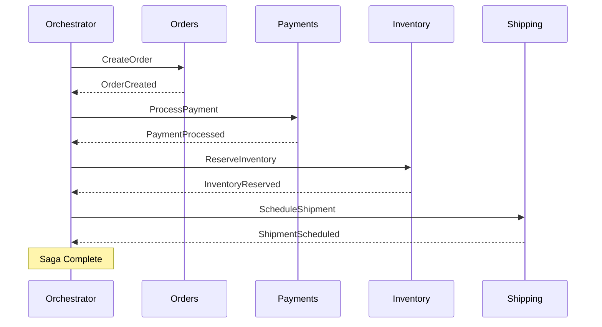
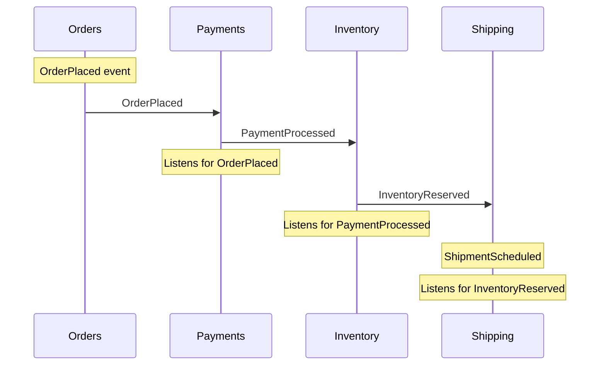

# Orchestration vs Choreography

:::info Event-driven pattern
This page covers the **event-driven** saga pattern using `SagaBase<T>`, where the saga suspends between events and can span independently deployed microservices. If you are coordinating services within a single process (modular monolith, API gateway), the simpler **[step-based pattern](building-your-first-saga.md)** using `ISagaDefinition` + `ISagaStep` may be a better fit.
:::

Sagas can be implemented using two fundamentally different coordination approaches: **orchestration** and **choreography**. This guide compares both patterns with practical code examples to help you choose the right approach for your use case.

## Before You Start

- **.NET 8.0+** (or .NET 9/10 for latest features)
- Install the required packages:
  ```bash
  dotnet add package Excalibur.Saga
  dotnet add package Excalibur.Saga.SqlServer  # for persistence
  ```
- Familiarity with [saga concepts](./index.md) and [building your first saga](./building-your-first-saga.md)

## Quick Comparison

| Aspect | Orchestration | Choreography |
|--------|---------------|--------------|
| **Coordination** | Central orchestrator | Decentralized, event-driven |
| **Coupling** | Services coupled to orchestrator | Services coupled to events |
| **Visibility** | Single point of control | Distributed logic |
| **Debugging** | Easier (single coordinator) | Harder (trace through events) |
| **Scalability** | Orchestrator is bottleneck | Each service scales independently |
| **Failure handling** | Orchestrator handles compensation | Each service handles its own |
| **Best for** | Complex workflows, branching | Simple, linear workflows |

## Orchestration Pattern

In orchestration, a central **saga orchestrator** coordinates the entire workflow. It sends commands to participating services and waits for responses before proceeding to the next step.



### Orchestration Code Example

**Define the orchestrator:**

```csharp
public class OrderFulfillmentOrchestrator : SagaBase<OrderFulfillmentState>
{
    public OrderFulfillmentOrchestrator(
        OrderFulfillmentState state,
        IDispatcher dispatcher,
        ILogger<OrderFulfillmentOrchestrator> logger)
        : base(state, dispatcher, logger)
    {
    }

    // Determine which events this saga handles
    public override bool HandlesEvent(object eventMessage)
    {
        return eventMessage switch
        {
            StartOrderFulfillment => true,
            OrderCreated e => e.OrderId == State.OrderId,
            PaymentProcessed e => e.OrderId == State.OrderId,
            PaymentFailed e => e.OrderId == State.OrderId,
            InventoryReserved e => e.OrderId == State.OrderId,
            InventoryReservationFailed e => e.OrderId == State.OrderId,
            ShipmentScheduled e => e.OrderId == State.OrderId,
            _ => false
        };
    }

    // Route events to appropriate handlers
    public override async Task HandleAsync(object eventMessage, CancellationToken ct)
    {
        switch (eventMessage)
        {
            case StartOrderFulfillment cmd:
                await OnStart(cmd, ct);
                break;
            case OrderCreated evt:
                await OnOrderCreated(evt, ct);
                break;
            case PaymentProcessed evt:
                await OnPaymentProcessed(evt, ct);
                break;
            case PaymentFailed evt:
                await OnPaymentFailed(evt, ct);
                break;
            case InventoryReserved evt:
                await OnInventoryReserved(evt, ct);
                break;
            case InventoryReservationFailed evt:
                await OnInventoryReservationFailed(evt, ct);
                break;
            case ShipmentScheduled evt:
                await OnShipmentScheduled(evt, ct);
                break;
        }
    }

    private async Task OnStart(StartOrderFulfillment cmd, CancellationToken ct)
    {
        State.OrderId = cmd.OrderId;
        State.CustomerId = cmd.CustomerId;
        State.Amount = cmd.Amount;
        State.Status = SagaStatus.Running;

        // Step 1: Create the order
        await SendCommandAsync(
            new CreateOrderCommand(cmd.OrderId, cmd.CustomerId, cmd.Items),
            ct);
    }

    private async Task OnOrderCreated(OrderCreated evt, CancellationToken ct)
    {
        State.OrderCreated = true;
        State.Status = SagaStatus.Running;

        // Step 2: Process payment
        await SendCommandAsync(
            new ProcessPaymentCommand(State.OrderId, State.Amount),
            ct);
    }

    private async Task OnPaymentProcessed(PaymentProcessed evt, CancellationToken ct)
    {
        State.PaymentId = evt.PaymentId;
        State.PaymentProcessed = true;
        State.Status = SagaStatus.Running;

        // Step 3: Reserve inventory
        await SendCommandAsync(
            new ReserveInventoryCommand(State.OrderId, State.Items),
            ct);
    }

    private async Task OnPaymentFailed(PaymentFailed evt, CancellationToken ct)
    {
        State.Status = SagaStatus.Failed;
        State.FailureReason = evt.Reason;

        // Compensate: Cancel the order
        await SendCommandAsync(new CancelOrderCommand(State.OrderId), ct);

        MarkCompleted();
    }

    private async Task OnInventoryReserved(InventoryReserved evt, CancellationToken ct)
    {
        State.InventoryReserved = true;
        State.Status = SagaStatus.Running;

        // Step 4: Schedule shipment
        await SendCommandAsync(
            new ScheduleShipmentCommand(State.OrderId, State.ShippingAddress),
            ct);
    }

    private async Task OnInventoryReservationFailed(
        InventoryReservationFailed evt,
        CancellationToken ct)
    {
        State.Status = SagaStatus.Failed;
        State.FailureReason = evt.Reason;

        // Compensate: Refund payment, then cancel order
        await SendCommandAsync(new RefundPaymentCommand(State.PaymentId), ct);
        await SendCommandAsync(new CancelOrderCommand(State.OrderId), ct);

        MarkCompleted();
    }

    private Task OnShipmentScheduled(ShipmentScheduled evt, CancellationToken ct)
    {
        State.ShipmentId = evt.ShipmentId;
        State.Status = SagaStatus.Completed;
        MarkCompleted();
        return Task.CompletedTask;
    }
}
```

**Register the orchestrator:**

```csharp
// Option 1: Via Excalibur builder (recommended)
services.AddExcalibur(builder =>
{
    builder.AddSagas(options =>
    {
        options.MaxConcurrency = 10;
        options.DefaultTimeout = TimeSpan.FromMinutes(30);
    });
});

// Option 2: Direct registration
services.AddExcaliburSaga(options =>
{
    options.MaxConcurrency = 10;
    options.DefaultTimeout = TimeSpan.FromMinutes(30);
});

// Add SQL Server persistence
services.AddSqlServerSagaStore(connectionString);

// Register the saga type
services.AddScoped<OrderFulfillmentOrchestrator>();
```

### Orchestration Advantages

- **Centralized logic**: All workflow logic in one place
- **Easy to understand**: Clear sequence of steps
- **Simple compensation**: Orchestrator knows what to roll back
- **Good debugging**: Single point to trace execution
- **Supports complex workflows**: Branching, parallelism, conditional logic

### Orchestration Disadvantages

- **Single point of failure**: Orchestrator must be highly available
- **Bottleneck risk**: High-volume scenarios may overload orchestrator
- **Tight coupling**: Services depend on orchestrator commands
- **Requires persistence**: Orchestrator state must survive restarts

---

## Choreography Pattern

In choreography, there is no central coordinator. Each service listens for events and reacts by performing its work and publishing new events. The workflow emerges from the chain of events.



### Choreography Code Example

**Payment Service (reacts to OrderPlaced):**

```csharp
public class PaymentService : IEventHandler<OrderPlaced>
{
    private readonly IPaymentGateway _gateway;
    private readonly IMessagePublisher _publisher;

    public PaymentService(IPaymentGateway gateway, IMessagePublisher publisher)
    {
        _gateway = gateway;
        _publisher = publisher;
    }

    public async Task HandleAsync(OrderPlaced evt, CancellationToken ct)
    {
        try
        {
            var paymentId = await _gateway.ChargeAsync(
                evt.CustomerId,
                evt.Amount,
                ct);

            await _publisher.PublishAsync(new PaymentProcessed
            {
                OrderId = evt.OrderId,
                PaymentId = paymentId,
                Amount = evt.Amount
            }, ct);
        }
        catch (PaymentException ex)
        {
            await _publisher.PublishAsync(new PaymentFailed
            {
                OrderId = evt.OrderId,
                Reason = ex.Message
            }, ct);
        }
    }
}
```

**Inventory Service (reacts to PaymentProcessed):**

```csharp
public class InventoryService : IEventHandler<PaymentProcessed>
{
    private readonly IInventoryRepository _inventory;
    private readonly IMessagePublisher _publisher;

    public InventoryService(IInventoryRepository inventory, IMessagePublisher publisher)
    {
        _inventory = inventory;
        _publisher = publisher;
    }

    public async Task HandleAsync(PaymentProcessed evt, CancellationToken ct)
    {
        try
        {
            var reservation = await _inventory.ReserveAsync(
                evt.OrderId,
                ct);

            await _publisher.PublishAsync(new InventoryReserved
            {
                OrderId = evt.OrderId,
                ReservationId = reservation.Id
            }, ct);
        }
        catch (InsufficientInventoryException ex)
        {
            // Publish failure event - triggers compensation
            await _publisher.PublishAsync(new InventoryReservationFailed
            {
                OrderId = evt.OrderId,
                PaymentId = evt.PaymentId,
                Reason = ex.Message
            }, ct);
        }
    }
}
```

**Payment Service (compensation - reacts to InventoryReservationFailed):**

```csharp
public class PaymentCompensationHandler : IEventHandler<InventoryReservationFailed>
{
    private readonly IPaymentGateway _gateway;
    private readonly IMessagePublisher _publisher;

    public PaymentCompensationHandler(IPaymentGateway gateway, IMessagePublisher publisher)
    {
        _gateway = gateway;
        _publisher = publisher;
    }

    public async Task HandleAsync(InventoryReservationFailed evt, CancellationToken ct)
    {
        // Compensate by refunding the payment
        await _gateway.RefundAsync(evt.PaymentId, ct);

        await _publisher.PublishAsync(new PaymentRefunded
        {
            OrderId = evt.OrderId,
            PaymentId = evt.PaymentId
        }, ct);
    }
}
```

**Shipping Service (reacts to InventoryReserved):**

```csharp
public class ShippingService : IEventHandler<InventoryReserved>
{
    private readonly IShippingProvider _shipping;
    private readonly IMessagePublisher _publisher;

    public ShippingService(IShippingProvider shipping, IMessagePublisher publisher)
    {
        _shipping = shipping;
        _publisher = publisher;
    }

    public async Task HandleAsync(InventoryReserved evt, CancellationToken ct)
    {
        var shipment = await _shipping.ScheduleAsync(
            evt.OrderId,
            evt.ShippingAddress,
            ct);

        await _publisher.PublishAsync(new ShipmentScheduled
        {
            OrderId = evt.OrderId,
            ShipmentId = shipment.Id,
            EstimatedDelivery = shipment.EstimatedDelivery
        }, ct);
    }
}
```

### Choreography Advantages

- **Loose coupling**: Services only depend on events
- **High scalability**: Each service scales independently
- **No single point of failure**: No central coordinator
- **Simple services**: Each service handles one concern

### Choreography Disadvantages

- **Hard to trace**: Workflow spans multiple services
- **Complex compensation**: Each service must know how to compensate
- **Event storms**: Failures can cascade unpredictably
- **Eventual consistency**: Harder to reason about overall state

---

## Choosing the Right Pattern

### Use Orchestration When:

- **Complex business logic**: Workflows with branching, conditions, or parallel steps
- **Strong consistency requirements**: Need to know exact saga state at any time
- **Centralized monitoring**: Want single dashboard for all workflows
- **Clear compensation paths**: Orchestrator can coordinate rollback
- **Long-running processes**: Workflows that span hours or days

```csharp
// Example: Complex order fulfillment with fraud check and multiple shipping options
public class ComplexOrderSaga : SagaBase<ComplexOrderState>
{
    public ComplexOrderSaga(
        ComplexOrderState state,
        IDispatcher dispatcher,
        ILogger<ComplexOrderSaga> logger)
        : base(state, dispatcher, logger) { }

    public override bool HandlesEvent(object eventMessage) =>
        eventMessage is StartOrder or FraudCheckResult or InventoryVerified;

    public override async Task HandleAsync(object eventMessage, CancellationToken ct)
    {
        switch (eventMessage)
        {
            case StartOrder cmd:
                // Parallel: Check fraud AND verify inventory
                await Task.WhenAll(
                    SendCommandAsync(new CheckFraudCommand(cmd.OrderId), ct),
                    SendCommandAsync(new VerifyInventoryCommand(cmd.Items), ct));
                break;

            case FraudCheckResult result:
                // Conditional: Route based on fraud risk
                if (result.RiskScore > 0.8)
                    await SendCommandAsync(new RequireManualReview(State.OrderId), ct);
                else
                    await SendCommandAsync(new ProcessPayment(State.OrderId), ct);
                break;
        }
    }
}
```

### Use Choreography When:

- **Simple, linear workflows**: Each step leads directly to the next
- **Independent services**: Teams own services end-to-end
- **High throughput**: Need maximum scalability
- **Event-driven architecture**: Already using event streaming (Kafka, etc.)
- **Microservices independence**: Want to minimize cross-service dependencies

```csharp
// Example: Simple notification workflow
public class NotificationHandler : IEventHandler<OrderShipped>
{
    private readonly IEmailService _emailService;
    private readonly IMessagePublisher _publisher;

    public NotificationHandler(IEmailService emailService, IMessagePublisher publisher)
    {
        _emailService = emailService;
        _publisher = publisher;
    }

    public async Task HandleAsync(OrderShipped evt, CancellationToken ct)
    {
        // Simple reaction - no complex logic
        await _emailService.SendShippingConfirmationAsync(
            evt.CustomerId,
            evt.TrackingNumber,
            ct);

        await _publisher.PublishAsync(new CustomerNotified
        {
            OrderId = evt.OrderId,
            NotificationType = "ShippingConfirmation"
        }, ct);
    }
}
```

---

## Hybrid Approach

In practice, many systems use both patterns. Use orchestration for complex, business-critical workflows and choreography for simpler, independent processes.

```csharp
// Orchestrator handles core workflow
public class OrderOrchestrator : SagaBase<OrderState>
{
    public OrderOrchestrator(OrderState state, IDispatcher dispatcher, ILogger<OrderOrchestrator> logger)
        : base(state, dispatcher, logger) { }

    // Core order fulfillment (orchestrated) - Payment, Inventory, Shipping
    public override bool HandlesEvent(object eventMessage) => /* ... */;
    public override Task HandleAsync(object eventMessage, CancellationToken ct) => /* ... */;
}

// Notifications use choreography
public class NotificationHandler : IEventHandler<OrderCompleted>
{
    // React to completion event (choreographed)
    public Task HandleAsync(OrderCompleted evt, CancellationToken ct)
    {
        // Send email, SMS, push notifications
        return Task.CompletedTask;
    }
}

// Analytics use choreography
public class AnalyticsHandler : IEventHandler<OrderCompleted>
{
    // React independently (choreographed)
    public Task HandleAsync(OrderCompleted evt, CancellationToken ct)
    {
        // Update dashboards, reports
        return Task.CompletedTask;
    }
}
```

## Summary

| Question | Orchestration | Choreography |
|----------|---------------|--------------|
| Who controls the workflow? | Central orchestrator | Events drive services |
| Where is the workflow logic? | Single orchestrator class | Distributed across handlers |
| How are failures handled? | Orchestrator coordinates compensation | Each service compensates itself |
| What's the coupling model? | Services coupled to commands | Services coupled to events |
| How do you debug issues? | Trace single orchestrator | Trace event chain across services |

## Related Documentation

- [Saga Overview](./) - Introduction to sagas
- [Event Sourcing](/docs/event-sourcing/) - Event-driven state management
- [Domain Modeling](/docs/domain-modeling/) - Aggregate design

## See Also

- [Building Your First Saga](./building-your-first-saga.md) — Step-by-step guide to creating a saga with the simpler step-based API
- [Sagas & Workflows Overview](./index.md) — Introduction to saga concepts, packages, and quick start examples
- [Outbox Pattern](../patterns/outbox.md) — Reliable message publishing to ensure events reach other services

