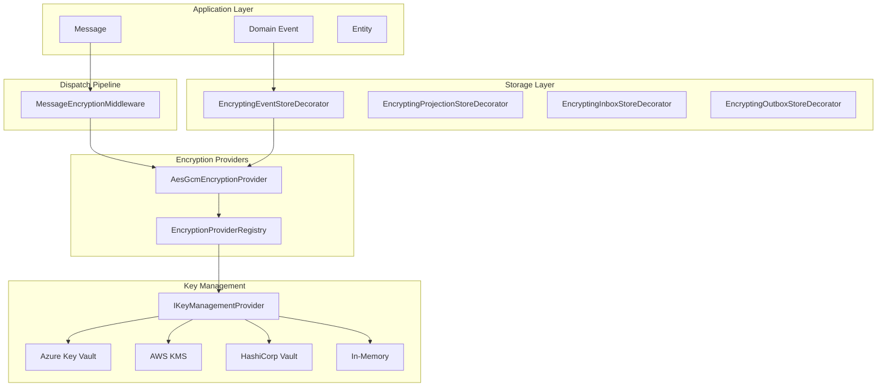
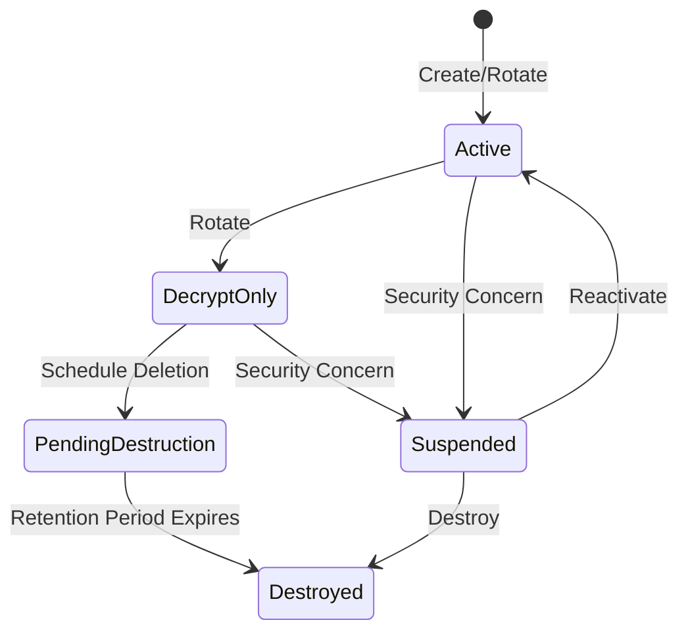
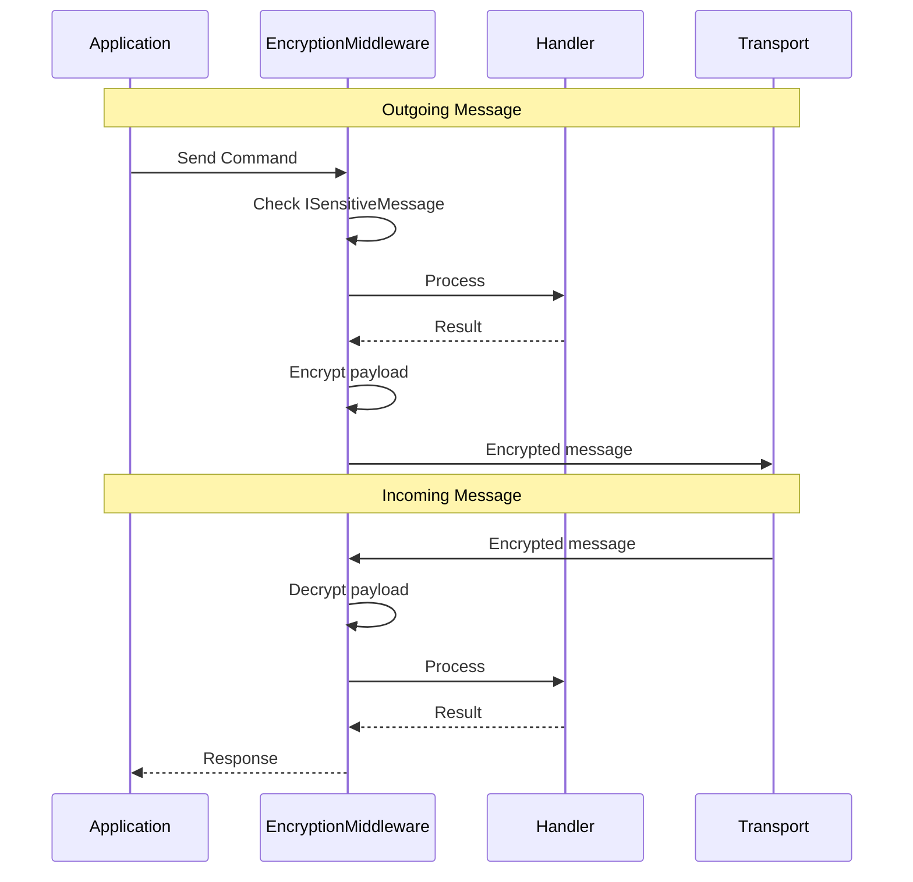

---
sidebar_position: 2
title: Encryption Architecture
description: Comprehensive data protection and encryption patterns for Dispatch and Excalibur
---

# Encryption Architecture

Dispatch and Excalibur provide comprehensive encryption capabilities for data at rest and in transit, supporting enterprise compliance requirements including FedRAMP, GDPR, SOC 2, and HIPAA.

## Before You Start

- **.NET 8.0+** (or .NET 9/10 for latest features)
- Install the required packages:
  ```bash
  dotnet add package Excalibur.Dispatch.Security
  dotnet add package Excalibur.Dispatch.Compliance.Abstractions
  ```
- Familiarity with [middleware concepts](../middleware/index.md) and [encryption providers](./encryption-providers.md)

## Overview

The encryption architecture is built on three core components:

| Component | Purpose | Package |
|-----------|---------|---------|
| `IEncryptionProvider` | Field-level encryption/decryption | `Excalibur.Dispatch.Compliance.Abstractions` |
| `IKeyManagementProvider` | Key lifecycle and rotation | `Excalibur.Dispatch.Compliance.Abstractions` |
| `MessageEncryptionMiddleware` | Pipeline message encryption | `Excalibur.Dispatch.Security` |



## AES-256-GCM Encryption

The default encryption provider uses AES-256-GCM, providing authenticated encryption with associated data (AEAD).

### Technical Specifications

| Parameter | Value | Description |
|-----------|-------|-------------|
| Algorithm | AES-256-GCM | NIST-approved, FIPS 140-2 compatible |
| Key Size | 256 bits (32 bytes) | Maximum AES key strength |
| Nonce Size | 96 bits (12 bytes) | GCM standard, randomly generated |
| Auth Tag | 128 bits (16 bytes) | Maximum authentication tag size |

### Basic Usage

```csharp
using Excalibur.Dispatch.Compliance;

// Inject IEncryptionProvider
public class MyService
{
    private readonly IEncryptionProvider _encryption;

    public MyService(IEncryptionProvider encryption)
    {
        _encryption = encryption;
    }

    public async Task<EncryptedData> EncryptSensitiveDataAsync(
        byte[] plaintext,
        CancellationToken ct)
    {
        var context = new EncryptionContext
        {
            TenantId = "tenant-123",
            Purpose = "pii-field"
        };

        return await _encryption.EncryptAsync(plaintext, context, ct);
    }

    public async Task<byte[]> DecryptSensitiveDataAsync(
        EncryptedData encrypted,
        CancellationToken ct)
    {
        var context = new EncryptionContext
        {
            TenantId = "tenant-123"
        };

        return await _encryption.DecryptAsync(encrypted, context, ct);
    }
}
```

### Encryption Context

The `EncryptionContext` provides tenant isolation, key selection, and associated authenticated data (AAD):

```csharp
var context = new EncryptionContext
{
    // Key selection
    KeyId = "my-encryption-key",      // Specific key (optional)
    KeyVersion = 3,                    // Specific version (optional)

    // Multi-tenant isolation
    TenantId = "tenant-123",           // Binds ciphertext to tenant

    // Operational metadata
    Purpose = "pii-field",             // For audit and key selection
    Classification = DataClassification.Confidential,

    // Additional authenticated data
    AssociatedData = Encoding.UTF8.GetBytes("order-123"),

    // Compliance
    RequireFipsCompliance = true       // Enforce FIPS mode
};
```

:::tip Multi-Tenant Security
When `TenantId` is provided, it's included in the AAD (Associated Authenticated Data). This cryptographically binds the ciphertext to the tenant - attempting to decrypt with a different tenant ID will fail authentication, even with the correct key.
:::

## Key Management

### Key Lifecycle

Keys follow a defined lifecycle:



| Status | Encrypt | Decrypt | Description |
|--------|---------|---------|-------------|
| `Active` | ✅ | ✅ | Current key for new encryption |
| `DecryptOnly` | ❌ | ✅ | Rotated out, can still decrypt old data |
| `PendingDestruction` | ❌ | ❌ | Awaiting deletion, no operations |
| `Destroyed` | ❌ | ❌ | Permanently deleted |
| `Suspended` | ❌ | ❌ | Frozen due to security concern |

### IKeyManagementProvider Interface

```csharp
public interface IKeyManagementProvider
{
    // Key retrieval
    Task<KeyMetadata?> GetKeyAsync(string keyId, CancellationToken ct);
    Task<KeyMetadata?> GetKeyVersionAsync(string keyId, int version, CancellationToken ct);
    Task<KeyMetadata?> GetActiveKeyAsync(string? purpose, CancellationToken ct);
    Task<IReadOnlyList<KeyMetadata>> ListKeysAsync(KeyStatus? status, string? purpose, CancellationToken ct);

    // Key lifecycle
    Task<KeyRotationResult> RotateKeyAsync(string keyId, EncryptionAlgorithm algorithm,
        string? purpose, DateTimeOffset? expiresAt, CancellationToken ct);
    Task<bool> SuspendKeyAsync(string keyId, string reason, CancellationToken ct);
    Task<bool> DeleteKeyAsync(string keyId, int retentionDays, CancellationToken ct);
}
```

## Key Management Providers

### In-Memory (Development Only)

```csharp
using Excalibur.Dispatch.Compliance;

// Development/testing only — keys are stored in memory
builder.Services.AddDevEncryption();
// Or: builder.Services.AddEncryption(e => e.UseInMemoryKeyManagement("dev"));
```

:::warning Development Only
`InMemoryKeyManagementProvider` stores keys in memory. Keys are lost on restart. **Never use in production.**
:::

### Azure Key Vault

```csharp
using Excalibur.Dispatch.Compliance.Azure;

builder.Services.AddAzureKeyVaultKeyManagement(options =>
{
    options.VaultUri = new Uri("https://my-vault.vault.azure.net/");

    // Option 1: Managed Identity (recommended)
    options.UseManagedIdentity = true;

    // Option 2: Service Principal
    options.TenantId = configuration["Azure:TenantId"];
    options.ClientId = configuration["Azure:ClientId"];
    options.ClientSecret = configuration["Azure:ClientSecret"];

    // Key settings
    options.KeyName = "dispatch-encryption-key";
    options.KeyRotationDays = 90;
});
```

### AWS KMS

```csharp
using Excalibur.Dispatch.Compliance.Aws;

builder.Services.AddAwsKmsKeyManagement(options =>
{
    options.Region = "us-east-1";
    options.KeyId = "arn:aws:kms:us-east-1:123456789:key/12345678-...";

    // Optional: Custom endpoint for LocalStack testing
    options.ServiceUrl = configuration["AWS:ServiceUrl"];

    // Key alias for rotation
    options.KeyAlias = "alias/dispatch-encryption";
});
```

### HashiCorp Vault

```csharp
using Excalibur.Dispatch.Compliance.Vault;

builder.Services.AddVaultKeyManagement(options =>
{
    options.Address = "https://vault.example.com:8200";

    // Authentication
    options.Token = configuration["Vault:Token"];
    // Or AppRole
    options.RoleId = configuration["Vault:RoleId"];
    options.SecretId = configuration["Vault:SecretId"];

    // Transit engine path
    options.TransitMountPath = "transit";
    options.KeyName = "dispatch-encryption";
});
```

## Message-Level Encryption

### MessageEncryptionMiddleware

The middleware provides transparent encryption/decryption in the dispatch pipeline:

```csharp
using Excalibur.Dispatch.Security;

builder.Services.AddDispatch()
    .AddMessageEncryption(options =>
    {
        options.Enabled = true;
        options.EncryptByDefault = false;  // Only encrypt marked messages
        options.DefaultAlgorithm = EncryptionAlgorithm.Aes256Gcm;
        options.ExcludedMessageTypes = new HashSet<string> { "HealthCheckQuery" };
    });
```

### ISensitiveMessage Marker

Mark messages containing sensitive data for automatic encryption:

```csharp
using Excalibur.Dispatch.Security;

// Messages implementing ISensitiveMessage are automatically encrypted
public class CreatePatientAction : IDispatchAction, ISensitiveMessage
{
    public string FirstName { get; set; }
    public string LastName { get; set; }
    public string SSN { get; set; }  // Sensitive!
}

// Regular messages are not encrypted by default
public class GetOrderAction : IDispatchAction<Order>
{
    public Guid OrderId { get; set; }
}
```

### Pipeline Behavior



## Field-Level Encryption

### [PersonalData] Attribute

Mark fields for automatic encryption at rest:

```csharp
using Excalibur.Dispatch.Compliance;

public class Patient
{
    public Guid Id { get; set; }

    [PersonalData]  // Encrypted at rest
    public string FirstName { get; set; }

    [PersonalData]
    public string LastName { get; set; }

    [PersonalData]
    [Sensitive]  // Additional classification
    public string SSN { get; set; }

    public DateTime DateOfBirth { get; set; }  // NOT encrypted
}
```

### [EncryptedField] Attribute

For more control over field encryption:

```csharp
using Excalibur.Dispatch.Compliance;

public class PaymentInfo
{
    [EncryptedField(
        Purpose = "payment-data",
        Algorithm = EncryptionAlgorithm.Aes256Gcm)]
    public string CardNumber { get; set; }

    [EncryptedField(Purpose = "payment-data")]
    public string CVV { get; set; }
}
```

## Encrypting Store Decorators

Transparent encryption for persistence layers using the decorator pattern:

### Event Store Encryption

```csharp
using Excalibur.EventSourcing.Encryption.Decorators;

// Register the encrypting decorator
builder.Services.AddEventSourcing(options =>
{
    options.UseEncryption(encryption =>
    {
        encryption.Mode = EncryptionMode.EncryptAndDecrypt;
        encryption.DefaultPurpose = "event-data";
    });
});
```

### Encryption Modes

| Mode | Write Behavior | Read Behavior | Use Case |
|------|---------------|---------------|----------|
| `EncryptAndDecrypt` | Encrypt all | Decrypt all | Normal operation |
| `EncryptNewDecryptAll` | Encrypt new | Decrypt old & new | After migration |
| `DecryptOnlyWritePlaintext` | Write plaintext | Decrypt if encrypted | During migration |
| `DecryptOnlyReadOnly` | Reject writes | Decrypt only | Maintenance mode |
| `Disabled` | Pass through | Pass through | Testing/debugging |

### Available Decorators

| Decorator | Package | Purpose |
|-----------|---------|---------|
| `EncryptingEventStoreDecorator` | `Excalibur.EventSourcing` | Event store encryption |
| `EncryptingProjectionStoreDecorator` | `Excalibur.EventSourcing` | Projection encryption |
| `EncryptingInboxStoreDecorator` | `Excalibur.Dispatch.Compliance` | Inbox message encryption |
| `EncryptingOutboxStoreDecorator` | `Excalibur.Dispatch.Compliance` | Outbox message encryption |

### Mixed-Mode Migration

The decorators support seamless migration from plaintext to encrypted data:

```csharp
// Phase 1: Start encrypting new data, decrypt both old and new
builder.Services.AddEventSourcing(options =>
{
    options.UseEncryption(e => e.Mode = EncryptionMode.EncryptNewDecryptAll);
});

// Phase 2: Run background re-encryption job
// (See Key Rotation section below)

// Phase 3: All data encrypted, normal operation
builder.Services.AddEventSourcing(options =>
{
    options.UseEncryption(e => e.Mode = EncryptionMode.EncryptAndDecrypt);
});
```

## Key Rotation

### IReEncryptionService

Re-encrypt data when keys rotate:

```csharp
using Excalibur.Dispatch.Compliance;

public class KeyRotationJob : BackgroundService
{
    private readonly IReEncryptionService _reEncryption;
    private readonly IKeyManagementProvider _keyManagement;

    protected override async Task ExecuteAsync(CancellationToken ct)
    {
        // Rotate key
        var result = await _keyManagement.RotateKeyAsync(
            keyId: "my-key",
            algorithm: EncryptionAlgorithm.Aes256Gcm,
            purpose: "event-data",
            expiresAt: DateTimeOffset.UtcNow.AddDays(90),
            ct);

        // Re-encrypt existing data with new provider
        var options = new ReEncryptionOptions
        {
            SourceProviderId = "old-provider",
            TargetProviderId = "new-provider",
            BatchSize = 1000,
            ContinueOnError = true
        };

        var processed = 0;
        await foreach (var item in _reEncryption.ReEncryptBatchAsync(
            GetEntitiesAsync(), options, ct))
        {
            if (item.Success)
                processed += item.FieldsReEncrypted;
        }

        _logger.LogInformation("Re-encrypted {Count} fields", processed);
    }
}
```

### Lazy Re-Encryption

Configure lazy migration to automatically re-encrypt plaintext data on read/write:

```csharp
using Excalibur.Dispatch.Compliance;

builder.Services.Configure<EncryptionOptions>(options =>
{
    options.LazyMigrationEnabled = true;
    options.LazyMigrationMode = LazyMigrationMode.OnRead;
});
```

## FIPS 140-2 Compliance

### Validation

```csharp
// Check if running in FIPS mode
var provider = serviceProvider.GetRequiredService<IEncryptionProvider>();
var isFipsCompliant = await provider.ValidateFipsComplianceAsync(ct);

if (!isFipsCompliant)
{
    _logger.LogWarning("System is not running in FIPS 140-2 mode");
}
```

### Configuration

```csharp
builder.Services.AddEncryption(options =>
{
    options.RequireFipsComplianceByDefault = true;
});

// Per-operation enforcement
var context = new EncryptionContext
{
    RequireFipsCompliance = true  // Throws if not FIPS compliant
};
```

### Platform Requirements

| Platform | FIPS Mode |
|----------|-----------|
| Windows | Registry setting: `HKLM\SYSTEM\CurrentControlSet\Control\Lsa\FIPSAlgorithmPolicy` |
| Linux | `/proc/sys/crypto/fips_enabled = 1` |
| Azure | Azure FIPS-enabled VMs |
| AWS | AWS GovCloud, FIPS endpoints |

## Crypto-Shredding (GDPR)

For GDPR right-to-erasure compliance, delete the encryption key to render all data unrecoverable:

```csharp
// Crypto-shredding for GDPR compliance
public class GdprErasureHandler
{
    private readonly IKeyManagementProvider _keyManagement;

    public async Task ExecuteErasureAsync(string userId, CancellationToken ct)
    {
        // User's data was encrypted with a user-specific key
        var userKeyId = $"user-{userId}-pii";

        // Delete the key - all encrypted data becomes unrecoverable
        await _keyManagement.DeleteKeyAsync(
            keyId: userKeyId,
            retentionDays: 7,  // Grace period for recovery
            ct);
    }
}
```

## Compliance Mapping

| Feature | FedRAMP | GDPR | SOC 2 | HIPAA |
|---------|---------|------|-------|-------|
| AES-256-GCM | SC-28 | Art 32 | C2 | §164.312(a)(2)(iv) |
| Key rotation | SC-12 | Art 32 | C2 | §164.312(a)(2)(iv) |
| Tenant isolation | AC-4 | Art 25 | CC5 | §164.312(a)(1) |
| FIPS compliance | SC-13 | - | - | §164.312(a)(2)(iv) |
| Crypto-shredding | - | Art 17 | C3 | Disposal |
| Audit logging | AU-3 | Art 30 | CC4 | §164.312(b) |

## Best Practices

### Do

- Use tenant-specific encryption contexts for multi-tenant applications
- Rotate keys regularly (90 days recommended)
- Enable FIPS mode for government/healthcare workloads
- Use cloud KMS (Azure Key Vault, AWS KMS) in production
- Test key rotation and re-encryption procedures

### Don't

- Store encryption keys in code or configuration files
- Use `InMemoryKeyManagementProvider` in production
- Skip AAD (Associated Authenticated Data) for tenant-bound data
- Ignore `DecryptOnly` keys - they contain historical data
- Delete keys without a retention period

## Related Documentation

- [Compliance Quick Start](../compliance/quick-start.md) - Getting started with compliance features
- [Audit Logging](audit-logging.md) - Security audit trails
- [GDPR Compliance](../compliance/checklists/gdpr.md) - Data protection requirements
- [FedRAMP Compliance](../compliance/checklists/fedramp.md) - Federal security requirements

## See Also

- [Encryption Providers](./encryption-providers.md) — Detailed configuration for AES-GCM, Azure Key Vault, AWS KMS, and HashiCorp Vault providers
- [Authorization & Audit (A3)](./authorization.md) — Activity-based authorization and access control for encrypted resources
- [Data Masking](../compliance/data-masking.md) — Field-level data masking and PII redaction for compliance
