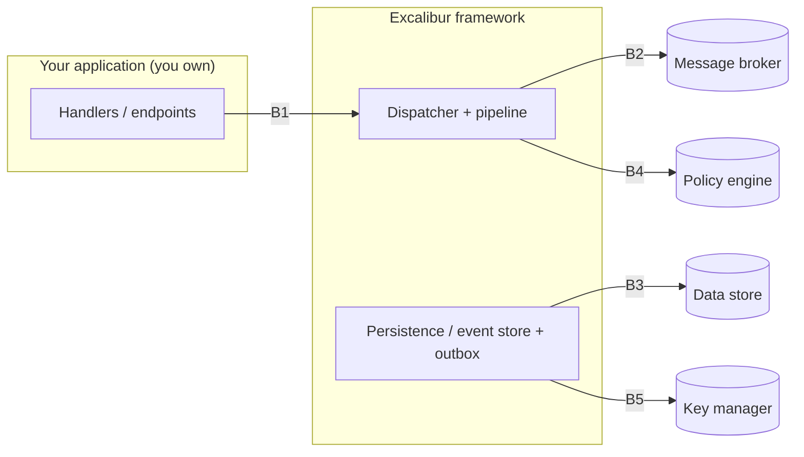

# Threat Model

A threat model is only useful if it is honest about three things: what it protects, where the boundaries are,
and what it does NOT do for you. This document is that, for the Excalibur framework. It is a baseline — your
application adds its own threats at its own boundaries — but it states, per trust boundary, the concrete
control the framework provides and the risk that remains yours.

## Method and scope

We use STRIDE (Spoofing, Tampering, Repudiation, Information disclosure, Denial of service, Elevation of
privilege) applied per trust boundary. Naming a threat without naming the boundary it crosses is how threat
models become theatre; we avoid that here.

In scope: the framework's own controls — message integrity, encryption, authorization, audit, delivery
guarantees, tenant isolation, and the internal boundary between messaging and persistence.

Out of scope (your responsibility): the security of your deployment — network posture, secret storage
configuration, broker and database hardening, OS/container patching, and your own business logic. The
framework gives you controls; wiring them to a secure deployment is the shared-responsibility half you own.
This document is explicit about which half is which.

## Assets we protect

1. Message and event payloads, including any personal data (PII) they carry.
2. Event-log integrity — the append-only history that event-sourced state is rebuilt from.
3. Authorization decisions — "may this subject do this?" must never fail to a permit.
4. Cryptographic keys — encryption keys, signing keys, per-subject shredding keys.
5. The audit trail — the tamper-evident record of who did what.
6. Tenant isolation — one tenant must never read or act on another's data.

## Trust boundaries

- B1 Application to framework (in-process)
- B2 Framework to message broker (network)
- B3 Framework to data store (network)
- B4 Framework to policy engine (network)
- B5 Framework to key manager (network)
- B6 Tenant to tenant (logical, within one instance)

## B2 — Framework to message broker

The broker is the most exposed boundary: messages leave your process and traverse infrastructure you may not
fully control.

| STRIDE | Threat | Control | Residual risk (yours) |
|---|---|---|---|
| Tampering | A message is altered in transit or at rest in the broker | Message signing — HMAC-SHA256 / HMAC-SHA512 (symmetric) or ECDSA P-256 / RSA (RSASSA-PKCS1-v1_5 and RSA-PSS, SHA-256) asymmetric; a signing middleware signs on send and verifies on receive with a constant-time comparison, and a tampered payload fails verification and is rejected. | Protect the signing key (B5) and enable signing — it is opt-in. |
| Information disclosure | A payload (or its PII) is read by a broker operator or network observer | Payload encryption — AES-256-GCM envelope encryption via a key manager; decryption requires the key version, not just broker access. | Enable encryption for sensitive payloads; transport TLS is your deployment's job. |
| Spoofing | A forged message claims to be from a trusted sender | Asymmetric signing (ECDSA P-256) gives non-repudiation: only the private-key holder can produce a valid signature. | Key distribution and rotation of asymmetric keys is your operational responsibility. |
| Repudiation | A sender denies having sent a message | Signature plus audit trail record the signed origin. | — |
| Denial of service | Retry storms, poison messages, or queue lag exhaust the system | Outbox with retry caps, exponential backoff, a circuit breaker (a transient short-circuit does not consume attempts), and dead-letter routing for exhausted messages; a missing dead-letter capability fails startup rather than silently dropping. | Broker capacity, autoscaling, and rate limits are your deployment's job. |

## B3 — Framework to data store (event log, outbox, snapshots)

| STRIDE | Threat | Control | Residual risk (yours) |
|---|---|---|---|
| Tampering | The event log is edited, corrupting rebuilt state | Append-only semantics; optimistic concurrency on append (version conflicts rejected); rehydration fails loud on a version hole or unresolvable event rather than returning a silently-corrupt aggregate. | Database access control and at-rest encryption are your deployment's job. |
| Information disclosure | PII in stored events is exposed | Field-level encryption of personal-data fields under per-subject keys; crypto-shredding makes the fields encrypted under an erased subject's key permanently unrecoverable while the aggregate still loads. Inbox/outbox payloads are encrypted under a shared context, not per subject, so key destruction does not reach them. | Configure the personal-data annotations and key manager; classify your data; bound retention on inbox/outbox where erasure must cover messages in flight. |
| Injection | A crafted identifier reaches SQL as code | Parameterized queries throughout; where an identifier (schema/table) cannot be parameterized, it is validated against an allow-list at construction before use. | Custom stores you write must uphold the same discipline. |
| Denial of service | Unbounded growth of tracking state | Bounded, skip-when-full caches on hot in-memory maps; snapshotting bounds replay cost. | Storage capacity planning is yours. |

## B4 — Framework to policy engine (authorization)

| STRIDE | Threat | Control | Residual risk (yours) |
|---|---|---|---|
| Elevation of privilege | A fault causes a request to be permitted that should be denied | Fail-closed by default. The decision succeeds only on an explicit positive grant; a negative decision, a missing subject, or an unreachable policy engine all deny. Failing open is available but loud — it warns at startup and logs every permit it grants. | If you deliberately enable fail-open, that residual risk is yours, by design and on the record. |
| Tampering | Policy rules are altered | Policies live in the engine (Cedar / OPA) or as code-registered requirements; engine-side integrity is the engine's control. | Secure your policy store / engine deployment. |
| Repudiation | An actor denies an action they were authorized for | Audit logging records the authorization decision and the actor. | Ship audit events to durable, tamper-evident storage. |

## B5 — Framework to key manager

| STRIDE | Threat | Control | Residual risk (yours) |
|---|---|---|---|
| Information disclosure | Key material is exposed | Keys do not persist in the framework's process beyond use (transient plaintext is zeroed after use); envelope encryption via AWS KMS, Azure Key Vault, or HashiCorp Vault keeps the master key in the vault. Key material for shredding/escrow is generated with a CSPRNG, never Guid/Random. | Vault access policy, network path, and credential rotation are yours. |
| Tampering | A rotated-out key is used, or ciphertext is swapped | Key lifecycle (Active to DecryptOnly) and key versioning bind ciphertext to a key version; a wrong key fails authentication. | Run the re-encryption job on rotation; do not delete a key still needed to read old data (that is erasure, not maintenance). |
| Elevation via recovery | An insufficient set of escrow shares reconstructs a secret | Shamir secret sharing with an enforced M-of-N threshold — a sub-threshold set is rejected, not silently interpolated — and an integrity commitment verified in constant time; a tampered reconstruction fails rather than returning a wrong secret. | Distribute shares to independent custodians; the scheme is computationally (not information-theoretically) secure, so use it only for high-entropy secrets. |

## B6 — Tenant to tenant (multi-tenant isolation)

| STRIDE | Threat | Control | Residual risk (yours) |
|---|---|---|---|
| Information disclosure | One tenant decrypts another's data | TenantId is bound into the encryption AAD as a length-prefixed field — decrypting with a different tenant id fails authentication even with the correct key. Ambient tenant context flows through dispatch and scopes grants, options, and storage. | Resolve the tenant correctly at the edge; a mis-resolved tenant is your bug, upstream of the framework's control. |
| Elevation of privilege | Cross-tenant action via a leaked grant | Grants and authorization policies are tenant-scoped. | Same — correct tenant resolution is the precondition. |

## B1 — Application to framework (in-process)

This boundary is largely yours: your handlers run in your trust domain. The framework's contribution is
command/event separation (a real command type, so "do this" is distinct from "this happened"), the internal
messaging-to-persistence boundary (a structural separation that keeps concerns from bleeding), and
deterministic time via an injectable clock (so time-based logic is testable and not wall-clock-dependent).
Business-logic authorization inside a handler is your responsibility; the framework gives you the seam.

## Shared responsibility — the honest split

| The framework provides | You must provide |
|---|---|
| Signing, encryption, fail-closed authz, audit, delivery guarantees, tenant-bound crypto — as opt-in controls | Turning them on, and wiring them to a hardened deployment |
| CSPRNG key generation, envelope encryption, key-version binding | Vault/KMS access policy, key rotation cadence, secret storage config |
| Fail-closed defaults; the unsafe option made loud | The decision to ever choose the unsafe option — and owning that risk |
| Correct tenant binding once a tenant is known | Correct tenant resolution at the edge |
| Structural controls that make the unsafe state hard or impossible to express | Everything outside the process: network, TLS, broker/DB hardening, patching |

## Assumptions and non-goals

- Assumed trusted: the process the framework runs in, the developer's own handler code, and the key manager /
  policy engine as configured. A compromised host is out of scope — no library defends its own process against
  a root attacker.
- Not a substitute for a pen test. This baseline names the controls and their residual risk; it does not
  replace independent security testing of your application.
- Controls are opt-in. Most protections default to safe behaviour (fail-closed) but require enabling (signing,
  encryption). "Secure by default" here means the defaults don't betray you; it does not mean every control is
  on without configuration.

## Release posture

Security readiness is a release gate: dependency and vulnerability scanning, secret scanning on staged
content, and conformance tests run in CI, and a supply-chain manifest accompanies releases. Security-relevant
incidents produce a remediation task and a regression test; this threat model is revisited at each such event
and on each new trust boundary the framework grows.

## See also

- [Authorization & Audit](./authorization.md)
- [Encryption Architecture](./encryption-architecture.md)
- [Message Signing](./message-signing.md)
- [Audit Logging](./audit-logging.md)
