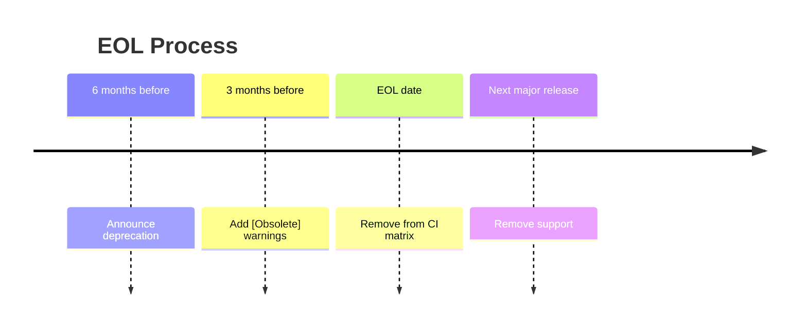

# Getting Support

This guide explains how to get help with Dispatch and Excalibur, our support policy, and what to expect.

## Quick Links

| Resource | Description |
|----------|-------------|
| [GitHub Discussions](https://github.com/TrigintaFaces/Excalibur/discussions) | Ask questions, share ideas |
| [GitHub Issues](https://github.com/TrigintaFaces/Excalibur/issues) | Report bugs, request features |
| [Security Advisories](https://github.com/TrigintaFaces/Excalibur/security) | Report vulnerabilities (private) |

:::note Community Project
This is an open-source project maintained by volunteers. Response times are best-effort and not guaranteed.
:::

---

## Supported Versions

| Framework | Status | Support Ends |
|-----------|--------|--------------|
| **.NET 10.0** | Current | .NET 11 + 6 months |
| **.NET 9.0** | Supported | May 2026 |
| **.NET 8.0 LTS** | Supported | November 2026 |
| .NET 7.0 | EOL | Not supported |
| .NET 6.0 | EOL | Not supported |

All packages multi-target .NET 8.0, .NET 9.0, and .NET 10.0.

---

## Provider Testing Coverage

Providers vary in how thoroughly they are tested and documented.

### Primary Providers

Fully tested in CI, documented, and actively maintained.

| Provider | Packages |
|----------|----------|
| **SQL Server** | EventSourcing, Data, LeaderElection, Saga |
| **Postgres** | EventSourcing, Data |
| **RabbitMQ** | Transport |
| **Azure Service Bus** | Transport |
| **Azure Cosmos DB** | EventSourcing, Data |

### Additional Providers

Functional with tests, but may lag behind primary providers in documentation or edge-case coverage.

| Provider | Packages |
|----------|----------|
| **Kafka** | Transport |
| **AWS SQS** | Transport |
| **Google Pub/Sub** | Transport |
| **MongoDB** | Data |
| **Redis** | Data, LeaderElection |
| **DynamoDB** | EventSourcing, Data |
| **Firestore** | EventSourcing, Data |

### In-Memory Providers

For testing only. Not recommended for production use.

---

## End-of-Life Policy

When a framework version reaches EOL:

| Timeline | Action |
|----------|--------|
| 6 months before EOL | Announce deprecation |
| 3 months before EOL | Add `[Obsolete]` warnings |
| EOL date | Remove from CI matrix |
| Next major release | Remove support completely |

---

## Breaking Changes

We follow [Semantic Versioning](https://semver.org/):

| Version | Breaking Changes? | Examples |
|---------|-------------------|----------|
| **Patch** (x.y.Z) | No | Bug fixes |
| **Minor** (x.Y.0) | No | New features, deprecations |
| **Major** (X.0.0) | Yes | API changes, removals |

### Deprecation Process

1. **Mark deprecated** with `[Obsolete]` in a minor release
2. **Document migration** in CHANGELOG.md
3. **Wait minimum 6 months** before removal
4. **Remove** in next major release

---

## Security Vulnerabilities

### Reporting

:::danger Private Disclosure Required
**DO NOT** create public issues for security vulnerabilities.
:::

Use [GitHub Security Advisories](https://github.com/TrigintaFaces/Excalibur/security/advisories/new) for private disclosure.

**Include in your report:**
- Affected versions
- Severity assessment
- Steps to reproduce
- Potential impact

### Response

Security reports are treated with high priority. Expect acknowledgment and triage as soon as practical.

---

## Compatibility Matrix

For detailed compatibility information, see the [Compatibility Matrix](https://github.com/TrigintaFaces/Excalibur/blob/main/docs/compatibility-matrix.md):

- .NET version support and EOL dates
- Provider package compatibility
- Cloud platform support (Azure, AWS, GCP)
- Native AOT and trimming status
- Provider SDK versions

---

## FAQ

### Which providers are production-ready?

**Primary providers** (SQL Server, Postgres, RabbitMQ, Azure Service Bus, Cosmos DB) are fully tested and recommended for production.

**Additional providers** are functional but may have less documentation or edge-case coverage.

### How do I report a bug?

Create a [GitHub Issue](https://github.com/TrigintaFaces/Excalibur/issues/new/choose) with:
- Framework version (.NET 8, 9, or 10)
- Provider (SQL Server, Kafka, etc.)
- Error message and stack trace
- Minimal reproduction steps

### When will feature X be added?

Check [GitHub Discussions](https://github.com/TrigintaFaces/Excalibur/discussions) for roadmap items. Feature requests are prioritized by community interest.

### How do I request a release?

See [RELEASE.md](https://github.com/TrigintaFaces/Excalibur/blob/main/RELEASE.md) for details on requesting releases.

### Is commercial support available?

No. This is a community-maintained open-source project with no commercial support tier.

For enterprise needs:
- Contribute fixes and features
- Sponsor development
- Build internal expertise

---

## See Also

- [Compatibility Matrix](https://github.com/TrigintaFaces/Excalibur/blob/main/docs/compatibility-matrix.md) - Framework and provider compatibility
- [Release Process](https://github.com/TrigintaFaces/Excalibur/blob/main/RELEASE.md) - How releases are made
- [Contributing Guide](https://github.com/TrigintaFaces/Excalibur/blob/main/CONTRIBUTING.md) - How to contribute
- [Dispatch vs Excalibur](./dispatch-vs-excalibur.md) - Package selection guide

---

