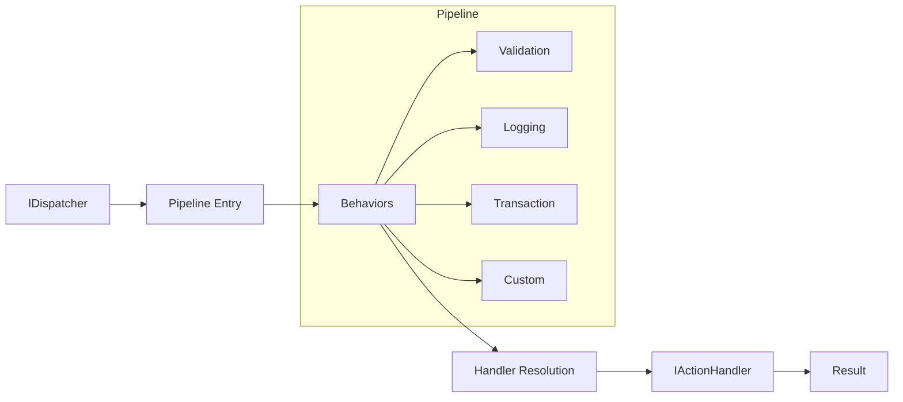
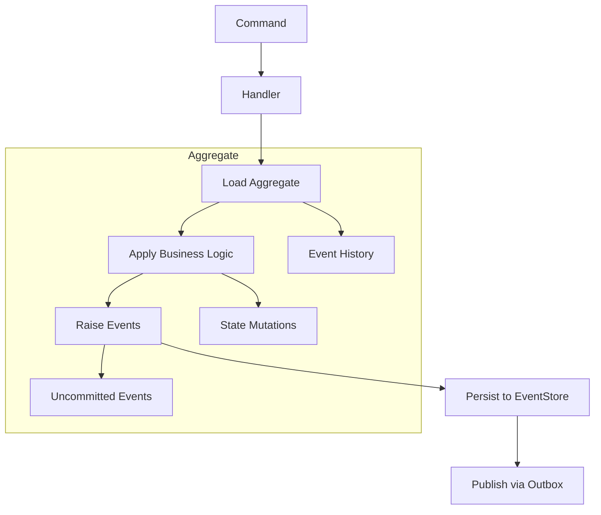
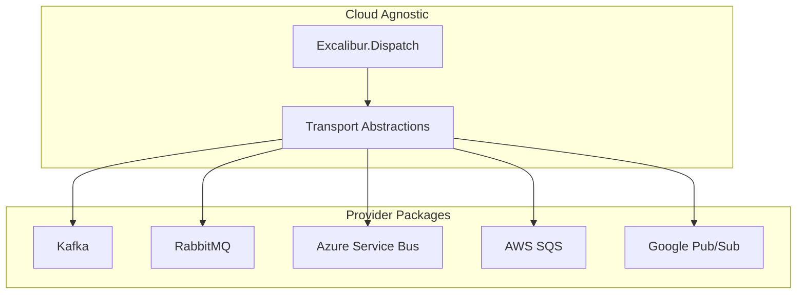

# Architecture Documentation

This section documents the architectural foundations of the Excalibur.Dispatch framework. Understanding these concepts is essential for all contributors.

---

## Contents

| Document | Description |
|----------|-------------|
| [Boundaries](boundaries.md) | High-level separation rules between Dispatch and Excalibur |
| [Boundary Rules](boundary-rules.md) | Enforced architecture rules and validation scripts |
| [Dispatch - Excalibur Boundary Guide](dispatch-excalibur-boundary.md) | Capability ownership, hosting guidance, migration path |
| [Capability Migration Map](capability-migration-map.md) | Canonical map of moved/consolidated capabilities |
| [Event ID Strategy](event-id-strategy.md) | Event ID allocation for LoggerMessage source generation |
| [Message Lifecycles](message-lifecycles.md) | End-to-end message flow diagrams |
| [Diagrams](diagrams/) | Visual architecture diagrams |
| [Namespace Consolidation Phase 1 Report](sprint-485-consolidation-report.md) | Namespace consolidation Phase 1 results |
| [Namespace Consolidation Phase 2 Report](sprint-486-consolidation-report.md) | Namespace consolidation Phase 2 results |
| [Saga Interface Assessment](sprint-486-saga-interface-assessment.md) | Dispatch/Excalibur saga boundary analysis |
| [Transport Parity Report](sprint-487-transport-parity-report.md) | Transport parity closeout & stabilization epic closure |

---

## Core Architectural Principles

### 1. Separation of Concerns

The framework is split into two distinct namespaces with clear responsibilities:

| Framework | Responsibility | Key Question |
|-----------|----------------|--------------|
| **Dispatch** | Message routing, pipelines, transports | "HOW do messages flow?" |
| **Excalibur** | Domain modeling, persistence, event sourcing | "WHAT gets stored?" |

### 2. Dependency Direction

Dependencies flow **one direction only**:

```
Excalibur -> Excalibur.Dispatch.Abstractions -> Dispatch
```

**Critical Rule**: Dispatch MUST NEVER reference Excalibur. This prevents circular dependencies and maintains framework modularity.

### 3. Pay-for-Play Providers

Core libraries are cloud-agnostic. Cloud SDKs exist only in provider packages:

```
Yes: Excalibur.Dispatch (no cloud SDKs)
Yes: Excalibur.Dispatch.Transport.AzureServiceBus (Azure SDK only)
Yes: Excalibur.Dispatch.Transport.AwsSqs (AWS SDK only)
No:  Excalibur.Dispatch with Azure.Messaging.ServiceBus (violates boundary)
```

### 4. Abstraction-First Design

- Excalibur projects reference `Dispatch.*.Abstractions` packages only
- Concrete implementations are wired via DI in hosting packages
- This enables testability and provider substitution

---

## Architecture Boundary Enforcement

All boundaries are **automatically enforced** via:

1. **NetArchTest** - Compile-time architecture tests
2. **PowerShell Validation** - `eng/validate-architecture-boundaries.ps1`
3. **CI Gates** - Build fails on violations

### Enforced Rules

| Rule | Description | Severity |
|------|-------------|----------|
| R1.9 | Dispatch MUST NOT reference Excalibur | Critical |
| R17.8 | Excalibur MAY reference Excalibur.Dispatch.Abstractions only | High |
| R23.1 | Core libraries MUST NOT reference cloud SDKs | High |
| R0.14 | Excalibur.Dispatch uses MemoryPack only for internal serialization | Critical |

See [Architecture Boundaries](boundaries.md) for detailed enforcement information.

---

## High-Level Architecture

### Dispatch Pipeline



### Event Sourcing Flow



### Multi-Transport Architecture



---

## Package Dependency Hierarchy

### Dispatch Stack

```
Layer 3: Hosting
+-- Excalibur.Dispatch.Hosting.AspNetCore
+-- Excalibur.Dispatch.Hosting.AzureFunctions
+-- Excalibur.Dispatch.Hosting.AwsLambda
+-- Excalibur.Dispatch.Hosting.GoogleCloudFunctions

Layer 2: Implementations
+-- Excalibur.Dispatch.Transport.Kafka
+-- Excalibur.Dispatch.Transport.RabbitMQ
+-- Excalibur.Dispatch.Serialization.MemoryPack
+-- Excalibur.Dispatch.Patterns

Layer 1: Abstractions
+-- Excalibur.Dispatch.Abstractions
+-- Excalibur.Dispatch.Transport.Abstractions
+-- Excalibur.Dispatch.Patterns.Abstractions

Layer 0: Core
+-- Dispatch
```

### Excalibur Stack

```
Layer 3: Provider Implementations
+-- Excalibur.EventSourcing.SqlServer
+-- Excalibur.EventSourcing.MongoDB
+-- Excalibur.Data.SqlServer
+-- Excalibur.LeaderElection.Redis

Layer 2: Pattern Implementations
+-- Excalibur.EventSourcing
+-- Excalibur.Saga
+-- Excalibur.Outbox

Layer 1: Abstractions
+-- Excalibur.Data.Abstractions
+-- Excalibur.Domain
+-- Excalibur.Dispatch.Abstractions (external)

Layer 0: Hosting
+-- Excalibur.Hosting
+-- Excalibur.Hosting.Web
```

---

## Key Design Decisions

| Area | Decision | Documentation |
|------|----------|---------------|
| Serialization | MemoryPack for internal, STJ for public | Internal Serialization documentation |
| Event Store | Unified `IEventStore` interface | EventStore Consolidation documentation |
| Namespaces | No `.Core.` segment, max 4 levels | Namespace Consolidation documentation |
| Encryption | Pluggable provider architecture | Pluggable Encryption documentation |
| Upcasting | BFS path-finding for version migration | BFS Version Migration documentation |
| Testing | Consolidated test infrastructure | Test Infrastructure Consolidation documentation |
| Type Locations | Canonical type placement guidance | [Canonical Type Locations](../../management/architecture/adr-099-canonical-type-locations.md) |

---

## See Also

- [Constitution](../../management/specs/CONSTITUTION.md) - Non-negotiable framework rules
- [Requirements Index](../../management/specs/Dispatch.Requirements.Index.md) - Complete requirements volumes
- [Architecture Decisions Index](../adrs/README.md) - All Architecture Decision Records


