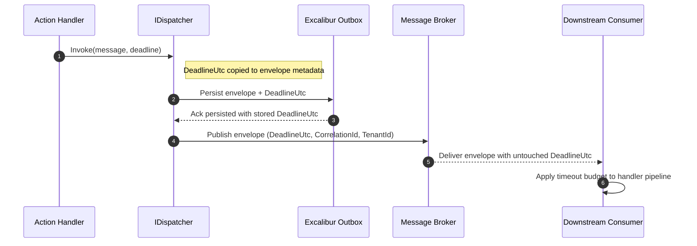
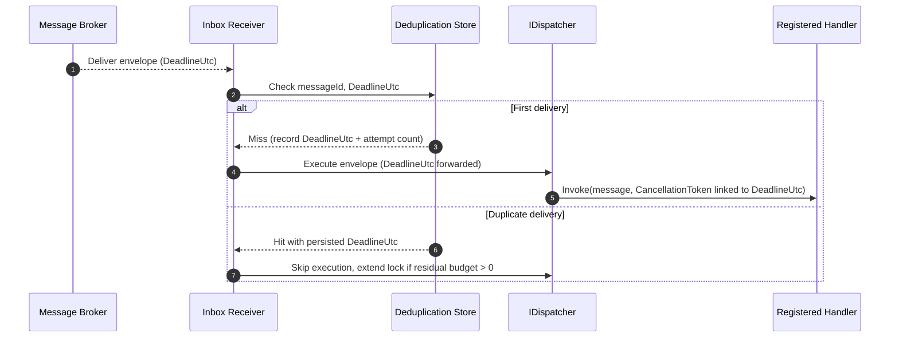
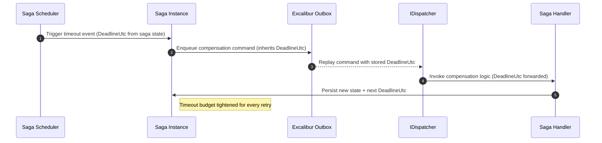

# Message Lifecycles, Reliability, and CloudEvents Guidance

The diagrams and runbooks on this page capture the canonical end-to-end flows that Dispatch and
Excalibur must satisfy. Each sequence explicitly tracks the `DeadlineUtc` timeout budget so that
middleware authors and transport adapters can verify propagation guarantees alongside standard
correlation identifiers.

```
Excalibur Hosting / Compliance  →  Excalibur.Domain / EventSourcing
                                        ↓
                                 Excalibur.Dispatch.Abstractions
                                        ↓
                                     Dispatch
```

See the [Dispatch ↔ Excalibur Boundary Guide](dispatch-excalibur-boundary.md) for the full capability map.

## Dispatch → Outbox → Broker



**Key guarantees**

- The dispatcher records the deadline alongside causation/correlation identifiers before any IO.
- The outbox includes the persisted `DeadlineUtc` in its durable record and does not rewrite it on
  replay.
- Transports copy timeout metadata to protocol-specific headers (`x-dispatch-deadline` for AMQP,
  `ce-deadlineutc` for CloudEvents) so consumers can enforce residual budget.

## Inbox Dedupe → Dispatcher



**Key guarantees**

- Deduplication records store the canonical timeout so redeliveries never expand the budget.
- The dispatcher links `CancellationToken` instances to the `DeadlineUtc` so middleware observes a
  consistent deadline.
- Inbox lock renewal honours the remaining budget; once the deadline expires the message flows to the
  poison queue with the original timeout metadata intact.

## Saga Transitions & Timeout Budget Propagation



**Key guarantees**

- Timeout budgets are part of the saga state machine and propagate to downstream commands.
- Compensation and replay flows cannot exceed the original deadline; remaining budget is recomputed
  after every state transition.
- Observability surfaces (metrics/logs) include the residual deadline to highlight budget erosion.

## Clustering and Failover

To satisfy **R1.6**, the runtime must function under multi-node deployments and tolerate node loss.

- **Dispatcher scale-out** – Each node hosts stateless dispatchers while relying on Excalibur inbox
  and outbox stores for coordination. Sticky sessions are avoided; work is rebalanced via broker
  consumer groups.
- **Outbox high availability** – Outbox persistence uses quorum writes (for example, Postgres with
  synchronous replication or Cosmos DB with strong consistency). Nodes retry idempotently using the
  stored record identifier when failovers occur.
- **Inbox lease recovery** – Inbox receivers acquire leases with short renew periods. When a node
  fails, competing consumers take over partitions after the renewal grace period and honour the
  persisted timeout budget.
- **Saga coordination** – Saga schedulers rely on a distributed lock (e.g., Postgres advisory lock,
  Redis Redlock) to ensure only one coordinator promotes timers after failover.

## Partitioning Strategies

Clustering introduces partition ownership and shard movement concerns.

- **Logical partitioning** – Messages are partitioned by `TenantId` or business key; the broker’s
  partition id is recorded in envelope diagnostics to support root cause analysis.
- **Hot partition mitigation** – Dispatchers emit metrics keyed by partition so runbooks can throttle
  or split hotspots. For Kafka-like transports, preferred replica elections are monitored to ensure
  consistent partition leadership.
- **Storage sharding** – Inbox/outbox stores expose partition-aware clients so that coordinator nodes
  can rebalance shards without violating idempotency guarantees.
- **Timeout-aware rebalancing** – When partitions move, inbox workers replay any in-flight messages
  using the previously stored `DeadlineUtc` to avoid inflating the SLA.

## CloudEvents Encoding Guidance

### Envelope ↔ Transport workflow

Dispatch’s CloudEvents bridge now composes an `ICloudEventEnvelopeConverter` with transport-specific
`ICloudEventMapper<T>` implementations so that envelope metadata is materialised once and reused by
every transport. The bridge caches mapper instances and transparently handles CloudEvent ↔ envelope
round-trips, including the special case where the transport already exposes `CloudEvent` as its
native payload.【F:src\Dispatch\Excalibur.Dispatch\CloudEvents\EnvelopeCloudEventBridge.cs†L17-L118】 The
transport integration packages expose `AddCloudEventsFor*` helpers that chain into the shared
`UseCloudEvents` registration. Those helpers configure the shared `CloudEventOptions`, register the
`IEnvelopeCloudEventBridge`, and add the mapper for the transport’s message type so the dispatching
middleware can ask for a bridge without knowing about the underlying broker.【F:src\Dispatch\Excalibur.Dispatch.Transport.AwsSqs\CloudEvents\AwsCloudEventsServiceCollectionExtensions.cs†L27-L86】【F:src\Dispatch\Excalibur.Dispatch\CloudEvents\CloudEventsServiceCollectionExtensions.cs†L30-L98】

> Note: There is no shared `UseCloudEvents` registration in Excalibur.Dispatch. The correct entry point
> for enabling CloudEvents middleware is `IDispatchBuilder.AddCloudEvents(...)` in
> `Excalibur.Dispatch`.
> The provider `AddCloudEventsFor*` helpers live in each transport package and only configure
> provider mappers and options; they do not register the middleware. The expected sequence is to
> call the builder extension first, then optionally call the provider helper.

### Option layering and attribute preservation

`CloudEventOptions` govern the global defaults—mode, spec version, dispatch extension prefix, schema
handling, and DoD envelope preservation rules—used by the envelope converter and every mapper
instance.【F:src\Dispatch\Excalibur.Dispatch\Options\CloudEvents\CloudEventOptions.cs†L18-L94】 Each provider adds
its own `*CloudEventOptions` type for transport-level concerns (for example, SQS FIFO hints, Service
Bus sessions, RabbitMQ persistence). The `AddCloudEventsFor*` helpers first allow callers to tweak
the shared `CloudEventOptions`, then layer the provider options before exposing the mapper. That
ordering ensures the dispatch prefix and preservation flags are applied before provider-specific
overrides such as FIFO deduplication IDs or Service Bus scheduled delivery, keeping the attribute
mapping consistent across transports.【F:src\Dispatch\Excalibur.Dispatch.Transport.AwsSqs\CloudEvents\AwsCloudEventsServiceCollectionExtensions.cs†L58-L105】【F:src\Dispatch\Excalibur.Dispatch.Transport.AzureServiceBus\CloudEvents\AzureCloudEventsServiceCollectionExtensions.cs†L72-L137】【F:src\Dispatch\Excalibur.Dispatch.Transport.RabbitMQ\CloudEvents\RabbitMqCloudEventsServiceCollectionExtensions.cs†L64-L110】

### Provider attribute matrix

| Provider              | Structured mode payload                                                                                                                                                                                                                                                                                                       | Binary mode payload                                                                                                                                                                                                                                                                                            | Binary attribute projection                                                                                                                                                                                                                                                                                                                                                |
| --------------------- | ----------------------------------------------------------------------------------------------------------------------------------------------------------------------------------------------------------------------------------------------------------------------------------------------------------------------------- | -------------------------------------------------------------------------------------------------------------------------------------------------------------------------------------------------------------------------------------------------------------------------------------------------------------- | -------------------------------------------------------------------------------------------------------------------------------------------------------------------------------------------------------------------------------------------------------------------------------------------------------------------------------------------------------------------------- |
| **AWS SQS**           | JSON CloudEvent body stored in `MessageBody`; `contentType` attribute marks structured mode.【F:src\Dispatch\Excalibur.Dispatch.Transport.AwsSqs\CloudEvents\AwsSqsCloudEventAdapter.cs†L59-L118】【F:src\Dispatch\Excalibur.Dispatch.Transport.AwsSqs\CloudEvents\AwsSqsCloudEventAdapter.cs†L126-L164】                                                                 | Data encoded into `MessageBody` with optional compression; transport attributes untouched.【F:src\Dispatch\Excalibur.Dispatch.Transport.AwsSqs\CloudEvents\AwsSqsCloudEventAdapter.cs†L150-L164】                                                                                                                                    | Core CE attributes mapped to SQS message attributes (`ce-type`, `ce-source`, etc.); Dispatch envelope properties emitted with the configurable `dispatch-` prefix.【F:src\Dispatch\Excalibur.Dispatch.Transport.AwsSqs\CloudEvents\AwsSqsCloudEventAdapter.cs†L166-L268】                                                                                                                        |
| **AWS SNS**           | Structured JSON assigned to `PublishRequest.Message`; `contentType` attribute signals structured mode.【F:src\Dispatch\Excalibur.Dispatch.Transport.AwsSqs\CloudEvents\AwsSnsCloudEventAdapter.cs†L51-L120】                                                                                                                                        | Binary mode publishes the raw data string while preserving the SNS `Subject`.【F:src\Dispatch\Excalibur.Dispatch.Transport.AwsSqs\CloudEvents\AwsSnsCloudEventAdapter.cs†L108-L167】                                                                                                                                                 | CE attributes and dispatch metadata flow through SNS message attributes; timeout remains in `ce-timeout`.【F:src\Dispatch\Excalibur.Dispatch.Transport.AwsSqs\CloudEvents\AwsSnsCloudEventAdapter.cs†L68-L106】【F:src\Dispatch\Excalibur.Dispatch.Transport.AwsSqs\CloudEvents\AwsSnsCloudEventAdapter.cs†L168-L224】                                                                                                 |
| **AWS EventBridge**   | Structured events delivered via the EventBridge entry `Detail` field with `DetailType`/`Source` set from CE metadata.【F:src\Dispatch\Excalibur.Dispatch.Transport.AwsSqs\CloudEvents\AwsEventBridgeCloudEventAdapter.cs†L46-L126】                                                                                                                 | Binary mode stores raw data into `Detail` while keeping EventBridge envelope fields aligned to CE core attributes.【F:src\Dispatch\Excalibur.Dispatch.Transport.AwsSqs\CloudEvents\AwsEventBridgeCloudEventAdapter.cs†L128-L188】                                                                                                    | CE extensions are projected into the `Detail` JSON plus prefixed EventBridge detail fields so dispatch metadata survives routing.【F:src\Dispatch\Excalibur.Dispatch.Transport.AwsSqs\CloudEvents\AwsEventBridgeCloudEventAdapter.cs†L134-L210】                                                                                                                                                 |
| **Azure Service Bus** | Structured payload encoded as `BinaryData` with `ContentType = application/cloudevents+json` and mirrored `Content-Type` app property.【F:src\Dispatch\Excalibur.Dispatch.Transport.AzureServiceBus\CloudEvents\AzureServiceBusCloudEventAdapter.cs†L273-L292】                                                                                            | Binary mode uses the message body with CE data content type; mode detection relies on stored `ce-specversion` headers.【F:src\Dispatch\Excalibur.Dispatch.Transport.AzureServiceBus\CloudEvents\AzureServiceBusCloudEventAdapter.cs†L293-L357】【F:src\Dispatch\Excalibur.Dispatch.Transport.AzureServiceBus\CloudEvents\AzureServiceBusCloudEventAdapter.cs†L360-L414】 | CE attributes and dispatch extensions live under `ce-*` and `dispatch-*` application properties; timeout tracked as `ce-timeout` alongside Service Bus scheduling/session options.【F:src\Dispatch\Excalibur.Dispatch.Transport.AzureServiceBus\CloudEvents\AzureServiceBusCloudEventAdapter.cs†L300-L359】【F:src\Dispatch\Excalibur.Dispatch.Transport.AzureServiceBus\CloudEvents\AzureServiceBusCloudEventAdapter.cs†L318-L359】 |
| **Azure Event Hubs**  | Structured mode serialises the CloudEvent into the event body and sets `ContentType` accordingly.【F:src\Dispatch\Excalibur.Dispatch.Transport.AzureServiceBus\CloudEvents\AzureEventHubsCloudEventAdapter.cs†L52-L137】                                                                                                                                   | Binary mode writes raw payload bytes and mirrors CE attributes into `EventData.Properties`.【F:src\Dispatch\Excalibur.Dispatch.Transport.AzureServiceBus\CloudEvents\AzureEventHubsCloudEventAdapter.cs†L138-L248】                                                                                                                         | Envelope metadata surfaces through `Properties` with the dispatch prefix, keeping partition keys and deadlines intact.【F:src\Dispatch\Excalibur.Dispatch.Transport.AzureServiceBus\CloudEvents\AzureEventHubsCloudEventAdapter.cs†L214-L301】                                                                                                                                                          |
| **Google Pub/Sub**    | Structured JSON emitted via `PubsubMessage.Data` with `contentType` attribute hint; CE headers duplicated into attributes.【F:src\Dispatch\Excalibur.Dispatch.Transport.GooglePubSub\CloudEvents\GooglePubSubCloudEventAdapter.cs†L43-L132】                                                                                                           | Binary mode writes raw bytes to `Data`, maintaining CE attribute copies in message attributes.【F:src\Dispatch\Excalibur.Dispatch.Transport.GooglePubSub\CloudEvents\GooglePubSubCloudEventAdapter.cs†L133-L211】                                                                                                                       | Dispatch extensions use the configured prefix inside Pub/Sub attributes so tenant/deadline data remains searchable.【F:src\Dispatch\Excalibur.Dispatch.Transport.GooglePubSub\CloudEvents\GooglePubSubCloudEventAdapter.cs†L80-L188】                                                                                                                                                               |
| **Apache Kafka**      | Structured mode publishes CloudEvent JSON into the value payload (string serializer) and marks `content-type` header.【F:src\Dispatch\Excalibur.Dispatch.Transport.Kafka\CloudEvents\KafkaCloudEventAdapter.cs†L54-L205】                                                                                                                        | Binary mode respects the data formatter selected by Kafka options and writes CE headers into the record header bag.【F:src\Dispatch\Excalibur.Dispatch.Transport.Kafka\CloudEvents\KafkaCloudEventAdapter.cs†L206-L420】                                                                                                          | Dispatch-specific fields are emitted as headers with the dispatch prefix, while timeout remains available as `ce-timeout` or `deadlineutc` for legacy consumers.【F:src\Dispatch\Excalibur.Dispatch.Transport.Kafka\CloudEvents\KafkaCloudEventAdapter.cs†L355-L420】【F:src\Dispatch\Excalibur.Dispatch.Transport.Kafka\CloudEvents\KafkaCloudEventAdapter.cs†L518-L636】                                       |
| **RabbitMQ**          | Structured mode stores the CloudEvent JSON body and marks both AMQP `ContentType` and `Content-Type` header as `application/cloudevents+json`.【F:src\Dispatch\Excalibur.Dispatch.Transport.RabbitMQ\CloudEvents\RabbitMqCloudEventAdapter.cs†L58-L132】【F:src\Dispatch\Excalibur.Dispatch.Transport.RabbitMQ\CloudEvents\RabbitMqCloudEventAdapter.cs†L133-L189】 | Binary mode emits raw payload bytes while writing CE headers (e.g., `ce-type`, `ce-source`) into the properties dictionary.【F:src\Dispatch\Excalibur.Dispatch.Transport.RabbitMQ\CloudEvents\RabbitMqCloudEventAdapter.cs†L137-L211】                                                                                            | Dispatch envelope fields and timeout surface as headers using the configurable dispatch prefix and dedicated `ce-timeout` entry, preserving dedupe metadata for consumers.【F:src\Dispatch\Excalibur.Dispatch.Transport.RabbitMQ\CloudEvents\RabbitMqCloudEventAdapter.cs†L189-L288】                                                                                                         |

### Round-trip verification assets

Round-trip parity is enforced through dedicated unit suites for each transport that exercise both
structured and binary modes via the new bridge abstractions. See the AWS SQS, Azure Service Bus,
Google Pub/Sub, Kafka, RabbitMQ, and Azure Event Hubs round-trip tests for details, alongside the
cross-provider integration test that asserts all mappers can be resolved together and preserve the
timeout attribute end-to-end.【F:tests/Excalibur.Dispatch.Tests.Unit/CloudEvents/AwsSqsCloudEventRoundTripShould.cs†L19-L124】【F:tests/Excalibur.Dispatch.Tests.Unit/CloudEvents/AzureServiceBusCloudEventRoundTripShould.cs†L19-L140】【F:tests/Excalibur.Dispatch.Tests.Unit/CloudEvents/GooglePubSubCloudEventRoundTripShould.cs†L19-L113】【F:tests/Excalibur.Dispatch.Tests.Unit/CloudEvents/KafkaCloudEventRoundTripShould.cs†L21-L117】【F:tests/Excalibur.Dispatch.Tests.Unit/CloudEvents/RabbitMqCloudEventRoundTripShould.cs†L23-L132】【F:tests/Excalibur.Dispatch.Tests.Unit/CloudEvents/AzureEventHubsCloudEventRoundTripShould.cs†L23-L124】【F:tests/Excalibur.Dispatch.Tests.Integration/CloudEvents/CloudEventsCrossProviderIntegrationShould.cs†L23-L206】
