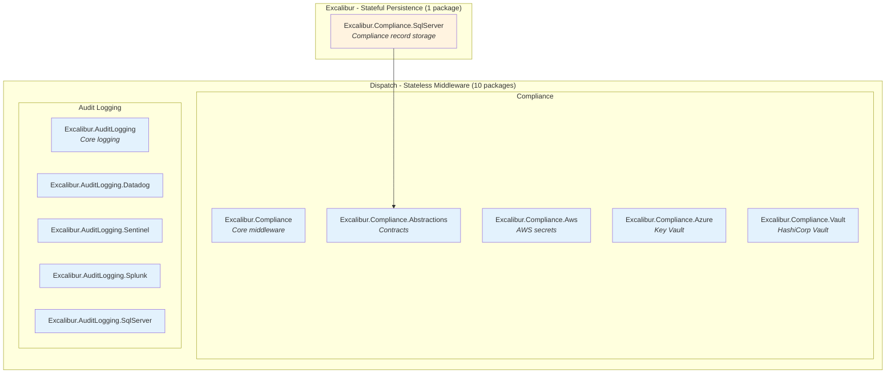
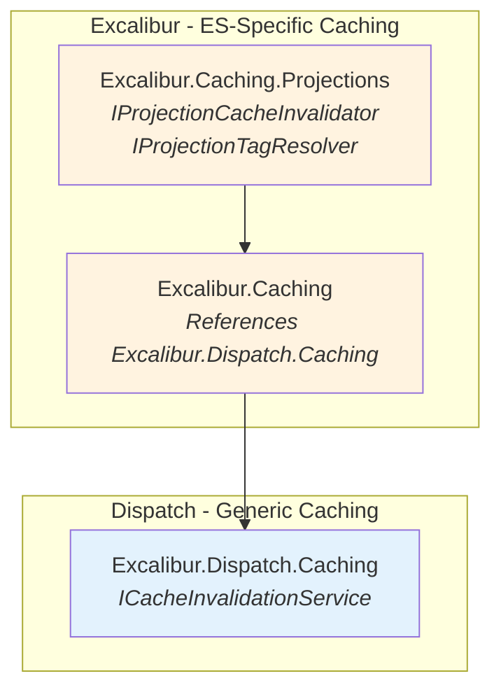
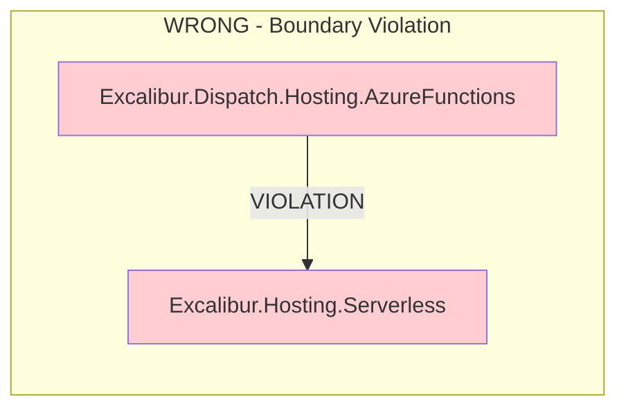

# Package Ownership Diagrams

**Created:** W1.T1.4
**Last Updated:** 2026-01-09
**Related:** [Dispatch-Excalibur Boundary Contract](../../management/architecture/adr-078-dispatch-excalibur-boundary-contract.md), [Dispatch Scope Reduction](../../management/architecture/adr-074-dispatch-scope-reduction.md), [boundaries.md](./boundaries.md)

---

## Overview

These diagrams document the finalized package ownership decisions from the W1 Capability Ownership Realignment epic.

---

## 1. Hosting Package Ownership

All 13 hosting packages stay where they are - the architecture is correct.

```mermaid
graph TB
    subgraph "Dispatch Hosting (6 packages)"
        direction TB
        D1["Excalibur.Dispatch.Hosting.AspNetCore<br/><i>HTTP -> message routing</i>"]
        D2["Excalibur.Dispatch.Hosting.AzureFunctions<br/><i>Azure trigger -> message flow</i>"]
        D3["Excalibur.Dispatch.Hosting.AwsLambda<br/><i>AWS trigger -> message flow</i>"]
        D4["Excalibur.Dispatch.Hosting.GoogleCloudFunctions<br/><i>GCP trigger -> message flow</i>"]
        D5["Excalibur.Dispatch.Hosting.Serverless.Abstractions<br/><i>Serverless contracts</i>"]
        D6["Excalibur.Dispatch.Patterns.Hosting.Json<br/><i>JSON serialization</i>"]
    end

    subgraph "Excalibur Hosting (7 packages)"
        direction TB
        E1["Excalibur.Hosting<br/><i>Core infrastructure setup</i>"]
        E2["Excalibur.Hosting.Web<br/><i>Web infrastructure</i>"]
        E3["Excalibur.Hosting.AzureFunctions<br/><i>Azure Functions infrastructure</i>"]
        E4["Excalibur.Hosting.AwsLambda<br/><i>Lambda infrastructure</i>"]
        E5["Excalibur.Hosting.GoogleCloudFunctions<br/><i>GCP infrastructure</i>"]
        E7["Excalibur.Hosting.Jobs<br/><i>Background job infrastructure</i>"]
    end

    E3 --> D2
    E4 --> D3
    E5 --> D4

    style D1 fill:#e3f2fd
    style D2 fill:#e3f2fd
    style D3 fill:#e3f2fd
    style D4 fill:#e3f2fd
    style D5 fill:#e3f2fd
    style D6 fill:#e3f2fd
    style E1 fill:#fff3e0
    style E2 fill:#fff3e0
    style E3 fill:#fff3e0
    style E4 fill:#fff3e0
    style E5 fill:#fff3e0
    style E7 fill:#fff3e0
```

**Key Insight:** Excalibur hosting packages reference Dispatch hosting packages (correct direction). Dispatch packages NEVER reference Excalibur.

---

## 2. Compliance & Audit Ownership

The stateless/stateful distinction determines ownership.

**Key Insight:** Dispatch handles HOW compliance flows (middleware). Excalibur handles WHAT gets stored (persistence).

---

## 3. Caching Ownership

Generic caching vs projection-specific caching.

**Key Insight:** Excalibur.Caching extends Excalibur.Dispatch.Caching with projection-specific functionality.

---

## 4. Dependency Direction (Master Diagram)

The fundamental rule: **Dispatch does NOT depend on Excalibur**.

```mermaid
graph TB
    subgraph "Excalibur Layer"
        direction TB
        EH["Excalibur.Hosting.*"]
        EES["Excalibur.EventSourcing.*"]
        ES["Excalibur.Saga.*"]
        EO["Excalibur.Outbox.*"]
        ELE["Excalibur.LeaderElection.*"]
        EC["Excalibur.Caching.*"]
        EComp["Excalibur.Compliance.SqlServer"]
        ED["Excalibur.Domain"]
        EDA["Excalibur.Data.Abstractions"]
    end

    subgraph "Dispatch Layer"
        direction TB
        DH["Excalibur.Dispatch.Hosting.*"]
        DA["Excalibur.Dispatch.Abstractions"]
        D["Dispatch"]
        DC["Excalibur.Dispatch.Caching"]
        DComp["Excalibur.Compliance.*"]
        DAL["Excalibur.AuditLogging.*"]
        DT["Excalibur.Dispatch.Transport.*"]
    end

    EH --> DH
    EES --> DA
    ES --> DA
    EO --> DA
    ELE --> DA
    EC --> DC
    EComp --> DComp
    ED --> DA

    style EH fill:#fff3e0
    style EES fill:#fff3e0
    style ES fill:#fff3e0
    style EO fill:#fff3e0
    style ELE fill:#fff3e0
    style EC fill:#fff3e0
    style EComp fill:#fff3e0
    style ED fill:#fff3e0
    style EDA fill:#fff3e0
    style DH fill:#e3f2fd
    style DA fill:#e3f2fd
    style D fill:#e3f2fd
    style DC fill:#e3f2fd
    style DComp fill:#e3f2fd
    style DAL fill:#e3f2fd
    style DT fill:#e3f2fd
```

**Legend:**
- Blue (Dispatch): Messaging framework - pipeline, middleware, transports
- Orange (Excalibur): Application framework - CQRS, event sourcing, persistence

---

## Corrective Action Example

An attempt to consolidate serverless abstractions would have created this violation:

**Lesson Learned:** The `SkipDependencyValidation` flag exists for controlled migrations where types are temporarily in both locations. It is NOT for creating permanent bypass exceptions.

---

## W1 Capability Ownership Summary

| Task | Outcome |
|------|---------|
| T1.2: Projection caching | Moved to `Excalibur.Caching.Projections` |
| T1.3: Compliance/audit | Boundaries verified correct (no migration) |
| T1.1: Hosting analysis | All 13 packages stay in place (corrective action) |
| T1.4: Documentation | This document and architecture decision updates |

**W1 Epic (Excalibur.Dispatch-7frqs): 100% COMPLETE**

---

## See Also

- [Dispatch-Excalibur Boundary Contract](../../management/architecture/adr-078-dispatch-excalibur-boundary-contract.md)
- [Dispatch Scope Reduction](../../management/architecture/adr-074-dispatch-scope-reduction.md)
- [Architecture Boundaries](./boundaries.md)

